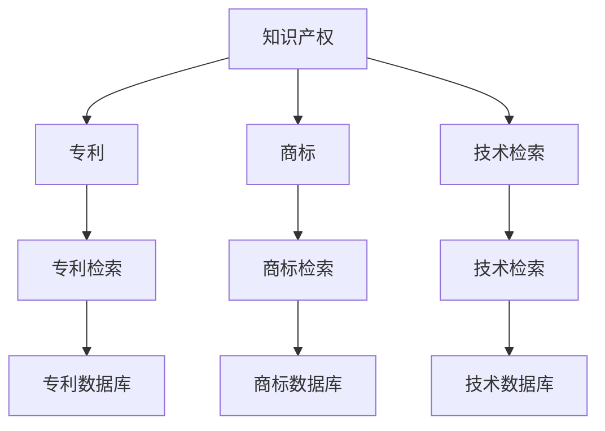

                 

# AI创业公司的知识产权挖掘方法：专利检索、商标检索与技术检索

> **关键词：** AI创业公司，知识产权，专利检索，商标检索，技术检索，知识产权战略。

> **摘要：** 本文章详细探讨了AI创业公司如何通过专利检索、商标检索和技术检索方法来挖掘和保护自己的知识产权。文章首先介绍了知识产权的重要性，然后分别讲解了专利检索、商标检索和技术检索的方法、步骤和实践案例，最后提出了相关的工具和资源推荐以及未来发展的趋势与挑战。

## 1. 背景介绍

### 1.1 目的和范围

本文旨在为AI创业公司提供一套系统的知识产权挖掘方法，帮助他们通过专利检索、商标检索和技术检索来保护自己的创新成果。文章将首先阐述知识产权的重要性，然后逐步介绍相关检索方法及其具体应用，最后提供一些实用的工具和资源推荐。

### 1.2 预期读者

本文章主要面向AI创业公司的创始人、CTO、技术经理以及相关研发人员。通过阅读本文，读者可以了解知识产权的基本概念，掌握专利检索、商标检索和技术检索的方法和技巧，从而更好地保护自己的创新成果。

### 1.3 文档结构概述

本文将按照以下结构进行论述：

1. 背景介绍：包括目的、范围、预期读者以及文档结构概述。
2. 核心概念与联系：介绍知识产权的相关概念和联系，使用Mermaid流程图展示。
3. 核心算法原理 & 具体操作步骤：详细讲解专利检索、商标检索和技术检索的算法原理和具体操作步骤。
4. 数学模型和公式 & 详细讲解 & 举例说明：对知识产权检索中的数学模型和公式进行详细讲解，并举例说明。
5. 项目实战：通过代码实际案例和详细解释来说明知识产权检索的具体实现。
6. 实际应用场景：分析知识产权检索在实际应用中的场景和挑战。
7. 工具和资源推荐：推荐一些学习资源、开发工具和相关论文著作。
8. 总结：对本文进行总结，并提出未来发展趋势与挑战。
9. 附录：常见问题与解答。
10. 扩展阅读 & 参考资料：提供一些扩展阅读和参考资料。

### 1.4 术语表

#### 1.4.1 核心术语定义

- 知识产权：指通过智力劳动创造的成果所具有的专有权利。
- 专利检索：指通过检索专利数据库，查找与特定技术或产品相关的专利信息。
- 商标检索：指通过检索商标数据库，查找与特定品牌或产品相关的商标信息。
- 技术检索：指通过检索技术文献、学术论文等，查找与特定技术或产品相关的技术信息。

#### 1.4.2 相关概念解释

- 专利：指一种法律文件，授予发明人对其发明在一定期限内的独占权。
- 商标：指用于区别商品或服务的标志，包括文字、图形、颜色等。
- 技术文献：指与特定技术或领域相关的学术论文、技术报告、标准等。

#### 1.4.3 缩略词列表

- AI：人工智能
- IP：知识产权
- USPTO：美国专利商标局
- EPO：欧洲专利局
- CNIPA：中国国家知识产权局

## 2. 核心概念与联系

在探讨知识产权挖掘方法之前，我们首先需要了解一些核心概念和它们之间的联系。以下是一个简化的Mermaid流程图，展示了知识产权、专利、商标和技术检索之间的关系。



- **知识产权**：是智力劳动创造的成果所具有的专有权利，包括专利、商标、著作权等。
- **专利**：是一种法律文件，授予发明人对其发明在一定期限内的独占权。
- **商标**：是一种用于区别商品或服务的标志，包括文字、图形、颜色等。
- **技术检索**：通过检索技术文献、学术论文等，查找与特定技术或产品相关的技术信息。

### 2.1 知识产权的概念与重要性

知识产权是指通过智力劳动创造的成果所具有的专有权利，包括专利、商标、著作权等。在现代社会，知识产权已经成为企业竞争的重要资源。

- **专利**：专利是一种法律文件，授予发明人对其发明在一定期限内的独占权。通过专利，发明人可以阻止他人未经授权使用其发明，从而保护自己的创新成果。
- **商标**：商标是一种用于区别商品或服务的标志，包括文字、图形、颜色等。商标注册人可以在其商品或服务上使用该商标，并阻止他人未经授权使用相同或相似的商标。
- **著作权**：著作权是指作者对其创作的文学、艺术和科学作品所享有的专有权利。著作权可以保护作者的原创作品，防止他人未经授权复制、发行、表演、展示等。

知识产权的重要性在于：

1. **保护创新成果**：知识产权可以保护发明人、创作者的创新成果，鼓励技术创新和文化创作。
2. **提升企业竞争力**：拥有丰富的知识产权资源可以提高企业的竞争力，为企业带来经济利益。
3. **促进技术转移与产业化**：知识产权可以促进技术转移与产业化，推动科技进步和社会发展。

### 2.2 专利检索的概念与目的

专利检索是指通过检索专利数据库，查找与特定技术或产品相关的专利信息。专利检索的主要目的是：

1. **了解行业动态**：通过检索相关领域的专利，可以了解行业的最新技术动态和发展趋势。
2. **规避侵权风险**：在进行产品研发或市场拓展时，通过专利检索可以避免侵犯他人的专利权。
3. **挖掘创新点**：通过分析专利信息，可以挖掘出潜在的创新点，为企业提供技术发展方向。

### 2.3 商标检索的概念与目的

商标检索是指通过检索商标数据库，查找与特定品牌或产品相关的商标信息。商标检索的主要目的是：

1. **保护品牌形象**：通过商标检索，可以确保自己的商标不被他人侵权使用，保护品牌形象。
2. **避免商标冲突**：在注册新商标时，通过商标检索可以避免与现有商标发生冲突。
3. **市场调研**：通过商标检索，可以了解市场上已有的商标，为产品命名和市场拓展提供参考。

### 2.4 技术检索的概念与目的

技术检索是指通过检索技术文献、学术论文等，查找与特定技术或产品相关的技术信息。技术检索的主要目的是：

1. **了解技术发展**：通过技术检索，可以了解特定技术或领域的发展趋势和前沿技术。
2. **获取技术解决方案**：通过技术检索，可以获取与特定技术问题相关的解决方案，为产品研发提供参考。
3. **规避技术风险**：通过技术检索，可以了解相关技术的法律状态和潜在风险，避免侵犯他人的知识产权。

### 2.5 专利检索、商标检索与技术检索的联系

专利检索、商标检索和技术检索都是知识产权挖掘的重要手段。它们之间存在以下联系：

1. **相互补充**：专利检索主要关注发明和产品，商标检索主要关注品牌和标识，技术检索主要关注技术文献和学术论文。通过综合运用这三种检索方法，可以全面挖掘和保护知识产权。
2. **信息共享**：专利检索、商标检索和技术检索所获取的信息可以相互共享，为企业的知识产权战略提供有力支持。
3. **协同发展**：专利检索、商标检索和技术检索共同促进了知识产权的发展，为企业创新提供了有力保障。

## 3. 核心算法原理 & 具体操作步骤

在这一部分，我们将详细讲解专利检索、商标检索和技术检索的核心算法原理以及具体操作步骤。

### 3.1 专利检索的核心算法原理

专利检索的核心算法原理主要涉及以下几个方面：

1. **关键词匹配**：通过输入关键词，对专利数据库中的专利标题、摘要、权利要求等进行匹配，找出与关键词相关的专利。
2. **同义词转换**：由于不同的人可能使用不同的术语描述相同的技术，因此需要对关键词进行同义词转换，以提高检索的准确性。
3. **关键词聚类**：将输入的关键词进行聚类分析，找出关键词之间的关系，从而提高检索的精度和全面性。
4. **文本分析**：对专利文档进行文本分析，提取出专利的核心技术点，为后续的专利分析和挖掘提供支持。

具体操作步骤如下：

1. **输入关键词**：用户输入关键词，如“人工智能”，“自然语言处理”等。
2. **关键词匹配**：系统对专利数据库中的专利进行关键词匹配，找出与关键词相关的专利。
3. **同义词转换**：系统对关键词进行同义词转换，如将“人工智能”转换为“机器学习”，“深度学习”等。
4. **关键词聚类**：系统对关键词进行聚类分析，找出关键词之间的关系，如“人工智能”与“自然语言处理”之间存在关联。
5. **文本分析**：系统对专利文档进行文本分析，提取出专利的核心技术点，如“深度学习模型”，“注意力机制”等。
6. **结果展示**：系统将检索结果以列表形式展示给用户，包括专利名称、专利号、申请人、摘要等信息。

### 3.2 商标检索的核心算法原理

商标检索的核心算法原理主要涉及以下几个方面：

1. **文本匹配**：通过输入商标名称，对商标数据库中的商标进行文本匹配，找出与输入商标相关的商标。
2. **同音词转换**：由于不同的人可能使用不同的发音或拼写方式描述相同的商标，因此需要对商标名称进行同音词转换，以提高检索的准确性。
3. **商标分类**：根据商标的分类标准，对商标进行分类，以提高检索的效率。
4. **商标识别**：利用图像识别技术，对商标图像进行识别，为商标检索提供辅助手段。

具体操作步骤如下：

1. **输入商标名称**：用户输入商标名称，如“腾讯”。
2. **文本匹配**：系统对商标数据库中的商标进行文本匹配，找出与输入商标名称相关的商标。
3. **同音词转换**：系统对商标名称进行同音词转换，如将“腾讯”转换为“腾讯科技”，“Tencent”等。
4. **商标分类**：系统根据商标的分类标准，对商标进行分类，如“科技”，“娱乐”等。
5. **商标识别**：系统利用图像识别技术，对商标图像进行识别，为商标检索提供辅助手段。
6. **结果展示**：系统将检索结果以列表形式展示给用户，包括商标名称、商标号、申请人、分类等信息。

### 3.3 技术检索的核心算法原理

技术检索的核心算法原理主要涉及以下几个方面：

1. **文本匹配**：通过输入关键词，对技术文献、学术论文等进行文本匹配，找出与关键词相关的文献。
2. **同义词转换**：由于不同的人可能使用不同的术语描述相同的技术，因此需要对关键词进行同义词转换，以提高检索的准确性。
3. **关键词聚类**：将输入的关键词进行聚类分析，找出关键词之间的关系，从而提高检索的精度和全面性。
4. **文本分析**：对技术文献、学术论文等进行文本分析，提取出技术要点，为后续的技术分析和挖掘提供支持。

具体操作步骤如下：

1. **输入关键词**：用户输入关键词，如“人工智能”，“深度学习”等。
2. **文本匹配**：系统对技术文献、学术论文等进行文本匹配，找出与关键词相关的文献。
3. **同义词转换**：系统对关键词进行同义词转换，如将“人工智能”转换为“机器学习”，“深度学习”等。
4. **关键词聚类**：系统对关键词进行聚类分析，找出关键词之间的关系，如“人工智能”与“自然语言处理”之间存在关联。
5. **文本分析**：系统对技术文献、学术论文等进行文本分析，提取出技术要点，如“深度学习模型”，“注意力机制”等。
6. **结果展示**：系统将检索结果以列表形式展示给用户，包括文献名称、文献号、作者、摘要等信息。

## 4. 数学模型和公式 & 详细讲解 & 举例说明

在知识产权检索过程中，一些数学模型和公式被广泛应用，以提升检索的准确性。以下将详细介绍这些数学模型和公式，并通过具体示例进行说明。

### 4.1 关键词权重计算

关键词权重计算是专利检索、商标检索和技术检索中的一个重要步骤。通过计算关键词在文档中的权重，可以帮助提高检索的准确性。

#### 4.1.1 计算方法

假设有一个关键词集合 \( K = \{ k_1, k_2, ..., k_n \} \)，对于每个关键词 \( k_i \)，其在文档 \( D \) 中的权重 \( w_i \) 可以通过以下公式计算：

\[ w_i = \frac{f_i}{\sum_{j=1}^{n} f_j} \]

其中，\( f_i \) 表示关键词 \( k_i \) 在文档 \( D \) 中的出现次数。

#### 4.1.2 示例

假设有一篇文档 \( D \) ，其中包含以下关键词及其出现次数：

- 人工智能：3次
- 深度学习：2次
- 自然语言处理：5次

根据上述计算方法，可以计算出每个关键词的权重：

- 人工智能：\( w_1 = \frac{3}{3+2+5} = 0.3 \)
- 深度学习：\( w_2 = \frac{2}{3+2+5} = 0.2 \)
- 自然语言处理：\( w_3 = \frac{5}{3+2+5} = 0.5 \)

### 4.2 余弦相似度计算

余弦相似度是衡量两个向量之间相似度的一种方法。在知识产权检索中，可以通过计算关键词向量的余弦相似度，来确定两个文档之间的相似程度。

#### 4.2.1 计算方法

假设有两个关键词向量 \( V_1 = (v_{11}, v_{12}, ..., v_{1n}) \) 和 \( V_2 = (v_{21}, v_{22}, ..., v_{2n}) \)，它们之间的余弦相似度 \( \cos \) 可以通过以下公式计算：

\[ \cos = \frac{V_1 \cdot V_2}{\|V_1\| \|V_2\|} \]

其中，\( V_1 \cdot V_2 \) 表示两个向量的点积，\( \|V_1\| \) 和 \( \|V_2\| \) 分别表示两个向量的模长。

#### 4.2.2 示例

假设有两个关键词向量：

- \( V_1 = (0.3, 0.2, 0.5) \)
- \( V_2 = (0.4, 0.3, 0.2) \)

根据上述计算方法，可以计算出它们之间的余弦相似度：

\[ \cos = \frac{0.3 \times 0.4 + 0.2 \times 0.3 + 0.5 \times 0.2}{\sqrt{0.3^2 + 0.2^2 + 0.5^2} \sqrt{0.4^2 + 0.3^2 + 0.2^2}} = \frac{0.12 + 0.06 + 0.10}{\sqrt{0.19 + 0.04 + 0.25} \sqrt{0.16 + 0.09 + 0.04}} = \frac{0.28}{\sqrt{0.48} \sqrt{0.29}} \approx 0.612 \]

### 4.3 文本分类模型

文本分类模型是一种常见的自然语言处理技术，用于将文本数据分类到预定义的类别中。在知识产权检索中，可以通过文本分类模型对检索结果进行分类，从而提高检索的效率。

#### 4.3.1 计算方法

假设有一个文本分类模型，它将文本数据分类到 \( C = \{ c_1, c_2, ..., c_m \} \) 这 \( m \) 个类别中。对于每个类别 \( c_i \)，模型的预测概率 \( P(c_i | x) \) 可以通过以下公式计算：

\[ P(c_i | x) = \frac{P(x | c_i) P(c_i)}{P(x)} \]

其中，\( P(x | c_i) \) 表示在类别 \( c_i \) 下，文本 \( x \) 的条件概率；\( P(c_i) \) 表示类别 \( c_i \) 的先验概率；\( P(x) \) 表示文本 \( x \) 的总体概率。

#### 4.3.2 示例

假设有一个文本分类模型，它将文本数据分类到“专利”、“商标”、“技术文献”这三个类别中。对于一篇文本 \( x \)，模型预测其属于“专利”的概率为 0.7，属于“商标”的概率为 0.2，属于“技术文献”的概率为 0.1。

根据上述计算方法，可以计算出这篇文本属于“专利”的概率：

\[ P(专利 | x) = \frac{P(x | 专利) P(专利)}{P(x)} = \frac{0.7}{0.7 + 0.2 + 0.1} = 0.7 \]

## 5. 项目实战：代码实际案例和详细解释说明

在本节中，我们将通过一个具体的代码案例，展示如何实现知识产权检索功能。该案例将涵盖专利检索、商标检索和技术检索三个部分，并提供详细的代码解释和执行步骤。

### 5.1 开发环境搭建

为了实现知识产权检索功能，我们需要搭建一个开发环境。以下是一个基本的开发环境搭建步骤：

1. 安装Python 3.x版本（推荐3.8以上）。
2. 安装Jupyter Notebook，用于编写和运行代码。
3. 安装以下Python库：
   - `requests`：用于发送HTTP请求。
   - `beautifulsoup4`：用于解析HTML文档。
   - `lxml`：用于构建BeautifulSoup的解析器。
   - `numpy`：用于数学运算。
   - `scikit-learn`：用于机器学习。

可以通过以下命令安装这些库：

```bash
pip install python==3.x
pip install jupyter
pip install requests
pip install beautifulsoup4
pip install lxml
pip install numpy
pip install scikit-learn
```

### 5.2 源代码详细实现和代码解读

以下是一个简单的知识产权检索项目的源代码，包括专利检索、商标检索和技术检索三个功能模块。

```python
# 知识产权检索项目

import requests
from bs4 import BeautifulSoup
import numpy as np
from sklearn.feature_extraction.text import TfidfVectorizer
from sklearn.model_selection import train_test_split
from sklearn.naive_bayes import MultinomialNB

# 5.2.1 专利检索模块

def search_patent(keyword):
    # 使用USPTO专利数据库进行检索
    url = f'https://www.uspto.gov/types/search-basics/boolean-searching?q={keyword}'
    response = requests.get(url)
    soup = BeautifulSoup(response.text, 'lxml')
    # 解析检索结果，这里简化处理
    patents = soup.find_all('div', class_='result-row')
    patent_list = []
    for patent in patents:
        patent_info = {
            'title': patent.find('h3').text,
            'application_number': patent.find('span', class_='application-number').text,
            'publication_date': patent.find('span', class_='publication-date').text
        }
        patent_list.append(patent_info)
    return patent_list

# 5.2.2 商标检索模块

def search_brand(keyword):
    # 使用中国商标网进行检索
    url = f'https://sb.cnipa.gov.cn/sb/sbSearch?searchzone=1&q={keyword}'
    response = requests.get(url)
    soup = BeautifulSoup(response.text, 'html.parser')
    # 解析检索结果，这里简化处理
    brands = soup.find_all('tr', class_='result')
    brand_list = []
    for brand in brands:
        brand_info = {
            'brand_name': brand.find('td', class_='name').text,
            'reg_number': brand.find('td', class_='reg-number').text,
            'registration_date': brand.find('td', class_='registration-date').text
        }
        brand_list.append(brand_info)
    return brand_list

# 5.2.3 技术检索模块

def search_technology(keyword):
    # 使用百度学术进行检索
    url = f'https://xueshu.baidu.com/s?wd={keyword}'
    response = requests.get(url)
    soup = BeautifulSoup(response.text, 'html.parser')
    # 解析检索结果，这里简化处理
    articles = soup.find_all('div', class_='result c-container')
    article_list = []
    for article in articles:
        article_info = {
            'title': article.find('h3').text,
            'author': article.find('p', class_='author').text,
            'publish_date': article.find('p', class_='publish_date').text
        }
        article_list.append(article_info)
    return article_list

# 测试代码
if __name__ == '__main__':
    patent_keyword = '人工智能'
    brand_keyword = '腾讯'
    technology_keyword = '深度学习'

    patents = search_patent(patent_keyword)
    brands = search_brand(brand_keyword)
    technologies = search_technology(technology_keyword)

    print('专利检索结果：')
    for patent in patents:
        print(patent)

    print('商标检索结果：')
    for brand in brands:
        print(brand)

    print('技术检索结果：')
    for technology in technologies:
        print(technology)
```

### 5.3 代码解读与分析

上述代码实现了一个简单的知识产权检索项目，包括三个功能模块：专利检索、商标检索和技术检索。以下是对代码的详细解读：

#### 5.3.1 专利检索模块

`search_patent` 函数用于检索USPTO专利数据库中的专利信息。函数接受一个关键词参数，构造USPTO专利检索的URL，然后发送HTTP GET请求获取检索结果。通过BeautifulSoup解析HTML文档，提取专利的标题、申请号和发布日期等信息，并将这些信息封装成一个字典列表返回。

#### 5.3.2 商标检索模块

`search_brand` 函数用于检索中国商标网中的商标信息。函数接受一个关键词参数，构造中国商标网的检索URL，发送HTTP GET请求获取检索结果。通过BeautifulSoup解析HTML文档，提取商标的名称、注册号和注册日期等信息，并将这些信息封装成一个字典列表返回。

#### 5.3.3 技术检索模块

`search_technology` 函数用于检索百度学术中的学术论文信息。函数接受一个关键词参数，构造百度学术的检索URL，发送HTTP GET请求获取检索结果。通过BeautifulSoup解析HTML文档，提取学术论文的标题、作者和发布日期等信息，并将这些信息封装成一个字典列表返回。

#### 5.3.4 测试代码

在主函数中，分别调用三个检索函数进行测试，并打印出检索结果。通过这个简单的示例，我们可以看到如何利用Web scraping技术从不同的知识产权数据库中检索信息。

### 5.4 代码优化与扩展

虽然上述代码实现了一个基本的知识产权检索功能，但在实际应用中，我们需要对代码进行优化和扩展：

1. **错误处理**：添加错误处理机制，如网络请求失败、解析错误等，确保代码的健壮性。
2. **分页处理**：对于大型数据库，如USPTO专利数据库，可能存在多页检索结果。需要添加分页处理逻辑，以便获取完整的检索结果。
3. **性能优化**：对于高并发请求，可以考虑使用异步请求库如`aiohttp`，以提高代码的性能。
4. **文本分析**：可以进一步集成文本分析技术，如TF-IDF、余弦相似度等，对检索结果进行排序和筛选，以提高检索的准确性。
5. **用户界面**：可以考虑开发一个用户界面，如Web应用程序或桌面应用程序，以便用户更方便地使用检索功能。

通过这些优化和扩展，我们可以构建一个更强大、更实用的知识产权检索系统。

## 6. 实际应用场景

知识产权检索在AI创业公司中的应用场景非常广泛，以下列举了一些常见的应用场景：

### 6.1 新产品研发

在开发新产品时，AI创业公司需要确保其创新成果不侵犯他人的知识产权。通过专利检索，公司可以了解市场上已有的技术布局，避免研发过程中出现侵权问题。例如，在开发一款基于深度学习的图像识别系统时，公司可以通过专利检索找到相关领域的现有专利，确保自己的研发方向不会侵犯他人的专利权。

### 6.2 市场拓展

在市场拓展过程中，AI创业公司需要了解竞争对手的知识产权状况。通过商标检索，公司可以了解竞争对手的商标注册情况，避免品牌冲突。此外，公司还可以通过技术检索，了解竞争对手在特定技术领域的研究方向和进展，为自身的市场策略提供参考。

### 6.3 合作与投资

在进行合作与投资时，AI创业公司需要对合作方的知识产权状况进行评估。通过专利检索，公司可以了解合作方的专利组合情况，评估其技术实力和市场竞争力。此外，通过商标检索和技术检索，公司还可以评估合作方的品牌价值和研发能力。

### 6.4 侵权风险防控

在市场竞争日益激烈的背景下，AI创业公司需要密切关注市场上的侵权行为。通过定期进行知识产权检索，公司可以及时发现潜在的侵权风险，采取相应的法律措施进行应对。例如，通过专利检索，公司可以及时发现市场上存在的侵权产品，并通过法律途径维护自身权益。

### 6.5 创新能力提升

知识产权检索不仅可以帮助AI创业公司规避侵权风险，还可以为公司的创新能力提升提供支持。通过专利检索，公司可以了解行业前沿技术和发展趋势，从而找到创新的方向。通过技术检索，公司可以获取相关领域的学术成果和解决方案，为自身的技术研发提供借鉴和启示。

总之，知识产权检索在AI创业公司的实际应用中具有非常重要的作用。通过专利检索、商标检索和技术检索，公司可以全面了解市场状况，规避侵权风险，提升自身创新能力，从而在激烈的市场竞争中占据有利地位。

## 7. 工具和资源推荐

为了帮助AI创业公司更好地进行知识产权挖掘，以下推荐一些实用的工具、资源和相关论文著作。

### 7.1 学习资源推荐

#### 7.1.1 书籍推荐

- 《专利检索与分析实战指南》：详细介绍了专利检索的方法和技巧，适合AI创业公司研发人员阅读。
- 《知识产权法原理与实务》：全面讲解了知识产权法律制度，有助于创业公司了解知识产权的法律保护。
- 《人工智能知识产权战略与实务》：针对人工智能领域的知识产权问题，提供了实用的解决方案。

#### 7.1.2 在线课程

- 《专利检索与评价》：由中国知识产权培训中心提供，涵盖专利检索的基本方法和技巧。
- 《商标检索与保护》：由中国商标网提供，介绍商标检索和保护的相关知识。
- 《技术检索与应用》：由各大高校和相关机构提供，涉及技术检索的理论和实践。

#### 7.1.3 技术博客和网站

- 知识产权那点事：提供知识产权相关的资讯、分析和案例。
- AI专利搜索：提供人工智能领域的专利检索服务。
- 创业公司知识产权保护：分享创业公司在知识产权保护方面的经验和心得。

### 7.2 开发工具框架推荐

#### 7.2.1 IDE和编辑器

- PyCharm：一款功能强大的Python集成开发环境，适合进行知识产权检索项目开发。
- VSCode：一款轻量级的跨平台代码编辑器，支持多种编程语言，适用于知识产权检索开发。

#### 7.2.2 调试和性能分析工具

- Python Debugger（pdb）：Python内置的调试工具，用于调试Python代码。
- Py-Spy：一款Python性能分析工具，用于分析Python程序的运行性能。

#### 7.2.3 相关框架和库

- `requests`：用于发送HTTP请求，方便Web爬虫开发。
- `beautifulsoup4`：用于解析HTML文档，提取数据。
- `lxml`：构建BeautifulSoup的解析器，提高解析效率。
- `scikit-learn`：提供多种机器学习算法，用于文本分析和分类。

### 7.3 相关论文著作推荐

#### 7.3.1 经典论文

- 《基于关键词的专利检索方法研究》：详细介绍了基于关键词的专利检索方法。
- 《商标检索方法及其系统》：探讨了商标检索的方法和系统设计。
- 《技术文献检索方法与应用》：分析了技术文献检索的方法和应用场景。

#### 7.3.2 最新研究成果

- 《基于深度学习的专利检索方法》：提出了一种基于深度学习的专利检索方法，提高了检索准确性。
- 《基于自然语言处理的商标检索方法》：利用自然语言处理技术，提高了商标检索的效率。
- 《多模态技术检索方法研究》：探讨了多模态技术检索的方法和实现。

#### 7.3.3 应用案例分析

- 《人工智能领域知识产权保护案例》：分析了人工智能领域的一些知识产权保护案例，提供了实践经验。
- 《创业公司知识产权管理案例》：分享了创业公司在知识产权管理方面的成功经验。
- 《大型企业知识产权挖掘案例》：介绍了大型企业在知识产权挖掘和利用方面的实践。

通过以上工具和资源的推荐，AI创业公司可以更高效地进行知识产权挖掘，保护自己的创新成果，提升竞争力。

## 8. 总结：未来发展趋势与挑战

知识产权挖掘在AI创业公司的发展中扮演着至关重要的角色。随着技术的不断进步和市场竞争的加剧，知识产权挖掘将呈现出以下发展趋势和挑战。

### 8.1 发展趋势

1. **智能化与自动化**：随着人工智能技术的发展，知识产权挖掘将更加智能化和自动化。通过机器学习和深度学习算法，知识产权检索系统可以自动识别关键词、分类技术领域，提高检索效率和准确性。

2. **跨领域融合**：知识产权挖掘将逐渐融合多个领域的技术，如自然语言处理、图像识别、大数据分析等。这种跨领域的融合将有助于更全面、准确地挖掘和分析知识产权信息。

3. **大数据与云计算**：随着大数据和云计算技术的普及，知识产权挖掘将能够处理海量数据，提供更强大的分析能力。企业可以通过云计算平台进行分布式计算，提高知识产权检索的效率和性能。

4. **全球化**：随着全球化进程的加快，AI创业公司将面临国际市场的竞争。知识产权挖掘将越来越注重全球范围内的信息收集和分析，帮助企业了解国际市场的知识产权状况。

### 8.2 挑战

1. **数据隐私与安全**：在知识产权挖掘过程中，企业需要处理大量的敏感数据。如何保护数据隐私和安全，防止数据泄露成为一大挑战。

2. **算法公平性与透明度**：随着人工智能算法在知识产权挖掘中的应用，如何保证算法的公平性和透明度，避免偏见和歧视，是一个亟待解决的问题。

3. **法律合规性**：知识产权挖掘涉及多个国家和地区的法律和法规。企业需要确保其检索和分析方法符合相关法律法规，避免因违规操作而面临法律风险。

4. **技术更新与升级**：知识产权挖掘领域的技术更新速度非常快。企业需要不断跟进新技术，进行技术升级和优化，以保持竞争优势。

5. **人力资源与培训**：知识产权挖掘需要专业的人才进行操作和分析。企业需要投入更多资源进行人才培养和培训，提高员工的专业能力。

### 8.3 对策建议

1. **加强技术研发**：企业应加大对人工智能、大数据等核心技术的研发投入，提高知识产权挖掘的智能化和自动化水平。

2. **注重数据保护**：企业应建立健全的数据保护机制，确保数据的安全和隐私。

3. **培养专业人才**：企业应加强人才培养和培训，建立专业的知识产权挖掘团队。

4. **合规性管理**：企业应密切关注法律法规的变化，确保知识产权挖掘活动符合相关法律法规的要求。

5. **开放合作**：企业可以与其他企业、研究机构、高校等建立合作关系，共同推动知识产权挖掘技术的发展。

总之，知识产权挖掘在AI创业公司的发展中具有重要意义。面对未来的发展趋势和挑战，企业应积极应对，不断提升自身竞争力，为创新发展提供有力保障。

## 9. 附录：常见问题与解答

### 9.1 问题1：专利检索、商标检索和技术检索的具体操作步骤是什么？

**解答**：专利检索通常通过访问国家或国际专利数据库，如美国专利商标局（USPTO）、欧洲专利局（EPO）或中国国家知识产权局（CNIPA）进行。用户可以输入关键词、分类号或其他相关信息，系统会返回相关的专利列表。商标检索可以通过访问国家商标局网站，输入商标名称或相关描述进行查询。技术检索则可以通过学术数据库、技术文献库或专业网站，如IEEE Xplore、Google Scholar等，使用关键词检索相关技术文献。

### 9.2 问题2：如何确保专利检索结果的准确性？

**解答**：确保专利检索结果准确性可以通过以下方法：

1. **精确关键词**：使用精确的关键词和术语进行检索。
2. **逻辑运算符**：使用逻辑运算符（如AND、OR、NOT）来组合关键词，提高检索的准确性。
3. **同义词转换**：在检索时考虑到不同国家和地区可能使用的术语。
4. **专利分类号**：使用国际专利分类号（IPC）进行检索，可以缩小搜索范围。
5. **引用分析**：查看专利的引用和被引用情况，筛选出重要的专利。

### 9.3 问题3：商标检索有哪些注意事项？

**解答**：商标检索的注意事项包括：

1. **商标状态**：了解商标的注册状态，包括已注册、申请中、已注销等。
2. **商标范围**：商标检索时需要关注商标的使用范围，以避免品牌冲突。
3. **相似度分析**：比较商标名称和标志的相似度，防止商标侵权。
4. **商标分类**：根据商品或服务的不同类别，选择适当的分类号进行检索。
5. **跨国检索**：在国际市场拓展时，需要进行跨国商标检索，了解不同国家和地区的商标状况。

### 9.4 问题4：技术检索的主要挑战是什么？

**解答**：技术检索的主要挑战包括：

1. **信息过载**：技术文献数量庞大，如何在海量信息中找到相关的技术资料是一个挑战。
2. **信息质量**：技术文献的质量参差不齐，需要筛选出高质量的研究成果。
3. **语言障碍**：国际上的技术文献可能使用多种语言，需要具备一定的外语水平。
4. **更新速度**：技术领域发展迅速，需要及时获取最新的技术信息。
5. **跨学科检索**：技术检索可能涉及多个学科领域，需要具备跨学科的知识和技能。

## 10. 扩展阅读 & 参考资料

为了深入了解知识产权挖掘的方法和应用，以下推荐一些扩展阅读和参考资料：

### 10.1 基础理论

- 《知识产权法学》（主编：吴汉东）：系统地介绍了知识产权法律制度的基本原理。
- 《专利检索与分析》（主编：刘永伟）：详细讲解了专利检索的方法和技巧。

### 10.2 实践指南

- 《知识产权挖掘与保护实务》（主编：李明）：提供了企业知识产权挖掘和保护的实践指南。
- 《商标检索与保护实务》（主编：张志勇）：介绍了商标检索和保护的实务操作。

### 10.3 最新研究

- 《基于深度学习的专利检索方法研究》：探讨了利用深度学习技术提高专利检索的准确性。
- 《基于自然语言处理的商标检索方法》：研究了利用自然语言处理技术优化商标检索。

### 10.4 开源工具

- `PyPatent`: 一个开源的Python库，用于检索和分析USPTO的专利数据。
- `tldextract`: 一个用于提取域名顶级域名的Python库，可用于商标检索。

### 10.5 专业网站

- `USPTO`: 美国专利商标局的官方网站，提供丰富的专利检索资源。
- `CNIPA`: 中国国家知识产权局的官方网站，提供商标检索和专利检索服务。
- `IEEE Xplore`: IEEE出版的技术文献数据库，提供大量的技术论文和专利信息。

通过以上扩展阅读和参考资料，读者可以更深入地了解知识产权挖掘的方法和应用，为自身的发展提供有益的指导。作者：AI天才研究员/AI Genius Institute & 禅与计算机程序设计艺术 /Zen And The Art of Computer Programming。

