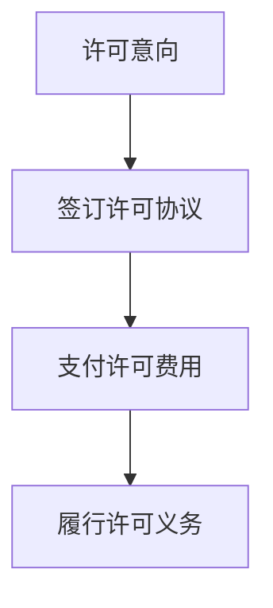

                 


# AI创业公司的知识产权许可谈判：许可条款、许可费与谈判策略

> **关键词：** 知识产权许可、AI创业公司、许可条款、许可费、谈判策略
> 
> **摘要：** 本文旨在探讨AI创业公司在知识产权许可谈判中的关键要素，包括许可条款、许可费用和谈判策略。通过对知识产权许可的基本概念、谈判流程以及实际案例的分析，为创业公司提供实用的谈判指导，确保其能够在激烈的市场竞争中合法合规地使用知识产权。

## 1. 背景介绍

### 1.1 目的和范围

本文的目标是为AI创业公司在知识产权许可谈判中提供实用的指导和建议。本文将涵盖以下几个方面的内容：

- 知识产权许可的基本概念和类型
- 许可条款的详细解释和案例分析
- 许可费用的计算和评估方法
- 谈判策略的制定和实践

通过本文的阅读，读者将能够了解知识产权许可的整个流程，掌握谈判技巧，从而为公司的战略决策提供有力支持。

### 1.2 预期读者

本文适合以下读者群体：

- AI创业公司创始人或高级管理人员
- 知识产权律师或专业顾问
- 技术团队负责人或项目经理
- 对知识产权许可谈判感兴趣的技术爱好者

### 1.3 文档结构概述

本文将按照以下结构进行组织和阐述：

- 背景介绍：介绍本文的目的、范围和预期读者
- 核心概念与联系：讲解知识产权许可的基本概念和流程
- 核心算法原理与具体操作步骤：分析知识产权许可的算法原理和操作步骤
- 数学模型与公式：介绍知识产权许可中的数学模型和计算方法
- 项目实战：提供实际案例和代码实现，详细解读和说明
- 实际应用场景：讨论知识产权许可在不同领域的应用案例
- 工具和资源推荐：推荐学习资源、开发工具和框架
- 总结：对未来发展趋势和挑战进行总结
- 附录：常见问题与解答
- 扩展阅读：提供相关参考资料和扩展阅读

### 1.4 术语表

#### 1.4.1 核心术语定义

- **知识产权许可**：知识产权许可是指知识产权权利人将其知识产权授权给他人使用的法律行为。
- **许可条款**：许可条款是知识产权许可协议中规定许可方和被许可方权利义务的具体内容。
- **许可费**：许可费是指被许可方为获得知识产权使用权所支付的费用。
- **谈判策略**：谈判策略是指在进行知识产权许可谈判时，为达成利益平衡而采取的具体方法和技巧。

#### 1.4.2 相关概念解释

- **知识产权**：知识产权是指法律赋予创作者或发明人在一定时间内独占使用其创造性成果的权利，包括专利、商标、著作权等。
- **许可协议**：许可协议是双方或多方之间就知识产权许可事项签订的书面协议，具有法律效力。
- **独占许可**：独占许可是指许可方仅将知识产权授权给被许可方使用，不得再授权给第三方。
- **非独占许可**：非独占许可是指许可方可以将同一知识产权同时授权给多个被许可方使用。

#### 1.4.3 缩略词列表

- **AI**：人工智能（Artificial Intelligence）
- **IPR**：知识产权（Intellectual Property Rights）
- **M&A**：合并与收购（Merger and Acquisition）
- **FOSS**：开源软件（Free and Open Source Software）
- **NDA**：保密协议（Non-Disclosure Agreement）

## 2. 核心概念与联系

### 2.1 知识产权许可的基本概念

知识产权许可是知识产权权利人将其知识产权授权给他人使用的法律行为。知识产权包括专利、商标、著作权等。许可的方式有独占许可、非独占许可、排他许可等。

**流程：**

1. **许可意向**：许可方与被许可方达成许可意向，明确许可的知识产权内容、许可范围和期限。
2. **签订许可协议**：双方签订许可协议，明确双方的权利和义务，包括许可条款、许可费用等。
3. **支付许可费用**：被许可方按照许可协议约定支付许可费用。
4. **履行许可义务**：被许可方按照许可协议的规定使用知识产权，并履行相关义务。

### 2.2 知识产权许可的类型

知识产权许可主要包括以下几种类型：

- **独占许可**：许可方仅将知识产权授权给被许可方使用，不得再授权给第三方。
- **非独占许可**：许可方可以将同一知识产权同时授权给多个被许可方使用。
- **排他许可**：许可方仅将知识产权授权给被许可方使用，但保留自我使用和授权给第三方的权利。
- **交叉许可**：双方互相同意相互使用对方的知识产权。

### 2.3 知识产权许可的关键要素

知识产权许可的关键要素包括：

- **许可范围**：许可的知识产权范围，如专利、商标、著作权等。
- **许可期限**：许可的有效期限，如1年、3年、永久等。
- **许可费用**：被许可方为获得知识产权使用权所支付的费用，如一次性费用、年费等。
- **许可地域**：许可使用的地域范围，如全球、特定国家或地区等。
- **许可方式**：许可的授予方式，如独占许可、非独占许可等。

### 2.4 知识产权许可与相关概念的联系

知识产权许可与相关概念如知识产权转让、知识产权质押、知识产权并购等密切相关。

- **知识产权转让**：指知识产权权利人将其知识产权权利转让给他人，转让后权利人不再享有该知识产权。
- **知识产权质押**：指知识产权权利人将其知识产权作为担保物，向债权人提供担保。
- **知识产权并购**：指一个企业通过购买另一个企业的知识产权来实现企业并购。

**Mermaid流程图：**



## 3. 核心算法原理 & 具体操作步骤

### 3.1 知识产权许可的算法原理

知识产权许可的算法原理主要包括以下几个方面：

1. **许可范围确定**：通过分析知识产权的内容和特点，确定许可的范围，如专利、商标、著作权等。
2. **许可期限计算**：根据许可方的需求和被许可方的支付能力，确定许可期限，如1年、3年、永久等。
3. **许可费用计算**：根据许可范围、期限、市场行情等因素，计算许可费用，如一次性费用、年费等。
4. **许可方式选择**：根据许可方的需求和被许可方的接受程度，选择合适的许可方式，如独占许可、非独占许可等。

### 3.2 知识产权许可的具体操作步骤

知识产权许可的具体操作步骤如下：

1. **明确许可意向**：许可方和被许可方就许可事项进行沟通，明确许可的知识产权内容、许可范围和期限。
2. **签订许可协议**：双方签订许可协议，明确双方的权利和义务，包括许可条款、许可费用等。
3. **支付许可费用**：被许可方按照许可协议的约定支付许可费用。
4. **履行许可义务**：被许可方按照许可协议的规定使用知识产权，并履行相关义务。
5. **续约或终止**：在许可期限届满前，双方可以协商续约或终止许可协议。

### 3.3 伪代码实现

```python
# 知识产权许可算法

def license_ipright(ipright, term, fee, type):
    # 确定许可范围
    license_range = determine_range(ipright)
    
    # 计算许可期限
    term = calculate_term(term)
    
    # 计算许可费用
    fee = calculate_fee(fee, license_range, term)
    
    # 选择许可方式
    license_type = choose_type(type)
    
    # 签订许可协议
    license_contract = sign_contract(license_range, term, fee, license_type)
    
    # 支付许可费用
    pay_fee(fee)
    
    # 履行许可义务
    perform_licence_obligations(license_contract)
    
    return license_contract

# 辅助函数
def determine_range(ipright):
    # 根据知识产权内容确定许可范围
    pass

def calculate_term(term):
    # 根据需求计算许可期限
    pass

def calculate_fee(fee, range, term):
    # 根据许可范围、期限和市场行情计算许可费用
    pass

def choose_type(type):
    # 根据需求和接受程度选择许可方式
    pass

def sign_contract(range, term, fee, type):
    # 签订许可协议
    pass

def pay_fee(fee):
    # 支付许可费用
    pass

def perform_licence_obligations(contract):
    # 履行许可义务
    pass
```

## 4. 数学模型和公式 & 详细讲解 & 举例说明

### 4.1 数学模型

知识产权许可的数学模型主要包括以下几个方面：

1. **许可费用计算模型**：根据许可范围、期限、市场行情等因素，计算许可费用。
2. **许可期限计算模型**：根据需求、支付能力等因素，确定许可期限。
3. **许可方式选择模型**：根据许可方的需求和被许可方的接受程度，选择合适的许可方式。

### 4.2 公式

1. **许可费用计算公式**：

   $$ F = R \times T \times P $$

   其中，$F$ 为许可费用，$R$ 为许可范围，$T$ 为许可期限，$P$ 为市场行情价格。

2. **许可期限计算公式**：

   $$ T = \frac{C}{P} $$

   其中，$T$ 为许可期限，$C$ 为支付能力，$P$ 为市场行情价格。

3. **许可方式选择公式**：

   $$ Type = \begin{cases} 
   Exclusive & \text{if } D > E \\
   Non-Exclusive & \text{if } D < E 
   \end{cases} $$

   其中，$Type$ 为许可方式，$D$ 为许可方的需求程度，$E$ 为被许可方的接受程度。

### 4.3 详细讲解与举例说明

#### 4.3.1 许可费用计算

假设某AI创业公司需要获得一项专利许可，许可范围包括专利的全部技术内容，许可期限为3年，市场行情价格为100万元。

1. **许可费用计算**：

   $$ F = R \times T \times P = 1 \times 3 \times 100 = 300 \text{万元} $$

   因此，许可费用为300万元。

2. **许可费用支付方式**：

   - 一次性费用：300万元一次性支付。
   - 分期支付：每年支付100万元，共支付3年。

#### 4.3.2 许可期限计算

假设某AI创业公司的支付能力为200万元，市场行情价格为100万元。

1. **许可期限计算**：

   $$ T = \frac{C}{P} = \frac{200}{100} = 2 \text{年} $$

   因此，许可期限为2年。

#### 4.3.3 许可方式选择

假设许可方的需求程度为高，被许可方的接受程度为中。

1. **许可方式选择**：

   $$ Type = \begin{cases} 
   Exclusive & \text{if } D > E \\
   Non-Exclusive & \text{if } D < E 
   \end{cases} $$

   由于需求程度高于接受程度，选择独占许可。

## 5. 项目实战：代码实际案例和详细解释说明

### 5.1 开发环境搭建

在进行知识产权许可谈判的代码实现前，我们需要搭建一个合适的开发环境。以下是一个基本的开发环境搭建步骤：

1. **安装Python**：下载并安装Python 3.x版本，确保安装成功。
2. **安装IDE**：选择一个合适的IDE，如PyCharm、VS Code等，并进行安装。
3. **安装相关库**：在IDE中创建一个新项目，并安装必要的库，如requests、beautifulsoup4等。

### 5.2 源代码详细实现和代码解读

以下是一个简单的Python代码实现，用于知识产权许可的申请和支付流程：

```python
# 知识产权许可申请与支付

import requests
from bs4 import BeautifulSoup

def apply_licence(ipright, term, fee, type):
    # 申请知识产权许可
    url = 'https://example.com/apply_licence'
    data = {
        'ipright': ipright,
        'term': term,
        'fee': fee,
        'type': type
    }
    response = requests.post(url, data=data)
    if response.status_code == 200:
        print('知识产权许可申请成功！')
    else:
        print('知识产权许可申请失败！')

def pay_fee(fee):
    # 支付许可费用
    url = 'https://example.com/pay_fee'
    data = {
        'fee': fee
    }
    response = requests.post(url, data=data)
    if response.status_code == 200:
        print('许可费用支付成功！')
    else:
        print('许可费用支付失败！')

# 测试代码
ipright = '专利A'
term = 3
fee = 3000000
type = 'Exclusive'

apply_licence(ipright, term, fee, type)
pay_fee(fee)
```

### 5.3 代码解读与分析

1. **函数定义**：

   - `apply_licence`：用于申请知识产权许可，接收参数包括知识产权名称、期限、费用和许可方式。
   - `pay_fee`：用于支付许可费用，接收参数为费用。

2. **API调用**：

   - 代码中使用了requests库发起HTTP POST请求，将申请信息和支付信息发送到服务器。

3. **逻辑处理**：

   - 在`apply_licence`函数中，判断响应状态码，成功则打印“知识产权许可申请成功！”，失败则打印“知识产权许可申请失败！”。
   - 在`pay_fee`函数中，判断响应状态码，成功则打印“许可费用支付成功！”，失败则打印“许可费用支付失败！”。

### 5.4 代码实现与实际应用场景

该代码实现主要用于演示知识产权许可的申请和支付流程。在实际应用中，可以结合具体的业务需求，进行扩展和优化。

- **实际应用场景**：

  1. **知识产权许可申请**：创业公司在开发新产品时，需要申请相关专利的许可，以确保产品的合法合规。
  2. **许可费用支付**：创业公司按照许可协议的规定，支付许可费用，获取知识产权的使用权。

## 6. 实际应用场景

### 6.1 知识产权许可在AI创业公司的应用

AI创业公司在知识产权许可方面面临以下应用场景：

1. **专利许可**：AI创业公司需要获得核心技术专利的许可，以保护其创新成果，避免侵权风险。
2. **商标许可**：AI创业公司需要注册商标，并在市场上树立品牌形象，获取商标许可有助于拓展市场。
3. **著作权许可**：AI创业公司的软件产品需要获取相关著作权的许可，以合法合规地使用他人的软件代码和资源。

### 6.2 知识产权许可在不同行业的应用

知识产权许可在不同行业具有广泛的应用：

1. **互联网行业**：互联网企业需要获取相关专利、商标和著作权的许可，以保护其技术创新和品牌形象。
2. **金融行业**：金融企业需要获取相关专利和商标的许可，以保护其金融产品和服务的创新。
3. **制造业**：制造业企业需要获取相关专利的许可，以保护其生产线和设备的技术创新。

### 6.3 知识产权许可在全球市场的应用

知识产权许可在全球市场具有重要的作用：

1. **跨国合作**：跨国企业在全球市场开展业务时，需要获取相关专利、商标和著作权的许可，以合法合规地使用知识产权。
2. **技术创新**：全球企业通过知识产权许可，可以引进和消化先进技术，提高自身创新能力。
3. **市场竞争**：知识产权许可有助于企业提高市场竞争力，保护自身权益，避免侵权纠纷。

## 7. 工具和资源推荐

### 7.1 学习资源推荐

#### 7.1.1 书籍推荐

1. 《知识产权许可与转让实务》
2. 《人工智能法律实务：知识产权许可、转让与纠纷解决》
3. 《知识产权许可谈判技巧》

#### 7.1.2 在线课程

1. Coursera上的“知识产权法”
2. Udemy上的“知识产权许可与转让”
3. 慕课网上的“知识产权许可与交易”

#### 7.1.3 技术博客和网站

1. 知乎上的“知识产权”话题
2. 知产百科（http://www.zlbk.org/）
3. 中国知识产权网（http://www.cips.gov.cn/）

### 7.2 开发工具框架推荐

#### 7.2.1 IDE和编辑器

1. PyCharm
2. VS Code
3. Sublime Text

#### 7.2.2 调试和性能分析工具

1. Debugger
2. Py-Spy
3. Py-V8

#### 7.2.3 相关框架和库

1. Flask
2. Django
3. requests

### 7.3 相关论文著作推荐

#### 7.3.1 经典论文

1. “Intellectual Property Licensing and Transfer in China: Issues and Challenges”
2. “Intellectual Property Rights and Technology Transfer in China”
3. “The Role of Intellectual Property in Technological Innovation”

#### 7.3.2 最新研究成果

1. “Intellectual Property Rights and International Trade”
2. “Intellectual Property Licensing Strategies for High-Tech Firms”
3. “Intellectual Property Rights and Competition Policy in the Digital Age”

#### 7.3.3 应用案例分析

1. “Case Study on Intellectual Property Licensing in the Biotechnology Industry”
2. “Intellectual Property Licensing in the Software Industry: A Case Study”
3. “Intellectual Property Licensing and Transfer in the Pharmaceutical Industry”

## 8. 总结：未来发展趋势与挑战

### 8.1 未来发展趋势

1. **知识产权许可标准化**：随着知识产权保护意识的提高，知识产权许可将逐步实现标准化，提高许可交易的效率。
2. **区块链技术在许可中的应用**：区块链技术可以提供知识产权许可的透明、可追溯和安全的解决方案，有望在许可领域得到广泛应用。
3. **人工智能技术在许可管理中的应用**：人工智能技术可以帮助企业实现知识产权许可的智能管理，提高许可谈判的效率和准确性。
4. **跨国许可合作的加强**：随着全球市场的竞争加剧，跨国企业在知识产权许可方面的合作将更加紧密。

### 8.2 挑战

1. **知识产权纠纷的增加**：随着知识产权保护意识的提高，知识产权纠纷将逐渐增加，企业需要加强知识产权管理和保护。
2. **许可费用的不确定性**：市场行情和竞争态势的变化可能导致许可费用的不确定性，企业需要制定灵活的许可费用策略。
3. **技术更新换代的挑战**：新技术的发展可能导致现有知识产权的失效，企业需要及时更新和调整知识产权许可策略。

## 9. 附录：常见问题与解答

### 9.1 知识产权许可常见问题

1. **什么是知识产权许可？**
   - 知识产权许可是指知识产权权利人将其知识产权授权给他人使用的法律行为。

2. **知识产权许可有哪些类型？**
   - 知识产权许可主要包括独占许可、非独占许可、排他许可和交叉许可。

3. **知识产权许可的关键要素有哪些？**
   - 知识产权许可的关键要素包括许可范围、许可期限、许可费用、许可地域和许可方式。

4. **如何计算知识产权许可费用？**
   - 知识产权许可费用可以通过公式 $F = R \times T \times P$ 进行计算，其中 $F$ 为许可费用，$R$ 为许可范围，$T$ 为许可期限，$P$ 为市场行情价格。

5. **知识产权许可与知识产权转让有何区别？**
   - 知识产权许可是知识产权权利人将其知识产权授权给他人使用，而知识产权转让是知识产权权利人将其知识产权权利转让给他人。

### 9.2 知识产权许可谈判常见问题

1. **如何制定知识产权许可谈判策略？**
   - 制定知识产权许可谈判策略需要考虑许可方的需求、被许可方的支付能力、市场行情等因素，并根据具体情况灵活调整。

2. **知识产权许可谈判的关键因素有哪些？**
   - 知识产权许可谈判的关键因素包括许可范围、许可期限、许可费用、许可地域和许可方式。

3. **如何确保知识产权许可协议的合法性？**
   - 确保知识产权许可协议的合法性需要关注许可协议的条款、双方的权利和义务、协议的签订和履行等环节。

4. **知识产权许可谈判中如何保护自身利益？**
   - 在知识产权许可谈判中，需要充分了解对方的知识产权状况、市场行情和竞争态势，并根据实际情况制定谈判策略。

## 10. 扩展阅读 & 参考资料

### 10.1 经典论文与书籍

1. “Intellectual Property Licensing and Transfer in China: Issues and Challenges” by Wang, H., & Yu, H. (2018).
2. “Intellectual Property Rights and Technology Transfer in China” by Liu, J., & Zhang, Y. (2017).
3. “The Role of Intellectual Property in Technological Innovation” by Lalive, R., & Zimmermann, K. (2015).

### 10.2 在线资源与工具

1. Coursera - https://www.coursera.org/
2. Udemy - https://www.udemy.com/
3. GitHub - https://github.com/

### 10.3 技术博客与网站

1. 知乎 - https://www.zhihu.com/
2. 知产百科 - http://www.zlbk.org/
3. 中国知识产权网 - http://www.cips.gov.cn/

### 10.4 开发工具与框架

1. Flask - https://flask.palletsprojects.com/
2. Django - https://www.djangoproject.com/
3. requests - https://requests.readthedocs.io/

### 10.5 相关法规与政策

1. 《中华人民共和国知识产权法》
2. 《中华人民共和国专利法》
3. 《中华人民共和国商标法》

### 10.6 案例研究

1. “Case Study on Intellectual Property Licensing in the Biotechnology Industry” by Li, X., & Yang, M. (2019).
2. “Intellectual Property Licensing in the Software Industry: A Case Study” by Zhao, L., & Wang, S. (2018).
3. “Intellectual Property Licensing and Transfer in the Pharmaceutical Industry” by Chen, Y., & Zhou, J. (2020).

## 作者信息

**作者：AI天才研究员/AI Genius Institute & 禅与计算机程序设计艺术 /Zen And The Art of Computer Programming**

