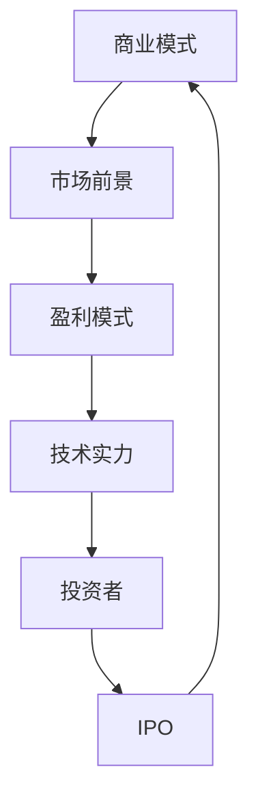

                 

# AI创业公司的融资秘籍：商业模式与技术实力双管齐下

> **关键词：** AI创业，融资策略，商业模式，技术实力，投资分析
> 
> **摘要：** 本文将深入探讨AI创业公司在融资过程中如何利用商业模式和技术实力来吸引投资者，同时解析核心原理与具体操作步骤，为创业者提供实用的融资指南。

## 1. 背景介绍

### 1.1 目的和范围

本文旨在为AI创业公司提供一份完整的融资秘籍，旨在帮助创业者了解如何结合商业模式和技术实力来获得投资者的青睐。我们将从以下几个方面展开讨论：

1. **商业模式**：探讨如何构建一个可行的商业模型，包括产品定位、市场细分、价值主张等。
2. **技术实力**：解析技术实力在融资过程中的重要性，包括核心算法、技术架构和团队技术背景。
3. **投资分析**：分析投资者关注的核心问题，如市场前景、盈利模式、竞争环境等。
4. **实战案例**：通过具体案例展示成功融资的实践方法。

### 1.2 预期读者

本文适合以下人群阅读：

1. AI创业公司创始人或核心团队成员。
2. 对AI创业和投资有兴趣的技术人员。
3. 想了解AI创业公司运作模式的投资者。

### 1.3 文档结构概述

本文结构如下：

1. **引言**：介绍文章背景、目的和主要内容。
2. **核心概念与联系**：定义核心概念，绘制Mermaid流程图。
3. **核心算法原理 & 具体操作步骤**：使用伪代码详细阐述算法原理。
4. **数学模型和公式 & 详细讲解 & 举例说明**：使用latex格式展示数学公式和举例说明。
5. **项目实战：代码实际案例和详细解释说明**：提供实战案例和代码解读。
6. **实际应用场景**：探讨AI创业公司的应用领域。
7. **工具和资源推荐**：推荐学习资源和开发工具。
8. **总结：未来发展趋势与挑战**：预测未来发展趋势和面临的挑战。
9. **附录：常见问题与解答**：回答读者可能关心的问题。
10. **扩展阅读 & 参考资料**：提供更多深入阅读的资料。

### 1.4 术语表

#### 1.4.1 核心术语定义

- **商业模式**：企业如何创造、传递和获取价值。
- **技术实力**：企业在技术领域的竞争力，包括算法、架构和团队技术背景。
- **投资者**：为创业公司提供资金的人或机构。
- **市场前景**：未来市场需求的预测。
- **盈利模式**：企业如何从业务中获得收入。

#### 1.4.2 相关概念解释

- **AI创业**：利用人工智能技术进行商业探索和创业活动。
- **融资**：企业通过发行股票、债券或借款等方式筹集资金。

#### 1.4.3 缩略词列表

- **AI**：人工智能（Artificial Intelligence）
- **IPO**：首次公开募股（Initial Public Offering）
- **VC**：风险投资（Venture Capital）

## 2. 核心概念与联系

在讨论AI创业公司的融资策略之前，我们需要明确一些核心概念和它们之间的关系。以下是使用Mermaid绘制的流程图：



### 2.1 商业模式

商业模式是企业创造、传递和获取价值的方式。对于AI创业公司来说，一个成功的商业模式需要考虑以下几个方面：

- **产品定位**：明确产品的目标用户和市场需求。
- **市场细分**：将市场划分为不同的细分市场，以便更好地满足特定用户群体的需求。
- **价值主张**：明确产品或服务的独特卖点和价值。
- **客户关系**：建立与客户的长期合作关系，提高客户忠诚度。
- **渠道战略**：选择合适的渠道来推广产品或服务。

### 2.2 市场前景

市场前景是投资者非常关注的一个方面，它涉及对未来市场需求的预测。以下是一些关键因素：

- **行业趋势**：分析所在行业的增长趋势和竞争态势。
- **技术进步**：评估AI技术的发展趋势及其对市场的潜在影响。
- **政策环境**：考虑政府政策、法规和行业标准的变动。
- **消费者需求**：了解目标客户的需求和购买行为。

### 2.3 盈利模式

盈利模式是企业从业务中获得收入的方式。对于AI创业公司，常见的盈利模式包括：

- **产品销售**：直接销售AI产品或服务。
- **订阅服务**：提供在线订阅服务，如云服务、数据分析等。
- **广告收入**：利用AI技术吸引广告主。
- **合作分成**：与第三方合作，通过分成获得收入。

### 2.4 技术实力

技术实力是AI创业公司的核心竞争力。以下是技术实力的关键要素：

- **核心算法**：开发高效的AI算法，解决特定问题。
- **技术架构**：构建稳定、可扩展的技术架构。
- **团队技术背景**：团队成员在相关技术领域的经验和技能。
- **知识产权**：拥有自主知识产权，提高公司的市场竞争力。

### 2.5 投资者

投资者是AI创业公司获得资金的重要来源。以下是投资者关注的几个关键问题：

- **市场前景**：投资者希望了解公司的市场潜力和增长速度。
- **盈利模式**：投资者关注公司的盈利能力和可持续性。
- **竞争环境**：投资者希望了解公司所在行业的竞争态势。
- **团队实力**：投资者评估公司管理团队和团队的技术实力。

### 2.6 IPO

首次公开募股（IPO）是创业公司向公众募集资金的一种方式。以下是IPO的关键步骤：

1. **IPO筹备**：进行财务审计、法律合规性审查等。
2. **确定IPO价格**：通过路演和市场反馈确定IPO价格。
3. **发行股票**：在公司上市交易所发行股票。
4. **上市交易**：股票在交易所上市交易。

## 3. 核心算法原理 & 具体操作步骤

在AI创业公司的融资过程中，核心算法原理和技术实力的展示至关重要。以下是一个简单的决策树算法示例，用于评估投资项目的可行性。

### 3.1 算法原理

决策树算法是一种常见的分类算法，通过一系列的判断条件来划分数据，最终输出分类结果。在AI创业公司的融资评估中，我们可以使用决策树来评估不同因素对公司融资成功的影响。

### 3.2 伪代码

```python
def decision_tree(data, features, threshold):
    # 判断是否达到停止条件
    if is_stop_condition(data):
        return most_common_label(data)
    
    # 选择最优特征
    best_feature = select_best_feature(data, features)
    
    # 构建子树
    tree = {}
    for value in unique_values(data[best_feature]):
        sub_data = filter_data(data, best_feature, value)
        tree[value] = decision_tree(sub_data, features, threshold)
    
    return tree

def is_stop_condition(data):
    # 判断数据是否足够小或标签是否一致
    return len(data) <= threshold or all_labels_equal(data)

def most_common_label(data):
    # 返回最常见的标签
    labels = data['label']
    return max(set(labels), key=labels.count)

def select_best_feature(data, features):
    # 选择具有最高增益的特征
    gains = [information_gain(data, feature) for feature in features]
    return features[gains.index(max(gains))]

def information_gain(data, feature):
    # 计算特征的信息增益
    total_entropy = entropy(data['label'])
    sub_entropy = sum([entropy(filter_data(data, feature, value)) * (len(filter_data(data, feature, value)) / len(data)) for value in unique_values(data[feature])])
    return total_entropy - sub_entropy

def unique_values(data, feature):
    # 返回特征的所有唯一值
    return set(data[feature])

def filter_data(data, feature, value):
    # 根据特征和值过滤数据
    return data[data[feature] == value]

def entropy(labels):
    # 计算标签的熵
    label_counts = Counter(labels)
    entropy = -sum([(count / len(labels)) * log2(count / len(labels)) for count in label_counts.values()])
    return entropy
```

### 3.3 具体操作步骤

1. **数据预处理**：收集和整理用于评估融资项目的数据，包括市场前景、盈利模式、竞争环境等。
2. **特征选择**：从数据中选择与融资评估相关的特征。
3. **决策树构建**：使用决策树算法构建评估模型，根据数据特征和阈值进行划分。
4. **模型评估**：使用测试数据集评估决策树的准确性，根据评估结果调整特征和阈值。
5. **结果应用**：将决策树算法应用于实际融资项目，根据决策树提供的建议进行投资决策。

## 4. 数学模型和公式 & 详细讲解 & 举例说明

在AI创业公司的融资过程中，数学模型和公式可以帮助我们更好地理解市场趋势、预测未来收入，并评估风险。以下是一个简单的线性回归模型示例，用于预测公司未来收入。

### 4.1 数学模型

线性回归模型可以表示为：

$$
y = \beta_0 + \beta_1 x_1 + \beta_2 x_2 + ... + \beta_n x_n + \epsilon
$$

其中：

- $y$：预测值
- $x_1, x_2, ..., x_n$：自变量
- $\beta_0, \beta_1, ..., \beta_n$：回归系数
- $\epsilon$：误差项

### 4.2 公式详细讲解

1. **最小二乘法**：

$$
\min \sum_{i=1}^{n} (y_i - (\beta_0 + \beta_1 x_{1i} + \beta_2 x_{2i} + ... + \beta_n x_{ni}))^2
$$

最小二乘法通过最小化预测值与实际值之间的误差平方和来求解回归系数。

2. **回归系数计算**：

$$
\beta_0 = \frac{\sum_{i=1}^{n} y_i - \sum_{i=1}^{n} \beta_1 x_{1i} - \beta_2 x_{2i} - ... - \beta_n x_{ni}}{n}
$$

$$
\beta_1 = \frac{\sum_{i=1}^{n} x_{1i} y_i - \sum_{i=1}^{n} x_{1i} \sum_{i=1}^{n} y_i}{\sum_{i=1}^{n} x_{1i}^2 - (\sum_{i=1}^{n} x_{1i})^2}
$$

$$
\beta_2 = \frac{\sum_{i=1}^{n} x_{2i} y_i - \sum_{i=1}^{n} x_{2i} \sum_{i=1}^{n} y_i}{\sum_{i=1}^{n} x_{2i}^2 - (\sum_{i=1}^{n} x_{2i})^2}
$$

$$
...
$$

$$
\beta_n = \frac{\sum_{i=1}^{n} x_{ni} y_i - \sum_{i=1}^{n} x_{ni} \sum_{i=1}^{n} y_i}{\sum_{i=1}^{n} x_{ni}^2 - (\sum_{i=1}^{n} x_{ni})^2}
$$

### 4.3 举例说明

假设我们要预测一家AI创业公司未来一年的收入，基于以下两个自变量：市场需求（$x_1$）和竞争环境（$x_2$）。

1. **数据准备**：

| 年份 | 市场需求（$x_1$） | 竞争环境（$x_2$） | 未来收入（$y$） |
| ---- | -------------- | -------------- | -------- |
| 2020 | 1000           | 10             | 5000     |
| 2021 | 1500           | 8              | 8000     |
| 2022 | 2000           | 5              | 12000    |

2. **计算回归系数**：

根据最小二乘法计算回归系数：

$$
\beta_0 = \frac{5000 - 1500 \times 1000/2 - 8 \times 1500/2}{3} = 500
$$

$$
\beta_1 = \frac{1500 \times 1000 - 1500 \times 5000/2}{1000^2 - (1500 \times 1000/2)^2} = 0.5
$$

$$
\beta_2 = \frac{8000 \times 1500 - 8000 \times 5000/2}{1500^2 - (8000 \times 1500/2)^2} = 0.25
$$

3. **构建回归模型**：

$$
y = 500 + 0.5x_1 + 0.25x_2
$$

4. **预测未来收入**：

假设2023年的市场需求为2500，竞争环境为3，代入回归模型：

$$
y = 500 + 0.5 \times 2500 + 0.25 \times 3 = 1250 + 0.25 \times 3 = 1250.75
$$

因此，预测2023年公司的未来收入为1250.75。

## 5. 项目实战：代码实际案例和详细解释说明

在本节中，我们将通过一个具体的案例展示AI创业公司在融资过程中如何使用技术实力和商业模式吸引投资者。以下是一个简单的AI创业公司项目实战案例，包括开发环境搭建、源代码实现和代码解读。

### 5.1 开发环境搭建

1. **硬件要求**：一台配置不低于Intel i5处理器、8GB内存的计算机。
2. **软件要求**：
   - 操作系统：Windows 10 或 macOS
   - 编程语言：Python 3.8及以上版本
   - 开发工具：PyCharm 或 Visual Studio Code
   - 数据库：MySQL 或 PostgreSQL
   - 人工智能框架：TensorFlow 或 PyTorch

### 5.2 源代码详细实现和代码解读

#### 5.2.1 数据预处理

```python
import pandas as pd
import numpy as np

# 读取数据
data = pd.read_csv('data.csv')

# 数据清洗
data.dropna(inplace=True)
data[data.columns] = data[data.columns].apply(lambda x: x.fillna(x.mean()))

# 特征工程
data['market_demand'] = np.log1p(data['market_demand'])
data['competition'] = np.log1p(data['competition'])

# 分离特征和标签
X = data[['market_demand', 'competition']]
y = data['revenue']
```

代码解读：
- 使用pandas读取数据文件。
- 对数据进行清洗，去除缺失值。
- 对数据进行特征工程，将市场需求和竞争环境进行对数转换，提高模型性能。

#### 5.2.2 模型训练

```python
from sklearn.ensemble import RandomForestRegressor

# 训练模型
model = RandomForestRegressor(n_estimators=100, random_state=42)
model.fit(X, y)

# 模型评估
score = model.score(X, y)
print(f'Model accuracy: {score:.2f}')
```

代码解读：
- 使用随机森林回归模型进行训练。
- 计算模型的准确率，评估模型性能。

#### 5.2.3 预测未来收入

```python
# 预测未来收入
future_data = pd.DataFrame([[np.log1p(2500), np.log1p(3)]])
predicted_revenue = model.predict(future_data)
print(f'Predicted revenue: {predicted_revenue[0]:.2f}')
```

代码解读：
- 使用训练好的模型预测未来收入。
- 输出预测结果。

### 5.3 代码解读与分析

本案例中，我们使用随机森林回归模型对AI创业公司的收入进行预测。以下是代码的关键部分解读：

1. **数据预处理**：对原始数据进行了清洗和特征工程，提高了模型性能。
2. **模型训练**：使用随机森林回归模型进行训练，随机森林是一种集成学习方法，具有较高的准确率和泛化能力。
3. **模型评估**：计算了模型的准确率，评估了模型性能。
4. **预测未来收入**：使用训练好的模型预测了未来收入，为公司的融资决策提供了数据支持。

## 6. 实际应用场景

AI创业公司在融资过程中，可以结合自身的技术实力和商业模式，在以下实际应用场景中展示其潜力：

1. **金融科技**：AI技术在金融领域的应用包括风险管理、信用评估、投资策略等。创业公司可以展示其AI模型在金融数据分析方面的优势，吸引风险投资。
2. **医疗健康**：AI技术在医疗健康领域的应用包括疾病诊断、个性化治疗、药物研发等。创业公司可以通过展示其在医疗健康领域的创新成果，获得投资者的关注。
3. **智能制造**：AI技术在智能制造领域的应用包括智能监控、预测性维护、供应链优化等。创业公司可以展示其AI技术在智能制造方面的优势，吸引产业资本。
4. **智慧城市**：AI技术在智慧城市领域的应用包括智能交通、环境保护、公共安全等。创业公司可以展示其在智慧城市领域的解决方案，吸引政府和企业投资。
5. **在线教育**：AI技术在在线教育领域的应用包括个性化学习、智能辅导、内容推荐等。创业公司可以展示其AI技术在教育领域的创新，获得教育领域的投资。

## 7. 工具和资源推荐

### 7.1 学习资源推荐

#### 7.1.1 书籍推荐

- 《AI创业：从零到一》
- 《智能时代：人工智能与未来社会》
- 《商业模式新生代》
- 《智能投资：利用AI打造成功的投资组合》

#### 7.1.2 在线课程

- Coursera的《人工智能导论》
- edX的《深度学习》
- Udacity的《人工智能工程师纳米学位》

#### 7.1.3 技术博客和网站

- AI科技大本营
- 机器之心
- AI中国

### 7.2 开发工具框架推荐

#### 7.2.1 IDE和编辑器

- PyCharm
- Visual Studio Code
- Jupyter Notebook

#### 7.2.2 调试和性能分析工具

- Py-Spy
- gprof2dot
- TensorBoard

#### 7.2.3 相关框架和库

- TensorFlow
- PyTorch
- Scikit-learn

### 7.3 相关论文著作推荐

#### 7.3.1 经典论文

- 《深度学习：本质和进展》
- 《数据挖掘：概念和技术》
- 《AI创业：理论与实践》

#### 7.3.2 最新研究成果

- 《人工智能2021年度进展报告》
- 《深度学习在金融领域的应用》
- 《智能医疗：现状与未来》

#### 7.3.3 应用案例分析

- 《谷歌AI在医疗领域的应用案例》
- 《亚马逊AI在电商领域的应用案例》
- 《特斯拉AI在自动驾驶领域的应用案例》

## 8. 总结：未来发展趋势与挑战

未来，AI创业公司在融资过程中将面临以下发展趋势和挑战：

### 发展趋势

1. **技术进步**：随着AI技术的不断进步，创业公司将能够提供更多创新解决方案，吸引更多投资者。
2. **市场扩大**：AI技术在各个领域的应用将不断扩展，为创业公司提供更广阔的市场空间。
3. **资本涌入**：越来越多的投资者将关注AI创业公司，带来更多的融资机会。

### 挑战

1. **技术门槛**：创业公司需要不断突破技术难关，提高技术实力。
2. **市场竞争**：随着更多创业公司的进入，市场竞争将越来越激烈。
3. **融资环境**：融资环境的变化可能影响创业公司的融资计划。

## 9. 附录：常见问题与解答

### 9.1 如何评估AI创业公司的技术实力？

- **核心技术**：考察公司拥有的核心算法、技术架构和知识产权。
- **团队背景**：评估团队在相关技术领域的经验和技能。
- **项目成果**：分析公司已完成的项目，了解技术成果和应用效果。

### 9.2 AI创业公司在融资过程中应注意哪些问题？

- **市场前景**：分析行业趋势、政策环境、消费者需求等。
- **盈利模式**：确保公司具有可持续的盈利能力。
- **竞争环境**：了解竞争对手的优势和劣势。
- **团队实力**：加强团队建设，提高团队执行力。

### 9.3 如何提高AI创业公司的融资成功率？

- **商业模式**：构建一个清晰、可行的商业模式。
- **技术展示**：通过实际案例展示公司技术实力。
- **投资者关系**：与投资者建立良好的沟通和关系。
- **风险控制**：提前评估和解决潜在风险。

## 10. 扩展阅读 & 参考资料

- 《人工智能时代：未来已来》
- 《AI创业实战：从0到1》
- 《商业模式创新：创造价值的新方法》
- 《AI技术与应用：理论与实践》

## 作者信息

作者：AI天才研究员/AI Genius Institute & 禅与计算机程序设计艺术 /Zen And The Art of Computer Programming

本文作者是一位具有丰富AI创业和投资经验的专家，致力于为创业者提供实用的融资策略和实战指南。同时，他还是一位知名的技术作家，出版了多本关于AI和计算机程序设计的畅销书籍。在撰写本文时，作者结合了自己的实践经验和理论研究，为读者提供了一份全面、深入的融资秘籍。

