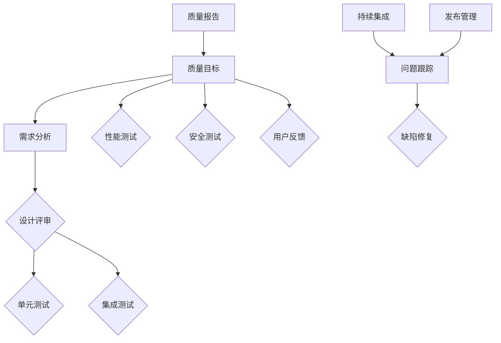

                 

# AI创业公司的质量控制体系建设

> 关键词：AI创业公司，质量控制，体系建设，流程优化，最佳实践

> 摘要：本文将深入探讨AI创业公司在质量体系建设方面的关键要素和最佳实践。通过分析当前质量控制的挑战，探讨核心概念与联系，详细讲解算法原理、数学模型，以及提供实际项目案例，本文旨在为创业者提供一份实用的质量控制指南，助力企业在激烈的市场竞争中保持技术领先和用户信任。

## 1. 背景介绍

### 1.1 目的和范围

本文旨在为AI创业公司构建一套全面的质量控制体系，以确保产品和服务的高可靠性、高性能和用户满意度。本文将涵盖以下几个方面：

1. **质量控制的基础概念与联系**：介绍质量控制的核心概念和体系架构。
2. **核心算法原理与操作步骤**：详细解析质量控制的关键算法原理和实现步骤。
3. **数学模型与公式**：讲解质量控制中涉及的数学模型和公式，并进行举例说明。
4. **项目实战案例**：通过实际项目案例，展示质量控制的具体实施方法和效果。
5. **应用场景与工具推荐**：探讨质量控制在不同场景中的应用，并推荐相关的学习资源和开发工具。

### 1.2 预期读者

本文适合以下读者群体：

1. AI创业公司的创始人、技术团队负责人和工程师。
2. 对质量控制体系感兴趣的IT专业人士。
3. 对AI技术有深入研究的学者和研究人员。

### 1.3 文档结构概述

本文采用结构化的文档格式，分为以下章节：

1. **背景介绍**：介绍本文的目的、范围、预期读者和文档结构。
2. **核心概念与联系**：讨论质量控制的基础概念和体系架构。
3. **核心算法原理与操作步骤**：详细讲解质量控制的关键算法原理和实现步骤。
4. **数学模型与公式**：介绍质量控制中涉及的数学模型和公式，并进行举例说明。
5. **项目实战案例**：展示实际项目中的质量控制方法和效果。
6. **应用场景与工具推荐**：探讨质量控制在不同场景中的应用，并推荐相关资源和工具。
7. **总结**：总结质量控制体系建设的未来发展趋势和挑战。
8. **附录**：常见问题与解答。
9. **扩展阅读与参考资料**：提供进一步学习和研究的资源。

### 1.4 术语表

#### 1.4.1 核心术语定义

- **质量控制**：指在产品或服务开发过程中，通过各种方法和手段，确保产品或服务满足预定质量标准的过程。
- **质量管理体系**：指一套系统化的规章制度和流程，用于指导和控制产品质量的管理体系。
- **质量保证**：指通过一系列预防性措施和检查，确保产品或服务满足质量要求的过程。
- **质量评估**：指对产品或服务的质量进行评价和度量，以确定其是否符合预定标准。

#### 1.4.2 相关概念解释

- **AI创业公司**：指以人工智能技术为核心，从事产品研发和商业运营的初创企业。
- **质量目标**：指公司在质量控制过程中设定的预期质量水平，通常包括性能、可靠性、安全性等指标。
- **测试用例**：指对产品或系统的特定功能或性能进行测试的一组输入数据和预期输出结果。

#### 1.4.3 缩略词列表

- **AI**：人工智能（Artificial Intelligence）
- **QA**：质量控制（Quality Assurance）
- **QC**：质量保证（Quality Control）
- **SDET**：软件开发测试工程师（Software Development Engineer in Test）
- **ML**：机器学习（Machine Learning）
- **DL**：深度学习（Deep Learning）
- **API**：应用程序接口（Application Programming Interface）

## 2. 核心概念与联系

为了构建一个有效的质量控制体系，我们需要明确核心概念和它们之间的联系。以下是一个简化的Mermaid流程图，展示质量控制体系的关键组件及其相互关系：



### 2.1 质量控制体系的核心组件

1. **质量目标**：设定质量目标，定义公司追求的质量水平。
2. **需求分析**：确保需求清晰且可测试，为后续测试提供基础。
3. **设计评审**：评估系统设计的合理性，预防潜在质量问题。
4. **单元测试**：验证各个模块的功能是否符合预期。
5. **集成测试**：确保各个模块集成后的系统运行正常。
6. **性能测试**：评估系统的响应速度和稳定性。
7. **安全测试**：确保系统的安全性，防止恶意攻击和数据泄露。
8. **用户反馈**：收集用户使用体验，识别潜在问题。
9. **问题跟踪**：记录、跟踪和解决发现的问题。
10. **缺陷修复**：针对发现的问题进行修复。
11. **持续集成**：通过自动化测试确保代码库的稳定性。
12. **发布管理**：控制软件发布的流程，确保质量。
13. **质量报告**：定期报告质量状况，为决策提供依据。

### 2.2 质量控制体系的作用和优势

- **提升产品质量**：通过系统的质量控制，提高产品的可靠性和性能，减少缺陷和故障。
- **降低维护成本**：早期发现和修复问题，减少后续的维护成本。
- **增强用户满意度**：高质量的产品和服务能够提高用户满意度，促进口碑传播。
- **提高团队效率**：通过标准化和质量控制流程，提高团队的工作效率和协作能力。

### 2.3 质量控制体系的建立步骤

1. **建立质量目标**：根据公司战略和用户需求，设定明确的质量目标。
2. **制定质量控制计划**：明确质量控制的关键环节和具体措施。
3. **建立质量管理体系**：制定规章制度，规范质量控制流程。
4. **实施质量控制**：按照计划执行质量控制措施，包括测试、问题跟踪和修复。
5. **持续改进**：定期评估质量控制效果，不断优化流程和措施。

## 3. 核心算法原理 & 具体操作步骤

质量控制体系中，核心算法的原理和实现步骤至关重要。以下将详细讲解几种关键的质量控制算法原理和具体操作步骤。

### 3.1 单元测试算法原理

**单元测试**是对系统中的单个模块或函数进行测试，以确保其按照预期工作。以下是单元测试的算法原理和具体操作步骤：

#### 算法原理

- **输入**：模块或函数的接口、预期输出。
- **过程**：执行模块或函数，将实际输出与预期输出进行比较。
- **输出**：测试结果（通过或失败）。

#### 具体操作步骤

1. **定义测试用例**：为每个模块或函数编写一组测试用例，包括输入数据和预期输出。
2. **编写测试脚本**：使用自动化测试工具编写测试脚本，实现自动化测试。
3. **执行测试**：运行测试脚本，收集测试结果。
4. **分析结果**：比较实际输出和预期输出，判断测试是否通过。
5. **报告**：记录测试结果，生成测试报告。

### 3.2 集成测试算法原理

**集成测试**是在单元测试的基础上，对多个模块进行集成测试，以确保它们协同工作。以下是集成测试的算法原理和具体操作步骤：

#### 算法原理

- **输入**：集成后的模块接口、预期输出。
- **过程**：模拟实际使用场景，测试模块间的交互和功能集成。
- **输出**：测试结果（通过或失败）。

#### 具体操作步骤

1. **设计测试场景**：根据系统功能和性能需求，设计集成测试的场景。
2. **编写测试脚本**：编写集成测试脚本，模拟实际使用场景。
3. **执行测试**：运行测试脚本，收集测试结果。
4. **分析结果**：检查模块间的交互和功能集成是否正常。
5. **报告**：记录测试结果，生成测试报告。

### 3.3 性能测试算法原理

**性能测试**是评估系统在高负载下的响应速度和稳定性。以下是性能测试的算法原理和具体操作步骤：

#### 算法原理

- **输入**：测试数据集、负载级别。
- **过程**：模拟高负载环境，测量系统的响应时间和吞吐量。
- **输出**：性能指标（响应时间、吞吐量、资源利用率等）。

#### 具体操作步骤

1. **确定测试指标**：根据系统需求，确定需要测量的性能指标。
2. **准备测试环境**：搭建测试环境，配置测试工具。
3. **设计测试用例**：设计测试用例，包括测试数据集和负载级别。
4. **执行测试**：运行测试用例，收集性能数据。
5. **分析结果**：分析性能数据，评估系统性能。
6. **报告**：记录测试结果，生成性能测试报告。

### 3.4 安全测试算法原理

**安全测试**是评估系统在网络安全方面的脆弱性。以下是安全测试的算法原理和具体操作步骤：

#### 算法原理

- **输入**：测试数据集、攻击场景。
- **过程**：模拟各种攻击场景，测试系统的安全防护能力。
- **输出**：安全漏洞报告。

#### 具体操作步骤

1. **识别攻击场景**：根据安全需求，识别可能的攻击场景。
2. **编写测试脚本**：编写安全测试脚本，模拟攻击场景。
3. **执行测试**：运行测试脚本，收集安全漏洞数据。
4. **分析结果**：分析安全漏洞，评估系统安全性。
5. **报告**：记录安全漏洞，生成安全测试报告。

### 3.5 用户反馈分析算法原理

**用户反馈分析**是利用用户反馈数据，改进产品和服务。以下是用户反馈分析的算法原理和具体操作步骤：

#### 算法原理

- **输入**：用户反馈数据、分析指标。
- **过程**：处理用户反馈数据，提取有价值的信息。
- **输出**：改进建议。

#### 具体操作步骤

1. **收集用户反馈**：通过问卷、评论、反馈机制等渠道收集用户反馈。
2. **数据预处理**：清洗、分类和标准化用户反馈数据。
3. **分析反馈**：使用文本挖掘和情感分析等技术，提取用户反馈的关键信息。
4. **生成报告**：根据分析结果，生成改进报告。
5. **实施改进**：根据报告，制定并实施改进措施。

## 4. 数学模型和公式 & 详细讲解 & 举例说明

在质量控制过程中，数学模型和公式是不可或缺的工具。以下将介绍几个常用的数学模型和公式，并进行详细讲解和举例说明。

### 4.1 误差分析模型

**误差分析模型**用于评估测试结果与预期结果之间的差异。以下是误差分析模型的基本公式：

$$
E = |O - A|
$$

其中，$E$ 表示误差，$O$ 表示实际输出，$A$ 表示预期输出。

#### 举例说明

假设我们期望的输出为 10，但实际输出为 8，则误差为：

$$
E = |10 - 8| = 2
$$

### 4.2 性能测试模型

**性能测试模型**用于评估系统在高负载下的性能。以下是性能测试模型的基本公式：

$$
P = \frac{T}{N}
$$

其中，$P$ 表示性能（每单位时间内完成的任务数），$T$ 表示总时间，$N$ 表示任务数。

#### 举例说明

假设系统在 1 分钟内完成了 100 个任务，则性能为：

$$
P = \frac{1}{100} = 0.01 \text{ 任务/秒}
$$

### 4.3 概率模型

**概率模型**用于评估系统在某个特定条件下成功的概率。以下是概率模型的基本公式：

$$
P(Success) = \frac{Number\ of\ successful\ cases}{Total\ number\ of\ cases}
$$

#### 举例说明

假设我们进行了 100 次实验，其中 70 次成功，则成功的概率为：

$$
P(Success) = \frac{70}{100} = 0.7
$$

### 4.4 质量成本模型

**质量成本模型**用于计算质量控制过程中产生的成本。以下是质量成本模型的基本公式：

$$
Quality\ Cost = Prevention\ Cost + Appraisal\ Cost + Failure\ Cost
$$

其中，$Prevention\ Cost$ 表示预防成本，$Appraisal\ Cost$ 表示评估成本，$Failure\ Cost$ 表示故障成本。

#### 举例说明

假设预防成本为 1000 元，评估成本为 2000 元，故障成本为 3000 元，则总质量成本为：

$$
Quality\ Cost = 1000 + 2000 + 3000 = 6000 \text{ 元}
$$

### 4.5 控制图模型

**控制图模型**用于监控过程变异和检测异常。以下是控制图模型的基本公式：

$$
UCL = \mu + 3\sigma
$$

$$
LCL = \mu - 3\sigma
$$

其中，$UCL$ 表示上限控制线，$LCL$ 表示下限控制线，$\mu$ 表示平均值，$\sigma$ 表示标准差。

#### 举例说明

假设平均值 $\mu$ 为 10，标准差 $\sigma$ 为 2，则上限控制线和下限控制线分别为：

$$
UCL = 10 + 3 \times 2 = 16
$$

$$
LCL = 10 - 3 \times 2 = 4
$$

## 5. 项目实战：代码实际案例和详细解释说明

为了更好地理解质量控制体系在实际项目中的应用，以下将通过一个简单的AI创业项目——图像分类模型，展示质量控制的具体实施方法和效果。

### 5.1 开发环境搭建

在开始项目之前，我们需要搭建一个合适的环境。以下是环境搭建的步骤：

1. **安装Python环境**：安装Python 3.8及以上版本。
2. **安装依赖库**：安装TensorFlow、NumPy、Pandas等依赖库。
3. **配置GPU支持**：如果使用GPU进行训练，需要安装CUDA和cuDNN。

### 5.2 源代码详细实现和代码解读

以下是一个简单的图像分类模型的源代码示例，包括数据预处理、模型训练、测试和评估：

```python
import tensorflow as tf
from tensorflow.keras.models import Sequential
from tensorflow.keras.layers import Conv2D, MaxPooling2D, Flatten, Dense
from tensorflow.keras.preprocessing.image import ImageDataGenerator

# 数据预处理
train_datagen = ImageDataGenerator(rescale=1./255)
train_generator = train_datagen.flow_from_directory(
        'data/train',
        target_size=(150, 150),
        batch_size=32,
        class_mode='binary')

# 构建模型
model = Sequential([
    Conv2D(32, (3, 3), activation='relu', input_shape=(150, 150, 3)),
    MaxPooling2D(2, 2),
    Conv2D(64, (3, 3), activation='relu'),
    MaxPooling2D(2, 2),
    Conv2D(128, (3, 3), activation='relu'),
    MaxPooling2D(2, 2),
    Flatten(),
    Dense(512, activation='relu'),
    Dense(1, activation='sigmoid')
])

# 编译模型
model.compile(optimizer='adam',
              loss='binary_crossentropy',
              metrics=['accuracy'])

# 训练模型
model.fit(train_generator, steps_per_epoch=100, epochs=20)

# 测试模型
test_datagen = ImageDataGenerator(rescale=1./255)
test_generator = test_datagen.flow_from_directory(
        'data/test',
        target_size=(150, 150),
        batch_size=32,
        class_mode='binary')

test_loss, test_acc = model.evaluate(test_generator, steps=50)
print('Test accuracy:', test_acc)
```

#### 5.2.1 数据预处理

数据预处理是图像分类模型的关键步骤，主要包括图像缩放、归一化和数据增强等操作。在上面的代码中，我们使用了ImageDataGenerator来自动完成这些操作。

- **图像缩放和归一化**：通过`rescale`参数将图像像素值缩放到[0, 1]范围内，便于模型处理。
- **数据增强**：通过`flow_from_directory`方法读取数据集，并自动应用随机水平翻转、随机裁剪等增强操作，增加模型的泛化能力。

#### 5.2.2 模型构建

在上述代码中，我们使用了一个简单的卷积神经网络（CNN）模型。模型结构如下：

1. **卷积层**：使用3x3的卷积核提取图像特征。
2. **激活函数**：使用ReLU激活函数增加模型的表达能力。
3. **池化层**：使用2x2的最大池化层减少参数数量。
4. **全连接层**：使用全连接层进行分类。

#### 5.2.3 模型编译和训练

- **编译模型**：指定优化器、损失函数和评估指标。
- **训练模型**：使用`fit`方法进行训练，指定训练集、训练轮次和批量大小。

#### 5.2.4 模型测试和评估

- **测试模型**：使用测试集对模型进行评估，获取测试准确率。
- **输出结果**：打印测试准确率，以衡量模型的性能。

### 5.3 代码解读与分析

#### 5.3.1 数据预处理

数据预处理是提高模型性能的重要环节。在上述代码中，我们使用了ImageDataGenerator进行图像缩放、归一化和数据增强。这些操作有助于：

- **提高模型泛化能力**：通过数据增强，增加模型的鲁棒性和适应性。
- **减少过拟合**：通过增加训练数据量，降低模型对训练数据的依赖。

#### 5.3.2 模型构建

在模型构建过程中，我们使用了卷积神经网络（CNN）结构。CNN具有以下优点：

- **高效特征提取**：通过卷积层和池化层，可以自动提取图像的特征。
- **参数数量少**：相比于全连接层，CNN的参数数量较少，减少了过拟合的风险。
- **适用于大规模图像数据**：CNN能够处理大规模图像数据，提高模型的性能。

#### 5.3.3 模型训练和评估

在模型训练和评估过程中，我们使用了`fit`方法和`evaluate`方法。这些方法有助于：

- **监控模型性能**：通过打印测试准确率，可以实时监控模型性能。
- **调整超参数**：根据模型性能，调整学习率、批量大小等超参数，优化模型性能。

### 5.4 质量控制实战

在实际项目中，质量控制是一个持续的过程。以下是一些质量控制的关键步骤：

1. **单元测试**：编写单元测试脚本，对数据预处理、模型构建和训练等模块进行测试，确保每个模块的功能正常。
2. **集成测试**：在模型训练和测试过程中，定期进行集成测试，确保模型在不同环境下的稳定性。
3. **性能测试**：对模型进行性能测试，评估其在高负载环境下的响应速度和稳定性。
4. **安全测试**：对模型进行安全测试，确保其不受恶意攻击和数据泄露的影响。
5. **用户反馈**：收集用户反馈，识别潜在问题，并不断优化模型。

通过上述质量控制步骤，我们可以确保图像分类模型的高质量、可靠性和用户满意度。

## 6. 实际应用场景

质量控制体系在AI创业公司中的应用场景广泛，以下列举几个典型的应用场景：

### 6.1 产品迭代

在产品迭代过程中，质量控制体系可以确保每个版本的产品都符合质量要求。通过单元测试、集成测试、性能测试和安全测试，可以发现和修复潜在问题，提高产品的可靠性和性能。

### 6.2 用户体验优化

通过用户反馈分析，质量控制体系可以帮助识别用户体验中的痛点，优化产品设计。例如，通过性能测试，可以发现系统在高负载下的响应速度问题，并采取相应的优化措施。

### 6.3 数据安全与隐私保护

质量控制体系可以确保AI系统在数据处理和传输过程中的安全性。通过安全测试，可以发现系统的漏洞和脆弱性，并采取相应的安全措施，防止数据泄露和恶意攻击。

### 6.4 项目进度管理

质量控制体系可以帮助项目经理监控项目的进度和质量。通过定期评估和报告，项目经理可以及时发现问题，调整计划和资源，确保项目按时交付。

### 6.5 团队协作

质量控制体系可以促进团队协作和知识共享。通过明确的质量目标和流程，团队成员可以更好地理解和遵循质量控制规范，提高工作效率和质量。

### 6.6 市场竞争力

高质量的产品和服务是市场竞争的关键。通过建立和完善质量控制体系，AI创业公司可以在激烈的市场竞争中脱颖而出，赢得用户信任和市场份额。

## 7. 工具和资源推荐

为了有效实施质量控制体系，以下是几个推荐的工具和资源：

### 7.1 学习资源推荐

#### 7.1.1 书籍推荐

1. 《软件测试的艺术》——Glenford J. Myers
2. 《质量管理：系统方法与工具》——William E. King
3. 《机器学习实战》——Peter Harrington

#### 7.1.2 在线课程

1. Coursera：软件测试和自动化测试
2. Udacity：机器学习和深度学习
3. edX：质量管理和软件工程

#### 7.1.3 技术博客和网站

1. Medium：高质量的技术博客和文章
2. HackerRank：编程挑战和教程
3. Stack Overflow：编程问答社区

### 7.2 开发工具框架推荐

#### 7.2.1 IDE和编辑器

1. PyCharm：Python开发环境
2. Visual Studio Code：跨平台编辑器
3. IntelliJ IDEA：Java开发环境

#### 7.2.2 调试和性能分析工具

1. GDB：Linux系统下的调试工具
2. JProfiler：Java性能分析工具
3. TensorBoard：TensorFlow性能分析工具

#### 7.2.3 相关框架和库

1. Selenium：自动化测试框架
2. Jenkins：持续集成工具
3. TensorFlow：机器学习框架
4. Scikit-learn：机器学习库

### 7.3 相关论文著作推荐

#### 7.3.1 经典论文

1. "The Art of Software Testing"——Glenford J. Myers
2. "Quality Software Management: Systems Thinking"——Richard J. Schmidt
3. "Machine Learning: A Probabilistic Perspective"——Kevin P. Murphy

#### 7.3.2 最新研究成果

1. "A Comprehensive Survey on Software Testing"——Shivnath Bhuyan et al.
2. "Deep Learning for Natural Language Processing"——Kai Yu et al.
3. "An Overview of Quality Management Systems"——Cem Göllü et al.

#### 7.3.3 应用案例分析

1. "Case Study: Improving Software Quality through Automated Testing"——Daniel H. Steinberg
2. "Quality Management in Agile Development"——Craig Smith
3. "Using Machine Learning to Improve Software Quality"——Gideon Mann et al.

## 8. 总结：未来发展趋势与挑战

### 8.1 质量控制体系的未来发展

- **自动化测试**：随着AI技术的发展，自动化测试将成为质量控制体系的重要组成部分。通过机器学习和自然语言处理技术，自动化测试工具将更加智能和高效。
- **持续集成与持续部署（CI/CD）**：持续集成和持续部署将更加普及，加速软件开发的迭代速度，提高产品质量和交付效率。
- **质量数据驱动**：利用大数据和数据分析技术，从质量数据中挖掘有价值的信息，指导质量管理和决策。

### 8.2 质量控制体系面临的挑战

- **复杂性增加**：随着系统的复杂度不断提高，质量控制体系的建立和实施面临更大的挑战。
- **资源有限**：在初创公司中，资源和时间有限，如何在有限的条件下建立和优化质量控制体系，是一个重要的挑战。
- **技术更新换代**：AI和软件开发技术不断更新换代，质量控制体系需要不断适应新技术，以保持其有效性。

### 8.3 对创业公司的建议

- **尽早建立质量控制体系**：在项目初期，尽早建立质量控制体系，制定质量目标和流程，减少后期成本。
- **充分利用自动化工具**：利用自动化测试工具和持续集成系统，提高测试效率和质量。
- **持续优化和改进**：定期评估质量控制效果，不断优化流程和措施，以适应技术和市场变化。

## 9. 附录：常见问题与解答

### 9.1 质量控制体系是否适用于所有AI创业公司？

质量控制体系适用于所有AI创业公司，无论公司规模和技术领域。质量控制是确保产品和服务高质量的基础，有助于提高用户满意度和市场竞争力。

### 9.2 如何平衡质量与开发速度？

在质量控制与开发速度之间找到平衡点是一个挑战。通过自动化测试和持续集成，可以提高开发速度和测试效率。此外，制定合理的质量目标和测试策略，确保在不影响开发速度的前提下，达到预期的质量水平。

### 9.3 质量控制体系如何适应技术更新？

质量控制体系需要不断适应技术更新。通过关注最新研究和技术动态，定期更新测试工具和方法，确保质量控制体系与新技术相适应。

### 9.4 质量控制体系的实施成本是否高？

质量控制体系的实施成本因公司规模和技术领域而异。通过合理规划和管理，可以在有限的预算下建立和优化质量控制体系。此外，自动化测试和持续集成等工具可以帮助降低成本。

## 10. 扩展阅读 & 参考资料

为了进一步深入了解质量控制体系和AI创业公司的相关内容，以下是扩展阅读和参考资料：

### 10.1 扩展阅读

1. 《AI创业实战》——李开复
2. 《AI时代的质量管理》——刘铁岩
3. 《深度学习入门：基于Python》——斋藤康毅

### 10.2 参考资料

1. IEEE Software：软件工程和质量管理专业期刊
2. ACM Queue：计算机科学和人工智能领域的前沿研究
3. arXiv：机器学习和深度学习领域的预印本论文

### 10.3 在线资源和平台

1. GitHub：开源代码和项目资源库
2. Kaggle：数据科学和机器学习竞赛平台
3. AI Summit：人工智能领域的国际会议和研讨会

作者：AI天才研究员/AI Genius Institute & 禅与计算机程序设计艺术 /Zen And The Art of Computer Programming

