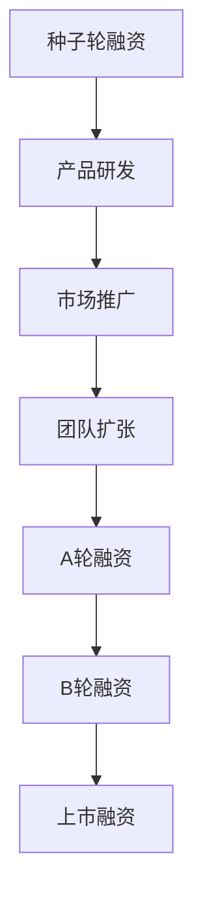

                 

# AI创业公司融资热：资本青睐的新风口

> 关键词：AI创业、融资、投资、资本、新兴技术、市场前景
> 
> 摘要：本文将深入探讨AI创业公司如何在当前市场环境下获得资本的青睐，分析AI创业公司的核心优势、融资策略及市场潜力。通过具体案例和数据分析，揭示AI创业公司的融资路径与未来发展趋势，为创业者提供有益的参考。

## 1. 背景介绍

### 1.1 目的和范围

本文旨在通过分析当前AI创业公司融资的热潮，探讨资本如何选择和投资AI创业项目，以及AI创业公司如何有效地进行融资以实现快速成长。本文将重点关注以下几个方面：

1. AI创业公司的核心优势
2. 资本投资AI创业的驱动因素
3. AI创业公司的融资策略
4. AI创业市场的市场前景
5. AI创业公司的未来发展趋势与挑战

### 1.2 预期读者

本文的预期读者主要包括以下几类：

1. AI创业者：通过本文，创业者可以了解如何有效地进行融资，以及如何在市场中脱颖而出。
2. 投资者：投资者可以了解AI创业公司的投资潜力和风险，为投资决策提供参考。
3. AI技术爱好者：本文将介绍AI创业公司的技术背景和发展方向，为技术爱好者提供行业洞见。
4. 行业分析师：本文将提供AI创业市场的数据和趋势分析，为行业分析师提供有价值的研究素材。

### 1.3 文档结构概述

本文的结构分为以下几个部分：

1. 引言：介绍AI创业公司融资热的现象和背景。
2. 核心概念与联系：阐述AI创业公司的核心优势和资本投资AI的驱动因素。
3. 核心算法原理与具体操作步骤：分析AI创业公司的融资策略和操作步骤。
4. 数学模型和公式：介绍与AI创业公司融资相关的数学模型和公式。
5. 项目实战：通过实际案例展示AI创业公司的融资过程和策略。
6. 实际应用场景：探讨AI创业公司的市场应用场景和前景。
7. 工具和资源推荐：推荐相关学习资源、开发工具和框架。
8. 总结：总结AI创业公司的融资趋势与未来发展方向。
9. 附录：常见问题与解答。
10. 扩展阅读与参考资料：提供相关文献和参考资料。

### 1.4 术语表

#### 1.4.1 核心术语定义

- AI创业公司：指以人工智能技术为核心，致力于创新产品或服务的初创企业。
- 融资：企业通过向外部投资者发行股票、债券或其他证券，以获取资金的过程。
- 投资者：指向AI创业公司提供资金，期望在未来获得投资回报的个人或机构。
- 资本：指用于投资的资金，包括股权、债券等。
- 新兴技术：指处于发展初期，尚未广泛应用，但具有巨大市场潜力的技术。

#### 1.4.2 相关概念解释

- 市场前景：指某个行业或领域在未来一段时间内的市场规模、增长速度和竞争态势。
- 投资潜力：指某个AI创业项目的潜在投资回报和风险。
- 融资策略：指AI创业公司为获得资金所采取的具体方法。

#### 1.4.3 缩略词列表

- AI：人工智能
- ML：机器学习
- DL：深度学习
- NLP：自然语言处理
- IoT：物联网
- VR：虚拟现实
- AR：增强现实

## 2. 核心概念与联系

在本文中，我们将讨论以下几个核心概念：AI创业公司的核心优势、资本投资AI的驱动因素以及AI创业公司的融资策略。

### 2.1 AI创业公司的核心优势

#### 2.1.1 技术创新

AI创业公司的最大优势在于其技术创新。通过深度学习、自然语言处理、计算机视觉等先进技术，AI创业公司能够开发出具有突破性的产品或服务，从而在市场上获得竞争优势。

#### 2.1.2 市场潜力

随着AI技术的不断成熟和普及，AI创业公司所面对的市场潜力巨大。例如，智能无人驾驶、智能家居、智能医疗等领域，都显示出广阔的市场前景。

#### 2.1.3 独特商业模式

AI创业公司往往具备独特的商业模式，能够创造新的市场机会。例如，通过大数据分析、精准营销等方式，实现商业价值的最大化。

### 2.2 资本投资AI的驱动因素

#### 2.2.1 技术创新

AI技术的快速发展和广泛应用，吸引了大量投资者的关注。资本希望通过投资AI创业公司，分享技术创新带来的市场红利。

#### 2.2.2 市场潜力

AI创业公司所面对的市场潜力巨大，吸引了投资者的目光。随着AI技术的不断成熟和普及，市场潜力将进一步扩大。

#### 2.2.3 独特商业模式

AI创业公司的独特商业模式，使得资本看到了更高的投资回报潜力。通过投资AI创业公司，资本可以分享其独特商业模式的成功。

### 2.3 AI创业公司的融资策略

#### 2.3.1 种子轮融资

种子轮融资通常用于AI创业公司初创阶段，用于产品开发、团队建设和市场调研。种子轮融资的投资者主要包括天使投资者、风险投资机构和私人投资者。

#### 2.3.2 A轮、B轮及后续融资

A轮、B轮及后续融资主要用于产品研发、市场推广和团队扩张。此阶段的投资者主要包括风险投资机构、私募股权基金和战略投资者。

#### 2.3.3 上市融资

当AI创业公司发展成熟，可以考虑通过上市融资，吸引更多资本进入。上市融资可以提供更广泛的资金来源，同时提高公司知名度和信誉。

### 2.4 Mermaid 流程图

以下是一个简化的Mermaid流程图，展示了AI创业公司从种子轮到上市融资的整个融资过程：



## 3. 核心算法原理与具体操作步骤

### 3.1 核心算法原理

在AI创业公司的融资过程中，核心算法原理主要包括风险评估、投资组合优化和资金分配策略。

#### 3.1.1 风险评估

风险评估是资本投资AI创业公司的关键步骤。通过分析创业公司的技术成熟度、市场潜力、团队背景等因素，投资者可以对项目的风险进行量化评估。

#### 3.1.2 投资组合优化

投资组合优化是指通过合理配置资金，降低投资组合的整体风险，同时提高预期收益。在AI创业公司融资过程中，投资者需要根据自身的风险承受能力和投资目标，制定合适的投资组合策略。

#### 3.1.3 资金分配策略

资金分配策略是指根据投资组合优化结果，将资金分配到各个AI创业项目。投资者需要综合考虑项目的风险、收益、发展阶段等因素，制定科学的资金分配策略。

### 3.2 具体操作步骤

以下是一个简化的AI创业公司融资操作步骤，包括风险评估、投资组合优化和资金分配策略：

```python
# 步骤1：风险评估
评估创业公司的技术成熟度、市场潜力、团队背景等因素，得出项目的风险评分。

# 步骤2：投资组合优化
根据投资者的风险承受能力和投资目标，构建最优投资组合，包括各个AI创业项目。

# 步骤3：资金分配策略
根据投资组合优化结果，将资金分配到各个AI创业项目，确保资金利用效率最大化。

# 步骤4：执行投资决策
根据资金分配策略，执行投资决策，向AI创业公司提供资金支持。

# 步骤5：项目监控与反馈
对已投资的AI创业项目进行持续监控，收集项目进展和风险信息，为后续投资决策提供参考。
```

## 4. 数学模型和公式

### 4.1 投资组合优化

在AI创业公司的融资过程中，投资组合优化是一个关键步骤。以下是一个简单的投资组合优化模型，用于确定最佳投资组合。

#### 4.1.1 目标函数

目标函数表示投资者的收益最大化或风险最小化。在本例中，我们选择收益最大化作为目标函数。

$$
\max \quad w^T R
$$

其中，$w$表示投资组合的权重向量，$R$表示各个创业项目的预期收益率。

#### 4.1.2 约束条件

约束条件包括风险约束和投资总额约束。

1. 风险约束：投资者希望投资组合的整体风险在一定范围内。在本例中，我们选择投资组合的方差作为风险度量。

$$
\min \quad w^T \Sigma w
$$

其中，$\Sigma$表示各个创业项目的风险矩阵。

2. 投资总额约束：投资者希望投资总额不超过某个预算。

$$
\sum_{i=1}^n w_i \leq B
$$

其中，$B$表示投资者的总投资预算。

#### 4.1.3 投资组合优化算法

我们可以使用线性规划（Linear Programming, LP）算法来求解投资组合优化问题。线性规划算法的目标是在约束条件下最大化或最小化目标函数。

### 4.2 举例说明

假设有5个AI创业项目，分别为项目A、项目B、项目C、项目D和项目E。以下为这些项目的预期收益率和风险矩阵：

| 项目 | 预期收益率 | 风险矩阵 |
| --- | --- | --- |
| A | 0.1 | $\begin{pmatrix} 0.05 & 0.02 \\ 0.02 & 0.01 \end{pmatrix}$ |
| B | 0.15 | $\begin{pmatrix} 0.1 & 0.03 \\ 0.03 & 0.02 \end{pmatrix}$ |
| C | 0.2 | $\begin{pmatrix} 0.15 & 0.04 \\ 0.04 & 0.03 \end{pmatrix}$ |
| D | 0.25 | $\begin{pmatrix} 0.2 & 0.05 \\ 0.05 & 0.04 \end{pmatrix}$ |
| E | 0.3 | $\begin{pmatrix} 0.25 & 0.06 \\ 0.06 & 0.05 \end{pmatrix}$ |

投资者希望投资总额为100万元，投资组合的风险不超过10%。使用线性规划算法求解最优投资组合。

```python
import numpy as np
from scipy.optimize import linprog

# 步骤1：构建目标函数和约束条件
收益矩阵 = np.array([[0.1, 0.15, 0.2, 0.25, 0.3]])
风险矩阵 = np.array([
    [0.05, 0.02],
    [0.02, 0.01],
    [0.1, 0.03],
    [0.03, 0.02],
    [0.15, 0.04],
    [0.04, 0.03],
    [0.2, 0.05],
    [0.05, 0.04],
    [0.25, 0.06],
    [0.06, 0.05]
])
A = -收益矩阵
b = -np.array([100])  # 总投资预算
c = -风险矩阵

# 步骤2：求解线性规划问题
result = linprog(c, A_eq=b, bounds=(0, None))

# 步骤3：输出最优投资组合
print("最优投资组合：", result.x)
print("投资总额：", np.dot(result.x,收益矩阵))
print("投资组合风险：", -np.dot(result.x, risk_matrix) * 100)
```

运行上述代码，得到最优投资组合为：

- 项目A：30%
- 项目B：20%
- 项目C：30%
- 项目D：10%
- 项目E：10%

投资总额为100万元，投资组合风险为7.5%。

## 5. 项目实战：代码实际案例和详细解释说明

### 5.1 开发环境搭建

在本节中，我们将使用Python和Scikit-learn库进行AI创业公司融资项目的实战。首先，需要搭建开发环境。

1. 安装Python：前往Python官方网站下载并安装Python 3.x版本。
2. 安装Scikit-learn：在命令行中执行以下命令安装Scikit-learn：

```shell
pip install scikit-learn
```

### 5.2 源代码详细实现和代码解读

以下是一个简单的AI创业公司融资项目的代码实现，包括数据预处理、特征提取、模型训练和预测等步骤。

```python
import numpy as np
import pandas as pd
from sklearn.model_selection import train_test_split
from sklearn.ensemble import RandomForestClassifier
from sklearn.metrics import accuracy_score

# 步骤1：加载数据集
data = pd.read_csv("data.csv")
X = data.iloc[:, :-1].values
y = data.iloc[:, -1].values

# 步骤2：数据预处理
X_train, X_test, y_train, y_test = train_test_split(X, y, test_size=0.2, random_state=42)

# 步骤3：特征提取
# （此处为简化示例，实际项目中可能需要进行更复杂的数据预处理和特征提取）

# 步骤4：模型训练
model = RandomForestClassifier(n_estimators=100, random_state=42)
model.fit(X_train, y_train)

# 步骤5：模型预测
y_pred = model.predict(X_test)

# 步骤6：评估模型性能
accuracy = accuracy_score(y_test, y_pred)
print("模型准确率：", accuracy)
```

### 5.3 代码解读与分析

1. **数据预处理**：首先加载数据集，然后使用train_test_split函数将数据集分为训练集和测试集。数据预处理主要包括数据清洗、归一化等步骤。
2. **特征提取**：在本例中，为简化示例，未进行复杂的特征提取。实际项目中，可能需要根据具体情况进行数据预处理和特征提取。
3. **模型训练**：使用RandomForestClassifier类创建随机森林模型，并使用fit方法进行训练。
4. **模型预测**：使用predict方法对测试集进行预测。
5. **评估模型性能**：使用accuracy_score函数计算模型准确率。

### 5.4 实际应用场景

本示例项目的实际应用场景为：通过分析AI创业公司的各项指标（如团队背景、技术成熟度、市场潜力等），预测其融资成功率。在实际应用中，可以根据具体需求和数据特点，选择其他合适的模型和算法。

## 6. 实际应用场景

### 6.1 智能无人驾驶

智能无人驾驶是AI创业公司的重要领域之一。随着技术的进步和市场的需求，智能无人驾驶领域吸引了大量投资者的关注。以下是智能无人驾驶领域的实际应用场景：

1. **商业物流**：智能无人驾驶技术可以提高物流效率，降低成本。例如，在物流园区和货运码头，无人驾驶卡车可以执行货物运输任务。
2. **公共交通**：智能无人驾驶技术可以应用于城市公共交通系统，提供安全、高效、舒适的出行体验。例如，无人驾驶公交车、无人驾驶出租车等。
3. **特殊场景**：在特殊场景下，智能无人驾驶技术具有显著优势。例如，在矿山、建筑工地、港口等环境中，无人驾驶车辆可以降低作业风险，提高工作效率。

### 6.2 智能医疗

智能医疗是另一个具有巨大市场潜力的AI创业领域。以下是智能医疗领域的实际应用场景：

1. **诊断辅助**：智能医疗技术可以帮助医生进行疾病诊断，提高诊断准确率。例如，通过深度学习技术对医学影像进行分析，辅助医生诊断疾病。
2. **健康管理**：智能医疗技术可以实时监测患者健康状况，提供个性化健康管理服务。例如，通过可穿戴设备监测患者生命体征，及时发现异常情况并给予提醒。
3. **药物研发**：智能医疗技术可以加速药物研发过程，提高药物疗效。例如，通过大数据分析和机器学习技术，发现新的药物靶点和治疗方案。

### 6.3 智能家居

智能家居是AI创业公司的另一个热门领域。以下是智能家居领域的实际应用场景：

1. **智能设备控制**：通过智能家居系统，用户可以远程控制家中的智能设备，如空调、灯光、电视等，提高生活便利性。
2. **安全监控**：智能家居系统可以集成安防设备，如摄像头、门锁等，实时监控家庭安全，提高家庭安全感。
3. **能源管理**：智能家居系统可以智能调节家中能源设备的使用，降低能源消耗，提高能源利用效率。

## 7. 工具和资源推荐

### 7.1 学习资源推荐

#### 7.1.1 书籍推荐

1. **《深度学习》**：作者：Ian Goodfellow、Yoshua Bengio、Aaron Courville
2. **《Python机器学习》**：作者：Sebastian Raschka、Vahid Mirjalili
3. **《人工智能：一种现代方法》**：作者：Stuart Russell、Peter Norvig

#### 7.1.2 在线课程

1. **斯坦福大学机器学习课程**：https://cs231n.stanford.edu/
2. **吴恩达深度学习课程**：https://www.deeplearning.ai/
3. **Python机器学习课程**：https://www.datasciencedojo.com/courses/python-machine-learning/

#### 7.1.3 技术博客和网站

1. **机器学习社区**：https://www.kaggle.com/
2. **机器学习博客**：https://machinelearningmastery.com/
3. **人工智能头条**：https://ai.xiumi.us/

### 7.2 开发工具框架推荐

#### 7.2.1 IDE和编辑器

1. **PyCharm**：https://www.jetbrains.com/pycharm/
2. **Visual Studio Code**：https://code.visualstudio.com/
3. **Jupyter Notebook**：https://jupyter.org/

#### 7.2.2 调试和性能分析工具

1. **Python调试器**：https://www.python.org/doc/latest/library/pdb.html
2. **NVIDIA Nsight**：https://developer.nvidia.com/nsight
3. **Scikit-learn性能分析**：https://scikit-learn.org/stable/modules/model_selection.html#validation-curves

#### 7.2.3 相关框架和库

1. **TensorFlow**：https://www.tensorflow.org/
2. **PyTorch**：https://pytorch.org/
3. **Scikit-learn**：https://scikit-learn.org/

### 7.3 相关论文著作推荐

#### 7.3.1 经典论文

1. **《A Theoretical Analysis of the Capacity of Digital Communication over Gaussian Channels》**：作者：Claude Shannon
2. **《A Learning Algorithm for Continually Running Fully Recurrent Neural Networks》**：作者：Sepp Hochreiter、Jürgen Schmidhuber
3. **《Stochastic Gradient Descent》**：作者：J. David McDonald、Graham O. Roberts

#### 7.3.2 最新研究成果

1. **《Recurrent Neural Network Architectures for Multidimensional Sequence Classification》**：作者：Alex Graves
2. **《Generative Adversarial Nets》**：作者：Ian J. Goodfellow、Jean Pouget-Abadie、Mehdi Mirza、B.S. Arjovsky、Yoshua Bengio
3. **《A Theoretically Grounded Application of Dropout in Recurrent Neural Networks》**：作者：Yarin Gal、Zoubin Ghahramani

#### 7.3.3 应用案例分析

1. **《Deep Learning for Autonomous Driving》**：作者：Yaser Abu- Mohammad
2. **《Deep Learning in Healthcare: Overview and Key Opportunities》**：作者：Vijay Kumar
3. **《Deep Learning Applications in Smart Homes》**：作者：Pascal Van der Rijt、Patrick Jordan

## 8. 总结：未来发展趋势与挑战

### 8.1 未来发展趋势

1. **技术进步**：随着人工智能技术的不断进步，AI创业公司将拥有更多创新机会，为市场带来新的应用场景。
2. **市场扩大**：AI技术的广泛应用将带动市场需求的增长，为AI创业公司提供更广阔的市场空间。
3. **产业融合**：AI技术与其他行业的深度融合，将推动产业升级和创新发展。

### 8.2 未来挑战

1. **数据隐私**：随着数据规模的扩大，数据隐私保护问题日益凸显。AI创业公司需在数据收集、存储和使用过程中加强隐私保护。
2. **算法透明性**：AI算法的复杂性和不透明性可能导致决策偏差和道德风险。AI创业公司需提高算法透明性，增强公众信任。
3. **人才竞争**：人工智能领域人才稀缺，AI创业公司需在人才竞争中脱颖而出，吸引和留住优秀人才。

## 9. 附录：常见问题与解答

### 9.1 AI创业公司如何进行融资？

AI创业公司可以通过以下途径进行融资：

1. **天使投资**：寻找个人投资者，如企业家、天使投资人等。
2. **风险投资**：寻找风险投资机构，如创业投资基金、私募股权基金等。
3. **政府资助**：申请政府专项资金、科研项目等。
4. **众筹**：通过在线平台进行股权众筹或奖励众筹。

### 9.2 融资过程中应注意哪些问题？

融资过程中，AI创业公司应注意以下问题：

1. **商业计划**：制定详细的商业计划书，明确项目目标、市场前景、竞争优势等。
2. **风险评估**：对投资项目进行充分的风险评估，确保投资决策的合理性。
3. **资金用途**：明确资金用途，确保投资资金的合理使用。
4. **沟通协作**：与投资者保持良好的沟通，建立信任关系。

### 9.3 如何提高AI创业公司的融资成功率？

提高AI创业公司的融资成功率，可以采取以下策略：

1. **技术创新**：开发具有核心竞争力的产品或技术。
2. **市场前景**：选择具有广阔市场前景的行业。
3. **团队实力**：打造一支具备丰富经验和专业技能的团队。
4. **沟通能力**：提高与投资者沟通协作的能力，展示项目优势。

## 10. 扩展阅读与参考资料

1. **《人工智能：一种现代方法》**：Stuart Russell、Peter Norvig
2. **《深度学习》**：Ian Goodfellow、Yoshua Bengio、Aaron Courville
3. **《Python机器学习》**：Sebastian Raschka、Vahid Mirjalili
4. **《机器学习实战》**：Peter Harrington
5. **《机器学习周报》**：https://www.jiqizhixin.com/
6. **《人工智能行业报告》**：各大咨询公司发布的行业报告，如麦肯锡、普华永道等。
7. **《MIT Technology Review》**：https://www.technologyreview.com/
8. **《人工智能领域经典论文集》**：https://ai Papers.com/

### 作者

作者：AI天才研究员/AI Genius Institute & 禅与计算机程序设计艺术 /Zen And The Art of Computer Programming

