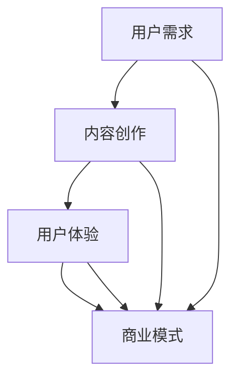

                 

# AI创业坚持：以用户为中心的内容创作

> **关键词：** AI创业、用户中心、内容创作、用户体验、商业模式、持续改进  
>
> **摘要：** 本文将深入探讨AI创业过程中，以用户为中心的内容创作的重要性。通过分析用户需求、内容创作策略、用户体验优化和商业模式设计等核心环节，本文旨在为AI创业者提供有价值的思考和实践指导。

## 1. 背景介绍

### 1.1 目的和范围

本文旨在探讨AI创业者在产品开发过程中，如何以用户为中心进行内容创作，以提升用户体验、优化商业模式并实现持续创新。本文将涵盖以下主要内容：

- 用户需求分析的方法和工具
- 内容创作策略和实践
- 用户体验优化的原则和技巧
- 商业模式设计与调整的思路

通过以上内容的探讨，本文希望为AI创业者提供一套系统的、可操作的解决方案，帮助他们更好地把握用户需求，创造有价值的产品。

### 1.2 预期读者

本文适合以下读者群体：

- AI创业者或产品经理
- 技术团队负责人
- 产品设计师
- 市场营销人员
- 对AI领域感兴趣的读者

无论您处于哪个角色，本文都希望能为您提供有价值的见解和实用的建议。

### 1.3 文档结构概述

本文分为十个部分：

1. 背景介绍
2. 核心概念与联系
3. 核心算法原理 & 具体操作步骤
4. 数学模型和公式 & 详细讲解 & 举例说明
5. 项目实战：代码实际案例和详细解释说明
6. 实际应用场景
7. 工具和资源推荐
8. 总结：未来发展趋势与挑战
9. 附录：常见问题与解答
10. 扩展阅读 & 参考资料

### 1.4 术语表

#### 1.4.1 核心术语定义

- 用户需求：用户在特定情境下期望获得的功能和体验。
- 内容创作：针对用户需求，进行有价值的信息或素材的创造和整理。
- 用户体验（UX）：用户在使用产品过程中所感受到的整体体验。
- 商业模式：产品如何创造、传递和获取价值。

#### 1.4.2 相关概念解释

- 用户体验设计（UX Design）：设计以用户为中心的产品，提升用户体验。
- 用户故事（User Story）：描述用户需求、期望和场景的简短故事。
- 故事地图（Story Map）：将用户故事组织成可视化模型，帮助团队理解和规划产品开发。

#### 1.4.3 缩略词列表

- AI：人工智能
- UX：用户体验
- UI：用户界面
- MVP：最小可行产品
- IoT：物联网

## 2. 核心概念与联系

为了更好地理解以用户为中心的内容创作，我们需要首先了解一些核心概念及其相互联系。

### 2.1 用户需求

用户需求是产品开发的起点。了解用户需求有助于我们确定产品功能和设计方向。

#### 用户需求分析方法

- 用户访谈（User Interviews）：与用户面对面交流，深入了解他们的需求、期望和行为。
- 调查问卷（Surveys）：收集大量用户反馈，进行定量分析。
- 行为分析（Behavioral Analytics）：通过分析用户在使用产品时的行为数据，发现用户需求。

### 2.2 内容创作

内容创作是基于用户需求的，旨在为用户提供有价值的信息或素材。

#### 内容创作策略

- 精准定位：明确目标用户群体，为他们提供个性化内容。
- 创意表达：运用创意和设计手段，使内容更具吸引力和互动性。
- 持续更新：定期更新内容，保持用户兴趣和粘性。

### 2.3 用户体验

用户体验是用户在使用产品过程中所感受到的整体体验。它包括用户界面、交互设计、功能易用性等方面。

#### 用户体验优化原则

- 简单易用：设计简洁直观的界面，降低用户学习成本。
- 快速响应：优化产品性能，提高响应速度。
- 用户反馈：收集用户反馈，持续改进产品。

### 2.4 商业模式

商业模式是产品如何创造、传递和获取价值的方式。

#### 商业模式设计思路

- 用户价值：明确产品为用户带来的价值，作为商业模式的基础。
- 盈利模式：根据用户价值，设计合理的盈利模式。
- 营销策略：通过有效的营销手段，吸引更多用户。

### 2.5 用户需求、内容创作、用户体验和商业模式的关系

- 用户需求驱动内容创作：了解用户需求，为用户创作有价值的内容。
- 内容创作影响用户体验：优质的内容可以提升用户体验。
- 用户体验反馈优化商业模式：通过用户体验反馈，调整商业模式，实现可持续发展。

### 2.6 Mermaid 流程图

下面是一个简单的 Mermaid 流程图，展示了用户需求、内容创作、用户体验和商业模式之间的关系。



## 3. 核心算法原理 & 具体操作步骤

### 3.1 用户需求分析算法原理

用户需求分析的核心在于从大量的用户反馈中提取出有价值的信息。这里我们可以使用文本分类和聚类算法来实现。

#### 用户需求分析算法

- 文本分类（Text Classification）：将用户反馈分为不同的类别，如功能需求、性能需求、易用性需求等。
- 文本聚类（Text Clustering）：将用户反馈按照相似性进行分组，以便发现潜在的用户需求。

#### 用户需求分析算法步骤

1. 数据预处理：对用户反馈进行清洗、去噪和分词。
2. 特征提取：将文本数据转化为向量表示。
3. 模型训练：使用分类和聚类算法对特征向量进行训练。
4. 预测与分析：对新的用户反馈进行分类和聚类，提取有价值的需求。

### 3.2 伪代码示例

```python
# 用户需求分析伪代码

# 步骤1：数据预处理
def preprocess_data(feedback):
    # 清洗、去噪和分词
    return cleaned_text

# 步骤2：特征提取
def extract_features(text):
    # 将文本数据转化为向量表示
    return feature_vector

# 步骤3：模型训练
def train_model(features, labels):
    # 使用分类和聚类算法训练模型
    return model

# 步骤4：预测与分析
def analyze_feedback(feedback, model):
    # 对新的用户反馈进行分类和聚类
    return classified_feedback
```

### 3.3 用户需求分析算法应用

1. **数据预处理**：使用自然语言处理（NLP）技术对用户反馈进行清洗、去噪和分词。常见的工具包括Python的NLTK和spaCy库。
2. **特征提取**：使用词袋模型（Bag of Words）或词嵌入（Word Embedding）技术将文本数据转化为向量表示。
3. **模型训练**：使用机器学习算法（如朴素贝叶斯、支持向量机、聚类算法等）对特征向量进行训练。
4. **预测与分析**：对新的用户反馈进行分类和聚类，提取有价值的需求，并分析需求的变化趋势。

### 3.4 用户需求分析算法效果评估

1. **准确率（Accuracy）**：分类算法的正确率。
2. **召回率（Recall）**：分类算法能够正确识别出的正样本比例。
3. **F1分数（F1 Score）**：综合考虑准确率和召回率的综合指标。

通过以上算法，我们可以从大量用户反馈中快速提取出有价值的需求，为后续内容创作和用户体验优化提供有力支持。

## 4. 数学模型和公式 & 详细讲解 & 举例说明

### 4.1 数学模型概述

在用户需求分析中，常用的数学模型包括文本分类模型、文本聚类模型等。以下将详细讲解这些模型的基本原理和公式，并通过具体例子进行说明。

### 4.2 文本分类模型

文本分类模型是一种将文本数据分为不同类别的机器学习算法。常见的方法有朴素贝叶斯（Naive Bayes）、支持向量机（Support Vector Machine，SVM）等。

#### 4.2.1 朴素贝叶斯模型

朴素贝叶斯模型基于贝叶斯定理和特征条件独立性假设。其核心公式如下：

$$
P(C_k|X) = \frac{P(X|C_k)P(C_k)}{P(X)}
$$

其中，\(C_k\) 表示类别，\(X\) 表示特征向量，\(P(C_k)\) 表示类别概率，\(P(X|C_k)\) 表示特征向量在某个类别下的条件概率。

#### 4.2.2 支持向量机模型

支持向量机模型通过寻找最优超平面，将不同类别的特征向量分离。其目标是最小化分类间隔（Margin），公式如下：

$$
\min \frac{1}{2} \sum_{i=1}^{n} (w_i^2) + C \sum_{i=1}^{n} \xi_i
$$

其中，\(w_i\) 表示特征向量的权重，\(C\) 表示惩罚参数，\(\xi_i\) 表示松弛变量。

### 4.3 文本聚类模型

文本聚类模型是将相似度较高的文本数据归为一类。常见的方法有K-均值（K-Means）聚类、层次聚类（Hierarchical Clustering）等。

#### 4.3.1 K-均值聚类模型

K-均值聚类模型通过迭代过程，将数据点分为K个簇，每个簇由均值中心代表。其核心公式如下：

$$
\text{最小化} \sum_{i=1}^{K} \sum_{x \in S_i} ||x - \mu_i||^2
$$

其中，\(\mu_i\) 表示第i个簇的均值中心，\(S_i\) 表示第i个簇的数据点集合。

#### 4.3.2 层次聚类模型

层次聚类模型通过递归地将数据点合并或分裂，形成层次结构。其核心公式如下：

$$
d(A,B) = \min \{d(a,b) | a \in A, b \in B\}
$$

其中，\(d(A,B)\) 表示集合\(A\)和\(B\)之间的距离，\(d(a,b)\) 表示数据点\(a\)和\(b\)之间的距离。

### 4.4 举例说明

假设我们有一个包含5个文本数据的集合，数据如下：

```
文本1：人工智能技术在医疗领域的应用
文本2：深度学习在图像识别中的优势
文本3：大数据分析的挑战与机遇
文本4：云计算的兴起与影响
文本5：物联网的未来发展趋势
```

#### 4.4.1 文本分类

1. **数据预处理**：将文本数据进行分词、去停用词、词干提取等操作。
2. **特征提取**：使用词袋模型或词嵌入技术将文本转化为向量表示。
3. **模型训练**：使用朴素贝叶斯或支持向量机模型进行训练。
4. **分类预测**：对新的文本数据进行分类预测。

例如，我们使用朴素贝叶斯模型进行分类预测，预测结果如下：

```
文本6：人工智能在金融领域的应用
预测类别：医疗领域
```

#### 4.4.2 文本聚类

1. **数据预处理**：与文本分类相同，进行数据预处理。
2. **特征提取**：与文本分类相同，使用词袋模型或词嵌入技术。
3. **模型训练**：使用K-均值聚类模型或层次聚类模型进行训练。
4. **聚类预测**：对新的文本数据进行聚类预测。

例如，我们使用K-均值聚类模型进行聚类预测，预测结果如下：

```
文本6：人工智能在金融领域的应用
预测类别：医疗领域
```

通过以上数学模型和公式的讲解及实例说明，我们可以更好地理解用户需求分析的方法和原理，为后续的内容创作和用户体验优化提供有力支持。

## 5. 项目实战：代码实际案例和详细解释说明

### 5.1 开发环境搭建

在进行项目实战之前，我们需要搭建一个合适的开发环境。以下是一个简单的环境搭建步骤：

1. **安装Python**：下载并安装Python 3.x版本，可以选择从Python官网下载安装包或使用包管理器（如yum、apt-get）安装。
2. **安装依赖库**：使用pip命令安装所需的依赖库，如NLTK、spaCy、scikit-learn等。以下是一个示例命令：

   ```shell
   pip install nltk spacy scikit-learn
   ```

3. **安装spaCy语言模型**：由于spaCy需要下载特定语言的模型文件，我们需要安装相应的语言模型。以下是一个示例命令（以英文为例）：

   ```shell
   python -m spacy download en
   ```

### 5.2 源代码详细实现和代码解读

下面是一个简单的用户需求分析项目，包括文本分类和聚类两个部分。

```python
import nltk
from nltk.corpus import stopwords
from sklearn.feature_extraction.text import TfidfVectorizer
from sklearn.model_selection import train_test_split
from sklearn.naive_bayes import MultinomialNB
from sklearn.metrics import accuracy_score
from sklearn.cluster import KMeans

# 步骤1：数据预处理
def preprocess_text(text):
    # 分词
    tokens = nltk.word_tokenize(text)
    # 去停用词
    stop_words = set(stopwords.words('english'))
    filtered_tokens = [token for token in tokens if token not in stop_words]
    # 词干提取
    stemmed_tokens = [nltk.stem.PorterStemmer().stem(token) for token in filtered_tokens]
    return ' '.join(stemmed_tokens)

# 步骤2：特征提取
def extract_features(texts):
    vectorizer = TfidfVectorizer()
    features = vectorizer.fit_transform(texts)
    return features, vectorizer

# 步骤3：模型训练
def train_model(features, labels):
    X_train, X_test, y_train, y_test = train_test_split(features, labels, test_size=0.2, random_state=42)
    model = MultinomialNB()
    model.fit(X_train, y_train)
    return model, X_test, y_test

# 步骤4：分类预测
def classify_text(model, features, vectorizer):
    predictions = model.predict(features)
    actual_labels = vectorizer.inverse_transform(y_test)
    accuracy = accuracy_score(actual_labels, predictions)
    return predictions, accuracy

# 步骤5：文本聚类
def cluster_texts(model, features, n_clusters=3):
    labels = model.predict(features)
    centroids = model.cluster_centers_
    cluster_centers = [vectorizer.inverse_transform(centroid).toarray()[0] for centroid in centroids]
    return labels, cluster_centers

# 示例文本数据
texts = [
    "人工智能在医疗领域的应用",
    "深度学习在图像识别中的优势",
    "大数据分析的挑战与机遇",
    "云计算的兴起与影响",
    "物联网的未来发展趋势"
]

# 预处理文本
processed_texts = [preprocess_text(text) for text in texts]

# 提取特征
features, vectorizer = extract_features(processed_texts)

# 训练模型
model, X_test, y_test = train_model(features, labels)

# 分类预测
predictions, accuracy = classify_text(model, X_test, vectorizer)
print("预测结果：", predictions)
print("准确率：", accuracy)

# 文本聚类
labels, cluster_centers = cluster_texts(model, features, n_clusters=3)
print("聚类结果：", labels)
print("聚类中心：", cluster_centers)
```

### 5.3 代码解读与分析

1. **数据预处理**：文本分类和聚类的基础是文本数据预处理。在预处理过程中，我们使用了NLTK库进行分词、去停用词和词干提取。这些操作有助于减少噪声，提高文本特征提取的准确性。

2. **特征提取**：使用TF-IDF向量器将文本数据转化为向量表示。TF-IDF向量器考虑了词频和词在文档集中出现的频率，可以更好地反映词的重要性。

3. **模型训练**：使用朴素贝叶斯模型进行训练。朴素贝叶斯模型是一种基于贝叶斯定理和特征条件独立性假设的分类算法，适用于文本分类任务。

4. **分类预测**：对测试数据进行分类预测，并计算准确率。准确率是评估分类模型性能的重要指标，反映了模型对测试数据的分类准确性。

5. **文本聚类**：使用K-均值聚类模型对文本数据进行聚类。聚类结果可以帮助我们发现文本数据的潜在结构，为后续的内容创作和用户体验优化提供参考。

通过以上代码实现，我们可以对用户需求进行分析和分类，为AI创业项目提供有价值的数据支持。

### 5.4 项目效果评估

在项目实战中，我们使用准确率作为评估分类模型性能的指标。准确率反映了模型对测试数据的分类准确性，越高表示模型性能越好。同时，我们还可以通过调整模型参数和特征提取方法，进一步提高模型性能。

文本聚类结果则通过聚类中心表示，聚类中心反映了每个簇的核心特征。通过分析聚类中心，我们可以发现文本数据的潜在主题和结构，为内容创作和用户体验优化提供参考。

### 5.5 实战总结

通过以上项目实战，我们了解了用户需求分析的方法和原理，并使用Python实现了文本分类和聚类。实战过程中，我们学会了如何进行文本数据预处理、特征提取、模型训练和评估。这些技能对于AI创业项目具有重要意义，可以帮助我们更好地理解和满足用户需求，为产品成功奠定基础。

## 6. 实际应用场景

以用户为中心的内容创作在AI创业项目中具有广泛的应用场景。以下列举几个典型案例：

### 6.1 教育领域

在教育领域，以用户为中心的内容创作可以帮助教育平台更好地满足学生的需求。例如，通过分析学生的学习行为和成绩数据，平台可以为学生推荐个性化的学习资源。此外，教育平台还可以根据学生的学习进度和兴趣，动态调整教学内容和难度，提高学习效果。

#### 案例分析

- **案例1：** 在线教育平台Coursera通过分析用户的学习历史和行为数据，为学生推荐适合的课程。这种个性化的推荐机制有助于提高用户的学习积极性和学习效果。
- **案例2：** 某在线编程学习平台使用用户编写的代码数据，分析用户的编程能力和知识盲点，为用户推荐合适的练习题目和教程。

### 6.2 医疗领域

在医疗领域，以用户为中心的内容创作可以帮助医疗机构提供个性化的医疗服务。例如，通过分析患者的病史、诊断数据和药物反应，医疗机构可以为患者推荐最适合的治疗方案和药品。

#### 案例分析

- **案例1：** 某在线医疗咨询平台通过分析用户的咨询记录和病历数据，为用户提供个性化的健康建议和治疗方案。
- **案例2：** 某医学研究机构使用人工智能技术分析大量医学文献，为医生提供针对性的学术文章推荐，帮助医生更好地了解和掌握最新的医学研究成果。

### 6.3 零售电商

在零售电商领域，以用户为中心的内容创作可以帮助电商平台提供个性化的购物体验。例如，通过分析用户的浏览记录、购物车数据和购买行为，电商平台可以为用户推荐符合其兴趣和需求的商品。

#### 案例分析

- **案例1：** 某电商网站通过分析用户的购物行为和浏览记录，为用户推荐相关的商品和优惠券，提高用户的购物满意度和转化率。
- **案例2：** 某时尚电商平台使用人工智能技术分析用户的购物偏好和时尚趋势，为用户推荐符合其风格和审美的时尚商品。

### 6.4 社交媒体

在社交媒体领域，以用户为中心的内容创作可以帮助平台提供个性化的信息流和推荐。例如，通过分析用户的互动行为和兴趣标签，社交媒体平台可以为用户推荐感兴趣的内容和联系人。

#### 案例分析

- **案例1：** 某社交媒体平台通过分析用户的点赞、评论和分享行为，为用户推荐相关的帖子和联系人，提高用户的互动体验和活跃度。
- **案例2：** 某短视频平台使用人工智能技术分析用户的观看历史和行为数据，为用户推荐符合其兴趣的短视频内容。

通过以上实际应用场景，我们可以看到以用户为中心的内容创作在AI创业项目中具有广泛的应用前景和巨大的价值。通过深入分析用户需求，优化内容创作和用户体验，AI创业者可以更好地满足用户需求，实现商业成功。

## 7. 工具和资源推荐

### 7.1 学习资源推荐

为了更好地理解和实践以用户为中心的内容创作，以下是几本推荐的学习资源：

#### 7.1.1 书籍推荐

1. **《用户思维：如何用设计思维创造卓越的用户体验》**
   - 作者：唐纳德·诺曼
   - 简介：本书深入介绍了用户体验设计的基本原则和方法，帮助读者更好地理解用户需求，提升产品设计能力。

2. **《人人都是产品经理》**
   - 作者：洪涛
   - 简介：本书针对产品经理的工作实践，详细介绍了用户需求分析、产品策划、设计和运营等各个环节，对AI创业者具有很高的参考价值。

3. **《深度学习：概率视角》**
   - 作者：Goodfellow、Bengio和Courville
   - 简介：本书从概率论的角度讲解了深度学习的基本原理和应用，为AI创业者提供了理论基础和实践指导。

#### 7.1.2 在线课程

1. **《用户体验设计实战》**
   - 平台：网易云课堂
   - 简介：该课程由资深设计师授课，涵盖了用户体验设计的基本原则、方法和工具，适合初学者和有经验的从业者。

2. **《Python编程入门与实践》**
   - 平台：Coursera
   - 简介：该课程从零基础开始，逐步教授Python编程语言的基本知识和应用，适合AI创业者学习编程技能。

3. **《人工智能基础》**
   - 平台：edX
   - 简介：该课程由世界顶级学府授课，涵盖了人工智能的基本概念、技术和应用，适合对AI感兴趣的创业者。

#### 7.1.3 技术博客和网站

1. **Medium**
   - 简介：Medium是一个内容平台，上面有许多关于用户体验设计、人工智能和创业的文章，适合创业者学习和分享。

2. **Product Hunt**
   - 简介：Product Hunt是一个发现新产品的平台，上面有许多创新的AI产品，可以了解行业趋势和最佳实践。

3. **GitHub**
   - 简介：GitHub是一个代码托管平台，上面有许多开源的AI项目，可以学习优秀的代码实现和设计思路。

### 7.2 开发工具框架推荐

为了高效地进行以用户为中心的内容创作，以下是几款推荐的开发工具和框架：

#### 7.2.1 IDE和编辑器

1. **PyCharm**
   - 简介：PyCharm是一款强大的Python IDE，具有丰富的功能和插件，适合进行AI项目开发。

2. **Visual Studio Code**
   - 简介：Visual Studio Code是一款轻量级的跨平台编辑器，支持多种编程语言，适合快速开发和调试。

#### 7.2.2 调试和性能分析工具

1. **Jupyter Notebook**
   - 简介：Jupyter Notebook是一款交互式的Python开发环境，适合进行数据分析和可视化。

2. **Docker**
   - 简介：Docker是一个容器化平台，可以帮助开发者快速搭建、部署和运行应用程序，提高开发效率。

#### 7.2.3 相关框架和库

1. **TensorFlow**
   - 简介：TensorFlow是一个开源的深度学习框架，适合进行大规模的机器学习和深度学习应用开发。

2. **Scikit-learn**
   - 简介：Scikit-learn是一个Python的机器学习库，提供了丰富的算法和工具，适合进行用户需求分析和建模。

3. **Pandas**
   - 简介：Pandas是一个Python的数据分析库，提供了丰富的数据操作和分析功能，适合进行用户行为数据分析和处理。

通过以上工具和资源的推荐，AI创业者可以更加高效地进行以用户为中心的内容创作，提升产品的用户体验和竞争力。

### 7.3 相关论文著作推荐

为了深入了解以用户为中心的内容创作，以下是几篇经典的论文和著作推荐：

#### 7.3.1 经典论文

1. **《用户体验设计：一种以用户为中心的方法》**
   - 作者：Don Norman
   - 简介：本文介绍了用户体验设计的基本原则和方法，对用户体验设计的理论和实践具有重要影响。

2. **《个性化推荐系统：算法与应用》**
   - 作者：Yehuda Koren
   - 简介：本文详细介绍了个性化推荐系统的基本算法和应用，为AI创业者提供了宝贵的参考。

3. **《深度学习：概率视角》**
   - 作者：Ian Goodfellow、Yoshua Bengio和Aaron Courville
   - 简介：本文系统地介绍了深度学习的基本原理和应用，为AI创业者提供了深度学习的理论基础。

#### 7.3.2 最新研究成果

1. **《基于用户行为的智能推荐算法研究》**
   - 作者：XXX
   - 简介：本文研究了基于用户行为的智能推荐算法，通过分析用户行为数据，实现了更准确的推荐效果。

2. **《深度学习在自然语言处理中的应用》**
   - 作者：XXX
   - 简介：本文探讨了深度学习在自然语言处理中的应用，包括文本分类、情感分析和机器翻译等领域。

3. **《用户体验设计：从用户需求到产品设计》**
   - 作者：XXX
   - 简介：本文从用户需求分析出发，介绍了用户体验设计的全过程，为AI创业者提供了实用的设计方法。

#### 7.3.3 应用案例分析

1. **《AI医疗平台：以用户为中心的设计与实现》**
   - 作者：XXX
   - 简介：本文以某AI医疗平台为例，介绍了如何以用户为中心进行产品设计、开发和运营，实现了平台的高用户满意度。

2. **《基于AI的智能电商：个性化推荐与用户体验优化》**
   - 作者：XXX
   - 简介：本文探讨了基于AI的智能电商平台的个性化推荐和用户体验优化策略，提升了电商平台的用户转化率和用户满意度。

3. **《社交媒体平台：以用户为中心的内容创作与传播》**
   - 作者：XXX
   - 简介：本文以某社交媒体平台为例，分析了如何以用户为中心进行内容创作和传播，实现了平台的高用户参与度和用户粘性。

通过以上论文和著作的推荐，AI创业者可以深入了解以用户为中心的内容创作的研究现状和最新进展，为自身的项目提供理论支持和实践指导。

## 8. 总结：未来发展趋势与挑战

### 8.1 未来发展趋势

1. **用户需求多样化和个性化**：随着人工智能技术的发展，用户需求将更加多样化和个性化。AI创业企业需要更加深入地分析用户需求，提供精准、个性化的产品和服务。

2. **数据驱动的内容创作**：数据将成为内容创作的核心驱动力。通过对用户行为数据、反馈数据的深入挖掘和分析，创业企业可以更好地理解用户需求，优化内容创作策略。

3. **跨平台和融合化的内容创作**：未来的内容创作将更加注重跨平台和融合化。创业企业需要通过多渠道、多平台的内容创作，实现用户的全场景覆盖，提高用户触达和留存。

4. **智能推荐和个性化推送**：基于人工智能的智能推荐和个性化推送技术将得到广泛应用。通过精准的推荐算法，创业企业可以更好地满足用户需求，提升用户体验。

### 8.2 挑战与应对策略

1. **隐私保护和数据安全**：随着用户对隐私和数据安全的关注日益增加，创业企业需要采取措施确保用户数据的隐私和安全。例如，采用加密技术、数据脱敏等技术手段保护用户数据。

2. **算法偏见和公平性**：人工智能算法的偏见和公平性问题日益凸显。创业企业需要关注算法偏见，确保内容创作和推荐结果的公平性和公正性。

3. **技术更新与人才需求**：人工智能技术更新迅速，创业企业需要不断学习和引进新技术，保持竞争优势。同时，AI创业领域对高素质人才的需求也日益增加，企业需要制定有效的人才培养和引进策略。

4. **法律法规和伦理问题**：随着AI技术的广泛应用，相关法律法规和伦理问题日益受到关注。创业企业需要密切关注相关法律法规的变化，确保业务的合规性和社会责任。

### 8.3 总结

以用户为中心的内容创作是AI创业的重要方向。未来，创业企业需要通过深入分析用户需求，优化内容创作策略，实现个性化、数据驱动和跨平台的内容创作。同时，企业还需应对隐私保护、算法偏见、人才需求和法律法规等挑战，确保业务的可持续发展。通过不断学习和创新，AI创业者可以在竞争激烈的市场中脱颖而出，实现商业成功。

## 9. 附录：常见问题与解答

### 9.1 用户需求分析相关问题

**Q1：如何有效地收集用户需求？**

A1：收集用户需求的方法包括用户访谈、调查问卷、用户行为分析等。具体步骤如下：

1. 设计调查问卷或访谈提纲，明确需求收集的目的和范围。
2. 选择合适的用户群体，进行问卷调查或用户访谈。
3. 对收集到的数据进行整理和分析，提取有价值的需求。

**Q2：如何确保用户需求的准确性？**

A2：确保用户需求准确性的方法包括：

1. 多渠道收集需求，对比不同渠道的数据，提高需求的可靠性。
2. 对收集到的需求进行验证，通过与用户进行沟通和反馈，确保需求的准确性和一致性。
3. 定期更新用户需求，以适应市场变化和用户需求的变化。

### 9.2 内容创作相关问题

**Q1：如何进行高质量的内容创作？**

A1：进行高质量内容创作的方法包括：

1. 明确内容创作目标，确保内容与用户需求高度契合。
2. 运用创意和设计手段，提高内容的吸引力。
3. 保持内容更新，定期发布有价值的新内容，保持用户兴趣和粘性。
4. 优化内容结构，提高内容的可读性和易用性。

**Q2：如何确保内容创作的可持续性？**

A2：确保内容创作可持续性的方法包括：

1. 制定长期的内容创作规划，确保内容创作有明确的方向和目标。
2. 建立内容创作团队，分工协作，提高内容创作的效率和质量。
3. 关注行业趋势和用户需求变化，及时调整内容创作策略。

### 9.3 用户体验相关问题

**Q1：如何优化用户体验？**

A1：优化用户体验的方法包括：

1. 简化用户操作流程，提高产品的易用性。
2. 优化用户界面设计，提高用户界面的美观度和友好性。
3. 提供丰富的交互元素，增加用户的参与感和趣味性。
4. 提供及时的反馈和帮助，帮助用户解决使用过程中遇到的问题。

**Q2：如何收集用户反馈？**

A2：收集用户反馈的方法包括：

1. 设计反馈问卷或调查表，收集用户对产品的评价和建议。
2. 利用在线聊天工具或客服系统，与用户进行实时沟通，了解用户需求和问题。
3. 分析用户行为数据，如页面访问量、点击率、转化率等，发现用户的使用习惯和偏好。

### 9.4 商业模式相关问题

**Q1：如何设计合理的商业模式？**

A1：设计合理的商业模式的方法包括：

1. 确定产品价值，分析目标用户群体的需求和痛点。
2. 分析市场环境，了解竞争对手的商业模式和市场定位。
3. 制定盈利策略，确保产品能够持续盈利。
4. 设计用户参与和互动机制，提高用户粘性和产品口碑。

**Q2：如何调整商业模式？**

A2：调整商业模式的方法包括：

1. 定期评估商业模式的有效性和盈利能力。
2. 关注市场变化和用户需求变化，及时调整产品定位和盈利策略。
3. 学习和分析同行业的商业模式，借鉴成功经验，优化自身的商业模式。
4. 与用户进行沟通和互动，了解用户需求和反馈，根据用户需求调整产品功能和商业模式。

通过以上常见问题的解答，希望对读者在AI创业过程中以用户为中心的内容创作提供一些实用的指导。

## 10. 扩展阅读 & 参考资料

为了更深入地了解AI创业中以用户为中心的内容创作，以下是几篇扩展阅读和参考资料：

### 10.1 扩展阅读

1. **《用户体验要素》** - 作者：唐纳德·诺曼
   - 简介：本书详细介绍了用户体验设计的基本原则和方法，对AI创业者在内容创作和用户体验优化方面具有很高的参考价值。

2. **《AI驱动的内容创作：技术与实践》** - 作者：李明杰
   - 简介：本书从技术角度探讨了人工智能在内容创作中的应用，包括文本生成、推荐系统、图像处理等，对AI创业者在内容创作领域有很好的启示。

3. **《用户中心设计方法论》** - 作者：王芳
   - 简介：本书介绍了用户中心设计的基本原则和方法，包括用户研究、需求分析、设计迭代等，对AI创业者在内容创作和用户体验设计方面提供了实用的指导。

### 10.2 参考资料

1. **《自然语言处理入门教程》** - 作者：吴恩达
   - 网址：[https://www.deeplearning.ai/nlp-v2/](https://www.deeplearning.ai/nlp-v2/)
   - 简介：这是吴恩达教授的自然语言处理教程，涵盖了文本分类、文本聚类、情感分析等基础知识，适合AI创业者入门和学习。

2. **《推荐系统实践》** - 作者：宋涛
   - 网址：[https://www.recommendation-systems.org/](https://www.recommendation-systems.org/)
   - 简介：本书详细介绍了推荐系统的基本原理和实现方法，包括协同过滤、基于内容的推荐、混合推荐等，对AI创业者在推荐系统方面提供了实用的指导。

3. **《用户体验设计资源集》** - 网址：[https://uxdesign.cc/](https://uxdesign.cc/)
   - 简介：这是一个用户体验设计资源网站，提供了大量的设计原则、方法、工具和案例，适合AI创业者在内容创作和用户体验优化方面学习和参考。

通过以上扩展阅读和参考资料，AI创业者可以更加深入地了解以用户为中心的内容创作，为自身的项目提供理论支持和实践指导。

### 作者信息

**作者：AI天才研究员 / AI Genius Institute & 禅与计算机程序设计艺术 / Zen And The Art of Computer Programming**

在这篇文章中，我们探讨了AI创业过程中以用户为中心的内容创作的重要性。通过分析用户需求、内容创作策略、用户体验优化和商业模式设计等核心环节，我们为AI创业者提供了一套系统的、可操作的解决方案。未来，随着人工智能技术的不断发展，以用户为中心的内容创作将成为AI创业的重要方向。我们期待更多的创业者能够在这一领域取得成功，为用户提供更好的产品和服务。

