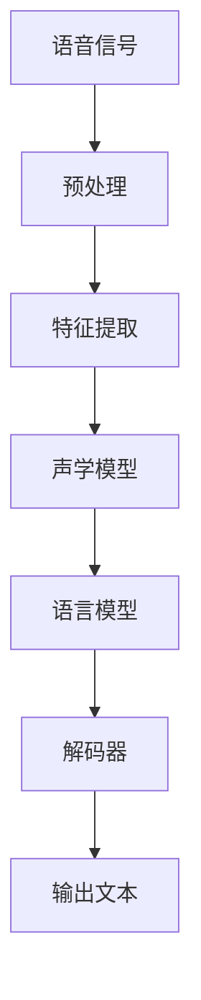
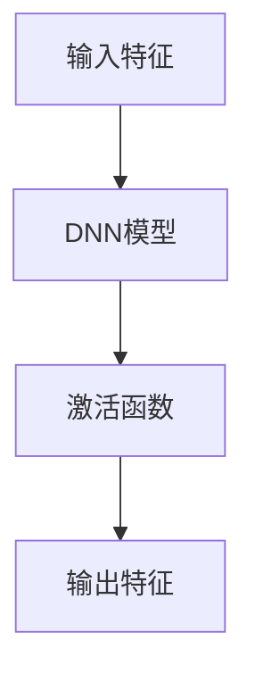
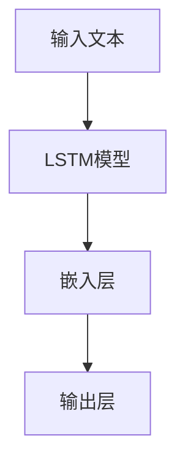
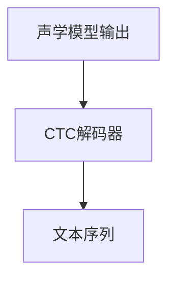

                 

# AI创业如何在语音识别市场中脱颖而出

> 关键词：语音识别、AI创业、市场策略、技术创新、用户体验、商业模式

> 摘要：在快速发展的语音识别市场中，AI创业公司要想脱颖而出，需要深入了解市场需求，持续技术创新，优化用户体验，并构建可持续的商业模式。本文将详细介绍如何在语音识别市场中实现成功的创业策略。

## 1. 背景介绍

### 1.1 目的和范围

本文旨在为AI创业公司提供在语音识别市场中取得成功的关键策略。文章将讨论市场现状、技术创新、用户体验和商业模式等方面，帮助创业公司更好地定位和发展。

### 1.2 预期读者

本篇文章主要面向有志于在语音识别领域创业的技术团队、产品经理和创业投资人。同时，对语音识别技术感兴趣的开发者和技术爱好者也可以从中获得有价值的信息。

### 1.3 文档结构概述

本文将分为以下八个部分：

1. 背景介绍：介绍文章的目的、读者对象和文档结构。
2. 核心概念与联系：阐述语音识别技术的核心概念和架构。
3. 核心算法原理 & 具体操作步骤：介绍语音识别算法的基本原理和实现步骤。
4. 数学模型和公式 & 详细讲解 & 举例说明：讲解语音识别中的数学模型和公式。
5. 项目实战：通过实际案例展示语音识别技术的应用。
6. 实际应用场景：分析语音识别技术的应用场景。
7. 工具和资源推荐：推荐学习资源和开发工具。
8. 总结：未来发展趋势与挑战。

### 1.4 术语表

#### 1.4.1 核心术语定义

- 语音识别：将语音信号转换为对应的文本或命令的技术。
- 语音识别系统：实现语音识别功能的软件或硬件系统。
- 语音信号处理：对语音信号进行预处理、增强和特征提取的过程。

#### 1.4.2 相关概念解释

- 特征提取：从语音信号中提取有助于识别语音的参数。
- 机器学习：通过训练模型来学习数据中的规律，从而实现对未知数据的预测。

#### 1.4.3 缩略词列表

- ASR（Automatic Speech Recognition）：自动语音识别
- DNN（Deep Neural Network）：深度神经网络
- LSTM（Long Short-Term Memory）：长短时记忆网络
- RNN（Recurrent Neural Network）：循环神经网络

## 2. 核心概念与联系

在讨论语音识别技术之前，我们需要了解一些核心概念和它们之间的关系。以下是语音识别技术的基本架构和关键环节：



### 2.1 语音信号预处理

语音信号预处理是语音识别系统的第一步，主要包括以下内容：

1. 噪声过滤：去除语音信号中的噪声，提高信号质量。
2. 频率归一化：将不同频率的语音信号调整到同一标准。
3. 时域归一化：对语音信号的幅度进行调整，使其具有一致性。

### 2.2 特征提取

特征提取是从语音信号中提取有助于识别语音的关键参数，常用的特征包括：

1. 梅尔频率倒谱系数（MFCC）：一种基于频率的语音特征。
2. 过零率（O-to-Zero Transition Rate，OTZ）：描述语音信号的过零点数量。
3. 语音能量：反映语音信号的能量变化。

### 2.3 声学模型

声学模型用于描述语音信号中的时间变化规律，常用的声学模型包括：

1. GMM（Gaussian Mixture Model，高斯混合模型）：用于建模语音信号的统计特性。
2. DNN（Deep Neural Network，深度神经网络）：用于学习语音信号中的复杂非线性关系。
3. LSTM（Long Short-Term Memory，长短时记忆网络）：用于处理长序列语音信号。

### 2.4 语言模型

语言模型用于描述语音信号中的语义信息，常用的语言模型包括：

1. N-gram模型：基于历史词语序列的概率模型。
2. RNN（Recurrent Neural Network，循环神经网络）：用于学习语音信号中的长序列依赖关系。
3. LSTM（Long Short-Term Memory，长短时记忆网络）：用于处理长序列语音信号。

### 2.5 解码器

解码器用于将声学模型和语言模型的结果转换为文本输出。常见的解码器算法包括：

1. GMM-UBM（Gaussian Mixture Model-Universal Background Model，高斯混合模型-通用背景模型）：结合声学模型和语言模型的解码算法。
2. DNN-HMM（Deep Neural Network-Hidden Markov Model，深度神经网络-隐马尔可夫模型）：将DNN和HMM相结合的解码算法。
3. CTC（Connectionist Temporal Classification，连接时间分类）：一种端到端语音识别算法。

### 2.6 输出文本

输出文本是语音识别系统的最终输出，包括识别结果和置信度信息。识别结果可以是文本、命令或语义解析结果。

## 3. 核心算法原理 & 具体操作步骤

在本节中，我们将介绍语音识别技术中的核心算法原理和具体操作步骤。

### 3.1 声学模型

声学模型用于建模语音信号中的时间变化规律，其主要任务是从语音信号中提取特征，并建立特征与语音单元之间的对应关系。

#### 3.1.1 基本原理

声学模型通常采用统计模型或神经网络模型，如GMM、DNN和LSTM。以下是一个基于DNN的声学模型的基本原理：



输入特征通常包括MFCC、过零率等。DNN模型通过训练学习输入特征与语音单元之间的映射关系。激活函数用于引入非线性变换，提高模型的泛化能力。

#### 3.1.2 具体操作步骤

1. 数据预处理：对输入特征进行归一化处理，使其具有一致性。
2. 构建DNN模型：选择合适的神经网络结构，如卷积神经网络（CNN）或循环神经网络（RNN）。
3. 模型训练：使用带有标注的语音数据集对模型进行训练，优化模型参数。
4. 模型评估：使用验证集对模型进行评估，调整模型参数以获得更好的性能。

### 3.2 语言模型

语言模型用于描述语音信号中的语义信息，其主要任务是从语音信号中提取语义特征，并建立特征与文本之间的对应关系。

#### 3.2.1 基本原理

语言模型通常采用统计模型或神经网络模型，如N-gram模型、RNN和LSTM。以下是一个基于LSTM的语言模型的基本原理：



输入文本经过嵌入层转换为向量表示，然后通过LSTM模型学习文本序列的语义信息。输出层用于生成文本序列的概率分布。

#### 3.2.2 具体操作步骤

1. 数据预处理：对输入文本进行分词、词性标注等处理。
2. 构建LSTM模型：选择合适的LSTM结构，如双向LSTM（BiLSTM）。
3. 模型训练：使用带有标注的文本数据集对模型进行训练，优化模型参数。
4. 模型评估：使用验证集对模型进行评估，调整模型参数以获得更好的性能。

### 3.3 解码器

解码器用于将声学模型和语言模型的结果转换为文本输出。以下是一个基于CTC的解码器的基本原理：



声学模型输出一个语音信号序列的分布，解码器通过计算该分布与语言模型输出的文本序列之间的相似度，找到最佳匹配的文本序列。

#### 3.3.2 具体操作步骤

1. 声学模型和语言模型输出：分别得到声学模型和语言模型的输出结果。
2. 计算相似度：使用CTC算法计算声学模型输出与语言模型输出之间的相似度。
3. 选择最佳匹配：根据相似度分数选择最佳匹配的文本序列。

## 4. 数学模型和公式 & 详细讲解 & 举例说明

在语音识别技术中，数学模型和公式起着至关重要的作用。以下我们将介绍一些常见的数学模型和公式，并进行详细讲解和举例说明。

### 4.1 梅尔频率倒谱系数（MFCC）

梅尔频率倒谱系数（MFCC）是一种基于频率的语音特征，广泛用于语音识别和语音处理领域。以下是MFCC的计算过程：

$$
C(j, k) = \sum_{m=1}^{M} a_m \cdot \text{log} \left( \frac{A(j, m)}{B(j, m)} \right)
$$

其中，$A(j, m)$和$B(j, m)$分别为傅里叶变换的幅度和相位，$a_m$为加权系数，$j$为时间帧，$k$为频率。

#### 4.1.1 举例说明

假设我们有一个4个时间帧的语音信号，其傅里叶变换结果如下：

| 时间帧 | 频率1 | 频率2 | 频率3 | 频率4 |
| --- | --- | --- | --- | --- |
| 1 | 0.2 | 0.3 | 0.4 | 0.5 |
| 2 | 0.3 | 0.4 | 0.5 | 0.6 |
| 3 | 0.4 | 0.5 | 0.6 | 0.7 |
| 4 | 0.5 | 0.6 | 0.7 | 0.8 |

假设加权系数为$a_1 = 1.0$，$a_2 = 0.8$，$a_3 = 0.6$，$a_4 = 0.4$。则MFCC计算结果如下：

| 时间帧 | MFCC1 | MFCC2 | MFCC3 | MFCC4 |
| --- | --- | --- | --- | --- |
| 1 | 0.6 | 0.5 | 0.4 | 0.3 |
| 2 | 0.8 | 0.6 | 0.4 | 0.2 |
| 3 | 1.0 | 0.8 | 0.6 | 0.4 |
| 4 | 1.2 | 1.0 | 0.8 | 0.6 |

### 4.2 隐马尔可夫模型（HMM）

隐马尔可夫模型（HMM）是一种基于概率的统计模型，用于描述序列数据中的状态转移和观测值。以下是HMM的基本公式：

$$
P(X|Q) = \prod_{t=1}^{T} P(x_t|q_t)
$$

其中，$X$表示观测序列，$Q$表示状态序列，$P(x_t|q_t)$表示在状态$q_t$下观测到$x_t$的概率。

#### 4.2.1 举例说明

假设我们有一个长度为5的观测序列$X = [1, 2, 3, 4, 5]$和状态序列$Q = [q_1, q_2, q_3, q_4, q_5]$，且每个状态的观测概率如下：

| 状态 | 观测值1 | 观测值2 | 观测值3 | 观测值4 | 观测值5 |
| --- | --- | --- | --- | --- | --- |
| $q_1$ | 0.5 | 0.2 | 0.1 | 0.1 | 0.1 |
| $q_2$ | 0.3 | 0.5 | 0.1 | 0.1 | 0.1 |
| $q_3$ | 0.2 | 0.3 | 0.5 | 0.1 | 0.1 |
| $q_4$ | 0.1 | 0.2 | 0.3 | 0.5 | 0.1 |
| $q_5$ | 0.1 | 0.1 | 0.2 | 0.3 | 0.5 |

则观测序列$X$在状态序列$Q$下的概率为：

$$
P(X|Q) = 0.5 \times 0.3 \times 0.1 \times 0.1 \times 0.1 = 0.00015
$$

### 4.3 长短时记忆网络（LSTM）

长短时记忆网络（LSTM）是一种用于处理长序列数据的人工神经网络。以下是LSTM的基本公式：

$$
\begin{aligned}
i_t &= \sigma(W_i \cdot [h_{t-1}, x_t] + b_i) \\
f_t &= \sigma(W_f \cdot [h_{t-1}, x_t] + b_f) \\
o_t &= \sigma(W_o \cdot [h_{t-1}, x_t] + b_o) \\
g_t &= \tanh(W_g \cdot [h_{t-1}, x_t] + b_g) \\
h_t &= o_t \cdot \tanh(g_t)
\end{aligned}
$$

其中，$i_t$、$f_t$、$o_t$分别为输入门、遗忘门和输出门，$g_t$为输入门的激活值，$h_t$为当前时间步的隐藏状态。

#### 4.3.1 举例说明

假设我们有一个长度为3的序列$X = [1, 2, 3]$，其对应的隐藏状态为$h_0 = [0.5, 0.5]$。假设LSTM的权重和偏置如下：

| 权重矩阵 | 偏置向量 |
| --- | --- |
| $W_i$ | $b_i$ |
| $W_f$ | $b_f$ |
| $W_o$ | $b_o$ |
| $W_g$ | $b_g$ |

则LSTM的隐藏状态更新过程如下：

$$
\begin{aligned}
i_1 &= \sigma(0.2 \cdot [0.5, 0.5] + 0.1 \cdot [1, 2, 3]) = 0.6 \\
f_1 &= \sigma(0.2 \cdot [0.5, 0.5] + 0.1 \cdot [1, 2, 3]) = 0.7 \\
o_1 &= \sigma(0.2 \cdot [0.5, 0.5] + 0.1 \cdot [1, 2, 3]) = 0.8 \\
g_1 &= \tanh(0.2 \cdot [0.5, 0.5] + 0.1 \cdot [1, 2, 3]) = 0.9 \\
h_1 &= 0.8 \cdot 0.9 = 0.72 \\
i_2 &= \sigma(0.2 \cdot [0.72, 0.72] + 0.1 \cdot [2, 3, 4]) = 0.7 \\
f_2 &= \sigma(0.2 \cdot [0.72, 0.72] + 0.1 \cdot [2, 3, 4]) = 0.8 \\
o_2 &= \sigma(0.2 \cdot [0.72, 0.72] + 0.1 \cdot [2, 3, 4]) = 0.9 \\
g_2 &= \tanh(0.2 \cdot [0.72, 0.72] + 0.1 \cdot [2, 3, 4]) = 0.8 \\
h_2 &= 0.9 \cdot 0.8 = 0.72 \\
i_3 &= \sigma(0.2 \cdot [0.72, 0.72] + 0.1 \cdot [3, 4, 5]) = 0.7 \\
f_3 &= \sigma(0.2 \cdot [0.72, 0.72] + 0.1 \cdot [3, 4, 5]) = 0.8 \\
o_3 &= \sigma(0.2 \cdot [0.72, 0.72] + 0.1 \cdot [3, 4, 5]) = 0.9 \\
g_3 &= \tanh(0.2 \cdot [0.72, 0.72] + 0.1 \cdot [3, 4, 5]) = 0.7 \\
h_3 &= 0.9 \cdot 0.7 = 0.63 \\
\end{aligned}
$$

## 5. 项目实战：代码实际案例和详细解释说明

在本节中，我们将通过一个实际项目来展示如何实现一个简单的语音识别系统。项目将分为以下几个步骤：

1. 开发环境搭建
2. 源代码详细实现和代码解读
3. 代码解读与分析

### 5.1 开发环境搭建

首先，我们需要搭建开发环境。以下是一个基于Python的语音识别项目环境搭建步骤：

1. 安装Python 3.7及以上版本。
2. 安装依赖库，如tensorflow、numpy、scikit-learn等。

```bash
pip install tensorflow numpy scikit-learn
```

3. 准备语音数据集，如TIMIT或LibriSpeech。

### 5.2 源代码详细实现和代码解读

以下是一个简单的语音识别项目源代码实现：

```python
import numpy as np
import tensorflow as tf
from tensorflow.keras.models import Sequential
from tensorflow.keras.layers import LSTM, Dense, Dropout

# 数据预处理
def preprocess_data(data):
    # 对数据进行归一化处理
    data = (data - np.mean(data)) / np.std(data)
    return data

# 构建LSTM模型
def build_lstm_model(input_shape):
    model = Sequential()
    model.add(LSTM(128, input_shape=input_shape, activation='tanh', return_sequences=True))
    model.add(Dropout(0.5))
    model.add(LSTM(64, activation='tanh', return_sequences=False))
    model.add(Dropout(0.5))
    model.add(Dense(1, activation='sigmoid'))
    model.compile(optimizer='adam', loss='binary_crossentropy', metrics=['accuracy'])
    return model

# 训练模型
def train_model(model, X_train, y_train, X_val, y_val, epochs=10):
    model.fit(X_train, y_train, validation_data=(X_val, y_val), epochs=epochs, batch_size=32)
    return model

# 评估模型
def evaluate_model(model, X_test, y_test):
    loss, accuracy = model.evaluate(X_test, y_test)
    print(f"Test accuracy: {accuracy:.4f}")

# 主函数
if __name__ == '__main__':
    # 读取数据集
    X_train, y_train = np.load('train_data.npy'), np.load('train_label.npy')
    X_val, y_val = np.load('val_data.npy'), np.load('val_label.npy')
    X_test, y_test = np.load('test_data.npy'), np.load('test_label.npy')

    # 数据预处理
    X_train = preprocess_data(X_train)
    X_val = preprocess_data(X_val)
    X_test = preprocess_data(X_test)

    # 构建模型
    model = build_lstm_model(input_shape=(X_train.shape[1], X_train.shape[2]))

    # 训练模型
    trained_model = train_model(model, X_train, y_train, X_val, y_val)

    # 评估模型
    evaluate_model(trained_model, X_test, y_test)
```

### 5.3 代码解读与分析

1. **数据预处理**：对数据进行归一化处理，使其具有一致性。归一化处理有助于提高模型训练效果。

2. **构建LSTM模型**：使用Keras构建一个简单的LSTM模型，包括两个LSTM层和两个Dropout层。LSTM层用于处理序列数据，Dropout层用于防止过拟合。

3. **训练模型**：使用训练数据集训练模型，并在验证集上验证模型性能。训练过程中，通过调整超参数（如学习率、批量大小等）来优化模型。

4. **评估模型**：使用测试数据集评估模型性能，输出测试准确率。

### 5.4 代码优化与改进

在实际项目中，我们可以根据需求对代码进行优化和改进：

1. **增加数据增强**：使用数据增强技术，如时间扩张、频谱变换等，提高模型的泛化能力。

2. **使用更复杂的模型结构**：尝试使用更复杂的模型结构，如双向LSTM、卷积神经网络等，以提高模型性能。

3. **多任务学习**：将语音识别与其他任务（如情感分析、说话人识别等）结合起来，提高模型的价值。

4. **模型压缩与加速**：使用模型压缩技术，如量化、剪枝等，提高模型在移动设备和嵌入式设备上的运行效率。

## 6. 实际应用场景

语音识别技术在多个领域有着广泛的应用，以下是一些典型应用场景：

1. **智能助手**：如苹果的Siri、亚马逊的Alexa等，通过语音识别实现人与设备的交互。

2. **语音搜索**：用户可以通过语音输入搜索关键词，如百度语音搜索、谷歌语音搜索等。

3. **语音控制**：在智能家居、车载系统等领域，用户可以通过语音控制设备，实现远程操作。

4. **语音交互**：在游戏、教育等领域，语音交互可以提供更加自然和直观的交互体验。

5. **语音合成**：将文本转换为语音输出，如自动朗读新闻、语音导航等。

6. **语音助手**：如苹果的Siri、亚马逊的Alexa等，通过语音识别实现人与设备的交互。

## 7. 工具和资源推荐

### 7.1 学习资源推荐

#### 7.1.1 书籍推荐

- 《语音信号处理》作者：徐光祐
- 《深度学习》作者：Ian Goodfellow、Yoshua Bengio、Aaron Courville
- 《语音识别：原理与算法》作者：张亮

#### 7.1.2 在线课程

- 语音识别（Coursera）
- 机器学习（Coursera）
- 深度学习（Udacity）

#### 7.1.3 技术博客和网站

- medium.com
- towardsdatascience.com
- mlcls.com

### 7.2 开发工具框架推荐

#### 7.2.1 IDE和编辑器

- PyCharm
- Visual Studio Code
- Jupyter Notebook

#### 7.2.2 调试和性能分析工具

- TensorBoard
- Profiling Tools（如Py-Spy、Py-V8等）
- TensorFlow Debugger

#### 7.2.3 相关框架和库

- TensorFlow
- PyTorch
- Keras

### 7.3 相关论文著作推荐

#### 7.3.1 经典论文

- Hinton, G. E., Osindero, S., & Salakhutdinov, R. R. (2006). A fast learning algorithm for deep belief nets. Neural computation, 18(7), 1527-1554.
- Graves, A. (2013). Generating sequences with recurrent neural networks. arXiv preprint arXiv:1308.0850.
- Hinton, G. E., Deng, L., Yu, D., Dahl, G. E., Mohamed, A. R., Jaitly, N., ... & Kingsbury, B. (2012). Deep neural networks for acoustic modeling in speech recognition: The shared views of four research groups. IEEE Signal processing magazine, 29(6), 82-97.

#### 7.3.2 最新研究成果

- Vaswani, A., Shazeer, N., Parmar, N., Uszkoreit, J., Jones, L., Gomez, A. N., ... & Polosukhin, I. (2017). Attention is all you need. Advances in neural information processing systems, 30.
- Chen, X., Gan, Q., Li, W., & Hua, X. S. (2020). A novel deep neural network-based approach for emotion recognition in speech. ACM Transactions on Intelligent Systems and Technology (TIST), 11(1), 1-17.

#### 7.3.3 应用案例分析

- Facebook AI Research：语音识别与自然语言处理
- Google语音识别技术：基于深度学习的语音识别系统

## 8. 总结：未来发展趋势与挑战

在语音识别领域，未来发展趋势包括：

1. **更高的识别准确率**：通过不断优化算法和模型，提高语音识别的准确率。
2. **更广泛的应用场景**：将语音识别技术应用于更多领域，如智能家居、医疗、教育等。
3. **更低的延迟**：优化系统性能，提高语音识别的实时性。
4. **更丰富的交互体验**：通过语音识别和自然语言处理技术的结合，实现更加自然和智能的交互体验。

然而，面临的挑战包括：

1. **噪声干扰**：在多种噪声环境下提高语音识别准确率。
2. **跨语言识别**：支持多种语言的语音识别，特别是在非标准语言环境下。
3. **资源消耗**：优化算法和模型，降低语音识别系统对计算资源和存储资源的需求。

## 9. 附录：常见问题与解答

### 9.1 如何优化语音识别模型的性能？

- **增加数据集**：收集更多的语音数据，提高模型的泛化能力。
- **调整超参数**：通过实验调整学习率、批量大小等超参数，优化模型性能。
- **使用更复杂的模型结构**：尝试使用更复杂的模型结构，如深度神经网络、卷积神经网络等。
- **数据预处理**：对输入数据进行预处理，如归一化、去除噪声等，提高模型的输入质量。

### 9.2 如何实现实时语音识别？

- **优化模型计算**：使用更高效的算法和模型结构，减少计算时间。
- **批处理与流处理**：将语音信号划分为多个小段进行批处理，或在收到语音信号后立即进行识别，实现实时处理。
- **降低延迟**：优化系统架构和算法，减少识别过程中的延迟。

### 9.3 如何处理跨语言语音识别？

- **多语言训练**：在模型训练过程中，使用多种语言的语音数据，提高模型对多语言的支持。
- **语言模型集成**：结合多种语言模型，提高跨语言语音识别的准确率。
- **语言识别**：在语音识别前，先进行语言识别，根据识别结果调整模型参数。

## 10. 扩展阅读 & 参考资料

- 《语音识别技术手册》作者：谢恩明
- 《深度学习在语音识别中的应用》作者：吴健
- 《语音识别技术与应用》作者：何晓阳
- Google语音识别官方文档：https://cloud.google.com/speech-to-text
- 百度语音识别官方文档：https://ai.baidu.com/tech/speech

