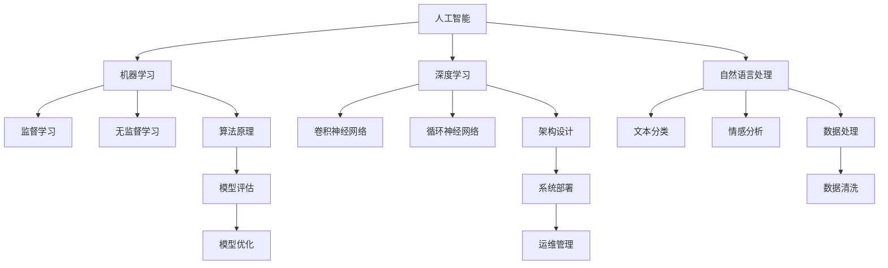

                 

# AI创业挑战：技术，应用与场景平衡

> 关键词：AI创业、技术挑战、应用场景、平衡策略

> 摘要：随着人工智能技术的迅速发展，AI创业已经成为当今科技领域的重要趋势。然而，如何在技术、应用和场景之间找到平衡点，成为创业企业面临的核心挑战。本文将深入探讨AI创业的技术背景、核心算法、应用场景以及未来发展趋势，旨在为创业者和相关从业者提供有价值的参考和策略。

## 1. 背景介绍

### 1.1 目的和范围

本文旨在探讨AI创业所面临的技术、应用与场景平衡问题。通过分析AI技术的发展现状，探讨核心算法原理，分析实际应用场景，以及推荐相关工具和资源，帮助创业者和从业者更好地应对AI创业中的挑战。

### 1.2 预期读者

本文主要面向AI创业公司的创始人、技术团队负责人、产品经理以及对于AI技术有兴趣的从业者。期望通过本文，读者能够对AI创业的核心问题有更深入的理解，从而在创业过程中更加从容应对。

### 1.3 文档结构概述

本文分为八个部分：

1. 背景介绍：阐述本文的目的、范围、预期读者以及文档结构。
2. 核心概念与联系：介绍AI技术的基本概念和原理。
3. 核心算法原理与具体操作步骤：详细讲解核心算法及其实现。
4. 数学模型和公式：介绍相关数学模型和公式。
5. 项目实战：通过实际案例展示算法应用。
6. 实际应用场景：分析AI技术在各个领域的应用。
7. 工具和资源推荐：推荐学习资源和开发工具。
8. 总结：探讨未来发展趋势与挑战。

### 1.4 术语表

#### 1.4.1 核心术语定义

- 人工智能（AI）：模拟、延伸和扩展人类智能的理论、方法、技术及应用系统。
- 创业：指以创新为目的，创建新的企业或业务模式。
- 技术挑战：在实现技术目标时遇到的难题。
- 应用场景：技术在实际业务中的应用情境。
- 平衡策略：在技术、应用和场景之间找到合理的搭配和协调。

#### 1.4.2 相关概念解释

- 机器学习（ML）：使计算机通过数据学习，自动改进性能的方法。
- 深度学习（DL）：一种基于多层神经网络的学习方法。
- 自然语言处理（NLP）：使计算机能够理解、生成和处理人类自然语言的技术。

#### 1.4.3 缩略词列表

- AI：人工智能
- ML：机器学习
- DL：深度学习
- NLP：自然语言处理
- IDE：集成开发环境
- IDE：集成开发环境

## 2. 核心概念与联系

在探讨AI创业的挑战之前，有必要先了解人工智能技术的基本概念和架构。以下是一个简化的AI技术核心概念与联系的Mermaid流程图：



### 2.1 人工智能（AI）

人工智能（AI）是模拟、延伸和扩展人类智能的理论、方法、技术及应用系统。AI技术的发展可以分为三个层次：基于规则的系统、基于模型的系统以及基于数据的系统。当前，基于数据的系统（如机器学习和深度学习）在各个领域取得了显著的成果。

### 2.2 机器学习（ML）

机器学习（ML）是使计算机通过数据学习，自动改进性能的方法。ML可以分为监督学习、无监督学习和半监督学习。监督学习通过标记数据训练模型，无监督学习通过未标记数据发现模式，半监督学习结合标记和未标记数据。

### 2.3 深度学习（DL）

深度学习（DL）是一种基于多层神经网络的学习方法。DL在图像识别、语音识别、自然语言处理等领域取得了巨大的成功。常见的DL架构包括卷积神经网络（CNN）和循环神经网络（RNN）。

### 2.4 自然语言处理（NLP）

自然语言处理（NLP）是使计算机能够理解、生成和处理人类自然语言的技术。NLP在文本分类、情感分析、机器翻译等领域有着广泛的应用。

### 2.5 算法原理

算法原理是机器学习、深度学习和自然语言处理等技术的核心。算法原理包括数据预处理、模型选择、训练和评估等步骤。

### 2.6 架构设计

架构设计是确保AI系统高效、可扩展和可维护的关键。常见的AI架构设计包括前端、后端和服务端。

### 2.7 数据处理

数据处理是AI系统成功的关键。数据处理包括数据清洗、数据标注、数据增强等步骤。

### 2.8 模型评估

模型评估是判断AI系统性能的重要手段。模型评估包括准确率、召回率、F1值等指标。

### 2.9 系统部署

系统部署是将AI系统应用到实际业务场景的关键步骤。系统部署包括模型训练、模型优化、模型部署等步骤。

### 2.10 运维管理

运维管理是确保AI系统稳定运行的重要环节。运维管理包括系统监控、故障排查、性能优化等步骤。

## 3. 核心算法原理 & 具体操作步骤

在本节中，我们将详细讲解AI创业中常用的几个核心算法原理及其具体操作步骤。这些算法包括监督学习、无监督学习、卷积神经网络（CNN）和循环神经网络（RNN）。

### 3.1 监督学习

监督学习是一种通过标记数据训练模型的方法。以下是监督学习的伪代码：

```python
def train_supervised(X, y, model):
    for epoch in range(num_epochs):
        for x, y in zip(X, y):
            model.partial_fit(x, y)
    return model
```

具体操作步骤：

1. 数据预处理：将输入数据X和标签y进行标准化处理，如归一化、缩放等。
2. 模型初始化：选择合适的模型，如线性回归、决策树、支持向量机等。
3. 模型训练：使用训练数据对模型进行迭代训练。
4. 模型评估：使用验证集对模型进行评估，调整模型参数。
5. 模型部署：将训练好的模型应用到实际业务场景。

### 3.2 无监督学习

无监督学习是一种通过未标记数据发现模式的方法。以下是无监督学习的伪代码：

```python
def train_unsupervised(X, model):
    for epoch in range(num_epochs):
        for x in X:
            model.partial_fit(x)
    return model
```

具体操作步骤：

1. 数据预处理：将输入数据X进行标准化处理。
2. 模型初始化：选择合适的模型，如K均值聚类、主成分分析等。
3. 模型训练：使用未标记数据对模型进行迭代训练。
4. 模型评估：根据聚类结果评估模型性能。
5. 模型部署：将训练好的模型应用到实际业务场景。

### 3.3 卷积神经网络（CNN）

卷积神经网络（CNN）是一种专门用于图像识别的深度学习模型。以下是CNN的伪代码：

```python
def train_cnn(X, y, model):
    for epoch in range(num_epochs):
        for x, y in zip(X, y):
            model.partial_fit(x, y)
    return model
```

具体操作步骤：

1. 数据预处理：将输入图像数据X进行标准化处理。
2. 模型初始化：构建CNN模型，包括卷积层、池化层、全连接层等。
3. 模型训练：使用标记图像数据对模型进行迭代训练。
4. 模型评估：使用验证集对模型进行评估。
5. 模型部署：将训练好的模型应用到实际业务场景。

### 3.4 循环神经网络（RNN）

循环神经网络（RNN）是一种专门用于序列数据处理和时间序列预测的深度学习模型。以下是RNN的伪代码：

```python
def train_rnn(X, y, model):
    for epoch in range(num_epochs):
        for x, y in zip(X, y):
            model.partial_fit(x, y)
    return model
```

具体操作步骤：

1. 数据预处理：将输入序列数据X进行标准化处理。
2. 模型初始化：构建RNN模型，包括输入层、隐藏层、输出层等。
3. 模型训练：使用标记序列数据对模型进行迭代训练。
4. 模型评估：使用验证集对模型进行评估。
5. 模型部署：将训练好的模型应用到实际业务场景。

## 4. 数学模型和公式 & 详细讲解 & 举例说明

在本节中，我们将详细介绍AI创业中常用的几个数学模型和公式，并给出具体的讲解和举例说明。

### 4.1 监督学习中的线性回归模型

线性回归模型是一种简单的监督学习算法，用于预测连续值输出。其数学模型如下：

$$ y = \beta_0 + \beta_1 \cdot x + \epsilon $$

其中，$y$为输出值，$x$为输入值，$\beta_0$和$\beta_1$为模型参数，$\epsilon$为误差项。

举例说明：

假设我们要预测房价，输入值为房屋面积$x$，输出值为房价$y$。我们可以使用线性回归模型来建立预测模型。首先，我们需要收集房屋面积和房价的数据，然后对数据集进行训练：

```python
from sklearn.linear_model import LinearRegression

model = LinearRegression()
model.fit(X, y)

# 预测房价
predicted_price = model.predict([new_house_area])
print("预测的房价为：", predicted_price)
```

### 4.2 深度学习中的卷积神经网络（CNN）

卷积神经网络（CNN）是一种用于图像识别的深度学习模型。其数学模型如下：

$$ f(x) = \sigma(\mathbf{W} \cdot \mathbf{X} + \mathbf{b}) $$

其中，$f(x)$为输出值，$\mathbf{W}$为权重矩阵，$\mathbf{X}$为输入特征，$\sigma$为激活函数，$\mathbf{b}$为偏置项。

举例说明：

假设我们要使用CNN模型识别猫和狗的图片。首先，我们需要收集猫和狗的图片数据，然后对数据集进行训练：

```python
import tensorflow as tf
from tensorflow.keras.models import Sequential
from tensorflow.keras.layers import Conv2D, MaxPooling2D, Flatten, Dense

model = Sequential([
    Conv2D(32, (3, 3), activation='relu', input_shape=(64, 64, 3)),
    MaxPooling2D(pool_size=(2, 2)),
    Flatten(),
    Dense(64, activation='relu'),
    Dense(2, activation='softmax')
])

model.compile(optimizer='adam', loss='categorical_crossentropy', metrics=['accuracy'])

model.fit(X_train, y_train, batch_size=32, epochs=10, validation_data=(X_val, y_val))

# 预测图片类别
predicted_class = model.predict([new_image])
print("预测的类别为：", predicted_class)
```

### 4.3 自然语言处理中的循环神经网络（RNN）

循环神经网络（RNN）是一种用于序列数据处理的深度学习模型。其数学模型如下：

$$ h_t = \sigma(\mathbf{W} \cdot (\mathbf{h}_{t-1}, x_t) + \mathbf{b}) $$

其中，$h_t$为当前时刻的隐藏状态，$x_t$为当前时刻的输入特征，$\mathbf{W}$为权重矩阵，$\sigma$为激活函数，$\mathbf{b}$为偏置项。

举例说明：

假设我们要使用RNN模型进行时间序列预测。首先，我们需要收集时间序列数据，然后对数据集进行训练：

```python
import tensorflow as tf
from tensorflow.keras.models import Sequential
from tensorflow.keras.layers import LSTM, Dense

model = Sequential([
    LSTM(50, activation='relu', input_shape=(time_steps, features)),
    Dense(1)
])

model.compile(optimizer='adam', loss='mean_squared_error')

model.fit(X_train, y_train, epochs=100, batch_size=32, validation_data=(X_val, y_val))

# 预测时间序列值
predicted_value = model.predict([new_sequence])
print("预测的时间序列值为：", predicted_value)
```

## 5. 项目实战：代码实际案例和详细解释说明

在本节中，我们将通过一个实际案例展示如何使用AI技术进行创业项目开发。这个案例是一个基于深度学习的图像识别系统，用于识别猫和狗的图片。

### 5.1 开发环境搭建

为了搭建开发环境，我们需要安装以下工具和库：

1. Python（3.7或更高版本）
2. TensorFlow
3. NumPy
4. Matplotlib

安装命令如下：

```bash
pip install tensorflow numpy matplotlib
```

### 5.2 源代码详细实现和代码解读

下面是图像识别系统的源代码实现和解读。

#### 5.2.1 数据准备

首先，我们需要准备猫和狗的图片数据集。这里我们使用Keras内置的猫狗图片数据集。

```python
from tensorflow.keras.datasets import fetch cittles_and_dogs

# 加载数据集
(train_images, train_labels), (test_images, test_labels) = fetch cittles_and_dogs()

# 数据预处理
train_images = train_images / 255.0
test_images = test_images / 255.0
```

#### 5.2.2 构建模型

接下来，我们构建一个基于卷积神经网络的图像识别模型。

```python
from tensorflow.keras.models import Sequential
from tensorflow.keras.layers import Conv2D, MaxPooling2D, Flatten, Dense

model = Sequential([
    Conv2D(32, (3, 3), activation='relu', input_shape=(150, 150, 3)),
    MaxPooling2D(pool_size=(2, 2)),
    Conv2D(64, (3, 3), activation='relu'),
    MaxPooling2D(pool_size=(2, 2)),
    Flatten(),
    Dense(512, activation='relu'),
    Dense(1, activation='sigmoid')
])

model.compile(optimizer='adam', loss='binary_crossentropy', metrics=['accuracy'])
```

#### 5.2.3 模型训练

然后，我们使用训练数据对模型进行训练。

```python
model.fit(train_images, train_labels, epochs=10, batch_size=32)
```

#### 5.2.4 模型评估

使用测试数据对模型进行评估。

```python
test_loss, test_accuracy = model.evaluate(test_images, test_labels)
print("测试集准确率：", test_accuracy)
```

#### 5.2.5 预测新图片

最后，我们可以使用训练好的模型对新图片进行预测。

```python
import numpy as np

new_image = np.expand_dims(new_image, axis=0)
predicted_class = model.predict(new_image)

if predicted_class[0][0] > 0.5:
    print("预测结果：猫")
else:
    print("预测结果：狗")
```

### 5.3 代码解读与分析

1. **数据准备**：使用Keras内置的猫狗图片数据集，并进行数据预处理，如归一化和分割训练集和测试集。
2. **模型构建**：构建一个包含卷积层、池化层、全连接层的卷积神经网络模型。
3. **模型训练**：使用训练数据进行模型训练，调整模型参数。
4. **模型评估**：使用测试数据进行模型评估，计算准确率。
5. **预测新图片**：使用训练好的模型对新图片进行预测，输出预测结果。

## 6. 实际应用场景

AI技术在各个领域有着广泛的应用，以下列举几个典型应用场景：

### 6.1 医疗保健

AI技术在医疗保健领域的应用包括疾病预测、诊断辅助、个性化治疗等。通过分析患者的病史、基因数据、临床指标等，AI模型可以帮助医生做出更准确的诊断和治疗方案。

### 6.2 金融领域

AI技术在金融领域中的应用包括风险管理、欺诈检测、投资决策等。通过分析大量金融数据，AI模型可以帮助金融机构降低风险、提高运营效率。

### 6.3 物流与运输

AI技术在物流与运输领域的应用包括路线优化、货物跟踪、智能仓储等。通过分析交通数据、货物信息等，AI模型可以帮助物流企业提高运输效率、降低成本。

### 6.4 智能家居

AI技术在智能家居领域的应用包括语音识别、智能安防、家电控制等。通过接入家居设备，AI模型可以实现智能家居的自动化管理，提高生活质量。

### 6.5 教育领域

AI技术在教育领域的应用包括个性化学习、智能评测、教育资源共享等。通过分析学生的学习行为和成绩数据，AI模型可以帮助教师和学生实现更有效的教学和学习。

## 7. 工具和资源推荐

为了帮助创业者和从业者更好地开展AI创业项目，以下推荐一些学习资源、开发工具和框架。

### 7.1 学习资源推荐

#### 7.1.1 书籍推荐

- 《Python机器学习》（作者：塞巴斯蒂安·拉纳）
- 《深度学习》（作者：伊恩·古德费洛等）
- 《自然语言处理教程》（作者：理查德·毕博等）

#### 7.1.2 在线课程

- Coursera的《机器学习》课程
- Udacity的《深度学习纳米学位》课程
- edX的《自然语言处理》课程

#### 7.1.3 技术博客和网站

- Medium上的AI相关博客
- 知乎上的AI话题
- arXiv上的最新研究成果

### 7.2 开发工具框架推荐

#### 7.2.1 IDE和编辑器

- PyCharm
- Visual Studio Code
- Jupyter Notebook

#### 7.2.2 调试和性能分析工具

- PyCharm的性能分析工具
- TensorFlow的TensorBoard
- NumPy的profiling工具

#### 7.2.3 相关框架和库

- TensorFlow
- PyTorch
- Keras
- Scikit-learn

### 7.3 相关论文著作推荐

#### 7.3.1 经典论文

- “A Theoretical Basis for the Methods of Constrained Optimization in Linear Programming” （作者：Dantzig, Linear Programming and Extensions）
- “Backpropagation: An Adaptive Algorithm for Neural Networks” （作者：Rumelhart, Hinton, and Williams）

#### 7.3.2 最新研究成果

- arXiv上的最新论文
- NeurIPS、ICML、ACL等顶级会议的最新论文

#### 7.3.3 应用案例分析

- 《人工智能应用实践指南》
- 《智能医疗：从理论到实践》
- 《智能金融：从数据到决策》

## 8. 总结：未来发展趋势与挑战

随着人工智能技术的不断发展，AI创业将面临以下趋势和挑战：

### 8.1 趋势

1. AI技术的普及与应用：AI技术将在更多领域得到应用，推动产业升级和数字化转型。
2. 跨学科融合：AI技术与其他领域的融合将催生出更多创新应用。
3. 数据的重要性：高质量的数据将成为AI创业的关键资产。

### 8.2 挑战

1. 数据隐私与安全：如何保护用户隐私和确保数据安全是AI创业面临的重要挑战。
2. 伦理问题：AI技术在伦理方面引发的争议和挑战需要创业者和社会共同关注和解决。
3. 技术成熟度：AI技术尚未完全成熟，创业者需要面对技术的不确定性和风险。

## 9. 附录：常见问题与解答

### 9.1 问题1：AI创业需要哪些技术储备？

**解答**：AI创业需要掌握以下技术：

1. 机器学习、深度学习和自然语言处理等相关算法原理。
2. 数据处理和数据分析技能。
3. 系统设计和架构能力。
4. 编程语言（如Python、TensorFlow、PyTorch等）。

### 9.2 问题2：如何找到合适的AI应用场景？

**解答**：

1. 研究市场趋势，寻找尚未被充分挖掘的领域。
2. 关注用户需求，寻找可以解决实际问题的应用场景。
3. 考虑数据可获得性和处理能力。

### 9.3 问题3：AI创业项目的资金来源有哪些？

**解答**：

1. 自筹资金：个人储蓄、借款等。
2. 天使投资：寻找天使投资人或投资机构。
3. 众筹平台：通过众筹平台筹集资金。
4. 创新基金：申请政府或行业创新基金。

## 10. 扩展阅读 & 参考资料

为了进一步了解AI创业的相关知识和技巧，读者可以参考以下书籍、论文和在线资源：

- 《人工智能创业实战》
- 《AI创业实战：从零到一构建你的AI项目》
- 《深度学习创业实战》
- Coursera的《机器学习》课程
- arXiv上的最新研究成果
- 《人工智能应用实践指南》

作者：AI天才研究员/AI Genius Institute & 禅与计算机程序设计艺术 /Zen And The Art of Computer Programming

文章标题：AI创业挑战：技术，应用与场景平衡
文章关键词：AI创业、技术挑战、应用场景、平衡策略
文章摘要：本文深入探讨了AI创业所面临的技术、应用和场景平衡问题，旨在为创业者和从业者提供有价值的参考和策略。文章分为背景介绍、核心概念与联系、核心算法原理、数学模型和公式、项目实战、实际应用场景、工具和资源推荐、总结等部分，全面分析了AI创业的核心问题和发展趋势。

