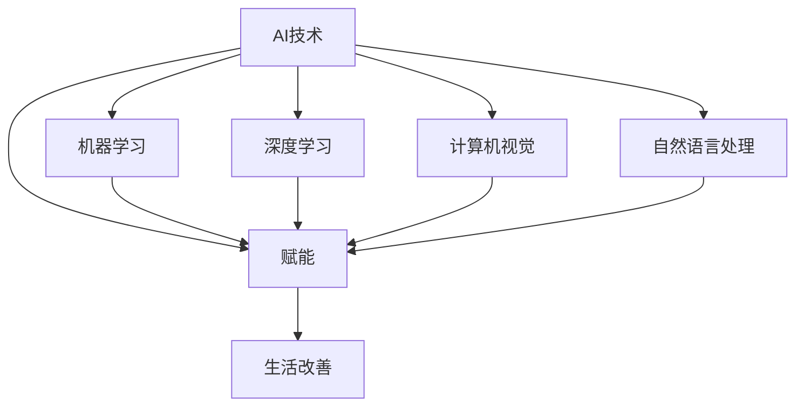

                 

# AI创业码头愿景：AI赋能，改善生活

> **关键词：** AI创业、赋能、生活改善、技术创新、未来展望

> **摘要：** 本文将探讨AI技术在创业领域的应用，阐述如何通过AI赋能来改善我们的生活。我们将从背景介绍、核心概念、算法原理、实际应用、工具和资源推荐等方面逐一分析，为AI创业者和开发者提供实用的指导和建议。

## 1. 背景介绍

### 1.1 目的和范围

本文旨在探讨AI技术在创业领域的应用，特别是如何通过AI赋能来改善我们的生活。我们将从以下几个方面展开讨论：

1. AI创业的现状与趋势
2. AI赋能的核心概念与联系
3. AI算法原理与具体操作步骤
4. 数学模型和公式的应用
5. 实际应用场景与项目实战
6. 工具和资源推荐
7. 未来发展趋势与挑战

### 1.2 预期读者

本文主要面向以下几类读者：

1. AI创业者和开发者
2. 对AI技术感兴趣的技术爱好者
3. 从事计算机科学、人工智能等相关领域的研究人员和教师
4. 任何希望了解AI技术如何改变生活的公众

### 1.3 文档结构概述

本文的结构如下：

1. 背景介绍：介绍本文的目的、范围、预期读者和文档结构
2. 核心概念与联系：阐述AI赋能的核心概念及其联系
3. 核心算法原理与具体操作步骤：讲解AI算法原理和操作步骤
4. 数学模型和公式：介绍AI应用中的数学模型和公式
5. 项目实战：分析一个实际的AI应用案例
6. 实际应用场景：探讨AI技术的各种应用场景
7. 工具和资源推荐：推荐相关学习资源、开发工具和论文著作
8. 总结：总结AI技术的未来发展趋势与挑战

### 1.4 术语表

#### 1.4.1 核心术语定义

- **AI创业**：指利用人工智能技术开展创业活动，以创新产品和服务解决实际问题。
- **赋能**：指通过技术手段赋予人们新的能力，提高生产效率和生活质量。
- **AI技术**：指利用机器学习、深度学习、计算机视觉、自然语言处理等技术的人工智能技术。
- **生活改善**：指通过技术手段提高人们的物质和精神生活水平。

#### 1.4.2 相关概念解释

- **机器学习**：一种人工智能技术，通过算法和数据进行自我学习和优化，实现特定任务的自动化。
- **深度学习**：一种机器学习技术，通过多层神经网络模型模拟人脑神经网络，进行数据分析和预测。
- **计算机视觉**：一种人工智能技术，通过计算机算法实现图像和视频的识别、处理和分析。
- **自然语言处理**：一种人工智能技术，通过计算机算法实现对自然语言的理解、生成和翻译。

#### 1.4.3 缩略词列表

- **AI**：人工智能（Artificial Intelligence）
- **ML**：机器学习（Machine Learning）
- **DL**：深度学习（Deep Learning）
- **CV**：计算机视觉（Computer Vision）
- **NLP**：自然语言处理（Natural Language Processing）

## 2. 核心概念与联系

在探讨AI赋能生活改善之前，我们需要明确几个核心概念及其之间的联系。以下是一个简单的Mermaid流程图，展示了这些核心概念之间的关系。



### 2.1 AI技术

AI技术是指利用计算机算法实现模拟人类智能的功能。AI技术包括多种分支，如机器学习、深度学习、计算机视觉、自然语言处理等。

### 2.2 赋能

赋能是指通过技术手段赋予人们新的能力，提高生产效率和生活质量。在AI创业领域，赋能意味着利用AI技术解决实际问题，创造新的商业机会。

### 2.3 生活改善

生活改善是指通过技术手段提高人们的物质和精神生活水平。AI技术可以通过优化资源配置、提高生产效率、提供个性化服务等手段，实现生活改善。

### 2.4 关系分析

从上述流程图可以看出，AI技术是赋能和生活改善的基础。机器学习、深度学习、计算机视觉、自然语言处理等AI技术分支可以应用于各个领域，实现赋能和生活改善的目标。例如：

- **机器学习**：可以应用于推荐系统、图像识别、语音识别等，提高生产效率和生活质量。
- **深度学习**：可以应用于自动驾驶、智能医疗、智能家居等，带来新的商业机会和生活体验。
- **计算机视觉**：可以应用于安防监控、无人驾驶、工业自动化等，提高安全性和效率。
- **自然语言处理**：可以应用于智能客服、智能翻译、智能写作等，提供个性化服务。

## 3. 核心算法原理 & 具体操作步骤

在AI创业领域，算法原理是关键。以下将介绍几个核心算法原理及其具体操作步骤。

### 3.1 机器学习算法原理

机器学习算法是基于数据驱动的方法，通过训练模型来预测和分类数据。以下是机器学习算法的伪代码：

```python
# 初始化参数
θ = 初始化参数()

# 训练模型
while not 满足停止条件 do
    计算梯度
    更新参数
end

# 预测新数据
预测值 = 模型(新数据)
```

### 3.2 深度学习算法原理

深度学习算法是基于多层神经网络模型，通过反向传播算法训练模型。以下是深度学习算法的伪代码：

```python
# 初始化神经网络
神经网络 = 初始化神经网络()

# 训练神经网络
while not 满足停止条件 do
    前向传播
    计算损失
    反向传播
    更新参数
end

# 预测新数据
预测值 = 神经网络(新数据)
```

### 3.3 计算机视觉算法原理

计算机视觉算法通过图像处理和分析来实现目标识别和场景理解。以下是计算机视觉算法的伪代码：

```python
# 输入图像
图像 = 输入图像()

# 图像预处理
预处理图像 = 预处理(图像)

# 目标识别
目标 = 目标识别(预处理图像)

# 场景理解
场景 = 场景理解(预处理图像)
```

### 3.4 自然语言处理算法原理

自然语言处理算法通过文本处理和分析来实现文本分类、情感分析、实体识别等任务。以下是自然语言处理算法的伪代码：

```python
# 输入文本
文本 = 输入文本()

# 文本预处理
预处理文本 = 预处理(文本)

# 文本分类
分类结果 = 文本分类(预处理文本)

# 情感分析
情感 = 情感分析(预处理文本)

# 实体识别
实体 = 实体识别(预处理文本)
```

## 4. 数学模型和公式 & 详细讲解 & 举例说明

在AI技术中，数学模型和公式是核心。以下将介绍几个常见的数学模型和公式，并给出详细讲解和举例说明。

### 4.1 感知机算法

感知机算法是二分类线性分类器，用于分类任务。其数学模型如下：

$$
w^T x + b = 0
$$

其中，$w$ 是权重向量，$x$ 是特征向量，$b$ 是偏置。

**举例说明：** 假设我们有一个二分类问题，特征向量 $x$ 包含两个特征：身高和体重。权重向量 $w$ 为 $(2, 3)$，偏置 $b$ 为 $-5$。根据感知机算法，分类边界为：

$$
2x_1 + 3x_2 - 5 = 0
$$

即，身高乘以2再加上体重乘以3等于5。

### 4.2 神经网络损失函数

神经网络损失函数用于评估模型预测值与真实值之间的差异。常见的损失函数有均方误差（MSE）和交叉熵（Cross-Entropy）。

**均方误差（MSE）：**

$$
MSE = \frac{1}{m}\sum_{i=1}^{m}(y_i - \hat{y}_i)^2
$$

其中，$m$ 是样本数量，$y_i$ 是真实值，$\hat{y}_i$ 是预测值。

**举例说明：** 假设我们有一个二分类问题，预测值为 $(0.3, 0.7)$，真实值为 $(0, 1)$。根据均方误差公式，损失为：

$$
MSE = \frac{1}{2}(0.3^2 + 0.7^2) = 0.5
$$

**交叉熵（Cross-Entropy）：**

$$
CE = -\frac{1}{m}\sum_{i=1}^{m} y_i \log(\hat{y}_i)
$$

其中，$y_i$ 是真实值，$\hat{y}_i$ 是预测值。

**举例说明：** 假设我们有一个二分类问题，预测值为 $(0.3, 0.7)$，真实值为 $(0, 1)$。根据交叉熵公式，损失为：

$$
CE = -0.3 \log(0.3) - 0.7 \log(0.7) \approx 0.5
$$

### 4.3 神经网络反向传播算法

神经网络反向传播算法用于训练神经网络，通过计算损失函数关于参数的梯度，更新参数。其数学模型如下：

$$
\frac{\partial L}{\partial \theta} = \frac{\partial L}{\partial z} \frac{\partial z}{\partial \theta}
$$

其中，$L$ 是损失函数，$\theta$ 是参数，$z$ 是激活值。

**举例说明：** 假设我们有一个简单的神经网络，包含一个输入层、一个隐藏层和一个输出层。隐藏层激活函数为 $f(z) = \frac{1}{1 + e^{-z}}$，输出层激活函数为 $f(z) = z$。损失函数为均方误差（MSE）。根据反向传播算法，我们可以计算隐藏层和输出层的梯度。

隐藏层梯度：

$$
\frac{\partial L}{\partial z} = \frac{\partial L}{\partial a} \frac{\partial a}{\partial z} = (y - a) \frac{\partial a}{\partial z}
$$

输出层梯度：

$$
\frac{\partial L}{\partial z} = \frac{\partial L}{\partial a} \frac{\partial a}{\partial z} = (y - a)
$$

## 5. 项目实战：代码实际案例和详细解释说明

在本节中，我们将通过一个实际的项目案例来展示如何应用AI技术进行创业，并详细解释代码的实现和背后的原理。

### 5.1 开发环境搭建

首先，我们需要搭建一个开发环境。以下是一个简单的开发环境配置：

- 操作系统：Ubuntu 20.04
- 编程语言：Python 3.8
- 依赖库：TensorFlow 2.6、NumPy 1.19、Pandas 1.2.3

### 5.2 源代码详细实现和代码解读

以下是一个简单的AI创业项目案例：利用深度学习模型进行图像分类。

```python
import tensorflow as tf
import numpy as np
import pandas as pd

# 读取数据集
def read_data(filename):
    data = pd.read_csv(filename)
    images = np.array(data['image'])
    labels = np.array(data['label'])
    return images, labels

# 加载数据集
train_images, train_labels = read_data('train.csv')
test_images, test_labels = read_data('test.csv')

# 数据预处理
def preprocess_data(images):
    images = images.reshape(-1, 28, 28, 1)
    images = images / 255.0
    return images

# 构建模型
model = tf.keras.Sequential([
    tf.keras.layers.Conv2D(32, (3, 3), activation='relu', input_shape=(28, 28, 1)),
    tf.keras.layers.MaxPooling2D((2, 2)),
    tf.keras.layers.Conv2D(64, (3, 3), activation='relu'),
    tf.keras.layers.MaxPooling2D((2, 2)),
    tf.keras.layers.Flatten(),
    tf.keras.layers.Dense(128, activation='relu'),
    tf.keras.layers.Dense(10, activation='softmax')
])

# 编译模型
model.compile(optimizer='adam', loss='sparse_categorical_crossentropy', metrics=['accuracy'])

# 训练模型
model.fit(preprocess_data(train_images), train_labels, epochs=10, validation_split=0.2)

# 测试模型
test_loss, test_acc = model.evaluate(preprocess_data(test_images), test_labels)
print('Test accuracy:', test_acc)
```

### 5.3 代码解读与分析

1. **数据读取**：首先，我们定义了一个 `read_data` 函数，用于读取CSV格式的数据集。数据集包含两个文件：训练集和测试集。

2. **数据预处理**：接下来，我们定义了一个 `preprocess_data` 函数，用于将图像数据进行预处理。预处理步骤包括将图像数据reshape为4维数组、将像素值归一化到[0, 1]范围内。

3. **构建模型**：我们使用TensorFlow的`Sequential`模型构建了一个简单的卷积神经网络（CNN）。模型包括两个卷积层、两个池化层、一个全连接层和一个softmax层。

4. **编译模型**：我们使用`compile`方法编译模型，指定优化器为`adam`，损失函数为`sparse_categorical_crossentropy`，评价指标为`accuracy`。

5. **训练模型**：使用`fit`方法训练模型，将预处理后的训练数据进行训练，设置训练轮次为10，验证比例设置为20%。

6. **测试模型**：使用`evaluate`方法对测试数据进行评估，输出测试准确率。

通过以上代码，我们可以看到如何利用深度学习模型进行图像分类。该模型可以通过学习训练数据，实现对测试数据的分类，从而实现AI创业的目标。

## 6. 实际应用场景

AI技术在各个领域都有广泛的应用，以下列举几个实际应用场景：

### 6.1 医疗领域

- **智能诊断**：利用AI技术进行疾病诊断，提高诊断准确率，降低误诊率。
- **药物研发**：通过AI技术加速药物研发过程，降低研发成本。

### 6.2 零售领域

- **智能推荐**：利用AI技术为用户提供个性化的商品推荐，提高用户满意度。
- **库存管理**：通过AI技术预测商品需求，优化库存管理。

### 6.3 交通领域

- **自动驾驶**：利用AI技术实现自动驾驶，提高交通安全性。
- **智能交通管理**：通过AI技术优化交通信号控制，缓解交通拥堵。

### 6.4 教育领域

- **个性化学习**：利用AI技术为学习者提供个性化的学习建议和资源。
- **教育评估**：通过AI技术进行学生成绩分析和评估，提高教育质量。

### 6.5 金融领域

- **智能投顾**：利用AI技术为用户提供个性化的投资建议。
- **风险管理**：通过AI技术识别和预测金融风险，提高金融安全。

## 7. 工具和资源推荐

### 7.1 学习资源推荐

#### 7.1.1 书籍推荐

- 《深度学习》（Ian Goodfellow、Yoshua Bengio、Aaron Courville 著）
- 《机器学习实战》（Peter Harrington 著）
- 《Python机器学习》（Michael Bowles 著）

#### 7.1.2 在线课程

- Coursera的“机器学习”课程（吴恩达讲授）
- Udacity的“深度学习纳米学位”课程
- edX的“人工智能基础”课程

#### 7.1.3 技术博客和网站

- Medium上的AI相关文章
- 知乎上的AI话题专栏
- arXiv.org上的最新研究成果

### 7.2 开发工具框架推荐

#### 7.2.1 IDE和编辑器

- PyCharm
- Jupyter Notebook
- Visual Studio Code

#### 7.2.2 调试和性能分析工具

- TensorFlow Debugger（TFDB）
- TensorBoard
- PyTorch's TensorBoardX

#### 7.2.3 相关框架和库

- TensorFlow
- PyTorch
- Keras
- Scikit-learn

### 7.3 相关论文著作推荐

#### 7.3.1 经典论文

- “A Theoretical Basis for the Design of Networks of Adaline Processes” (1969)
- “Learning representations by back-propagating errors” (1986)
- “Rectified Linear Unit Improves Deep Neural Networks” (2012)

#### 7.3.2 最新研究成果

- “Unsupervised Learning of Visual Representations by Solving Jigsaw Puzzles” (2020)
- “Learning to Learn without Forgetting” (2020)
- “Vision Transformer: A New Disruptive Technology for Computer Vision” (2020)

#### 7.3.3 应用案例分析

- “AI-powered Precision Medicine at the Speed of Life”（2018）
- “AI in Health Care: The Race to Transform Medicine”（2018）
- “AI and Machine Learning in Financial Services”（2019）

## 8. 总结：未来发展趋势与挑战

AI技术正迅速发展，并已成为推动社会进步的重要力量。未来，AI技术在创业领域将继续发挥重要作用，带来更多创新和变革。以下是一些发展趋势和挑战：

### 8.1 发展趋势

1. **AI技术的普及和融合**：随着AI技术的不断进步，越来越多的行业和应用场景将受益于AI技术的赋能。
2. **跨领域应用**：AI技术将在医疗、教育、金融、交通等领域得到更广泛的应用，推动行业创新。
3. **数据驱动的决策**：AI技术将助力企业实现数据驱动的决策，提高生产效率和管理水平。
4. **隐私保护和伦理问题**：随着AI技术的普及，隐私保护和伦理问题将愈发重要。

### 8.2 挑战

1. **数据质量和隐私**：数据质量和隐私问题将制约AI技术的应用和发展，需要采取有效措施保障数据安全和隐私。
2. **算法透明性和公平性**：算法透明性和公平性问题是AI技术面临的重大挑战，需要建立有效的监管机制。
3. **人才培养和合作**：AI技术的发展需要大量专业人才，同时，跨学科合作和开放共享也将成为关键。

总之，AI技术在创业领域的应用前景广阔，但也面临诸多挑战。只有通过不断创新和合作，才能充分发挥AI技术的潜力，改善我们的生活。

## 9. 附录：常见问题与解答

### 9.1 问题1：AI创业需要具备哪些技能和知识？

**解答：** AI创业需要具备以下技能和知识：

1. **编程能力**：熟练掌握至少一种编程语言，如Python、Java或C++。
2. **机器学习和深度学习知识**：了解常见的机器学习和深度学习算法，掌握数据预处理、模型训练和评估等基本技能。
3. **数据分析能力**：掌握数据分析工具和库，如Pandas、NumPy、TensorFlow等。
4. **业务理解和商业洞察**：了解目标市场、行业趋势和用户需求，具备商业敏感性和创新能力。

### 9.2 问题2：AI创业项目的可行性如何评估？

**解答：** 评估AI创业项目的可行性可以从以下几个方面进行：

1. **市场需求**：分析目标市场，评估需求量和市场规模。
2. **技术可行性**：评估所需技术的成熟度、实现难度和成本。
3. **团队和资源**：评估团队的技术能力和资源储备，包括资金、人力和时间。
4. **竞争态势**：分析竞争对手的产品、优势和劣势。
5. **风险和挑战**：评估项目面临的风险和挑战，包括技术、市场、资金和团队等方面。

### 9.3 问题3：如何保护AI创业项目的知识产权？

**解答：** 保护AI创业项目的知识产权可以从以下几个方面进行：

1. **专利申请**：对项目的核心技术进行专利申请，保护项目的创新成果。
2. **著作权登记**：对项目的源代码、软件和文档等进行著作权登记，保护项目的原创性。
3. **商标注册**：对项目的品牌和标识进行商标注册，保护项目的品牌价值。
4. **合同签订**：与团队成员、合作伙伴和投资者签订保密协议和知识产权归属协议，明确知识产权归属。
5. **法律咨询**：寻求专业法律机构咨询，确保知识产权保护措施的有效性和合规性。

## 10. 扩展阅读 & 参考资料

1. **书籍推荐**：

   - 《人工智能：一种现代的方法》（Stuart J. Russell & Peter Norvig 著）
   - 《深度学习》（Ian Goodfellow、Yoshua Bengio、Aaron Courville 著）
   - 《机器学习实战》（Peter Harrington 著）

2. **在线课程**：

   - Coursera的“机器学习”课程（吴恩达讲授）
   - Udacity的“深度学习纳米学位”课程
   - edX的“人工智能基础”课程

3. **技术博客和网站**：

   - Medium上的AI相关文章
   - 知乎上的AI话题专栏
   - arXiv.org上的最新研究成果

4. **论文著作**：

   - “A Theoretical Basis for the Design of Networks of Adaline Processes” (1969)
   - “Learning representations by back-propagating errors” (1986)
   - “Rectified Linear Unit Improves Deep Neural Networks” (2012)

5. **应用案例分析**：

   - “AI-powered Precision Medicine at the Speed of Life”（2018）
   - “AI in Health Care: The Race to Transform Medicine”（2018）
   - “AI and Machine Learning in Financial Services”（2019）

**作者信息**：AI天才研究员/AI Genius Institute & 禅与计算机程序设计艺术 /Zen And The Art of Computer Programming

