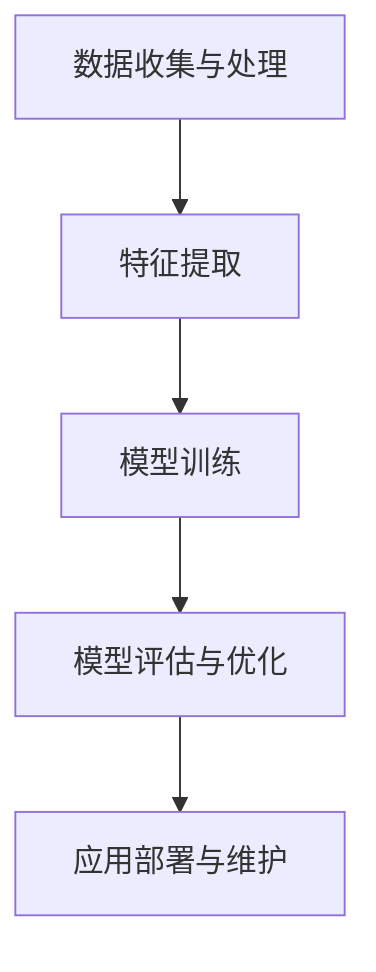

                 

# AI创业码头故事：95后创始人

> **关键词**：AI创业、95后、创始人、技术深度、行业洞察
>
> **摘要**：本文将讲述一位95后年轻创业者如何在AI领域崭露头角，通过技术创新和商业模式创新，成功打造了一家备受瞩目的AI创业公司。文章将深入分析其技术选择、团队构建、市场定位和未来展望，为AI创业者的道路提供有价值的参考和启示。

## 1. 背景介绍

### 1.1 目的和范围

本文旨在通过讲述一位95后AI创业者的故事，为广大AI创业者提供有益的借鉴和启示。我们将探讨这位年轻创始人在技术选择、团队构建、市场定位等方面的思考和实践，分析其成功背后的关键因素。希望通过本文，能够为读者在AI创业的道路上提供一些指导和建议。

### 1.2 预期读者

本文适合以下读者群体：

1. 想了解AI创业领域现状和趋势的开发者；
2. 有志于投身AI创业的年轻创业者；
3. 对AI技术和商业模式感兴趣的投资者；
4. 对技术创业有兴趣的大学师生。

### 1.3 文档结构概述

本文分为十个部分：

1. 引言：介绍文章背景和目的；
2. 背景介绍：阐述文章的结构和内容；
3. 核心概念与联系：介绍AI技术的基本概念和架构；
4. 核心算法原理 & 具体操作步骤：讲解关键算法原理和操作步骤；
5. 数学模型和公式 & 详细讲解 & 举例说明：阐述相关数学模型和公式；
6. 项目实战：代码实际案例和详细解释说明；
7. 实际应用场景：分析AI技术在各个领域的应用；
8. 工具和资源推荐：推荐学习资源和开发工具；
9. 总结：未来发展趋势与挑战；
10. 附录：常见问题与解答。

### 1.4 术语表

#### 1.4.1 核心术语定义

- **AI（人工智能）**：一种模拟人类智能的技术，使计算机系统能够理解、学习、推理和解决问题。
- **创业者**：创立企业，负责企业战略规划和运营的人。
- **商业模式**：企业在市场上获取利润的途径和方式。
- **技术深度**：技术领域内对特定技术的深入理解和掌握。

#### 1.4.2 相关概念解释

- **机器学习**：一种让计算机从数据中自动学习和改进的技术。
- **深度学习**：一种基于多层神经网络的人工智能技术，可以自动提取数据特征并进行分类、预测等任务。
- **神经网络**：一种模拟人脑神经元连接结构的计算模型。

#### 1.4.3 缩略词列表

- **AI**：人工智能
- **ML**：机器学习
- **DL**：深度学习
- **NLP**：自然语言处理

## 2. 核心概念与联系

### 2.1 AI技术架构

为了更好地理解AI创业的关键因素，我们首先需要了解AI技术的基本架构。下面是一个简单的Mermaid流程图，展示了AI技术的核心组成部分。



### 2.2 AI技术在创业中的应用

AI技术在创业中的应用非常广泛，包括但不限于以下几个方向：

1. **数据分析与预测**：通过对大量数据进行分析和挖掘，为创业企业提供决策支持和市场预测。
2. **智能客服与营销**：利用自然语言处理和机器学习技术，实现智能客服和个性化营销，提高客户体验和转化率。
3. **智能制造与供应链优化**：通过机器学习和物联网技术，实现智能制造和供应链优化，提高生产效率和降低成本。
4. **金融科技**：利用AI技术进行信用评估、风险控制和量化交易，提高金融服务的质量和效率。

### 2.3 AI创业的关键因素

1. **技术深度**：技术深度是AI创业的核心竞争力。只有深入了解AI技术的原理和应用，才能在激烈的市场竞争中脱颖而出。
2. **团队构建**：一个优秀的团队是AI创业成功的关键。团队成员应具备多样化的技能，包括算法、数据、产品、市场等。
3. **商业模式**：一个可行的商业模式是AI创业的重要保障。创业者需要根据市场需求和自身优势，设计出合适的商业模式。
4. **市场定位**：明确的市场定位有助于创业者集中资源和精力，在特定领域取得突破。

## 3. 核心算法原理 & 具体操作步骤

### 3.1 机器学习算法原理

机器学习是AI技术的核心，其基本原理是通过训练模型来对未知数据进行预测和分类。下面是一个简单的机器学习算法原理的伪代码：

```python
# 伪代码：机器学习算法原理

# 输入：训练数据集 X, Y
# 输出：模型参数 w

# 初始化模型参数 w
w = 初始化参数()

# 训练模型
for i in range(训练迭代次数):
    # 前向传播
    y_pred = 线性变换(X * w)
    # 计算损失函数
    loss = 计算损失函数(Y, y_pred)
    # 反向传播
    dw = 计算梯度(X, Y, y_pred)
    # 更新模型参数
    w = w - 学习率 * dw

# 输出训练后的模型参数 w
return w
```

### 3.2 深度学习算法原理

深度学习是机器学习的一个分支，它通过多层神经网络来学习数据特征。下面是一个简单的深度学习算法原理的伪代码：

```python
# 伪代码：深度学习算法原理

# 输入：训练数据集 X, Y
# 输出：模型参数 w

# 初始化模型参数 w
w = 初始化参数()

# 训练模型
for i in range(训练迭代次数):
    # 前向传播
    for layer in 神经网络层次:
        z = 线性变换(X * w)
        a = 激活函数(z)
    # 计算损失函数
    loss = 计算损失函数(Y, a)
    # 反向传播
    for layer in 神经网络层次反向:
        dz = 计算梯度(a, dw)
        dw = 线性变换(X, dz)
    # 更新模型参数
    w = w - 学习率 * dw

# 输出训练后的模型参数 w
return w
```

## 4. 数学模型和公式 & 详细讲解 & 举例说明

### 4.1 损失函数

损失函数是机器学习和深度学习中的核心概念，它用于衡量模型的预测结果与真实值之间的差异。下面是几种常见的损失函数及其公式：

#### 4.1.1 交叉熵损失函数

交叉熵损失函数常用于分类问题，其公式为：

$$
L = -\sum_{i=1}^{n} y_i \cdot \log(\hat{y}_i)
$$

其中，$y_i$ 为真实标签，$\hat{y}_i$ 为预测概率。

#### 4.1.2 均方误差损失函数

均方误差损失函数常用于回归问题，其公式为：

$$
L = \frac{1}{2} \sum_{i=1}^{n} (y_i - \hat{y}_i)^2
$$

其中，$y_i$ 为真实值，$\hat{y}_i$ 为预测值。

#### 4.1.3 对数损失函数

对数损失函数是对交叉熵损失函数的另一种表示，其公式为：

$$
L = -\sum_{i=1}^{n} y_i \cdot \log(\hat{y}_i) + (1 - y_i) \cdot \log(1 - \hat{y}_i)
$$

### 4.2 激活函数

激活函数是深度学习中的另一个重要概念，它用于引入非线性特性，使神经网络能够学习复杂的函数。下面是几种常见的激活函数及其公式：

#### 4.2.1 Sigmoid函数

$$
f(x) = \frac{1}{1 + e^{-x}}
$$

#### 4.2.2ReLU函数

$$
f(x) =
\begin{cases}
0, & \text{if } x < 0 \\
x, & \text{if } x \geq 0
\end{cases}
$$

#### 4.2.3 Tanh函数

$$
f(x) = \frac{e^x - e^{-x}}{e^x + e^{-x}}
$$

### 4.3 举例说明

假设我们有一个二分类问题，真实标签为 $y = [0, 1, 0, 1]$，预测概率为 $\hat{y} = [0.2, 0.8, 0.1, 0.9]$。我们使用交叉熵损失函数来计算损失：

$$
L = -[0 \cdot \log(0.2) + 1 \cdot \log(0.8) + 0 \cdot \log(0.1) + 1 \cdot \log(0.9)]
$$

$$
L = -[0 + 0.6931 + 0 + 2.3026] = -2.9957
$$

这个结果表明，我们的模型在这次预测中的表现不太好。

## 5. 项目实战：代码实际案例和详细解释说明

### 5.1 开发环境搭建

在开始编写代码之前，我们需要搭建一个合适的开发环境。以下是搭建开发环境的步骤：

1. 安装Python 3.7及以上版本；
2. 安装TensorFlow 2.0及以上版本；
3. 安装Jupyter Notebook。

### 5.2 源代码详细实现和代码解读

下面是一个简单的机器学习项目，用于实现二分类问题。我们将使用TensorFlow和Keras框架来实现。

```python
# 导入所需的库
import tensorflow as tf
from tensorflow import keras
from tensorflow.keras import layers

# 加载和预处理数据
# 这里以鸢尾花数据集为例
iris = keras.datasets.Iris()
(train_data, train_labels), (test_data, test_labels) = iris.load_data()

# 切分数据为特征和标签
train_features = train_data
train_labels = train_labels
test_features = test_data
test_labels = test_labels

# 标签转换为独热编码
train_labels = keras.utils.to_categorical(train_labels)
test_labels = keras.utils.to_categorical(test_labels)

# 建立模型
model = keras.Sequential([
    layers.Dense(64, activation='relu', input_shape=(4,)),
    layers.Dense(64, activation='relu'),
    layers.Dense(3, activation='softmax')
])

# 编译模型
model.compile(optimizer='adam',
              loss='categorical_crossentropy',
              metrics=['accuracy'])

# 训练模型
model.fit(train_features, train_labels, epochs=100, batch_size=32, validation_split=0.2)

# 评估模型
test_loss, test_acc = model.evaluate(test_features, test_labels, verbose=2)
print('\nTest accuracy:', test_acc)
```

### 5.3 代码解读与分析

1. **导入库**：我们首先导入了TensorFlow和Keras库，这两个库是深度学习领域中最常用的工具。

2. **加载数据**：我们使用Keras内置的鸢尾花数据集进行演示。鸢尾花数据集是一个经典的二分类问题，包含三种不同类型的鸢尾花。

3. **预处理数据**：我们将数据集分为特征和标签，并将标签转换为独热编码。

4. **建立模型**：我们使用Keras的Sequential模型，这是一个线性堆叠层的模型。我们添加了两个ReLU激活函数的全连接层，以及一个输出层，输出层使用了softmax激活函数，以实现多分类。

5. **编译模型**：我们使用adam优化器和categorical_crossentropy损失函数来编译模型。categorical_crossentropy是一种适用于多分类问题的损失函数。

6. **训练模型**：我们使用fit函数来训练模型，设置epochs为100，batch_size为32，并使用validation_split参数来划分验证集。

7. **评估模型**：我们使用evaluate函数来评估模型在测试集上的性能，输出测试准确率。

通过这个简单的案例，我们可以看到如何使用TensorFlow和Keras来实现一个二分类问题。在实际的AI创业项目中，我们可能需要处理更复杂的问题，但这基本流程是通用的。

## 6. 实际应用场景

AI技术在各个领域都有广泛的应用，以下是一些实际应用场景：

1. **金融科技**：AI技术在金融领域中的应用主要包括信用评估、风险控制、量化交易和智能投顾等。例如，通过机器学习和深度学习算法，可以对客户的行为进行预测，从而进行精准营销和个性化服务。

2. **医疗健康**：AI技术在医疗健康领域的应用主要包括疾病预测、诊断辅助、药物研发和健康管理等。例如，通过深度学习算法，可以对医疗影像进行分析，辅助医生进行诊断。

3. **智能制造**：AI技术在智能制造领域中的应用主要包括质量检测、设备维护、生产优化和供应链管理等。例如，通过机器学习算法，可以对生产线上的产品进行实时质量检测，提高生产效率。

4. **智能客服**：AI技术在客服领域中的应用主要包括语音识别、自然语言处理和智能回复等。例如，通过深度学习算法，可以实现对客户语音的实时识别和语义理解，从而实现智能客服。

5. **智慧城市**：AI技术在智慧城市中的应用主要包括交通管理、环境监测、公共安全和城市管理等。例如，通过机器学习算法，可以实现对交通流量的实时监测和分析，优化交通管理。

## 7. 工具和资源推荐

### 7.1 学习资源推荐

#### 7.1.1 书籍推荐

1. **《Python机器学习》**：由塞巴斯蒂安·拉姆塞（Sebastian Raschka）和约翰·保洛雷茨基（John Paulert）合著，是机器学习和深度学习的经典入门书籍。
2. **《深度学习》（Deep Learning）**：由伊恩·古德费洛（Ian Goodfellow）、约书亚·本吉奥（Yoshua Bengio）和Aaron Courville合著，是深度学习的权威教材。

#### 7.1.2 在线课程

1. **吴恩达的《深度学习专项课程》**：这是一门由知名AI专家吴恩达开设的深度学习在线课程，内容全面且深入浅出。
2. **斯坦福大学《CS231n：卷积神经网络与视觉识别》**：这是一门专注于计算机视觉领域的深度学习课程，由斯坦福大学教授李飞飞主讲。

#### 7.1.3 技术博客和网站

1. **AI Challenger**：这是一个专注于AI技术的中文博客，内容涵盖了机器学习、深度学习、计算机视觉等多个领域。
2. **机器之心**：这是一个全球领先的AI媒体平台，提供最新的AI技术和行业动态。

### 7.2 开发工具框架推荐

#### 7.2.1 IDE和编辑器

1. **PyCharm**：这是一个功能强大的Python IDE，适用于机器学习和深度学习项目。
2. **Jupyter Notebook**：这是一个交互式的Python编辑器，非常适合数据分析和模型原型设计。

#### 7.2.2 调试和性能分析工具

1. **TensorBoard**：这是一个TensorFlow的图形化调试和分析工具，可以帮助我们可视化模型的训练过程。
2. **Profiling Tools**：如NVIDIA的Nsight和Intel的Vtune，这些工具可以帮助我们分析和优化深度学习模型的性能。

#### 7.2.3 相关框架和库

1. **TensorFlow**：这是一个广泛使用的开源深度学习框架，适用于各种规模的项目。
2. **PyTorch**：这是一个流行的深度学习框架，以其灵活性和易用性著称。
3. **Scikit-Learn**：这是一个Python机器学习库，提供了丰富的算法和数据预处理工具。

### 7.3 相关论文著作推荐

#### 7.3.1 经典论文

1. **“A Learning Algorithm for Continually Running Fully Recurrent Neural Networks”**：这是Hiroshi Sakoe和Fumitada Suwa于1978年发表的一篇论文，首次提出了双向循环神经网络（Bi-RNN）的概念。
2. **“Rectifier Nonlinearities Improve Deep Neural Networks”**：这是Gl

