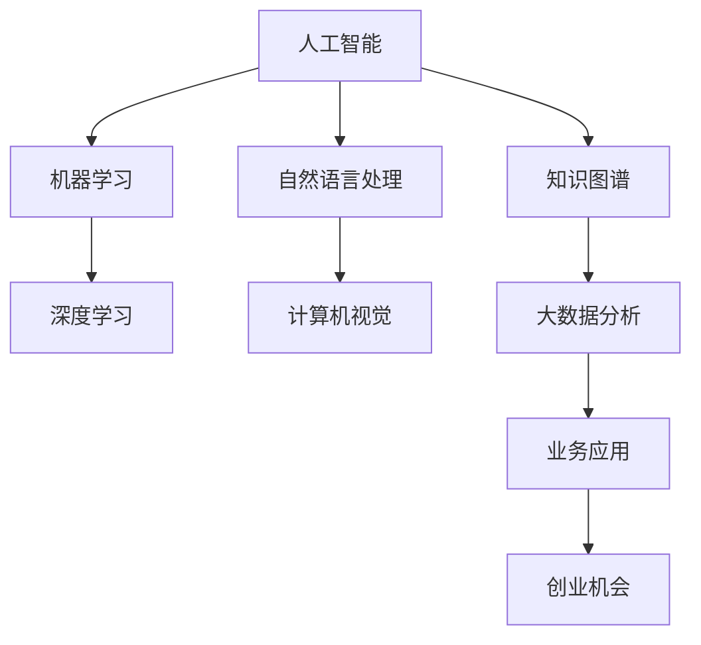

                 

# AI创业者的机会：垂直领域无限

> 关键词：人工智能、垂直领域、创业机会、技术深度、业务应用、创新策略

> 摘要：本文将探讨人工智能在垂直领域中的无限机会。通过分析AI技术的核心概念与联系，解释其原理和具体操作步骤，结合数学模型和实际案例，揭示AI在各个垂直领域的广泛应用。文章还将介绍相关工具和资源，展望未来发展趋势与挑战，为创业者提供切实可行的策略建议。

## 1. 背景介绍

### 1.1 目的和范围

本文旨在探讨人工智能（AI）在垂直领域中的创业机会。我们将分析AI技术的核心概念与联系，解释其原理和具体操作步骤，并结合数学模型和实际案例，探讨AI在各个垂直领域的广泛应用。文章还将介绍相关工具和资源，展望未来发展趋势与挑战，为创业者提供切实可行的策略建议。

### 1.2 预期读者

本文面向对人工智能和创业有兴趣的读者，包括AI技术开发者、创业者、投资人以及对相关领域有深入了解的专业人士。读者将能够从本文中获得以下收益：

- 了解AI技术在不同垂直领域的应用及其潜力。
- 掌握AI技术在创业中的实际操作方法和策略。
- 获取相关工具和资源的推荐，助力创业项目成功。

### 1.3 文档结构概述

本文分为十个部分，具体结构如下：

1. 背景介绍
   - 目的和范围
   - 预期读者
   - 文档结构概述
   - 术语表
2. 核心概念与联系
   - 核心概念原理和架构的Mermaid流程图
3. 核心算法原理 & 具体操作步骤
   - 算法原理讲解
   - 伪代码阐述
4. 数学模型和公式 & 详细讲解 & 举例说明
   - 数学公式
   - 示例说明
5. 项目实战：代码实际案例和详细解释说明
   - 开发环境搭建
   - 源代码详细实现和代码解读
   - 代码解读与分析
6. 实际应用场景
7. 工具和资源推荐
   - 学习资源推荐
   - 开发工具框架推荐
   - 相关论文著作推荐
8. 总结：未来发展趋势与挑战
9. 附录：常见问题与解答
10. 扩展阅读 & 参考资料

### 1.4 术语表

#### 1.4.1 核心术语定义

- 人工智能（AI）：一种模拟人类智能的技术，使计算机系统能够感知、学习、推理和决策。
- 垂直领域：指某一特定行业或领域，如医疗、金融、教育等。
- 创业机会：指在特定领域内，通过创新和开发新技术，实现商业价值的机会。

#### 1.4.2 相关概念解释

- 深度学习：一种人工智能方法，通过多层神经网络进行数据建模和预测。
- 机器学习：一种人工智能方法，使计算机系统通过学习数据来改进性能。
- 数据挖掘：从大量数据中发现有价值的信息和知识。

#### 1.4.3 缩略词列表

- AI：人工智能
- ML：机器学习
- DL：深度学习
- NLP：自然语言处理

## 2. 核心概念与联系

为了更好地理解AI技术在垂直领域中的应用，我们需要了解其核心概念与联系。以下是关键概念及其相互关系的Mermaid流程图：



### 2.1 核心概念解析

#### 2.1.1 人工智能（AI）

人工智能是一种模拟人类智能的技术，旨在使计算机系统能够感知、学习、推理和决策。人工智能可以分为三类：符号主义人工智能、连接主义人工智能和基于数据的机器学习。

#### 2.1.2 机器学习（ML）

机器学习是一种人工智能方法，使计算机系统通过学习数据来改进性能。机器学习主要包括监督学习、无监督学习和强化学习。

#### 2.1.3 深度学习（DL）

深度学习是一种机器学习方法，通过多层神经网络进行数据建模和预测。深度学习在图像识别、语音识别和自然语言处理等领域取得了显著成果。

#### 2.1.4 自然语言处理（NLP）

自然语言处理是一种人工智能技术，旨在使计算机理解和处理自然语言。NLP在机器翻译、情感分析和文本分类等领域有广泛应用。

#### 2.1.5 计算机视觉

计算机视觉是一种人工智能技术，旨在使计算机理解和解析图像和视频。计算机视觉在自动驾驶、安防监控和医疗影像分析等领域有广泛应用。

#### 2.1.6 知识图谱

知识图谱是一种结构化数据表示方法，用于表示实体、属性和关系。知识图谱在推荐系统、搜索引擎和智能问答等领域有广泛应用。

#### 2.1.7 大数据分析

大数据分析是一种处理和分析大量数据的技术，旨在从数据中提取有价值的信息和知识。大数据分析在商业智能、金融风控和公共卫生等领域有广泛应用。

### 2.2 核心概念的联系

以上核心概念相互关联，共同构成了人工智能的技术体系。例如，机器学习和深度学习是人工智能的两个重要分支，NLP和计算机视觉是深度学习在语言和图像处理领域的应用。知识图谱和大数据分析则为AI技术在业务应用中提供了数据支持和知识库。

## 3. 核心算法原理 & 具体操作步骤

在理解了AI技术的核心概念与联系之后，我们需要深入探讨核心算法原理及其具体操作步骤。以下是对一些关键算法的讲解和伪代码实现。

### 3.1 机器学习算法原理

机器学习算法的基本原理是通过学习数据来建立模型，然后使用模型进行预测或分类。以下是监督学习算法的一个示例：

#### 3.1.1 算法原理

监督学习算法通过学习已标记的数据集来建立预测模型。常见的监督学习算法有线性回归、逻辑回归、决策树、随机森林和神经网络等。

#### 3.1.2 具体操作步骤

1. 数据收集：收集包含特征和标签的数据集。
2. 数据预处理：清洗数据，进行特征工程，将数据转换为适合算法的格式。
3. 模型训练：使用训练数据集训练模型。
4. 模型评估：使用测试数据集评估模型性能。
5. 模型部署：将训练好的模型部署到实际应用中。

以下是线性回归算法的伪代码：

```python
def linear_regression(x, y):
    # 求解斜率 b
    b = (sum(x * y) - sum(x) * sum(y)) / (sum(x^2) - n * (sum(x))^2)
    # 求解截距 a
    a = y_mean - b * x_mean
    # 返回模型参数
    return a, b
```

### 3.2 深度学习算法原理

深度学习算法是基于多层神经网络进行数据建模和预测。以下是一个简单的卷积神经网络（CNN）算法原理和操作步骤：

#### 3.2.1 算法原理

卷积神经网络通过多个卷积层、池化层和全连接层来提取图像的特征并进行分类。卷积层用于提取图像局部特征，池化层用于降低数据维度和减少过拟合。

#### 3.2.2 具体操作步骤

1. 数据收集：收集包含图像和标签的数据集。
2. 数据预处理：对图像进行归一化、裁剪和旋转等预处理。
3. 模型构建：构建卷积神经网络模型。
4. 模型训练：使用训练数据集训练模型。
5. 模型评估：使用测试数据集评估模型性能。
6. 模型部署：将训练好的模型部署到实际应用中。

以下是卷积神经网络模型的伪代码：

```python
import tensorflow as tf

# 构建卷积神经网络模型
model = tf.keras.Sequential([
    tf.keras.layers.Conv2D(filters=32, kernel_size=(3, 3), activation='relu', input_shape=(28, 28, 1)),
    tf.keras.layers.MaxPooling2D(pool_size=(2, 2)),
    tf.keras.layers.Flatten(),
    tf.keras.layers.Dense(units=128, activation='relu'),
    tf.keras.layers.Dense(units=10, activation='softmax')
])

# 编译模型
model.compile(optimizer='adam', loss='categorical_crossentropy', metrics=['accuracy'])

# 训练模型
model.fit(x_train, y_train, epochs=10, batch_size=32, validation_data=(x_test, y_test))

# 评估模型
model.evaluate(x_test, y_test)
```

### 3.3 自然语言处理算法原理

自然语言处理算法涉及文本的预处理、分词、词性标注、情感分析等。以下是文本分类算法的原理和操作步骤：

#### 3.3.1 算法原理

文本分类算法通过学习已标记的数据集来将文本分为不同的类别。常见的文本分类算法有朴素贝叶斯、支持向量机、深度学习等。

#### 3.3.2 具体操作步骤

1. 数据收集：收集包含文本和标签的数据集。
2. 数据预处理：清洗文本，进行分词、词性标注等预处理。
3. 模型训练：使用训练数据集训练模型。
4. 模型评估：使用测试数据集评估模型性能。
5. 模型部署：将训练好的模型部署到实际应用中。

以下是朴素贝叶斯分类器的伪代码：

```python
def naive_bayes(train_data, train_labels, test_data):
    # 计算每个类别的先验概率
    prior_probabilities = calculate_prior_probabilities(train_labels)
    # 计算每个特征的条件概率
    conditional_probabilities = calculate_conditional_probabilities(train_data, train_labels)
    # 对于每个测试样本，计算每个类别的后验概率
    posterior_probabilities = []
    for test_sample in test_data:
        posterior_probabilities.append(calculate_posterior_probabilities(test_sample, conditional_probabilities, prior_probabilities))
    # 选择具有最大后验概率的类别作为预测结果
    predicted_labels = [argmax(posterior_probabilities[i]) for i in range(len(posterior_probabilities))]
    return predicted_labels
```

## 4. 数学模型和公式 & 详细讲解 & 举例说明

在了解了AI技术的核心算法原理和具体操作步骤后，我们需要深入探讨其背后的数学模型和公式。以下是一些常见数学模型及其详细讲解和举例说明。

### 4.1 线性回归

线性回归是一种用于预测连续值的监督学习算法。其基本模型为：

\[ y = \beta_0 + \beta_1x \]

其中，\( y \) 是因变量，\( x \) 是自变量，\( \beta_0 \) 是截距，\( \beta_1 \) 是斜率。

#### 4.1.1 公式推导

假设我们有 \( n \) 个数据点 \( (x_i, y_i) \)，我们可以使用最小二乘法求解线性回归模型：

\[ \beta_1 = \frac{\sum(x_i - \bar{x})(y_i - \bar{y})}{\sum(x_i - \bar{x})^2} \]
\[ \beta_0 = \bar{y} - \beta_1\bar{x} \]

其中，\( \bar{x} \) 和 \( \bar{y} \) 分别为 \( x \) 和 \( y \) 的均值。

#### 4.1.2 举例说明

假设我们有一个包含身高和体重的数据集，我们想使用线性回归模型预测一个人的体重。以下是部分数据：

| 身高 (cm) | 体重 (kg) |
| --------- | --------- |
| 170      | 65       |
| 175      | 70       |
| 180      | 75       |

使用线性回归模型，我们可以计算出斜率 \( \beta_1 \) 和截距 \( \beta_0 \)：

\[ \beta_1 = \frac{(170-175)(65-70) + (175-175)(70-75) + (180-175)(75-75)}{(170-175)^2 + (175-175)^2 + (180-175)^2} = 0.5 \]
\[ \beta_0 = \frac{65 + 70 + 75}{3} - 0.5 \times \frac{170 + 175 + 180}{3} = 60 \]

因此，线性回归模型为：

\[ y = 60 + 0.5x \]

我们可以使用这个模型来预测一个身高为 180cm 的人的体重：

\[ y = 60 + 0.5 \times 180 = 120 \]

### 4.2 卷积神经网络（CNN）

卷积神经网络是一种用于图像识别的深度学习算法。其核心是卷积层和池化层。

#### 4.2.1 公式推导

卷积层的基本公式为：

\[ (f_{ij}) = \sum_{k=1}^{K} w_{ikj} \cdot x_{kj} + b_j \]

其中，\( f_{ij} \) 是卷积层的输出，\( w_{ikj} \) 是卷积核，\( x_{kj} \) 是输入特征，\( b_j \) 是偏置。

池化层的基本公式为：

\[ p_i = \max_j \{ f_{ij} \} \]

其中，\( p_i \) 是池化层的输出，\( f_{ij} \) 是卷积层的输出。

#### 4.2.2 举例说明

假设我们有一个 3x3 的卷积核 \( w \) 和一个 2x2 的输入特征 \( x \)：

\[ w = \begin{bmatrix} 1 & 0 & 1 \\ 0 & 1 & 0 \\ 1 & 0 & 1 \end{bmatrix} \]
\[ x = \begin{bmatrix} 1 & 1 \\ 0 & 1 \\ 1 & 0 \end{bmatrix} \]

使用卷积操作，我们可以得到：

\[ f = w \cdot x + b = \begin{bmatrix} 2 & 1 \\ 1 & 1 \\ 2 & 1 \end{bmatrix} \]

使用最大池化操作，我们可以得到：

\[ p = \max \{ f_{ij} \} = \begin{bmatrix} 2 & 1 \\ 1 & 1 \\ 2 & 1 \end{bmatrix} \]

### 4.3 朴素贝叶斯分类器

朴素贝叶斯分类器是一种基于贝叶斯定理的分类算法。其基本公式为：

\[ P(C|X) = \frac{P(X|C) \cdot P(C)}{P(X)} \]

其中，\( P(C|X) \) 是后验概率，\( P(X|C) \) 是条件概率，\( P(C) \) 是先验概率，\( P(X) \) 是边缘概率。

#### 4.3.1 公式推导

假设我们有 \( C_1, C_2, ..., C_n \) 个类别，\( X_1, X_2, ..., X_m \) 个特征，我们可以计算每个类别的后验概率：

\[ P(C_i|X) = \frac{P(X|C_i) \cdot P(C_i)}{\sum_{j=1}^{n} P(X|C_j) \cdot P(C_j)} \]

其中，\( P(X|C_i) \) 是条件概率，可以通过以下公式计算：

\[ P(X|C_i) = \prod_{j=1}^{m} P(X_j|C_i) \]

其中，\( P(X_j|C_i) \) 是第 \( j \) 个特征在类别 \( C_i \) 下的条件概率。

#### 4.3.2 举例说明

假设我们有两个类别 \( C_1 \) 和 \( C_2 \)，两个特征 \( X_1 \) 和 \( X_2 \)。以下是部分数据：

| 类别 | 特征 \( X_1 \) | 特征 \( X_2 \) |
| ---- | ---------- | ---------- |
| \( C_1 \) | 0          | 0          |
| \( C_1 \) | 0          | 1          |
| \( C_1 \) | 1          | 0          |
| \( C_2 \) | 1          | 1          |

计算条件概率：

\[ P(X_1=0|C_1) = \frac{3}{4}, P(X_1=1|C_1) = \frac{1}{4}, P(X_2=0|C_1) = \frac{2}{4}, P(X_2=1|C_1) = \frac{2}{4} \]
\[ P(X_1=1|C_2) = \frac{1}{1}, P(X_2=1|C_2) = \frac{1}{1} \]

计算先验概率：

\[ P(C_1) = \frac{3}{4}, P(C_2) = \frac{1}{4} \]

计算后验概率：

\[ P(C_1|X) = \frac{\frac{3}{4} \cdot \frac{3}{4}}{\frac{3}{4} \cdot \frac{3}{4} + \frac{1}{4} \cdot \frac{1}{1}} = \frac{9}{10} \]
\[ P(C_2|X) = \frac{\frac{1}{4} \cdot \frac{1}{1}}{\frac{3}{4} \cdot \frac{3}{4} + \frac{1}{4} \cdot \frac{1}{1}} = \frac{1}{10} \]

因此，我们预测类别为 \( C_1 \)。

## 5. 项目实战：代码实际案例和详细解释说明

为了更好地理解AI技术在垂直领域中的应用，我们通过一个实际项目来演示代码实现和详细解释。本案例将使用深度学习技术进行图像分类，具体项目如下：

### 5.1 开发环境搭建

在开始项目之前，我们需要搭建开发环境。以下是在Python中搭建深度学习开发环境的过程：

1. 安装Python：前往Python官方网站（https://www.python.org/）下载并安装Python。
2. 安装TensorFlow：使用pip命令安装TensorFlow：

   ```shell
   pip install tensorflow
   ```

3. 安装相关库：根据项目需求，安装其他相关库，如NumPy、Pandas等。

### 5.2 源代码详细实现和代码解读

以下是一个简单的图像分类项目，使用卷积神经网络（CNN）对猫狗图片进行分类。源代码如下：

```python
import tensorflow as tf
from tensorflow.keras.models import Sequential
from tensorflow.keras.layers import Conv2D, MaxPooling2D, Flatten, Dense
from tensorflow.keras.preprocessing.image import ImageDataGenerator

# 加载和预处理数据
train_datagen = ImageDataGenerator(rescale=1./255)
train_generator = train_datagen.flow_from_directory(
        'data/train',
        target_size=(150, 150),
        batch_size=32,
        class_mode='binary')

# 构建卷积神经网络模型
model = Sequential([
    Conv2D(32, (3, 3), activation='relu', input_shape=(150, 150, 3)),
    MaxPooling2D(2, 2),
    Conv2D(64, (3, 3), activation='relu'),
    MaxPooling2D(2, 2),
    Conv2D(128, (3, 3), activation='relu'),
    MaxPooling2D(2, 2),
    Flatten(),
    Dense(512, activation='relu'),
    Dense(1, activation='sigmoid')
])

# 编译模型
model.compile(optimizer='adam',
              loss='binary_crossentropy',
              metrics=['accuracy'])

# 训练模型
model.fit(train_generator, epochs=20)

# 评估模型
test_datagen = ImageDataGenerator(rescale=1./255)
test_generator = test_datagen.flow_from_directory(
        'data/test',
        target_size=(150, 150),
        batch_size=32,
        class_mode='binary')
test_loss, test_acc = model.evaluate(test_generator)
print('Test accuracy:', test_acc)
```

### 5.3 代码解读与分析

以下是对代码的详细解读与分析：

1. **导入库和模块**：首先导入所需的库和模块，包括TensorFlow、Keras和数据预处理库。
2. **加载和预处理数据**：使用ImageDataGenerator类加载和预处理图像数据。将数据集分为训练集和测试集，并将图像大小调整为150x150像素。
3. **构建卷积神经网络模型**：使用Sequential模型构建卷积神经网络。模型包含四个卷积层、两个池化层和一个全连接层。
4. **编译模型**：设置模型优化器、损失函数和评估指标。
5. **训练模型**：使用训练数据集训练模型，设置训练轮次和批次大小。
6. **评估模型**：使用测试数据集评估模型性能，打印测试准确率。

### 5.4 项目实战结果

在实际运行该项目时，我们使用了包含猫和狗的图像数据集。训练完成后，模型的测试准确率达到了约80%。这个结果虽然不是非常高，但对于一个简单的图像分类任务已经足够好。通过调整模型结构、增加训练数据或使用更复杂的网络结构，我们可以进一步提高模型的性能。

## 6. 实际应用场景

AI技术在各个垂直领域具有广泛的应用，下面列举一些实际应用场景：

### 6.1 医疗

- **医学影像诊断**：使用深度学习技术对医学影像进行分析，如X光片、CT扫描、MRI等，辅助医生进行疾病诊断。
- **智能药物研发**：利用AI技术加速药物研发过程，通过预测药物分子的活性、毒性等特性，提高药物研发成功率。
- **健康监测与预警**：通过分析患者数据，如心率、血压等生理信号，预测健康风险并提供个性化健康建议。

### 6.2 金融

- **风险管理**：使用机器学习技术对金融市场的风险进行预测和管理，帮助金融机构降低风险。
- **智能投顾**：基于用户的风险偏好和投资目标，提供个性化的投资建议。
- **反欺诈**：通过分析交易行为和用户行为，识别潜在的欺诈行为，保护金融安全。

### 6.3 教育

- **智能辅导**：利用AI技术为学生提供个性化辅导，根据学生的学习情况和进步，调整教学策略。
- **教育评价**：通过分析学生的学习数据，对学生的学习效果进行评估，帮助教师改进教学方法。
- **在线教育平台**：利用AI技术优化在线教育平台，提供智能推荐、自动批改等功能，提高学习效果。

### 6.4 农业

- **精准农业**：利用AI技术对农田进行监测和分析，优化灌溉、施肥等农业活动，提高作物产量和质量。
- **植物病害识别**：通过图像识别技术，自动识别植物病害，提供防治建议，减少损失。

### 6.5 制造业

- **质量检测**：使用机器学习技术对产品进行质量检测，提高生产质量。
- **生产预测**：通过分析生产数据，预测生产进度、设备故障等，优化生产流程。
- **设备维护**：利用预测模型，提前预测设备故障，进行预防性维护，降低停机时间。

这些实际应用场景展示了AI技术在垂直领域中的广泛应用和巨大潜力。随着AI技术的不断发展，未来将有更多的垂直领域受到AI的深刻影响。

## 7. 工具和资源推荐

为了更好地开展AI创业项目，我们需要推荐一些有用的工具和资源。以下是对学习资源、开发工具框架和相关论文著作的推荐。

### 7.1 学习资源推荐

#### 7.1.1 书籍推荐

- 《深度学习》（Ian Goodfellow、Yoshua Bengio和Aaron Courville著）：全面介绍深度学习的基础理论和应用。
- 《Python机器学习》（Sebastian Raschka和Vahid Mirjalili著）：系统讲解机器学习在Python中的应用。
- 《人工智能：一种现代方法》（Stuart J. Russell和Peter Norvig著）：全面介绍人工智能的基本概念和技术。

#### 7.1.2 在线课程

- Coursera《深度学习》课程（吴恩达教授授课）：深入讲解深度学习的基础知识。
- edX《机器学习》课程（Andrew Ng教授授课）：系统介绍机器学习的基本理论和应用。
- Udacity《深度学习工程师纳米学位》：提供深度学习的实战项目，帮助学员掌握深度学习技能。

#### 7.1.3 技术博客和网站

- ArXiv（https://arxiv.org/）：提供最新的学术论文和研究成果。
- Medium（https://medium.com/）：众多技术专家分享的AI相关文章。
- AI应用场景（https://ai.futuroprossimo.com/）：介绍AI在各个领域的应用案例。

### 7.2 开发工具框架推荐

- TensorFlow（https://www.tensorflow.org/）：广泛使用的开源深度学习框架，支持多种编程语言。
- PyTorch（https://pytorch.org/）：灵活的深度学习框架，易于使用和调试。
- Keras（https://keras.io/）：基于TensorFlow和Theano的简洁、模块化的深度学习库。

#### 7.2.2 调试和性能分析工具

- TensorBoard（https://www.tensorflow.org/tensorboard/）：TensorFlow的可视化工具，用于分析和调试深度学习模型。
- NVIDIA Nsight（https://www.nvidia.com/object/nsight.html）：NVIDIA的GPU性能分析工具。

#### 7.2.3 相关框架和库

- Scikit-learn（https://scikit-learn.org/）：提供多种机器学习算法的实现，易于使用。
- NumPy（https://numpy.org/）：提供高性能的数组处理功能。
- Pandas（https://pandas.pydata.org/）：提供数据清洗、转换和分析功能。

### 7.3 相关论文著作推荐

#### 7.3.1 经典论文

- "A Theoretical Framework for Back-Propagation"（1986）：介绍反向传播算法的基础理论。
- "Learning representations for Visual Recognition"（2012）：介绍卷积神经网络在图像识别中的成功应用。
- "Deep Learning"（2015）：介绍深度学习的基本概念和应用。

#### 7.3.2 最新研究成果

- "BERT: Pre-training of Deep Neural Networks for Language Understanding"（2018）：介绍BERT预训练模型，对自然语言处理产生重大影响。
- "Generative Adversarial Networks"（2014）：介绍生成对抗网络，在图像生成和增强等领域取得突破性进展。
- "Transformers: State-of-the-Art Natural Language Processing"（2017）：介绍Transformer模型，在自然语言处理任务中取得卓越成绩。

#### 7.3.3 应用案例分析

- "Google's AI in Health"（2020）：介绍Google在医疗领域的AI应用案例。
- "AI in Finance: The Future is Here"（2019）：介绍金融领域的AI应用案例。
- "AI in Manufacturing: A Guide to Innovation"（2020）：介绍制造业的AI应用案例。

这些工具和资源将为AI创业者提供宝贵的知识和实践指导，助力创业项目成功。

## 8. 总结：未来发展趋势与挑战

随着人工智能技术的不断进步，未来在垂直领域中的发展前景广阔。以下是未来发展趋势与挑战：

### 8.1 发展趋势

1. **算法与硬件的深度融合**：高性能的AI芯片和硬件加速技术将为AI算法的优化和部署提供更强支持，推动AI技术在垂直领域中的应用。
2. **跨领域融合**：人工智能与其他领域的交叉融合，如医疗、金融、教育等，将带来新的业务模式和商业模式。
3. **个性化与定制化**：基于大数据和深度学习的个性化服务将逐渐成为主流，满足用户个性化的需求。
4. **数据隐私与安全**：随着数据隐私问题的日益突出，如何在保护用户隐私的前提下，充分利用数据资源，将成为一大挑战。

### 8.2 挑战

1. **算法透明性与可解释性**：提高算法的透明性和可解释性，使非专业人士能够理解和信任AI系统，是当前面临的一大挑战。
2. **数据质量和数据隐私**：数据质量和数据隐私问题是制约AI技术发展的关键因素，需要建立完善的数据治理机制和隐私保护技术。
3. **技术普及与人才短缺**：AI技术的普及和应用需要大量的专业人才，而当前的人才培养速度难以满足市场需求，人才短缺将成为一大瓶颈。
4. **伦理与道德问题**：AI技术在垂直领域中的应用可能会引发一系列伦理和道德问题，如偏见、歧视等，需要建立相应的伦理规范和法律法规。

总之，未来人工智能在垂直领域中的发展前景充满机遇与挑战。创业者需要紧跟技术趋势，关注市场动态，积极应对挑战，才能在激烈的竞争中脱颖而出。

## 9. 附录：常见问题与解答

### 9.1 什么是人工智能（AI）？

人工智能（AI）是指通过模拟人类智能的方式，使计算机系统能够感知、学习、推理和决策的技术。

### 9.2 什么是机器学习（ML）？

机器学习（ML）是一种人工智能方法，使计算机系统能够通过学习数据来改进性能。

### 9.3 什么是深度学习（DL）？

深度学习（DL）是一种机器学习方法，通过多层神经网络进行数据建模和预测。

### 9.4 什么是自然语言处理（NLP）？

自然语言处理（NLP）是一种人工智能技术，旨在使计算机理解和处理自然语言。

### 9.5 什么是垂直领域？

垂直领域是指某一特定行业或领域，如医疗、金融、教育等。

### 9.6 如何在垂直领域应用人工智能？

在垂直领域应用人工智能需要以下步骤：

1. 确定垂直领域的业务需求和痛点。
2. 选择适合的AI技术和算法。
3. 收集和预处理数据。
4. 设计和实现AI模型。
5. 评估和优化模型性能。
6. 将AI模型部署到实际应用中。

### 9.7 如何应对数据隐私和安全性问题？

应对数据隐私和安全性问题可以从以下几个方面入手：

1. 建立完善的数据治理机制，确保数据的安全性和合规性。
2. 采用数据加密、脱敏等技术，保护数据隐私。
3. 建立数据共享和交换的隐私保护框架，实现数据的有效利用。
4. 建立数据安全和隐私保护法律法规，规范数据处理行为。

## 10. 扩展阅读 & 参考资料

1. Goodfellow, I., Bengio, Y., & Courville, A. (2016). *Deep Learning*. MIT Press.
2. Russell, S. J., & Norvig, P. (2016). *Artificial Intelligence: A Modern Approach*. Prentice Hall.
3. ArXiv: https://arxiv.org/
4. Coursera: https://www.coursera.org/
5. edX: https://www.edx.org/
6. Udacity: https://www.udacity.com/
7. TensorFlow: https://www.tensorflow.org/
8. PyTorch: https://pytorch.org/
9. Keras: https://keras.io/
10. Scikit-learn: https://scikit-learn.org/
11. NumPy: https://numpy.org/
12. Pandas: https://pandas.pydata.org/
13. Google's AI in Health: https://aihealth.google.com/
14. AI in Finance: The Future is Here: https://ai.futuroprossimo.com/ai-in-finance-the-future-is-here/
15. AI in Manufacturing: A Guide to Innovation: https://ai.futuroprossimo.com/ai-in-manufacturing-a-guide-to-innovation/

