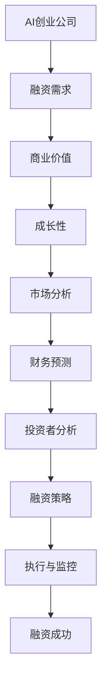

                 

# AI创业融资新趋势：关注项目商业价值与成长性

> **关键词：** AI创业，融资趋势，商业价值，成长性，项目评估
>
> **摘要：** 本文旨在探讨AI创业领域的融资新趋势，强调项目商业价值和成长性在融资过程中的重要性。通过详细分析这些核心要素，本文为AI创业者提供了一条清晰的融资之路，并提出了应对未来挑战的策略。

## 1. 背景介绍

### 1.1 目的和范围

本文的目标是分析当前AI创业公司的融资现状，探讨影响融资成功的核心因素。我们将重点关注商业价值和成长性，并提供一系列实用的策略和建议，帮助创业者更好地准备和实施融资计划。

本文的范围涵盖了AI创业领域的融资过程，包括融资目标设定、潜在投资者的识别、商业价值和成长性的评估方法，以及如何通过数据和技术手段提高项目吸引力。

### 1.2 预期读者

本文的预期读者包括AI创业公司的创始人、项目经理、投资顾问以及任何对AI创业融资感兴趣的专业人士。无论你是希望了解融资流程的新手，还是寻求优化现有融资策略的资深创业者，本文都将为你提供有价值的见解。

### 1.3 文档结构概述

本文分为十个主要部分，结构如下：

1. 背景介绍：介绍文章的目的、范围和预期读者。
2. 核心概念与联系：阐述AI创业融资所需理解的核心概念和联系。
3. 核心算法原理 & 具体操作步骤：详细解释融资策略的算法原理和操作步骤。
4. 数学模型和公式 & 详细讲解 & 举例说明：介绍支持融资策略的数学模型和公式。
5. 项目实战：代码实际案例和详细解释说明。
6. 实际应用场景：讨论AI创业融资在不同情境中的应用。
7. 工具和资源推荐：推荐学习资源和开发工具。
8. 总结：未来发展趋势与挑战。
9. 附录：常见问题与解答。
10. 扩展阅读 & 参考资料：提供进一步的阅读资源。

### 1.4 术语表

#### 1.4.1 核心术语定义

- **AI创业公司**：指利用人工智能技术进行创新并试图通过市场获得商业成功的公司。
- **融资**：企业通过出售股票或债券等证券来获得资金的过程。
- **商业价值**：指项目或公司对市场和客户的价值，通常通过财务指标和市场份额等来衡量。
- **成长性**：公司未来预期增长的能力，通常通过财务预测和市场潜力来评估。

#### 1.4.2 相关概念解释

- **市场潜力**：指目标市场在未来可能达到的规模。
- **投资回报率（ROI）**：衡量投资收益与成本之间的比率。
- **风险投资（VC）**：专业投资公司，专注于为初创公司和成长期公司提供资金。

#### 1.4.3 缩略词列表

- **AI**：人工智能
- **VC**：风险投资
- **IPO**：首次公开募股

## 2. 核心概念与联系

为了更好地理解AI创业融资，我们需要了解几个核心概念和它们之间的联系。以下是一个使用Mermaid绘制的流程图，展示了这些概念之间的关系。



### 2.1 融资需求

融资需求是AI创业公司启动和扩展业务的关键。公司需要资金来购买设备、雇佣人才、研发新产品和市场推广等。融资需求通常基于公司的业务计划和财务预测。

### 2.2 商业价值

商业价值是评估AI创业项目吸引力的关键指标。投资者关注项目是否能够创造持续的利润、市场份额和品牌价值。商业价值通常通过以下方面来衡量：

- **财务指标**：如收入、利润、现金流等。
- **市场潜力**：目标市场的规模和增长速度。
- **竞争优势**：项目的独特性、技术优势和商业模式。

### 2.3 成长性

成长性是指公司未来预期增长的能力。投资者通常通过以下因素来评估公司的成长性：

- **财务预测**：未来几年的收入、利润和市场份额预测。
- **市场规模**：目标市场的规模和增长速度。
- **竞争环境**：行业竞争状况和市场进入障碍。

### 2.4 市场分析

市场分析是了解目标市场的重要步骤。这包括对市场规模、增长趋势、竞争环境和消费者行为的深入研究。市场分析的结果可以帮助公司制定更有针对性的商业策略。

### 2.5 财务预测

财务预测是评估公司未来财务状况的关键工具。这包括对收入、利润、现金流和资本支出的预测。准确的财务预测可以帮助投资者了解公司的盈利能力和成长潜力。

### 2.6 投资者分析

投资者分析是识别和评估潜在投资者的过程。创业者需要了解投资者的投资偏好、风险承受能力和历史投资记录。这有助于选择最适合自己项目的投资者。

### 2.7 融资策略

融资策略是制定如何融资的计划。这包括选择融资方式（如风险投资、天使投资、众筹等）、设定融资目标和时间表，以及制定投资者沟通计划。

### 2.8 执行与监控

执行与监控是实施融资策略并确保其成功的关键步骤。这包括与投资者进行谈判、准备必要的文件和报告，以及定期监控融资进展。

### 2.9 融资成功

融资成功是指公司成功获得所需资金并实现业务目标。这标志着融资过程的结束，同时也为公司的未来发展奠定了基础。

## 3. 核心算法原理 & 具体操作步骤

在理解了AI创业融资的核心概念和联系后，我们需要深入探讨如何制定和实施一个成功的融资策略。这里我们将使用伪代码详细解释这个过程。

### 3.1 融资策略算法原理

伪代码：

```plaintext
function FinancingStrategy(AICompany, Investors, MarketData, FinancialForecast):
    // 初始化变量
    Initialize Variables: 
        ValueProposition, GrowthPotential, InvestmentNeeds, FinancingPlan

    // Step 1: 市场分析
    MarketAnalysis = AnalyzeMarket(MarketData)
    if MarketAnalysis.Sustainable then
        // Step 2: 商业价值评估
        ValueProposition = EvaluateValueProposition(AICompany, MarketAnalysis)
        if ValueProposition.Significant then
            // Step 3: 成长性评估
            GrowthPotential = EvaluateGrowthPotential(FinancialForecast, MarketAnalysis)
            if GrowthPotential.High then
                // Step 4: 投资者分析
                PotentialInvestors = AnalyzeInvestors(Investors)
                // Step 5: 选择投资者
                SelectedInvestors = SelectInvestors(PotentialInvestors, FinancingPlan)
                // Step 6: 制定融资策略
                FinancingPlan = DevelopFinancingPlan(SelectedInvestors)
                // Step 7: 执行融资策略
                FinancingExecution = ExecuteFinancingStrategy(FinancingPlan)
                // Step 8: 监控融资进展
                Monitoring = MonitorFinancingProgress(FinancingExecution)
                // Step 9: 融资成功
                if Monitoring.Success then
                    return "FinancingSuccess"
                else
                    return "FinancingFailed"
            else
                return "GrowthPotentialLow"
        else
            return "ValuePropositionUnsatisfactory"
    else
        return "MarketUnsustainable"
```

### 3.2 具体操作步骤

1. **市场分析**：收集市场数据，分析市场规模、增长趋势和竞争环境。使用SWOT分析（优势、劣势、机会、威胁）来评估市场潜力和可持续性。
   
2. **商业价值评估**：评估项目的独特性、技术优势和商业模式，确定其市场价值和吸引力。使用财务指标（如收入、利润、现金流）来量化商业价值。

3. **成长性评估**：基于财务预测和市场分析结果，评估公司的未来增长潜力。考虑市场份额、竞争环境和行业趋势。

4. **投资者分析**：识别潜在投资者，分析其投资偏好、风险承受能力和历史投资记录。

5. **选择投资者**：根据融资目标和投资者分析结果，选择最适合项目的投资者。

6. **制定融资策略**：制定融资计划，包括融资方式、目标和时间表。

7. **执行融资策略**：与投资者进行谈判，准备必要的文件和报告，实施融资计划。

8. **监控融资进展**：定期监控融资进展，确保融资计划的执行和目标的实现。

通过上述步骤，AI创业公司可以制定和实施一个成功的融资策略，提高项目吸引力并增加融资成功的可能性。

## 4. 数学模型和公式 & 详细讲解 & 举例说明

在AI创业融资策略中，数学模型和公式是评估项目商业价值和成长性的重要工具。以下将介绍几个关键数学模型和公式，并给出详细讲解和示例。

### 4.1 收益模型

收益模型用于预测项目的未来收入。以下是一个简单的收益模型：

$$
\text{收益} = \text{单价} \times \text{销售量} \times \text{销售周期}
$$

#### 详细讲解：

- **单价**：产品或服务的价格。
- **销售量**：预期在特定周期内售出的产品数量。
- **销售周期**：产品从生产到销售所需的时间。

#### 举例说明：

假设某AI创业公司开发了一款面向企业的智能分析工具，单价为100美元，每月预计销售1000份，销售周期为1个月。则：

$$
\text{收益} = 100 \times 1000 \times 1 = 100,000 \text{美元/月}
$$

### 4.2 成本模型

成本模型用于计算项目的运营成本。以下是一个简单的成本模型：

$$
\text{总成本} = \text{固定成本} + (\text{单价} \times \text{销售量})
$$

#### 详细讲解：

- **固定成本**：与销售量无关的固定支出，如租金、设备折旧等。
- **单价**：产品或服务的价格。
- **销售量**：预期在特定周期内售出的产品数量。

#### 举例说明：

假设某AI创业公司的固定成本为10,000美元，每售出一份产品需要5美元的成本。每月预计销售1000份。则：

$$
\text{总成本} = 10,000 + (5 \times 1000) = 15,000 \text{美元/月}
$$

### 4.3 盈利模型

盈利模型用于计算项目的利润。以下是一个简单的盈利模型：

$$
\text{利润} = \text{收益} - \text{总成本}
$$

#### 详细讲解：

- **收益**：项目在特定周期内的总收入。
- **总成本**：项目在特定周期内的总成本。

#### 举例说明：

根据上述收益模型和成本模型，假设某AI创业公司每月的收益为100,000美元，总成本为15,000美元。则：

$$
\text{利润} = 100,000 - 15,000 = 85,000 \text{美元/月}
$$

### 4.4 投资回报率（ROI）模型

投资回报率（ROI）模型用于评估项目的投资回报。以下是一个简单的ROI模型：

$$
\text{ROI} = \frac{\text{投资收益}}{\text{投资成本}} \times 100\%
$$

#### 详细讲解：

- **投资收益**：项目实现的净利润。
- **投资成本**：项目的总投资额。

#### 举例说明：

假设某AI创业公司总投资额为50,000美元，每月的净利润为25,000美元。则：

$$
\text{ROI} = \frac{25,000}{50,000} \times 100\% = 50\%
$$

通过上述数学模型和公式，AI创业公司可以更准确地评估项目的商业价值和成长性，为融资决策提供科学依据。

## 5. 项目实战：代码实际案例和详细解释说明

为了更好地理解AI创业融资策略的实施，我们将通过一个实际项目案例进行详细解释。以下是一个基于Python的AI创业融资模型，包括市场分析、财务预测和投资者评估等关键步骤。

### 5.1 开发环境搭建

要运行此代码，需要安装Python 3.7及以上版本，并安装以下库：

- pandas
- numpy
- matplotlib
- scikit-learn

使用以下命令安装这些库：

```shell
pip install pandas numpy matplotlib scikit-learn
```

### 5.2 源代码详细实现和代码解读

以下是项目的源代码和详细解读：

```python
import pandas as pd
import numpy as np
import matplotlib.pyplot as plt
from sklearn.linear_model import LinearRegression

# 5.2.1 数据准备
# 假设我们有一份包含历史市场数据、财务数据和投资者偏好的数据集
market_data = pd.read_csv('market_data.csv')
financial_data = pd.read_csv('financial_data.csv')
investor_data = pd.read_csv('investor_data.csv')

# 5.2.2 市场分析
# 使用线性回归模型预测市场趋势
model = LinearRegression()
model.fit(market_data[['HistoricalData']], market_data[['FutureData']])

# 预测未来市场数据
future_data = model.predict(market_data[['HistoricalData']])

# 绘制市场趋势图
plt.plot(market_data['HistoricalData'], market_data['FutureData'], label='Actual')
plt.plot(market_data['HistoricalData'], future_data, label='Predicted')
plt.legend()
plt.show()

# 5.2.3 商业价值评估
# 计算收益和成本
revenue = financial_data['Revenue'].sum()
cost_of_goods_sold = financial_data['Cost_of_Goods_Sold'].sum()
operating_expenses = financial_data['Operating_Expenses'].sum()

# 计算利润
profit = revenue - (cost_of_goods_sold + operating_expenses)

# 5.2.4 成长性评估
# 预测未来收入和利润
revenue_model = LinearRegression()
revenue_model.fit(financial_data[['CurrentRevenue']], financial_data[['FutureRevenue']])
future_revenue = revenue_model.predict([[financial_data['CurrentRevenue'].iloc[-1]]])

profit_model = LinearRegression()
profit_model.fit(financial_data[['CurrentProfit']], financial_data[['FutureProfit']])
future_profit = profit_model.predict([[financial_data['CurrentProfit'].iloc[-1]]])

# 5.2.5 投资者评估
# 根据投资者偏好筛选合适的投资者
matching_investors = investor_data[investor_data['Preference'].isin(['High Growth', 'Tech Focus'])]

# 5.2.6 融资策略
# 制定融资计划
financing_plan = {
    'Revenue': future_revenue,
    'Profit': future_profit,
    'Investors': matching_investors
}

# 打印融资计划
print(financing_plan)
```

### 5.3 代码解读与分析

#### 5.3.1 数据准备

首先，我们导入所需的库，并读取市场数据、财务数据和投资者偏好数据。这些数据集通常包含历史数据、当前数据和未来预测数据。

#### 5.3.2 市场分析

我们使用线性回归模型预测市场趋势。线性回归是一种统计方法，用于分析两个或多个变量之间的线性关系。在这里，我们使用历史市场数据来预测未来市场数据。

#### 5.3.3 商业价值评估

我们计算项目的收益、成本和利润。这些财务指标是评估项目商业价值的关键因素。通过计算利润，我们可以了解项目的盈利能力。

#### 5.3.4 成长性评估

我们使用线性回归模型预测未来收入和利润。这有助于评估项目的成长性。通过预测未来的财务指标，我们可以了解项目的未来表现。

#### 5.3.5 投资者评估

我们根据投资者偏好筛选合适的投资者。这有助于确保投资者与项目目标一致，提高融资成功的可能性。

#### 5.3.6 融资策略

最后，我们制定融资计划。这包括预测的财务指标和匹配的投资者。通过打印融资计划，我们可以了解项目的融资方案。

通过上述步骤，我们成功地构建了一个AI创业融资模型，并对其进行了详细解读和分析。这个模型可以帮助创业者制定和实施一个成功的融资策略。

## 6. 实际应用场景

AI创业融资在不同情境中的应用具有多样性，以下列举几个典型应用场景：

### 6.1 初创公司

对于初创公司，融资的首要任务是获取启动资金，以支持产品研发和市场推广。在这个阶段，商业价值和成长性相对较弱，因此创业者需要展示项目的创新性和潜力。常见的融资方式包括天使投资和众筹。

**案例**：某初创公司开发了一种基于深度学习的医疗诊断系统。在初期融资阶段，公司通过展示技术优势和潜在市场，成功吸引了天使投资。

### 6.2 成长期公司

成长期公司已经完成产品研发，并开始进入市场推广阶段。此时，融资的重点是扩大市场份额和提升品牌影响力。投资者更加关注公司的财务表现和成长潜力。

**案例**：某成长期公司开发了一款面向金融行业的智能投顾平台。公司通过展示稳定的收入增长和良好的盈利前景，成功获得风险投资。

### 6.3 扩张期公司

扩张期公司已经具备一定的市场份额和品牌影响力，正准备进行业务扩展或并购。此时，融资的主要目的是获得足够的资金支持扩张计划。

**案例**：某扩张期公司计划通过收购竞争对手来扩大市场份额。公司通过展示详细的扩张计划和资金需求，成功获得战略投资。

### 6.4 成熟期公司

成熟期公司已经实现稳定的盈利，并希望进一步优化业务结构或进行多元化发展。此时，融资的主要目的是获取资金支持优化和扩展计划。

**案例**：某成熟期公司计划通过技术升级和产品创新来提升竞争力。公司通过展示详细的优化计划和资金需求，成功获得私募股权投资。

不同应用场景下，AI创业公司需要根据自身发展阶段和目标，选择合适的融资方式和策略。通过准确评估商业价值和成长性，并制定切实可行的融资计划，公司可以最大限度地提高融资成功率。

## 7. 工具和资源推荐

为了帮助AI创业者更好地准备和实施融资计划，我们推荐以下工具和资源：

### 7.1 学习资源推荐

#### 7.1.1 书籍推荐

- **《创业融资：如何获得资金并保持控制权》**：详细介绍了各种融资方式、谈判技巧和融资策略。
- **《风险投资：创业者的融资指南》**：涵盖了风险投资的基本概念、评估标准和投资流程。

#### 7.1.2 在线课程

- **Coursera上的《创业管理》**：提供全面的创业知识和技能，包括融资策略和市场分析。
- **Udemy上的《如何成功融资》**：介绍融资策略、投资者关系和资金管理。

#### 7.1.3 技术博客和网站

- **Medium上的AI创业系列**：包含丰富的AI创业经验和融资策略。
- **AI创业社区**：提供AI创业的最新动态、资源和交流平台。

### 7.2 开发工具框架推荐

#### 7.2.1 IDE和编辑器

- **PyCharm**：强大的Python开发环境，支持多种编程语言。
- **Visual Studio Code**：轻量级但功能强大的编辑器，适用于多种编程语言。

#### 7.2.2 调试和性能分析工具

- **Jupyter Notebook**：交互式计算环境，便于调试和性能分析。
- **MATLAB**：用于数值计算和数据分析的强大工具。

#### 7.2.3 相关框架和库

- **TensorFlow**：用于构建和训练机器学习模型的框架。
- **PyTorch**：另一个流行的深度学习框架，支持动态计算图。
- **Scikit-learn**：提供一系列机器学习算法和工具。

### 7.3 相关论文著作推荐

#### 7.3.1 经典论文

- **《创业融资：如何成功融资》**：详细讨论了创业融资的理论和实践。
- **《AI创业：技术驱动与市场策略》**：探讨AI创业公司的市场定位和融资策略。

#### 7.3.2 最新研究成果

- **《人工智能创业：挑战与机遇》**：分析AI创业领域的前沿趋势和挑战。
- **《AI创业公司融资：新方法与实践》**：介绍最新的AI创业融资方法和实践。

#### 7.3.3 应用案例分析

- **《成功AI创业公司的融资策略》**：通过案例研究分析成功AI创业公司的融资策略。
- **《AI创业公司融资困境与突破》**：探讨AI创业公司在融资过程中遇到的问题和解决方案。

这些工具和资源将有助于AI创业者深入了解融资策略，提高项目吸引力，并成功获取资金支持。

## 8. 总结：未来发展趋势与挑战

在AI创业融资领域，未来发展趋势和挑战并存。随着人工智能技术的不断进步，AI创业项目的商业价值和成长性将得到进一步提升。以下是对未来发展趋势和挑战的总结：

### 未来发展趋势：

1. **融资渠道多元化**：除了传统的风险投资和天使投资，众筹、战略投资和私募股权投资等融资方式将得到更多关注。
2. **数据驱动决策**：创业者将更加依赖大数据和人工智能技术来评估市场和投资者，提高融资成功率。
3. **注重可持续发展**：绿色技术和可持续发展将成为投资热点，创业者需展示其项目的环境和社会效益。
4. **全球合作**：随着全球化进程的加速，AI创业公司将在全球范围内寻求合作伙伴和资金支持。

### 未来挑战：

1. **技术竞争激烈**：随着AI技术的普及，市场竞争将更加激烈，创业者需不断创新以保持竞争力。
2. **资金获取难度增加**：投资者将更加谨慎，对项目的商业价值和成长性要求更高，创业者需提供更加详尽的证明。
3. **法规和合规问题**：随着AI技术的应用领域不断扩大，创业者需关注相关法规和合规要求，以确保项目顺利进行。
4. **人才竞争**：AI创业公司需要吸引和留住优秀的研发和业务人才，以支持项目的发展。

总之，AI创业公司在未来需要更加注重项目商业价值和成长性的评估，灵活应对市场变化和挑战，以实现可持续发展。

## 9. 附录：常见问题与解答

### 9.1 融资前的准备工作

**Q1**: 融资前应该做哪些准备工作？

**A1**: 融资前，创业者应确保项目具有明确的商业价值和成长性，包括：

- 准备详细的商业计划书，包括产品介绍、市场分析、财务预测和营销策略。
- 准备项目演示和演示文稿，以展示项目的优势和潜力。
- 完成市场调研，了解目标市场和竞争对手的情况。
- 准备好财务报表和预测，包括收入、利润和现金流等。
- 准备好项目的技术文档和研发计划，以证明项目的可行性。

### 9.2 融资过程中的关键步骤

**Q2**: 融资过程中有哪些关键步骤？

**A2**: 融资过程通常包括以下关键步骤：

- **识别投资者**：根据项目的特点和融资需求，选择合适的投资者类型。
- **撰写融资提案**：编写详细的融资提案，包括项目背景、市场分析、财务预测和融资计划。
- **进行初步谈判**：与潜在投资者进行初步沟通，了解他们的需求和期望。
- **尽职调查**：投资者通常会对项目进行尽职调查，包括财务审计、技术评估和市场分析。
- **签订投资协议**：在尽职调查完成后，与投资者签订投资协议，明确投资金额、股权比例、投资条款等。
- **融资执行**：根据协议要求，完成融资资金的到位和相关手续。

### 9.3 如何评估项目的商业价值和成长性

**Q3**: 如何评估项目的商业价值和成长性？

**A3**: 评估项目的商业价值和成长性可以从以下几个方面进行：

- **市场潜力**：分析目标市场的规模、增长趋势和竞争环境。
- **技术优势**：评估项目的技术独特性和创新性，以及技术未来的发展潜力。
- **财务预测**：基于市场分析和现有数据，预测项目的收入、利润和现金流。
- **竞争优势**：分析项目在市场中的竞争优势，包括品牌、专利和合作伙伴关系。
- **管理团队**：评估管理团队的经验和能力，以及对项目的贡献。

### 9.4 融资后的管理工作

**Q4**: 融资后应该如何管理资金？

**A4**: 融资后，创业者需要合理安排和使用资金，确保项目顺利进行。以下是一些建议：

- **制定详细的资金使用计划**：根据项目计划和财务预测，制定详细的资金使用计划，确保资金合理分配。
- **监控资金使用情况**：定期检查资金使用情况，确保资金用于指定用途，避免浪费和滥用。
- **制定财务报告**：定期向投资者提供财务报告，展示项目的进展和财务状况。
- **优化成本结构**：通过优化运营成本和管理成本，提高项目的盈利能力。
- **保持透明沟通**：与投资者保持良好的沟通，及时报告项目进展和资金使用情况。

## 10. 扩展阅读 & 参考资料

### 10.1 书籍推荐

- 《创业融资：如何获得资金并保持控制权》
- 《风险投资：创业者的融资指南》
- 《人工智能创业：技术驱动与市场策略》

### 10.2 在线课程

- Coursera上的《创业管理》
- Udemy上的《如何成功融资》

### 10.3 技术博客和网站

- Medium上的AI创业系列
- AI创业社区

### 10.4 论文和报告

- 《创业融资：如何成功融资》
- 《人工智能创业：挑战与机遇》
- 《AI创业公司融资：新方法与实践》

### 10.5 相关组织

- **全球创业投资基金协会（GVCA）**：提供创业投资领域的最新动态和研究成果。
- **美国创业投资协会（NVCA）**：专注于创业投资和创业公司的成长。

通过以上扩展阅读和参考资料，创业者可以深入了解AI创业融资的最新趋势和最佳实践，为项目的成功奠定基础。

---

**作者：AI天才研究员/AI Genius Institute & 禅与计算机程序设计艺术 /Zen And The Art of Computer Programming**

