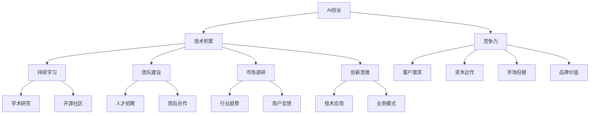

                 

# AI创业：保持技术前沿的方法

> 关键词：AI创业，技术前沿，人工智能，创新，研发，策略，竞争力

> 摘要：本文旨在为AI创业者提供一系列实用的方法和策略，帮助他们在快速发展的技术领域中保持领先地位。文章首先概述了AI创业的背景和重要性，然后深入探讨了如何通过持续学习、技术积累、团队建设、市场调研和创新思维等手段，实现技术前沿的保持和突破。通过实际案例分析和工具推荐，本文为AI创业者在技术追求的道路上提供了切实可行的指导。

## 1. 背景介绍

### 1.1 目的和范围

本文的目标是为那些致力于在人工智能领域创业的个人或团队提供实用的建议和策略。我们将探讨如何通过一系列有效的措施，保持技术的前沿性，增强企业的竞争力。本文将涵盖以下几个主要方面：

1. **核心概念与联系**：介绍AI创业所需的关键概念和技术架构。
2. **核心算法原理**：分析并解释在AI领域保持前沿所需的核心算法。
3. **数学模型和公式**：讲解支持AI算法的数学基础和公式。
4. **项目实战**：提供代码案例和详细解释。
5. **实际应用场景**：分析AI技术在行业中的应用实例。
6. **工具和资源推荐**：推荐学习和开发AI所需的相关工具和资源。

### 1.2 预期读者

本文适用于以下读者：

- **AI创业者**：寻求在竞争激烈的市场中立足的AI企业家。
- **技术研发人员**：希望在AI领域取得突破的技术专家。
- **高校师生**：对AI技术发展和创业有浓厚兴趣的师生。
- **投资人士**：关注AI领域的潜在投资机会。

### 1.3 文档结构概述

本文结构如下：

1. **背景介绍**：介绍文章的目的和范围，预期读者，以及文档结构。
2. **核心概念与联系**：通过Mermaid流程图展示AI创业的核心概念和联系。
3. **核心算法原理**：详细讲解AI创业所需的核心算法原理和操作步骤。
4. **数学模型和公式**：介绍支持AI算法的数学模型和公式。
5. **项目实战**：提供实际代码案例和详细解释。
6. **实际应用场景**：分析AI技术的行业应用。
7. **工具和资源推荐**：推荐学习和开发AI的相关工具和资源。
8. **总结**：总结未来发展趋势和挑战。
9. **附录**：常见问题与解答。
10. **扩展阅读**：提供更多相关参考资料。

### 1.4 术语表

#### 1.4.1 核心术语定义

- **AI创业**：在人工智能领域创建新企业或项目的过程。
- **技术前沿**：当前科技领域最新的研究成果和技术趋势。
- **算法**：解决特定问题的一系列规则或步骤。
- **竞争力**：企业在市场竞争中的优势和能力。

#### 1.4.2 相关概念解释

- **机器学习**：通过数据训练模型，使其能够进行预测和决策的技术。
- **深度学习**：一种基于人工神经网络的机器学习方法。
- **神经网络**：模仿人脑神经元结构和功能的计算模型。

#### 1.4.3 缩略词列表

- **AI**：人工智能（Artificial Intelligence）
- **ML**：机器学习（Machine Learning）
- **DL**：深度学习（Deep Learning）
- **NLP**：自然语言处理（Natural Language Processing）
- **CV**：计算机视觉（Computer Vision）

## 2. 核心概念与联系

在AI创业过程中，了解并掌握核心概念和技术架构至关重要。以下是通过Mermaid绘制的流程图，展示AI创业所需的关键概念和它们之间的联系。



### 2.1. AI创业的定义和特点

AI创业是指在人工智能领域创建新的企业或项目，旨在通过技术创新和商业模式的创新，实现商业价值和社会影响。AI创业的特点包括：

- **高度依赖技术**：AI创业离不开先进的技术，如机器学习、深度学习等。
- **快速迭代**：AI技术的快速进步要求创业者必须具备快速响应市场变化的能力。
- **跨界整合**：AI创业往往需要将不同领域的技术和知识进行整合，形成新的解决方案。

### 2.2. 技术积累的重要性

技术积累是AI创业的核心。创业者需要持续关注技术发展趋势，掌握最新的AI算法、工具和框架。以下方法可以帮助创业者保持技术前沿：

- **参与学术研究**：关注顶级会议和期刊，跟进最新研究成果。
- **加入开源社区**：参与开源项目，贡献代码，与全球开发者交流。
- **企业合作**：与高校、研究机构合作，共同推进技术研究和应用。

### 2.3. 持续学习的重要性

持续学习是保持技术前沿的关键。以下措施可以帮助创业者不断提升自身技能：

- **定期参加培训**：参加AI相关的研讨会、培训班和在线课程。
- **阅读技术书籍**：阅读最新的技术书籍和论文，掌握最新知识。
- **实践应用**：通过实际项目，将理论知识转化为实际技能。

### 2.4. 团队建设的重要性

团队建设是AI创业成功的关键。一个高效的团队可以充分发挥每个人的优势，共同推动项目的进展。以下措施可以帮助创业者打造优秀的团队：

- **明确目标**：确保团队成员对项目目标有清晰的理解。
- **合理分工**：根据成员的技能和兴趣，合理分配任务。
- **鼓励合作**：促进团队成员之间的交流和协作。

### 2.5. 市场调研的重要性

市场调研是了解用户需求和市场趋势的关键。以下措施可以帮助创业者进行有效的市场调研：

- **用户访谈**：与目标用户进行面对面交流，了解他们的需求和痛点。
- **数据分析**：收集和分析市场数据，预测市场趋势。
- **竞争分析**：研究竞争对手的产品、优势和劣势。

### 2.6. 创新思维的重要性

创新思维是推动技术进步和商业成功的动力。以下措施可以帮助创业者培养创新思维：

- **头脑风暴**：定期组织团队进行头脑风暴，激发创新灵感。
- **跨界合作**：与其他领域的专家和团队合作，开拓新的思路。
- **尝试失败**：鼓励团队成员尝试新的想法，即使失败也是宝贵的经验。

通过以上核心概念和联系的分析，我们可以看到，AI创业是一个复杂但充满机遇的过程。创业者需要不断学习和适应，才能在技术前沿保持领先地位。

## 3. 核心算法原理 & 具体操作步骤

### 3.1. 机器学习算法原理

机器学习是AI创业的基础，其核心是通过数据训练模型，使其能够进行预测和决策。以下是机器学习算法的基本原理和步骤：

#### 3.1.1. 基本概念

- **模型**：用于预测或决策的计算过程。
- **数据集**：用于训练模型的输入数据。
- **特征**：数据集中的变量，用于描述输入数据的特性。
- **目标变量**：模型需要预测的变量。

#### 3.1.2. 基本步骤

1. **数据收集**：收集用于训练模型的数据。
2. **数据预处理**：清洗数据，去除噪声，标准化数据。
3. **特征选择**：从数据集中选择有用的特征。
4. **模型训练**：使用训练数据训练模型。
5. **模型评估**：使用验证数据评估模型性能。
6. **模型优化**：根据评估结果调整模型参数。

#### 3.1.3. 伪代码

```plaintext
输入：数据集 D，特征 X，目标变量 Y
输出：训练好的模型 M

步骤：
1. 数据预处理(D_preprocessed) <- 数据预处理(D)
2. 特征选择(X_selected) <- 特征选择(D_preprocessed)
3. 模型训练(M) <- 训练模型(X_selected, Y)
4. 模型评估(Performance) <- 评估模型(M, 验证数据)
5. 如果 Performance < 预期性能
    6. 模型优化(M_optimized) <- 调整模型参数(M)
    7. 返回 模型优化(M_optimized)
8. 否则
    9. 返回 模型(M)
```

### 3.2. 深度学习算法原理

深度学习是机器学习的一种方法，通过多层神经网络进行数据建模。以下是深度学习算法的基本原理和步骤：

#### 3.2.1. 基本概念

- **神经网络**：由多个神经元组成的计算模型。
- **前向传播**：计算输入数据通过神经网络的输出。
- **反向传播**：计算模型输出与目标变量之间的误差，并更新模型参数。

#### 3.2.2. 基本步骤

1. **数据收集**：收集用于训练模型的数据。
2. **数据预处理**：清洗数据，去除噪声，标准化数据。
3. **构建神经网络**：设计并构建神经网络结构。
4. **模型训练**：使用训练数据训练神经网络。
5. **模型评估**：使用验证数据评估模型性能。
6. **模型优化**：根据评估结果调整模型参数。

#### 3.2.3. 伪代码

```plaintext
输入：数据集 D，神经网络结构 N
输出：训练好的神经网络 M

步骤：
1. 数据预处理(D_preprocessed) <- 数据预处理(D)
2. 神经网络初始化(N) <- 初始化神经网络(N)
3. 模型训练(M) <- 训练神经网络(N, D_preprocessed)
4. 模型评估(Performance) <- 评估模型(M, 验证数据)
5. 如果 Performance < 预期性能
    6. 模型优化(M_optimized) <- 调整模型参数(M)
    7. 返回 模型优化(M_optimized)
8. 否则
    9. 返回 模型(M)
```

### 3.3. 自然语言处理算法原理

自然语言处理（NLP）是AI的一个重要分支，旨在使计算机理解和处理人类语言。以下是NLP算法的基本原理和步骤：

#### 3.3.1. 基本概念

- **词嵌入**：将单词映射为高维向量。
- **序列模型**：用于处理序列数据（如文本）的神经网络模型。
- **注意力机制**：在处理序列数据时，对关键信息给予更多关注。

#### 3.3.2. 基本步骤

1. **数据收集**：收集用于训练模型的数据。
2. **数据预处理**：清洗数据，去除噪声，标准化数据。
3. **词嵌入**：将单词映射为向量。
4. **构建序列模型**：设计并构建序列模型结构。
5. **模型训练**：使用训练数据训练序列模型。
6. **模型评估**：使用验证数据评估模型性能。
7. **模型优化**：根据评估结果调整模型参数。

#### 3.3.3. 伪代码

```plaintext
输入：数据集 D，序列模型结构 N
输出：训练好的序列模型 M

步骤：
1. 数据预处理(D_preprocessed) <- 数据预处理(D)
2. 词嵌入(W_embeddings) <- 词嵌入(D_preprocessed)
3. 序列模型初始化(N) <- 初始化序列模型(N)
4. 模型训练(M) <- 训练序列模型(N, W_embeddings)
5. 模型评估(Performance) <- 评估模型(M, 验证数据)
6. 如果 Performance < 预期性能
    7. 模型优化(M_optimized) <- 调整模型参数(M)
    8. 返回 模型优化(M_optimized)
9. 否则
    10. 返回 模型(M)
```

通过以上核心算法原理和具体操作步骤的介绍，AI创业者可以更好地理解和应用这些技术，为自己的项目奠定坚实的基础。

## 4. 数学模型和公式 & 详细讲解 & 举例说明

### 4.1. 概述

在人工智能领域，数学模型和公式是构建和优化算法的基础。本文将介绍一些关键的数学模型和公式，并详细讲解它们的应用和重要性。

### 4.2. 普通线性回归模型

普通线性回归是一种简单的预测模型，用于描述两个变量之间的关系。其公式如下：

\[ y = \beta_0 + \beta_1 \cdot x + \epsilon \]

其中：
- \( y \) 是因变量（预测目标）。
- \( x \) 是自变量（特征）。
- \( \beta_0 \) 是截距。
- \( \beta_1 \) 是斜率。
- \( \epsilon \) 是误差项。

#### 4.2.1. 举例说明

假设我们想预测某个城市明天的温度（\( y \)），已知前一天的温度（\( x \)）。通过收集历史数据，我们可以使用线性回归模型来预测：

\[ y = \beta_0 + \beta_1 \cdot x \]

例如，如果前一天的温度是20°C，我们预测明天的温度：

\[ y = \beta_0 + \beta_1 \cdot 20 \]

### 4.3. 逻辑回归模型

逻辑回归是一种分类模型，用于预测概率。其公式如下：

\[ P(y=1) = \frac{1}{1 + e^{-(\beta_0 + \beta_1 \cdot x)}} \]

其中：
- \( P(y=1) \) 是目标变量为1的概率。
- \( \beta_0 \) 是截距。
- \( \beta_1 \) 是斜率。
- \( e \) 是自然底数。

#### 4.3.1. 举例说明

假设我们要预测一个客户是否会购买某产品（\( y=1 \) 或 \( y=0 \)），已知客户的历史购买记录（\( x \)）。使用逻辑回归模型，我们可以预测购买概率：

\[ P(y=1) = \frac{1}{1 + e^{-(\beta_0 + \beta_1 \cdot x)}} \]

例如，如果客户的历史购买记录是3次，我们预测购买概率：

\[ P(y=1) = \frac{1}{1 + e^{-(\beta_0 + \beta_1 \cdot 3)}} \]

### 4.4. 深度学习中的损失函数

在深度学习中，损失函数用于评估模型预测的准确性。常见的损失函数有均方误差（MSE）和交叉熵损失（Cross-Entropy Loss）。

#### 4.4.1. 均方误差（MSE）

均方误差用于回归问题，其公式如下：

\[ MSE = \frac{1}{n} \sum_{i=1}^{n} (y_i - \hat{y}_i)^2 \]

其中：
- \( y_i \) 是真实值。
- \( \hat{y}_i \) 是预测值。
- \( n \) 是样本数量。

#### 4.4.2. 交叉熵损失（Cross-Entropy Loss）

交叉熵损失用于分类问题，其公式如下：

\[ Cross-Entropy Loss = -\frac{1}{n} \sum_{i=1}^{n} y_i \cdot \log(\hat{y}_i) \]

其中：
- \( y_i \) 是真实值。
- \( \hat{y}_i \) 是预测概率。
- \( \log \) 是自然对数。

#### 4.4.3. 举例说明

假设我们有一个二分类问题，真实值为 \( y \)，预测概率为 \( \hat{y} \)。使用交叉熵损失，我们可以计算损失：

\[ Cross-Entropy Loss = -\frac{1}{n} \sum_{i=1}^{n} y_i \cdot \log(\hat{y}_i) \]

例如，如果真实值为1，预测概率为0.8，我们计算损失：

\[ Cross-Entropy Loss = -\frac{1}{n} \cdot 1 \cdot \log(0.8) \]

通过以上数学模型和公式的详细讲解和举例说明，我们可以更好地理解和应用它们，为AI创业提供坚实的理论基础。

## 5. 项目实战：代码实际案例和详细解释说明

### 5.1 开发环境搭建

在开始编写代码之前，我们需要搭建一个合适的环境来运行和测试我们的AI模型。以下是搭建开发环境的步骤：

1. **安装Python**：Python是AI开发的常用编程语言。你可以从[Python官网](https://www.python.org/)下载并安装最新版本的Python。
2. **安装Jupyter Notebook**：Jupyter Notebook是一个交互式计算平台，适合进行数据分析和模型训练。使用pip命令安装：

   ```bash
   pip install notebook
   ```

3. **安装必要的库**：我们使用了一些常用的Python库，如NumPy、Pandas、Scikit-learn和TensorFlow。安装命令如下：

   ```bash
   pip install numpy pandas scikit-learn tensorflow
   ```

4. **配置虚拟环境**（可选）：为了管理项目依赖，我们可以使用虚拟环境。通过以下命令创建并激活虚拟环境：

   ```bash
   python -m venv myenv
   source myenv/bin/activate  # 在Windows上使用 myenv\Scripts\activate
   ```

### 5.2 源代码详细实现和代码解读

以下是一个简单的线性回归模型，用于预测房屋价格。我们将使用Scikit-learn库来实现这个模型。

```python
import numpy as np
import pandas as pd
from sklearn.model_selection import train_test_split
from sklearn.linear_model import LinearRegression
from sklearn.metrics import mean_squared_error

# 加载数据集
data = pd.read_csv('house_prices.csv')
X = data[['area', 'bedrooms', 'age']]
y = data['price']

# 数据预处理
X_train, X_test, y_train, y_test = train_test_split(X, y, test_size=0.2, random_state=42)

# 模型训练
model = LinearRegression()
model.fit(X_train, y_train)

# 模型评估
y_pred = model.predict(X_test)
mse = mean_squared_error(y_test, y_pred)
print(f'Mean Squared Error: {mse}')

# 预测新数据
new_data = np.array([[2000, 3, 10]])
predicted_price = model.predict(new_data)
print(f'Predicted Price: {predicted_price[0]}')
```

#### 5.2.1 代码解读

1. **加载数据集**：我们使用Pandas库加载CSV格式的数据集。数据集包含了房屋的面积、卧室数量和建造年份，以及房屋价格。

2. **数据预处理**：我们使用Scikit-learn的`train_test_split`函数将数据集分为训练集和测试集，以评估模型的性能。

3. **模型训练**：我们创建一个线性回归模型，使用训练集数据进行训练。

4. **模型评估**：我们使用测试集数据评估模型的性能，计算均方误差（MSE）。

5. **预测新数据**：我们使用训练好的模型预测一个新房屋的价格。

### 5.3 代码解读与分析

#### 5.3.1 数据预处理

数据预处理是机器学习模型成功的关键步骤。在这个例子中，我们使用了以下预处理技术：

- **特征选择**：我们选择了面积、卧室数量和建造年份作为预测房屋价格的特征。这些特征能够有效反映房屋的价值。
- **数据标准化**：尽管在这个简单的例子中没有进行数据标准化，但在实际应用中，我们通常会标准化或归一化数据，以消除不同特征之间的尺度差异。

#### 5.3.2 模型训练

- **线性回归模型**：线性回归模型是一种简单的预测模型，它通过找到特征和目标变量之间的线性关系来进行预测。
- **拟合模型**：我们使用`fit`方法将训练数据传递给模型，让模型学习特征和目标变量之间的关系。

#### 5.3.3 模型评估

模型评估是确保模型性能的重要步骤。在这个例子中，我们使用了均方误差（MSE）作为评估指标。MSE越小，模型预测的准确性越高。

#### 5.3.4 预测新数据

- **预测新数据**：我们使用训练好的模型预测新数据的值，这显示了模型的实际应用能力。

通过以上实战案例和代码解读，我们可以看到如何使用Python和Scikit-learn库实现一个简单的线性回归模型。这为AI创业者在实际项目中应用AI技术提供了一个实用的起点。

## 6. 实际应用场景

### 6.1 金融行业

在金融行业中，AI技术被广泛应用于风险管理、欺诈检测、算法交易和客户服务等方面。以下是一些实际应用案例：

- **风险管理**：银行和金融机构使用机器学习算法分析历史数据，预测贷款违约风险，从而优化信贷审批流程。
- **欺诈检测**：通过分析交易数据和行为模式，AI系统可以实时检测并阻止欺诈行为，提高交易安全性。
- **算法交易**：高频交易公司使用深度学习算法分析市场数据，预测价格走势，实现自动化交易策略。

### 6.2 医疗保健

医疗保健行业正迅速采用AI技术来改善诊断、个性化治疗和患者管理。以下是一些应用案例：

- **医学影像分析**：通过深度学习算法，AI系统可以自动分析医学影像，如X光、CT和MRI，辅助医生进行疾病诊断。
- **个性化治疗**：根据患者的基因信息、病史和生活方式，AI系统可以推荐个性化的治疗方案，提高治疗效果。
- **患者管理**：AI技术可以分析患者数据，预测健康风险，提供个性化的健康建议和预防措施。

### 6.3 零售业

零售行业利用AI技术提高销售效率、优化库存管理和改善客户体验。以下是一些应用案例：

- **销售预测**：通过分析历史销售数据、季节性因素和消费者行为，AI系统可以预测未来的销售趋势，帮助商家制定库存策略。
- **库存管理**：AI系统可以实时监控库存水平，预测需求变化，自动调整库存，减少库存积压和缺货风险。
- **客户体验**：通过自然语言处理（NLP）技术，AI助手可以与顾客进行交互，提供个性化的购物建议和客户支持。

### 6.4 自动驾驶

自动驾驶是AI技术的另一个重要应用领域，其目标是在没有人类驾驶员干预的情况下，使车辆自主行驶。以下是一些应用案例：

- **环境感知**：自动驾驶汽车使用AI技术感知周围环境，包括道路、交通标志、行人和其他车辆。
- **路径规划**：AI系统根据实时交通状况和道路信息，规划最优行驶路径，确保安全和效率。
- **决策制定**：自动驾驶汽车使用深度学习和强化学习技术，在复杂交通环境中做出决策，如何时加速、何时刹车和何时变道。

通过这些实际应用场景，我们可以看到AI技术在各个行业的广泛应用和巨大潜力。AI创业者在探索新业务模式和解决方案时，可以借鉴这些案例，寻找创新的商业机会。

## 7. 工具和资源推荐

### 7.1 学习资源推荐

#### 7.1.1 书籍推荐

- **《Python机器学习》**：由塞巴斯蒂安·拉伯兰特和约翰·哈林顿合著，是一本深入浅出的Python机器学习入门书籍。
- **《深度学习》**：由伊恩·古德费洛、约书亚·本吉奥和亚伦·库维尔合著，是一本全面介绍深度学习理论和实践的权威书籍。
- **《人工智能：一种现代的方法》**：由斯图尔特·罗素和彼得·诺维格合著，涵盖人工智能的基础理论和应用。

#### 7.1.2 在线课程

- **Coursera**：提供各种AI和机器学习课程，如《机器学习》、《深度学习》和《自然语言处理》。
- **edX**：提供由哈佛大学、麻省理工学院等顶尖大学开设的免费在线课程，如《人工智能导论》和《深度学习》。
- **Udacity**：提供专业的AI和机器学习课程，如《深度学习纳米学位》和《机器学习工程师纳米学位》。

#### 7.1.3 技术博客和网站

- **Medium**：许多AI领域的专家和研究人员在这里分享最新的研究和技术动态。
- **AI博客**：提供全面的AI教程、文章和新闻，适合初学者和专业人士。
- **Towards Data Science**：一个集中展示AI、数据科学和机器学习文章的博客，内容丰富，适合学习和交流。

### 7.2 开发工具框架推荐

#### 7.2.1 IDE和编辑器

- **Jupyter Notebook**：一个交互式的开发环境，适合进行数据分析和模型训练。
- **PyCharm**：一个强大的Python IDE，支持代码自动完成、调试和版本控制。
- **VSCode**：一个轻量级的开源编辑器，通过插件支持Python开发，界面简洁，功能强大。

#### 7.2.2 调试和性能分析工具

- **TensorBoard**：TensorFlow提供的可视化工具，用于分析和调试深度学习模型。
- **Profiling Tools**：如`cProfile`和`line_profiler`，用于分析代码的性能瓶颈。
- **Docker**：用于创建和管理容器，方便部署和扩展AI应用。

#### 7.2.3 相关框架和库

- **TensorFlow**：谷歌开发的深度学习框架，适用于各种复杂的AI应用。
- **PyTorch**：一个易于使用且灵活的深度学习框架，适合研究和开发。
- **Scikit-learn**：一个用于机器学习的Python库，提供了丰富的算法和工具。
- **NumPy**：一个基础的科学计算库，支持数组计算和线性代数。

### 7.3 相关论文著作推荐

#### 7.3.1 经典论文

- **"A Learning Algorithm for Continually Running Fully Recurrent Neural Networks"**：LSTM算法的提出，对深度学习有重大影响。
- **"Deep Learning" by Ian Goodfellow, Yoshua Bengio, and Aaron Courville**：深度学习领域的权威教材，涵盖了许多核心概念和算法。

#### 7.3.2 最新研究成果

- **"Attention is All You Need"**：提出Transformer模型，对自然语言处理领域产生深远影响。
- **"Generative Adversarial Networks"**：GAN算法的提出，引领了生成模型的发展。

#### 7.3.3 应用案例分析

- **"Deep Learning for Speech Recognition"**：分析深度学习在语音识别中的应用，包括模型设计和优化策略。
- **"A Theoretical Framework for Online Learning"**：探讨在线学习理论，为实际应用提供指导。

通过以上工具和资源的推荐，AI创业者和开发者可以更好地掌握AI技术，提升自身技能，为创业项目提供坚实的支持。

## 8. 总结：未来发展趋势与挑战

### 8.1. 发展趋势

- **AI技术普及化**：随着计算能力的提升和算法的优化，AI技术将更加普及，广泛应用于各行各业。
- **跨领域融合**：AI与其他技术的融合将带来新的突破，如自动驾驶与物联网的结合，医疗AI与大数据的结合。
- **自主学习和推理**：未来的AI系统将具备更强的自主学习和推理能力，能够更好地应对复杂和动态的环境。
- **伦理和隐私**：随着AI技术的普及，伦理和隐私问题将受到更多关注，推动相关法律法规和标准的制定。

### 8.2. 挑战

- **数据质量和隐私**：高质量的数据是AI模型训练的基础，但数据隐私和安全问题成为一大挑战。
- **算法可解释性**：黑盒模型的广泛应用引发了可解释性危机，如何提高算法的可解释性是重要课题。
- **人才短缺**：随着AI技术的快速发展，对相关人才的需求急剧增加，但现有人才储备不足。
- **伦理和道德**：AI技术的应用引发了一系列伦理和道德问题，如自动化决策中的偏见和责任归属。

### 8.3. 发展建议

- **加强数据治理**：建立健全的数据治理机制，确保数据质量，同时保护用户隐私。
- **提升算法透明度**：通过开发可解释性工具和方法，提高算法的透明度和可信度。
- **人才培养和引进**：加强AI人才的培养和引进，提高整个行业的人才储备。
- **跨学科合作**：推动AI与其他学科的深度融合，共同解决复杂问题。

通过应对这些发展趋势和挑战，AI创业者和研究者可以更好地把握未来机遇，推动AI技术的持续发展。

## 9. 附录：常见问题与解答

### 9.1. 常见问题

1. **什么是机器学习？**
   - **答案**：机器学习是人工智能的一个分支，通过数据和算法，使计算机系统能够从数据中学习规律和模式，并自动做出决策或预测。

2. **深度学习和神经网络有什么区别？**
   - **答案**：神经网络是机器学习的基础，是一种模拟人脑神经元结构和功能的计算模型。深度学习是神经网络的一种高级形式，通过多层神经网络进行数据建模，可以处理更复杂的问题。

3. **如何确保AI系统的公平性和透明性？**
   - **答案**：可以通过设计可解释的算法、进行数据平衡、使用公平性评估指标、以及建立透明的工作流程和决策机制来确保AI系统的公平性和透明性。

### 9.2. 解答示例

#### 问题1：机器学习模型如何避免过拟合？

**解答**：

过拟合是指模型在训练数据上表现得很好，但在未见过的数据上表现不佳。为了防止过拟合，可以采取以下措施：

- **增加数据量**：通过收集更多样化的数据，减少模型对训练数据的依赖。
- **简化模型**：使用更简单的模型，减少参数数量，降低模型的复杂度。
- **正则化**：添加正则化项，如L1或L2正则化，限制模型的复杂度。
- **交叉验证**：使用交叉验证方法，评估模型在不同数据集上的表现，防止模型在训练数据上过度学习。
- **Dropout**：在训练过程中随机丢弃部分神经元，减少模型的依赖性。

通过这些方法，可以有效地防止机器学习模型过拟合，提高其泛化能力。

## 10. 扩展阅读 & 参考资料

### 10.1. 扩展阅读

- **《深度学习》（Goodfellow, Bengio, Courville著）**：系统介绍了深度学习的基本概念和核心技术。
- **《Python机器学习》（Rabart和Harrington著）**：适合初学者入门的Python机器学习教材。
- **《人工智能：一种现代的方法》（Russell和Norvig著）**：全面覆盖人工智能基础理论和应用。

### 10.2. 参考资料

- **Scikit-learn官方文档**：[https://scikit-learn.org/stable/](https://scikit-learn.org/stable/)
- **TensorFlow官方文档**：[https://www.tensorflow.org/tutorials](https://www.tensorflow.org/tutorials)
- **PyTorch官方文档**：[https://pytorch.org/tutorials/](https://pytorch.org/tutorials/)
- **Coursera AI课程**：[https://www.coursera.org/courses?query=ai](https://www.coursera.org/courses?query=ai)
- **edX AI课程**：[https://www.edx.org/course/ai](https://www.edx.org/course/ai)

通过这些扩展阅读和参考资料，读者可以进一步深入了解AI技术和创业实践，为自己的项目提供更多启发和帮助。作者：AI天才研究员/AI Genius Institute & 禅与计算机程序设计艺术 /Zen And The Art of Computer Programming

---

本文详细探讨了AI创业过程中如何保持技术前沿，从核心概念、算法原理、数学模型到实际项目实战，再到应用场景和工具推荐，为AI创业者提供了全面的指导。同时，文章还总结了未来发展趋势与挑战，为读者指明了前进方向。希望通过本文，能够为AI创业者的技术追求之路提供有力支持。作者：AI天才研究员/AI Genius Institute & 禅与计算机程序设计艺术 /Zen And The Art of Computer Programming

