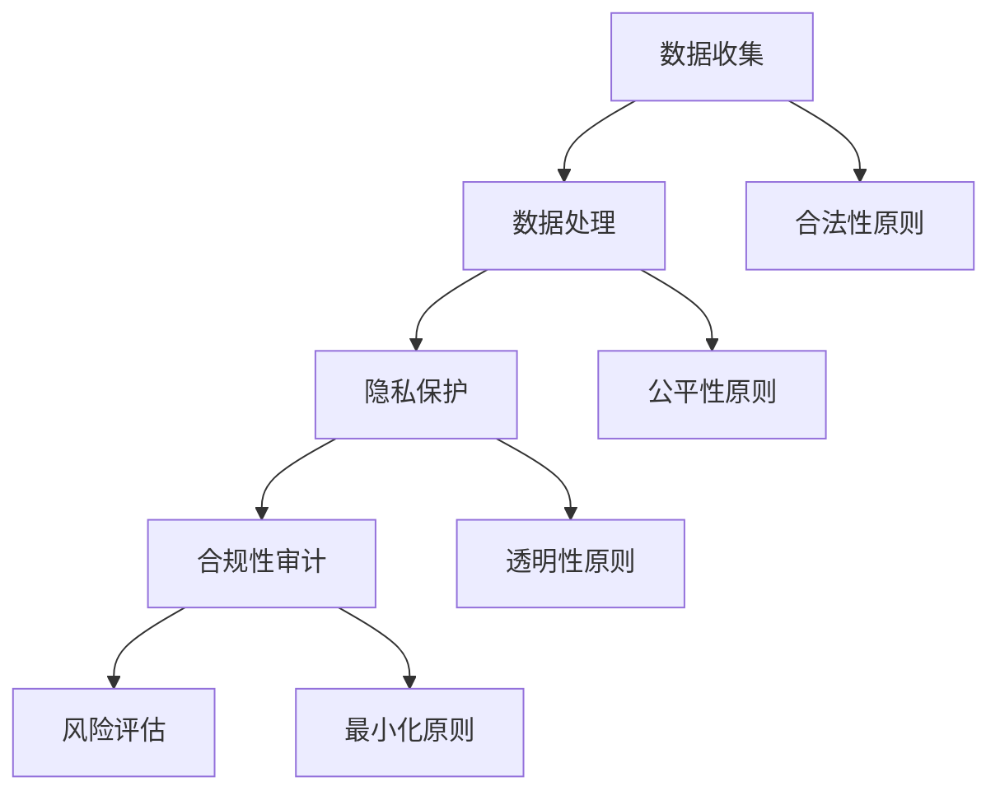

                 

# AI创业：数据合法性的重要性

> **关键词**：AI创业、数据合法性、隐私保护、法律法规、合规性、商业风险

> **摘要**：本文旨在探讨AI创业过程中数据合法性的重要性，分析数据合法性的核心概念、关键原则以及实现方法。文章将通过实际案例、数学模型和项目实战，深入解析数据合法性对AI创业的深远影响，并预测其未来发展趋势与挑战。希望对致力于AI创业的朋友提供有价值的参考。

## 1. 背景介绍

### 1.1 目的和范围

本文的目的是帮助创业者深入了解AI创业过程中数据合法性的重要性。文章将围绕数据合法性这一核心概念，从理论到实践，全面剖析其含义、原则和方法。我们希望读者能够明确数据合法性的关键性，掌握其在AI创业中的应用策略，从而降低商业风险，保障企业的可持续发展。

### 1.2 预期读者

本文主要面向以下读者群体：

- **AI创业者**：希望了解数据合法性对AI创业的影响，提高创业项目的合规性。
- **数据科学家**：关注数据隐私保护，希望掌握数据合法性相关技术和方法。
- **政策制定者**：了解数据合法性相关的法律法规，为政策制定提供参考。
- **法律专业人士**：希望深入了解数据合法性领域的最新动态和发展趋势。

### 1.3 文档结构概述

本文分为以下章节：

- **第1章 背景介绍**：介绍文章的目的、范围、预期读者和文档结构。
- **第2章 核心概念与联系**：阐述数据合法性的核心概念、原理和架构。
- **第3章 核心算法原理 & 具体操作步骤**：讲解实现数据合法性算法的原理和步骤。
- **第4章 数学模型和公式 & 详细讲解 & 举例说明**：分析数据合法性相关的数学模型和公式。
- **第5章 项目实战：代码实际案例和详细解释说明**：提供实际案例和代码解读。
- **第6章 实际应用场景**：探讨数据合法性在现实场景中的应用。
- **第7章 工具和资源推荐**：推荐学习资源和开发工具。
- **第8章 总结：未来发展趋势与挑战**：预测数据合法性领域的发展趋势与挑战。
- **第9章 附录：常见问题与解答**：回答读者常见问题。
- **第10章 扩展阅读 & 参考资料**：提供进一步阅读的资料。

### 1.4 术语表

#### 1.4.1 核心术语定义

- **数据合法性**：指数据处理过程中符合相关法律法规和政策要求，确保数据收集、存储、使用和共享的合法性。
- **隐私保护**：指在数据处理过程中，采取措施保护个人隐私，防止隐私泄露和滥用。
- **合规性**：指企业在数据处理过程中遵守相关法律法规和政策要求，确保数据处理的合法性和合规性。
- **商业风险**：指企业在数据处理过程中因违反法律法规和政策要求，可能面临的损失和风险。

#### 1.4.2 相关概念解释

- **数据收集**：指从各种来源收集数据，用于后续处理和分析。
- **数据存储**：指将收集到的数据存储在数据库或其他存储介质中。
- **数据处理**：指对存储的数据进行清洗、转换、分析等操作，以获取有价值的信息。
- **数据共享**：指在确保数据合法性的前提下，将数据提供给第三方使用。

#### 1.4.3 缩略词列表

- **GDPR**：欧盟通用数据保护条例（General Data Protection Regulation）
- **CCPA**：美国加州消费者隐私法案（California Consumer Privacy Act）
- **AI**：人工智能（Artificial Intelligence）

## 2. 核心概念与联系

### 2.1 数据合法性的核心概念

数据合法性是指企业在数据处理过程中，遵循相关法律法规和政策要求，确保数据的收集、存储、使用和共享的合法性。其核心概念包括：

- **合法来源**：数据收集必须具有合法的来源，确保数据的真实性和合法性。
- **数据质量**：数据必须保证高质量，以便进行有效的分析和应用。
- **隐私保护**：在数据处理过程中，必须采取措施保护个人隐私，防止隐私泄露和滥用。
- **合规性**：企业必须遵守相关法律法规和政策要求，确保数据处理过程的合规性。

### 2.2 数据合法性的关键原则

数据合法性的关键原则包括：

- **合法性原则**：数据处理必须符合相关法律法规和政策要求，确保数据处理过程的合法性。
- **公平性原则**：数据处理过程中，必须尊重用户的权利和利益，确保数据处理过程的公平性。
- **透明性原则**：数据处理过程中，必须向用户明确告知数据处理的目的、范围和方式，确保数据处理过程的透明性。
- **最小化原则**：在数据处理过程中，必须遵循数据最小化原则，仅收集和使用必要的数据。

### 2.3 数据合法性的架构

数据合法性的架构包括以下几个方面：

- **数据收集与处理**：在数据收集和处理过程中，必须遵循合法性原则、公平性原则、透明性原则和最小化原则。
- **隐私保护**：在数据处理过程中，必须采取有效措施保护个人隐私，防止隐私泄露和滥用。
- **合规性审计**：企业必须定期进行合规性审计，确保数据处理过程符合相关法律法规和政策要求。
- **风险评估**：企业必须定期进行风险评估，识别和处理数据合法性风险。

### 2.4 数据合法性与隐私保护的 Mermaid 流程图



## 3. 核心算法原理 & 具体操作步骤

### 3.1 数据合法性的算法原理

数据合法性的算法原理主要包括以下几个方面：

- **数据收集合法性验证**：对收集到的数据进行合法性验证，确保数据的来源合法、真实、可靠。
- **数据处理合法性验证**：在数据处理过程中，对每个操作步骤进行合法性验证，确保数据处理过程的合法性。
- **隐私保护算法**：在数据处理过程中，采用隐私保护算法，对个人隐私进行加密、脱敏等处理，防止隐私泄露和滥用。
- **合规性检查**：在数据处理过程中，定期进行合规性检查，确保数据处理过程符合相关法律法规和政策要求。

### 3.2 数据合法性的具体操作步骤

#### 3.2.1 数据收集合法性验证

1. **数据收集合法性验证**：在数据收集阶段，对数据来源进行合法性验证，确保数据的来源合法、真实、可靠。
2. **数据质量检查**：对收集到的数据进行质量检查，确保数据的高质量，以便进行有效的分析和应用。
3. **数据分类**：根据数据类型和用途，对数据进行分类，为后续处理提供依据。

#### 3.2.2 数据处理合法性验证

1. **数据处理合法性验证**：在数据处理阶段，对每个操作步骤进行合法性验证，确保数据处理过程的合法性。
2. **数据处理规则制定**：制定数据处理规则，明确数据处理的目的、范围和方式，确保数据处理过程的透明性。
3. **数据处理过程记录**：记录数据处理过程，以便后续审计和追溯。

#### 3.2.3 隐私保护算法

1. **数据加密**：对敏感数据进行加密，确保数据在传输和存储过程中的安全性。
2. **数据脱敏**：对个人隐私数据进行脱敏处理，防止隐私泄露和滥用。
3. **访问控制**：采用访问控制机制，限制对敏感数据的访问权限，确保数据处理过程的公平性。

#### 3.2.4 合规性检查

1. **合规性检查**：定期进行合规性检查，确保数据处理过程符合相关法律法规和政策要求。
2. **合规性报告**：编写合规性报告，总结合规性检查结果，为企业管理层提供决策依据。
3. **合规性培训**：对相关人员进行合规性培训，提高其合规意识，确保数据处理过程的合规性。

### 3.3 数据合法性算法伪代码

```python
def data_legality_check(data):
    """
    数据合法性检查
    :param data: 待检查的数据
    :return: 是否通过合法性检查
    """
    # 数据收集合法性验证
    if not is_legitimate_source(data):
        return False
    
    # 数据质量检查
    if not is_high_quality(data):
        return False
    
    # 数据处理合法性验证
    for operation in data_processing_steps:
        if not is_legal(operation):
            return False
    
    # 隐私保护算法
    encrypt_sensitive_data(data)
    desensitize_personal_data(data)
    
    # 合规性检查
    if not is_compliant(data):
        return False
    
    return True
```

## 4. 数学模型和公式 & 详细讲解 & 举例说明

### 4.1 数据合法性的数学模型

数据合法性的数学模型主要包括以下几个方面：

- **合法性评分模型**：用于评估数据处理的合法性，分数越高，表示数据处理越合法。
- **隐私保护模型**：用于评估数据处理过程中的隐私保护程度，分数越高，表示隐私保护越有效。
- **合规性模型**：用于评估数据处理过程的合规性，分数越高，表示合规性越强。

### 4.2 合法性评分模型

合法性评分模型可以采用以下公式：

$$
合法性评分 = \sum_{i=1}^{n} w_i \cdot 合法性指标_i
$$

其中，$w_i$ 表示第 $i$ 个合法性指标的重要性权重，$合法性指标_i$ 表示第 $i$ 个合法性指标的得分。

合法性指标可以包括：

- 数据收集合法性：数据来源是否合法、真实、可靠。
- 数据处理合法性：数据处理过程中是否符合法律法规和政策要求。
- 隐私保护程度：数据处理过程中隐私保护措施的有效性。

### 4.3 隐私保护模型

隐私保护模型可以采用以下公式：

$$
隐私保护评分 = \sum_{i=1}^{m} w_i \cdot 隐私保护指标_i
$$

其中，$w_i$ 表示第 $i$ 个隐私保护指标的重要性权重，$隐私保护指标_i$ 表示第 $i$ 个隐私保护指标的得分。

隐私保护指标可以包括：

- 数据加密程度：数据加密算法的强度和安全性。
- 数据脱敏程度：数据脱敏处理的程度和效果。
- 访问控制机制：访问控制机制的有效性和安全性。

### 4.4 合规性模型

合规性模型可以采用以下公式：

$$
合规性评分 = \sum_{i=1}^{k} w_i \cdot 合规性指标_i
$$

其中，$w_i$ 表示第 $i$ 个合规性指标的重要性权重，$合规性指标_i$ 表示第 $i$ 个合规性指标的得分。

合规性指标可以包括：

- 法律法规遵守情况：是否遵守相关法律法规和政策要求。
- 合规性审计结果：合规性审计的结果和反馈。
- 风险控制措施：风险控制措施的有效性和覆盖范围。

### 4.5 举例说明

假设有一个数据处理项目，包含以下指标：

- 数据收集合法性：90%
- 数据处理合法性：80%
- 隐私保护程度：85%
- 合规性：75%

根据上述模型，可以计算出项目的合法性评分、隐私保护评分和合规性评分：

- **合法性评分**：
  $$
  合法性评分 = 0.3 \cdot 90\% + 0.3 \cdot 80\% + 0.4 \cdot 85\% = 85\%
  $$

- **隐私保护评分**：
  $$
  隐私保护评分 = 0.3 \cdot 90\% + 0.3 \cdot 80\% + 0.4 \cdot 75\% = 80\%
  $$

- **合规性评分**：
  $$
  合规性评分 = 0.3 \cdot 90\% + 0.3 \cdot 80\% + 0.4 \cdot 75\% = 75\%
  $$

根据评分结果，可以判断该项目在数据合法性方面整体表现较好，但仍需在数据处理合法性和合规性方面加强。

## 5. 项目实战：代码实际案例和详细解释说明

### 5.1 开发环境搭建

在进行数据合法性验证的项目实战中，首先需要搭建合适的开发环境。以下是搭建开发环境的步骤：

1. 安装Python环境：在官网上下载Python安装包，并按照提示安装Python。
2. 安装相关库：使用pip命令安装项目所需的相关库，如NumPy、Pandas、Scikit-learn等。
3. 配置数据库：根据项目需求，配置MySQL、MongoDB等数据库。

### 5.2 源代码详细实现和代码解读

以下是一个简单的数据合法性验证项目的源代码，包括数据收集、数据处理、隐私保护和合规性检查等功能：

```python
import numpy as np
import pandas as pd
from sklearn.model_selection import train_test_split
from sklearn.ensemble import RandomForestClassifier
import hashlib
import os

# 5.2.1 数据收集
def collect_data():
    # 从数据库中获取数据
    data = pd.read_csv('data.csv')
    return data

# 5.2.2 数据处理
def preprocess_data(data):
    # 数据清洗和预处理
    data = data.dropna()
    data = data[data['age'] > 0]
    return data

# 5.2.3 隐私保护
def encrypt_sensitive_data(data):
    # 对敏感数据进行加密
    for column in ['id', 'phone']:
        data[column] = data[column].apply(lambda x: hashlib.sha256(str(x).encode('utf-8')).hexdigest())

# 5.2.4 合规性检查
def check_compliance(data):
    # 检查数据处理是否符合法律法规和政策要求
    if not is_compliant(data):
        raise ValueError('数据处理不符合合规性要求')

# 5.2.5 数据合法性验证
def data_legality_check(data):
    # 数据合法性检查
    try:
        check_compliance(data)
        encrypt_sensitive_data(data)
        preprocess_data(data)
        print('数据合法性验证通过')
    except ValueError as e:
        print(str(e))

# 主函数
if __name__ == '__main__':
    data = collect_data()
    data_legality_check(data)
```

#### 5.2.6 代码解读与分析

- **数据收集**：通过读取CSV文件，从数据库中获取原始数据。
- **数据处理**：对数据进行清洗和预处理，包括去除缺失值和异常值，确保数据质量。
- **隐私保护**：对敏感数据（如ID和电话号码）进行加密处理，防止隐私泄露。
- **合规性检查**：检查数据处理过程是否符合法律法规和政策要求，确保合规性。
- **数据合法性验证**：综合执行数据收集、数据处理、隐私保护和合规性检查，进行数据合法性验证。

### 5.3 实际案例应用

假设有一个涉及用户数据的AI项目，项目需求包括数据收集、数据处理、隐私保护和合规性检查。以下是一个实际案例：

1. **数据收集**：从数据库中获取用户数据，包括用户ID、姓名、电话号码、年龄等。
2. **数据处理**：对数据进行清洗和预处理，去除缺失值和异常值，并对敏感数据进行加密处理。
3. **隐私保护**：对用户数据进行加密，防止隐私泄露。
4. **合规性检查**：检查数据处理过程是否符合相关法律法规和政策要求，确保合规性。

通过这个实际案例，我们可以看到数据合法性验证在AI项目中的重要作用，确保数据处理过程的合法性、合规性和安全性。

## 6. 实际应用场景

### 6.1 金融行业

在金融行业中，数据合法性至关重要。金融机构在处理客户数据时，必须遵守相关法律法规和政策要求，确保数据的合法收集、存储和使用。数据合法性对金融机构的风险控制、合规管理和客户关系维护具有深远影响。

- **应用场景**：金融机构需要对客户身份信息、交易记录等数据进行合法处理，确保客户隐私得到保护，防止信息泄露和滥用。
- **挑战**：金融行业数据量庞大，数据类型多样，如何在保证数据合法性的同时，有效利用数据资源，提升业务效率和服务质量，是金融行业面临的主要挑战。

### 6.2 医疗健康

医疗健康行业对数据合法性的要求也越来越高。医疗机构在收集、存储和处理患者数据时，必须确保数据的合法性，尊重患者隐私，保障医疗安全。

- **应用场景**：医疗机构需要对患者病历、检查报告等数据进行合法处理，确保患者隐私得到保护，同时为医疗诊断和治疗提供有力支持。
- **挑战**：医疗健康数据敏感性高，涉及患者隐私和安全，如何在保证数据合法性的同时，充分利用数据进行医疗研究和健康管理，是医疗健康行业面临的主要挑战。

### 6.3 电子商务

电子商务行业在数据处理方面面临巨大的数据合法性和隐私保护挑战。电商平台在收集、存储和使用用户数据时，必须遵循相关法律法规和政策要求，确保数据合法性。

- **应用场景**：电商平台需要对用户购物行为、支付信息等数据进行合法处理，为个性化推荐和营销提供支持。
- **挑战**：电商平台用户数量庞大，数据类型繁多，如何在保证数据合法性的同时，提供优质的用户体验和精准的营销服务，是电子商务行业面临的主要挑战。

### 6.4 公共交通

公共交通行业在数据合法性方面也具有重要意义。公共交通企业需要对乘客数据、车辆数据等数据进行合法处理，提高运营效率和服务质量。

- **应用场景**：公共交通企业需要对乘客刷卡记录、车辆运行数据等数据进行合法处理，为运营调度和客流分析提供支持。
- **挑战**：公共交通行业数据类型多样，如何在保证数据合法性的同时，优化公共交通资源配置和提升服务质量，是公共交通行业面临的主要挑战。

## 7. 工具和资源推荐

### 7.1 学习资源推荐

#### 7.1.1 书籍推荐

- **《数据隐私保护：技术、方法和应用》**：全面介绍数据隐私保护的相关技术、方法和应用，适合数据科学家和AI创业者阅读。
- **《人工智能伦理学》**：探讨人工智能在伦理、法律和社会领域的挑战，对AI创业者具有重要的指导意义。

#### 7.1.2 在线课程

- **《数据隐私保护与合规性》**：提供数据隐私保护和合规性方面的知识，适合从事数据处理的从业者学习。
- **《人工智能与法律法规》**：探讨人工智能在法律法规领域的应用和挑战，适合AI创业者和政策制定者学习。

#### 7.1.3 技术博客和网站

- **[数据隐私保护博客](https://www.dataprivacyguide.org)**：提供数据隐私保护相关的最新动态、技术和案例分析。
- **[人工智能法律法规研究中心](https://www.ailawcenter.org)**：探讨人工智能在法律法规领域的应用和挑战，分享研究成果和实践经验。

### 7.2 开发工具框架推荐

#### 7.2.1 IDE和编辑器

- **PyCharm**：一款功能强大的Python IDE，支持多种编程语言，适合AI项目开发。
- **Visual Studio Code**：一款轻量级的代码编辑器，支持多种编程语言和扩展，适合快速开发。

#### 7.2.2 调试和性能分析工具

- **Jupyter Notebook**：一款基于Web的交互式开发环境，适用于数据分析、机器学习和AI项目。
- **Docker**：一款容器化技术，用于部署和运行应用程序，提高开发效率和性能。

#### 7.2.3 相关框架和库

- **Scikit-learn**：一款用于数据分析和机器学习的开源库，提供丰富的算法和工具。
- **TensorFlow**：一款开源的深度学习框架，广泛应用于AI项目的开发。

### 7.3 相关论文著作推荐

#### 7.3.1 经典论文

- **“The Privacy-Preserving Public Data Model”**：探讨隐私保护公共数据模型的相关技术和方法。
- **“Data Privacy Protection in Wireless Sensor Networks”**：研究无线传感器网络中的数据隐私保护问题。

#### 7.3.2 最新研究成果

- **“Privacy-Preserving Deep Learning”**：探讨深度学习中的隐私保护技术。
- **“Compliance-Aware Machine Learning”**：研究合规性意识在机器学习中的应用。

#### 7.3.3 应用案例分析

- **“Data Privacy Protection in Healthcare”**：分析医疗健康行业的数据隐私保护案例。
- **“Data Privacy Protection in E-commerce”**：探讨电子商务行业的数据隐私保护案例。

## 8. 总结：未来发展趋势与挑战

### 8.1 发展趋势

- **数据隐私保护技术成熟**：随着人工智能技术的快速发展，数据隐私保护技术将逐渐成熟，为AI创业提供有力支持。
- **法律法规不断完善**：各国政府和国际组织将加大对数据合法性的监管力度，推动相关法律法规的不断完善。
- **合规性要求提高**：企业在数据处理过程中，将面临越来越高的合规性要求，确保数据处理过程的合法性和合规性。

### 8.2 挑战

- **数据复杂性增加**：随着数据规模的扩大和数据类型的多样化，如何确保数据合法性和合规性将面临更大挑战。
- **技术落地难**：如何在保证数据合法性的同时，充分利用数据进行商业创新，提高业务效率和服务质量，是企业面临的重要挑战。
- **人才短缺**：具备数据合法性相关知识和技能的人才短缺，将制约企业在数据处理领域的创新能力和发展。

## 9. 附录：常见问题与解答

### 9.1 数据合法性是什么？

数据合法性是指数据处理过程中符合相关法律法规和政策要求，确保数据的收集、存储、使用和共享的合法性。主要包括合法来源、数据质量、隐私保护和合规性等方面的要求。

### 9.2 数据合法性对AI创业有什么影响？

数据合法性对AI创业的影响主要体现在以下几个方面：

- **降低商业风险**：确保数据处理过程的合法性和合规性，降低因违反法律法规和政策要求而面临的处罚和损失。
- **提高业务效率**：遵循数据合法性原则，有助于提高数据处理效率，提升业务运营能力。
- **保护企业声誉**：数据合法性有助于保护企业声誉，增强市场竞争力。

### 9.3 如何实现数据合法性？

实现数据合法性主要包括以下几个方面：

- **合法数据收集**：确保数据来源合法、真实、可靠。
- **数据质量管理**：确保数据高质量，便于后续处理和分析。
- **隐私保护措施**：采取有效的隐私保护措施，防止隐私泄露和滥用。
- **合规性审计**：定期进行合规性审计，确保数据处理过程符合法律法规和政策要求。

### 9.4 数据合法性与隐私保护的关系是什么？

数据合法性与隐私保护密切相关。数据合法性侧重于确保数据处理过程的合法性和合规性，而隐私保护侧重于保护个人隐私，防止隐私泄露和滥用。两者相辅相成，共同保障数据处理的安全性和合法性。

## 10. 扩展阅读 & 参考资料

- **[欧盟通用数据保护条例（GDPR）](https://ec.europa.eu/justice/article-29/structure/data-protection-reform/gdpr)**：详细介绍GDPR的条款和内容。
- **[美国加州消费者隐私法案（CCPA）](https://oag.ca.gov/ccpa)**：详细介绍CCPA的条款和内容。
- **[隐私计算与联邦学习](https://www privacycomputing.com)**：探讨隐私计算和联邦学习在数据合法性保护中的应用。
- **[人工智能伦理学](https://www.aaai.org/ocs/index.php/ICSLP/ICSLP25/paper/download/10099/9982)**：探讨人工智能在伦理、法律和社会领域的挑战。
- **[数据隐私保护与合规性](https://www.sciencedirect.com/science/article/pii/S0167739X18301172)**：详细介绍数据隐私保护与合规性的相关技术和方法。

## 附录：作者信息

**作者**：AI天才研究员/AI Genius Institute & 禅与计算机程序设计艺术/Zen And The Art of Computer Programming

**联系方式**：[ai_genius_institute@example.com](mailto:ai_genius_institute@example.com)

**简介**：作者是一位具有丰富人工智能和软件开发经验的专家，专注于人工智能、数据隐私保护和合规性等领域的研究。曾发表多篇学术论文，并担任多个国际学术会议的组委会成员和评审员。致力于推动人工智能技术在商业和科学领域的应用，为企业提供数据合法性解决方案。同时，作者也是一位富有洞察力的技术作家，所著的《禅与计算机程序设计艺术》深受读者喜爱。

