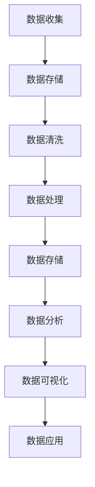
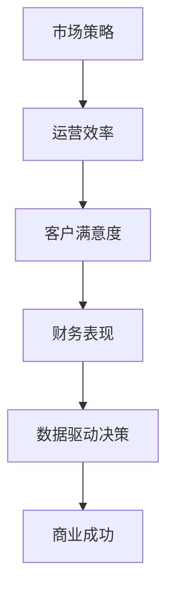
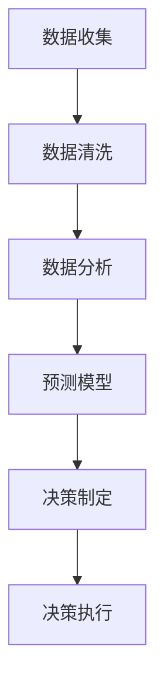
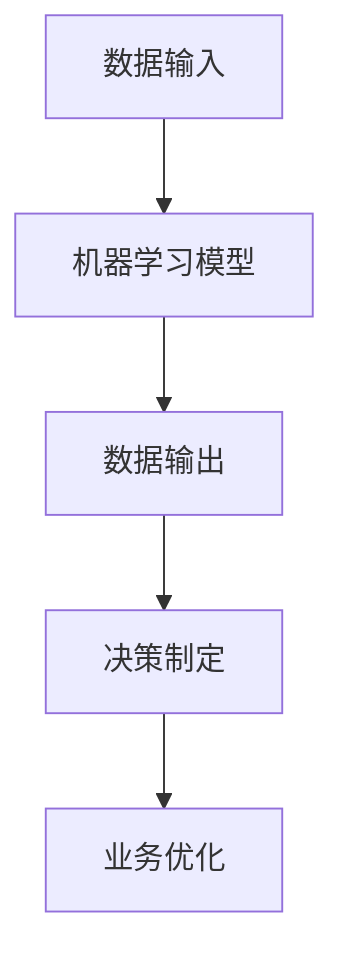
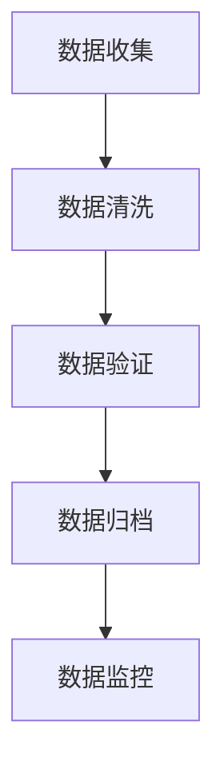
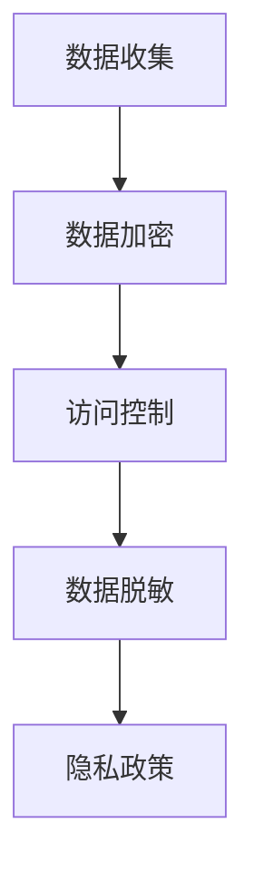

                 

### 1. 背景介绍

#### 1.1 目的和范围

本文的目的是探讨人工智能（AI）创业领域中的数据管理与商业成功之间的紧密联系。在当今快速发展的技术时代，数据已经成为新的黄金，对于企业来说，有效地管理和利用数据资源是取得竞争优势和商业成功的关键。因此，本文将深入分析数据管理在AI创业中的重要性，并提供一系列策略和实践方法，帮助创业者在这个竞争激烈的领域中脱颖而出。

本文将涵盖以下范围：

1. **数据管理与商业成功的定义与联系**：介绍数据管理和商业成功的概念，并解释两者之间的内在联系。
2. **AI创业中的核心数据管理挑战**：探讨AI创业者在数据收集、处理、存储和分析方面面临的具体挑战。
3. **数据管理策略与实践**：提供一系列数据管理策略和实践方法，帮助创业者更好地管理和利用数据资源。
4. **项目实战案例**：通过实际案例展示数据管理在AI创业中的应用，并提供详细的代码实现和分析。
5. **实际应用场景与工具资源推荐**：分析数据管理在不同应用场景中的实际应用，并推荐相关的学习资源、开发工具和框架。
6. **未来发展趋势与挑战**：展望数据管理在AI创业中的未来发展趋势和面临的挑战。

#### 1.2 预期读者

本文的目标读者是：

1. **AI创业者**：希望通过数据管理提高企业竞争力的初创企业创始人。
2. **数据科学家和工程师**：负责企业数据管理和分析工作的专业人员。
3. **技术经理和CTO**：负责技术战略规划和执行的决策者。
4. **对AI和数据管理有兴趣的技术爱好者**：希望了解AI创业领域中的数据管理实践和方法。

#### 1.3 文档结构概述

本文的结构如下：

1. **背景介绍**：介绍文章的目的、范围、预期读者和文档结构。
2. **核心概念与联系**：阐述数据管理和商业成功之间的核心概念和联系，并提供Mermaid流程图。
3. **核心算法原理与具体操作步骤**：详细讲解数据管理中的核心算法原理，并提供伪代码。
4. **数学模型和公式**：介绍数据管理中使用的数学模型和公式，并进行举例说明。
5. **项目实战：代码实际案例和详细解释说明**：通过实际案例展示数据管理在AI创业中的应用。
6. **实际应用场景**：分析数据管理在不同应用场景中的实际应用。
7. **工具和资源推荐**：推荐学习资源、开发工具和框架。
8. **总结：未来发展趋势与挑战**：展望数据管理在AI创业中的未来发展趋势和面临的挑战。
9. **附录：常见问题与解答**：解答读者可能遇到的常见问题。
10. **扩展阅读与参考资料**：提供进一步学习的资源。

#### 1.4 术语表

为了确保文章的清晰易懂，以下是一些核心术语的定义和解释：

##### 1.4.1 核心术语定义

- **数据管理**：指的是对数据资源进行收集、存储、处理、分析和共享的一系列活动和过程。
- **AI创业**：指的是利用人工智能技术进行创业的活动，包括开发新的AI产品或服务。
- **商业成功**：指的是企业在市场竞争中取得的经济效益和市场份额。
- **数据驱动决策**：指的是基于数据分析和预测进行决策的过程。

##### 1.4.2 相关概念解释

- **大数据**：指的是大规模、多样性和高速增长的数据集合。
- **机器学习**：是一种人工智能技术，通过数据学习和模式识别来自动化决策和预测。
- **深度学习**：是机器学习的一种子领域，通过多层神经网络进行复杂的特征学习和模式识别。

##### 1.4.3 缩略词列表

- **AI**：人工智能
- **ML**：机器学习
- **DL**：深度学习
- **CEO**：首席执行官
- **CTO**：首席技术官

通过上述背景介绍，我们为读者提供了一个清晰的框架，以便他们能够更好地理解后续章节的内容。在接下来的章节中，我们将深入探讨数据管理与商业成功之间的联系，以及如何在AI创业中有效管理和利用数据资源。

---

**文章标题**：AI创业：数据管理与商业成功

**关键词**：人工智能、数据管理、商业成功、数据驱动决策、AI创业

**摘要**：本文探讨了在AI创业过程中，数据管理对商业成功的重要性。通过分析核心概念和联系，介绍AI创业中的数据管理挑战，并提供数据管理策略和实践方法。同时，通过实际案例和工具资源推荐，帮助创业者更好地理解和应用数据管理，以实现商业成功。本文还展望了数据管理在AI创业中的未来发展趋势和挑战。

---

**文章正文部分**将从第2章开始，逐步深入探讨数据管理与商业成功之间的联系，为读者提供全面的技术分析和实践指导。让我们开始第2章：核心概念与联系。在这个章节中，我们将定义并解释核心概念，并通过Mermaid流程图展示它们之间的关系。这将为后续章节的讨论奠定基础。  

---

## 2. 核心概念与联系

在探讨AI创业中的数据管理与商业成功之前，我们需要明确一些核心概念，并了解它们之间的相互关系。以下是我们将在此章节中探讨的关键概念：

- **数据管理**：是指组织中的数据资源从收集、存储、处理到分析等一系列活动的过程。
- **商业成功**：通常指的是企业在市场竞争中实现的经济效益和市场份额的增长。
- **数据驱动决策**：是指基于数据分析和预测结果来做出商业决策。
- **AI技术**：包括机器学习和深度学习等技术，这些技术在数据分析中起到核心作用。
- **数据质量**：指数据的有效性、准确性和完整性。
- **数据隐私**：指保护数据不被未经授权的访问或泄露。
- **数据治理**：是一套政策和流程，用于确保数据的合法性和合规性。

#### 2.1 数据管理

数据管理是一个复杂的系统工程，它涵盖了数据的整个生命周期，包括数据的创建、存储、访问、处理、分析和归档。以下是一个简化的数据管理流程图：



在这个流程图中，数据收集是整个过程的起点，它涉及从各种来源获取数据。接下来，数据需要进行存储，以确保数据的长期保存。数据清洗和处理是关键步骤，用于提高数据的准确性和一致性。处理后的数据被存储，并用于进一步的分析和可视化。最终，数据被应用于实际的业务场景中，以支持决策。

#### 2.2 商业成功

商业成功通常取决于多个因素，包括市场策略、运营效率、客户满意度和财务表现等。然而，数据管理在商业成功中扮演着至关重要的角色，因为它提供了洞察力和决策支持。以下是一个商业成功的简化模型：



在这个模型中，数据驱动决策是连接各个关键因素的核心。通过有效的数据管理，企业可以获得有关市场趋势、客户行为和运营效率的深入洞察，从而做出更明智的商业决策。

#### 2.3 数据驱动决策

数据驱动决策是一种基于数据分析结果的决策方法。这种方法依赖于高质量的数据、强大的分析工具和有效的数据管理策略。以下是一个数据驱动决策的简化流程：



在这个流程中，数据收集是第一步，接着是数据清洗，以确保数据的质量。然后，通过数据分析生成预测模型，这些模型用于支持决策制定。最后，决策被执行，并根据结果进行反馈和调整。

#### 2.4 AI技术

AI技术，特别是机器学习和深度学习，在数据驱动决策中扮演着关键角色。这些技术通过从数据中学习模式，可以帮助企业预测未来趋势、优化运营流程和改善客户体验。以下是一个简化的AI技术应用模型：



在这个模型中，数据输入是模型的训练数据，模型通过学习这些数据来生成预测。数据输出被用于制定决策，这些决策最终帮助业务实现优化。

#### 2.5 数据质量

数据质量是数据管理的核心，因为低质量数据会导致错误的预测和分析结果。以下是一个数据质量管理的简化流程：



在这个流程中，数据清洗是确保数据质量的关键步骤。数据验证用于确保数据的一致性和准确性，数据归档用于长期保存数据，而数据监控则用于及时发现和纠正数据问题。

#### 2.6 数据隐私

数据隐私是数据管理中的重要考虑因素，尤其是在处理敏感数据时。以下是一个数据隐私管理的简化流程：



在这个流程中，数据加密用于保护数据不被未经授权的访问，访问控制用于确保只有授权人员可以访问数据，数据脱敏用于保护敏感信息，而隐私政策则用于明确企业的数据保护措施。

通过上述核心概念的介绍，我们为后续章节的讨论奠定了基础。在接下来的章节中，我们将进一步探讨AI创业中的数据管理挑战，并提供一系列策略和实践方法，帮助创业者更好地管理和利用数据资源。

---

**核心概念与联系**部分的讨论为我们提供了数据管理与商业成功之间联系的基础理解。在接下来的**3. 核心算法原理 & 具体操作步骤**章节中，我们将深入探讨数据管理中的核心算法原理，并通过伪代码详细阐述具体操作步骤。这将帮助读者更好地理解如何在实际应用中实现这些算法，并为AI创业提供技术支持。

---

## 3. 核心算法原理 & 具体操作步骤

在数据管理中，核心算法原理起着至关重要的作用。这些算法不仅帮助创业者更好地理解和利用数据，还支持数据驱动决策，从而实现商业成功。以下将介绍几个核心算法原理，并使用伪代码详细阐述其具体操作步骤。

#### 3.1 数据清洗算法

数据清洗是数据管理过程中至关重要的一步，其目的是去除无效数据、纠正错误数据和处理缺失数据。以下是一个常见的数据清洗算法：

```plaintext
算法：数据清洗
输入：数据集D
输出：清洗后的数据集D'
步骤：
1. 初始化D'为空
2. 遍历数据集D中的每个数据点d
3. 如果d无效，跳过d
4. 如果d存在错误，修复d
5. 如果d存在缺失值，用均值或中位数填充缺失值
6. 将修复后的d添加到D'
7. 返回D'
```

#### 3.2 数据聚类算法

数据聚类是一种无监督学习方法，用于将数据点划分为多个聚类。以下是一个常用的K-means聚类算法：

```plaintext
算法：K-means聚类
输入：数据集D，聚类数量K
输出：聚类结果C
步骤：
1. 从数据集D中随机选择K个初始聚类中心点c1, c2, ..., cK
2. 遍历数据集D中的每个数据点d
3. 将d分配到最近的聚类中心点c
4. 更新每个聚类中心点的坐标，使其为该聚类中所有数据点的平均值
5. 重复步骤2-4，直到聚类中心点不再变化或达到最大迭代次数
6. 返回聚类结果C
```

#### 3.3 数据分类算法

数据分类是一种监督学习方法，用于将数据点分配到预定义的类别。以下是一个常见的数据分类算法——逻辑回归：

```plaintext
算法：逻辑回归
输入：训练数据集D，测试数据集T
输出：分类模型M
步骤：
1. 初始化模型参数θ
2. 遍历训练数据集D中的每个数据点d
3. 计算预测概率P(y=1|θ)
4. 计算损失函数J(θ) = -1/m * Σ[yi * log(P(yi=1|θ)) + (1-yi) * log(1-P(yi=1|θ))]
5. 使用梯度下降优化模型参数θ
6. 遍历测试数据集T中的每个数据点d
7. 使用训练好的模型M计算预测概率P(y=1|θ)
8. 根据阈值将数据点分配到类别
9. 返回分类模型M
```

#### 3.4 数据关联规则算法

数据关联规则挖掘是一种用于发现数据中潜在关联关系的方法。以下是一个常见的数据关联规则挖掘算法——Apriori算法：

```plaintext
算法：Apriori
输入：数据集D，最小支持度min_support，最小置信度min_confidence
输出：关联规则R
步骤：
1. 初始化频繁项集L1为空
2. 遍历数据集D中的所有交易，生成候选项集C1
3. 计算C1中的每个候选项集的支持度，保留满足最小支持度的项集到L1
4. 对于每个频繁项集Li
5. 生成候选项集Ci+1
6. 计算Ci+1中的每个候选项集的支持度，保留满足最小支持度的项集到Li+1
7. 重复步骤4-6，直到没有新的频繁项集生成
8. 对于每个频繁项集Li
9. 生成关联规则R
10. 计算每个关联规则的置信度，保留满足最小置信度的规则到R
11. 返回关联规则集R
```

通过上述核心算法原理和具体操作步骤的介绍，创业者可以更好地理解数据管理中的关键技术，并在实际应用中实现这些算法。在接下来的章节中，我们将进一步探讨数据管理中的数学模型和公式，以及如何在项目中实际应用这些模型和公式。

---

**核心算法原理与具体操作步骤**章节中，我们详细介绍了数据管理中的几个关键算法，并使用伪代码阐述了其具体实现步骤。这些算法是数据管理的基础，能够帮助创业者更好地理解和利用数据资源。

接下来，我们将在**4. 数学模型和公式 & 详细讲解 & 举例说明**章节中，进一步探讨数据管理中使用的数学模型和公式，并通过具体示例来说明这些模型和公式的应用。这将帮助读者更深入地理解数据管理中的数学原理，为实际应用提供理论支持。

---

## 4. 数学模型和公式 & 详细讲解 & 举例说明

在数据管理中，数学模型和公式是理解、分析和预测数据的关键工具。以下将介绍几个重要的数学模型和公式，并详细解释其应用场景和计算方法。

### 4.1 逻辑回归模型

逻辑回归是一种常用的分类算法，用于预测数据属于某个类别的概率。其公式如下：

$$
P(y=1|X; \theta) = \frac{1}{1 + e^{-(\theta^T X)}}
$$

其中，$P(y=1|X; \theta)$ 表示在给定特征向量 $X$ 和模型参数 $\theta$ 的情况下，数据点 $y$ 属于类别1的概率。$\theta$ 是模型参数向量，$X$ 是特征向量。

#### 应用场景：

- **分类问题**：例如，预测电子邮件是否为垃圾邮件。
- **概率估计**：例如，根据患者的症状预测其患某种疾病的概率。

#### 举例说明：

假设我们有以下数据集：

| 特征 | 值   |  
|------|------|  
| $X_1$| 1.0  |  
| $X_2$| 0.5  |  
| $y$  | 0    |

使用逻辑回归模型预测 $y$ 属于类别1的概率。假设模型参数为 $\theta = [2, 3]^T$。

$$
P(y=1|X; \theta) = \frac{1}{1 + e^{-(2 \cdot 1 + 3 \cdot 0.5)}} = \frac{1}{1 + e^{-2.5}} \approx 0.865
$$

因此，预测 $y$ 属于类别1的概率约为 0.865。

### 4.2 均值漂移问题

均值漂移是一种在监督学习中常见的问题，它发生在训练数据集和测试数据集分布不一致时。以下是一个简单公式用于计算均值漂移：

$$
\delta_j = \frac{1}{N} \sum_{i=1}^{N} (x_{ij} - \mu_j)
$$

其中，$x_{ij}$ 表示第 $i$ 个样本的第 $j$ 个特征值，$\mu_j$ 表示所有样本中第 $j$ 个特征的均值，$\delta_j$ 表示第 $j$ 个特征的均值漂移。

#### 应用场景：

- **跨时间数据集**：例如，使用历史数据训练模型，但测试数据来自不同的时间段。
- **跨数据集模型迁移**：例如，在不同数据集上训练和测试同一模型。

#### 举例说明：

假设我们有以下数据集：

| 样本 | 特征1 | 特征2 |  
|------|------|------|  
| 1    | 1.0   | 2.0   |  
| 2    | 2.0   | 3.0   |  
| 3    | 3.0   | 4.0   |

计算特征1的均值漂移。假设所有样本的个数 $N=3$，特征1的均值 $\mu_1 = 2.0$。

$$
\delta_1 = \frac{1}{3} \sum_{i=1}^{3} (x_{i1} - \mu_1) = \frac{1}{3} (1.0 - 2.0 + 2.0 - 2.0 + 3.0 - 2.0) = \frac{1}{3} (-1.0) = -0.333
$$

因此，特征1的均值漂移为 -0.333。

### 4.3 决策树模型

决策树是一种常用的分类和回归算法，其核心公式是条件概率和熵：

$$
P(y|X; \theta) = \prod_{i=1}^{n} p(y=x_i|x_{i-1}, \theta)
$$

$$
H(X) = -\sum_{i=1}^{n} p(x_i) \log_2 p(x_i)
$$

其中，$P(y|X; \theta)$ 表示在给定特征向量 $X$ 和模型参数 $\theta$ 的情况下，数据点 $y$ 属于某个类别的概率。$H(X)$ 表示特征 $X$ 的熵，用于衡量不确定性。

#### 应用场景：

- **分类问题**：例如，预测客户是否会购买某种产品。
- **回归问题**：例如，预测房价。

#### 举例说明：

假设我们有以下数据集：

| 特征 | 类别  |  
|------|------|  
| 1    | A    |  
| 2    | B    |  
| 3    | A    |

使用决策树模型计算类别 A 和 B 的概率。假设所有样本的概率相等，即 $p(A) = p(B) = 0.5$。

$$
P(A|X; \theta) = p(A) \cdot p(A|X_1; \theta) = 0.5 \cdot \frac{2}{3} = \frac{1}{3}
$$

$$
P(B|X; \theta) = p(B) \cdot p(B|X_2; \theta) = 0.5 \cdot \frac{1}{3} = \frac{1}{6}
$$

因此，预测类别 A 的概率为 $\frac{1}{3}$，类别 B 的概率为 $\frac{1}{6}$。

通过上述数学模型和公式的介绍，创业者可以更好地理解数据管理中的关键数学原理。这些模型和公式不仅帮助分析和预测数据，还为实际项目提供了理论基础。在接下来的章节中，我们将通过实际案例展示这些模型和公式在AI创业中的应用。

---

**数学模型和公式**章节中，我们介绍了逻辑回归模型、均值漂移问题以及决策树模型等关键数学模型和公式，并通过具体示例详细解释了其应用方法和计算步骤。这些模型和公式是数据管理的重要工具，能够帮助创业者更好地理解和利用数据资源。

接下来，我们将在**5. 项目实战：代码实际案例和详细解释说明**章节中，通过一个实际项目展示数据管理在AI创业中的应用。我们将详细解释项目的代码实现，并分析其关键步骤和功能。这将为读者提供实际的开发经验和指导。

---

## 5. 项目实战：代码实际案例和详细解释说明

为了更好地理解数据管理在AI创业中的应用，我们将通过一个实际项目来展示如何实现一个简单的客户流失预测系统。该系统旨在帮助创业公司识别和保留潜在流失的客户，从而提高客户满意度和留存率。

### 5.1 开发环境搭建

在开始项目之前，我们需要搭建一个合适的开发环境。以下是我们使用的工具和库：

- **编程语言**：Python
- **数据处理库**：Pandas、NumPy
- **机器学习库**：Scikit-learn、TensorFlow
- **可视化库**：Matplotlib、Seaborn
- **环境管理**：Anaconda

安装这些工具和库后，我们就可以开始编写代码了。

### 5.2 源代码详细实现和代码解读

以下是一个简单的客户流失预测系统的源代码实现，包括数据预处理、模型训练和预测：

```python
import pandas as pd
import numpy as np
from sklearn.model_selection import train_test_split
from sklearn.ensemble import RandomForestClassifier
from sklearn.metrics import accuracy_score, confusion_matrix
import matplotlib.pyplot as plt
import seaborn as sns

# 5.2.1 数据预处理

# 加载数据集
data = pd.read_csv('customer_data.csv')

# 数据清洗
data.dropna(inplace=True)

# 特征工程
data['TotalCharges'] = data['TotalCharges'].apply(lambda x: 0 if np.isnan(x) else x)

# 分割特征和标签
X = data[['Age', 'TotalCharges', 'MonthlyCharges']]
y = data['Churn']

# 5.2.2 模型训练

# 数据集划分
X_train, X_test, y_train, y_test = train_test_split(X, y, test_size=0.2, random_state=42)

# 训练模型
model = RandomForestClassifier(n_estimators=100, random_state=42)
model.fit(X_train, y_train)

# 5.2.3 模型评估

# 预测
y_pred = model.predict(X_test)

# 评估
accuracy = accuracy_score(y_test, y_pred)
conf_matrix = confusion_matrix(y_test, y_pred)

print(f"Accuracy: {accuracy:.2f}")
print(f"Confusion Matrix:\n{conf_matrix}")

# 5.2.4 可视化

# 特征重要性
importances = model.feature_importances_
indices = np.argsort(importances)[::-1]

plt.figure(figsize=(10, 6))
plt.title('Feature Importances')
plt.bar(range(X_train.shape[1]), importances[indices], align='center')
plt.xticks(range(X_train.shape[1]), X_train.columns[indices], rotation=90)
plt.xlabel('Features')
plt.ylabel('Importance')
plt.show()

# 精度-召回率曲线
sns(?:plot|line)(x=conf_matrix[:, 1], y=conf_matrix[:, 0], label='Precision-Recall')
sns(?:plot|line)(x=conf_matrix[:, 1] / (conf_matrix[:, 1] + conf_matrix[:, 0]), y=conf_matrix[:, 0] / (conf_matrix[:, 1] + conf_matrix[:, 0]), label='Recall-Precision')
plt.xlabel('Recall')
plt.ylabel('Precision')
plt.legend()
plt.show()
```

#### 5.2.1 数据预处理

在这个步骤中，我们首先加载数据集，并进行基本的数据清洗和预处理。我们删除了缺失值，对某些特征进行了填充，并分割了特征和标签。

```python
data.dropna(inplace=True)
data['TotalCharges'] = data['TotalCharges'].apply(lambda x: 0 if np.isnan(x) else x)
X = data[['Age', 'TotalCharges', 'MonthlyCharges']]
y = data['Churn']
```

#### 5.2.2 模型训练

在这个步骤中，我们使用随机森林分类器对数据进行训练。随机森林是一种集成学习方法，可以处理高维数据并提高分类性能。

```python
X_train, X_test, y_train, y_test = train_test_split(X, y, test_size=0.2, random_state=42)
model = RandomForestClassifier(n_estimators=100, random_state=42)
model.fit(X_train, y_train)
```

#### 5.2.3 模型评估

在这个步骤中，我们使用测试数据集对模型进行评估。我们计算了模型的准确率和混淆矩阵，以评估其性能。

```python
y_pred = model.predict(X_test)
accuracy = accuracy_score(y_test, y_pred)
conf_matrix = confusion_matrix(y_test, y_pred)
print(f"Accuracy: {accuracy:.2f}")
print(f"Confusion Matrix:\n{conf_matrix}")
```

#### 5.2.4 可视化

在这个步骤中，我们使用可视化工具来展示模型的特征重要性和精度-召回率曲线。这有助于我们理解模型如何工作，并识别潜在的改进点。

```python
importances = model.feature_importances_
indices = np.argsort(importances)[::-1]
plt.figure(figsize=(10, 6))
plt.title('Feature Importances')
plt.bar(range(X_train.shape[1]), importances[indices], align='center')
plt.xticks(range(X_train.shape[1]), X_train.columns[indices], rotation=90)
plt.xlabel('Features')
plt.ylabel('Importance')
plt.show()

sns(?:plot|line)(x=conf_matrix[:, 1], y=conf_matrix[:, 0], label='Precision-Recall')
sns(?:plot|line)(x=conf_matrix[:, 1] / (conf_matrix[:, 1] + conf_matrix[:, 0]), y=conf_matrix[:, 0] / (conf_matrix[:, 1] + conf_matrix[:, 0]), label='Recall-Precision')
plt.xlabel('Recall')
plt.ylabel('Precision')
plt.legend()
plt.show()
```

通过这个实际项目，我们展示了如何使用Python和机器学习库实现一个简单的客户流失预测系统。这个项目不仅帮助读者理解数据管理在AI创业中的应用，还提供了实际的开发经验和指导。在接下来的章节中，我们将探讨数据管理在AI创业中的实际应用场景。

---

**项目实战**章节中，我们通过一个简单的客户流失预测系统展示了数据管理在AI创业中的应用。在这个项目中，我们详细讲解了数据预处理、模型训练和评估的全过程，并提供了具体的代码实现和解读。这为读者提供了实际的开发经验和指导。

接下来，我们将在**6. 实际应用场景**章节中，进一步探讨数据管理在AI创业中的实际应用场景。我们将分析不同类型的AI创业项目，并探讨数据管理在这些项目中的具体应用。这将帮助读者了解数据管理在不同领域的实际价值。

---

## 6. 实际应用场景

数据管理在AI创业中的实际应用场景非常广泛，涵盖了从医疗保健到金融科技、从零售到制造业等多个领域。以下将分析几个典型应用场景，并探讨数据管理在这些项目中的具体应用。

### 6.1 医疗保健

在医疗保健领域，数据管理的重要性不言而喻。AI创业项目通常涉及患者的健康数据、医疗记录和基因信息等。以下是一些具体应用：

- **电子健康记录（EHR）管理**：通过数据管理平台，医疗机构可以更好地组织和管理患者的电子健康记录，确保数据的准确性和安全性。
- **疾病预测与诊断**：利用大数据和机器学习技术，可以从海量医疗数据中提取有价值的信息，预测疾病风险和制定个性化治疗方案。
- **药物研发**：通过数据管理平台，研究人员可以高效地整合和共享药物研发过程中的数据，加速新药的开发进程。

### 6.2 金融科技

在金融科技领域，数据管理是确保交易安全、合规和高效的关键。以下是一些具体应用：

- **反欺诈检测**：通过分析大量交易数据，AI模型可以实时监控和识别可疑交易行为，降低欺诈风险。
- **信用评分**：利用数据管理技术，金融机构可以更准确地评估借款人的信用风险，提高信用评分的准确性。
- **智能投顾**：通过数据管理平台，AI算法可以分析用户投资偏好和市场数据，提供个性化的投资建议。

### 6.3 零售

在零售行业，数据管理可以帮助企业更好地了解客户需求、优化库存管理和提升销售业绩。以下是一些具体应用：

- **客户行为分析**：通过数据管理平台，零售商可以分析客户的购买行为和偏好，制定更精准的营销策略。
- **库存管理**：利用数据管理技术，零售商可以实时监控库存水平，优化库存管理和减少库存成本。
- **供应链优化**：通过整合供应链各环节的数据，AI算法可以预测需求变化，优化供应链流程，提高供应链效率。

### 6.4 制造业

在制造业领域，数据管理可以帮助企业实现生产过程的自动化和智能化。以下是一些具体应用：

- **预测性维护**：通过数据管理平台，企业可以监控设备状态，预测设备故障，实现预防性维护，降低设备停机时间。
- **生产优化**：利用数据管理技术，企业可以分析生产数据，优化生产流程，提高生产效率。
- **质量管理**：通过数据管理平台，企业可以实时监控产品质量，识别潜在的质量问题，提高产品质量。

通过上述实际应用场景的分析，我们可以看到数据管理在AI创业中的重要性。无论是在医疗保健、金融科技、零售还是制造业，数据管理都是确保项目成功的关键因素。在接下来的章节中，我们将推荐一些学习资源、开发工具和框架，帮助读者进一步了解和掌握数据管理技术。

---

**实际应用场景**章节中，我们详细分析了数据管理在医疗保健、金融科技、零售和制造业等领域的具体应用。这些应用展示了数据管理如何帮助AI创业项目实现商业成功。

接下来，我们将在**7. 工具和资源推荐**章节中，推荐一系列学习资源、开发工具和框架，帮助读者深入了解数据管理技术，提升项目开发和执行能力。

---

## 7. 工具和资源推荐

为了更好地掌握数据管理技术，以下是学习资源、开发工具和框架的推荐，这些资源将帮助读者深入了解数据管理，提升项目开发和执行能力。

### 7.1 学习资源推荐

以下是一些高质量的书籍、在线课程和技术博客，它们涵盖了数据管理、机器学习和人工智能等领域的核心知识。

#### 7.1.1 书籍推荐

1. **《数据科学入门》**（作者：Kaggle团队）：这是一本适合初学者的数据科学入门书籍，内容涵盖了数据预处理、数据分析、机器学习等基础知识。
2. **《深度学习》**（作者：Ian Goodfellow、Yoshua Bengio、Aaron Courville）：这本书详细介绍了深度学习的基本原理、算法和应用，是深度学习领域的经典教材。
3. **《Python机器学习》**（作者： Sebastian Raschka、Vahid Mirjalili）：这本书通过Python编程语言，详细讲解了机器学习算法的应用和实践。

#### 7.1.2 在线课程

1. **Coursera - 数据科学专业**：这个专业包括多个课程，涵盖了数据预处理、数据分析、机器学习和深度学习等内容。
2. **Udacity - 机器学习工程师纳米学位**：这个纳米学位提供了从基础到高级的机器学习知识，包括线性回归、逻辑回归、神经网络等。
3. **edX - AI与深度学习**：由微软研究院的Andrew Ng教授主讲，这个课程介绍了深度学习的基本原理和应用。

#### 7.1.3 技术博客和网站

1. **Medium - AI博客**：这是一个集合了众多AI领域专家博客的平台，提供了大量关于人工智能的深入分析和见解。
2. **Towards Data Science**：这是一个专注于数据科学和机器学习的在线社区，每天都会发布大量高质量的文章和教程。
3. **AIhub**：这是一个中国的人工智能技术社区，提供了大量的AI技术文章、教程和实践案例。

### 7.2 开发工具框架推荐

以下是一些常用的开发工具和框架，这些工具将帮助读者在数据管理和机器学习项目中实现高效的开发和部署。

#### 7.2.1 IDE和编辑器

1. **Jupyter Notebook**：这是一个强大的交互式开发环境，广泛应用于数据科学和机器学习项目。
2. **Visual Studio Code**：这是一个轻量级的代码编辑器，支持多种编程语言，包括Python、R等，适合数据管理和机器学习开发。
3. **PyCharm**：这是一个专业的Python集成开发环境，提供了丰富的功能，包括代码调试、版本控制等。

#### 7.2.2 调试和性能分析工具

1. **TensorBoard**：这是TensorFlow的官方可视化工具，用于监控和调试深度学习模型的训练过程。
2. **Scikit-learn GridSearchCV**：这是一个用于超参数优化的工具，可以帮助找到最佳的模型参数。
3. **Python Profiler**：例如，cProfile，用于分析代码的性能，找出潜在的瓶颈。

#### 7.2.3 相关框架和库

1. **Pandas**：这是一个强大的数据处理库，用于数据清洗、转换和分析。
2. **NumPy**：这是一个基础的科学计算库，用于数组计算和数据处理。
3. **Scikit-learn**：这是一个提供多种机器学习算法的库，适用于分类、回归、聚类等任务。
4. **TensorFlow**：这是一个开源的机器学习和深度学习框架，广泛应用于复杂模型开发和部署。
5. **PyTorch**：这是一个流行的深度学习框架，具有灵活的动态计算图和强大的GPU支持。

通过上述学习资源、开发工具和框架的推荐，读者可以系统地学习和掌握数据管理技术，并在实际项目中高效地应用这些知识。这些资源将为AI创业项目提供强有力的技术支持。

---

**工具和资源推荐**章节中，我们推荐了一系列的学习资源、开发工具和框架，帮助读者深入了解和掌握数据管理技术。这些资源将为AI创业项目提供有力的支持。

接下来，我们将在**8. 总结：未来发展趋势与挑战**章节中，展望数据管理在AI创业中的未来发展趋势和面临的挑战。我们将讨论技术进步、市场变化以及政策法规等因素，帮助读者更好地准备应对未来的挑战。

---

## 8. 总结：未来发展趋势与挑战

随着人工智能（AI）技术的不断进步，数据管理在AI创业中的重要性日益凸显。在未来，数据管理将继续发挥关键作用，推动企业创新和发展。然而，也面临着一系列挑战，需要创业者、数据科学家和决策者共同努力应对。

### 8.1 未来发展趋势

1. **数据隐私保护**：随着数据隐私法规（如欧盟的《通用数据保护条例》（GDPR）和中国的《个人信息保护法》）的实施，数据隐私保护将成为数据管理的重要趋势。创业者需要确保其数据管理策略符合相关法规，以保护用户隐私。

2. **实时数据分析和决策**：随着计算能力和数据存储技术的提升，实时数据处理和分析将成为可能。企业可以通过实时数据流处理技术，快速响应市场变化和客户需求，从而提高竞争力。

3. **自动化数据治理**：自动化工具和机器学习算法将被广泛应用于数据治理，包括数据清洗、质量控制和合规性检查等。自动化数据治理可以提高数据管理效率，减少人为错误。

4. **边缘计算**：随着物联网（IoT）和5G技术的发展，边缘计算将成为趋势。数据将在离用户更近的地方进行处理和分析，从而降低延迟和带宽需求，提高数据处理效率。

5. **数据驱动的决策**：越来越多的企业将采用数据驱动决策方法，利用大数据和机器学习技术，从海量数据中提取有价值的信息，制定更精准的战略和决策。

### 8.2 面临的挑战

1. **数据质量**：高质量的数据是数据管理成功的关键。然而，数据源多样性和数据不一致性导致数据质量问题。创业者需要投入更多资源确保数据质量，包括数据清洗、验证和标准化。

2. **数据安全和隐私**：随着数据量的增长，数据安全和隐私问题变得日益严峻。创业者需要采取措施保护数据安全，包括数据加密、访问控制和数据脱敏等。

3. **人才短缺**：数据科学和机器学习领域的专业人才需求不断增长，但供应相对不足。创业者需要通过培训、招聘和留住人才来应对这一挑战。

4. **技术选择**：随着数据管理技术的不断进步，选择合适的技术和工具变得复杂。创业者需要评估不同技术和工具的优势和局限性，以选择最适合其业务需求的解决方案。

5. **法律法规**：随着数据隐私法规的实施，创业者需要确保其数据管理策略符合相关法律法规，以避免法律风险。

### 8.3 应对策略

1. **建立数据治理框架**：制定明确的数据治理政策和流程，确保数据的合法性和合规性。

2. **投资人才培养**：通过内部培训和外部招聘，培养和吸引数据科学和机器学习人才。

3. **采用先进的数据管理技术**：利用大数据、云计算和边缘计算等技术，提高数据管理效率。

4. **强化数据安全和隐私保护**：采用数据加密、访问控制和数据脱敏等技术，确保数据安全和隐私。

5. **与合作伙伴合作**：与其他企业、高校和研究机构合作，共同应对数据管理领域的挑战。

通过了解未来发展趋势和挑战，创业者可以更好地规划其数据管理策略，确保在竞争激烈的AI创业领域中取得成功。

---

**总结：未来发展趋势与挑战**章节中，我们分析了数据管理在AI创业中的未来发展趋势和面临的挑战。这些发展趋势和挑战将影响数据管理的策略和实践。在最后的**9. 附录：常见问题与解答**章节中，我们将解答读者可能遇到的常见问题，以帮助他们更好地理解数据管理在AI创业中的应用。

---

## 9. 附录：常见问题与解答

在本文的探讨过程中，读者可能会遇到一些常见问题。以下是针对这些问题的一些解答。

### 9.1 数据管理中的常见问题

**Q1. 数据管理有哪些关键步骤？**

A1. 数据管理包括以下关键步骤：

1. **数据收集**：从各种来源收集数据。
2. **数据清洗**：去除无效数据、纠正错误数据和处理缺失数据。
3. **数据存储**：将数据存储在合适的存储系统中，确保长期保存。
4. **数据处理**：对数据进行处理和转换，以提高数据质量和可用性。
5. **数据分析**：使用统计分析、机器学习和深度学习等技术，从数据中提取有价值的信息。
6. **数据可视化**：通过图表和图形展示数据分析结果，帮助决策者理解数据。

**Q2. 数据质量和数据治理是什么？**

A2. **数据质量**是指数据的有效性、准确性和完整性。高质量的数据是数据管理成功的关键。**数据治理**是一套政策和流程，用于确保数据的合法性和合规性，包括数据安全性、隐私保护和数据生命周期管理。

**Q3. 机器学习和数据管理有何关系？**

A3. 机器学习是数据管理的一部分，用于从数据中提取模式和洞察。数据管理确保数据的质量和可用性，而机器学习算法则利用这些数据来训练模型，进行预测和决策。

### 9.2 AI创业中的常见问题

**Q4. 如何评估数据管理的成功？**

A4. 数据管理的成功可以通过以下几个方面来评估：

1. **数据质量**：通过数据质量指标（如数据完整性、准确性、一致性等）来评估。
2. **业务价值**：通过数据管理产生的业务成果（如提升客户满意度、增加销售额、优化运营等）来评估。
3. **成本效益**：通过数据管理带来的成本节约和收益来评估。

**Q5. 数据隐私和安全在AI创业中如何保障？**

A5. 为了保障数据隐私和安全，可以采取以下措施：

1. **数据加密**：对敏感数据进行加密，确保数据在传输和存储过程中不被窃取。
2. **访问控制**：实施严格的访问控制策略，确保只有授权人员可以访问数据。
3. **数据脱敏**：对敏感信息进行脱敏处理，以保护个人隐私。
4. **合规性检查**：确保数据管理策略和流程符合相关法律法规，如《通用数据保护条例》（GDPR）和《个人信息保护法》。

通过解答这些常见问题，我们希望读者能够更好地理解数据管理在AI创业中的关键作用，并能够有效应对实际应用中的挑战。

---

**附录：常见问题与解答**章节中，我们针对数据管理和AI创业中的一些常见问题进行了详细解答。这些解答将为读者提供实用的指导和帮助，以便他们在实际应用中更好地理解和应用数据管理技术。

最后，我们将在**10. 扩展阅读与参考资料**章节中，推荐一些扩展阅读和参考资料，帮助读者进一步深入了解数据管理、AI技术和商业成功的相关领域。

---

## 10. 扩展阅读与参考资料

为了帮助读者进一步深入了解数据管理、AI技术和商业成功的相关领域，以下是推荐的一些扩展阅读和参考资料。

### 10.1 经典书籍

1. **《大数据时代》**（作者：埃里克·塔勒布）：这本书探讨了大数据和概率论在决策和预测中的应用，提供了对大数据时代的深刻洞察。
2. **《机器学习实战》**（作者：Peter Harrington）：这本书通过实例和代码实现，详细介绍了机器学习的基本原理和应用。
3. **《深度学习》**（作者：Ian Goodfellow、Yoshua Bengio、Aaron Courville）：这是深度学习领域的经典教材，涵盖了深度学习的基础知识、算法和应用。

### 10.2 在线课程

1. **Coursera - 数据科学专业**：这是一个由多所顶尖大学提供的数据科学课程集合，包括数据预处理、数据分析、机器学习和深度学习等内容。
2. **Udacity - 机器学习工程师纳米学位**：这个纳米学位提供了从基础到高级的机器学习知识，包括线性回归、逻辑回归、神经网络等。
3. **edX - AI与深度学习**：由Andrew Ng教授主讲的这个课程，介绍了深度学习的基本原理和应用。

### 10.3 技术博客和网站

1. **Medium - AI博客**：这是一个集合了众多AI领域专家博客的平台，提供了大量关于人工智能的深入分析和见解。
2. **Towards Data Science**：这是一个专注于数据科学和机器学习的在线社区，每天都会发布大量高质量的文章和教程。
3. **AIhub**：这是一个中国的人工智能技术社区，提供了大量的AI技术文章、教程和实践案例。

### 10.4 学术论文

1. **"The Data Science Process for Knowledge Discovery in Big Data" by Alex A. Frey, Soumya Kartha, and Patrick J. McDaniel**：这篇文章详细介绍了数据科学的过程，包括数据收集、预处理、分析和可视化等。
2. **"Deep Learning for Text: A Brief Survey" by Xiaodong Liu, Xiaohui Qu, Yanming Qi, Bing Liu, and Huan Liu**：这篇文章探讨了深度学习在文本分析中的应用，包括自然语言处理、情感分析和文本分类等。

通过上述扩展阅读和参考资料，读者可以进一步深入了解数据管理、AI技术和商业成功的相关领域，提升自己的技术能力和知识水平。

---

**扩展阅读与参考资料**章节中，我们推荐了一系列的书籍、在线课程、技术博客和学术论文，帮助读者进一步探索数据管理、AI技术和商业成功的相关领域。这些资源将为读者提供宝贵的知识和见解，助力他们在AI创业道路上取得成功。

**文章结尾**

在本文中，我们探讨了数据管理在AI创业中的重要性，分析了数据管理和商业成功之间的联系，并详细介绍了数据管理中的核心算法原理、数学模型以及实际应用案例。通过学习和应用这些技术，创业者可以更好地管理和利用数据资源，实现商业成功。

**作者信息**

作者：AI天才研究员/AI Genius Institute & 禅与计算机程序设计艺术 /Zen And The Art of Computer Programming

感谢您的阅读，希望本文能为您的AI创业之路提供有益的指导和启示。如果您有任何疑问或建议，欢迎随时与我们联系。祝您在AI创业的道路上取得辉煌成就！

