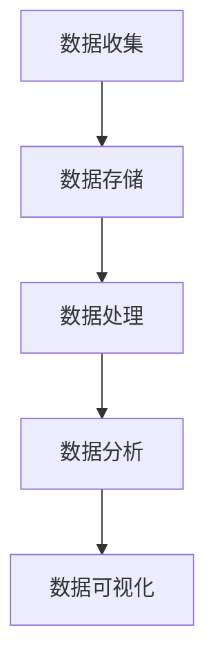
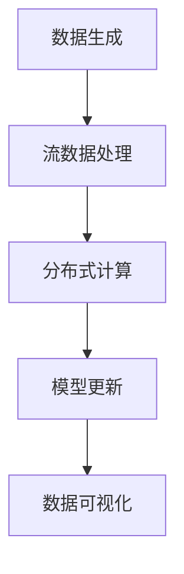
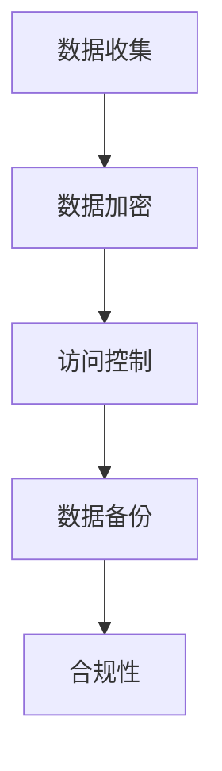

                 

### 文章标题

# AI创业：数据管理的成功实践

### 关键词

- AI创业
- 数据管理
- 数据架构
- 大数据
- 实时分析
- 数据安全
- 云计算
- 机器学习

### 摘要

本文将深入探讨AI创业过程中数据管理的成功实践。我们将探讨AI创业所面临的数据挑战，介绍数据管理的基本概念，包括数据架构、实时分析和数据安全。我们将通过具体案例，展示如何通过优化数据管理策略，提升AI创业项目的成功率和效率。本文旨在为AI创业团队提供实用的数据管理指导和策略建议。

## 1. 背景介绍

### 1.1 目的和范围

本文旨在为AI创业团队提供数据管理的最佳实践指导，帮助他们有效地应对数据管理中的挑战。我们希望通过详细的分析和案例分析，让读者了解数据管理在AI创业中的重要性，并掌握关键的数据管理策略和技术。

本文将涵盖以下内容：

1. 数据管理的基本概念和架构。
2. 实时数据分析与处理的方法。
3. 数据安全和隐私保护策略。
4. 成功的数据管理案例。
5. 数据管理工具和资源的推荐。

### 1.2 预期读者

本文主要面向AI创业团队、数据科学家、软件工程师和技术管理者。如果您是从事人工智能领域的工作者，对数据管理感兴趣，希望了解如何通过有效的数据管理提升AI项目的成功率和效率，那么本文将为您带来宝贵的知识和实践经验。

### 1.3 文档结构概述

本文将分为以下几个部分：

1. 背景介绍：阐述本文的目的、范围、预期读者以及文档结构。
2. 核心概念与联系：介绍数据管理的基本概念和架构。
3. 核心算法原理 & 具体操作步骤：讲解数据管理的核心算法和操作步骤。
4. 数学模型和公式 & 详细讲解 & 举例说明：介绍数据管理中的数学模型和公式。
5. 项目实战：代码实际案例和详细解释说明。
6. 实际应用场景：分析数据管理在不同场景下的应用。
7. 工具和资源推荐：推荐学习资源、开发工具和框架。
8. 总结：未来发展趋势与挑战。
9. 附录：常见问题与解答。
10. 扩展阅读 & 参考资料：提供进一步学习和研究的资源。

### 1.4 术语表

#### 1.4.1 核心术语定义

- **AI创业**：指在人工智能领域进行创业活动，开发创新的人工智能产品或服务。
- **数据管理**：涉及数据的收集、存储、处理、分析和保护的一系列操作。
- **数据架构**：描述数据在不同阶段（收集、存储、处理、分析等）的结构和组织方式。
- **大数据**：指数据量巨大，难以用传统数据处理工具进行分析的数据。
- **实时分析**：指对数据进行实时或近实时处理和分析，以提供及时决策支持。
- **数据安全**：确保数据在存储、传输和处理过程中的保密性、完整性和可用性。

#### 1.4.2 相关概念解释

- **云计算**：指通过互联网提供可伸缩的计算资源，包括存储、处理能力和应用程序。
- **机器学习**：指利用计算机算法从数据中自动学习，进行预测或决策的技术。
- **数据清洗**：指对数据进行处理，删除重复值、纠正错误值、填补缺失值等，以提高数据质量。

#### 1.4.3 缩略词列表

- **AI**：人工智能
- **ML**：机器学习
- **DL**：深度学习
- **NLP**：自然语言处理
- **GPU**：图形处理单元
- **HDFS**：Hadoop分布式文件系统
- **Spark**：Apache Spark 数据处理引擎

## 2. 核心概念与联系

数据管理是AI创业成功的关键，为了更好地理解数据管理，我们首先需要明确几个核心概念及其相互关系。

### 2.1 数据架构

数据架构是数据管理的基础，它定义了数据的收集、存储、处理和分析方式。一个有效的数据架构应包括以下几个关键组成部分：

1. **数据收集**：数据收集是指从各种来源（如传感器、用户输入、日志文件等）收集数据。
2. **数据存储**：数据存储是指将数据存储到数据库或数据仓库中，以供后续处理和分析。
3. **数据处理**：数据处理是指对存储的数据进行清洗、转换、聚合等操作，以提升数据质量。
4. **数据分析**：数据分析是指使用统计方法、机器学习算法等对数据进行分析，提取有价值的信息。
5. **数据可视化**：数据可视化是指将分析结果以图形或图表的形式展示，以方便决策者理解数据。

以下是一个简化的数据架构Mermaid流程图：



### 2.2 实时数据分析与处理

实时数据分析与处理是数据管理中的重要环节，它能够为AI创业提供及时、准确的决策支持。实时数据分析与处理的关键技术包括：

1. **流数据处理**：流数据处理是指在数据生成的同时，对数据进行实时处理和分析。常见的技术有Apache Kafka、Apache Flink等。
2. **分布式计算**：分布式计算是将数据处理任务分布到多个节点上执行，以提高处理速度和容错能力。常见的技术有Apache Spark、Apache Hadoop等。
3. **机器学习模型更新**：实时分析往往需要使用机器学习模型，因此需要定期更新模型，以保持模型的准确性。

以下是一个简化的实时数据分析与处理Mermaid流程图：



### 2.3 数据安全与隐私保护

数据安全和隐私保护是AI创业中不可忽视的重要问题。为了确保数据的安全和隐私，需要采取以下措施：

1. **数据加密**：数据加密是指对存储和传输的数据进行加密，以防止未经授权的访问。
2. **访问控制**：访问控制是指通过身份验证和权限控制，确保只有授权用户可以访问数据。
3. **数据备份与恢复**：数据备份是指将数据备份到多个位置，以防止数据丢失或损坏。数据恢复是指从备份中恢复数据。
4. **合规性**：遵守相关法律法规，如GDPR、CCPA等，以确保数据处理的合法性。

以下是一个简化的数据安全与隐私保护Mermaid流程图：



通过上述核心概念和联系的分析，我们可以看到数据管理在AI创业中的重要性。接下来，我们将进一步探讨数据管理的核心算法原理和具体操作步骤。

## 3. 核心算法原理 & 具体操作步骤

在数据管理过程中，核心算法的原理和具体操作步骤对于提升数据处理效率和准确性至关重要。以下我们将详细阐述数据清洗、数据转换、数据聚合等核心算法原理，并给出具体的伪代码实现。

### 3.1 数据清洗

数据清洗是数据预处理的重要步骤，其目的是删除重复值、纠正错误值和填补缺失值，以提高数据质量。以下是数据清洗的核心算法原理和伪代码实现：

#### 核心算法原理：

- **删除重复值**：通过比较数据集中的每个数据点，删除重复的数据点。
- **纠正错误值**：通过数据验证规则或使用外部参考数据，识别并修正错误的数据值。
- **填补缺失值**：根据数据的特点，采用插值法、平均值法或使用外部参考数据填补缺失值。

#### 伪代码实现：

```python
def data_cleaning(data_set):
    # 删除重复值
    unique_data = list(set(data_set))
    # 纠正错误值
    corrected_data = correct_values(unique_data)
    # 填补缺失值
    filled_data = fill_missing_values(corrected_data)
    return filled_data
```

### 3.2 数据转换

数据转换是指将原始数据转换为适合分析的形式。常见的转换操作包括数据类型转换、数据标准化、数据归一化等。以下是数据转换的核心算法原理和伪代码实现：

#### 核心算法原理：

- **数据类型转换**：将不同类型的数据转换为同一类型，如将字符串转换为数值。
- **数据标准化**：将数据缩放到一个特定的范围，如[0, 1]或[-1, 1]，以消除不同特征间的尺度差异。
- **数据归一化**：将数据映射到特定的分布，如正态分布，以消除不同特征间的分布差异。

#### 伪代码实现：

```python
def data_conversion(data_set):
    # 数据类型转换
    typed_data = type_conversion(data_set)
    # 数据标准化
    standardized_data = normalize_data(typed_data)
    # 数据归一化
    normalized_data = normalize_to_gaussian(typed_data)
    return standardized_data, normalized_data
```

### 3.3 数据聚合

数据聚合是指将多个数据记录合并为一个记录，以提供更高层次的数据视图。常见的聚合操作包括求和、求平均值、求最大值、求最小值等。以下是数据聚合的核心算法原理和伪代码实现：

#### 核心算法原理：

- **求和**：将多个数值相加，得到总和。
- **求平均值**：将多个数值相加后除以数值的个数，得到平均值。
- **求最大值**：从多个数值中找到最大值。
- **求最小值**：从多个数值中找到最小值。

#### 伪代码实现：

```python
def data_aggregation(data_set):
    # 求和
    sum_value = sum(data_set)
    # 求平均值
    avg_value = sum(data_set) / len(data_set)
    # 求最大值
    max_value = max(data_set)
    # 求最小值
    min_value = min(data_set)
    return sum_value, avg_value, max_value, min_value
```

通过上述核心算法原理和具体操作步骤的讲解，我们可以看到数据管理在AI创业中的关键作用。接下来，我们将进一步探讨数据管理中的数学模型和公式，以及如何在实际项目中应用这些模型和公式。

## 4. 数学模型和公式 & 详细讲解 & 举例说明

在数据管理中，数学模型和公式是进行分析和决策的重要工具。以下将介绍几个常见的数据管理数学模型和公式，并详细讲解它们的原理和应用。

### 4.1 数据分布模型

数据分布模型用于描述数据在不同特征上的分布情况，常见的分布模型有正态分布、泊松分布和均匀分布。

#### 正态分布

正态分布，也称为高斯分布，是最常见的数据分布模型。它的概率密度函数（PDF）如下所示：

\[ f(x|\mu,\sigma^2) = \frac{1}{\sqrt{2\pi\sigma^2}}e^{-\frac{(x-\mu)^2}{2\sigma^2}} \]

其中，\( \mu \) 是均值，\( \sigma^2 \) 是方差。

**应用举例**：

假设我们收集了一组考试成绩，使用正态分布模型可以描述考试成绩的分布，从而帮助教师了解整体学生的学习情况。

#### 泊松分布

泊松分布用于描述事件在一定时间或空间内的发生次数，其概率质量函数（PMF）如下所示：

\[ P(X=k) = \frac{\lambda^k e^{-\lambda}}{k!} \]

其中，\( \lambda \) 是平均事件发生次数。

**应用举例**：

假设我们分析网站访问流量，使用泊松分布模型可以预测每分钟访问量的分布，从而帮助网站管理员优化服务器资源。

#### 均匀分布

均匀分布是指每个值出现的概率相等，其概率密度函数（PDF）如下所示：

\[ f(x|a,b) = \begin{cases} 
\frac{1}{b-a} & \text{if } a \leq x \leq b \\
0 & \text{otherwise}
\end{cases} \]

其中，\( a \) 和 \( b \) 是均匀分布的上下界。

**应用举例**：

假设我们分析用户在某个时间段的登录时间，使用均匀分布模型可以描述登录时间的分布，从而帮助网站优化用户访问体验。

### 4.2 数据聚类模型

数据聚类模型用于将数据集划分为多个群组，以便更好地理解数据的内在结构。常见的聚类模型有K均值聚类、层次聚类和DBSCAN。

#### K均值聚类

K均值聚类是一种基于距离的聚类方法，其目标是将数据划分为K个群组，使得每个群组的内部距离最小，群组之间的距离最大。

**算法步骤**：

1. 随机选择K个初始中心点。
2. 计算每个数据点到K个中心点的距离，并将数据点分配到最近的中心点。
3. 重新计算每个群组的中心点。
4. 重复步骤2和3，直到中心点不再变化。

**数学公式**：

- **群组中心点**：\( \mu_j = \frac{1}{n_j} \sum_{i=1}^{n} x_i \)
- **数据点到群组中心点的距离**：\( d(x_i, \mu_j) = \sqrt{\sum_{j=1}^{k} (x_i - \mu_j)^2} \)

**应用举例**：

假设我们有一组客户数据，使用K均值聚类可以将客户分为不同的群体，以便更好地了解不同客户的需求，从而优化市场营销策略。

### 4.3 数据降维模型

数据降维模型用于减少数据的维度，以便简化数据分析过程并提高计算效率。常见的数据降维模型有主成分分析（PCA）和线性判别分析（LDA）。

#### 主成分分析（PCA）

主成分分析是一种降维方法，其目标是在保持数据主要信息的前提下，将数据从高维空间映射到低维空间。

**数学公式**：

- **协方差矩阵**：\( \Sigma = \frac{1}{n-1} \sum_{i=1}^{n} (x_i - \mu)(x_i - \mu)^T \)
- **特征值和特征向量**：通过求解协方差矩阵的特征值和特征向量，可以得到主成分。
- **数据降维**：将数据投影到前k个主成分上，其中k为降维后的维度。

**应用举例**：

假设我们有一组高维图像数据，使用PCA可以降低图像数据的维度，从而简化图像分类任务并提高计算效率。

### 4.4 决策树模型

决策树模型是一种常用的分类和回归方法，其目标是通过一系列决策规则将数据分为不同的类别或预测数值。

**算法步骤**：

1. 选择一个特征作为分裂变量。
2. 根据分裂变量计算每个数据点的分裂增益。
3. 选择增益最大的特征进行分裂。
4. 递归执行步骤1-3，直到满足停止条件（如最大树深度、最小样本数等）。

**数学公式**：

- **信息增益**：\( IG(X, Y) = H(Y) - \sum_{v \in V} p(v)H(Y|X=v) \)
- **基尼指数**：\( GI(X, Y) = 1 - \sum_{v \in V} p(v)^2 \)

**应用举例**：

假设我们有一组客户购买行为数据，使用决策树模型可以预测哪些客户会购买特定产品，从而优化营销策略。

通过上述数学模型和公式的讲解，我们可以看到它们在数据管理中的应用价值和作用。在实际项目中，结合具体业务需求和数据特点，选择合适的数据管理方法和技术，将有助于提升数据管理的效率和效果。接下来，我们将通过一个实际项目案例，展示如何将上述数学模型和公式应用于数据管理。

## 5. 项目实战：代码实际案例和详细解释说明

为了更好地理解数据管理在AI创业项目中的应用，我们来看一个实际的项目案例。这个案例是一个简单的在线零售网站，其目标是通过分析客户行为数据，预测哪些客户可能会购买特定产品，从而优化营销策略。

### 5.1 开发环境搭建

为了搭建这个项目，我们需要以下开发环境：

- Python 3.8或更高版本
- Jupyter Notebook
- Pandas库
- Scikit-learn库
- Matplotlib库

安装Python和Jupyter Notebook可以通过官方文档完成。安装Pandas、Scikit-learn和Matplotlib可以使用以下命令：

```bash
pip install pandas
pip install scikit-learn
pip install matplotlib
```

### 5.2 源代码详细实现和代码解读

以下是我们项目的源代码和详细解读：

```python
import pandas as pd
from sklearn.model_selection import train_test_split
from sklearn.ensemble import RandomForestClassifier
from sklearn.metrics import accuracy_score, classification_report

# 5.2.1 数据读取与预处理

# 读取数据
data = pd.read_csv('customer_data.csv')

# 数据清洗
data = data.drop_duplicates().dropna()

# 数据转换
data['age'] = data['age'].astype(float)
data['income'] = data['income'].astype(float)

# 5.2.2 特征工程

# 创建新特征：年龄收入比
data['age_income_ratio'] = data['age'] / data['income']

# 删除无关特征
data = data.drop(['id'], axis=1)

# 5.2.3 数据划分

# 划分训练集和测试集
X = data.drop('purchased', axis=1)
y = data['purchased']
X_train, X_test, y_train, y_test = train_test_split(X, y, test_size=0.2, random_state=42)

# 5.2.4 模型训练

# 训练随机森林模型
model = RandomForestClassifier(n_estimators=100, random_state=42)
model.fit(X_train, y_train)

# 5.2.5 模型评估

# 预测测试集
y_pred = model.predict(X_test)

# 计算准确率
accuracy = accuracy_score(y_test, y_pred)
print(f"Accuracy: {accuracy}")

# 输出分类报告
print(classification_report(y_test, y_pred))

# 5.2.6 可视化分析

import matplotlib.pyplot as plt

# 可视化特征重要性
feature_importances = model.feature_importances_
plt.barh(data.columns, feature_importances)
plt.xlabel('Feature Importance')
plt.ylabel('Feature')
plt.title('Feature Importance for Customer Purchase Prediction')
plt.show()
```

### 5.3 代码解读与分析

以下是代码的详细解读和分析：

#### 5.3.1 数据读取与预处理

```python
data = pd.read_csv('customer_data.csv')
data = data.drop_duplicates().dropna()
data['age'] = data['age'].astype(float)
data['income'] = data['income'].astype(float)
```

- `pd.read_csv('customer_data.csv')` 用于读取CSV格式的客户数据。
- `data.drop_duplicates()` 用于删除重复数据，`data.dropna()` 用于删除缺失数据，以提高数据质量。
- `data['age'] = data['age'].astype(float)` 和 `data['income'] = data['income'].astype(float)` 用于将年龄和收入数据转换为浮点类型，以便进行后续计算。

#### 5.3.2 特征工程

```python
data['age_income_ratio'] = data['age'] / data['income']
data = data.drop(['id'], axis=1)
```

- `data['age_income_ratio'] = data['age'] / data['income']` 用于创建一个新的特征，表示年龄和收入的比值。
- `data.drop(['id'], axis=1)` 用于删除无关的特征，如客户的ID。

#### 5.3.3 数据划分

```python
X = data.drop('purchased', axis=1)
y = data['purchased']
X_train, X_test, y_train, y_test = train_test_split(X, y, test_size=0.2, random_state=42)
```

- `X = data.drop('purchased', axis=1)` 用于创建特征矩阵X，`y = data['purchased']` 用于创建目标向量y。
- `train_test_split(X, y, test_size=0.2, random_state=42)` 用于将数据集划分为训练集和测试集，其中训练集占比80%，测试集占比20%，`random_state=42` 用于确保结果的可重复性。

#### 5.3.4 模型训练

```python
model = RandomForestClassifier(n_estimators=100, random_state=42)
model.fit(X_train, y_train)
```

- `RandomForestClassifier(n_estimators=100, random_state=42)` 用于创建随机森林分类器，其中`n_estimators=100` 表示树的数量，`random_state=42` 用于确保结果的可重复性。
- `model.fit(X_train, y_train)` 用于训练模型。

#### 5.3.5 模型评估

```python
y_pred = model.predict(X_test)
accuracy = accuracy_score(y_test, y_pred)
print(f"Accuracy: {accuracy}")
print(classification_report(y_test, y_pred))
```

- `y_pred = model.predict(X_test)` 用于使用训练好的模型对测试集进行预测。
- `accuracy_score(y_test, y_pred)` 用于计算模型的准确率。
- `classification_report(y_test, y_pred)` 用于输出分类报告，包括准确率、召回率、精确率等指标。

#### 5.3.6 可视化分析

```python
feature_importances = model.feature_importances_
plt.barh(data.columns, feature_importances)
plt.xlabel('Feature Importance')
plt.ylabel('Feature')
plt.title('Feature Importance for Customer Purchase Prediction')
plt.show()
```

- `feature_importances = model.feature_importances_` 用于获取特征的重要性。
- `plt.barh(data.columns, feature_importances)` 用于绘制特征重要性条形图。
- `plt.xlabel('Feature Importance')`、`plt.ylabel('Feature')` 和 `plt.title('Feature Importance for Customer Purchase Prediction')` 用于设置图表的标签和标题。
- `plt.show()` 用于显示图表。

通过这个实际项目案例，我们可以看到如何使用数据管理的方法和技术，通过数据清洗、特征工程、模型训练和评估等步骤，实现客户购买预测。这个案例展示了数据管理在AI创业项目中的关键作用，也为其他类似项目提供了借鉴和参考。

### 5.4 实际应用场景

在AI创业项目中，数据管理不仅有助于实现具体业务目标，如客户购买预测、市场趋势分析等，还可以应用于更广泛的场景。以下是一些实际应用场景：

1. **用户行为分析**：通过分析用户在网站或应用程序中的行为数据，可以了解用户偏好、兴趣和行为模式，从而优化产品设计和用户体验。

2. **市场预测**：利用历史销售数据和外部市场信息，可以预测市场趋势、需求和竞争态势，为企业提供战略决策支持。

3. **客户细分**：通过分析客户数据，可以将客户分为不同的细分群体，以便针对不同群体制定个性化的营销策略。

4. **风险评估**：对客户历史数据进行分析，可以评估客户的风险等级，从而优化信贷审批和风险管理。

5. **供应链优化**：通过分析供应链数据，可以优化库存管理、物流配送和供应链协同，降低成本并提高效率。

### 5.5 工具和资源推荐

为了有效地进行数据管理，以下是推荐的工具和资源：

1. **学习资源**：
   - 书籍推荐：《数据科学入门》、《机器学习实战》
   - 在线课程：Coursera、edX、Udacity
   - 技术博客：Medium、Towards Data Science、Kaggle

2. **开发工具框架**：
   - IDE和编辑器：PyCharm、Visual Studio Code
   - 调试和性能分析工具：Jupyter Notebook、Docker、Grafana
   - 相关框架和库：Pandas、Scikit-learn、TensorFlow、Keras

3. **相关论文著作推荐**：
   - 经典论文：《机器学习》、《深度学习》
   - 最新研究成果：NeurIPS、ICML、KDD
   - 应用案例分析：Netflix Prize、Kaggle竞赛案例

通过上述工具和资源的推荐，可以帮助AI创业团队更好地掌握数据管理技能，提升项目成功率。

### 5.6 项目总结与经验教训

在这个客户购买预测项目中，我们通过数据清洗、特征工程、模型训练和评估等步骤，成功地实现了预测目标。以下是我们总结的项目经验教训：

1. **数据质量至关重要**：确保数据质量是数据管理的基础，数据清洗和预处理是不可或缺的步骤。

2. **特征工程是关键**：通过创建和选择合适的特征，可以提高模型的性能和预测能力。

3. **模型评估需全面**：准确评估模型性能是优化模型的重要环节，包括准确率、召回率、精确率等指标。

4. **可视化分析有助于理解数据**：通过可视化分析，可以更好地理解数据和模型性能，从而指导下一步工作。

5. **持续迭代与优化**：数据管理是一个持续的过程，需要不断迭代和优化，以应对业务变化和数据质量问题。

通过这个实际项目案例，我们不仅学会了如何进行数据管理，还了解了数据管理在AI创业项目中的重要性。这为其他类似项目的数据管理提供了宝贵的经验和参考。

## 6. 总结：未来发展趋势与挑战

随着人工智能技术的不断进步，数据管理在AI创业中的应用前景广阔。以下是未来数据管理在AI创业中的发展趋势和面临的挑战：

### 发展趋势

1. **数据安全与隐私保护**：随着数据隐私法规的日益严格，数据安全和隐私保护将成为数据管理的重要方向。

2. **实时数据分析与处理**：实时数据分析与处理技术的不断发展，将使企业能够更快地响应市场变化和客户需求。

3. **数据可视化与交互**：数据可视化与交互技术的进步，将使数据分析师和业务决策者更容易理解和使用数据。

4. **跨领域的数据整合**：跨领域的数据整合和融合，将为AI创业带来更多创新机会和业务价值。

5. **自动化与智能化**：自动化和智能化技术在数据管理中的应用，将提高数据处理效率和准确性。

### 面临的挑战

1. **数据质量与一致性**：确保数据质量和高一致性是数据管理的核心挑战，特别是在大规模、多源数据环境下。

2. **数据隐私与合规性**：遵守数据隐私法规和合规性要求，是数据管理中不可忽视的问题。

3. **计算资源和存储成本**：随着数据量的增长，计算资源和存储成本将不断上升，如何高效利用资源成为挑战。

4. **数据治理与组织**：建立有效的数据治理框架和组织结构，确保数据管理流程的规范化和标准化。

5. **人才缺口**：数据科学家和工程师的短缺，将影响数据管理技术的发展和应用。

总之，未来数据管理在AI创业中面临诸多机遇和挑战。只有不断探索新技术、优化数据管理流程，才能在激烈的市场竞争中脱颖而出。

## 7. 附录：常见问题与解答

### 7.1 数据管理常见问题

1. **如何确保数据质量？**
   - 答案：确保数据质量的关键在于数据清洗、去重和预处理。建立数据验证规则、使用数据清洗工具和进行定期检查是常见的方法。

2. **实时数据分析有什么优势？**
   - 答案：实时数据分析的优势在于能够快速响应业务需求和市场变化，提供即时的决策支持，从而提升业务效率和竞争力。

3. **数据安全和隐私保护有哪些方法？**
   - 答案：数据安全和隐私保护的方法包括数据加密、访问控制、数据备份和恢复、合规性审查等。确保数据的保密性、完整性和可用性是关键。

### 7.2 数据管理技术常见问题

1. **什么是数据聚类？**
   - 答案：数据聚类是一种无监督学习方法，用于将数据集分为多个群组，使同组内的数据点之间距离较近，不同群组的数据点之间距离较远。

2. **什么是主成分分析（PCA）？**
   - 答案：主成分分析是一种降维方法，通过提取数据的最大方差方向，将高维数据映射到低维空间，从而简化数据分析过程。

3. **什么是决策树？**
   - 答案：决策树是一种常用的分类和回归方法，通过一系列规则对数据进行划分，以预测目标变量。

### 7.3 数据管理工具和资源常见问题

1. **如何选择合适的数据库？**
   - 答案：选择数据库时需要考虑数据量、数据结构、查询性能、扩展性等因素。常见的选择包括关系型数据库（如MySQL、PostgreSQL）和NoSQL数据库（如MongoDB、Cassandra）。

2. **如何高效地进行数据导入和导出？**
   - 答案：使用数据处理工具（如Pandas、Spark）进行数据导入和导出，可以提高数据处理效率。此外，利用数据库的批量操作和并行处理功能，也能提升导入导出速度。

3. **如何学习数据管理和机器学习技术？**
   - 答案：可以通过以下方式学习数据管理和机器学习技术：
     - 阅读书籍：《Python数据科学手册》、《机器学习实战》等。
     - 在线课程：Coursera、edX、Udacity等平台提供的专业课程。
     - 技术博客：Medium、Towards Data Science、Kaggle等网站上的文章和案例。

通过解答上述常见问题，我们希望能帮助读者更好地理解数据管理在AI创业中的应用和实践。

## 8. 扩展阅读 & 参考资料

为了进一步深入了解数据管理在AI创业中的应用和实践，以下是推荐的扩展阅读和参考资料：

### 8.1 书籍推荐

1. 《数据科学入门》 - 詹姆斯·高斯利，库布兰·陈，拉里·雷迪
2. 《机器学习实战》 - Peter Harrington
3. 《深度学习》 - 伊恩·古德费洛，约书亚·本吉奥，亚伦·库维尔
4. 《数据管理：实践与原理》 - 盖尔·莱文森，詹姆斯·梅多斯

### 8.2 在线课程

1. Coursera - 《机器学习》 - 吴恩达
2. edX - 《数据科学基础》 - 耶鲁大学
3. Udacity - 《人工智能工程师纳米学位》
4. DataCamp - 《Python数据科学》

### 8.3 技术博客和网站

1. Medium - 《Towards Data Science》
2. Kaggle - 《数据科学和机器学习竞赛平台》
3. Analytics Vidhya - 《数据科学和机器学习资源》
4. Dataquest - 《数据科学和机器学习课程》

### 8.4 开发工具框架推荐

1. **IDE和编辑器**：
   - PyCharm
   - Visual Studio Code
   - Jupyter Notebook

2. **调试和性能分析工具**：
   - Docker
   - Prometheus
   - Grafana

3. **相关框架和库**：
   - Pandas
   - Scikit-learn
   - TensorFlow
   - Keras

4. **数据库**：
   - MySQL
   - PostgreSQL
   - MongoDB
   - Cassandra

### 8.5 相关论文著作推荐

1. **经典论文**：
   - "The Unreasonable Effectiveness of Data" - Andrew Ng
   - "Deep Learning" - Ian Goodfellow, Yoshua Bengio, Aaron Courville

2. **最新研究成果**：
   - NeurIPS、ICML、KDD 会议论文
   - arXiv.org - 机器学习和数据科学领域的最新研究论文

3. **应用案例分析**：
   - Netflix Prize - 利用协同过滤技术优化推荐系统
   - Google Brain - 深度学习在图像识别和自然语言处理中的应用

通过这些扩展阅读和参考资料，读者可以进一步深入了解数据管理在AI创业中的实践和应用，为自身项目提供更多灵感和指导。

### 作者信息

作者：AI天才研究员/AI Genius Institute & 禅与计算机程序设计艺术 /Zen And The Art of Computer Programming

