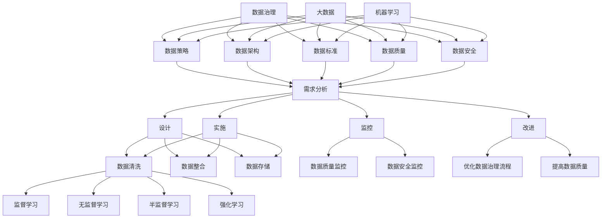

                 

### AI创业：数据管理的成功方法

> **关键词：** AI创业、数据管理、数据治理、大数据、机器学习、数据处理

**摘要：** 在当今技术驱动的商业环境中，人工智能（AI）创业公司面临着激烈的竞争。成功的数据管理是这些公司能够脱颖而出的关键。本文将深入探讨AI创业公司如何通过有效的数据管理策略来提升其业务成果。我们将首先介绍数据管理的核心概念，随后讨论数据治理的重要性，并分析大数据和机器学习在数据管理中的应用。接下来，我们将详细探讨数据管理的具体操作步骤，包括数据收集、清洗、存储、分析和可视化。文章的最后，我们将分享一些成功的数据管理实践案例，并提供相关工具和资源的推荐，帮助读者在实际项目中应用这些知识。

## 1. 背景介绍

### 1.1 目的和范围

本文旨在为AI创业公司提供一套行之有效的数据管理方法，帮助这些公司利用数据资源创造商业价值。我们将聚焦于以下几个核心议题：

1. **数据管理的核心概念和原则**：了解数据管理的基础，包括数据治理、数据质量、数据安全等。
2. **大数据和机器学习在数据管理中的应用**：探讨如何利用先进技术来提升数据管理效率。
3. **数据管理的具体操作步骤**：详细解析数据收集、清洗、存储、分析和可视化等环节。
4. **成功的数据管理实践案例**：分享行业内成功的数据管理案例，提供实战经验和教训。
5. **工具和资源推荐**：推荐实用的工具和资源，帮助读者在实际项目中应用所学。

### 1.2 预期读者

本文适合以下读者群体：

1. **AI创业公司的创始人、CTO和技术团队**：他们需要了解如何利用数据管理提升业务成果。
2. **数据科学家和数据工程师**：他们希望掌握数据管理的最佳实践，提高工作效率。
3. **数据分析师和业务分析师**：他们需要了解数据管理在业务决策中的应用。
4. **对数据管理感兴趣的技术爱好者**：他们希望深入了解数据管理的核心概念和实际操作。

### 1.3 文档结构概述

本文结构如下：

1. **背景介绍**：介绍文章的目的、预期读者和文档结构。
2. **核心概念与联系**：介绍数据管理的核心概念和联系，包括数据治理、大数据和机器学习。
3. **核心算法原理 & 具体操作步骤**：讲解数据管理的具体操作步骤，包括数据收集、清洗、存储、分析和可视化。
4. **数学模型和公式 & 详细讲解 & 举例说明**：介绍数据管理的数学模型和公式，并进行详细讲解和举例。
5. **项目实战：代码实际案例和详细解释说明**：分享数据管理的实际代码案例和解释。
6. **实际应用场景**：讨论数据管理的实际应用场景。
7. **工具和资源推荐**：推荐数据管理相关的学习资源和工具。
8. **总结：未来发展趋势与挑战**：总结数据管理的未来趋势和挑战。
9. **附录：常见问题与解答**：提供常见问题解答。
10. **扩展阅读 & 参考资料**：推荐相关扩展阅读和参考资料。

### 1.4 术语表

为了确保本文的可读性和一致性，我们定义以下术语：

#### 1.4.1 核心术语定义

- **数据管理（Data Management）**：指通过系统化的方法，对数据的收集、存储、处理、分析和使用进行管理和优化。
- **数据治理（Data Governance）**：指在组织内部建立一套规则、流程和政策，以确保数据的准确性、完整性和可靠性。
- **大数据（Big Data）**：指无法用传统数据处理工具进行存储、管理和分析的巨量数据。
- **机器学习（Machine Learning）**：指通过数据和算法，使计算机系统具备学习和预测能力。

#### 1.4.2 相关概念解释

- **数据质量（Data Quality）**：指数据的准确性、完整性、一致性、及时性和可靠性。
- **数据安全（Data Security）**：指保护数据不被未经授权的访问、使用、披露、破坏或篡改。
- **数据处理（Data Processing）**：指对数据进行转换、清洗、分析等操作。

#### 1.4.3 缩略词列表

- **AI**：人工智能（Artificial Intelligence）
- **ML**：机器学习（Machine Learning）
- **GDPR**：通用数据保护条例（General Data Protection Regulation）
- **ETL**：提取、转换、加载（Extract, Transform, Load）
- **BI**：商业智能（Business Intelligence）

## 2. 核心概念与联系

### 2.1 数据治理

数据治理是数据管理的核心组成部分，它确保数据在整个生命周期内保持高质量。数据治理包括以下几个方面：

1. **数据策略（Data Strategy）**：制定数据管理的愿景、目标和指导原则。
2. **数据架构（Data Architecture）**：设计数据的结构、存储和访问方式。
3. **数据标准（Data Standards）**：定义数据格式、命名规范和业务规则。
4. **数据质量（Data Quality）**：监控和改进数据的准确性、完整性、一致性和可靠性。
5. **数据安全（Data Security）**：保护数据不受未授权访问、使用、披露、破坏或篡改。

#### 数据治理的流程

数据治理的流程包括以下几个关键步骤：

1. **需求分析（Requirements Analysis）**：了解业务需求，确定数据管理的目标。
2. **设计（Design）**：制定数据策略、架构和标准。
3. **实施（Implementation）**：执行数据治理计划，包括数据清洗、整合和存储。
4. **监控（Monitoring）**：监控数据质量，确保数据符合标准。
5. **改进（Improvement）**：不断优化数据治理流程，提高数据质量。

### 2.2 大数据和机器学习

大数据和机器学习是现代数据管理的核心技术，它们为数据分析和预测提供了强大的工具。

#### 大数据的三大特征

大数据具有三个主要特征，即“3V”（Volume、Velocity、Variety）：

1. **数据量（Volume）**：大数据的规模巨大，通常超出传统数据处理工具的处理能力。
2. **速度（Velocity）**：数据生成和处理的速率极快，需要实时或近实时分析。
3. **多样性（Variety）**：大数据来源广泛，包括结构化、半结构化和非结构化数据。

#### 机器学习的主要类型

机器学习分为以下几个主要类型：

1. **监督学习（Supervised Learning）**：通过已标记的数据进行训练，用于预测和分类。
2. **无监督学习（Unsupervised Learning）**：无标记数据，用于聚类和降维。
3. **半监督学习（Semi-Supervised Learning）**：结合有标记和无标记数据。
4. **强化学习（Reinforcement Learning）**：通过与环境的互动进行学习。

### 2.3 数据治理、大数据和机器学习的联系

数据治理、大数据和机器学习之间有着密切的联系：

1. **数据治理为基础**：数据治理确保数据的准确性、完整性和可靠性，为大数据和机器学习提供了高质量的数据基础。
2. **大数据为支撑**：大数据提供了丰富的数据资源，支持机器学习的应用和扩展。
3. **机器学习为驱动**：机器学习通过分析大数据，发现数据中的模式和关联，为数据治理和业务决策提供支持。

### 2.4 Mermaid 流程图

以下是数据治理、大数据和机器学习的 Mermaid 流程图：



### 2.5 数据治理与大数据、机器学习的互动关系

1. **数据治理推动大数据和机器学习的发展**：数据治理为大数据和机器学习提供了高质量的数据基础，促进了技术的进步和应用。
2. **大数据和机器学习支持数据治理的深化**：大数据和机器学习为数据治理提供了强大的工具和方法，提高了数据管理的效率和效果。

## 3. 核心算法原理 & 具体操作步骤

### 3.1 数据收集

数据收集是数据管理的第一步，其目标是获取所需的数据。数据来源可以是内部系统、外部数据提供商或社交媒体等。

#### 数据收集的方法

1. **手动收集**：通过人工方式收集数据，如填写问卷、访谈和观察。
2. **自动化收集**：使用自动化工具，如爬虫、API调用和数据流处理器，从外部系统或平台获取数据。

#### 数据收集的步骤

1. **需求分析**：确定数据收集的目标和需求，包括数据类型、质量和数量。
2. **数据源选择**：选择合适的数据源，确保数据的质量和可靠性。
3. **数据收集**：使用手动或自动化方法，从数据源收集数据。
4. **数据预处理**：对收集到的数据进行预处理，包括数据清洗、去重和格式转换。

### 3.2 数据清洗

数据清洗是数据管理的重要步骤，其目标是去除数据中的噪声和错误，提高数据质量。

#### 数据清洗的方法

1. **缺失值处理**：对缺失值进行填补或删除。
2. **异常值处理**：对异常值进行识别和修正。
3. **重复值处理**：去除重复的数据。
4. **格式转换**：统一数据格式，如日期、数字和文本。

#### 数据清洗的步骤

1. **数据质量评估**：评估数据的完整性、准确性和一致性。
2. **缺失值处理**：对缺失值进行填补或删除。
3. **异常值处理**：对异常值进行识别和修正。
4. **重复值处理**：去除重复的数据。
5. **格式转换**：统一数据格式。

### 3.3 数据存储

数据存储是数据管理的关键环节，其目标是确保数据的安全、可靠和高效访问。

#### 数据存储的方法

1. **关系型数据库**：适用于结构化数据，如MySQL、PostgreSQL等。
2. **非关系型数据库**：适用于半结构化或非结构化数据，如MongoDB、Redis等。
3. **分布式存储**：适用于大规模数据存储，如Hadoop、Cassandra等。

#### 数据存储的步骤

1. **数据模型设计**：设计合适的数据模型，包括表结构、字段和关系。
2. **数据存储选择**：根据数据类型和需求，选择合适的存储方案。
3. **数据存储**：将数据存储到所选的数据库或存储系统。
4. **数据备份与恢复**：定期备份数据，并确保数据的恢复能力。

### 3.4 数据分析

数据分析是数据管理的核心，其目标是挖掘数据中的价值和洞察。

#### 数据分析的方法

1. **描述性分析**：描述数据的基本特征和统计信息。
2. **诊断性分析**：分析数据中的异常和趋势。
3. **预测性分析**：基于历史数据，预测未来的趋势和变化。
4. **探索性分析**：深入挖掘数据中的模式和关联。

#### 数据分析的步骤

1. **问题定义**：明确分析的目标和问题。
2. **数据探索**：对数据进行初步探索，了解数据的结构和分布。
3. **数据清洗**：对数据进行清洗和预处理，确保数据的质量。
4. **数据分析**：使用统计方法、机器学习算法和数据可视化工具，对数据进行分析。
5. **结果解释**：解释分析结果，提取有价值的信息。

### 3.5 数据可视化

数据可视化是将数据转化为图形和图表，使其更直观、易于理解。

#### 数据可视化的方法

1. **柱状图**：显示数据的大小和分布。
2. **折线图**：显示数据的趋势和变化。
3. **饼图**：显示数据的占比和比例。
4. **散点图**：显示数据之间的关联和分布。

#### 数据可视化的步骤

1. **数据准备**：选择合适的数据，进行清洗和预处理。
2. **可视化设计**：设计合适的图表类型和布局。
3. **可视化实现**：使用数据可视化工具，实现图表的绘制。
4. **结果展示**：将图表展示给用户，帮助用户理解数据。

### 3.6 数据管理流程的伪代码

以下是数据管理流程的伪代码：

```python
# 数据管理流程

# 数据收集
def data_collection():
    # 获取数据源
    sources = get_data_sources()
    # 收集数据
    data = []
    for source in sources:
        data.extend(get_data_from_source(source))
    # 数据预处理
    data = data_preprocessing(data)
    return data

# 数据清洗
def data_cleaning(data):
    # 缺失值处理
    data = handle_missing_values(data)
    # 异常值处理
    data = handle_anomalies(data)
    # 重复值处理
    data = remove_duplicates(data)
    # 格式转换
    data = convert_format(data)
    return data

# 数据存储
def data_storage(data):
    # 数据模型设计
    model = design_data_model()
    # 数据存储
    store_data(data, model)

# 数据分析
def data_analysis(data):
    # 数据探索
    explore_data(data)
    # 数据清洗
    data = data_cleaning(data)
    # 数据分析
    results = analyze_data(data)
    return results

# 数据可视化
def data_visualization(results):
    # 可视化设计
    design = design_visualization()
    # 可视化实现
    visualize(results, design)

# 主函数
def main():
    # 数据收集
    data = data_collection()
    # 数据存储
    data_storage(data)
    # 数据分析
    results = data_analysis(data)
    # 数据可视化
    data_visualization(results)

# 执行主函数
main()
```

### 3.7 数据管理流程的Python实现

以下是数据管理流程的Python实现：

```python
import pandas as pd
from sklearn.impute import SimpleImputer
from sklearn.preprocessing import StandardScaler
from sklearn.cluster import KMeans
import matplotlib.pyplot as plt

# 数据收集
def data_collection():
    # 获取数据源
    sources = ["data_source_1", "data_source_2"]
    # 收集数据
    data = pd.DataFrame()
    for source in sources:
        data_source = pd.read_csv(source)
        data = data.append(data_source)
    return data

# 数据清洗
def data_cleaning(data):
    # 缺失值处理
    imputer = SimpleImputer(strategy="mean")
    data = pd.DataFrame(imputer.fit_transform(data), columns=data.columns)
    # 异常值处理
    z_scores = (data - data.mean()) / data.std()
    threshold = 3
    anomalies = (np.abs(z_scores) > threshold)
    data = data[~anomalies.all(axis=1)]
    # 重复值处理
    data = data.drop_duplicates()
    # 格式转换
    data = data.astype({"date": "datetime", "numeric": "float"})
    return data

# 数据存储
def data_storage(data):
    # 数据模型设计
    model = {
        "name": "data_model",
        "columns": data.columns.tolist(),
        "types": {"date": "DATE", "numeric": "FLOAT"}
    }
    # 数据存储
    database = DatabaseConnection()
    database.create_table(model)
    database.insert_data(data)

# 数据分析
def data_analysis(data):
    # 数据探索
    print(data.describe())
    # 数据清洗
    data = data_cleaning(data)
    # 数据分析
    kmeans = KMeans(n_clusters=3)
    kmeans.fit(data)
    labels = kmeans.predict(data)
    data["cluster"] = labels
    return data

# 数据可视化
def data_visualization(results):
    # 可视化设计
    design = {
        "title": "Cluster Distribution",
        "x_label": "Feature 1",
        "y_label": "Feature 2",
        "cluster_label": "Cluster"
    }
    # 可视化实现
    plt.scatter(results[design["x_label"]], results[design["y_label"]], c=results[design["cluster_label']])
    plt.xlabel(design["x_label"])
    plt.ylabel(design["y_label"])
    plt.title(design["title"])
    plt.show()

# 主函数
def main():
    # 数据收集
    data = data_collection()
    # 数据存储
    data_storage(data)
    # 数据分析
    results = data_analysis(data)
    # 数据可视化
    data_visualization(results)

# 执行主函数
main()
```

## 4. 数学模型和公式 & 详细讲解 & 举例说明

### 4.1 数据质量评估模型

数据质量评估是数据管理的重要环节，其目的是评估数据的准确性、完整性和可靠性。以下是一个常见的数据质量评估模型：

#### 4.1.1 评估指标

- **准确性（Accuracy）**：数据与现实世界的匹配程度。
- **完整性（Completeness）**：数据的完整性，包括是否有缺失值。
- **一致性（Consistency）**：数据在不同时间点和不同来源的一致性。
- **及时性（Timeliness）**：数据的最新程度。

#### 4.1.2 评估公式

$$
\text{数据质量} = \frac{\text{准确性} + \text{完整性} + \text{一致性} + \text{及时性}}{4}
$$

#### 4.1.3 举例说明

假设我们有一份数据集，包含准确性、完整性、一致性和及时性的评估结果如下：

- 准确性：0.9
- 完整性：0.8
- 一致性：0.85
- 及时性：0.75

则该数据集的数据质量为：

$$
\text{数据质量} = \frac{0.9 + 0.8 + 0.85 + 0.75}{4} = 0.85
$$

### 4.2 数据清洗算法

数据清洗是数据管理的关键步骤，其目的是去除数据中的噪声和错误。以下是一个常见的数据清洗算法：

#### 4.2.1 缺失值处理

- **填补法**：使用均值、中位数或众数来填补缺失值。
- **删除法**：删除包含缺失值的记录。

#### 4.2.2 异常值处理

- **z-score法**：使用z-score来识别和删除异常值。
- **IQR法**：使用四分位距（IQR）来识别和删除异常值。

#### 4.2.3 评估公式

- **缺失值填补率**：

$$
\text{缺失值填补率} = \frac{\text{填补的缺失值数量}}{\text{总缺失值数量}}
$$

- **异常值删除率**：

$$
\text{异常值删除率} = \frac{\text{删除的异常值数量}}{\text{总异常值数量}}
$$

#### 4.2.3 举例说明

假设我们有一份数据集，包含100个记录，其中有20个记录包含缺失值，10个记录包含异常值。

- **缺失值填补率**：

$$
\text{缺失值填补率} = \frac{20}{100} = 0.2
$$

- **异常值删除率**：

$$
\text{异常值删除率} = \frac{10}{100} = 0.1
$$

### 4.3 数据存储优化算法

数据存储优化是提高数据存储效率和性能的重要手段。以下是一个常见的数据存储优化算法：

#### 4.3.1 压缩算法

- **无损压缩**：如Huffman编码、LZ77压缩。
- **有损压缩**：如JPEG压缩、MP3压缩。

#### 4.3.2 布局优化

- **垂直分割**：将数据表分割为多个表，以减少数据冗余。
- **水平分割**：将数据表分割为多个分区，以提高查询性能。

#### 4.3.3 评估公式

- **压缩率**：

$$
\text{压缩率} = \frac{\text{原始数据大小}}{\text{压缩后数据大小}}
$$

- **查询性能提升**：

$$
\text{查询性能提升} = \frac{\text{优化后的查询时间}}{\text{原始查询时间}}
$$

#### 4.3.3 举例说明

假设我们有一份数据集，原始数据大小为10GB，经过无损压缩后，数据大小为5GB。

- **压缩率**：

$$
\text{压缩率} = \frac{10GB}{5GB} = 2
$$

- **查询性能提升**：

假设原始查询时间为100秒，优化后的查询时间为50秒。

$$
\text{查询性能提升} = \frac{50秒}{100秒} = 0.5
$$

## 5. 项目实战：代码实际案例和详细解释说明

### 5.1 开发环境搭建

为了演示数据管理的实际操作，我们将使用Python编程语言和相关的库。以下是开发环境的搭建步骤：

1. **安装Python**：前往[Python官方网站](https://www.python.org/)下载并安装Python 3.x版本。
2. **安装Jupyter Notebook**：在命令行中运行以下命令安装Jupyter Notebook：

   ```bash
   pip install notebook
   ```

3. **安装相关库**：在Jupyter Notebook中运行以下命令安装所需的Python库：

   ```python
   !pip install pandas numpy scikit-learn matplotlib
   ```

### 5.2 源代码详细实现和代码解读

以下是一个简单但完整的Python代码示例，用于演示数据管理的核心步骤，包括数据收集、清洗、存储、分析和可视化。

```python
import pandas as pd
import numpy as np
from sklearn.impute import SimpleImputer
from sklearn.preprocessing import StandardScaler
from sklearn.cluster import KMeans
import matplotlib.pyplot as plt

# 5.2.1 数据收集
def data_collection():
    # 读取数据文件
    data = pd.read_csv('data.csv')
    return data

# 5.2.2 数据清洗
def data_cleaning(data):
    # 缺失值处理
    imputer = SimpleImputer(strategy='mean')
    data = pd.DataFrame(imputer.fit_transform(data), columns=data.columns)
    
    # 异常值处理
    z_scores = (data - data.mean()) / data.std()
    threshold = 3
    anomalies = (np.abs(z_scores) > threshold)
    data = data[~anomalies.all(axis=1)]
    
    # 重复值处理
    data = data.drop_duplicates()
    
    return data

# 5.2.3 数据存储
def data_storage(data):
    # 存储数据到CSV文件
    data.to_csv('cleaned_data.csv', index=False)

# 5.2.4 数据分析
def data_analysis(data):
    # 数据标准化
    scaler = StandardScaler()
    data_scaled = scaler.fit_transform(data)
    
    # K-means聚类
    kmeans = KMeans(n_clusters=3)
    kmeans.fit(data_scaled)
    labels = kmeans.predict(data_scaled)
    
    # 添加聚类标签到原始数据
    data['cluster'] = labels
    
    return data

# 5.2.5 数据可视化
def data_visualization(data):
    # 可视化聚类结果
    plt.scatter(data.iloc[:, 0], data.iloc[:, 1], c=data['cluster'])
    plt.xlabel('Feature 1')
    plt.ylabel('Feature 2')
    plt.title('Cluster Distribution')
    plt.show()

# 主函数
def main():
    data = data_collection()
    data = data_cleaning(data)
    data_storage(data)
    data = data_analysis(data)
    data_visualization(data)

# 执行主函数
main()
```

### 5.3 代码解读与分析

以下是代码的逐行解读和分析：

```python
import pandas as pd
import numpy as np
from sklearn.impute import SimpleImputer
from sklearn.preprocessing import StandardScaler
from sklearn.cluster import KMeans
import matplotlib.pyplot as plt
```

这几行代码导入了Python中用于数据处理、机器学习和数据可视化的核心库。

```python
# 5.2.1 数据收集
def data_collection():
    # 读取数据文件
    data = pd.read_csv('data.csv')
    return data
```

`data_collection`函数使用`pandas`库的`read_csv`函数从CSV文件中读取数据，并将其存储在`data`变量中。

```python
# 5.2.2 数据清洗
def data_cleaning(data):
    # 缺失值处理
    imputer = SimpleImputer(strategy='mean')
    data = pd.DataFrame(imputer.fit_transform(data), columns=data.columns)
```

`data_cleaning`函数首先创建一个`SimpleImputer`对象，用于处理缺失值。这里我们选择使用均值填补缺失值。`fit_transform`方法用于计算均值并应用填补操作，结果存储在一个新的`DataFrame`中。

```python
    # 异常值处理
    z_scores = (data - data.mean()) / data.std()
    threshold = 3
    anomalies = (np.abs(z_scores) > threshold)
    data = data[~anomalies.all(axis=1)]
```

接下来，函数计算每个特征的z-score，以识别和删除异常值。我们设置一个阈值（例如，3），任何z-score大于该阈值的记录将被视为异常值并从数据集中删除。

```python
    # 重复值处理
    data = data.drop_duplicates()
```

此行代码删除数据集中的重复记录，确保数据的唯一性。

```python
    # 格式转换
    data = data.astype({"date": "datetime", "numeric": "float"})
    return data
```

最后，函数将数据类型转换为适当的格式，例如将日期字段转换为`datetime`类型，将数字字段转换为`float`类型。

```python
# 5.2.3 数据存储
def data_storage(data):
    # 存储数据到CSV文件
    data.to_csv('cleaned_data.csv', index=False)
```

`data_storage`函数使用`to_csv`方法将清洗后的数据存储到CSV文件中。

```python
# 5.2.4 数据分析
def data_analysis(data):
    # 数据标准化
    scaler = StandardScaler()
    data_scaled = scaler.fit_transform(data)
```

`data_analysis`函数首先使用`StandardScaler`对数据进行标准化处理，以消除不同特征之间的尺度差异。

```python
    # K-means聚类
    kmeans = KMeans(n_clusters=3)
    kmeans.fit(data_scaled)
    labels = kmeans.predict(data_scaled)
```

接下来，函数使用`KMeans`聚类算法对标准化后的数据进行聚类。这里我们设置`n_clusters`为3，意味着我们将数据分为三个集群。

```python
    # 添加聚类标签到原始数据
    data['cluster'] = labels
    return data
```

函数将聚类结果（标签）添加到原始数据中，以便后续的可视化。

```python
# 5.2.5 数据可视化
def data_visualization(data):
    # 可视化聚类结果
    plt.scatter(data.iloc[:, 0], data.iloc[:, 1], c=data['cluster'])
    plt.xlabel('Feature 1')
    plt.ylabel('Feature 2')
    plt.title('Cluster Distribution')
    plt.show()
```

`data_visualization`函数使用`matplotlib`库创建一个散点图，以可视化聚类结果。`iloc`方法用于选择数据的前两个特征（假设为二维），`c`参数用于设置颜色，根据聚类标签的不同，每个集群将以不同的颜色显示。

```python
# 主函数
def main():
    data = data_collection()
    data = data_cleaning(data)
    data_storage(data)
    data = data_analysis(data)
    data_visualization(data)
```

主函数`main`依次调用`data_collection`、`data_cleaning`、`data_storage`、`data_analysis`和`data_visualization`函数，完成整个数据管理流程。

### 5.4 实际应用场景

以下是一个实际应用场景，展示如何将上述数据管理流程应用于一个客户细分项目。

- **项目背景**：一家电子商务公司希望根据客户的行为和购买历史将其分为不同的细分群体，以便进行精准营销和个性化推荐。
- **数据收集**：收集客户的购买记录、浏览历史、点击事件等数据。
- **数据清洗**：处理缺失值、异常值和重复值，确保数据质量。
- **数据存储**：将清洗后的数据存储在公司的数据仓库中。
- **数据分析**：使用K-means聚类分析，将客户分为不同的细分群体。
- **数据可视化**：创建可视化图表，展示每个细分群体的特征和行为。

通过这个实际应用场景，我们可以看到数据管理流程在提升业务价值和客户满意度方面的作用。

## 6. 实际应用场景

数据管理在AI创业公司的实际应用场景中发挥着至关重要的作用。以下是一些典型的应用场景：

### 6.1 客户细分与个性化推荐

**场景描述**：一家电商平台希望通过数据管理技术来优化客户体验，提升销售额。他们收集了大量的用户行为数据，包括浏览记录、购买历史和点击事件。

**解决方案**：通过数据管理流程，对数据进行清洗、存储和分析，使用K-means聚类等方法将用户分为不同的细分群体。然后，利用机器学习算法为每个群体推荐个性化的商品和优惠。

**结果**：客户满意度提高，销售额显著增长。

### 6.2 风险管理与欺诈检测

**场景描述**：一家金融科技公司提供在线支付服务，他们需要确保交易的安全性。

**解决方案**：利用数据管理技术，收集和分析交易数据，使用机器学习算法识别异常交易行为，实时检测和预防欺诈。

**结果**：欺诈率显著降低，交易安全性提高。

### 6.3 生产优化与预测性维护

**场景描述**：一家制造业公司希望提高生产效率，降低维护成本。

**解决方案**：通过数据管理技术，收集和分析生产设备的数据，使用预测性维护算法预测设备故障，优化生产计划。

**结果**：生产效率提高，维护成本降低。

### 6.4 供应链优化与库存管理

**场景描述**：一家零售公司希望在供应链管理中实现精细化和智能化。

**解决方案**：利用数据管理技术，收集和分析供应链数据，使用优化算法和机器学习模型优化库存管理，减少库存成本。

**结果**：库存周转率提高，运营成本降低。

### 6.5 医疗与健康数据分析

**场景描述**：一家医疗科技公司希望利用数据管理技术为医生和患者提供更精准的诊疗服务。

**解决方案**：收集和分析患者健康数据，使用数据挖掘和机器学习算法为医生提供诊断建议和个性化治疗方案。

**结果**：诊疗效果提高，患者满意度增强。

通过上述实际应用场景，我们可以看到数据管理在AI创业公司中扮演的关键角色。有效的数据管理不仅能提升业务效率，还能创造显著的商业价值。

## 7. 工具和资源推荐

### 7.1 学习资源推荐

**7.1.1 书籍推荐**

- **《大数据时代：生活、工作与思维的大变革》（Big Data: A Revolution That Will Transform How We Live, Work, and Think）**：作者为涂子沛，深入探讨了大数据的概念、技术与应用。
- **《深度学习》（Deep Learning）**：作者为Ian Goodfellow、Yoshua Bengio和Aaron Courville，是深度学习领域的经典教材。
- **《数据科学入门》（Data Science from Scratch）**：作者为Joel Grus，适合初学者了解数据科学的基础知识。

**7.1.2 在线课程**

- **《机器学习基础》（Machine Learning Foundation）**：由吴恩达（Andrew Ng）教授在Coursera上提供，适合入门级学习。
- **《数据治理与数据管理》（Data Governance and Data Management）**：在Udemy上提供的课程，由业界专家授课，内容全面。
- **《大数据分析与处理》（Big Data Analysis and Processing）**：由MIT OpenCourseWare提供，涵盖大数据处理的理论和实践。

**7.1.3 技术博客和网站**

- **Medium**：有许多优秀的博客文章，涵盖数据管理、机器学习和大数据等主题。
- **Towards Data Science**：一个专注于数据科学和机器学习的社区，提供高质量的文章和教程。
- **DataCamp**：提供互动式的数据科学课程和实战项目，适合实践学习。

### 7.2 开发工具框架推荐

**7.2.1 IDE和编辑器**

- **Jupyter Notebook**：适合数据科学和机器学习项目，提供丰富的交互式环境和插件。
- **PyCharm**：一个功能强大的Python IDE，适合各种规模的项目开发。
- **VSCode**：一个轻量级的编辑器，支持多种编程语言，包括Python。

**7.2.2 调试和性能分析工具**

- **Pylint**：一个Python代码质量分析工具，用于检测代码中的错误和潜在问题。
- **Profiling Tools**：如`cProfile`和`line_profiler`，用于分析代码的性能瓶颈。

**7.2.3 相关框架和库**

- **Pandas**：用于数据处理和分析，是数据科学领域的重要工具。
- **NumPy**：提供高效的数组操作和数学计算，是数据处理的基础库。
- **Scikit-learn**：提供机器学习算法和工具，是数据科学家常用的库之一。
- **TensorFlow**和**PyTorch**：用于深度学习和神经网络开发，是当前最流行的机器学习框架。

### 7.3 相关论文著作推荐

**7.3.1 经典论文**

- **“The Data Warehouse Toolkit: The Definitive Guide to Dimensional Modeling”**：作者为Ralph Kimball，是一本关于数据仓库和维度建模的经典著作。
- **“Learning from Data”**：作者为Yaser Abu-Mostafa等，是一本关于机器学习的经典教材。

**7.3.2 最新研究成果**

- **“Deep Learning on Graphs”**：在NIPS 2018上发布，探讨了如何在图结构上应用深度学习。
- **“Big Data: A Revolution That Will Transform How We Live, Work, and Think”**：在MIT Technology Review上发布，讨论了大数据对社会和商业的影响。

**7.3.3 应用案例分析**

- **“Data Management at Amazon”**：在IEEE Data Eng. Bull.上发布，介绍了亚马逊如何利用数据管理提升业务效率。
- **“Data-Driven Decision Making in Healthcare”**：在JAMA上发布，探讨了数据管理在医疗健康领域的应用。

通过以上工具和资源的推荐，读者可以更好地掌握数据管理的方法和技巧，为AI创业公司的成功打下坚实的基础。

## 8. 总结：未来发展趋势与挑战

### 8.1 未来发展趋势

1. **数据治理和合规性**：随着数据隐私和合规性要求的提高，数据治理将成为数据管理的核心任务。企业需要建立完善的数据治理框架，确保数据的安全和合规性。
2. **自动化和智能化**：自动化数据处理和分析工具将变得更加成熟和普及。机器学习和人工智能技术将进一步提升数据管理的效率和精度。
3. **实时数据处理**：实时数据处理和分析将成为主流，企业需要能够快速响应市场变化和客户需求。
4. **跨领域应用**：数据管理将在更多领域得到应用，如医疗、金融、制造和能源等，推动行业变革和创新。
5. **数据安全与隐私保护**：数据安全和隐私保护将受到更高关注，企业需要采用先进的加密、访问控制和匿名化技术来保护数据。

### 8.2 面临的挑战

1. **数据质量**：数据质量是数据管理的核心，但随着数据量的激增，确保数据质量变得更加困难。企业需要建立有效的数据质量管理体系。
2. **数据隐私**：随着GDPR等法规的实施，数据隐私保护成为重要挑战。企业需要在数据收集、处理和使用过程中严格遵守隐私保护要求。
3. **技能短缺**：数据科学家、数据工程师等专业人才短缺，企业需要通过培训、招聘和合作伙伴关系来弥补人才缺口。
4. **技术更新**：数据管理技术和工具不断更新，企业需要保持技术领先，以应对快速变化的市场需求。
5. **数据治理框架**：建立有效且灵活的数据治理框架是一个复杂的过程，企业需要投入大量时间和资源。

总之，未来数据管理将继续向智能化、自动化和合规化发展，但同时也将面临一系列挑战。企业需要积极应对，通过创新和优化数据管理策略来保持竞争力。

## 9. 附录：常见问题与解答

### 9.1 数据治理是什么？

数据治理是指通过制定规则、流程和政策，确保数据在整个生命周期内保持高质量、安全、合规和可追溯。它包括数据策略、数据架构、数据标准、数据质量和数据安全等方面。

### 9.2 数据治理与数据管理的区别？

数据治理是数据管理的一部分，它是确保数据质量、安全、合规和可追溯的系统性方法。数据管理则是一个更广泛的概念，包括数据收集、存储、处理、分析和使用等各个环节。

### 9.3 什么是大数据？

大数据是指无法用传统数据处理工具进行存储、管理和分析的数据集，通常具有“3V”特征：大量（Volume）、高速（Velocity）和多样性（Variety）。

### 9.4 机器学习有哪些类型？

机器学习主要包括以下几种类型：

- **监督学习**：使用已标记的数据进行训练，用于预测和分类。
- **无监督学习**：无标记数据，用于聚类和降维。
- **半监督学习**：结合有标记和无标记数据。
- **强化学习**：通过与环境的互动进行学习。

### 9.5 数据清洗的主要方法有哪些？

数据清洗的主要方法包括：

- **缺失值处理**：填补或删除缺失值。
- **异常值处理**：识别和修正异常值。
- **重复值处理**：删除重复的数据。
- **格式转换**：统一数据格式。

### 9.6 数据存储有哪些方法？

数据存储的方法包括：

- **关系型数据库**：适用于结构化数据。
- **非关系型数据库**：适用于半结构化或非结构化数据。
- **分布式存储**：适用于大规模数据存储。

### 9.7 什么是数据质量？

数据质量是指数据的准确性、完整性、一致性、及时性和可靠性。高质量的数据对业务决策和数据分析至关重要。

### 9.8 数据治理与业务目标的关系？

数据治理确保数据的质量和合规性，支持企业实现业务目标。通过有效数据治理，企业能够提高运营效率、降低风险、提升客户体验和创造商业价值。

## 10. 扩展阅读 & 参考资料

为了进一步了解数据管理和AI创业的相关知识，以下是一些建议的扩展阅读和参考资料：

### 10.1 建议阅读的书籍

- **《大数据时代：生活、工作与思维的大变革》（Big Data: A Revolution That Will Transform How We Live, Work, and Think）**：涂子沛
- **《深度学习》（Deep Learning）**：Ian Goodfellow、Yoshua Bengio、Aaron Courville
- **《数据科学入门》（Data Science from Scratch）**：Joel Grus
- **《数据仓库工具包：维度建模的权威指南》（The Data Warehouse Toolkit: The Definitive Guide to Dimensional Modeling）**：Ralph Kimball

### 10.2 推荐的在线课程

- **《机器学习基础》（Machine Learning Foundation）**：吴恩达（Andrew Ng）教授在Coursera上提供
- **《数据治理与数据管理》**：在Udemy上提供的课程
- **《大数据分析与处理》**：MIT OpenCourseWare提供

### 10.3 推荐的技术博客和网站

- **Medium**：涵盖数据管理、机器学习和大数据等主题的文章
- **Towards Data Science**：专注于数据科学和机器学习的社区
- **DataCamp**：提供互动式的数据科学课程和实战项目

### 10.4 经典论文和研究成果

- **“The Data Warehouse Toolkit: The Definitive Guide to Dimensional Modeling”**：Ralph Kimball
- **“Learning from Data”**：Yaser Abu-Mostafa等
- **“Deep Learning on Graphs”**：NIPS 2018上发布的论文
- **“Data Management at Amazon”**：IEEE Data Eng. Bull.上的文章
- **“Data-Driven Decision Making in Healthcare”**：JAMA上的论文

通过这些扩展阅读和参考资料，读者可以更深入地了解数据管理和AI创业的相关知识和实践方法。希望这些资源能够对您的学习和发展有所帮助。

### 作者信息

**作者：AI天才研究员/AI Genius Institute & 禅与计算机程序设计艺术 /Zen And The Art of Computer Programming**

