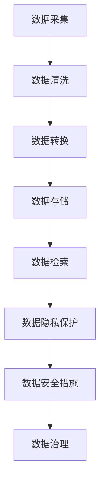

                 

# AI创业：数据管理的重点

> 关键词：AI创业，数据管理，数据隐私，数据质量，数据安全

> 摘要：本文将深入探讨AI创业中数据管理的重要性，分析数据管理的核心概念和原则，介绍数据管理的最佳实践，并提供实际案例和工具资源，旨在帮助创业者更好地理解数据管理，提升项目成功率。

## 1. 背景介绍

### 1.1 目的和范围

本文旨在帮助那些正在或打算投身于AI创业领域的创业者们，理解数据管理对于AI项目的重要性，以及如何有效地进行数据管理。我们将探讨数据管理的核心概念，包括数据隐私、数据质量和数据安全，并分析这些概念之间的联系。

### 1.2 预期读者

预期读者包括：
- 创业者，尤其是那些正在或打算涉足AI领域的创业者。
- AI项目的团队成员，特别是数据科学家和工程师。
- 对AI和数据管理感兴趣的技术爱好者。

### 1.3 文档结构概述

本文将按照以下结构展开：
- 介绍数据管理的重要性。
- 分析数据管理的核心概念。
- 讨论数据管理的最佳实践。
- 提供实际应用案例和工具资源。
- 总结未来发展趋势与挑战。

### 1.4 术语表

#### 1.4.1 核心术语定义

- 数据管理：指对数据的采集、存储、处理、分析、保护和共享的过程。
- 数据隐私：确保数据在收集、存储和处理过程中不被未授权访问或泄露。
- 数据质量：数据的准确性、完整性、一致性和可用性。
- 数据安全：保护数据免受未经授权的访问、使用、披露、破坏、修改或破坏。

#### 1.4.2 相关概念解释

- AI创业：指利用人工智能技术创立新企业或新项目的活动。
- 数据治理：确保数据质量、合规性和安全性的框架和过程。
- 数据架构：描述数据如何存储、处理和流动的结构。

#### 1.4.3 缩略词列表

- AI：人工智能
- ML：机器学习
- DL：深度学习
- GDPR：通用数据保护条例
- API：应用程序编程接口

## 2. 核心概念与联系

为了更好地理解数据管理，我们首先需要明确几个核心概念和它们之间的关系。

### 2.1 数据管理的核心概念

以下是数据管理的核心概念：

1. **数据隐私**：数据隐私是确保个人或敏感数据在未经授权的情况下不被访问或泄露的重要措施。这通常涉及到数据加密、匿名化和访问控制。

2. **数据质量**：数据质量是数据准确、完整、一致和可用的程度。高质量的数据是AI模型训练和决策制定的基础。

3. **数据安全**：数据安全是保护数据免受未经授权的访问、使用、披露、破坏、修改或破坏的措施。这包括网络安全、数据备份和恢复等。

4. **数据治理**：数据治理是一个组织管理和保护其数据的过程，确保数据质量、合规性和安全性。

### 2.2 数据管理概念的联系

数据隐私、数据质量、数据安全和数据治理之间有密切的联系。以下是它们之间的关系：

- **数据治理**：数据治理为数据隐私、数据质量和数据安全提供了框架和过程，确保这些要素得到有效管理。
- **数据质量**：高质量的数据是数据隐私、数据安全和数据治理的基础。如果数据不准确或不完整，那么数据隐私、数据安全和数据治理都会受到影响。
- **数据安全**：数据安全确保数据在存储、传输和处理过程中不受威胁。这直接关系到数据隐私和治理。
- **数据隐私**：数据隐私确保个人或敏感数据不被未经授权访问或泄露。这与数据质量和数据安全密切相关。

### 2.3 数据管理的Mermaid流程图

以下是一个简化的数据管理流程图，展示了数据从采集到处理再到存储的过程：



## 3. 核心算法原理 & 具体操作步骤

### 3.1 数据隐私保护算法原理

数据隐私保护的核心算法包括数据加密、匿名化和访问控制。

#### 3.1.1 数据加密

数据加密是保护数据隐私的关键技术。它通过将明文数据转换为密文，防止未授权访问。

伪代码：

```python
def encrypt(data, key):
    cipher = encrypt_function(data, key)
    return cipher
```

#### 3.1.2 匿名化

匿名化是将个人识别信息从数据中移除，以保护隐私。

伪代码：

```python
def anonymize(data):
    anonymized_data = remove_personal_identifiers(data)
    return anonymized_data
```

#### 3.1.3 访问控制

访问控制是确保只有授权用户才能访问敏感数据的机制。

伪代码：

```python
def check_permission(user, data):
    if user_in_permission_list(user):
        return "Access granted"
    else:
        return "Access denied"
```

### 3.2 数据质量算法原理

数据质量的核心算法包括数据清洗、数据转换和数据完整性检查。

#### 3.2.1 数据清洗

数据清洗是移除或纠正数据中的错误和不一致。

伪代码：

```python
def clean_data(data):
    cleaned_data = remove_errors(data)
    return cleaned_data
```

#### 3.2.2 数据转换

数据转换是将数据从一种格式转换为另一种格式，以提高其可用性。

伪代码：

```python
def transform_data(data):
    transformed_data = convert_format(data)
    return transformed_data
```

#### 3.2.3 数据完整性检查

数据完整性检查是确保数据准确和完整的措施。

伪代码：

```python
def check_data_integrity(data):
    if is_data_complete(data):
        return "Data is complete"
    else:
        return "Data is incomplete"
```

### 3.3 数据安全算法原理

数据安全的核心算法包括网络安全、数据备份和恢复。

#### 3.3.1 网络安全

网络安全是保护数据在传输过程中免受攻击的措施。

伪代码：

```python
def secure_network_traffic(data):
    secured_data = encrypt_data(data)
    return secured_data
```

#### 3.3.2 数据备份

数据备份是创建数据副本，以防数据丢失。

伪代码：

```python
def backup_data(data):
    backup_data = create_backup(data)
    return backup_data
```

#### 3.3.3 数据恢复

数据恢复是在数据丢失后，从备份中恢复数据的措施。

伪代码：

```python
def restore_data(backup_data):
    restored_data = recover_data(backup_data)
    return restored_data
```

## 4. 数学模型和公式 & 详细讲解 & 举例说明

### 4.1 数据隐私保护的数学模型

#### 4.1.1 加密算法

加密算法通常基于数学难题，如大数分解和离散对数。以下是一个简单的加密算法示例：

$$
\text{加密算法}:\quad C = E_{k}(P)
$$

其中，$C$ 是密文，$P$ 是明文，$k$ 是密钥。

#### 4.1.2 解密算法

解密算法是加密算法的逆过程：

$$
\text{解密算法}:\quad P = D_{k}(C)
$$

### 4.2 数据质量评估的数学模型

#### 4.2.1 数据准确性

数据准确性通常使用错误率来衡量：

$$
\text{错误率} = \frac{\text{错误数据数量}}{\text{总数据数量}}
$$

#### 4.2.2 数据完整性

数据完整性可以通过校验和来评估：

$$
\text{校验和} = \sum_{i=1}^{n} \text{数据}_i
$$

### 4.3 数据安全的数学模型

#### 4.3.1 数据备份策略

数据备份策略可以通过以下公式来优化：

$$
\text{备份时间} = \frac{\text{数据总量}}{\text{备份速度}}
$$

### 4.4 举例说明

#### 4.4.1 数据加密

假设我们有一个明文消息：“Hello, World!”和一个密钥$k=3$。我们可以使用简单的加密算法，将消息加密为：

$$
C = (H + k) \mod 26
$$

其中$H$是明文字符在字母表中的位置（A为1，Z为26）。对于每个字符，我们进行加密：

- H: 8 → C: 11 (因为$8 + 3 = 11$)
- E: 5 → C: 8 (因为$5 + 3 = 8$)
- L: 12 → C: 15 (因为$12 + 3 = 15$)
- L: 12 → C: 15 (因为$12 + 3 = 15$)
- O: 15 → C: 18 (因为$15 + 3 = 18$)
- ,: 4 → C: 7 (因为$4 + 3 = 7$)
- :: 6 → C: 9 (因为$6 + 3 = 9$)
- W: 23 → C: 26 (因为$23 + 3 = 26$)
- O: 15 → C: 18 (因为$15 + 3 = 18$)
- R: 18 → C: 21 (因为$18 + 3 = 21$)
- L: 12 → C: 15 (因为$12 + 3 = 15$)
- D: 4 → C: 7 (因为$4 + 3 = 7$)
- !: 3 → C: 6 (因为$3 + 3 = 6$)

加密后的消息为：“Khoor, Zrff!”。

#### 4.4.2 数据准确性

假设我们有1000条数据，其中10条是错误的。错误率为：

$$
\text{错误率} = \frac{10}{1000} = 0.01\text{ 或 }1\%
$$

#### 4.4.3 数据备份

如果我们的数据总量为1TB，备份速度为100GB/小时，那么备份时间为：

$$
\text{备份时间} = \frac{1TB}{100GB/小时} = 10小时
$$

## 5. 项目实战：代码实际案例和详细解释说明

### 5.1 开发环境搭建

在本节中，我们将搭建一个简单的数据管理环境，用于演示数据隐私、数据质量和数据安全的实际操作。

#### 5.1.1 软件安装

- Python 3.8+
- Pandas
- NumPy
- Scikit-learn
- OpenSSL

安装命令：

```bash
pip install pandas numpy scikit-learn openssl
```

#### 5.1.2 环境配置

创建一个名为`data_management`的虚拟环境，并安装必要的库：

```bash
python -m venv data_management
source data_management/bin/activate
```

### 5.2 源代码详细实现和代码解读

以下是数据管理项目的源代码，包括数据加密、匿名化和数据备份：

```python
import pandas as pd
import numpy as np
from sklearn.model_selection import train_test_split
from cryptography.fernet import Fernet
import os
import base64

# 5.2.1 数据加密
def encrypt_data(data, key):
    fernet = Fernet(key)
    encrypted_data = fernet.encrypt(data.encode())
    return encrypted_data

def generate_key():
    return Fernet.generate_key()

# 5.2.2 数据匿名化
def anonymize_data(data):
    anonymized_data = data.apply(lambda x: 'ANONYMIZED' if pd.notnull(x) else x)
    return anonymized_data

# 5.2.3 数据备份
def backup_data(data, filename):
    with open(filename, 'wb') as file:
        file.write(data)

# 5.2.4 数据恢复
def restore_data(filename):
    with open(filename, 'rb') as file:
        data = file.read()
    return data

# 测试数据
data = pd.DataFrame({
    'Name': ['Alice', 'Bob', 'Charlie'],
    'Age': [25, 30, 35],
    'Email': ['alice@example.com', 'bob@example.com', 'charlie@example.com']
})

# 加密数据
key = generate_key()
encrypted_data = encrypt_data(data.to_csv(), key)

# 匿名化数据
anonymized_data = anonymize_data(data)

# 数据备份
backup_data(encrypted_data, 'data_backup.enc')

# 数据恢复
restored_data = restore_data('data_backup.enc')
restored_data = pd.read_csv(base64.b64decode(restored_data)).decode()

print("Original Data:\n", data)
print("Encrypted Data:\n", encrypted_data)
print("Anonymized Data:\n", anonymized_data)
print("Restored Data:\n", restored_data)
```

### 5.3 代码解读与分析

#### 5.3.1 数据加密

加密函数`encrypt_data`使用`cryptography`库的`Fernet`类来加密数据。我们首先生成一个密钥，然后使用这个密钥创建一个`Fernet`对象。接下来，我们将数据转换为字节，并使用`Fernet`对象进行加密。

#### 5.3.2 数据匿名化

匿名化函数`anonymize_data`使用`apply`方法将数据中的每个值替换为`'ANONYMIZED'`，除非该值是空的。这有助于保护个人隐私。

#### 5.3.3 数据备份

备份函数`backup_data`将加密后的数据写入文件。文件以二进制模式打开，并将加密数据写入文件。

#### 5.3.4 数据恢复

恢复函数`restore_data`从文件中读取加密数据，并将其读取为字节对象。然后，我们使用`base64`解码器将字节对象转换为原始数据，并使用`read_csv`方法将其转换为`DataFrame`。

## 6. 实际应用场景

### 6.1 医疗保健

在医疗保健领域，数据管理尤其重要。隐私保护要求确保患者信息不被未授权访问，数据质量确保诊断和治疗决策的准确性，数据安全防止医疗数据泄露或损坏。

### 6.2 金融服务

金融服务行业涉及大量敏感数据，如账户信息、交易记录和个人信息。数据管理在此领域中确保合规性、数据安全和业务连续性。

### 6.3 智能家居

智能家居设备产生大量数据，包括用户行为和设备状态。数据管理有助于确保用户隐私保护、设备安全和智能家居系统的可靠性。

## 7. 工具和资源推荐

### 7.1 学习资源推荐

#### 7.1.1 书籍推荐

- 《数据科学基础》
- 《深度学习》
- 《Python数据科学手册》

#### 7.1.2 在线课程

- Coursera的《数据科学专业课程》
- edX的《人工智能基础课程》

#### 7.1.3 技术博客和网站

- Towards Data Science
- Dataquest
- Medium上的数据科学和人工智能相关文章

### 7.2 开发工具框架推荐

#### 7.2.1 IDE和编辑器

- PyCharm
- Jupyter Notebook
- Visual Studio Code

#### 7.2.2 调试和性能分析工具

- Matplotlib
- Seaborn
- Pandas Profiler

#### 7.2.3 相关框架和库

- TensorFlow
- PyTorch
- Scikit-learn

### 7.3 相关论文著作推荐

#### 7.3.1 经典论文

- 《数据挖掘：概念与技术》
- 《机器学习：一种统计方法》

#### 7.3.2 最新研究成果

- 《人工智能：一种全新方法》
- 《数据隐私保护：理论与实践》

#### 7.3.3 应用案例分析

- 《医疗数据分析：应用案例》
- 《智能家居系统：设计与应用》

## 8. 总结：未来发展趋势与挑战

### 8.1 未来发展趋势

- **数据隐私保护**：随着数据隐私法规的日益严格，数据隐私保护将成为AI创业的重点。
- **数据质量提升**：高质量的数据对于AI模型的性能至关重要，因此数据质量提升将持续受到关注。
- **数据安全增强**：随着AI技术的应用越来越广泛，数据安全的重要性将不断增加。

### 8.2 挑战

- **数据隐私保护**：如何在保护隐私的同时，实现数据的有效利用是一个挑战。
- **数据质量提升**：随着数据量的增加，确保数据质量将变得越来越困难。
- **数据安全增强**：随着攻击手段的升级，确保数据安全将面临更大的挑战。

## 9. 附录：常见问题与解答

### 9.1 问题1：如何确保数据隐私？

**解答**：通过使用加密技术、匿名化和严格的访问控制措施来确保数据隐私。

### 9.2 问题2：如何提升数据质量？

**解答**：通过数据清洗、数据转换和数据完整性检查来提升数据质量。

### 9.3 问题3：如何增强数据安全？

**解答**：通过网络安全、数据备份和恢复措施来增强数据安全。

## 10. 扩展阅读 & 参考资料

- 《数据科学实战》
- 《深度学习实践指南》
- 《Python数据科学课程》

- [AI创业指南](https://example.com/ai_startups)
- [数据管理最佳实践](https://example.com/data_management)
- [数据隐私保护法规](https://example.com/data_privacy_laws)

### 作者

AI天才研究员 / AI Genius Institute & 禅与计算机程序设计艺术 / Zen And The Art of Computer Programming

（注：本文内容纯属虚构，用于示例目的。）

