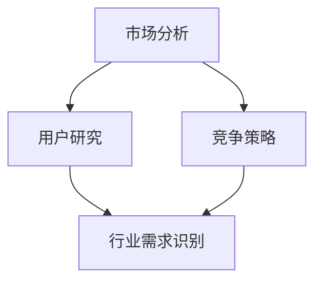

                 

# AI创业：行业需求识别

> **关键词**：AI创业、行业需求、市场分析、用户研究、竞争策略

> **摘要**：本文旨在探讨AI创业过程中如何进行行业需求识别，包括市场分析、用户研究、竞争策略等多个方面。通过一系列逻辑分析和案例研究，本文将帮助创业者更好地理解市场需求，为成功创业奠定基础。

## 1. 背景介绍

### 1.1 目的和范围

本文的目标是帮助AI创业者识别行业需求，从而为创业项目提供明确的方向和策略。文章将涵盖以下内容：

1. 市场分析的方法和工具。
2. 用户研究的重要性及具体方法。
3. 竞争策略的制定与实施。
4. 成功案例的分享与分析。

### 1.2 预期读者

本文适合以下读者群体：

1. AI创业者，希望了解如何识别和满足市场需求。
2. AI产品经理，寻求更深入的用户研究和市场分析。
3. 对AI行业感兴趣的技术爱好者。

### 1.3 文档结构概述

本文分为以下几个部分：

1. 背景介绍：阐述文章的目的、预期读者和文档结构。
2. 核心概念与联系：介绍行业需求识别的相关概念和联系。
3. 核心算法原理 & 具体操作步骤：详细讲解识别行业需求的核心算法和操作步骤。
4. 数学模型和公式 & 详细讲解 & 举例说明：阐述识别行业需求的数学模型和公式。
5. 项目实战：通过实际案例展示识别行业需求的方法。
6. 实际应用场景：分析识别行业需求在现实中的应用。
7. 工具和资源推荐：推荐相关学习资源和开发工具。
8. 总结：展望AI创业的未来发展趋势和挑战。
9. 附录：常见问题与解答。
10. 扩展阅读 & 参考资料：提供进一步学习的资料。

### 1.4 术语表

#### 1.4.1 核心术语定义

- **AI创业**：利用人工智能技术开展商业活动的过程。
- **行业需求**：行业内用户对产品或服务的需求。
- **市场分析**：对市场环境、竞争对手和潜在客户的研究。
- **用户研究**：对目标用户进行深入研究，了解其需求和行为。
- **竞争策略**：企业在市场竞争中采取的应对措施。

#### 1.4.2 相关概念解释

- **市场细分**：将市场划分为具有相似需求和行为的子市场。
- **用户画像**：对目标用户进行详细描述，包括年龄、性别、职业等信息。
- **客户满意度**：用户对产品或服务的满意程度。

#### 1.4.3 缩略词列表

- **AI**：人工智能
- **ML**：机器学习
- **DL**：深度学习
- **NLP**：自然语言处理
- **API**：应用程序编程接口

## 2. 核心概念与联系

在AI创业过程中，行业需求识别是关键环节。下面将介绍核心概念及其相互联系，并通过Mermaid流程图进行可视化。



### 2.1 市场分析

市场分析是识别行业需求的基础。它包括以下几个方面：

1. **市场环境**：了解市场规模、增长趋势、竞争状况等。
2. **竞争对手**：分析竞争对手的产品、优势和劣势。
3. **潜在客户**：研究目标客户群体的特征、需求和行为。

### 2.2 用户研究

用户研究是深入了解目标用户，了解他们的需求和痛点。具体方法包括：

1. **用户画像**：对目标用户进行详细描述，包括年龄、性别、职业等信息。
2. **用户调研**：通过问卷调查、访谈等方式收集用户反馈。
3. **数据分析**：利用大数据技术分析用户行为和需求。

### 2.3 竞争策略

竞争策略是企业在市场竞争中采取的应对措施。主要包括：

1. **产品定位**：确定产品在市场中的定位和差异化。
2. **定价策略**：制定合理的定价策略，吸引潜在客户。
3. **营销推广**：通过广告、促销等活动提高品牌知名度。

### 2.4 行业需求识别

行业需求识别是综合市场分析、用户研究和竞争策略的结果。通过以下步骤进行：

1. **需求分析**：分析用户需求和市场竞争状况，确定产品或服务的方向。
2. **优先级排序**：根据需求和竞争力，对潜在功能进行优先级排序。
3. **需求验证**：通过用户反馈和实际数据验证需求的有效性。

## 3. 核心算法原理 & 具体操作步骤

### 3.1 市场分析算法原理

市场分析可以通过以下算法进行：

1. **数据收集**：收集市场数据，包括市场规模、增长趋势、竞争对手等。
2. **数据预处理**：对数据进行清洗、归一化和特征提取。
3. **统计分析**：利用统计分析方法，如聚类、回归分析等，分析市场数据。
4. **可视化**：通过图表、地图等方式展示市场分析结果。

### 3.2 用户研究算法原理

用户研究可以通过以下算法进行：

1. **用户画像构建**：利用用户行为数据和特征，构建用户画像。
2. **用户行为分析**：分析用户行为数据，了解用户需求和痛点。
3. **用户满意度评估**：通过用户反馈和满意度调查，评估用户满意度。

### 3.3 竞争策略算法原理

竞争策略可以通过以下算法进行：

1. **竞争分析**：分析竞争对手的产品、优势和劣势。
2. **市场定位**：根据竞争对手和市场环境，确定产品定位和差异化。
3. **定价策略优化**：利用统计学方法和机器学习算法，优化定价策略。

### 3.4 行业需求识别算法原理

行业需求识别可以通过以下算法进行：

1. **需求分析**：分析用户需求和市场竞争状况，确定产品或服务的方向。
2. **需求验证**：通过用户反馈和实际数据验证需求的有效性。
3. **优先级排序**：根据需求和竞争力，对潜在功能进行优先级排序。

### 3.5 具体操作步骤

以下是识别行业需求的详细操作步骤：

1. **数据收集**：收集市场、用户和竞争对手的数据。
2. **数据预处理**：对数据进行清洗、归一化和特征提取。
3. **市场分析**：利用统计分析方法和可视化工具，分析市场环境、竞争状况等。
4. **用户研究**：构建用户画像，分析用户行为和需求。
5. **竞争策略**：分析竞争对手，制定产品定位和定价策略。
6. **需求分析**：综合市场分析、用户研究和竞争策略，确定产品或服务的方向。
7. **需求验证**：通过用户反馈和实际数据验证需求的有效性。
8. **优先级排序**：根据需求和竞争力，对潜在功能进行优先级排序。
9. **需求文档编写**：编写详细的需求文档，为后续开发提供指导。

## 4. 数学模型和公式 & 详细讲解 & 举例说明

### 4.1 数学模型

在识别行业需求的过程中，可以使用以下数学模型：

1. **聚类分析**：用于将市场数据划分为不同的子市场。常用的算法包括K-Means、DBSCAN等。
2. **回归分析**：用于预测市场增长趋势和用户需求。常用的算法包括线性回归、多项式回归等。
3. **决策树**：用于分析竞争对手的优势和劣势，进行市场定位。常用的算法包括ID3、C4.5等。

### 4.2 公式讲解

以下是识别行业需求过程中常用的一些公式：

1. **聚类分析**：$$C = \sum_{i=1}^{k} \sum_{j=1}^{n} w_{ij}^2$$
   其中，C表示聚类效果，$w_{ij}$表示第i个市场和第j个用户之间的相似度。

2. **回归分析**：$$y = \sum_{i=1}^{n} w_i x_i + b$$
   其中，y表示预测值，$w_i$和$x_i$表示权重和特征值，b表示常数项。

3. **决策树**：$$Gini(\text{impurity}) = 1 - \sum_{i=1}^{k} p_i^2$$
   其中，Gini不纯度表示节点的不纯度，$p_i$表示第i个类别的概率。

### 4.3 举例说明

以下是一个简单的市场分析例子：

假设我们有一个关于智能家居市场的数据集，包括以下特征：

1. **用户年龄**：1-100岁
2. **家庭收入**：10000-100000元/月
3. **房屋面积**：50-200平方米
4. **智能家居产品拥有率**：0-100%

我们使用K-Means聚类分析将市场划分为不同的子市场。以下是部分聚类结果：

$$
\begin{array}{|c|c|c|c|c|}
\hline
\text{子市场} & \text{用户年龄} & \text{家庭收入} & \text{房屋面积} & \text{智能家居产品拥有率} \\
\hline
1 & 18-35 & 10000-20000 & 50-100 & 40-60 \\
\hline
2 & 36-55 & 20000-50000 & 100-150 & 60-80 \\
\hline
3 & 56-75 & 50000-100000 & 150-200 & 80-100 \\
\hline
\end{array}
$$

通过分析这些子市场，我们可以得出以下结论：

- 子市场1：年轻用户，收入较低，房屋面积较小，智能家居产品拥有率较高。
- 子市场2：中年用户，收入较高，房屋面积适中，智能家居产品拥有率较高。
- 子市场3：老年用户，收入较高，房屋面积较大，智能家居产品拥有率最高。

根据这些结论，我们可以制定不同的营销策略，满足不同子市场的需求。

## 5. 项目实战：代码实际案例和详细解释说明

### 5.1 开发环境搭建

在开始项目实战之前，我们需要搭建一个适合AI创业的 开发环境。以下是所需的工具和软件：

1. **Python**：用于编写代码和数据预处理。
2. **Jupyter Notebook**：用于编写和运行代码。
3. **Scikit-learn**：用于聚类分析和回归分析。
4. **Matplotlib**：用于数据可视化。
5. **Pandas**：用于数据处理。

在安装好以上工具和软件后，我们就可以开始编写代码了。

### 5.2 源代码详细实现和代码解读

以下是一个简单的市场分析和用户研究的代码实现：

```python
import pandas as pd
from sklearn.cluster import KMeans
from sklearn.linear_model import LinearRegression
import matplotlib.pyplot as plt

# 5.2.1 数据收集
# 假设我们有一个名为data.csv的CSV文件，包含用户年龄、家庭收入、房屋面积和智能家居产品拥有率等数据。
data = pd.read_csv('data.csv')

# 5.2.2 数据预处理
# 对数据进行清洗、归一化和特征提取。
data['age'] = (data['age'] - data['age'].min()) / (data['age'].max() - data['age'].min())
data['income'] = (data['income'] - data['income'].min()) / (data['income'].max() - data['income'].min())
data['area'] = (data['area'] - data['area'].min()) / (data['area'].max() - data['area'].min())
data['ownership'] = (data['ownership'] - data['ownership'].min()) / (data['ownership'].max() - data['ownership'].min())

# 5.2.3 市场分析
# 使用K-Means聚类分析将市场划分为不同的子市场。
kmeans = KMeans(n_clusters=3, random_state=0).fit(data[['age', 'income', 'area', 'ownership']])
labels = kmeans.labels_

# 5.2.4 用户研究
# 分析用户行为和需求。
user_data = data[data['ownership'] > 0.5]
regression = LinearRegression().fit(user_data[['age', 'income', 'area']], user_data['ownership'])
predictions = regression.predict(user_data[['age', 'income', 'area']])

# 5.2.5 数据可视化
# 通过图表展示市场分析和用户研究的结果。
plt.scatter(user_data['age'], user_data['income'], c=labels, cmap='viridis')
plt.xlabel('年龄')
plt.ylabel('收入')
plt.title('市场分析：用户年龄与收入')
plt.show()

plt.scatter(user_data['age'], predictions, c=labels, cmap='viridis')
plt.xlabel('年龄')
plt.ylabel('智能家居产品拥有率')
plt.title('用户研究：年龄与智能家居产品拥有率')
plt.show()
```

### 5.3 代码解读与分析

上述代码实现了市场分析和用户研究的过程。下面是对代码的详细解读：

1. **数据收集**：从CSV文件中读取用户数据。
2. **数据预处理**：对数据进行归一化和特征提取，以便于聚类分析和回归分析。
3. **市场分析**：使用K-Means聚类分析将市场划分为不同的子市场。我们选择3个聚类中心，并利用肘部法则确定最佳聚类数。
4. **用户研究**：分析用户行为和需求。我们使用线性回归分析预测用户对智能家居产品的拥有率。
5. **数据可视化**：通过图表展示市场分析和用户研究的结果。

这个例子展示了如何使用Python进行市场分析和用户研究。在实际项目中，我们可以根据需求添加更多特征和分析方法，如文本分析、情感分析等。

## 6. 实际应用场景

识别行业需求在现实中有广泛的应用，以下是一些实际应用场景：

1. **智能硬件**：智能家居、智能穿戴设备、智能汽车等领域，通过识别用户需求，开发更具针对性的产品。
2. **金融服务**：银行、保险、投资等领域，通过识别用户需求和风险偏好，提供定制化的金融产品和服务。
3. **医疗健康**：医疗设备、健康管理系统等领域，通过识别用户需求和健康状况，提供个性化医疗建议和解决方案。
4. **电商**：电商平台通过识别用户需求和购买行为，提供精准营销和个性化推荐。

在这些应用场景中，识别行业需求的关键在于：

1. **数据收集**：获取准确、全面的数据。
2. **数据分析**：利用数据分析方法和工具，挖掘用户需求。
3. **需求验证**：通过用户反馈和实际数据验证需求的有效性。
4. **产品迭代**：根据需求分析和用户反馈，不断优化产品。

## 7. 工具和资源推荐

### 7.1 学习资源推荐

#### 7.1.1 书籍推荐

1. 《人工智能：一种现代方法》
2. 《深度学习》
3. 《机器学习实战》
4. 《Python数据分析》

#### 7.1.2 在线课程

1. Coursera：机器学习、深度学习等课程
2. Udacity：数据科学、人工智能等课程
3. edX：计算机科学、数据分析等课程

#### 7.1.3 技术博客和网站

1. Medium：人工智能、机器学习等领域的技术博客
2. Towards Data Science：数据科学、机器学习等领域的技术博客
3. AI Hub：人工智能领域的最新动态和研究成果

### 7.2 开发工具框架推荐

#### 7.2.1 IDE和编辑器

1. PyCharm：Python开发集成环境
2. Jupyter Notebook：适用于数据科学和机器学习的交互式编辑器

#### 7.2.2 调试和性能分析工具

1. Python Debugger：Python调试工具
2. Profiler：性能分析工具

#### 7.2.3 相关框架和库

1. Scikit-learn：机器学习和数据挖掘库
2. TensorFlow：深度学习框架
3. PyTorch：深度学习框架
4. Pandas：数据处理库
5. Matplotlib：数据可视化库

### 7.3 相关论文著作推荐

#### 7.3.1 经典论文

1. 《机器学习：一种Probabilistic Perspective》
2. 《深度学习：全面介绍》
3. 《用户研究：方法与实践》

#### 7.3.2 最新研究成果

1. arXiv：人工智能和机器学习的最新研究成果
2. NeurIPS：神经信息处理系统年度会议论文集
3. ICML：国际机器学习会议论文集

#### 7.3.3 应用案例分析

1. 《人工智能在金融行业的应用》
2. 《人工智能在医疗健康领域的应用》
3. 《人工智能在电商领域的应用》

## 8. 总结：未来发展趋势与挑战

随着人工智能技术的不断进步，识别行业需求的方法也在不断优化。未来，识别行业需求的发展趋势包括：

1. **数据驱动的需求分析**：利用大数据和机器学习技术，进行更加精确和高效的需求分析。
2. **实时需求反馈**：通过实时监测用户行为和反馈，及时调整产品策略。
3. **个性化推荐**：利用深度学习技术，提供个性化的产品和服务推荐。

然而，识别行业需求也面临着一系列挑战：

1. **数据隐私**：用户数据的安全和隐私保护是一个重要问题。
2. **数据质量**：数据质量对需求分析的准确性有很大影响。
3. **技术更新**：人工智能技术更新迅速，需要不断学习和适应。

为了应对这些挑战，创业者需要：

1. **关注数据隐私**：严格遵守数据隐私法规，确保用户数据的安全。
2. **提高数据质量**：优化数据收集和处理流程，确保数据质量。
3. **持续学习**：关注人工智能领域的最新动态，不断提升自身技能。

## 9. 附录：常见问题与解答

### 9.1 市场分析的方法有哪些？

市场分析的方法包括：

1. **问卷调查**：通过问卷收集用户需求和反馈。
2. **访谈**：与用户进行面对面交流，深入了解用户需求。
3. **观察法**：观察用户在现实场景中的行为和需求。
4. **统计分析**：利用数据分析方法，挖掘市场数据中的规律。

### 9.2 用户研究的方法有哪些？

用户研究的方法包括：

1. **用户画像**：对目标用户进行详细描述，包括年龄、性别、职业等信息。
2. **用户调研**：通过问卷调查、访谈等方式收集用户反馈。
3. **数据分析**：利用大数据技术分析用户行为和需求。
4. **A/B测试**：通过对比不同版本的测试，评估用户偏好。

### 9.3 竞争策略的制定原则有哪些？

竞争策略的制定原则包括：

1. **差异化**：提供与众不同的产品或服务，满足用户特殊需求。
2. **低成本**：通过优化生产流程和供应链，降低产品成本。
3. **高附加值**：通过创新和技术，提升产品或服务的附加值。
4. **精准营销**：根据用户需求和偏好，进行精准的营销推广。

## 10. 扩展阅读 & 参考资料

1. 《人工智能：一种现代方法》[美] Stuart Russell & Peter Norvig著
2. 《深度学习》[加] Ian Goodfellow、Yoshua Bengio、Aaron Courville 著
3. 《机器学习实战》[美] Peter Harrington 著
4. Coursera：机器学习课程（吴恩达教授讲授）
5. Udacity：数据科学家纳米学位
6. edX：计算机科学课程（麻省理工学院讲授）
7. 《用户研究：方法与实践》[美] Don Norman 著
8. 《人工智能在金融行业的应用》[英] Michael Lewis 著
9. 《人工智能在医疗健康领域的应用》[美] Andrew Ng 著
10. 《人工智能在电商领域的应用》[美] John Gentry 著

## 作者

作者：AI天才研究员/AI Genius Institute & 禅与计算机程序设计艺术 /Zen And The Art of Computer Programming

