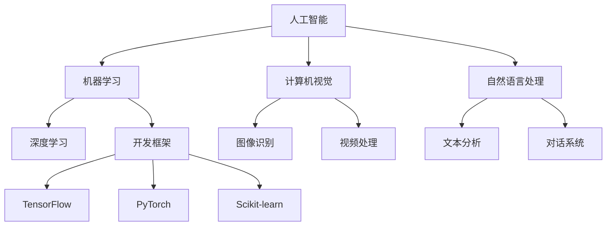

                 


# AI创业：选择合适工具的方法

> **关键词：** AI创业，工具选择，开发框架，编程语言，性能优化，资源推荐

> **摘要：** 本文将探讨AI创业者在选择工具时所需考虑的各个方面，包括开发框架、编程语言、性能优化以及相关的学习资源和开发工具，旨在帮助创业者们更高效地构建和优化AI应用。

## 1. 背景介绍

### 1.1 目的和范围

本文旨在为AI创业者提供一个选择合适开发工具的指南。随着人工智能技术的快速发展，选择合适的工具对于成功创业至关重要。本文将涵盖以下内容：

- 开发框架的比较和选择
- 编程语言的最佳实践
- 性能优化策略
- 相关学习资源和开发工具推荐

### 1.2 预期读者

本文适合以下读者群体：

- 初创AI企业创始人
- AI项目开发者
- 对AI工具选择有兴趣的技术爱好者

### 1.3 文档结构概述

本文结构如下：

- 1. 背景介绍
  - 1.1 目的和范围
  - 1.2 预期读者
  - 1.3 文档结构概述
  - 1.4 术语表
- 2. 核心概念与联系
- 3. 核心算法原理 & 具体操作步骤
- 4. 数学模型和公式 & 详细讲解 & 举例说明
- 5. 项目实战：代码实际案例和详细解释说明
- 6. 实际应用场景
- 7. 工具和资源推荐
  - 7.1 学习资源推荐
  - 7.2 开发工具框架推荐
  - 7.3 相关论文著作推荐
- 8. 总结：未来发展趋势与挑战
- 9. 附录：常见问题与解答
- 10. 扩展阅读 & 参考资料

### 1.4 术语表

#### 1.4.1 核心术语定义

- **AI创业**：指基于人工智能技术的创业活动，通常涉及开发和应用AI模型、算法和服务。
- **开发框架**：用于加速应用程序开发的软件库和工具集合，提供特定功能，如数据处理、模型训练和部署。
- **编程语言**：用于编写计算机程序的语言，例如Python、Java和C++。
- **性能优化**：通过改进代码和系统架构来提高应用程序的执行效率和响应速度。

#### 1.4.2 相关概念解释

- **机器学习框架**：用于实现和训练机器学习模型的软件库，如TensorFlow、PyTorch和Scikit-learn。
- **深度学习**：一种基于多层神经网络的结构化机器学习方法，用于处理复杂数据。
- **微服务架构**：将应用程序分解为小型、独立的服务单元，每个服务执行特定功能，便于管理和扩展。

#### 1.4.3 缩略词列表

- **AI**：人工智能（Artificial Intelligence）
- **ML**：机器学习（Machine Learning）
- **DL**：深度学习（Deep Learning）
- **GPU**：图形处理器（Graphics Processing Unit）
- **API**：应用程序编程接口（Application Programming Interface）

## 2. 核心概念与联系

为了更深入地理解AI创业中工具选择的重要性，我们需要首先了解一些核心概念及其相互联系。

### 2.1 人工智能与创业

人工智能（AI）是一种模拟人类智能行为的技术，涉及机器学习、计算机视觉、自然语言处理等领域。创业者可以利用AI技术来解决实际问题、创造新的商业模式或优化现有业务流程。

- **机器学习（ML）**：使机器能够从数据中学习和改进性能的技术。
- **计算机视觉（CV）**：使计算机能够解释和响应数字图像或视频内容的技术。
- **自然语言处理（NLP）**：使计算机能够理解、生成和处理人类语言的技术。

### 2.2 开发框架与编程语言

选择合适的开发框架和编程语言对于AI创业项目至关重要。开发框架提供了一套标准化的工具和库，使开发者能够更快速地实现功能。而编程语言则是实现这些功能的基础。

- **TensorFlow**：由Google开发的开源深度学习框架，适用于各种规模的机器学习和深度学习项目。
- **PyTorch**：由Facebook开发的开源深度学习框架，以其动态计算图和灵活的接口著称。
- **Scikit-learn**：一个针对Python的科学计算库，提供了一系列机器学习算法和工具。

### 2.3 性能优化与系统架构

性能优化是确保AI应用高效运行的关键。这包括代码级别的优化和系统架构的调整。以下是一些关键概念：

- **并行计算**：通过同时处理多个任务来提高计算效率。
- **分布式计算**：将计算任务分布在多个计算机或服务器上，以实现更高效的资源利用。
- **微服务架构**：将应用程序分解为小型、独立的服务单元，便于管理和扩展。

### 2.4 学习资源与社区支持

选择合适的工具还需要考虑学习资源和社区支持。以下是一些推荐的学习资源：

- **在线课程**：如Coursera、edX和Udacity等平台上的专业课程。
- **技术博客**：如Medium、Towards Data Science和AI垂直领域的专业博客。
- **社区论坛**：如Stack Overflow、GitHub和Reddit上的技术社区。

#### 2.4.1 Mermaid流程图

以下是一个简单的Mermaid流程图，展示了AI创业中核心概念之间的联系：



## 3. 核心算法原理 & 具体操作步骤

在了解核心概念之后，我们需要进一步探讨AI创业中使用的核心算法原理及其具体操作步骤。以下是一个基于机器学习和深度学习的算法原理及操作步骤示例。

### 3.1 机器学习算法原理

机器学习算法可以分为监督学习、无监督学习和强化学习。以下是监督学习算法的原理：

- **监督学习**：通过标记数据（输入和输出）训练模型，然后使用模型对新数据进行预测。
- **无监督学习**：仅使用输入数据，通过模型自动发现数据中的模式和结构。
- **强化学习**：通过试错和奖励机制，使模型在动态环境中学习和优化策略。

### 3.2 深度学习算法原理

深度学习是一种基于多层神经网络的机器学习方法。以下是深度学习算法的基本原理：

- **神经网络**：模拟人脑的神经元结构和信息处理过程，由输入层、隐藏层和输出层组成。
- **前向传播**：将输入数据通过神经网络传递到输出层，计算损失函数，并更新网络权重。
- **反向传播**：计算损失函数的梯度，并根据梯度调整网络权重，以优化模型性能。

### 3.3 具体操作步骤

以下是一个使用深度学习框架（如TensorFlow或PyTorch）实现图像分类任务的示例步骤：

1. **数据准备**：收集和预处理图像数据，包括数据清洗、数据增强和归一化。
2. **模型设计**：定义深度学习模型的结构，包括神经网络层数、神经元个数、激活函数等。
3. **模型训练**：使用训练数据训练模型，通过迭代优化模型参数，减小损失函数。
4. **模型评估**：使用验证数据评估模型性能，调整模型参数以优化性能。
5. **模型部署**：将训练好的模型部署到生产环境中，进行实时预测和应用。

以下是使用伪代码表示的深度学习模型训练步骤：

```python
# 伪代码：深度学习模型训练

# 数据准备
train_data, train_labels = load_data('train_data.csv')
val_data, val_labels = load_data('val_data.csv')

# 模型设计
model = build_model()

# 模型训练
for epoch in range(num_epochs):
    for inputs, labels in train_data:
        with tf.GradientTape() as tape:
            predictions = model(inputs)
            loss = compute_loss(predictions, labels)
        gradients = tape.gradient(loss, model.trainable_variables)
        update_model_variables(gradients)

    # 模型评估
    val_predictions = model(val_data)
    val_loss = compute_loss(val_predictions, val_labels)

    print(f"Epoch {epoch+1}/{num_epochs}, Loss: {loss:.4f}, Val Loss: {val_loss:.4f}")

# 模型部署
model.save('model.h5')
```

## 4. 数学模型和公式 & 详细讲解 & 举例说明

在深度学习和机器学习中，数学模型和公式是理解和实现算法的核心。以下是一些常见的数学模型和公式，以及它们的详细讲解和举例说明。

### 4.1 损失函数

损失函数是评估模型预测结果与实际结果之间差异的指标，用于指导模型优化过程。以下是一些常用的损失函数：

#### 4.1.1 交叉熵损失函数

交叉熵损失函数常用于分类问题，计算两个概率分布之间的差异。其公式如下：

$$
H(y, \hat{y}) = -\sum_{i} y_i \log(\hat{y}_i)
$$

其中，$y$ 是实际标签，$\hat{y}$ 是模型的预测概率分布。

#### 举例说明

假设我们有一个二分类问题，实际标签 $y = [1, 0]$，模型的预测概率分布 $\hat{y} = [0.8, 0.2]$。则交叉熵损失为：

$$
H(y, \hat{y}) = -1 \cdot \log(0.8) - 0 \cdot \log(0.2) = 0.223
$$

### 4.2 激活函数

激活函数是神经网络中用于引入非线性性的函数。以下是一些常用的激活函数：

#### 4.2.1 Sigmoid函数

Sigmoid函数将输入映射到$(0, 1)$区间，公式如下：

$$
\sigma(x) = \frac{1}{1 + e^{-x}}
$$

#### 举例说明

假设输入 $x = 2$，则：

$$
\sigma(2) = \frac{1}{1 + e^{-2}} \approx 0.881
$$

### 4.2.2 ReLU函数

ReLU函数是一种简单的线性激活函数，将输入大于零的值映射到自身，否则映射为零。公式如下：

$$
\text{ReLU}(x) = \max(0, x)
$$

#### 举例说明

假设输入 $x = -1$，则：

$$
\text{ReLU}(-1) = \max(0, -1) = 0
$$

假设输入 $x = 2$，则：

$$
\text{ReLU}(2) = \max(0, 2) = 2
$$

### 4.3 梯度下降

梯度下降是一种优化算法，用于最小化损失函数。其基本思想是沿着损失函数的梯度方向更新模型参数，以减小损失。以下是一维梯度下降的公式：

$$
\theta_{t+1} = \theta_t - \alpha \cdot \nabla_\theta J(\theta)
$$

其中，$\theta$ 是模型参数，$\alpha$ 是学习率，$J(\theta)$ 是损失函数。

#### 举例说明

假设损失函数 $J(\theta) = (\theta - 1)^2$，学习率 $\alpha = 0.1$，初始参数 $\theta_0 = 2$。则一次梯度下降更新如下：

$$
\nabla_\theta J(\theta) = 2(\theta - 1)
$$

$$
\theta_1 = \theta_0 - 0.1 \cdot 2(2 - 1) = 1.8
$$

## 5. 项目实战：代码实际案例和详细解释说明

### 5.1 开发环境搭建

在开始项目实战之前，我们需要搭建一个合适的开发环境。以下是一个基于Python和TensorFlow的深度学习项目的开发环境搭建步骤：

1. **安装Python**：确保安装了Python 3.7或更高版本。
2. **安装TensorFlow**：使用pip命令安装TensorFlow：

   ```bash
   pip install tensorflow
   ```

3. **安装Jupyter Notebook**：Jupyter Notebook是一个交互式计算平台，用于编写和运行Python代码。使用以下命令安装Jupyter：

   ```bash
   pip install notebook
   ```

4. **启动Jupyter Notebook**：在终端中运行以下命令启动Jupyter：

   ```bash
   jupyter notebook
   ```

### 5.2 源代码详细实现和代码解读

以下是一个使用TensorFlow实现的简单神经网络模型的源代码示例，用于对手写数字（MNIST）数据集进行分类。

```python
import tensorflow as tf
from tensorflow.keras import layers
import numpy as np

# 加载MNIST数据集
mnist = tf.keras.datasets.mnist
(train_images, train_labels), (test_images, test_labels) = mnist.load_data()

# 数据预处理
train_images = train_images / 255.0
test_images = test_images / 255.0

# 构建神经网络模型
model = tf.keras.Sequential([
    layers.Flatten(input_shape=(28, 28)),
    layers.Dense(128, activation='relu'),
    layers.Dense(10, activation='softmax')
])

# 编译模型
model.compile(optimizer='adam',
              loss='sparse_categorical_crossentropy',
              metrics=['accuracy'])

# 训练模型
model.fit(train_images, train_labels, epochs=5)

# 评估模型
test_loss, test_acc = model.evaluate(test_images, test_labels)
print(f"Test accuracy: {test_acc:.4f}")
```

#### 5.2.1 代码解读

1. **导入库**：首先，我们导入所需的TensorFlow和numpy库。
2. **加载MNIST数据集**：使用TensorFlow的`mnist`函数加载MNIST数据集，并分成训练集和测试集。
3. **数据预处理**：将图像数据除以255，将像素值归一化到0到1之间。
4. **构建神经网络模型**：使用`tf.keras.Sequential`创建一个简单的神经网络模型，包括两个全连接层，分别有128个神经元和10个神经元，最后使用softmax激活函数进行分类。
5. **编译模型**：配置模型优化器、损失函数和评估指标。
6. **训练模型**：使用训练数据进行模型训练，设置训练轮次为5。
7. **评估模型**：使用测试数据评估模型性能，并输出测试准确率。

### 5.3 代码解读与分析

该示例代码展示了如何使用TensorFlow构建和训练一个简单的神经网络模型，以对MNIST数据集进行手写数字分类。

- **数据预处理**：归一化是深度学习中的一个常见步骤，有助于加速模型的训练过程。
- **模型构建**：`Sequential`模型是一个线性堆叠的模型层，适合简单的任务。对于更复杂的任务，可以使用更高级的模型架构，如`Functional`或`Submodel`。
- **训练过程**：模型通过迭代优化参数，最小化损失函数。在训练过程中，模型会自动调整权重和偏置。
- **评估结果**：使用测试数据评估模型性能，确保模型在未见过的数据上也能表现出良好的泛化能力。

## 6. 实际应用场景

选择合适的工具对于AI创业项目的成功至关重要。以下是一些实际应用场景，展示如何在不同领域选择和利用合适的工具。

### 6.1 医疗诊断

在医疗诊断领域，AI技术被广泛应用于疾病预测、诊断和治疗方案推荐。以下是一些应用示例：

- **工具选择**：可以使用TensorFlow或PyTorch等深度学习框架进行图像处理和特征提取，Scikit-learn用于构建分类模型。
- **应用场景**：使用深度学习模型分析医学图像，如CT扫描或MRI图像，辅助医生进行疾病诊断。

### 6.2 电子商务

在电子商务领域，AI技术被用于个性化推荐、客户关系管理和销售预测。以下是一些应用示例：

- **工具选择**：可以使用Python和Scikit-learn进行数据分析和机器学习模型构建，TensorFlow或PyTorch用于构建复杂的深度学习模型。
- **应用场景**：基于用户行为和购买历史数据，使用深度学习模型进行个性化推荐，提高用户体验和销售额。

### 6.3 自动驾驶

在自动驾驶领域，AI技术被用于感知环境、决策和控制车辆。以下是一些应用示例：

- **工具选择**：可以使用Python和TensorFlow或PyTorch进行深度学习和图像处理，ROS（Robot Operating System）用于集成和控制硬件。
- **应用场景**：使用深度学习模型对摄像头和激光雷达数据进行分析，实现车辆自动避障和路径规划。

### 6.4 金融科技

在金融科技领域，AI技术被用于风险评估、交易策略和欺诈检测。以下是一些应用示例：

- **工具选择**：可以使用Python和Scikit-learn进行数据分析和机器学习模型构建，TensorFlow或PyTorch用于构建复杂的深度学习模型。
- **应用场景**：使用深度学习模型分析金融市场数据，预测股票价格和交易策略，或者检测金融欺诈行为。

## 7. 工具和资源推荐

### 7.1 学习资源推荐

为了帮助创业者们更好地选择和使用AI工具，以下是一些推荐的学习资源：

#### 7.1.1 书籍推荐

- **《深度学习》（Goodfellow, Bengio, Courville著）**：全面介绍了深度学习的基础理论和应用。
- **《Python机器学习》（Sebastian Raschka著）**：详细介绍了使用Python进行机器学习的实践方法。

#### 7.1.2 在线课程

- **《深度学习》（吴恩达著）**：Coursera平台上最受欢迎的深度学习课程，适合初学者。
- **《机器学习基础》（吴恩达著）**：Coursera平台上的另一门受欢迎的机器学习课程。

#### 7.1.3 技术博客和网站

- **Medium**：有很多关于AI和机器学习的优秀文章。
- **Towards Data Science**：一个专注于数据科学和机器学习的博客。

### 7.2 开发工具框架推荐

#### 7.2.1 IDE和编辑器

- **Jupyter Notebook**：适合交互式开发和文档编写。
- **PyCharm**：功能强大的Python IDE，适合专业开发。

#### 7.2.2 调试和性能分析工具

- **TensorBoard**：TensorFlow提供的可视化工具，用于调试和性能分析。
- **Valgrind**：用于检测程序内存泄漏和性能问题的工具。

#### 7.2.3 相关框架和库

- **TensorFlow**：Google开发的开源深度学习框架。
- **PyTorch**：Facebook开发的开源深度学习框架。
- **Scikit-learn**：Python的科学计算库，提供了一系列机器学习算法和工具。

### 7.3 相关论文著作推荐

#### 7.3.1 经典论文

- **“A Fast Learning Algorithm for Deep Belief Nets”（Hinton et al.）**：介绍了深度信念网络（DBN）的快速训练方法。
- **“Deep Learning”（Goodfellow, Bengio, Courville著）**：全面介绍了深度学习的理论基础和应用。

#### 7.3.2 最新研究成果

- **“Efficient Neural Network Design for Object Detection”（Lin et al.）**：介绍了EfficientDet，一种高效的目标检测神经网络架构。
- **“Large-scale Language Modeling in 100 Hours”（Paperno et al.）**：介绍了如何在100小时内训练大型语言模型。

#### 7.3.3 应用案例分析

- **“AI for Social Good”（McKinsey & Company）**：介绍了AI在解决社会问题中的应用案例。
- **“Deep Learning in Healthcare”（AJAI）**：探讨了AI在医疗健康领域的前沿应用。

## 8. 总结：未来发展趋势与挑战

随着AI技术的不断发展，未来几年将出现以下趋势：

- **更多行业应用**：AI技术将在更多行业得到广泛应用，如医疗、金融、教育等。
- **更高效的算法**：研究人员将继续开发更高效的算法和模型，提高训练和推理速度。
- **更多的开源工具**：开源社区将推出更多优秀的AI工具和框架，降低开发门槛。

然而，AI创业也面临以下挑战：

- **数据隐私和伦理**：随着AI技术的发展，数据隐私和伦理问题将越来越受到关注。
- **模型可解释性**：如何提高模型的可解释性，使其决策过程更加透明和可信。
- **计算资源需求**：深度学习模型需要大量的计算资源，如何高效利用资源是一个挑战。

创业者需要密切关注这些发展趋势和挑战，以便在竞争激烈的市场中取得成功。

## 9. 附录：常见问题与解答

以下是一些关于AI创业和工具选择常见的疑问及解答：

### 9.1 如何选择合适的深度学习框架？

选择深度学习框架时，应考虑以下因素：

- **项目需求**：根据项目的具体需求，选择适合的框架。例如，如果需要快速迭代，可以考虑PyTorch；如果需要高性能，可以考虑TensorFlow。
- **社区支持**：选择拥有强大社区支持的框架，可以获得更多帮助和资源。
- **学习曲线**：选择学习曲线较平缓的框架，以降低开发难度。

### 9.2 如何优化AI模型的性能？

优化AI模型性能的方法包括：

- **数据预处理**：合理的数据预处理可以提高模型的性能。
- **模型架构优化**：选择合适的模型架构，并进行微调。
- **超参数调整**：通过调整学习率、批量大小等超参数，找到最佳设置。
- **硬件加速**：使用GPU或TPU等硬件加速模型训练和推理。

### 9.3 如何确保AI模型的公平性和可解释性？

确保AI模型的公平性和可解释性是一个挑战。以下是一些方法：

- **数据公平性**：确保数据集没有偏见，反映真实世界的多样性。
- **模型可解释性**：使用可解释的模型架构，如决策树或LIME，解释模型的决策过程。
- **透明度和责任**：确保模型的决策过程透明，并明确责任归属。

## 10. 扩展阅读 & 参考资料

为了更深入地了解AI创业和工具选择，以下是一些推荐阅读和参考资料：

- **《深度学习》（Goodfellow, Bengio, Courville著）**
- **《Python机器学习》（Sebastian Raschka著）**
- **《AI创业手册》（AI Entrepreneur Handbook）**
- **TensorFlow官网**：[https://www.tensorflow.org/](https://www.tensorflow.org/)
- **PyTorch官网**：[https://pytorch.org/](https://pytorch.org/)
- **Scikit-learn官网**：[https://scikit-learn.org/](https://scikit-learn.org/)
- **Medium**：[https://medium.com/towards-data-science](https://medium.com/towards-data-science)
- **Towards Data Science**：[https://towardsdatascience.com/](https://towardsdatascience.com/)

### 作者信息

**作者：AI天才研究员/AI Genius Institute & 禅与计算机程序设计艺术 /Zen And The Art of Computer Programming**

