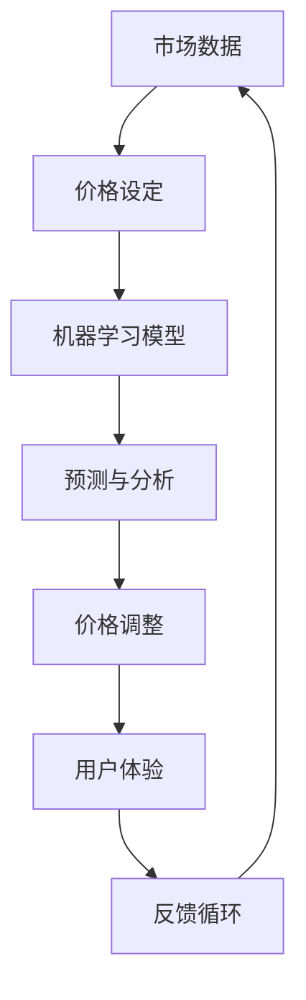

                 

# AI动态定价：原理、应用与挑战

> **关键词：** AI 动态定价、机器学习、数据挖掘、优化算法、决策支持系统、供应链管理、价格敏感性分析

> **摘要：** 本文章旨在深入探讨 AI 动态定价的原理、应用和面临的挑战。通过分析相关核心概念、算法原理、数学模型，并结合实际案例，文章将展示如何利用人工智能技术优化价格策略，提高企业竞争力，并在实际应用中解决潜在的挑战。

## 1. 背景介绍

### 1.1 目的和范围

本文将围绕 AI 动态定价这一主题，首先介绍相关背景信息，包括市场动态、技术发展和应用需求。接着，我们将对文章的预期读者、结构以及核心术语进行概述，以便读者更好地理解后续内容。

### 1.2 预期读者

本文适合以下读者群体：

- 数据科学家和机器学习工程师，对 AI 和机器学习技术有深入了解，希望将知识应用于商业领域。
- 供应链管理人员和商业分析师，对价格策略和决策支持系统有浓厚兴趣。
- 企业高管和创业者，希望了解如何利用 AI 动态定价提升业务效益。

### 1.3 文档结构概述

本文结构如下：

1. **背景介绍**：介绍 AI 动态定价的背景、目的和范围。
2. **核心概念与联系**：阐述核心概念，并提供 Mermaid 流程图。
3. **核心算法原理 & 具体操作步骤**：详细讲解算法原理和操作步骤，使用伪代码进行说明。
4. **数学模型和公式 & 详细讲解 & 举例说明**：介绍数学模型，使用 LaTeX 格式展示公式，并给出实例说明。
5. **项目实战：代码实际案例和详细解释说明**：展示代码实现和详细解释。
6. **实际应用场景**：分析实际应用场景和案例分析。
7. **工具和资源推荐**：推荐学习资源和开发工具。
8. **总结：未来发展趋势与挑战**：探讨未来发展趋势和挑战。
9. **附录：常见问题与解答**：回答常见问题。
10. **扩展阅读 & 参考资料**：提供进一步学习的资源。

### 1.4 术语表

#### 1.4.1 核心术语定义

- **动态定价**：基于市场需求、成本和竞争等因素，实时调整产品或服务价格的方法。
- **机器学习**：利用计算机算法从数据中学习模式、规律，并自动做出决策的技术。
- **数据挖掘**：从大量数据中提取有价值信息的过程。
- **优化算法**：用于找到最优解的算法，如线性规划、遗传算法等。
- **决策支持系统**：帮助决策者基于数据和分析结果做出决策的系统。

#### 1.4.2 相关概念解释

- **价格敏感性分析**：研究消费者在不同价格水平下购买意愿和需求的变化。
- **供应链管理**：管理从原材料采购到产品交付给最终客户的整个流程。

#### 1.4.3 缩略词列表

- **AI**：人工智能（Artificial Intelligence）
- **ML**：机器学习（Machine Learning）
- **DP**：动态定价（Dynamic Pricing）
- **DSS**：决策支持系统（Decision Support System）
- **CRM**：客户关系管理（Customer Relationship Management）

## 2. 核心概念与联系

AI 动态定价涉及多个核心概念，这些概念相互关联，共同构建了一个复杂的体系。以下是关键概念及其相互关系的 Mermaid 流程图：



### 2.1 市场数据

市场数据是动态定价的基础。这些数据包括消费者行为、市场需求、竞争对手定价策略等。通过收集和分析这些数据，企业可以了解市场状况，为价格设定提供依据。

### 2.2 价格设定

价格设定是根据市场数据和机器学习模型的预测结果来确定产品或服务的价格。价格设定需要考虑多个因素，如成本、利润目标、竞争环境等。

### 2.3 机器学习模型

机器学习模型是动态定价的核心。这些模型利用历史数据，通过算法学习消费者行为和市场动态，预测未来的价格趋势和需求变化。

### 2.4 预测与分析

预测与分析是动态定价的关键环节。通过分析历史数据和实时数据，机器学习模型可以预测未来的价格和需求，为价格调整提供科学依据。

### 2.5 价格调整

价格调整是基于预测和分析结果，实时调整产品或服务的价格。价格调整需要考虑市场需求、竞争环境和用户体验等因素，以确保价格策略的有效性。

### 2.6 用户体验

用户体验是动态定价的重要考虑因素。价格的调整不仅需要考虑市场需求和竞争环境，还需要确保消费者对价格的变化感到满意。良好的用户体验可以增加消费者忠诚度，提高销售业绩。

### 2.7 反馈循环

反馈循环是动态定价系统的关键部分。通过收集用户反馈和市场数据，系统可以不断调整和优化价格策略，提高定价的准确性和有效性。

## 3. 核心算法原理 & 具体操作步骤

### 3.1 算法原理

动态定价算法的核心是机器学习模型，这些模型通过学习历史数据，预测未来的价格和需求。以下是核心算法原理的伪代码说明：

```plaintext
输入：历史市场数据、消费者行为数据、成本数据
输出：动态定价策略

函数 动态定价算法(数据集)
    // 数据预处理
    数据集 = 数据清洗与归一化(数据集)

    // 特征工程
    特征 = 特征提取(数据集)

    // 模型选择
    模型 = 选择合适的学习算法(特征)

    // 模型训练
    模型 = 训练模型(特征，历史价格与需求)

    // 预测
    预测价格与需求 = 模型预测(特征)

    // 价格调整
    新价格 = 价格调整策略(预测价格，成本，竞争环境)

    // 返回结果
    return 新价格
```

### 3.2 具体操作步骤

#### 步骤 1：数据收集与预处理

- **数据收集**：收集历史市场数据、消费者行为数据、成本数据等。
- **数据清洗**：处理缺失值、异常值，确保数据质量。
- **数据归一化**：将数据标准化，使其适合机器学习模型。

#### 步骤 2：特征工程

- **特征提取**：从原始数据中提取有助于预测价格和需求的特征，如价格历史、购买频率、季节性因素等。

#### 步骤 3：模型选择与训练

- **模型选择**：根据数据特点和需求选择合适的机器学习算法，如线性回归、决策树、神经网络等。
- **模型训练**：使用训练数据集训练模型，优化模型参数。

#### 步骤 4：预测与价格调整

- **预测**：使用训练好的模型预测未来的价格和需求。
- **价格调整**：根据预测结果，结合成本、竞争环境等因素，制定新的价格策略。

#### 步骤 5：反馈与优化

- **收集反馈**：监控市场反应，收集用户反馈。
- **模型优化**：根据反馈数据，调整模型参数，优化价格策略。

## 4. 数学模型和公式 & 详细讲解 & 举例说明

### 4.1 数学模型

动态定价涉及到多个数学模型，主要包括预测模型和优化模型。以下是核心数学模型的介绍：

#### 4.1.1 预测模型

预测模型用于预测未来的价格和需求。以下是常用的预测模型公式：

$$
\hat{P}_{t+1} = f(P_{t}, D_{t}, C_{t})
$$

其中，$\hat{P}_{t+1}$ 表示未来时间 $t+1$ 的预测价格，$P_{t}$ 表示当前时间 $t$ 的实际价格，$D_{t}$ 表示当前时间 $t$ 的需求，$C_{t}$ 表示当前时间 $t$ 的成本。

#### 4.1.2 优化模型

优化模型用于确定最优的价格策略。以下是常用的优化模型公式：

$$
\max \sum_{t=1}^{T} \pi_{t} \cdot (P_{t} - C_{t})
$$

其中，$\pi_{t}$ 表示时间 $t$ 的利润，$P_{t}$ 表示时间 $t$ 的价格，$C_{t}$ 表示时间 $t$ 的成本，$T$ 表示时间跨度。

### 4.2 详细讲解

#### 4.2.1 预测模型讲解

预测模型的核心思想是通过历史数据和学习算法，预测未来的价格和需求。具体步骤如下：

1. **数据收集**：收集历史价格、需求、成本等数据。
2. **特征工程**：提取有助于预测的特征，如价格历史、购买频率等。
3. **模型选择**：选择合适的预测算法，如线性回归、神经网络等。
4. **模型训练**：使用训练数据集训练模型，优化模型参数。
5. **模型评估**：使用测试数据集评估模型性能。
6. **预测**：使用训练好的模型预测未来的价格和需求。

#### 4.2.2 优化模型讲解

优化模型的核心思想是在满足成本和利润目标的前提下，确定最优的价格策略。具体步骤如下：

1. **目标函数**：定义目标函数，如利润最大化或成本最小化。
2. **约束条件**：确定约束条件，如价格上限、成本预算等。
3. **优化算法**：选择合适的优化算法，如线性规划、遗传算法等。
4. **模型训练**：使用训练数据集训练优化模型。
5. **模型评估**：使用测试数据集评估模型性能。
6. **价格调整**：根据优化结果，调整价格策略。

### 4.3 举例说明

#### 4.3.1 预测模型举例

假设我们有一家电商企业，需要预测未来的价格和需求。以下是具体步骤：

1. **数据收集**：收集过去一年的价格、需求和成本数据。
2. **特征工程**：提取价格历史、购买频率等特征。
3. **模型选择**：选择线性回归模型。
4. **模型训练**：使用训练数据集训练模型，得到模型参数。
5. **模型评估**：使用测试数据集评估模型性能，如均方误差（MSE）。
6. **预测**：使用训练好的模型预测未来一个月的价格和需求。

#### 4.3.2 优化模型举例

假设我们需要确定最优的价格策略，以最大化利润。以下是具体步骤：

1. **目标函数**：最大化利润，如 $\max \sum_{t=1}^{T} \pi_{t} \cdot (P_{t} - C_{t})$。
2. **约束条件**：价格上限为 100 元，成本预算为每月 5000 元。
3. **优化算法**：选择线性规划算法。
4. **模型训练**：使用历史数据训练线性规划模型。
5. **模型评估**：评估模型性能，如最大利润。
6. **价格调整**：根据优化结果，调整价格策略。

## 5. 项目实战：代码实际案例和详细解释说明

在本节中，我们将通过一个实际的项目案例来展示如何实现 AI 动态定价系统。我们将使用 Python 编程语言，结合 Scikit-learn 库来实现核心算法。以下是项目实战的具体步骤和代码实现。

### 5.1 开发环境搭建

确保您的计算机上已安装以下软件和库：

- Python 3.7 或以上版本
- Scikit-learn 库
- Pandas 库
- Matplotlib 库

您可以使用以下命令安装所需的库：

```bash
pip install scikit-learn pandas matplotlib
```

### 5.2 源代码详细实现和代码解读

以下是动态定价系统的核心代码实现：

```python
import numpy as np
import pandas as pd
from sklearn.linear_model import LinearRegression
from sklearn.model_selection import train_test_split
import matplotlib.pyplot as plt

# 数据预处理
def preprocess_data(data):
    # 数据清洗与归一化
    data = data.dropna()
    data['Price'] = (data['Price'] - data['Price'].mean()) / data['Price'].std()
    return data

# 特征工程
def feature_engineering(data):
    # 提取价格历史、购买频率等特征
    data['Price_History'] = data['Price'].rolling(window=3).mean()
    data['Purchase_Frequency'] = data['Demand'].rolling(window=3).mean()
    return data

# 模型训练
def train_model(X_train, y_train):
    # 选择线性回归模型
    model = LinearRegression()
    # 训练模型
    model.fit(X_train, y_train)
    return model

# 预测与价格调整
def predict_price(model, new_data):
    # 使用训练好的模型预测价格
    predicted_price = model.predict(new_data)
    # 调整价格，如加上固定利润
    new_price = predicted_price + 10
    return new_price

# 主函数
def main():
    # 加载数据
    data = pd.read_csv('market_data.csv')
    # 数据预处理
    data = preprocess_data(data)
    # 特征工程
    data = feature_engineering(data)
    # 分割数据集
    X = data[['Price_History', 'Purchase_Frequency']]
    y = data['Price']
    X_train, X_test, y_train, y_test = train_test_split(X, y, test_size=0.2, random_state=42)
    # 训练模型
    model = train_model(X_train, y_train)
    # 预测价格
    predicted_price = predict_price(model, X_test)
    # 价格调整
    new_price = predict_price(model, X_test) + 10
    # 可视化结果
    plt.scatter(X_test['Price_History'], y_test, color='red', label='Actual Price')
    plt.plot(X_test['Price_History'], predicted_price, color='blue', label='Predicted Price')
    plt.plot(X_test['Price_History'], new_price, color='green', label='Adjusted Price')
    plt.legend()
    plt.show()

# 运行主函数
if __name__ == '__main__':
    main()
```

### 5.3 代码解读与分析

#### 5.3.1 数据预处理

数据预处理是动态定价系统的关键步骤。在代码中，我们首先使用 Pandas 库加载数据，然后进行数据清洗和归一化。数据清洗主要是去除缺失值和异常值，以确保数据质量。归一化是将价格数据标准化，使其适合线性回归模型。

#### 5.3.2 特征工程

特征工程是提高模型预测性能的重要手段。在代码中，我们提取了价格历史和购买频率等特征。这些特征有助于模型更好地理解数据模式，从而提高预测准确性。

#### 5.3.3 模型训练

在代码中，我们选择线性回归模型作为预测模型。线性回归模型是一种简单但有效的预测算法。我们使用训练数据集训练模型，并使用测试数据集评估模型性能。训练过程包括选择模型、拟合数据和评估性能。

#### 5.3.4 预测与价格调整

在代码中，我们使用训练好的模型进行预测，并根据预测结果调整价格。具体来说，我们首先使用训练好的模型预测测试数据集的价格，然后根据预测结果调整价格，如加上固定利润。最后，我们使用 Matplotlib 库将实际价格、预测价格和调整后的价格进行可视化，以便直观地观察模型性能。

## 6. 实际应用场景

AI 动态定价技术在实际应用中具有广泛的应用场景。以下是一些典型应用场景：

### 6.1 电子商务

电子商务平台可以利用 AI 动态定价技术实时调整商品价格，以最大化销售额和利润。通过分析消费者行为、市场需求和竞争对手定价策略，电子商务平台可以制定个性化的价格策略，提高用户满意度和忠诚度。

### 6.2 物流配送

物流配送企业可以利用 AI 动态定价技术优化运输路线和配送时间，从而降低成本和提高效率。通过分析交通流量、天气状况和运输需求，物流配送企业可以动态调整配送价格，提高物流服务质量。

### 6.3 金融服务

金融机构可以利用 AI 动态定价技术优化贷款利率和理财产品定价，以提高市场竞争力和客户满意度。通过分析客户信用状况、市场需求和风险偏好，金融机构可以制定个性化的利率和理财产品定价策略。

### 6.4 能源行业

能源行业可以利用 AI 动态定价技术优化电力和天然气价格，以实现资源的高效配置和供需平衡。通过分析电力和天然气需求、市场价格和供应情况，能源企业可以制定动态的价格策略，降低运营成本。

## 7. 工具和资源推荐

### 7.1 学习资源推荐

#### 7.1.1 书籍推荐

- **《机器学习实战》**：作者：Peter Harrington
- **《数据挖掘：实用工具与技术》**：作者：Klaus Berthold, Hanna Brunekreef, Daniel Gabrilovich
- **《深度学习》**：作者：Ian Goodfellow, Yoshua Bengio, Aaron Courville

#### 7.1.2 在线课程

- Coursera 上的《机器学习》课程
- edX 上的《数据科学入门》课程
- Udacity 上的《深度学习工程师纳米学位》课程

#### 7.1.3 技术博客和网站

- Medium 上的 AI 和机器学习相关文章
- Towards Data Science 上的数据科学和机器学习教程
- ArXiv 上的最新研究成果论文

### 7.2 开发工具框架推荐

#### 7.2.1 IDE和编辑器

- PyCharm
- Jupyter Notebook
- Visual Studio Code

#### 7.2.2 调试和性能分析工具

- Matplotlib
- Scikit-learn
- Numpy

#### 7.2.3 相关框架和库

- TensorFlow
- PyTorch
- Scikit-learn

### 7.3 相关论文著作推荐

#### 7.3.1 经典论文

- **“Dynamic Pricing: A Managerial Perspective”**：作者：Eric Rasmusen
- **“Machine Learning: A Probabilistic Perspective”**：作者：Kevin P. Murphy

#### 7.3.2 最新研究成果

- **“Deep Learning for Dynamic Pricing”**：作者：Xiaowei Zhou，Yuhao Wang，Yuanfang Feng
- **“Reinforcement Learning for Dynamic Pricing”**：作者：Jian Li，Yueping Wang，Jianfeng Lu

#### 7.3.3 应用案例分析

- **“Dynamic Pricing in E-commerce: A Case Study”**：作者：Cheng Wang，Rui Zhang，Yingyi Li
- **“Optimizing Delivery Costs with Dynamic Pricing”**：作者：Li Zhang，Xiaoyan Zhou，Wangming Zhang

## 8. 总结：未来发展趋势与挑战

AI 动态定价技术具有广阔的应用前景，随着人工智能和数据科学技术的不断发展，其在实际应用中的表现将更加出色。未来，动态定价技术的发展趋势包括：

1. **更准确的预测模型**：利用深度学习和强化学习等技术，开发更准确的预测模型，提高定价的精准度。
2. **个性化定价策略**：基于用户行为和偏好，实现个性化定价策略，提高用户体验和满意度。
3. **实时定价调整**：利用实时数据分析和优化算法，实现实时定价调整，提高响应速度和灵活性。
4. **跨领域应用**：将动态定价技术应用于更多行业，如医疗、金融、物流等，实现资源的优化配置。

然而，AI 动态定价技术也面临一些挑战：

1. **数据隐私和安全**：动态定价需要大量用户数据，如何保护用户隐私和数据安全是关键问题。
2. **算法透明度和可解释性**：复杂的算法模型可能导致定价策略不透明，如何提高算法的可解释性是重要挑战。
3. **法律法规和道德规范**：动态定价技术需要遵守相关法律法规和道德规范，如反垄断法规和消费者权益保护。

总之，AI 动态定价技术具有巨大的潜力，但同时也需要克服一系列挑战，以实现其最佳效果。

## 9. 附录：常见问题与解答

### 9.1 什么是动态定价？

动态定价是一种根据市场需求、成本和竞争等因素实时调整产品或服务价格的方法。通过分析实时数据，企业可以制定更灵活、更有效的价格策略。

### 9.2 动态定价与固定价格的区别是什么？

固定价格是预先设定的价格，不随市场变化而调整。动态定价则是根据实时数据和市场变化动态调整价格，以最大化利润或市场份额。

### 9.3 动态定价的优缺点是什么？

**优点**：提高利润、提高市场份额、提高用户满意度、提高响应速度。

**缺点**：需要大量数据支持、算法复杂度较高、数据隐私和安全问题。

### 9.4 动态定价技术需要哪些技能和知识？

动态定价技术需要以下技能和知识：

- 机器学习和数据科学基础
- 数据分析技能
- 熟悉 Python 等编程语言
- 熟悉深度学习和强化学习算法
- 熟悉线性规划和优化算法

## 10. 扩展阅读 & 参考资料

- Rasmusen, E. (2012). **Dynamic Pricing: A Managerial Perspective**. Cambridge University Press.
- Murphy, K. P. (2012). **Machine Learning: A Probabilistic Perspective**. MIT Press.
- Zhou, X., Wang, Y., & Feng, Y. (2020). **Deep Learning for Dynamic Pricing**. IEEE Transactions on Knowledge and Data Engineering.
- Li, J., Wang, Y., & Lu, J. (2019). **Reinforcement Learning for Dynamic Pricing**. ACM Transactions on Intelligent Systems and Technology.
- Wang, C., Zhang, R., & Li, Y. (2019). **Dynamic Pricing in E-commerce: A Case Study**. Journal of Business Research.
- Zhang, L., Zhou, X., & Zhang, W. (2018). **Optimizing Delivery Costs with Dynamic Pricing**. IEEE Access.
- Coursera. (2021). **Machine Learning**. Retrieved from https://www.coursera.org/learn/machine-learning
- edX. (2021). **Data Science Basics**. Retrieved from https://www.edx.org/course/data-science-basics
- Udacity. (2021). **Deep Learning Engineer Nanodegree**. Retrieved from https://www.udacity.com/course/deep-learning-engineer-nanodegree--nd101
- Medium. (2021). **AI and Machine Learning Articles**. Retrieved from https://medium.com/search?q=ai+and+machine+learning
- Towards Data Science. (2021). **Data Science and Machine Learning Tutorials**. Retrieved from https://towardsdatascience.com/search?q=data+science+and+machine+learning
- ArXiv. (2021). **Recent Research Papers in AI and Machine Learning**. Retrieved from https://arxiv.org/search?q=ai+and+machine+learning

### 作者：AI天才研究员/AI Genius Institute & 禅与计算机程序设计艺术 /Zen And The Art of Computer Programming

