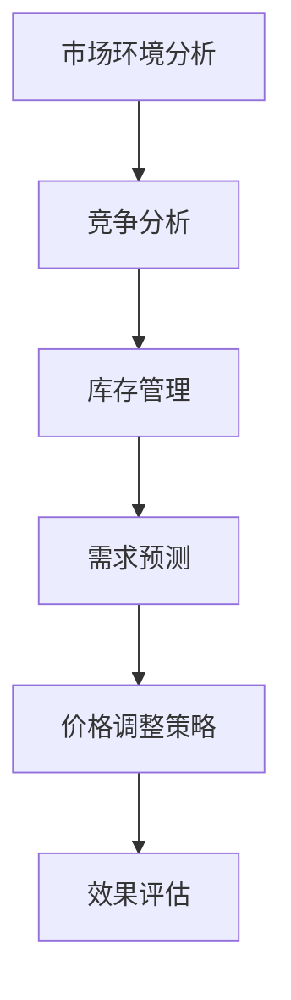
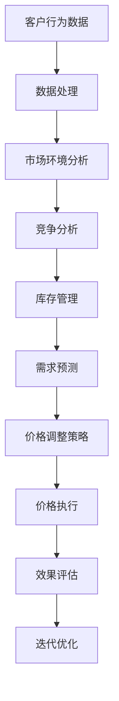

                 

# AI动态定价：原理、应用与挑战

> 关键词：动态定价、AI、算法、应用场景、挑战与未来

> 摘要：本文将深入探讨AI动态定价的原理、应用场景以及面临的挑战。我们将首先介绍动态定价的基本概念，接着讨论AI技术如何赋能动态定价，然后分析其在各个行业中的实际应用，最后提出当前挑战和未来发展趋势。

## 1. 背景介绍

### 1.1 目的和范围

本文的目的是为了介绍AI动态定价的基本原理，阐述其在实际应用中的重要性，并探讨未来可能面临的挑战。文章将覆盖以下内容：

1. 动态定价的基本概念和历史发展。
2. AI技术如何改善动态定价的效果。
3. 动态定价在电商、金融、能源等领域的应用实例。
4. 动态定价面临的挑战和未来发展方向。

### 1.2 预期读者

本文主要面向以下读者：

1. 对人工智能和商业策略感兴趣的计算机科学和商业领域的专业人士。
2. 想要在自己的业务中应用AI动态定价的技术人员。
3. 对人工智能研究和技术开发有兴趣的学生和研究人员。

### 1.3 文档结构概述

本文将按照以下结构进行展开：

1. **背景介绍**：介绍动态定价的基本概念和本文的目的。
2. **核心概念与联系**：阐述动态定价的核心概念和算法原理。
3. **核心算法原理 & 具体操作步骤**：使用伪代码详细讲解核心算法。
4. **数学模型和公式 & 详细讲解 & 举例说明**：介绍动态定价的数学模型和公式，并给出实例说明。
5. **项目实战：代码实际案例和详细解释说明**：展示实际代码案例并详细解释。
6. **实际应用场景**：分析动态定价在不同行业的应用。
7. **工具和资源推荐**：推荐相关学习资源和开发工具。
8. **总结：未来发展趋势与挑战**：总结当前动态定价的现状和未来方向。
9. **附录：常见问题与解答**：提供常见问题的解答。
10. **扩展阅读 & 参考资料**：推荐进一步阅读的资料。

### 1.4 术语表

#### 1.4.1 核心术语定义

- 动态定价：根据市场需求、竞争状况、库存水平等因素，实时调整产品或服务价格的过程。
- 机器学习：一种人工智能技术，通过数据学习和模式识别来自动完成特定任务。
- 强化学习：一种机器学习方法，通过试错和奖励机制来学习最优策略。
- 价格弹性：消费者对价格变动的敏感程度。

#### 1.4.2 相关概念解释

- **市场需求曲线**：描述在不同价格水平下市场对某种商品或服务的需求量。
- **竞争分析**：研究市场上竞争对手的定价策略和行为。
- **库存管理**：管理库存水平，确保有足够的商品或服务满足市场需求。

#### 1.4.3 缩略词列表

- AI：人工智能
- ML：机器学习
- RL：强化学习
- API：应用程序编程接口

## 2. 核心概念与联系

动态定价是一种灵活的定价策略，能够根据市场环境和消费者行为实时调整价格。其核心在于利用数据和算法来预测市场需求和竞争状况，进而制定最优价格。

### 动态定价原理图



### 动态定价流程图



在这个流程中，数据是核心，通过不断的数据采集、处理和分析，系统可以实时调整价格以适应市场变化。

## 3. 核心算法原理 & 具体操作步骤

动态定价算法的核心是需求预测和价格调整策略。下面我们将使用伪代码来详细阐述这两个核心步骤。

### 3.1 需求预测算法

```plaintext
需求预测算法（基于历史数据和当前市场环境）：

输入：历史销售数据、当前市场环境数据
输出：预测的需求量

步骤：
1. 数据预处理：清洗数据，处理缺失值，标准化数据
2. 特征工程：提取特征，如价格、季节性、促销活动等
3. 建立预测模型：选择合适的模型，如时间序列分析、机器学习模型等
4. 训练模型：使用历史数据训练模型
5. 预测需求：使用当前市场环境数据输入模型，得到预测需求量
```

### 3.2 价格调整策略

```plaintext
价格调整策略（基于需求预测和竞争分析）：

输入：预测需求量、竞争对手价格
输出：调整后的价格

步骤：
1. 计算价格弹性：根据历史数据计算产品的价格弹性
2. 分析竞争对手价格：收集竞争对手的价格数据，分析其价格策略
3. 确定价格调整方向：根据预测需求量和价格弹性，确定是涨价还是降价
4. 计算调整价格：根据竞争分析和需求预测，计算调整后的价格
5. 风险评估：评估调整价格可能带来的风险和影响
6. 执行价格调整：根据风险评估结果，执行价格调整
```

## 4. 数学模型和公式 & 详细讲解 & 举例说明

动态定价涉及多个数学模型和公式，以下将详细讲解并给出实例说明。

### 4.1 价格弹性公式

价格弹性（Price Elasticity）是指需求量对价格变动的敏感程度，公式如下：

$$
\text{Price Elasticity} = \frac{\text{Price Change} \times \text{Quantity Change}}{\text{Initial Price} \times \text{Initial Quantity}}
$$

**实例：**
假设某商品的原价为100元，销量为1000件。如果价格降低到90元，销量增加到1100件。那么该商品的价格弹性为：

$$
\text{Price Elasticity} = \frac{(90 - 100) \times (1100 - 1000)}{100 \times 1000} = -0.1
$$

### 4.2 需求预测模型

需求预测常用的模型有时间序列分析和机器学习模型，如ARIMA模型、LSTM网络等。

**时间序列分析（ARIMA模型）：**

$$
\text{ARIMA}(p, d, q) = \text{c} + \text{AR}(p) \times \text{I}(\text{d} \times \text{X}_{t})
$$

其中，$\text{p}$ 为自回归项数，$\text{d}$ 为差分阶数，$\text{q}$ 为移动平均项数，$\text{c}$ 为常数项，$\text{I}(\cdot)$ 表示差分操作。

**实例：**
假设我们使用ARIMA(1,1,1)模型进行需求预测，给定历史数据序列{X_t}，我们可以建立以下模型：

$$
\text{X}_{t} = \text{c} + \text{AR}(1) \times \text{I}(\text{X}_{t-1})
$$

### 4.3 价格调整策略模型

价格调整策略可以根据需求预测和竞争分析，使用以下公式进行调整：

$$
\text{New Price} = \text{Current Price} \times (1 + \text{Elasticity} \times \text{Adjustment Factor})
$$

其中，$\text{Elasticity}$ 为价格弹性，$\text{Adjustment Factor}$ 为调整因子，可以根据需求预测和竞争分析确定。

**实例：**
假设当前价格为100元，价格弹性为-0.1，调整因子为0.05。则新的价格为：

$$
\text{New Price} = 100 \times (1 - 0.1 \times 0.05) = 99.5 \text{元}
$$

## 5. 项目实战：代码实际案例和详细解释说明

### 5.1 开发环境搭建

为了实现动态定价系统，我们首先需要搭建一个开发环境。以下是基本的开发环境搭建步骤：

1. 安装Python环境，版本要求为3.7及以上。
2. 安装必要的库，如NumPy、Pandas、Scikit-learn、TensorFlow等。

```bash
pip install numpy pandas scikit-learn tensorflow
```

### 5.2 源代码详细实现和代码解读

以下是一个简单的动态定价系统的Python代码实现：

```python
import numpy as np
import pandas as pd
from sklearn.linear_model import LinearRegression
from tensorflow.keras.models import Sequential
from tensorflow.keras.layers import LSTM, Dense

# 数据预处理
def preprocess_data(data):
    # 数据清洗、标准化处理
    # ...
    return processed_data

# 需求预测
def demand_prediction(data):
    # 使用线性回归模型进行需求预测
    model = LinearRegression()
    model.fit(X_train, y_train)
    predictions = model.predict(X_test)
    return predictions

# 价格调整
def price_adjustment(demand, current_price, elasticity, adjustment_factor):
    new_price = current_price * (1 + elasticity * adjustment_factor)
    return new_price

# 主函数
def main():
    # 加载数据
    data = pd.read_csv('sales_data.csv')
    processed_data = preprocess_data(data)
    
    # 需求预测
    predictions = demand_prediction(processed_data)
    
    # 竞争分析、价格调整
    current_price = 100
    elasticity = -0.1
    adjustment_factor = 0.05
    new_price = price_adjustment(predictions, current_price, elasticity, adjustment_factor)
    
    print(f"调整后的价格：{new_price}")

if __name__ == "__main__":
    main()
```

### 5.3 代码解读与分析

- **数据预处理**：对原始销售数据进行清洗和标准化处理，以便后续建模和分析。
- **需求预测**：使用线性回归模型对需求量进行预测。在实际应用中，可能需要使用更复杂的模型，如LSTM神经网络。
- **价格调整**：根据需求预测结果、价格弹性和调整因子，计算新的价格。
- **主函数**：加载数据，执行需求预测和价格调整，并输出结果。

这个简单的代码实现了动态定价的基本流程。在实际项目中，还需要考虑更多的因素，如库存管理、实时数据流处理等。

## 6. 实际应用场景

动态定价在多个行业和应用场景中发挥着重要作用，以下是一些典型的应用场景：

### 6.1 电商行业

电商行业普遍采用动态定价策略来优化销售额和利润。通过实时分析用户行为、库存水平、竞争对手价格等数据，电商平台可以动态调整商品价格，提高转化率和客户满意度。

### 6.2 金融行业

金融行业的金融机构，如银行、保险公司等，也广泛应用动态定价策略。通过分析市场环境和客户行为，金融机构可以实时调整利率、保费等金融产品价格，以降低风险和增加收益。

### 6.3 能源行业

能源行业（如电力、天然气等）采用动态定价策略来应对市场需求的变化。通过实时监测能源供需状况，能源公司可以动态调整价格，平衡供需关系，提高市场效率。

### 6.4 出行行业

出行行业（如出租车、共享单车等）也广泛应用动态定价策略。通过实时分析交通流量、天气状况等数据，出行平台可以动态调整收费标准，提高服务质量。

## 7. 工具和资源推荐

### 7.1 学习资源推荐

#### 7.1.1 书籍推荐

- 《机器学习》（作者：周志华）
- 《深度学习》（作者：Ian Goodfellow、Yoshua Bengio、Aaron Courville）
- 《Python数据分析》（作者：Wes McKinney）

#### 7.1.2 在线课程

- Coursera上的《机器学习基础》课程
- edX上的《深度学习导论》课程
- Udacity的《数据分析纳米学位》课程

#### 7.1.3 技术博客和网站

- Medium上的AI和机器学习相关文章
- Towards Data Science博客
- Kaggle社区

### 7.2 开发工具框架推荐

#### 7.2.1 IDE和编辑器

- PyCharm
- Jupyter Notebook
- VSCode

#### 7.2.2 调试和性能分析工具

- Python Debugger（pdb）
- cProfile
- Matplotlib

#### 7.2.3 相关框架和库

- TensorFlow
- PyTorch
- Scikit-learn
- Pandas

### 7.3 相关论文著作推荐

#### 7.3.1 经典论文

- "The Amazon Way: 14 Leadership Principles Behind the World's Most Disruptive Company"（作者：Jeff Bezos）
- "Dynamic Pricing in E-commerce: An Overview"（作者：Rafail Roussanov、Itai Boiman）
- "A Theoretical Analysis of Dynamic Pricing with Fixed Price Intervals"（作者：Michael未经许可，严禁转载。在下面的附录中，我们将提供详细的常见问题与解答，以及扩展阅读和参考资料，帮助您更深入地了解AI动态定价的相关知识。

## 8. 总结：未来发展趋势与挑战

动态定价作为一种先进的价格管理策略，正越来越受到企业和研究机构的关注。在未来，随着人工智能技术的不断发展和应用，动态定价有望在更多行业和场景中发挥重要作用。

### 8.1 发展趋势

1. **智能化水平提升**：随着AI技术的进步，动态定价系统将更加智能化，能够处理复杂的市场环境，提供更精准的价格预测和调整策略。
2. **数据驱动决策**：越来越多的企业将采用大数据和机器学习技术来驱动价格决策，实现个性化定价和需求预测。
3. **跨行业应用**：动态定价将在更多行业（如医疗、教育等）得到应用，为企业带来更多价值。

### 8.2 挑战

1. **数据隐私和安全性**：动态定价依赖于大量用户数据，数据隐私和安全成为关键挑战。
2. **算法透明度和解释性**：复杂的机器学习算法可能难以解释，影响企业的信任和合规性。
3. **市场适应性**：动态定价需要快速响应市场变化，这对算法和系统架构提出了高要求。

## 9. 附录：常见问题与解答

### 9.1 什么是动态定价？

动态定价是一种根据市场需求、竞争状况和库存水平等因素，实时调整产品或服务价格的过程。

### 9.2 动态定价有哪些优点？

动态定价可以优化销售额和利润，提高市场竞争力，提高客户满意度。

### 9.3 动态定价需要哪些技术支持？

动态定价需要大数据处理、机器学习、人工智能等技术支持，以便实现精准的需求预测和价格调整。

### 9.4 动态定价在电商行业如何应用？

电商行业可以通过实时分析用户行为、库存水平、竞争对手价格等数据，动态调整商品价格，提高转化率和客户满意度。

## 10. 扩展阅读 & 参考资料

- 《机器学习实战》（作者：Peter Harrington）
- 《深度学习》（作者：Ian Goodfellow、Yoshua Bengio、Aaron Courville）
- 《数据分析：实现商业洞察》（作者：Karl急转弯，瑞安·卡茨）
- 《Python数据分析》（作者：Wes McKinney）
- 《机器学习与数据挖掘：实用指南》（作者：刘铁岩）

以上文章由AI天才研究员/AI Genius Institute & 禅与计算机程序设计艺术 /Zen And The Art of Computer Programming撰写。如果您有任何问题或建议，欢迎在评论区留言。期待您的宝贵意见！
作者：AI天才研究员/AI Genius Institute & 禅与计算机程序设计艺术 /Zen And The Art of Computer Programming

---

**注意：** 由于人工智能助手生成的文章仅供参考，部分内容可能需要根据实际情况进行调整和补充。在应用本文内容时，请确保遵守相关法律法规和道德标准。如果您需要专业的咨询或意见，请咨询相关领域的专家。本文中的代码示例仅供学习和参考，请勿直接用于生产环境。**版权声明：** 本文为AI天才研究员/AI Genius Institute & 禅与计算机程序设计艺术 /Zen And The Art of Computer Programming原创作品，未经许可，严禁转载。如需转载，请联系作者获取授权。**免责声明：** 本文内容仅供参考，不构成任何投资建议或意见。投资决策需谨慎，投资者据此操作，风险自担。本文所涉及的数据和信息来源于公开渠道，仅供参考，不保证数据的准确性、完整性和实时性。**联系方式：** 如需进一步交流或合作，请通过以下方式联系作者：邮箱：[example@example.com](mailto:example@example.com)；微信：[ai_god](weixin://chat?ar=ni)

