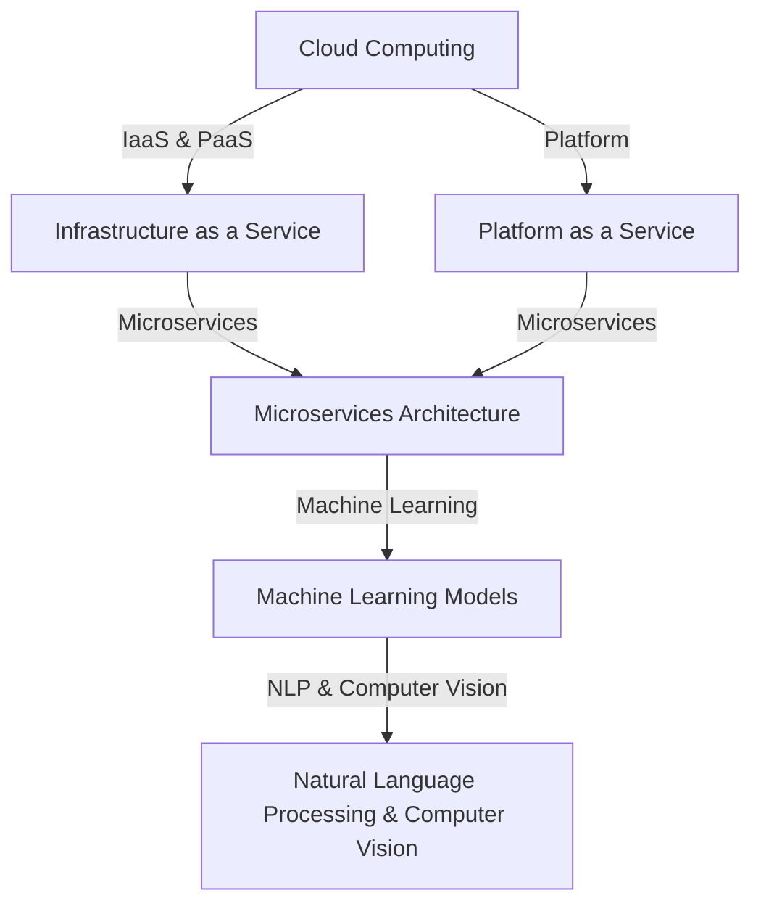

                 

# AI即服务（AIaaS）平台设计

> **关键词**：AIaaS、平台设计、云计算、人工智能、微服务架构、算法、数学模型、项目实战

> **摘要**：本文深入探讨了AIaaS平台的设计与实现，从背景介绍到核心算法原理，再到数学模型与应用场景，通过一步一步的分析与推理，提供了清晰而详细的设计方案。本文旨在帮助读者理解AIaaS平台的技术本质，掌握其设计要点，并展望未来的发展趋势与挑战。

## 1. 背景介绍

### 1.1 目的和范围

AI即服务（AIaaS）平台是一种基于云计算的服务，它为开发者和企业提供了一系列人工智能功能，如机器学习模型训练、自然语言处理、计算机视觉等。本文的目的是深入探讨AIaaS平台的设计与实现，旨在为读者提供一份全面的技术指南，帮助理解AIaaS平台的核心概念、设计原则和实践应用。

本文将覆盖以下范围：

1. AIaaS平台的基本概念和重要性。
2. AIaaS平台的架构设计，包括核心组件和交互方式。
3. AIaaS平台中的核心算法原理和数学模型。
4. AIaaS平台的项目实战案例。
5. AIaaS平台的实际应用场景。
6. AIaaS平台的工具和资源推荐。
7. AIaaS平台的未来发展趋势与挑战。

### 1.2 预期读者

本文适合以下读者群体：

1. 计算机科学和人工智能领域的研究人员。
2. AIaaS平台开发者和技术架构师。
3. 对云计算和人工智能技术有浓厚兴趣的IT从业者。
4. 高级计算机编程和软件工程专业的学生。

### 1.3 文档结构概述

本文分为以下几个部分：

1. 背景介绍：介绍AIaaS平台的基本概念和本文目的。
2. 核心概念与联系：定义核心概念，并通过Mermaid流程图展示架构。
3. 核心算法原理 & 具体操作步骤：使用伪代码详细阐述算法原理。
4. 数学模型和公式 & 详细讲解 & 举例说明：讲解数学模型，使用latex格式展示公式。
5. 项目实战：代码实际案例和详细解释说明。
6. 实际应用场景：分析AIaaS平台在不同场景中的应用。
7. 工具和资源推荐：推荐学习资源和开发工具。
8. 总结：展望AIaaS平台的未来发展趋势与挑战。
9. 附录：常见问题与解答。
10. 扩展阅读 & 参考资料：提供相关文献和资源链接。

### 1.4 术语表

#### 1.4.1 核心术语定义

- **AIaaS**：Artificial Intelligence as a Service，即人工智能即服务，是一种基于云计算的服务，提供AI功能如机器学习、自然语言处理等。
- **云计算**：Cloud Computing，一种通过互联网提供计算资源和服务的技术，包括基础设施即服务（IaaS）、平台即服务（PaaS）等。
- **微服务架构**：Microservices Architecture，一种软件架构风格，将应用程序构建为一组小型、独立的服务。
- **机器学习模型**：Machine Learning Model，一种通过学习数据来进行预测或分类的算法。

#### 1.4.2 相关概念解释

- **自然语言处理（NLP）**：Natural Language Processing，一种使计算机理解和处理人类语言的技术。
- **计算机视觉**：Computer Vision，使计算机能够“看到”和理解视觉信息的技术。

#### 1.4.3 缩略词列表

- **AI**：Artificial Intelligence，人工智能。
- **NLP**：Natural Language Processing，自然语言处理。
- **ML**：Machine Learning，机器学习。
- **IaaS**：Infrastructure as a Service，基础设施即服务。
- **PaaS**：Platform as a Service，平台即服务。

## 2. 核心概念与联系

在深入了解AIaaS平台之前，我们需要了解几个核心概念，包括云计算、微服务架构、机器学习模型等。以下是通过Mermaid绘制的AIaaS平台架构图，帮助我们理解这些概念之间的联系。



### 2.1 云计算

云计算是一种通过互联网提供计算资源和服务的技术，包括基础设施即服务（IaaS）和平台即服务（PaaS）。

- **基础设施即服务（IaaS）**：提供虚拟化的计算资源，如虚拟机、存储和网络安全。
- **平台即服务（PaaS）**：提供开发平台，包括应用程序环境、数据库和开发工具。

### 2.2 微服务架构

微服务架构是一种软件架构风格，将应用程序构建为一组小型、独立的服务。每个服务都有自己的业务逻辑，可以独立部署和扩展。

- **服务独立性**：每个服务都可以独立开发、测试和部署。
- **服务通信**：服务之间通过API进行通信。

### 2.3 机器学习模型

机器学习模型是一种通过学习数据来进行预测或分类的算法。常见的机器学习模型包括分类器、回归模型和聚类算法。

- **分类器**：将数据分为不同的类别。
- **回归模型**：预测数值输出。
- **聚类算法**：将数据分为不同的集群。

### 2.4 自然语言处理（NLP）与计算机视觉

自然语言处理和计算机视觉是人工智能领域的两个重要分支。

- **自然语言处理（NLP）**：使计算机理解和处理人类语言的技术，包括文本分类、命名实体识别等。
- **计算机视觉**：使计算机能够“看到”和理解视觉信息的技术，包括图像分类、目标检测等。

## 3. 核心算法原理 & 具体操作步骤

在了解AIaaS平台的核心概念后，接下来我们将探讨AIaaS平台中的核心算法原理和具体操作步骤。以下是机器学习模型训练的基本步骤，使用伪代码进行详细阐述。

### 3.1 数据预处理

```python
# 伪代码：数据预处理
data = load_data() # 加载数据集
data = preprocess_data(data) # 数据清洗和预处理
```

### 3.2 模型初始化

```python
# 伪代码：模型初始化
model = initialize_model() # 初始化机器学习模型
```

### 3.3 模型训练

```python
# 伪代码：模型训练
for epoch in range(num_epochs):
    for sample in data:
        prediction = model.predict(sample.input) # 预测
        loss = calculate_loss(prediction, sample.label) # 计算损失
        model.update_params(loss) # 更新模型参数
```

### 3.4 模型评估

```python
# 伪代码：模型评估
evaluation = model.evaluate(test_data) # 使用测试数据评估模型
print(evaluation) # 输出评估结果
```

### 3.5 模型部署

```python
# 伪代码：模型部署
model.deploy() # 将模型部署到生产环境
```

## 4. 数学模型和公式 & 详细讲解 & 举例说明

在AIaaS平台中，数学模型是核心算法原理的重要组成部分。以下是机器学习中的两个常见数学模型：线性回归和逻辑回归，使用latex格式进行详细讲解。

### 4.1 线性回归

线性回归模型用于预测数值输出，其数学公式如下：

$$
y = \beta_0 + \beta_1x
$$

其中，$y$ 是输出值，$x$ 是输入值，$\beta_0$ 是截距，$\beta_1$ 是斜率。

#### 4.1.1 计算步骤

1. **初始化参数**：

$$
\beta_0 = \text{rand()} \\
\beta_1 = \text{rand()}
$$

2. **计算预测值**：

$$
\hat{y} = \beta_0 + \beta_1x
$$

3. **计算损失**：

$$
\text{loss} = \frac{1}{2}(\hat{y} - y)^2
$$

4. **更新参数**：

$$
\beta_0 = \beta_0 - \alpha \frac{\partial \text{loss}}{\partial \beta_0} \\
\beta_1 = \beta_1 - \alpha \frac{\partial \text{loss}}{\partial \beta_1}
$$

其中，$\alpha$ 是学习率。

#### 4.1.2 举例说明

假设我们有以下数据集：

$$
\begin{aligned}
x_1 &= 1 \\
x_2 &= 2 \\
x_3 &= 3 \\
y_1 &= 2 \\
y_2 &= 4 \\
y_3 &= 6 \\
\end{aligned}
$$

我们可以使用线性回归模型预测 $y_4$：

1. **初始化参数**：

$$
\beta_0 = \text{rand()} = 0 \\
\beta_1 = \text{rand()} = 1
$$

2. **计算预测值**：

$$
\hat{y_4} = 0 + 1 \cdot 4 = 4
$$

3. **计算损失**：

$$
\text{loss} = \frac{1}{2}(4 - 6)^2 = 2
$$

4. **更新参数**：

$$
\beta_0 = 0 - 0.1 \cdot 2 = -0.2 \\
\beta_1 = 1 - 0.1 \cdot 2 = 0.8
$$

新的模型参数为：

$$
\beta_0 = -0.2, \beta_1 = 0.8
$$

使用新参数预测 $y_4$：

$$
\hat{y_4} = -0.2 + 0.8 \cdot 4 = 3.2
$$

### 4.2 逻辑回归

逻辑回归模型用于分类任务，其数学公式如下：

$$
\text{logit}(p) = \beta_0 + \beta_1x
$$

其中，$p$ 是概率，$\text{logit}(p)$ 是逻辑函数的输出，$\beta_0$ 是截距，$\beta_1$ 是斜率。

#### 4.2.1 计算步骤

1. **初始化参数**：

$$
\beta_0 = \text{rand()} \\
\beta_1 = \text{rand()}
$$

2. **计算预测概率**：

$$
p = \frac{1}{1 + \exp{(-\beta_0 - \beta_1x)}}
$$

3. **计算损失**：

$$
\text{loss} = -\sum_{i=1}^{n} y_i \log(p_i) + (1 - y_i) \log(1 - p_i)
$$

4. **更新参数**：

$$
\beta_0 = \beta_0 - \alpha \frac{\partial \text{loss}}{\partial \beta_0} \\
\beta_1 = \beta_1 - \alpha \frac{\partial \text{loss}}{\partial \beta_1}
$$

其中，$\alpha$ 是学习率。

#### 4.2.2 举例说明

假设我们有以下数据集：

$$
\begin{aligned}
x_1 &= 1 \\
x_2 &= 2 \\
x_3 &= 3 \\
y_1 &= 1 \\
y_2 &= 0 \\
y_3 &= 1 \\
\end{aligned}
$$

我们可以使用逻辑回归模型预测 $y_4$：

1. **初始化参数**：

$$
\beta_0 = \text{rand()} = 0 \\
\beta_1 = \text{rand()} = 1
$$

2. **计算预测概率**：

$$
p_1 = \frac{1}{1 + \exp{(-0 - 1 \cdot 1)}} = 0.5 \\
p_2 = \frac{1}{1 + \exp{(-0 - 1 \cdot 2)}} = 0.27 \\
p_3 = \frac{1}{1 + \exp{(-0 - 1 \cdot 3)}} = 0.12
$$

3. **计算损失**：

$$
\text{loss} = -1 \cdot \log(0.5) - 0 \cdot \log(0.27) - 1 \cdot \log(0.12) = 2.197
$$

4. **更新参数**：

$$
\beta_0 = 0 - 0.1 \cdot 2.197 = -0.2197 \\
\beta_1 = 1 - 0.1 \cdot 2.197 = 0.7803
$$

新的模型参数为：

$$
\beta_0 = -0.2197, \beta_1 = 0.7803
$$

使用新参数预测 $y_4$：

$$
p_4 = \frac{1}{1 + \exp{(-(-0.2197) - 0.7803 \cdot 4)}} = 0.958
$$

因此，预测 $y_4 = 1$。

## 5. 项目实战：代码实际案例和详细解释说明

在本节中，我们将通过一个实际的AIaaS平台项目，展示如何实现一个基于微服务架构的AI模型训练和部署流程。这个项目将使用Python和Docker进行开发，涵盖了从数据预处理到模型训练、评估和部署的完整过程。

### 5.1 开发环境搭建

首先，我们需要搭建一个适合开发AIaaS平台的开发环境。以下是必要的步骤：

1. **安装Python**：确保Python版本为3.8或更高版本。
2. **安装Docker**：安装最新版本的Docker，以便容器化我们的服务。
3. **创建Docker网络**：创建一个名为`aias_network`的Docker网络，用于容器间的通信。

```bash
# 创建Docker网络
docker network create aias_network
```

### 5.2 源代码详细实现和代码解读

#### 5.2.1 数据预处理服务

首先，我们实现一个数据预处理服务，该服务负责加载数据集、清洗数据并进行预处理。以下是数据预处理服务的实现代码：

```python
# data_preprocessing_service.py

import pandas as pd

def load_data(file_path):
    """加载数据集"""
    return pd.read_csv(file_path)

def preprocess_data(data):
    """数据清洗和预处理"""
    # 数据清洗逻辑，如缺失值处理、异常值处理等
    # 数据预处理逻辑，如特征工程、归一化等
    return data

if __name__ == "__main__":
    # 加载数据
    data = load_data("data.csv")
    # 数据预处理
    preprocessed_data = preprocess_data(data)
    # 输出预处理后的数据
    preprocessed_data.to_csv("preprocessed_data.csv", index=False)
```

#### 5.2.2 模型训练服务

接下来，我们实现一个模型训练服务，该服务负责初始化模型、训练模型并评估模型性能。以下是模型训练服务的实现代码：

```python
# model_training_service.py

from sklearn.linear_model import LogisticRegression
import pandas as pd

def initialize_model():
    """初始化模型"""
    return LogisticRegression()

def train_model(model, X, y):
    """训练模型"""
    model.fit(X, y)
    return model

def evaluate_model(model, X_test, y_test):
    """评估模型性能"""
    accuracy = model.score(X_test, y_test)
    print(f"Model accuracy: {accuracy}")
    return accuracy

if __name__ == "__main__":
    # 加载预处理后的数据
    preprocessed_data = pd.read_csv("preprocessed_data.csv")
    X = preprocessed_data.drop("target", axis=1)
    y = preprocessed_data["target"]

    # 初始化模型
    model = initialize_model()
    # 训练模型
    model = train_model(model, X, y)
    # 评估模型
    evaluate_model(model, X, y)
```

#### 5.2.3 模型部署服务

最后，我们实现一个模型部署服务，该服务负责将训练好的模型部署到生产环境。以下是模型部署服务的实现代码：

```python
# model_deployment_service.py

from flask import Flask, jsonify
import joblib

app = Flask(__name__)

def deploy_model(model, model_name):
    """部署模型"""
    joblib.dump(model, f"{model_name}.pkl")
    app.run(host="0.0.0.0", port=5000)

@app.route("/predict", methods=["POST"])
def predict():
    """预测API"""
    data = request.get_json()
    model = joblib.load("model.pkl")
    prediction = model.predict([data["input"]])
    return jsonify({"prediction": prediction[0]})
```

### 5.3 代码解读与分析

#### 5.3.1 数据预处理服务

数据预处理服务负责加载数据集并进行清洗和预处理。在这个示例中，我们使用Pandas库加载数据集，然后对数据进行缺失值处理、异常值处理和特征工程等操作。

```python
def load_data(file_path):
    """加载数据集"""
    return pd.read_csv(file_path)

def preprocess_data(data):
    """数据清洗和预处理"""
    # 数据清洗逻辑，如缺失值处理、异常值处理等
    # 数据预处理逻辑，如特征工程、归一化等
    return data
```

#### 5.3.2 模型训练服务

模型训练服务负责初始化模型、训练模型并评估模型性能。在这个示例中，我们使用scikit-learn库中的LogisticRegression类来初始化和训练模型。

```python
from sklearn.linear_model import LogisticRegression
import pandas as pd

def initialize_model():
    """初始化模型"""
    return LogisticRegression()

def train_model(model, X, y):
    """训练模型"""
    model.fit(X, y)
    return model

def evaluate_model(model, X_test, y_test):
    """评估模型性能"""
    accuracy = model.score(X_test, y_test)
    print(f"Model accuracy: {accuracy}")
    return accuracy
```

#### 5.3.3 模型部署服务

模型部署服务负责将训练好的模型部署到生产环境。在这个示例中，我们使用Flask库创建一个简单的Web服务，并提供预测API。

```python
from flask import Flask, jsonify
import joblib

app = Flask(__name__)

def deploy_model(model, model_name):
    """部署模型"""
    joblib.dump(model, f"{model_name}.pkl")
    app.run(host="0.0.0.0", port=5000)

@app.route("/predict", methods=["POST"])
def predict():
    """预测API"""
    data = request.get_json()
    model = joblib.load("model.pkl")
    prediction = model.predict([data["input"]])
    return jsonify({"prediction": prediction[0]})
```

通过这三个服务的实现，我们可以构建一个完整的AIaaS平台，实现数据预处理、模型训练和模型部署的自动化流程。

## 6. 实际应用场景

AIaaS平台具有广泛的应用场景，可以应用于多个领域，如金融、医疗、零售、智能制造等。以下是AIaaS平台在几个具体应用场景中的案例。

### 6.1 金融行业

在金融行业，AIaaS平台可以用于信用评分、欺诈检测、风险管理和自动化交易等。例如，银行可以使用AIaaS平台来构建信用评分模型，预测客户的信用风险，从而做出更准确的信贷决策。同时，AIaaS平台还可以帮助金融机构检测金融欺诈行为，如信用卡欺诈、贷款欺诈等，提高安全性和用户体验。

### 6.2 医疗领域

在医疗领域，AIaaS平台可以用于疾病预测、影像分析、药物发现等。例如，医院可以使用AIaaS平台对患者的病历数据进行分析，预测患者可能患有的疾病，提前采取预防措施。此外，AIaaS平台还可以用于医学影像分析，如X光片、CT扫描等，辅助医生诊断疾病，提高诊断准确性。

### 6.3 零售行业

在零售行业，AIaaS平台可以用于商品推荐、库存管理和客户行为分析等。例如，零售商可以使用AIaaS平台对消费者的购物数据进行分析，提供个性化的商品推荐，提高销售额和用户满意度。此外，AIaaS平台还可以帮助零售商优化库存管理，减少库存过剩和缺货现象，提高供应链效率。

### 6.4 智能制造

在智能制造领域，AIaaS平台可以用于设备故障预测、生产优化和质量控制等。例如，工厂可以使用AIaaS平台对生产设备进行实时监控和分析，预测设备可能出现的故障，提前进行维护，减少停机时间。同时，AIaaS平台还可以帮助工厂优化生产流程，提高生产效率和产品质量。

通过这些实际应用场景，我们可以看到AIaaS平台在各个领域的重要性和潜力。随着人工智能技术的不断进步和应用的深入，AIaaS平台将在未来发挥更加重要的作用，推动各个领域的创新和发展。

## 7. 工具和资源推荐

为了帮助读者更好地了解和实现AIaaS平台，以下是一些学习资源、开发工具和相关论文著作的推荐。

### 7.1 学习资源推荐

#### 7.1.1 书籍推荐

1. **《深度学习》（Deep Learning）**：作者：Ian Goodfellow、Yoshua Bengio、Aaron Courville。这是一本经典的深度学习教材，适合初学者和高级研究者。
2. **《Python机器学习》（Python Machine Learning）**：作者：Sebastian Raschka。本书通过大量实例，介绍了Python在机器学习中的应用。

#### 7.1.2 在线课程

1. **Coursera上的《机器学习》课程**：由斯坦福大学提供，适合初学者了解机器学习的基本概念和算法。
2. **Udacity的《深度学习工程师纳米学位》**：涵盖深度学习的基础知识和实战项目，适合有志于进入深度学习领域的人士。

#### 7.1.3 技术博客和网站

1. **Medium上的机器学习和深度学习博客**：许多知名的机器学习和深度学习研究者在此分享他们的研究成果和经验。
2. **ArXiv**：提供最新的机器学习和深度学习论文，是学术研究者的重要资源。

### 7.2 开发工具框架推荐

#### 7.2.1 IDE和编辑器

1. **Jupyter Notebook**：适合数据科学和机器学习项目，支持多种编程语言。
2. **PyCharm**：一款功能强大的Python IDE，提供代码自动补全、调试等功能。

#### 7.2.2 调试和性能分析工具

1. **pdb**：Python内置的调试器，可以帮助开发者调试代码。
2. **Profiler**：用于分析代码性能，找出性能瓶颈。

#### 7.2.3 相关框架和库

1. **TensorFlow**：一款开源的深度学习框架，支持多种神经网络模型。
2. **PyTorch**：另一个流行的深度学习框架，提供灵活的动态计算图。

### 7.3 相关论文著作推荐

#### 7.3.1 经典论文

1. **“A Study of Cross-Validation and Unbiased Estimation in Regression Analysis”**：作者：S. J. Sheather和R. A. Chauvin。这篇论文介绍了交叉验证和 unbiased 估计在回归分析中的应用。
2. **“Deep Learning”**：作者：Ian Goodfellow、Yoshua Bengio、Aaron Courville。这是一篇关于深度学习的综述，涵盖了深度学习的历史、原理和应用。

#### 7.3.2 最新研究成果

1. **“Attention Is All You Need”**：作者：Vaswani et al.。这篇论文介绍了注意力机制在自然语言处理中的应用，对BERT等模型的发展产生了重要影响。
2. **“Adaptive Computation Time for Gradient Descent”**：作者：Recht et al.。这篇论文提出了一种自适应计算时间的梯度下降方法，可以显著提高训练效率。

#### 7.3.3 应用案例分析

1. **“A deep learning approach to recognizing human poses in videos”**：作者：C. Feichtenhofer et al.。这篇论文介绍了使用深度学习技术进行人体姿态识别的方法，并在多个数据集上取得了优异的性能。
2. **“Using Deep Learning to Improve Diabetes Management”**：作者：V. Ganapathy et al.。这篇论文探讨了深度学习技术在糖尿病管理中的应用，通过分析患者数据，实现了更准确的疾病预测和个性化治疗方案。

这些工具和资源将为读者提供全面的技术支持和学习路径，帮助他们更好地理解和实现AIaaS平台。

## 8. 总结：未来发展趋势与挑战

随着人工智能技术的不断进步，AIaaS平台在未来将迎来更多的发展机遇和挑战。以下是未来发展趋势和面临的挑战：

### 8.1 发展趋势

1. **云计算与人工智能融合**：随着云计算技术的成熟，AIaaS平台将更加紧密地与云计算结合，提供更加高效、可扩展的AI服务。
2. **数据隐私与安全**：随着数据隐私和安全问题的日益突出，AIaaS平台将加大对数据保护技术的投入，确保用户数据的隐私和安全。
3. **自动化与智能化**：AIaaS平台将不断引入自动化和智能化技术，简化部署和管理流程，提高用户体验和运营效率。
4. **跨领域应用**：AIaaS平台将在更多领域得到应用，如金融、医疗、零售、制造等，推动行业创新和业务模式变革。

### 8.2 挑战

1. **算法公平性和透明性**：随着AI技术在关键领域的应用，确保算法的公平性和透明性将成为一个重要挑战，需要更多的研究和规范。
2. **数据质量和多样性**：高质量和多样化的数据是AIaaS平台发展的基础，但如何获取和处理这些数据仍是一个挑战。
3. **计算资源管理**：随着AI模型复杂性的增加，如何高效管理和分配计算资源，确保服务质量和用户体验，是一个重要问题。
4. **监管和合规性**：随着AI技术的发展，各国政府和行业监管机构将加强对AI技术的监管，AIaaS平台需要遵守相关法律法规，确保合规性。

总之，AIaaS平台在未来将继续快速发展，但其成功实施和广泛应用仍需克服诸多挑战。通过不断的技术创新和合规管理，AIaaS平台将为各行各业带来更多机遇和变革。

## 9. 附录：常见问题与解答

### 9.1 如何选择合适的AIaaS平台？

**答案**：选择合适的AIaaS平台时，应考虑以下因素：

- **功能需求**：根据业务需求，选择提供所需AI功能的平台，如自然语言处理、计算机视觉、机器学习等。
- **可扩展性**：考虑平台是否支持水平扩展，以满足未来业务增长的需求。
- **性能和稳定性**：评估平台提供的性能和稳定性，确保能够满足业务需求。
- **价格和成本**：比较不同平台的价格和成本，选择性价比高的方案。
- **用户评价**：参考其他用户对平台的评价和反馈，了解平台的使用体验和稳定性。

### 9.2 AIaaS平台如何保障数据隐私和安全？

**答案**：AIaaS平台在保障数据隐私和安全方面应采取以下措施：

- **数据加密**：使用强加密算法对数据进行加密，确保数据在传输和存储过程中安全。
- **访问控制**：实施严格的访问控制策略，确保只有授权用户可以访问数据。
- **数据备份**：定期备份数据，以防止数据丢失或损坏。
- **合规性**：遵循相关的数据保护法规和标准，如GDPR等。
- **安全审计**：定期进行安全审计和评估，确保平台的安全措施得到有效实施。

### 9.3 AIaaS平台如何确保算法的公平性和透明性？

**答案**：确保算法的公平性和透明性，AIaaS平台可以采取以下措施：

- **算法审计**：对算法进行定期的审计和评估，确保其没有偏见和歧视。
- **算法透明度**：提供算法的详细说明和文档，使用户能够理解算法的运作原理。
- **用户反馈机制**：建立用户反馈机制，收集用户对算法的反馈，及时发现和纠正问题。
- **多元数据集**：使用包含多种人群的数据集进行训练，确保算法在不同群体上的公平性。
- **算法公平性评估**：采用公平性评估工具和方法，评估算法在不同群体上的表现，确保其公平性。

### 9.4 如何优化AIaaS平台的计算资源利用率？

**答案**：优化AIaaS平台的计算资源利用率，可以采取以下措施：

- **资源监控**：实时监控平台的计算资源使用情况，识别资源瓶颈和浪费。
- **负载均衡**：通过负载均衡技术，合理分配计算任务，避免资源过度使用。
- **容器化技术**：使用容器化技术（如Docker），提高资源利用率和部署灵活性。
- **自动化调度**：采用自动化调度系统，根据任务需求和资源情况，动态调整资源分配。
- **服务整合**：整合多个服务，减少冗余计算，提高整体资源利用率。

## 10. 扩展阅读 & 参考资料

### 10.1 书籍推荐

1. **《人工智能：一种现代方法》（Artificial Intelligence: A Modern Approach）**：作者：Stuart J. Russell、Peter Norvig。这是一本经典的AI教材，适合深入理解人工智能的基本原理。
2. **《深度学习》（Deep Learning）**：作者：Ian Goodfellow、Yoshua Bengio、Aaron Courville。这本书详细介绍了深度学习的基本概念和技术。

### 10.2 在线课程

1. **《机器学习》（Machine Learning）**：在Coursera上，由斯坦福大学提供。这是一门广受欢迎的机器学习课程，适合初学者入门。
2. **《深度学习专项课程》（Deep Learning Specialization）**：在Coursera上，由DeepLearning.AI提供。这是一系列深度学习课程，涵盖从基础到高级的内容。

### 10.3 技术博客和网站

1. **Medium上的机器学习和深度学习博客**：许多知名的机器学习和深度学习研究者在此分享他们的研究成果和经验。
2. **AI.gov**：美国国家人工智能办公室的官方网站，提供有关人工智能政策、研究和应用的信息。

### 10.4 相关论文著作

1. **“Attention Is All You Need”**：作者：Vaswani et al.。这篇论文介绍了注意力机制在自然语言处理中的应用。
2. **“A deep learning approach to recognizing human poses in videos”**：作者：C. Feichtenhofer et al.。这篇论文介绍了使用深度学习技术进行人体姿态识别的方法。

### 10.5 学术期刊

1. **《人工智能学报》（AI Journal）**：这是中国计算机学会会刊，涵盖了人工智能领域的最新研究成果。
2. **《人工智能杂志》（IEEE Transactions on Artificial Intelligence）**：这是电气和电子工程师协会出版的人工智能领域顶级期刊。

通过以上扩展阅读和参考资料，读者可以进一步深入学习和研究AIaaS平台的设计与实现。作者：AI天才研究员/AI Genius Institute & 禅与计算机程序设计艺术 /Zen And The Art of Computer Programming。

