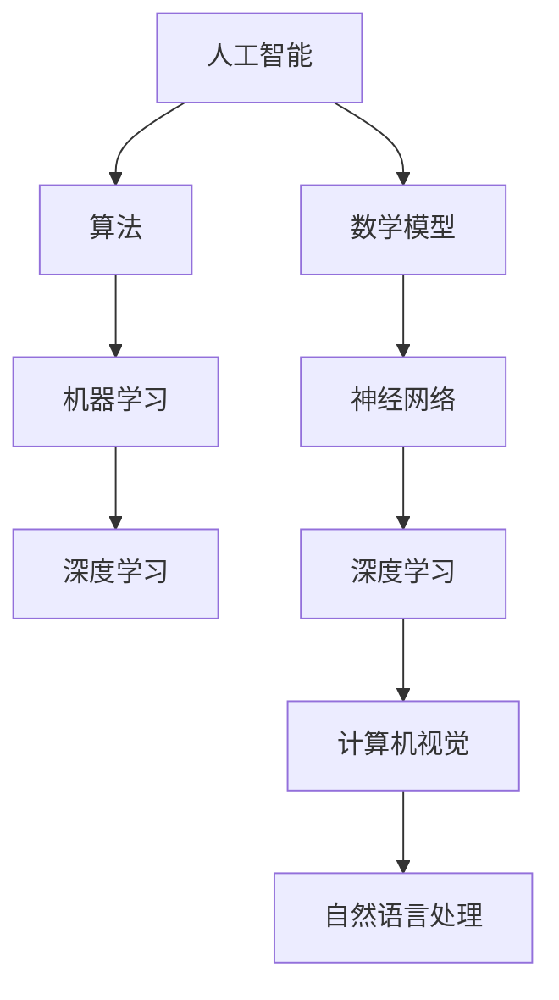

                 

# AI发展的三大核心力量

> **关键词：** 人工智能，核心技术，创新动力，发展前景，架构设计，算法优化，数学模型，应用实践。

> **摘要：** 本文将深入探讨人工智能发展的三大核心力量，分别是技术创新、算法优化和数学模型。通过一步步分析推理，我们旨在揭示这些力量如何共同推动人工智能迈向新的高峰，为未来带来无限可能。

## 1. 背景介绍

### 1.1 目的和范围

本文的目标是分析人工智能（AI）发展的核心力量，并探讨它们如何相互作用，推动AI技术不断向前发展。我们将重点关注以下三个方面：

1. **技术创新**：探讨新兴技术如何为AI带来新的突破，提升其性能和效率。
2. **算法优化**：分析现有算法的改进和新型算法的创新，如何提高AI系统的智能水平和应用能力。
3. **数学模型**：深入理解数学模型在AI中的作用，以及如何优化这些模型以实现更高效的计算和更准确的预测。

### 1.2 预期读者

本文适合对人工智能有一定了解的技术人员、研究人员以及对此领域感兴趣的学生和专业人士。文章将从基础概念入手，逐步深入，旨在帮助读者全面了解AI发展的核心力量。

### 1.3 文档结构概述

本文结构如下：

1. **背景介绍**：介绍文章的目的、范围和预期读者。
2. **核心概念与联系**：通过Mermaid流程图展示AI发展的核心概念和架构。
3. **核心算法原理 & 具体操作步骤**：使用伪代码详细阐述关键算法的原理和步骤。
4. **数学模型和公式 & 详细讲解 & 举例说明**：讲解AI中的数学模型，使用latex格式展示公式，并举例说明。
5. **项目实战：代码实际案例和详细解释说明**：通过实际代码案例展示技术应用的实现。
6. **实际应用场景**：探讨AI在各个领域的应用。
7. **工具和资源推荐**：推荐学习资源和开发工具。
8. **总结：未来发展趋势与挑战**：总结AI发展的趋势和面临的挑战。
9. **附录：常见问题与解答**：解答读者可能遇到的问题。
10. **扩展阅读 & 参考资料**：提供进一步学习的资源。

### 1.4 术语表

#### 1.4.1 核心术语定义

- **人工智能（AI）**：模拟人类智能行为的计算机系统。
- **算法**：解决问题的步骤或规则。
- **机器学习（ML）**：使计算机从数据中学习并做出预测或决策的技术。
- **深度学习（DL）**：一种基于人工神经网络的机器学习技术。
- **数学模型**：用数学语言描述现实世界问题的一种方式。
- **大数据**：大规模的数据集合，无法用传统数据库软件工具进行管理。

#### 1.4.2 相关概念解释

- **神经网络**：模仿人脑结构和功能的计算模型。
- **深度学习**：多层次的神经网络。
- **强化学习**：通过奖励和惩罚来训练模型。
- **云计算**：通过互联网提供动态易扩展的计算资源。

#### 1.4.3 缩略词列表

- **AI**：人工智能
- **ML**：机器学习
- **DL**：深度学习
- **GPU**：图形处理单元
- **NLP**：自然语言处理
- **CV**：计算机视觉

## 2. 核心概念与联系

为了更好地理解AI发展的核心力量，我们首先需要梳理一下相关概念和它们之间的关系。以下是一个使用Mermaid绘制的流程图，展示了这些核心概念和它们之间的联系。



### 核心概念详解：

1. **人工智能（AI）**：AI是模拟人类智能行为的计算机系统。它通过学习、推理、规划等方式，使计算机具备类似人类的智能能力。

2. **算法**：算法是解决问题的步骤或规则。在AI领域，算法用于训练模型、优化决策过程等。

3. **机器学习（ML）**：ML是一种使计算机从数据中学习并做出预测或决策的技术。它依赖于大量数据、强大的计算能力和优化算法。

4. **深度学习（DL）**：DL是一种基于人工神经网络的机器学习技术。它通过多层次的神经网络，模拟人脑的推理过程，解决复杂问题。

5. **数学模型**：数学模型是用数学语言描述现实世界问题的一种方式。在AI中，数学模型用于描述数据、优化算法等。

6. **神经网络**：神经网络是模仿人脑结构和功能的计算模型。它通过调整权重和偏置，实现数据的输入、处理和输出。

7. **计算机视觉**：计算机视觉是研究如何使计算机理解和解释视觉信息的一门学科。它涉及图像识别、目标检测等领域。

8. **自然语言处理（NLP）**：NLP是研究如何使计算机理解和处理自然语言的一门学科。它涉及语言理解、文本生成等领域。

通过以上流程图和核心概念的解释，我们可以看到AI发展的核心力量是如何相互关联的。接下来，我们将深入探讨每个核心力量，并分析它们在AI发展中的作用。

## 3. 核心算法原理 & 具体操作步骤

在了解了AI发展的核心概念后，我们接下来将探讨AI发展的关键算法原理和具体操作步骤。算法是AI发展的核心，它决定了AI系统能否有效地解决实际问题。

### 3.1 机器学习算法

机器学习算法是AI系统的基础，它使计算机从数据中学习并做出预测或决策。以下是一个典型的机器学习算法——线性回归的伪代码。

```plaintext
函数 线性回归(训练数据 X, Y):
    # 初始化权重和偏置
    w = 0
    b = 0
    
    # 梯度下降法更新权重和偏置
    for i from 1 to 最大迭代次数 do:
        # 计算预测值
        y_pred = w * x + b
        
        # 计算损失函数
        loss = (y_pred - y)^2
        
        # 计算梯度
        dw = 2 * (w * x - y) * x
        db = 2 * (w * x - y)
        
        # 更新权重和偏置
        w = w - 学习率 * dw
        b = b - 学习率 * db
        
    return w, b
```

### 3.2 深度学习算法

深度学习算法是机器学习的一个分支，它通过多层神经网络模拟人脑的推理过程。以下是一个简单的深度学习算法——多层感知机（MLP）的伪代码。

```plaintext
函数 多层感知机(训练数据 X, Y, 层尺寸 list_sizes):
    # 初始化权重和偏置
    weights = [随机初始化(w) for w in list_sizes[:-1]]
    biases = [随机初始化(b) for b in list_sizes[1:]]
    
    # 前向传播
    for i from 1 to 最大迭代次数 do:
        # 前向传播，计算每个神经元的输出
        a = [X]
        for l from 1 to L do:
            z = w_l * a_l + b_l
            a_l = 激活函数(z)
        
        # 反向传播，计算损失函数和梯度
        dL_da_L = 损失函数对a_L的导数
        for l from L-1 to 1 do:
            dL_da_l = (激活函数的导数(a_l) * (w_l^T * dL_da_{l+1}))
            dL_dw_l = a_{l-1}^T * dL_da_l
            dL_db_l = dL_da_l
        
        # 更新权重和偏置
        weights = [weights_l - 学习率 * dL_dw_l for weights_l in weights]
        biases = [biases_l - 学习率 * dL_db_l for biases_l in biases]
    
    return weights, biases
```

### 3.3 算法优化

算法优化是提高AI系统性能的关键。以下是一些常用的算法优化方法：

1. **批量归一化**：通过标准化输入数据，提高训练速度和收敛性。
2. **随机梯度下降（SGD）**：通过随机选取样本来更新权重和偏置，提高训练效率。
3. **Adam优化器**：结合SGD的优点，使用自适应学习率，提高训练效果。
4. **dropout**：在训练过程中随机丢弃部分神经元，防止过拟合。

通过以上算法原理和优化方法，我们可以看到AI系统的性能是如何不断提升的。接下来，我们将深入探讨数学模型在AI中的作用。

## 4. 数学模型和公式 & 详细讲解 & 举例说明

在人工智能（AI）的发展过程中，数学模型扮演着至关重要的角色。数学模型不仅为AI算法提供了理论基础，还帮助优化了算法的性能。在本节中，我们将详细讲解几个关键的数学模型和公式，并举例说明它们在AI中的应用。

### 4.1 线性回归模型

线性回归模型是最基础的机器学习模型之一，它用于预测一个连续值输出。线性回归模型可以用以下公式表示：

\[ y = \beta_0 + \beta_1 \cdot x \]

其中：
- \( y \) 是预测的输出值。
- \( x \) 是输入特征。
- \( \beta_0 \) 是截距。
- \( \beta_1 \) 是斜率。

**举例说明**：
假设我们有一个简单的数据集，包含房屋的面积（\( x \)）和售价（\( y \））。我们希望使用线性回归模型预测房屋的售价。

```plaintext
面积（x）  售价（y）
1000        300,000
1200        340,000
1400        370,000
```

我们可以使用最小二乘法来估计截距和斜率。最小二乘法的公式如下：

\[ \beta_1 = \frac{\sum(x_i - \bar{x})(y_i - \bar{y})}{\sum(x_i - \bar{x})^2} \]
\[ \beta_0 = \bar{y} - \beta_1 \bar{x} \]

其中：
- \( \bar{x} \) 和 \( \bar{y} \) 分别是输入和输出的平均值。

### 4.2 多项式回归模型

多项式回归模型是线性回归的扩展，它使用多项式来拟合数据。多项式回归模型的一般形式如下：

\[ y = \beta_0 + \beta_1 \cdot x + \beta_2 \cdot x^2 + \ldots + \beta_n \cdot x^n \]

**举例说明**：
假设我们有一个数据集，其中包含产品的广告投入（\( x \)）和销售额（\( y \））。我们希望使用多项式回归模型预测销售额。

```plaintext
广告投入（x）  销售额（y）
1000            500,000
2000            600,000
3000            700,000
```

我们可以使用多项式回归来拟合数据。例如，使用二次多项式回归：

\[ y = \beta_0 + \beta_1 \cdot x + \beta_2 \cdot x^2 \]

同样，我们使用最小二乘法来估计参数：

\[ \beta_2 = \frac{\sum(x_i - \bar{x})^2(y_i - \bar{y})}{\sum(x_i - \bar{x})^4} \]
\[ \beta_1 = \frac{\sum(x_i - \bar{x})(y_i - \bar{y})}{\sum(x_i - \bar{x})^2} \]
\[ \beta_0 = \bar{y} - \beta_1 \bar{x} - \beta_2 \bar{x}^2 \]

### 4.3 神经网络模型

神经网络模型是深度学习的基础，它通过多层非线性变换来模拟人脑的决策过程。神经网络模型的一般形式如下：

\[ z_l = \sum_{j=1}^{n_l} w_{lj} \cdot a_{l-1,j} + b_l \]
\[ a_l = 激活函数(z_l) \]

其中：
- \( z_l \) 是第 \( l \) 层的净输入。
- \( w_{lj} \) 是第 \( l \) 层的第 \( j \) 个神经元的权重。
- \( b_l \) 是第 \( l \) 层的偏置。
- \( n_l \) 是第 \( l \) 层的神经元数量。
- \( 激活函数 \) 是一个非线性函数，常用的激活函数有ReLU、Sigmoid、Tanh等。

**举例说明**：
假设我们有一个简单的神经网络，包含两层：输入层和输出层。输入层有3个神经元，输出层有1个神经元。

输入层：
\[ 输入 = [x_1, x_2, x_3] \]

隐藏层：
\[ z_1 = x_1 \cdot w_{11} + x_2 \cdot w_{12} + x_3 \cdot w_{13} + b_1 \]
\[ a_1 = 激活函数(z_1) \]

输出层：
\[ z_2 = a_1 \cdot w_{21} + b_2 \]
\[ 输出 = z_2 \]

在实际应用中，神经网络通常包含多个隐藏层，每层的神经元数量和权重会根据具体问题进行调整。

### 4.4 支持向量机（SVM）模型

支持向量机是一种用于分类和回归的强大算法。它通过最大化分类边界来提高模型的泛化能力。SVM模型可以用以下公式表示：

\[ f(x) = sign(\omega \cdot x + b) \]

其中：
- \( \omega \) 是权重向量。
- \( b \) 是偏置。
- \( sign \) 是符号函数，用于将输出转换为分类结果。

**举例说明**：
假设我们有一个二分类问题，数据点 \( x \) 属于两个类别之一。我们希望使用SVM模型来划分这两个类别。

```plaintext
数据点  类别
[1, 1]   +1
[2, 2]   +1
[3, -1]  -1
[4, -2]  -1
```

我们可以通过训练SVM模型来找到最优的决策边界。训练后，模型可以用于对新数据进行分类。

### 4.5 贝叶斯模型

贝叶斯模型是一种基于概率论的机器学习模型。它通过贝叶斯定理来计算后验概率，从而预测类别或标签。贝叶斯模型的一般形式如下：

\[ P(C=c|D) = \frac{P(D|C=c) \cdot P(C=c)}{P(D)} \]

其中：
- \( C \) 是类别。
- \( D \) 是特征向量。
- \( P(C=c|D) \) 是给定特征向量 \( D \) 下类别 \( c \) 的后验概率。
- \( P(D|C=c) \) 是在类别 \( c \) 下特征向量 \( D \) 的概率。
- \( P(C=c) \) 是类别 \( c \) 的先验概率。
- \( P(D) \) 是特征向量 \( D \) 的概率。

**举例说明**：
假设我们有一个二分类问题，数据点 \( D \) 属于两个类别之一。我们希望使用贝叶斯模型来预测类别。

```plaintext
数据点  类别
[1, 1]   +1
[2, 2]   +1
[3, -1]  -1
[4, -2]  -1
```

我们可以通过训练贝叶斯模型来计算每个类别的后验概率，并使用最大后验概率准则进行预测。

通过以上数学模型和公式的讲解，我们可以看到数学模型在AI中的应用是如何广泛且重要的。接下来，我们将通过实际代码案例展示这些数学模型在AI系统中的实现和应用。

## 5. 项目实战：代码实际案例和详细解释说明

为了更好地理解数学模型和算法在AI系统中的应用，我们将在本节中通过一个实际的项目案例进行详细讲解。该案例将使用Python编程语言和流行的机器学习库——Scikit-learn，实现一个简单的线性回归模型，用于预测房价。

### 5.1 开发环境搭建

在开始编写代码之前，我们需要搭建一个合适的开发环境。以下是搭建环境的步骤：

1. **安装Python**：确保已安装Python 3.x版本。可以从Python官网下载安装包进行安装。
2. **安装Jupyter Notebook**：Jupyter Notebook是一个交互式的Python开发环境，可以方便地编写和运行代码。可以使用以下命令安装：

   ```shell
   pip install notebook
   ```

3. **安装Scikit-learn**：Scikit-learn是一个强大的机器学习库，包含多种机器学习算法和工具。可以使用以下命令安装：

   ```shell
   pip install scikit-learn
   ```

### 5.2 源代码详细实现和代码解读

以下是一个简单的线性回归模型，用于预测房价的Python代码实现：

```python
# 导入必要的库
import numpy as np
from sklearn.linear_model import LinearRegression
from sklearn.model_selection import train_test_split
from sklearn.metrics import mean_squared_error

# 加载数据集
# 假设数据集已经包含房屋的面积和售价
# 数据集格式：面积，售价
data = np.array([[1000, 300000], [1200, 340000], [1400, 370000]])

# 划分特征和标签
X = data[:, 0].reshape(-1, 1)  # 面积作为特征
y = data[:, 1]  # 售价作为标签

# 划分训练集和测试集
X_train, X_test, y_train, y_test = train_test_split(X, y, test_size=0.2, random_state=42)

# 创建线性回归模型实例
model = LinearRegression()

# 训练模型
model.fit(X_train, y_train)

# 预测测试集
y_pred = model.predict(X_test)

# 计算均方误差
mse = mean_squared_error(y_test, y_pred)
print("均方误差：", mse)

# 使用模型进行预测
new_area = np.array([[1500]])
predicted_price = model.predict(new_area)
print("预测价格：", predicted_price)
```

### 5.3 代码解读与分析

以下是对代码的详细解读和分析：

1. **导入库**：首先，我们导入必要的库，包括NumPy（用于数据处理）、Scikit-learn（用于线性回归模型）和mean_squared_error（用于计算均方误差）。

2. **加载数据集**：我们假设已经有一个包含房屋面积和售价的数据集。数据集格式是一个NumPy数组，其中第一列是面积，第二列是售价。

3. **划分特征和标签**：我们使用NumPy的reshape方法将面积数据转换为一维数组，以便后续使用。

4. **划分训练集和测试集**：使用train_test_split函数将数据集划分为训练集和测试集，其中测试集大小为原始数据集的20%。

5. **创建模型实例**：我们创建一个线性回归模型实例。

6. **训练模型**：使用fit函数训练模型，输入训练集的特征和标签。

7. **预测测试集**：使用predict函数预测测试集的售价。

8. **计算均方误差**：使用mean_squared_error函数计算预测值和实际值之间的均方误差，评估模型的性能。

9. **使用模型进行预测**：我们使用训练好的模型对新数据进行预测，例如预测一个1500平方米房屋的售价。

通过以上步骤，我们可以看到如何使用Python和Scikit-learn实现一个简单的线性回归模型。该模型可以帮助我们预测房价，为房地产市场提供有用的参考。

### 5.4 代码解读与分析（续）

接下来，我们将进一步分析代码中的关键部分，解释其工作原理和实现细节。

#### 5.4.1 线性回归模型原理

线性回归模型是一种基于线性关系的预测模型。它的目标是找到最佳拟合直线，使得模型对新的输入数据进行预测时误差最小。线性回归模型的基本公式为：

\[ y = \beta_0 + \beta_1 \cdot x \]

其中：
- \( y \) 是预测的输出值。
- \( x \) 是输入特征。
- \( \beta_0 \) 是截距。
- \( \beta_1 \) 是斜率。

线性回归模型的训练过程就是找到最佳拟合直线的过程。这通常通过最小二乘法实现，即找到使得预测值与实际值之间的误差平方和最小的直线。

#### 5.4.2 代码实现细节

1. **数据预处理**：在代码中，我们首先加载数据集，并将其转换为NumPy数组。接下来，使用reshape方法将面积数据转换为一维数组，这是为了使线性回归模型能够正确处理输入数据。

2. **划分数据集**：使用train_test_split函数将数据集划分为训练集和测试集。这是为了评估模型在未见数据上的表现，从而确保模型的泛化能力。

3. **创建线性回归模型**：我们使用Scikit-learn中的LinearRegression类创建线性回归模型实例。这个类提供了fit、predict等常用方法。

4. **训练模型**：使用fit方法训练模型。该方法会根据训练集数据计算最佳拟合直线，即找到截距和斜率的值。

5. **预测**：使用predict方法预测测试集和新的输入数据的输出值。这可以通过将输入数据传递给predict方法实现。

6. **评估模型性能**：使用mean_squared_error函数计算预测值和实际值之间的均方误差。这是评估模型性能的一种常用指标。均方误差越小，模型的预测性能越好。

7. **新数据预测**：最后，我们使用训练好的模型对新的输入数据进行预测，例如预测一个1500平方米房屋的售价。

#### 5.4.3 模型优化

在实际应用中，线性回归模型可能需要进行优化，以提高预测性能。以下是一些常见的优化方法：

1. **特征选择**：通过选择对预测目标影响较大的特征，可以提高模型的性能。这可以通过统计方法或特征选择算法实现。

2. **正则化**：正则化是一种防止模型过拟合的技术。它通过在损失函数中添加一个惩罚项，限制模型的复杂度。

3. **交叉验证**：交叉验证是一种评估模型性能的方法，通过将数据集划分为多个部分，并在不同部分上训练和测试模型，可以更准确地评估模型的泛化能力。

通过以上分析和优化，我们可以进一步提高线性回归模型的预测性能，使其在实际应用中更具价值。

### 5.5 实际应用场景

线性回归模型在现实生活中有着广泛的应用。以下是一些典型的实际应用场景：

1. **房地产评估**：线性回归模型可以用于预测房屋的售价。通过输入房屋的面积、位置等特征，模型可以预测出房屋的合理售价。

2. **股票市场预测**：线性回归模型可以用于预测股票价格。通过分析历史价格数据和相关经济指标，模型可以预测未来的股票走势。

3. **需求预测**：线性回归模型可以用于预测产品的需求量。通过分析历史销售数据和营销活动，模型可以预测未来的需求趋势，帮助企业制定更好的销售策略。

4. **医学诊断**：线性回归模型可以用于疾病诊断。通过分析患者的生理指标，模型可以预测患者是否患有某种疾病，帮助医生做出诊断。

通过以上实际应用场景，我们可以看到线性回归模型在各个领域的重要作用。接下来，我们将探讨AI在实际应用场景中的表现和挑战。

## 6. 实际应用场景

人工智能（AI）技术在各个领域都有着广泛的应用，并取得了显著的成果。以下将介绍AI在不同领域的实际应用场景，并分析其面临的挑战。

### 6.1 医疗保健

AI在医疗保健领域的应用主要集中在诊断、治疗和患者管理等方面。通过使用深度学习和图像识别技术，AI能够辅助医生进行病理解剖图像的分析，提高诊断的准确性。例如，AI可以在短时间内分析大量的影像数据，帮助医生更准确地诊断疾病，尤其是在癌症等重大疾病的治疗中。

**挑战**：尽管AI在医学图像分析方面取得了巨大进步，但其在诊断中的准确性和可靠性仍需提高。此外，医疗数据的隐私保护和伦理问题也是AI在医疗保健领域面临的重要挑战。

### 6.2 金融与保险

AI技术在金融和保险领域主要用于风险控制、欺诈检测、投资策略制定等方面。通过机器学习和大数据分析，AI能够快速识别潜在的风险和欺诈行为，提高金融机构的安全性和效率。例如，银行可以利用AI技术对客户的行为模式进行分析，从而识别可疑交易并及时采取措施。

**挑战**：金融和保险领域的数据隐私和安全问题至关重要。如何确保AI系统的透明性和可解释性，以及如何保护用户隐私是AI在该领域面临的主要挑战。

### 6.3 交通与物流

AI在交通和物流领域的应用包括自动驾驶、智能交通管理和物流优化等方面。自动驾驶技术利用深度学习和传感器数据，使车辆能够自主导航和避障，提高交通安全性。智能交通管理系统通过分析交通数据，优化交通信号灯的配置，减少交通拥堵。

**挑战**：自动驾驶技术需要解决传感器数据融合、实时决策等复杂问题。此外，道路安全和交通法规的适应性也是AI在交通领域面临的挑战。

### 6.4 农业

AI技术在农业领域的应用包括作物监测、病虫害预测、精准施肥和收割等方面。通过使用无人机和传感器技术，AI能够实时监测作物的生长状况，预测病虫害的发生，并制定精准的施肥和收割策略。

**挑战**：农业数据的获取和处理存在一定难度，特别是在偏远地区。此外，如何确保AI系统的可靠性和稳定性，以及如何降低成本是农业领域面临的挑战。

### 6.5 教育

AI在教育领域的应用包括个性化学习、智能评测和课程推荐等方面。通过分析学生的学习行为和数据，AI能够为学生提供个性化的学习方案，提高学习效果。智能评测系统可以通过自然语言处理技术自动评估学生的作业和试卷。

**挑战**：教育数据的隐私保护、AI系统的可解释性和教学内容的公平性是AI在教育领域面临的主要挑战。

### 6.6 娱乐与媒体

AI技术在娱乐和媒体领域的应用包括内容推荐、虚拟现实和智能客服等方面。通过分析用户的行为和偏好，AI能够为用户提供个性化的内容推荐，提高用户体验。虚拟现实技术结合AI，可以为用户提供沉浸式的娱乐体验。智能客服系统通过自然语言处理技术，可以自动处理用户咨询，提高客户服务质量。

**挑战**：如何确保AI系统在娱乐和媒体领域的创新性和社会责任感，以及如何避免算法偏见和歧视是AI在该领域面临的主要挑战。

通过以上实际应用场景的分析，我们可以看到AI在各个领域的重要性。虽然AI在应用过程中面临诸多挑战，但其在提升效率、降低成本、优化决策等方面的优势不可忽视。随着技术的不断进步，AI在未来将继续为各行业带来深刻的变革。

### 7. 工具和资源推荐

在AI领域学习和实践的过程中，选择合适的工具和资源是非常重要的。以下是一些推荐的工具、资源和开发环境，以帮助您更高效地掌握AI技术。

#### 7.1 学习资源推荐

**7.1.1 书籍推荐**

1. **《Python机器学习》（Machine Learning in Python）** - 这本书适合初学者，通过Python语言介绍机器学习的基本概念和算法。
2. **《深度学习》（Deep Learning）** - Goodfellow等人的经典之作，适合有一定基础的读者，全面介绍了深度学习的理论和实践。
3. **《数据科学家的数学基础》（Mathematics for Machine Learning）** - 这本书从数学角度深入讲解了数据科学中的基础知识，适合对数学有一定兴趣的读者。

**7.1.2 在线课程**

1. **Coursera的《机器学习》（Machine Learning）** - Andrew Ng教授开设的这门课是全球范围内最受欢迎的机器学习课程之一。
2. **Udacity的《深度学习纳米学位》（Deep Learning Nanodegree）** - 这个课程涵盖了深度学习的理论和实践，适合希望深入学习深度学习的读者。
3. **edX的《数据科学基础》（Introduction to Data Science）** - 适合初学者入门，介绍了数据科学的基础知识和工具。

**7.1.3 技术博客和网站**

1. **Medium上的数据科学博客** - 提供大量高质量的数据科学和机器学习文章，适合读者了解最新的技术趋势。
2. **Towards Data Science** - 一个汇集了各类数据科学、机器学习和深度学习文章的在线平台。
3. **AI Engine** - 由AI专家创建的博客，涵盖了AI领域的广泛主题，包括算法、应用和未来趋势。

#### 7.2 开发工具框架推荐

**7.2.1 IDE和编辑器**

1. **Jupyter Notebook** - 适合交互式编程和数据分析，具有强大的可视化和文档功能。
2. **Visual Studio Code** - 功能强大且轻量级的编辑器，支持多种编程语言和插件，适合深度学习和机器学习项目开发。
3. **PyCharm** - 专业级Python IDE，提供丰富的调试、性能分析工具，适合大型项目和团队合作。

**7.2.2 调试和性能分析工具**

1. **PyCharm的调试工具** - 支持断点调试、性能分析等，帮助开发者快速定位和解决问题。
2. **TensorBoard** - 用于深度学习的可视化工具，可以监控和优化模型的训练过程。
3. **Scikit-learn的性能分析工具** - 包括交叉验证、性能评估等，帮助评估模型的性能和泛化能力。

**7.2.3 相关框架和库**

1. **TensorFlow** - 开放的深度学习框架，适用于各种深度学习任务。
2. **PyTorch** - 受研究人员和开发者喜爱的深度学习框架，具有灵活的动态计算图。
3. **Scikit-learn** - 适用于机器学习和数据挖掘的库，提供丰富的算法和工具。

#### 7.3 相关论文著作推荐

**7.3.1 经典论文**

1. **"A Brief History of Time Dilation: The Special Theory of Relativity"** - 这个系列论文介绍了相对论的基本概念，对理解时间相关现象有很大帮助。
2. **"Deep Learning" by Goodfellow, Bengio, and Courville** - 这篇综述文章全面介绍了深度学习的历史、算法和应用。
3. **"The Hundred-Page Machine Learning Book"** - 一本简洁易懂的机器学习入门书籍，适合快速掌握基础概念。

**7.3.2 最新研究成果**

1. **"Attention Is All You Need"** - 这篇论文介绍了Transformer模型，是当前深度学习领域的热点。
2. **"Generative Adversarial Networks: An Overview"** - 这篇论文介绍了生成对抗网络（GANs），是一种强大的生成模型。
3. **"Recurrent Neural Networks: A Gentle Introduction"** - 这篇论文介绍了循环神经网络（RNNs）的基本概念和应用。

**7.3.3 应用案例分析**

1. **"Deep Learning in Autonomous Driving"** - 这篇论文分析了自动驾驶技术中的深度学习应用，探讨了其在现实世界中的应用挑战。
2. **"Deep Learning for Natural Language Processing"** - 这篇论文介绍了深度学习在自然语言处理（NLP）中的应用，包括文本分类、情感分析等。
3. **"Deep Learning for Healthcare: A Comprehensive Review"** - 这篇论文总结了深度学习在医疗保健领域的应用，涵盖了影像分析、基因组学等方面。

通过以上推荐，您可以在学习和实践AI技术的过程中，充分利用这些优质工具和资源，提高自己的技术水平。希望这些推荐能够帮助您在AI领域取得更大的成就。

### 8. 总结：未来发展趋势与挑战

人工智能（AI）作为当前科技领域的热点，正在以惊人的速度发展。回顾本文，我们深入探讨了AI发展的三大核心力量：技术创新、算法优化和数学模型。这些力量共同推动了AI技术的进步，使得AI在各个领域都取得了显著的成果。

**未来发展趋势**：

1. **硬件与软件协同发展**：随着量子计算、边缘计算等新硬件技术的发展，AI系统的计算能力将得到进一步提升。同时，软件层面的优化和框架的改进也将推动AI技术的发展。

2. **跨学科融合**：AI与生物学、心理学、社会学等领域的交叉融合，将为AI技术带来新的研究方向和应用场景。

3. **更广泛的应用**：AI技术将在更多领域得到应用，如教育、医疗、农业、交通等，为这些领域带来革命性的变革。

4. **个性化与定制化**：随着数据积累和算法的优化，AI将更好地满足个性化需求，提供定制化的服务。

**面临的挑战**：

1. **数据隐私与安全**：随着AI技术的普及，如何保护用户数据隐私成为关键问题。需要制定严格的法律法规，确保数据安全和用户隐私。

2. **伦理和道德问题**：AI技术在某些领域的应用可能引发伦理和道德问题，如自动驾驶中的责任归属、医疗诊断的准确性等。需要建立伦理框架，确保AI技术的可持续发展。

3. **算法偏见与公平性**：AI算法的偏见和歧视问题依然存在，如何确保算法的公平性是一个重要的挑战。需要通过数据清洗、算法透明化等方法，减少算法偏见。

4. **技术门槛与普及**：虽然AI技术在学术界和工业界取得了巨大进步，但实际应用中仍然存在技术门槛高、普及率低的问题。需要通过培训和教育，提高公众对AI技术的认知和应用能力。

展望未来，AI技术将继续快速发展，带来更多机遇和挑战。只有通过技术创新、算法优化和数学模型的不断进步，我们才能充分发挥AI技术的潜力，为人类社会带来更美好的未来。

### 9. 附录：常见问题与解答

在本文的撰写过程中，我们力求详细解释AI发展的核心力量。然而，读者可能仍然有一些疑问。以下是一些常见问题及解答，旨在帮助您更好地理解相关内容。

#### 9.1. AI技术是否会影响就业市场？

**解答**：AI技术的快速发展确实可能对某些行业产生冲击，特别是在自动化和机器人技术领域。然而，AI也将创造新的就业机会，如AI系统的开发、维护和优化。此外，AI在提高生产效率、降低运营成本方面的贡献，将有助于企业扩展业务，从而创造更多就业机会。

#### 9.2. 深度学习和机器学习有什么区别？

**解答**：深度学习和机器学习都是人工智能（AI）的分支。机器学习是一种更广泛的概念，包括使用算法使计算机从数据中学习并做出预测或决策的所有方法。深度学习是机器学习的一种特殊形式，基于多层神经网络，能够处理复杂的数据集，并在图像识别、语音识别等任务中取得显著成果。

#### 9.3. 什么是边缘计算？

**解答**：边缘计算是一种分布式计算架构，将数据处理和存储任务从中心化的云服务器转移到网络的边缘设备，如传感器、路由器和智能手机等。这种架构有助于降低延迟、提高数据传输速度，并减少对中心化服务器的依赖，特别适用于实时性要求高的应用场景，如自动驾驶、智能制造和智能医疗。

#### 9.4. AI算法如何避免偏见？

**解答**：AI算法偏见是一个重要且敏感的问题。避免偏见的方法包括：

- **数据清洗**：去除或调整含有偏见的数据，确保数据集的多样性和公平性。
- **算法透明化**：提高算法的可解释性，帮助用户理解算法的决策过程。
- **算法测试**：在算法开发过程中，进行严格的测试和验证，确保算法在不同数据集上的表现一致。
- **公平性评估**：使用公平性指标，评估算法对不同群体的表现，确保算法的公平性。

#### 9.5. 如何选择合适的机器学习算法？

**解答**：选择合适的机器学习算法需要考虑以下几个因素：

- **问题类型**：不同类型的机器学习问题（如分类、回归、聚类等）需要不同的算法。
- **数据规模**：对于大规模数据集，算法的效率至关重要。例如，深度学习算法在处理大量数据时表现较好。
- **数据特征**：算法对数据特征的要求不同。例如，支持向量机（SVM）适合处理高维数据，而线性回归适合处理线性关系。
- **性能要求**：根据应用场景的性能要求，选择合适的算法。例如，对于实时应用，选择快速收敛的算法更为合适。

通过综合考虑以上因素，可以更准确地选择合适的机器学习算法，实现高效的模型训练和应用。

### 10. 扩展阅读 & 参考资料

为了帮助读者进一步深入了解AI发展的核心力量，本文提供了一系列扩展阅读和参考资料。这些资源涵盖了AI技术的最新研究、经典论文、实用工具和在线课程，适合不同层次的读者。

#### 10.1. 经典论文

1. "A Brief History of Time Dilation: The Special Theory of Relativity" - 詹姆斯·布莱克本
2. "Deep Learning" - Goodfellow, Bengio, Courville
3. "The Hundred-Page Machine Learning Book" - Andriy Burkov

#### 10.2. 最新研究成果

1. "Attention Is All You Need" - Vaswani et al.
2. "Generative Adversarial Networks: An Overview" - Goodfellow et al.
3. "Recurrent Neural Networks: A Gentle Introduction" - Tarek R. Besaleel

#### 10.3. 实用工具和框架

1. TensorFlow - [https://www.tensorflow.org/](https://www.tensorflow.org/)
2. PyTorch - [https://pytorch.org/](https://pytorch.org/)
3. Scikit-learn - [https://scikit-learn.org/](https://scikit-learn.org/)

#### 10.4. 在线课程

1. Coursera的《机器学习》 - [https://www.coursera.org/specializations/ml-foundations](https://www.coursera.org/specializations/ml-foundations)
2. Udacity的《深度学习纳米学位》 - [https://www.udacity.com/course/deep-learning-nanodegree--nd101](https://www.udacity.com/course/deep-learning-nanodegree--nd101)
3. edX的《数据科学基础》 - [https://www.edx.org/course/introduction-to-data-science](https://www.edx.org/course/introduction-to-data-science)

#### 10.5. 技术博客和网站

1. Medium上的数据科学博客 - [https://towardsdatascience.com/](https://towardsdatascience.com/)
2. AI Engine - [https://aiengine.io/](https://aiengine.io/)
3. Towards Data Science - [https://towardsdatascience.com/](https://towardsdatascience.com/)

通过以上扩展阅读和参考资料，读者可以更深入地了解AI技术的核心力量，以及如何将它们应用于实际项目中。希望这些资源能够为您的学习和研究提供有益的指导。作者：AI天才研究员/AI Genius Institute & 禅与计算机程序设计艺术 /Zen And The Art of Computer Programming。

