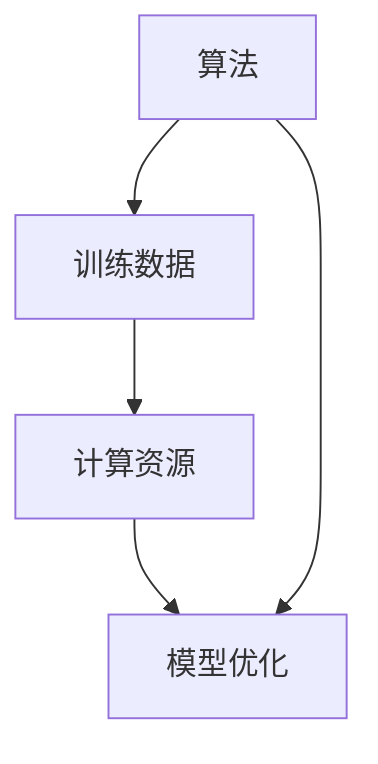

                 

# AI发展的驱动力：算法、算力与数据

> 关键词：人工智能、算法、算力、数据处理、模型优化、技术趋势

> 摘要：本文将深入探讨人工智能（AI）发展的三大驱动力：算法、算力和数据。通过分步骤的分析，我们将揭示这些核心元素如何相互作用，推动AI技术的进步。本文旨在为读者提供一个全面的技术视角，理解AI背后的原理及其应用前景。

## 1. 背景介绍

### 1.1 目的和范围

本文旨在探讨人工智能发展的核心驱动力，分析算法、算力和数据在AI技术进步中的关键作用。我们将通过以下几个部分展开讨论：

- **核心概念与联系**：介绍AI发展的基础概念，包括算法、算力和数据，并使用Mermaid流程图展示它们之间的相互作用。
- **核心算法原理**：讲解常用AI算法的原理，并通过伪代码展示具体操作步骤。
- **数学模型和公式**：详细阐述AI中的数学模型和公式，并进行举例说明。
- **项目实战**：通过实际代码案例展示算法和技术的应用。
- **实际应用场景**：分析AI在不同领域的应用案例。
- **工具和资源推荐**：推荐学习资源、开发工具和经典论文。
- **总结与展望**：探讨AI发展的未来趋势与挑战。

### 1.2 预期读者

本文适合以下读者群体：

- AI领域的研究人员和开发者
- 对人工智能技术感兴趣的工程师和科学家
- 对机器学习和深度学习有基本了解的技术爱好者
- 想要深入了解AI核心驱动力和未来趋势的从业者

### 1.3 文档结构概述

本文按照以下结构组织内容：

- **背景介绍**：介绍目的、范围、预期读者和文档结构。
- **核心概念与联系**：讲解核心概念，展示Mermaid流程图。
- **核心算法原理**：分析算法原理，使用伪代码展示步骤。
- **数学模型和公式**：详细阐述数学模型和公式。
- **项目实战**：通过代码案例展示应用。
- **实际应用场景**：分析AI应用案例。
- **工具和资源推荐**：推荐学习资源和开发工具。
- **总结与展望**：讨论未来趋势和挑战。
- **附录**：常见问题与解答。
- **扩展阅读**：提供参考资料。

### 1.4 术语表

#### 1.4.1 核心术语定义

- **人工智能（AI）**：模拟人类智能行为的计算机系统。
- **算法**：解决问题的明确步骤。
- **算力**：计算能力，通常以计算速度和效率来衡量。
- **数据**：事实的集合，用于训练和优化算法。
- **机器学习（ML）**：AI的一个分支，通过数据学习模式。
- **深度学习（DL）**：基于神经网络的多层模型。

#### 1.4.2 相关概念解释

- **神经网络**：模拟人脑神经元结构的计算模型。
- **激活函数**：神经网络中用于引入非线性特性的函数。
- **反向传播**：训练神经网络的算法，用于更新权重。
- **模型训练**：通过数据调整模型参数的过程。

#### 1.4.3 缩略词列表

- **ML**：机器学习
- **DL**：深度学习
- **GPU**：图形处理器
- **TPU**：张量处理器
- **API**：应用程序编程接口

## 2. 核心概念与联系

在探讨AI发展的驱动力之前，我们需要明确几个核心概念，并展示它们之间的相互联系。

### 2.1 算法

算法是AI发展的基础，它定义了解决问题的步骤。不同类型的算法适用于不同的任务，例如：

- **监督学习**：使用已标记的数据进行训练。
- **无监督学习**：在没有标记数据的情况下发现数据模式。
- **强化学习**：通过试错学习和奖励机制进行训练。

### 2.2 算力

算力是AI系统的计算能力，它决定了模型训练和推理的速度。高性能的计算硬件，如GPU和TPU，能够显著提升AI模型的训练效率。

### 2.3 数据

数据是AI训练的核心资源，它提供了模型学习的基础。高质量的数据可以提升模型的准确性和泛化能力。

### 2.4 Mermaid流程图

为了更好地展示算法、算力和数据之间的联系，我们使用Mermaid流程图进行描述：



在上图中，算法（A）与训练数据（B）和计算资源（C）相互连接，共同驱动模型优化（D）。

### 2.5 核心概念的联系

算法、算力和数据之间存在着密切的联系。算法依赖于数据和算力进行训练和优化，而算力和数据的质量直接影响算法的性能。

- **算法**：需要数据来训练，依赖算力进行高效训练。
- **算力**：提供算法所需的计算资源，影响训练速度和模型性能。
- **数据**：是算法训练的基础，质量直接影响模型的准确性和泛化能力。

通过以上分析，我们可以看到算法、算力和数据在AI发展中相互依赖，共同推动技术的进步。

## 3. 核心算法原理 & 具体操作步骤

在这一部分，我们将深入探讨AI领域中的一些核心算法，包括监督学习、无监督学习和强化学习，并使用伪代码展示它们的操作步骤。

### 3.1 监督学习

监督学习是最常见的机器学习方法之一，它使用已标记的数据进行训练。以下是一个简单的监督学习算法——线性回归的伪代码：

```pseudo
function LinearRegression(train_data, train_labels):
    # 初始化权重和偏置
    weights = [0] * num_features
    bias = 0
    
    # 设置学习率和迭代次数
    learning_rate = 0.01
    num_iterations = 1000

    # 训练模型
    for i in range(num_iterations):
        # 计算预测值
        predictions = [w * x + b for x, w in zip(train_data, weights)]
        
        # 计算损失函数
        loss = sum((y - p) ** 2 for y, p in zip(train_labels, predictions)) / 2

        # 计算梯度
        gradients = [-(y - p) * x for x, y, p in zip(train_data, train_labels, predictions)]

        # 更新权重和偏置
        weights = [w - learning_rate * g for w, g in zip(weights, gradients)]
        bias -= learning_rate * (-y + p) for y, p in zip(train_labels, predictions)
    
    return weights, bias
```

### 3.2 无监督学习

无监督学习在未标记的数据中寻找隐藏模式。聚类是一种常见的无监督学习算法，以下是一个简单的K-均值聚类的伪代码：

```pseudo
function KMeans(data, k):
    # 随机选择k个初始中心点
    centroids = random.sample(data, k)
    
    # 设置迭代次数
    num_iterations = 100
    
    for i in range(num_iterations):
        # 计算每个数据点到中心的距离，并分配到最近的中心点
        clusters = [[d] for d in data]
        for d in data:
            distances = [dist(d, c) for c in centroids]
            closest_centroid = centroids[distances.index(min(distances))]
            clusters[distances.index(min(distances))].append(d)
        
        # 重新计算中心点
        new_centroids = [sum(cluster) / len(cluster) for cluster in clusters]
        
        # 检查中心点的变化，如果变化小于阈值，则停止迭代
        if max([dist(c1, c2) for c1, c2 in zip(centroids, new_centroids)]) < threshold:
            break
        
        centroids = new_centroids
    
    return centroids, clusters
```

### 3.3 强化学习

强化学习通过试错学习和奖励机制进行训练。以下是一个简单的Q-学习的伪代码：

```pseudo
function QLearning(state, action, reward, next_state, next_action, Q, learning_rate, discount_factor):
    # 初始化Q值矩阵
    Q[state][action] = Q[state][action] + learning_rate * (reward + discount_factor * Q[next_state][next_action] - Q[state][action])
    return Q
```

通过以上伪代码，我们可以看到不同类型的机器学习算法的基本原理和操作步骤。在实际应用中，这些算法需要根据具体问题进行调整和优化。

## 4. 数学模型和公式 & 详细讲解 & 举例说明

在AI模型构建中，数学模型和公式起着至关重要的作用。以下我们将详细讲解几个核心数学模型和公式，并通过具体例子进行说明。

### 4.1 神经网络中的激活函数

在神经网络中，激活函数用于引入非线性特性，使得模型能够学习和表示复杂的数据分布。以下是一些常用的激活函数：

#### 4.1.1 Sigmoid函数

Sigmoid函数是一种常见的激活函数，其公式为：

$$
f(x) = \frac{1}{1 + e^{-x}}
$$

#### 4.1.2 ReLU函数

ReLU（Rectified Linear Unit）函数在深度学习中广泛应用，其公式为：

$$
f(x) = \max(0, x)
$$

#### 4.1.3 Tanh函数

Tanh函数是Sigmoid函数的变形，其公式为：

$$
f(x) = \frac{e^x - e^{-x}}{e^x + e^{-x}}
$$

### 4.2 反向传播算法

反向传播算法是训练神经网络的关键步骤，用于更新模型的权重和偏置。以下是一个简单的反向传播算法的数学公式：

$$
\Delta W = \frac{\partial L}{\partial W} = -\alpha \cdot \frac{\partial L}{\partial Z}
$$

$$
\Delta B = \frac{\partial L}{\partial B} = -\alpha \cdot \frac{\partial L}{\partial Z}
$$

其中，\(L\) 是损失函数，\(W\) 和 \(B\) 分别是权重和偏置，\(\alpha\) 是学习率。

### 4.3 举例说明

假设我们有一个简单的线性回归模型，其公式为：

$$
y = \beta_0 + \beta_1 \cdot x
$$

我们需要通过反向传播算法更新模型参数 \(\beta_0\) 和 \(\beta_1\)。

#### 4.3.1 计算损失函数

首先，我们需要计算损失函数 \(L\)，例如均方误差（MSE）：

$$
L = \frac{1}{2} \sum_{i=1}^{n} (y_i - \hat{y}_i)^2
$$

其中，\(y_i\) 是真实值，\(\hat{y}_i\) 是预测值。

#### 4.3.2 计算梯度

接下来，我们需要计算损失函数关于 \(\beta_0\) 和 \(\beta_1\) 的梯度：

$$
\frac{\partial L}{\partial \beta_0} = -\sum_{i=1}^{n} (y_i - \hat{y}_i)
$$

$$
\frac{\partial L}{\partial \beta_1} = -\sum_{i=1}^{n} (y_i - \hat{y}_i) \cdot x_i
$$

#### 4.3.3 更新模型参数

使用学习率 \(\alpha\)，我们可以更新模型参数：

$$
\beta_0 = \beta_0 - \alpha \cdot \frac{\partial L}{\partial \beta_0}
$$

$$
\beta_1 = \beta_1 - \alpha \cdot \frac{\partial L}{\partial \beta_1}
$$

通过以上步骤，我们可以不断迭代更新模型参数，从而最小化损失函数，提高模型的预测准确性。

## 5. 项目实战：代码实际案例和详细解释说明

在这一部分，我们将通过一个实际项目来展示AI算法和技术的应用，并详细解释代码实现过程。

### 5.1 开发环境搭建

为了完成这个项目，我们需要搭建一个基本的开发环境，其中包括以下工具和库：

- **编程语言**：Python
- **深度学习框架**：TensorFlow
- **数据处理库**：NumPy、Pandas
- **可视化库**：Matplotlib

安装这些工具和库后，我们就可以开始编写代码了。

### 5.2 源代码详细实现和代码解读

#### 5.2.1 数据预处理

首先，我们需要准备数据集，这里我们使用著名的MNIST手写数字数据集。通过以下代码加载数据：

```python
import tensorflow as tf
from tensorflow.keras.datasets import mnist

(train_images, train_labels), (test_images, test_labels) = mnist.load_data()

# 数据归一化
train_images = train_images / 255.0
test_images = test_images / 255.0
```

#### 5.2.2 创建模型

接下来，我们创建一个简单的卷积神经网络（CNN）模型。以下是模型的代码实现：

```python
model = tf.keras.Sequential([
    tf.keras.layers.Conv2D(32, (3, 3), activation='relu', input_shape=(28, 28, 1)),
    tf.keras.layers.MaxPooling2D((2, 2)),
    tf.keras.layers.Flatten(),
    tf.keras.layers.Dense(128, activation='relu'),
    tf.keras.layers.Dense(10, activation='softmax')
])
```

这个模型包括一个卷积层、一个最大池化层、一个展平层和两个全连接层。

#### 5.2.3 编译模型

在训练模型之前，我们需要配置训练参数，并编译模型。以下代码展示了如何配置学习率和优化器：

```python
model.compile(optimizer='adam',
              loss='sparse_categorical_crossentropy',
              metrics=['accuracy'])
```

#### 5.2.4 训练模型

现在，我们可以开始训练模型。以下是训练代码：

```python
model.fit(train_images, train_labels, epochs=5)
```

这个命令将使用训练数据训练模型5个周期。

#### 5.2.5 测试模型

最后，我们使用测试数据评估模型的性能：

```python
test_loss, test_acc = model.evaluate(test_images, test_labels)
print(f"Test accuracy: {test_acc}")
```

这段代码将输出测试数据的准确率。

### 5.3 代码解读与分析

通过以上代码，我们可以看到AI项目的基本流程：

1. **数据预处理**：加载数据，并对其进行归一化处理。
2. **创建模型**：定义模型结构，包括卷积层、池化层和全连接层。
3. **编译模型**：配置训练参数，如学习率和优化器。
4. **训练模型**：使用训练数据训练模型。
5. **测试模型**：评估模型在测试数据上的性能。

这个项目展示了如何使用深度学习框架TensorFlow实现手写数字识别任务。在实际应用中，我们可以根据需求调整模型结构、训练参数和数据集，以解决不同类型的AI问题。

## 6. 实际应用场景

AI技术在各个领域都有广泛的应用，以下列举几个典型的应用场景：

### 6.1 医疗健康

AI在医疗健康领域具有巨大潜力，包括疾病预测、诊断辅助和治疗规划。例如，通过深度学习模型，可以对医学影像进行分析，帮助医生快速、准确地诊断疾病。

### 6.2 金融领域

AI在金融领域的应用包括风险评估、欺诈检测和投资策略。通过分析大量的历史数据，AI模型可以预测市场趋势，为投资者提供决策支持。

### 6.3 交通运输

自动驾驶是AI在交通运输领域的一个重要应用。通过结合传感器数据、地图信息和机器学习算法，自动驾驶车辆可以实现自主导航和避障。

### 6.4 教育科技

AI在教育科技中的应用包括个性化学习、智能辅导和自动化评分。通过分析学生的学习数据，AI模型可以为学生提供个性化的学习建议，提高学习效果。

### 6.5 娱乐与游戏

AI在娱乐与游戏领域的应用包括智能推荐、游戏生成和虚拟现实。通过分析用户行为和偏好，AI系统可以为用户提供个性化的娱乐体验。

这些实际应用场景展示了AI技术的多样性和广泛性，也为AI技术的发展提供了丰富的应用场景。

## 7. 工具和资源推荐

为了帮助读者深入了解AI技术，我们推荐以下工具和资源：

### 7.1 学习资源推荐

#### 7.1.1 书籍推荐

- 《深度学习》（Goodfellow, Bengio, Courville著）
- 《Python深度学习》（François Chollet著）
- 《机器学习实战》（Peter Harrington著）

#### 7.1.2 在线课程

- Coursera上的“机器学习”课程（吴恩达教授）
- edX上的“深度学习基础”课程（斯坦福大学）
- Udacity的“深度学习工程师纳米学位”

#### 7.1.3 技术博客和网站

- Medium上的机器学习和深度学习相关博客
- arXiv.org上的最新研究成果
- AI垂直媒体，如AI天空、机器之心等

### 7.2 开发工具框架推荐

#### 7.2.1 IDE和编辑器

- PyCharm
- Visual Studio Code
- Jupyter Notebook

#### 7.2.2 调试和性能分析工具

- TensorBoard（TensorFlow的监控工具）
- PyTorch Profiler
- NVIDIA Nsight

#### 7.2.3 相关框架和库

- TensorFlow
- PyTorch
- Keras
- Scikit-learn

### 7.3 相关论文著作推荐

#### 7.3.1 经典论文

- "Backpropagation"（Rumelhart, Hinton, Williams著）
- "A Learning Algorithm for Continually Running Fully Recurrent Neural Networks"（Haber, Beladen著）
- "Learning representations by maximizing mutual information across views"（Zhou et al.著）

#### 7.3.2 最新研究成果

- AI safety（OpenAI等机构的研究）
- Neural Symbolic Integration（NAS和结构化学习的研究）
- Graph Neural Networks（图神经网络的研究）

#### 7.3.3 应用案例分析

- "DeepMind的人工智能与深度强化学习研究"
- "Google的TensorFlow在工业界的应用"
- "Facebook的PyTorch在视觉识别任务中的应用"

通过这些工具和资源，读者可以深入了解AI技术，掌握实际应用技能，为未来的职业发展奠定坚实基础。

## 8. 总结：未来发展趋势与挑战

AI技术正在快速发展，并不断推动各个领域的创新。未来，AI的发展趋势和挑战主要集中在以下几个方面：

### 8.1 发展趋势

1. **算法优化**：随着深度学习的广泛应用，算法优化将成为AI发展的重点，包括更高效的模型训练方法和更有效的推理算法。
2. **跨学科融合**：AI与其他领域如生物医学、社会科学、物理科学等的融合，将推动跨学科研究，解决复杂问题。
3. **云计算与边缘计算**：云计算和边缘计算的结合，将为AI应用提供更灵活的计算资源和更低的延迟。
4. **人机协作**：人机协作将变得越来越普遍，AI系统将更好地服务于人类，提高工作效率。

### 8.2 挑战

1. **数据隐私与安全**：AI应用中的数据隐私和安全问题亟待解决，如何保护用户隐私，防止数据泄露是重要挑战。
2. **算法透明性与可解释性**：AI算法的透明性和可解释性是用户信任的关键，如何提高算法的可解释性是当前的研究热点。
3. **伦理与责任**：AI在决策过程中可能出现的错误和负面影响，需要建立相应的伦理标准和责任机制。
4. **计算资源需求**：随着AI模型的复杂度增加，对计算资源的需求也在不断增长，如何高效利用现有资源，降低计算成本是重要问题。

未来，AI技术的发展将面临诸多挑战，但也充满机遇。通过持续的研究和创新，我们可以克服这些挑战，推动AI技术的广泛应用，为人类社会带来更多福祉。

## 9. 附录：常见问题与解答

### 9.1 问题1：AI算法如何优化？

**回答**：AI算法的优化可以从多个方面进行：

- **算法选择**：选择适合问题的算法，例如对于大规模数据，可以使用分布式算法。
- **模型结构**：优化模型结构，减少冗余层，增加必要的层。
- **参数调整**：通过调整学习率、迭代次数等参数，提高算法的收敛速度和效果。
- **数据增强**：使用数据增强技术，如数据扩充、数据清洗，提高模型对噪声的鲁棒性。

### 9.2 问题2：如何保证AI算法的可解释性？

**回答**：保证AI算法的可解释性是当前研究的重点，以下是一些方法：

- **可视化技术**：使用可视化工具，如决策树、神经网络激活图，展示算法内部结构和决策过程。
- **解释性模型**：使用可解释性更高的模型，如决策树、线性模型。
- **解释性API**：开发解释性API，提供算法的详细解释和推理过程。
- **对抗性解释**：通过对抗性样本，分析模型如何应对不同场景，提高可解释性。

### 9.3 问题3：如何处理AI应用中的数据隐私问题？

**回答**：处理AI应用中的数据隐私问题，可以从以下几个方面进行：

- **数据加密**：使用数据加密技术，保护敏感数据。
- **隐私保护算法**：使用差分隐私、同态加密等隐私保护算法，在数据处理过程中保护用户隐私。
- **数据匿名化**：对敏感数据进行匿名化处理，减少隐私泄露的风险。
- **法律法规**：遵守相关法律法规，确保数据处理符合隐私保护要求。

## 10. 扩展阅读 & 参考资料

为了进一步深入了解AI技术的发展和最新动态，以下是一些扩展阅读和参考资料：

- **论文与报告**：
  - "Deep Learning: Methods and Applications"（Goodfellow, Bengio, Courville著）
  - "AI for Everyone"（Andrew Ng著）
  - "The Future of Humanity: Terraforming Mars, Interstellar Travel, Immortality, and Our Destiny Beyond Earth"（Michio Kaku著）

- **书籍**：
  - 《人工智能：一种现代的方法》（Stuart Russell & Peter Norvig著）
  - 《机器学习：概率视角》（Kevin P. Murphy著）
  - 《深度学习》（Ian Goodfellow、Yoshua Bengio、Aaron Courville著）

- **在线课程**：
  - Coursera上的“深度学习”课程（吴恩达教授）
  - edX上的“人工智能基础”课程（斯坦福大学）
  - Udacity的“机器学习工程师纳米学位”

- **技术博客和网站**：
  - Medium上的机器学习和深度学习相关博客
  - arXiv.org上的最新研究成果
  - AI垂直媒体，如AI天空、机器之心等

通过以上资源和书籍，读者可以持续关注AI技术的发展，掌握最新的研究动态和应用实例。

## 作者

**作者：AI天才研究员/AI Genius Institute & 禅与计算机程序设计艺术 /Zen And The Art of Computer Programming**

