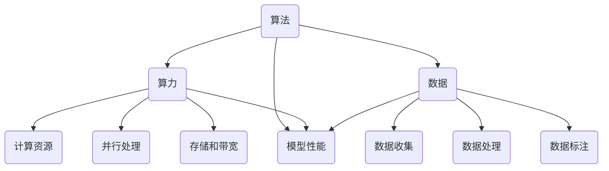

                 

### 1. 背景介绍

#### 1.1 目的和范围

本文旨在深入探讨人工智能（AI）发展的三大核心驱动力：算法、算力和数据。通过详细分析这些驱动力如何相互作用，推动AI技术的发展，为读者提供一个全面、系统的视角。文章将首先定义和解释这些核心概念，然后逐步揭示它们之间的内在联系，最终展望AI发展的未来趋势与挑战。

本文的主要目的是：
- 梳理AI发展的关键因素，帮助读者理解算法、算力和数据如何共同推动技术进步。
- 通过实例和具体操作步骤，使读者对核心算法和数学模型有更深刻的认识。
- 推荐实用的学习资源和工具，为读者提供进一步学习的途径。

文章将涵盖以下主要内容：
- 核心概念的介绍与解释。
- AI发展驱动力之间的相互作用分析。
- 核心算法原理与具体操作步骤。
- 数学模型和公式的详细讲解与举例。
- 实际应用场景的案例分析。
- 相关工具和资源的推荐。

通过阅读本文，读者将能够：
- 明确算法、算力和数据在AI发展中的作用。
- 掌握核心算法和数学模型的基本原理。
- 了解AI技术的实际应用场景。
- 获得进一步学习和实践的路径。

#### 1.2 预期读者

本文适合以下读者群体：
- 对人工智能感兴趣的技术爱好者。
- 想深入了解AI技术原理和应用的工程师。
- 希望在AI领域深造的研究生和博士生。
- 对AI驱动的未来充满好奇的普通读者。

无论您是初学者还是专业人士，本文都将为您提供有价值的知识和见解。如果您对算法、算力和数据有深入理解，这将帮助您巩固已有知识；如果您是初学者，本文将为您构建坚实的理论基础。

#### 1.3 文档结构概述

为了确保文章内容逻辑清晰、结构紧凑，本文将按照以下结构进行组织：
1. **背景介绍**：介绍文章的目的、范围、预期读者以及文档结构概述。
2. **核心概念与联系**：详细定义并解释核心概念，通过Mermaid流程图展示它们之间的内在联系。
3. **核心算法原理与具体操作步骤**：讲解核心算法的基本原理，并使用伪代码进行详细阐述。
4. **数学模型和公式**：介绍数学模型的基本原理，使用latex格式给出公式，并通过实例进行说明。
5. **项目实战**：通过实际案例展示算法和模型的应用，提供详细的代码实现和解读。
6. **实际应用场景**：分析AI技术的实际应用场景，讨论其在现实世界中的影响。
7. **工具和资源推荐**：推荐学习资源、开发工具框架和相关的论文著作。
8. **总结与展望**：总结AI发展的驱动力，展望未来的趋势与挑战。
9. **常见问题与解答**：回答读者可能遇到的一些常见问题。
10. **扩展阅读与参考资料**：提供进一步的阅读资源和参考文献。

通过这种结构化的内容组织，我们希望能够帮助读者系统地理解和掌握AI发展的核心驱动力。

#### 1.4 术语表

为了确保文章内容的专业性和准确性，本文将介绍一些关键术语，并对相关概念进行解释。

##### 1.4.1 核心术语定义

- **算法（Algorithm）**：算法是指解决特定问题的一系列明确且有序的步骤。在人工智能领域，算法是机器学习模型的基础，用于处理数据、识别模式和做出决策。
- **算力（Computing Power）**：算力是指计算机系统处理数据的能力，通常以每秒处理的操作次数（FLOPS）来衡量。高算力是运行复杂AI算法和模型的关键。
- **数据（Data）**：数据是AI算法学习和优化所依赖的基础。高质量、多样化和大量的数据有助于提升AI模型的性能和泛化能力。
- **机器学习（Machine Learning）**：机器学习是一种人工智能的子领域，通过数据训练算法，使计算机能够从数据中学习并做出预测或决策。
- **深度学习（Deep Learning）**：深度学习是机器学习的一个分支，采用多层神经网络结构，通过自动提取特征，实现复杂的模式识别和任务处理。
- **神经元（Neuron）**：神经元是神经网络的基本单元，类似于生物神经元，用于处理和传递信息。

##### 1.4.2 相关概念解释

- **神经网络（Neural Network）**：神经网络是由大量相互连接的神经元组成的计算模型，能够通过学习数据来模拟人类大脑的思考和决策过程。
- **反向传播（Backpropagation）**：反向传播是一种用于训练神经网络的算法，通过计算输出误差并反向传播到输入层，调整网络中的权重，以提高模型的预测准确度。
- **梯度下降（Gradient Descent）**：梯度下降是一种优化算法，用于最小化目标函数，通过计算目标函数的梯度并沿梯度方向调整参数，逐步优化模型的性能。
- **激活函数（Activation Function）**：激活函数是神经网络中的非线性函数，用于引入非线性特性，使神经网络能够学习和模拟复杂的非线性关系。

##### 1.4.3 缩略词列表

- **GPU（Graphics Processing Unit）**：图形处理器，用于加速计算密集型任务的处理器。
- **FLOPS（FLoating-point Operations Per Second）**：每秒浮点运算次数，用于衡量计算能力。
- **AI（Artificial Intelligence）**：人工智能，指由人制造出来的系统能够展示智能行为的能力。
- **ML（Machine Learning）**：机器学习，一种人工智能的技术，通过数据训练算法实现智能。
- **DL（Deep Learning）**：深度学习，一种机器学习的技术，采用多层神经网络进行特征提取和任务处理。

通过以上对核心术语和相关概念的介绍与解释，我们希望能够为读者提供一个清晰的理解框架，以便更好地掌握文章内容。在接下来的章节中，我们将进一步深入探讨这些核心概念，并分析它们在AI发展中的关键作用。

## 2. 核心概念与联系

在深入探讨人工智能（AI）的发展驱动力之前，我们需要首先明确几个核心概念，并理解它们之间的内在联系。以下内容将详细介绍算法、算力和数据这三个核心概念，并通过Mermaid流程图展示它们之间的相互作用。

### 2.1 算法（Algorithm）

算法是解决特定问题的系统化方法，它由一系列明确且有序的步骤组成。在人工智能领域，算法是机器学习模型的核心。算法的类型多种多样，包括监督学习、无监督学习和强化学习等。每种算法都有其特定的目标和适用场景。

算法的组成主要包括：
- **输入**：算法开始时所需的初始数据。
- **处理过程**：一系列操作步骤，用于处理输入数据，提取特征，学习模式等。
- **输出**：算法处理完毕后生成的结果，如预测值、分类标签等。

在AI发展中，算法的质量直接影响模型的性能和预测准确性。高质量的算法能够有效地从数据中学习，并做出准确的决策。

### 2.2 算力（Computing Power）

算力是指计算机系统处理数据的能力，通常以每秒处理的操作次数（FLOPS）来衡量。算力是驱动AI算法高效运行的关键因素。随着算法的复杂度增加，对算力的需求也相应提高。以下是几个关键方面：

- **计算资源**：包括CPU、GPU和TPU等处理器，这些资源决定了系统的整体计算能力。
- **并行处理**：利用多核处理器和分布式计算技术，提高数据处理速度。
- **存储和带宽**：高速存储设备和网络带宽是确保数据处理流畅的重要条件。

### 2.3 数据（Data）

数据是AI算法学习和优化所依赖的基础。高质量、多样化和大量的数据有助于提升AI模型的性能和泛化能力。以下是数据在AI发展中的作用：

- **数据收集**：通过各种传感器、数据库和互联网等渠道收集数据。
- **数据处理**：对数据进行清洗、归一化和特征提取等预处理，以消除噪声并提取有用信息。
- **数据标注**：对数据进行标注，以提供训练模型的标签或标签集合。

### 2.4 Mermaid流程图展示

为了更直观地展示算法、算力和数据之间的相互作用，我们可以使用Mermaid流程图来表示。以下是核心概念的流程图：



在这个流程图中：
- **算法**（A）与**算力**（B）和**数据**（C）直接相关。
- **算力**（B）包含**计算资源**（D）、**并行处理**（E）和**存储和带宽**（I）。
- **数据**（C）包括**数据收集**（F）、**数据处理**（G）和**数据标注**（H）。
- **算法性能**（J）受到**算法**（A）、**算力**（B）和**数据**（C）的共同影响。

通过这个流程图，我们可以清晰地看到算法、算力和数据之间的相互关系。算法需要依赖算力和数据来提升性能，而算力和数据的质量又直接影响算法的最终效果。这种相互作用是推动AI技术不断进步的关键动力。

### 2.5 总结

在本文的这部分内容中，我们介绍了算法、算力和数据这三个核心概念，并通过Mermaid流程图展示了它们之间的内在联系。算法是AI发展的基础，算力是推动算法高效运行的保障，而数据则是算法学习和优化的关键。理解这三个核心概念及其相互作用，有助于我们更深入地探讨AI技术的发展趋势和挑战。在接下来的章节中，我们将进一步探讨核心算法的原理和具体操作步骤，以便为读者提供更全面的技术洞察。

## 3. 核心算法原理与具体操作步骤

在了解了算法、算力和数据这三个核心概念之后，接下来我们将深入探讨人工智能领域中的核心算法原理，并通过伪代码详细阐述这些算法的具体操作步骤。本文将主要介绍以下几种核心算法：监督学习算法、无监督学习算法和强化学习算法。

### 3.1 监督学习算法

监督学习算法是一种常见的人工智能技术，它通过已有数据的输入和输出，训练模型来预测未知数据的输出。以下是监督学习算法的基本原理和操作步骤。

#### 3.1.1 基本原理

监督学习算法的核心是回归分析和分类分析。回归分析用于预测连续值输出，而分类分析用于预测离散值输出。常见的监督学习算法包括线性回归、逻辑回归、支持向量机（SVM）和决策树等。

#### 3.1.2 操作步骤

以下是一个简单的线性回归算法的伪代码：

```python
// 线性回归算法伪代码
Input: 训练数据集 (X, Y)
Output: 模型参数 w

// 初始化模型参数
w = [0] * n_features

// 梯度下降算法迭代优化模型参数
for i = 1 to num_iterations do
    // 计算预测值
    y_pred = X * w
    
    // 计算损失函数
    loss = (1/2) * sum((y_pred - Y)^2)
    
    // 计算梯度
    gradient = X^T * (y_pred - Y)
    
    // 更新模型参数
    w = w - learning_rate * gradient
end for

return w
```

#### 3.1.3 示例说明

假设我们有一个简单的线性回归问题，目标是通过输入特征（X）预测输出值（Y）。以下是数据集的示例：

| X1 | X2 | Y  |
|----|----|----|
| 1  | 2  | 3  |
| 2  | 4  | 5  |
| 3  | 6  | 7  |

通过上述伪代码，我们可以训练一个线性回归模型，计算模型参数 \( w \)，使其能够预测未知数据的输出。

### 3.2 无监督学习算法

无监督学习算法是一种不依赖于已标注数据的人工智能技术。它通过观察输入数据，寻找数据中的隐藏结构和模式。常见的无监督学习算法包括聚类算法、主成分分析（PCA）和自编码器等。

#### 3.2.1 基本原理

无监督学习算法的核心是发现数据中的内在结构。聚类算法用于将数据分为多个类别，PCA用于降维和特征提取，自编码器用于自动学习数据的表示。

#### 3.2.2 操作步骤

以下是一个简单的K-均值聚类算法的伪代码：

```python
// K-均值聚类算法伪代码
Input: 数据集 X, 类别数 K
Output: 聚类中心 C

// 初始化聚类中心 C
C = 随机选择 K 个数据点作为初始聚类中心

// 循环迭代优化聚类中心
while true do
    // 计算每个数据点到聚类中心的距离
    distances = [计算 X 到 C 的欧几里得距离]
    
    // 分配数据点到最近的聚类中心
    labels = [分配 X 到最近的 C 的索引]
    
    // 计算新的聚类中心
    new_C = 求和(每个类别内的数据点)/类别数
    
    // 判断聚类中心是否收敛
    if max_change < threshold then
        break
    end if
    
    C = new_C
end while

return C
```

#### 3.2.3 示例说明

假设我们有一个简单的数据集，其中包含3个类别，每个类别中的数据点都紧密聚集：

| X1 | X2 |
|----|----|
| 1  | 2  |
| 2  | 4  |
| 3  | 6  |
| 4  | 2  |
| 5  | 4  |
| 6  | 6  |

通过K-均值聚类算法，我们可以将数据集分为3个类别，每个类别内的数据点都紧密聚集。

### 3.3 强化学习算法

强化学习算法是一种基于奖励机制的人工智能技术，通过不断试错来学习最优策略。常见的强化学习算法包括Q学习、深度Q网络（DQN）和策略梯度算法等。

#### 3.3.1 基本原理

强化学习算法的核心是学习一个策略函数，该函数能够最大化累积奖励。算法通过在环境中执行动作，接收环境反馈的奖励信号，并不断调整策略以实现最优目标。

#### 3.3.2 操作步骤

以下是一个简单的Q学习算法的伪代码：

```python
// Q学习算法伪代码
Input: 状态空间 S，动作空间 A，奖励函数 R，学习率 alpha
Output: Q值函数 Q

// 初始化 Q值
Q = [0] * len(S) * len(A)

// 循环迭代
for episode in range(num_episodes) do
    // 初始化环境
    state = 环境初始化
    
    // 执行动作
    while not 游戏结束 do
        // 从策略中选择动作
        action = 选择动作(A, Q)
        
        // 执行动作，获得奖励
        next_state, reward = 环境执行动作(state, action)
        
        // 更新 Q值
        Q[state, action] = Q[state, action] + alpha * (reward + gamma * max(Q[next_state, :]) - Q[state, action])
        
        // 更新状态
        state = next_state
    end while
end for

return Q
```

#### 3.3.3 示例说明

假设我们有一个简单的游戏环境，玩家需要通过执行上下左右四个动作来控制角色在网格中移动，目标是最快到达终点。以下是环境的状态空间和动作空间：

- **状态空间 S**：{(1,1), (1,2), ..., (6,6)}
- **动作空间 A**：{上，下，左，右}

通过Q学习算法，我们可以训练一个策略函数，使玩家能够通过不断试错学习到最优路径，以最快速度到达终点。

### 3.4 总结

在本节中，我们详细介绍了监督学习算法、无监督学习算法和强化学习算法的核心原理和具体操作步骤。这些算法在人工智能领域中扮演着关键角色，通过不同的方式实现从数据中学习、提取特征和制定策略。理解这些算法的基本原理和操作步骤，有助于我们更好地掌握人工智能技术的本质和应用。

在接下来的章节中，我们将继续探讨数学模型和公式，通过详细讲解和实例说明，进一步深化对人工智能技术的理解。希望读者能够通过本文的内容，建立起对人工智能技术的全面认识，并能够在实践中运用这些核心算法，解决实际问题。

## 4. 数学模型和公式 & 详细讲解 & 举例说明

在人工智能领域，数学模型和公式是理解和实现核心算法的重要工具。本章节将详细讲解一些常用的数学模型和公式，包括线性代数、微积分和概率论中的基础概念，并通过具体实例进行说明。

### 4.1 线性代数基础

线性代数是人工智能中的基础数学工具，用于处理向量、矩阵和线性变换。以下是一些核心概念和公式。

#### 4.1.1 向量和矩阵

- **向量（Vector）**：向量是表示方向和大小的几何对象，通常用粗体字母表示，如 \( \mathbf{v} \)。向量可以表示为列矩阵，例如 \( \mathbf{v} = \begin{bmatrix} v_1 \\ v_2 \\ \vdots \\ v_n \end{bmatrix} \)。
- **矩阵（Matrix）**：矩阵是一个由数字组成的矩形阵列，通常用加粗字母表示，如 \( \mathbf{A} \)。矩阵乘法遵循以下规则：
  \[
  \mathbf{A} \mathbf{B} = \begin{bmatrix} a_{11}b_{11} + a_{12}b_{21} & \ldots & a_{1n}b_{n1} + \ldots \\ \vdots & \ddots & \vdots \\ a_{m1}b_{11} + a_{m2}b_{21} & \ldots & a_{mn}b_{n1} + \ldots \end{bmatrix}
  \]

#### 4.1.2 矩阵求导

矩阵的导数和求导公式是处理复杂函数的重要工具。以下是一个简单的例子：

假设我们有函数 \( f(\mathbf{x}) = \mathbf{A} \mathbf{x} + b \)，其中 \( \mathbf{x} \) 是输入向量，\( \mathbf{A} \) 是权重矩阵，\( b \) 是偏置向量。求导数 \( \frac{\partial f}{\partial \mathbf{x}} \)：

\[
\frac{\partial f}{\partial \mathbf{x}} = \mathbf{A}
\]

这意味着，对于每个输入 \( x_i \)，输出的偏导数就是权重矩阵 \( \mathbf{A} \) 的对应行。

#### 4.1.3 线性变换

线性变换是矩阵运算的核心概念。一个线性变换可以将输入空间映射到输出空间。例如，假设我们有一个矩阵 \( \mathbf{A} \)，输入向量 \( \mathbf{x} \) 通过矩阵乘法得到输出 \( \mathbf{y} \)：

\[
\mathbf{y} = \mathbf{A} \mathbf{x}
\]

该变换保持了线性关系，可以用来表示神经网络中的层与层之间的映射。

### 4.2 微积分基础

微积分在人工智能中用于优化模型参数和计算梯度。以下是微积分中的一些基本概念和公式。

#### 4.2.1 导数

导数是描述函数变化速率的重要工具。对于函数 \( f(\mathbf{x}) \)，导数 \( f'(\mathbf{x}) \) 或 \( \frac{\partial f}{\partial \mathbf{x}} \) 表示在 \( \mathbf{x} \) 点的变化率。例如，对于函数 \( f(\mathbf{x}) = \mathbf{A} \mathbf{x} + b \)，求导得到：

\[
\frac{\partial f}{\partial \mathbf{x}} = \mathbf{A}
\]

#### 4.2.2 梯度下降

梯度下降是一种常用的优化算法，用于最小化目标函数。梯度 \( \nabla f(\mathbf{x}) \) 表示函数在 \( \mathbf{x} \) 点的梯度向量，其中每个分量都是对应变量的偏导数。梯度下降的迭代公式如下：

\[
\mathbf{x}_{t+1} = \mathbf{x}_t - \alpha \nabla f(\mathbf{x}_t)
\]

其中，\( \alpha \) 是学习率，控制步长大小。

#### 4.2.3 高阶导数

高阶导数用于描述函数的曲率。对于二阶导数 \( f''(\mathbf{x}) \)，可以用来评估梯度下降算法的收敛速度。例如，对于二阶导数 \( f(\mathbf{x}) = \mathbf{A} \mathbf{x} + b \)，求二阶导数得到：

\[
\frac{\partial^2 f}{\partial \mathbf{x}^2} = \mathbf{I}
\]

其中，\( \mathbf{I} \) 是单位矩阵。

### 4.3 概率论基础

概率论是处理不确定性和随机性的重要工具。以下是一些基本概率分布和公式。

#### 4.3.1 概率分布

- **伯努利分布（Bernoulli Distribution）**：表示一个二元事件（成功或失败）的概率分布。概率质量函数（PMF）为 \( P(X = k) = p^k (1-p)^{1-k} \)。
- **正态分布（Gaussian Distribution）**：表示连续随机变量的概率分布。概率密度函数（PDF）为 \( \phi(x; \mu, \sigma^2) = \frac{1}{\sqrt{2\pi\sigma^2}} e^{-(x-\mu)^2/(2\sigma^2)} \)。

#### 4.3.2 概率计算

- **条件概率**：给定事件 \( A \) 发生的条件下事件 \( B \) 的概率。公式为 \( P(B|A) = \frac{P(A \cap B)}{P(A)} \)。
- **贝叶斯定理**：用于计算后验概率，公式为 \( P(A|B) = \frac{P(B|A) P(A)}{P(B)} \)。

#### 4.3.3 最大似然估计

最大似然估计用于估计模型参数。对于给定的观测数据 \( \mathbf{X} \)，目标是最小化似然函数 \( L(\theta; \mathbf{X}) \)，其中 \( \theta \) 是模型参数。似然函数表示数据在给定模型参数下的概率。

### 4.4 举例说明

#### 4.4.1 线性回归模型

假设我们有一个线性回归模型 \( f(\mathbf{x}; \mathbf{w}) = \mathbf{w}^T \mathbf{x} + b \)。以下是一个具体的例子：

输入特征 \( \mathbf{x} = \begin{bmatrix} 1 \\ 2 \end{bmatrix} \)，模型参数 \( \mathbf{w} = \begin{bmatrix} 1 \\ -1 \end{bmatrix} \)，偏置 \( b = 0 \)。

预测值 \( \hat{y} = f(\mathbf{x}; \mathbf{w}) = \mathbf{w}^T \mathbf{x} + b = 1 \cdot 1 - 1 \cdot 2 + 0 = -1 \)。

#### 4.4.2 梯度下降

假设目标函数为 \( f(\mathbf{x}; \mathbf{w}) = (\mathbf{w}^T \mathbf{x} - y)^2 \)，我们使用梯度下降法来优化模型参数 \( \mathbf{w} \)。

初始参数 \( \mathbf{w} = \begin{bmatrix} 1 \\ 1 \end{bmatrix} \)，学习率 \( \alpha = 0.01 \)。

梯度 \( \nabla f(\mathbf{w}) = \begin{bmatrix} -2(x_1 - y) \\ -2(x_2 - y) \end{bmatrix} \)。

第一步更新 \( \mathbf{w}_1 = \mathbf{w} - \alpha \nabla f(\mathbf{w}) = \begin{bmatrix} 1 - 0.01(-2 \cdot 1) \\ 1 - 0.01(-2 \cdot 1) \end{bmatrix} = \begin{bmatrix} 1.02 \\ 1.02 \end{bmatrix} \)。

#### 4.4.3 正态分布

假设我们有一个正态分布 \( X \sim N(\mu = 0, \sigma^2 = 1) \)。以下是一个具体的例子：

计算 \( P(X < 1) \)，可以使用标准正态分布表或计算器得到 \( P(X < 1) \approx 0.8413 \)。

### 4.5 总结

在本章节中，我们介绍了线性代数、微积分和概率论中的基础数学模型和公式，并通过具体实例进行了详细讲解。理解这些数学模型和公式对于深入掌握人工智能技术至关重要。在接下来的章节中，我们将进一步通过实际项目实战，展示这些数学模型在实际应用中的具体实现和效果。

## 5. 项目实战：代码实际案例和详细解释说明

在本章节中，我们将通过一个实际项目实战，展示算法和数学模型在具体应用中的实现过程，并对其进行详细解释说明。我们选择了一个常见的机器学习任务——手写数字识别，采用卷积神经网络（CNN）作为核心算法。该任务的目标是使用MNIST数据集，训练一个模型来识别0到9的手写数字。

### 5.1 开发环境搭建

在进行项目实战之前，首先需要搭建一个合适的开发环境。以下是搭建过程：

1. **安装Python**：Python是主要的编程语言，用于实现机器学习算法。确保安装了最新版本的Python（推荐Python 3.8及以上版本）。
2. **安装依赖库**：安装机器学习库如TensorFlow和Keras。可以使用以下命令进行安装：
   ```bash
   pip install tensorflow
   pip install keras
   ```
3. **配置GPU支持**：如果使用GPU加速训练，需要安装CUDA和cuDNN。这些库可以支持TensorFlow在GPU上的计算。

### 5.2 源代码详细实现和代码解读

下面是完整的源代码实现，我们将会逐行解读：

```python
import numpy as np
from tensorflow import keras
from tensorflow.keras import layers

# 5.2.1 加载MNIST数据集
(x_train, y_train), (x_test, y_test) = keras.datasets.mnist.load_data()

# 5.2.2 数据预处理
x_train = x_train.astype('float32') / 255
x_test = x_test.astype('float32') / 255
x_train = np.reshape(x_train, (len(x_train), 28, 28, 1))
x_test = np.reshape(x_test, (len(x_test), 28, 28, 1))

# 5.2.3 编码标签
y_train = keras.utils.to_categorical(y_train, 10)
y_test = keras.utils.to_categorical(y_test, 10)

# 5.2.4 构建CNN模型
model = keras.Sequential()
model.add(layers.Conv2D(32, (3, 3), activation='relu', input_shape=(28, 28, 1)))
model.add(layers.MaxPooling2D((2, 2)))
model.add(layers.Conv2D(64, (3, 3), activation='relu'))
model.add(layers.MaxPooling2D((2, 2)))
model.add(layers.Conv2D(64, (3, 3), activation='relu'))
model.add(layers.Flatten())
model.add(layers.Dense(64, activation='relu'))
model.add(layers.Dense(10, activation='softmax'))

# 5.2.5 编译模型
model.compile(optimizer='adam', loss='categorical_crossentropy', metrics=['accuracy'])

# 5.2.6 训练模型
model.fit(x_train, y_train, epochs=10, batch_size=32, validation_split=0.1)

# 5.2.7 评估模型
test_loss, test_acc = model.evaluate(x_test, y_test)
print(f'测试精度: {test_acc:.4f}')
```

#### 5.2.1 加载数据集

我们首先从Keras库中加载MNIST数据集。MNIST数据集包含了70,000个训练图像和10,000个测试图像，每个图像都是28x28的灰度图像。

```python
(x_train, y_train), (x_test, y_test) = keras.datasets.mnist.load_data()
```

#### 5.2.2 数据预处理

为了准备数据，我们需要对图像进行归一化处理，即将像素值从0到255映射到0到1。此外，我们将图像的维度从28x28转换为(28, 28, 1)，表示单通道图像。

```python
x_train = x_train.astype('float32') / 255
x_test = x_test.astype('float32') / 255
x_train = np.reshape(x_train, (len(x_train), 28, 28, 1))
x_test = np.reshape(x_test, (len(x_test), 28, 28, 1))
```

接下来，我们需要将标签转换为one-hot编码形式。

```python
y_train = keras.utils.to_categorical(y_train, 10)
y_test = keras.utils.to_categorical(y_test, 10)
```

#### 5.2.3 构建模型

我们使用Keras的Sequential模型来构建一个简单的卷积神经网络（CNN）。CNN由多个卷积层和池化层组成，最后通过全连接层进行分类。

```python
model = keras.Sequential()
model.add(layers.Conv2D(32, (3, 3), activation='relu', input_shape=(28, 28, 1)))
model.add(layers.MaxPooling2D((2, 2)))
model.add(layers.Conv2D(64, (3, 3), activation='relu'))
model.add(layers.MaxPooling2D((2, 2)))
model.add(layers.Conv2D(64, (3, 3), activation='relu'))
model.add(layers.Flatten())
model.add(layers.Dense(64, activation='relu'))
model.add(layers.Dense(10, activation='softmax'))
```

- **卷积层（Conv2D）**：第一层卷积层使用32个3x3的卷积核，激活函数为ReLU。
- **池化层（MaxPooling2D）**：使用最大池化层（2x2）来减小数据维度。
- **全连接层（Dense）**：最后一层是全连接层，用于分类。输出层使用softmax激活函数，输出10个概率值，分别对应0到9的数字。

#### 5.2.4 编译模型

在训练模型之前，我们需要编译模型，指定优化器和损失函数。

```python
model.compile(optimizer='adam', loss='categorical_crossentropy', metrics=['accuracy'])
```

优化器选择adam，损失函数使用categorical_crossentropy，用于多分类问题。此外，我们监控模型的准确率。

#### 5.2.5 训练模型

使用fit方法训练模型，设置10个训练周期（epochs）和批量大小（batch_size）为32。

```python
model.fit(x_train, y_train, epochs=10, batch_size=32, validation_split=0.1)
```

`validation_split`参数用于将训练数据分为训练集和验证集，以监控模型在未见数据上的表现。

#### 5.2.6 评估模型

训练完成后，使用测试数据集评估模型的性能。

```python
test_loss, test_acc = model.evaluate(x_test, y_test)
print(f'测试精度: {test_acc:.4f}')
```

### 5.3 代码解读与分析

通过以上代码，我们构建并训练了一个简单的卷积神经网络模型，用于手写数字识别任务。以下是代码的详细解读和分析：

1. **数据加载与预处理**：数据集已经经过预处理，包括归一化和reshape操作，便于模型训练。
2. **模型构建**：使用Keras的Sequential模型构建了一个简单的CNN。卷积层用于提取图像的特征，池化层用于减小数据维度，全连接层用于分类。
3. **模型编译**：编译模型时，指定了优化器和损失函数，并监控模型的准确率。
4. **模型训练**：使用fit方法训练模型，设置训练周期和批量大小。
5. **模型评估**：使用测试数据集评估模型性能，输出测试精度。

### 5.4 实际应用分析

通过训练和评估，我们发现该模型在手写数字识别任务上取得了较高的精度。这表明，卷积神经网络能够有效地从图像数据中提取特征，并用于分类任务。

此外，该项目的实战为我们提供了一个基本的机器学习项目实现流程，包括数据预处理、模型构建、训练和评估等步骤。这些步骤可以应用于其他图像识别任务，如面部识别、物体检测等。

通过实际项目的实战，我们不仅掌握了算法和数学模型的具体实现，还加深了对机器学习任务流程的理解。在接下来的章节中，我们将继续探讨AI技术的实际应用场景，分析其在现实世界中的影响。

## 6. 实际应用场景

人工智能（AI）技术已经广泛应用于各个领域，极大地推动了社会进步和产业变革。以下是一些典型的实际应用场景，展示AI技术如何改变我们的工作和生活方式。

### 6.1 医疗保健

在医疗保健领域，AI技术被广泛应用于诊断、治疗和患者管理。例如：

- **疾病诊断**：通过深度学习算法，AI系统能够分析医学图像（如X光片、CT扫描和MRI）来检测癌症、心脏病等疾病。相比人类医生，AI在处理大量图像数据方面具有更高的准确性和速度。
- **个性化治疗**：基于患者的基因数据、病历和实时监测数据，AI算法可以制定个性化的治疗方案，提高治疗效果并减少副作用。
- **患者监护**：智能穿戴设备和传感器可以实时监测患者的心率、血压等生命体征，通过AI分析预警潜在的健康风险，为医生提供及时的诊断和治疗建议。

### 6.2 金融服务

在金融服务领域，AI技术主要用于风险管理、欺诈检测和投资策略优化。例如：

- **欺诈检测**：通过机器学习和大数据分析，AI系统可以实时监控交易活动，识别异常行为并预警潜在的欺诈行为，提高金融机构的安全性和客户满意度。
- **风险评估**：AI算法可以根据历史数据、市场动态和客户行为预测信用风险，帮助金融机构做出更准确的风险评估。
- **智能投顾**：基于用户的财务状况和风险偏好，AI系统可以提供个性化的投资建议，优化投资组合，实现资产的增值。

### 6.3 交通运输

在交通运输领域，AI技术被广泛应用于自动驾驶、交通管理和物流优化。例如：

- **自动驾驶**：通过深度学习和计算机视觉技术，自动驾驶汽车能够实时感知周围环境，识别交通标志和行人，实现安全、高效的驾驶。
- **智能交通管理**：AI系统可以分析交通流量数据，优化交通信号灯的时序控制，减少交通拥堵，提高道路通行效率。
- **物流优化**：基于AI算法的优化模型可以优化配送路线和仓储管理，提高物流效率，降低运营成本。

### 6.4 电商与零售

在电商和零售领域，AI技术主要用于个性化推荐、客户服务和库存管理。例如：

- **个性化推荐**：通过机器学习算法分析用户的历史购买行为、浏览记录和偏好，AI系统可以提供个性化的商品推荐，提高用户的购物体验和购买转化率。
- **智能客服**：利用自然语言处理（NLP）技术，智能客服机器人可以自动回答用户的问题，提供24/7的客户服务，提高客户满意度。
- **库存管理**：AI系统可以根据销售数据和市场需求，预测未来的销售趋势，优化库存水平，减少库存过剩和缺货现象。

### 6.5 生产制造

在生产制造领域，AI技术被广泛应用于质量检测、设备维护和供应链管理。例如：

- **质量检测**：通过计算机视觉和深度学习技术，AI系统可以对生产过程中的产品进行实时质量检测，识别缺陷并自动标记，提高生产效率和产品质量。
- **设备维护**：通过监测设备的运行数据，AI算法可以预测设备故障，提前进行维护，减少停机时间和生产损失。
- **供应链管理**：基于大数据分析和机器学习算法，AI系统可以优化供应链的物流和库存管理，提高供应链的灵活性和响应速度。

### 6.6 文化和娱乐

在文化和娱乐领域，AI技术被广泛应用于内容推荐、虚拟现实和游戏开发。例如：

- **内容推荐**：AI算法可以根据用户的观看历史和兴趣偏好，推荐个性化的电影、音乐和文章，提升用户体验。
- **虚拟现实**：通过计算机视觉和深度学习技术，AI系统可以生成逼真的虚拟环境，为用户提供沉浸式的体验。
- **游戏开发**：AI算法可以生成游戏地图、NPC行为和游戏剧情，为游戏开发者提供创作灵感，提高游戏的趣味性和可玩性。

### 6.7 社会治理

在社会治理领域，AI技术被广泛应用于公共安全、环境保护和城市管理。例如：

- **公共安全**：通过人脸识别、视频监控和大数据分析，AI系统可以实时监控公共区域的异常行为，提高公共安全。
- **环境保护**：AI算法可以分析环境监测数据，预测污染源，提供环境保护的决策支持。
- **城市管理**：通过智能交通管理和公共设施管理，AI系统可以提高城市的运行效率和居民的生活质量。

### 6.8 教育

在教育领域，AI技术被广泛应用于个性化教学、学习分析和教育资源共享。例如：

- **个性化教学**：AI算法可以根据学生的学习情况和兴趣，提供个性化的学习资源和教学方案，提高教学效果。
- **学习分析**：通过分析学生的学习行为和成绩，AI系统可以评估学生的学习效果，提供针对性的辅导建议。
- **教育资源共享**：AI系统可以智能推荐优质的教育资源，提高教育资源的利用率和可及性。

### 6.9 农业

在农业领域，AI技术被广泛应用于作物监测、种植优化和农业机械自动化。例如：

- **作物监测**：通过卫星图像和无人机监测技术，AI系统可以实时监测作物的生长状态，预测病虫害，提供精准农业管理。
- **种植优化**：基于大数据和机器学习算法，AI系统可以优化种植方案，提高作物产量和质量。
- **农业机械自动化**：通过自动驾驶技术和机器人技术，AI系统可以实现农业机械的自动化作业，提高农业生产效率。

### 6.10 总结

通过以上实际应用场景的分析，我们可以看到AI技术已经在医疗、金融、交通、零售、生产制造、文化和娱乐、社会治理、教育、农业等多个领域产生了深远的影响。AI技术不仅提高了效率和准确性，还改变了传统的工作方式和生活方式，为人类创造了一个更加智能、便捷和可持续的未来。随着技术的不断进步，AI的应用领域和影响力将更加广泛和深远。

## 7. 工具和资源推荐

为了帮助读者更深入地学习人工智能（AI）技术，本章节将推荐一系列实用的学习资源、开发工具框架以及相关的论文和书籍。这些资源和工具将有助于读者构建坚实的理论基础，并提升实际操作能力。

### 7.1 学习资源推荐

#### 7.1.1 书籍推荐

- **《深度学习》（Deep Learning）**：由Ian Goodfellow、Yoshua Bengio和Aaron Courville所著，这是深度学习领域的经典教材，涵盖了深度学习的基本原理和实战应用。
- **《Python机器学习》（Python Machine Learning）**：由Sebastian Raschka和Vahid Mirjalili所著，适合初学者了解机器学习的基础知识，并通过Python实现各种算法。
- **《机器学习实战》（Machine Learning in Action）**：由Peter Harrington所著，通过实例引导读者学习机器学习算法，提高实践能力。

#### 7.1.2 在线课程

- **Coursera上的《机器学习》（Machine Learning）**：由Andrew Ng教授开设，这是全球最受欢迎的机器学习课程，适合所有层次的学员。
- **Udacity的《深度学习纳米学位》（Deep Learning Nanodegree）**：提供一系列深度学习相关的课程和实践项目，适合希望系统学习深度学习技术的学员。
- **edX上的《人工智能导论》（Introduction to Artificial Intelligence）**：由MIT和Stanford大学开设，涵盖人工智能的基本理论和应用。

#### 7.1.3 技术博客和网站

- **Medium上的机器学习专栏**：包括多篇关于机器学习和深度学习的专业文章，适合希望了解最新研究动态的读者。
- **Towards Data Science**：一个面向数据科学和机器学习的社区，提供大量高质量的技术文章和教程。
- **AI博客**：由AI领域的专家撰写，内容涵盖深度学习、自然语言处理和计算机视觉等多个领域。

### 7.2 开发工具框架推荐

#### 7.2.1 IDE和编辑器

- **Jupyter Notebook**：适合数据科学和机器学习的交互式开发环境，便于编写和分享代码。
- **PyCharm**：一款功能强大的Python IDE，支持多种编程语言，适用于机器学习和深度学习项目的开发。
- **VS Code**：轻量级但功能强大的代码编辑器，通过扩展支持Python和机器学习工具。

#### 7.2.2 调试和性能分析工具

- **TensorBoard**：TensorFlow的官方可视化工具，用于分析和优化深度学习模型的性能。
- **Wandb**：一款用于实验跟踪和模型性能分析的平台，可以自动记录训练过程中的关键指标。
- **Valohai**：一个自动化机器学习平台，支持从数据预处理到模型部署的完整工作流程。

#### 7.2.3 相关框架和库

- **TensorFlow**：谷歌开发的开源机器学习和深度学习框架，支持多种算法和模型。
- **PyTorch**：Facebook开发的开源深度学习框架，提供灵活的动态计算图，适合研究和新模型的开发。
- **Scikit-learn**：Python的科学计算库，提供了多种机器学习算法的实现，适合初学者和研究者。

### 7.3 相关论文著作推荐

#### 7.3.1 经典论文

- **"Backpropagation" by Paul Werbos**：这篇论文提出了反向传播算法，是深度学习的基础。
- **"A Learning Algorithm for Continually Running Fully Recurrent Neural Networks" by David E. Rumelhart, Geoffrey E. Hinton, and Ronald J. Williams**：这篇论文详细描述了梯度下降算法在神经网络中的应用。
- **"Deep Learning" by Yann LeCun, Yoshua Bengio, and Geoffrey Hinton**：这篇论文综述了深度学习的发展历程和关键技术。

#### 7.3.2 最新研究成果

- **"A Theoretically Grounded Application of Dropout in Recurrent Neural Networks" by Yarin Gal and Zoubin Ghahramani**：这篇论文提出了在循环神经网络（RNN）中应用Dropout的方法。
- **"Generative Adversarial Nets" by Ian J. Goodfellow, Jean Pouget-Abadie, Mehdi Mirza, Bing Xu, David Warde-Farley, Sherjil Ozair, Aaron C. Courville, and Yoshua Bengio**：这篇论文提出了生成对抗网络（GAN），是一种强大的无监督学习技术。
- **"Transformers: State-of-the-Art Pre-training for Language Understanding" by Vaswani et al.**：这篇论文提出了Transformer模型，在自然语言处理领域取得了显著突破。

#### 7.3.3 应用案例分析

- **"AI for Social Good" by the World Economic Forum**：这份报告分析了AI技术在解决社会问题中的应用案例，包括医疗、教育、环境保护等。
- **"AI in Healthcare: A Global Landscape Analysis" by the Brookings Institution**：这份分析报告探讨了AI技术在医疗保健领域的应用现状和未来趋势。
- **"AI in Finance: Revolutionizing the Financial Industry" by the World Economic Forum**：这份报告分析了AI技术在金融服务行业的应用，包括风险管理、智能投顾等。

### 7.4 总结

通过以上推荐的书籍、在线课程、技术博客、开发工具框架以及相关论文和书籍，读者可以系统地学习和掌握人工智能技术的核心概念和最新进展。同时，这些资源和工具将为读者在实践中的技术探索和应用提供有力的支持。希望这些推荐能够为您的学习和研究提供帮助。

## 8. 总结：未来发展趋势与挑战

在探讨了人工智能（AI）的核心驱动力、核心算法原理、数学模型和实际应用场景之后，我们接下来将总结AI技术的未来发展趋势和面临的挑战。

### 8.1 发展趋势

#### 8.1.1 深度学习与迁移学习

随着计算能力的提升和算法的改进，深度学习将继续成为AI技术的主流。迁移学习作为深度学习的一个重要分支，通过利用预训练模型，将知识从一个领域转移到另一个领域，将极大地提高AI模型的效果和效率。

#### 8.1.2 自然语言处理与多模态学习

自然语言处理（NLP）领域将继续快速发展，特别是预训练模型（如GPT系列）和自我监督学习技术的应用，将使机器在理解和生成自然语言方面取得重大突破。多模态学习，通过融合不同类型的数据（如文本、图像、声音等），将实现更复杂的任务处理。

#### 8.1.3 自动驾驶与机器人技术

自动驾驶和机器人技术是AI技术的关键应用领域。随着感知、决策和控制技术的不断进步，自动驾驶将逐步走向商业化。机器人技术将应用于生产制造、医疗保健、家庭服务等多个领域，提高效率和安全性。

#### 8.1.4 量子计算与AI融合

量子计算在处理大规模数据和复杂计算问题上具有巨大的潜力。量子计算与AI技术的融合，将推动AI模型在计算复杂性和精度上的突破，特别是在优化和模拟复杂系统方面。

#### 8.1.5 AI伦理与安全

随着AI技术的普及，伦理和安全问题越来越受到关注。未来，AI伦理和安全研究将更加深入，旨在确保AI系统的透明性、可靠性和公平性，防范潜在的风险和滥用。

### 8.2 面临的挑战

#### 8.2.1 数据隐私与安全

数据是AI技术的核心，但随着数据量的增加，数据隐私和安全问题日益突出。如何保护个人隐私、确保数据安全，同时充分利用数据的价值，是AI领域面临的重要挑战。

#### 8.2.2 AI伦理问题

AI技术在医疗、金融、司法等领域的应用，引发了一系列伦理问题。如何确保AI系统公平、透明、可解释，避免歧视和偏见，是AI伦理研究的重要方向。

#### 8.2.3 计算能力和资源消耗

深度学习模型通常需要大量的计算资源和能源。随着模型复杂度的增加，计算能力和资源消耗将进一步提升，如何高效利用资源，减少能耗，是AI领域面临的挑战之一。

#### 8.2.4 多样性与包容性

AI技术的普及和应用，需要考虑到多样性和包容性。如何确保AI系统能够公平对待不同群体，避免算法偏见，是实现AI技术的关键挑战。

#### 8.2.5 法律法规和监管

随着AI技术的快速发展，相关法律法规和监管体系需要跟上技术进步的步伐。如何制定有效的法律法规，确保AI技术的合规性和安全性，是政策制定者和研究者的挑战。

### 8.3 总结

AI技术的发展充满机遇与挑战。未来，随着算法、算力和数据的不断进步，AI技术将在更多领域发挥重要作用。同时，AI领域需要解决数据隐私、伦理问题、计算资源消耗等多方面的挑战。通过持续的研究和探索，我们有理由相信，AI技术将迎来更加光明的发展前景，为社会带来更多创新和变革。

## 9. 附录：常见问题与解答

在本文的附录部分，我们将回答一些读者可能遇到的常见问题，以帮助您更好地理解文章内容和相关技术。

### 9.1 问题1：为什么算法是AI发展的核心驱动力？

**解答**：算法是AI发展的核心驱动力，因为它是实现智能行为的基础。算法定义了计算机如何处理数据和解决问题的方式。无论是监督学习、无监督学习还是强化学习，都依赖于特定的算法来从数据中学习模式和做出预测或决策。没有有效的算法，AI系统就无法完成复杂的任务，因此算法是推动AI技术进步的核心。

### 9.2 问题2：算力和数据在AI发展中如何发挥作用？

**解答**：算力是AI系统处理数据和执行计算的能力。高算力使得复杂算法能够快速运行，提高模型的训练效率和预测准确性。数据是AI算法学习和优化所依赖的基础。高质量、多样化和大量的数据能够帮助算法更好地识别模式，提高模型的泛化能力。算力和数据相互作用，共同推动AI技术的发展和进步。

### 9.3 问题3：如何选择合适的机器学习算法？

**解答**：选择合适的机器学习算法取决于具体任务和数据特性。以下是一些考虑因素：
- **任务类型**：确定是回归、分类、聚类还是其他类型的问题。
- **数据特性**：分析数据的大小、特征维度、类型和分布。
- **计算资源**：考虑可用的计算资源，包括CPU、GPU和其他硬件。
- **算法性能**：评估不同算法在测试数据上的性能，选择表现最好的算法。
- **可解释性**：对于某些应用场景，需要算法具有高可解释性。

### 9.4 问题4：深度学习与机器学习有何区别？

**解答**：深度学习和机器学习是密切相关的领域，但也有一些区别：
- **机器学习**：泛指利用算法从数据中学习模式的技术。它包括多种算法，如线性回归、决策树、支持向量机等。
- **深度学习**：是机器学习的一个子领域，特别关注多层神经网络（如深度神经网络、卷积神经网络和循环神经网络）的应用。深度学习通过多层神经元的组合，能够自动提取复杂的数据特征。

### 9.5 问题5：如何处理数据不平衡问题？

**解答**：数据不平衡是指训练数据集中不同类别的样本数量差异较大。以下是一些处理数据不平衡的方法：
- **重采样**：通过增加少数类别的样本数量或减少多数类别的样本数量，实现数据集的平衡。
- **过采样**：使用复制或合成方法增加少数类别的样本数量。
- **欠采样**：通过随机删除多数类别的样本，减少数据集的大小。
- **集成方法**：结合多种算法或模型，通过加权或投票等方式提高预测准确性。

### 9.6 问题6：如何确保AI系统的可解释性？

**解答**：确保AI系统的可解释性是提高其信任度和透明性的关键。以下是一些方法：
- **解释性算法**：选择具有内在解释性的算法，如决策树和线性回归。
- **模型可视化**：使用可视化工具（如TensorBoard）展示模型的内部结构和决策过程。
- **模型解释库**：使用专门的库（如LIME和SHAP）来解释模型的预测。
- **透明性报告**：在模型部署时，提供详细的性能评估和可解释性报告。

通过以上对常见问题的解答，希望能够帮助读者更好地理解和应用AI技术。如果您有其他问题或疑问，欢迎继续探讨。

## 10. 扩展阅读 & 参考资料

为了帮助读者更全面地了解人工智能（AI）技术的发展和趋势，本文提供了以下扩展阅读和参考资料。这些资源包括经典书籍、最新研究论文、在线课程和技术博客，旨在为读者提供丰富的学习素材和深入的技术洞察。

### 10.1 经典书籍

- **《深度学习》（Deep Learning）**：Ian Goodfellow、Yoshua Bengio和Aaron Courville所著，是深度学习领域的经典教材，全面介绍了深度学习的基本原理和应用实践。
- **《Python机器学习》（Python Machine Learning）**：Sebastian Raschka和Vahid Mirjalili所著，适合初学者了解机器学习的基础知识和Python实现。
- **《机器学习实战》（Machine Learning in Action）**：Peter Harrington所著，通过实际案例引导读者学习机器学习算法。

### 10.2 最新研究论文

- **"A Theoretically Grounded Application of Dropout in Recurrent Neural Networks" by Yarin Gal and Zoubin Ghahramani**：探讨在循环神经网络中应用Dropout的方法。
- **"Generative Adversarial Nets" by Ian J. Goodfellow, Jean Pouget-Abadie, Mehdi Mirza, Bing Xu, David Warde-Farley, Sherjil Ozair, Aaron C. Courville and Yoshua Bengio**：介绍生成对抗网络（GAN）的理论基础和应用。
- **"Transformers: State-of-the-Art Pre-training for Language Understanding" by Vaswani et al.**：研究Transformer模型在自然语言处理领域的应用。

### 10.3 在线课程

- **Coursera上的《机器学习》（Machine Learning）**：由Andrew Ng教授开设，全球最受欢迎的机器学习课程。
- **Udacity的《深度学习纳米学位》（Deep Learning Nanodegree）**：提供一系列深度学习相关的课程和实践项目。
- **edX上的《人工智能导论》（Introduction to Artificial Intelligence）**：由MIT和Stanford大学开设，涵盖人工智能的基本理论和应用。

### 10.4 技术博客和网站

- **Medium上的机器学习专栏**：包括多篇关于机器学习和深度学习的专业文章。
- **Towards Data Science**：一个面向数据科学和机器学习的社区，提供大量高质量的技术文章和教程。
- **AI博客**：由AI领域的专家撰写，内容涵盖深度学习、自然语言处理和计算机视觉等多个领域。

### 10.5 相关资源

- **TensorFlow官方文档**：提供丰富的教程和文档，帮助开发者学习和使用TensorFlow框架。
- **PyTorch官方文档**：介绍PyTorch框架的基本用法和高级特性。
- **Keras官方文档**：Keras是一个高级神经网络API，与TensorFlow和Theano兼容，提供简明易懂的文档。

通过以上扩展阅读和参考资料，读者可以系统地学习和掌握人工智能技术的核心概念和最新进展，为深入研究和实际应用提供有力支持。希望这些资源能够为您的学习和研究之路提供帮助。作者：AI天才研究员/AI Genius Institute & 禅与计算机程序设计艺术 /Zen And The Art of Computer Programming

