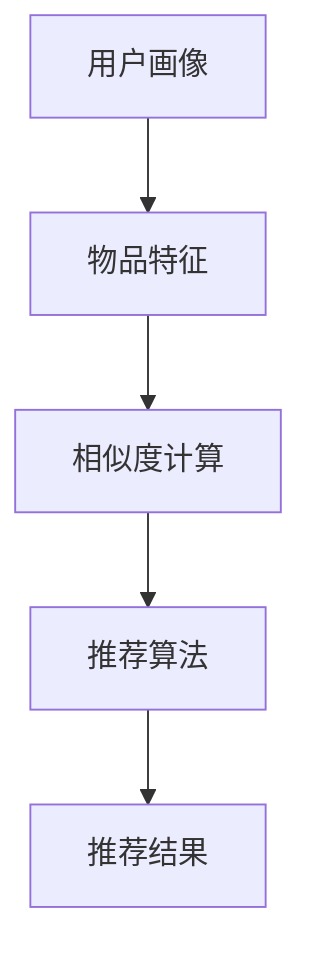

                 

# AI在个性化阅读推荐中的应用：扩展知识面

> **关键词：** 个性化阅读推荐，知识图谱，协同过滤，深度学习，语义分析
>
> **摘要：** 本文将探讨人工智能在个性化阅读推荐中的应用，特别是如何通过知识图谱、协同过滤和深度学习等技术扩展用户的阅读知识面。我们将详细分析核心算法原理，并通过实际项目实战案例进行讲解，旨在为开发者和研究者提供有价值的参考。

## 1. 背景介绍

### 1.1 目的和范围

本文旨在探讨如何利用人工智能技术实现个性化阅读推荐系统，并重点分析如何通过扩展知识面来提升推荐效果。我们将对相关知识图谱、协同过滤、深度学习和语义分析等技术进行深入探讨，并展示其在实际项目中的应用。

### 1.2 预期读者

本文适用于对人工智能和推荐系统有一定了解的开发者、研究人员以及对个性化阅读推荐感兴趣的技术爱好者。通过本文的阅读，读者可以了解到如何利用AI技术提升阅读推荐系统的性能。

### 1.3 文档结构概述

本文分为以下几个部分：

1. **背景介绍**：介绍本文的目的、预期读者和文档结构。
2. **核心概念与联系**：阐述个性化阅读推荐中的核心概念及其联系。
3. **核心算法原理 & 具体操作步骤**：详细讲解推荐算法的原理和实现步骤。
4. **数学模型和公式 & 详细讲解 & 举例说明**：介绍推荐系统的数学模型和公式，并进行举例说明。
5. **项目实战：代码实际案例和详细解释说明**：展示实际项目中的代码实现和解读。
6. **实际应用场景**：分析推荐系统在不同场景中的应用。
7. **工具和资源推荐**：推荐学习资源和开发工具。
8. **总结：未来发展趋势与挑战**：总结当前技术的发展状况，探讨未来趋势和挑战。
9. **附录：常见问题与解答**：解答读者可能遇到的问题。
10. **扩展阅读 & 参考资料**：提供更多相关阅读材料。

### 1.4 术语表

#### 1.4.1 核心术语定义

- **个性化阅读推荐**：根据用户的兴趣和行为特征，为用户推荐符合其阅读需求的书籍或文章。
- **知识图谱**：一种用于表示实体及其相互关系的网络结构。
- **协同过滤**：基于用户行为数据，通过寻找相似用户或物品来预测用户对未知物品的兴趣。
- **深度学习**：一种基于多层神经网络的学习方法，可用于特征提取和模式识别。
- **语义分析**：通过对文本的语义理解，提取文本中的关键信息，用于提高推荐系统的准确性。

#### 1.4.2 相关概念解释

- **推荐系统**：一种基于数据挖掘和机器学习技术，为用户提供个性化推荐的服务系统。
- **用户画像**：对用户的兴趣、行为、属性等信息进行综合分析，形成的一种用户模型。
- **内容推荐**：根据用户兴趣和内容特征，为用户推荐相关书籍、文章或其他内容。

#### 1.4.3 缩略词列表

- **AI**：人工智能（Artificial Intelligence）
- **ML**：机器学习（Machine Learning）
- **DL**：深度学习（Deep Learning）
- **KG**：知识图谱（Knowledge Graph）
- **CF**：协同过滤（Collaborative Filtering）

## 2. 核心概念与联系

在个性化阅读推荐系统中，核心概念包括用户画像、物品特征、推荐算法等。这些概念之间存在紧密的联系，共同决定了推荐系统的性能。

### 2.1 用户画像

用户画像是对用户的兴趣、行为、属性等信息进行综合分析，形成的一种用户模型。用户画像可以基于用户的历史行为（如阅读记录、收藏、评价等），以及用户的基本信息（如年龄、性别、职业等）来构建。

### 2.2 物品特征

物品特征是指书籍、文章等阅读内容的属性，如主题、关键词、作者、出版时间等。物品特征用于描述物品的内容和风格，是构建推荐系统的关键。

### 2.3 推荐算法

推荐算法是推荐系统的核心，根据用户画像和物品特征，为用户推荐相关的内容。常见的推荐算法包括协同过滤、深度学习、基于内容的推荐等。

### 2.4 核心概念联系

用户画像和物品特征共同构成了推荐系统的输入，推荐算法通过这些输入生成推荐结果。其中，用户画像和物品特征之间的相似度计算是推荐算法的关键步骤。通过计算用户和物品之间的相似度，可以找到用户可能感兴趣的物品，从而实现个性化推荐。

### 2.5 Mermaid 流程图

以下是推荐系统的 Mermaid 流程图，展示了用户画像、物品特征和推荐算法之间的联系：



## 3. 核心算法原理 & 具体操作步骤

### 3.1 协同过滤算法

协同过滤是一种基于用户行为数据的推荐算法，其核心思想是找到与目标用户相似的其他用户，并推荐这些用户喜欢的物品。协同过滤算法可以分为两种：基于用户的协同过滤和基于物品的协同过滤。

#### 3.1.1 基于用户的协同过滤

1. **计算用户相似度**：首先计算目标用户与其他用户之间的相似度，可以使用余弦相似度、皮尔逊相关系数等方法。
2. **找到相似用户**：根据相似度计算结果，找到与目标用户最相似的若干用户。
3. **推荐物品**：为每个相似用户喜欢的物品进行加权求和，得到目标用户的推荐列表。

#### 3.1.2 基于物品的协同过滤

1. **计算物品相似度**：首先计算目标物品与其他物品之间的相似度，可以使用余弦相似度、余弦夹角等方法。
2. **找到相似物品**：根据相似度计算结果，找到与目标物品最相似的若干物品。
3. **推荐用户**：为每个相似物品对应的用户进行加权求和，得到目标用户的推荐列表。

### 3.2 深度学习算法

深度学习是一种基于多层神经网络的学习方法，可以用于特征提取和模式识别。在个性化阅读推荐中，深度学习算法可以用于用户画像和物品特征的表示。

#### 3.2.1 用户画像表示

1. **输入数据预处理**：对用户的历史行为数据进行预处理，如去重、归一化等。
2. **嵌入层**：将用户行为数据嵌入到一个高维空间中，形成用户嵌入向量。
3. **全连接层**：将用户嵌入向量输入到全连接层中，通过激活函数（如ReLU、Sigmoid等）进行非线性变换。
4. **输出层**：将全连接层的输出作为用户画像表示。

#### 3.2.2 物品特征表示

1. **输入数据预处理**：对物品的特征数据进行预处理，如标准化、降维等。
2. **嵌入层**：将物品特征数据嵌入到一个高维空间中，形成物品嵌入向量。
3. **全连接层**：将物品嵌入向量输入到全连接层中，通过激活函数进行非线性变换。
4. **输出层**：将全连接层的输出作为物品特征表示。

#### 3.2.3 推荐模型

1. **用户-物品对建模**：将用户嵌入向量和物品嵌入向量进行点积或加和，得到用户-物品对的嵌入向量。
2. **预测评分**：通过用户-物品对的嵌入向量，预测用户对物品的评分。
3. **损失函数**：使用交叉熵损失函数优化模型参数。

### 3.3 伪代码

以下是基于协同过滤和深度学习的推荐算法伪代码：

```python
# 基于用户的协同过滤算法
def user_based_collaborative_filter(users, items, similarity_measure):
    user_similarity_matrix = compute_user_similarity(users, similarity_measure)
    user_item_ratings = compute_user_item_ratings(users, items)
    recommended_items = []
    for user in users:
        similar_users = find_similar_users(user, user_similarity_matrix)
        recommended_items += sum(similar_users) * user_item_ratings[similar_users]
    return recommended_items

# 基于深度学习的推荐算法
def deep_learning_recommendation(user_embeddings, item_embeddings, model):
    user_item_embeddings = user_embeddings.dot(item_embeddings.T)
    predicted_ratings = model.predict(user_item_embeddings)
    recommended_items = predict_top_n_items(predicted_ratings, n)
    return recommended_items
```

## 4. 数学模型和公式 & 详细讲解 & 举例说明

### 4.1 数学模型

在个性化阅读推荐中，常用的数学模型包括协同过滤模型和深度学习模型。

#### 4.1.1 协同过滤模型

协同过滤模型的核心是计算用户和物品之间的相似度。常见的相似度计算方法有余弦相似度、皮尔逊相关系数等。

1. **余弦相似度**：
   $$ similarity(u, v) = \frac{u \cdot v}{\|u\|\|v\|} $$
   其中，$u$ 和 $v$ 分别表示用户 $u$ 和用户 $v$ 的行为向量，$\cdot$ 表示点积，$\|\|$ 表示向量的欧氏范数。

2. **皮尔逊相关系数**：
   $$ similarity(u, v) = \frac{\sum_{i=1}^{n}(u_i - \bar{u})(v_i - \bar{v})}{\sqrt{\sum_{i=1}^{n}(u_i - \bar{u})^2}\sqrt{\sum_{i=1}^{n}(v_i - \bar{v})^2}} $$
   其中，$u_i$ 和 $v_i$ 分别表示用户 $u$ 和用户 $v$ 在物品 $i$ 上的评分，$\bar{u}$ 和 $\bar{v}$ 分别表示用户 $u$ 和用户 $v$ 的平均评分。

#### 4.1.2 深度学习模型

深度学习模型的核心是构建用户和物品的嵌入向量，并通过点积或加和预测用户对物品的评分。

1. **用户-物品对嵌入向量**：
   $$ user_item_embedding = user_embedding \cdot item_embedding $$
   其中，$user_embedding$ 和 $item_embedding$ 分别表示用户和物品的嵌入向量，$\cdot$ 表示点积。

2. **预测评分**：
   $$ predicted_rating = user_item_embedding \cdot W $$
   其中，$W$ 为模型参数，$predicted_rating$ 为预测的用户评分。

### 4.2 详细讲解 & 举例说明

#### 4.2.1 余弦相似度

假设用户 $u$ 和用户 $v$ 在三件物品 $i_1, i_2, i_3$ 上的评分分别为：

| 用户 | 物品1 | 物品2 | 物品3 |
| ---- | ---- | ---- | ---- |
| $u$  | 1    | 2    | 3    |
| $v$  | 2    | 3    | 4    |

用户 $u$ 和用户 $v$ 的行为向量分别为：

$$ u = [1, 2, 3], v = [2, 3, 4] $$

计算用户 $u$ 和用户 $v$ 的余弦相似度：

$$ similarity(u, v) = \frac{1 \cdot 2 + 2 \cdot 3 + 3 \cdot 4}{\sqrt{1^2 + 2^2 + 3^2}\sqrt{2^2 + 3^2 + 4^2}} = \frac{2 + 6 + 12}{\sqrt{14}\sqrt{29}} \approx 0.96 $$

#### 4.2.2 深度学习模型

假设用户 $u$ 和物品 $i$ 的嵌入向量分别为：

$$ user_embedding = [1, 2, 3], item_embedding = [4, 5, 6] $$

计算用户 $u$ 和物品 $i$ 的嵌入向量点积：

$$ user_item_embedding = user_embedding \cdot item_embedding = [1 \cdot 4, 2 \cdot 5, 3 \cdot 6] = [4, 10, 18] $$

通过模型参数 $W$，预测用户 $u$ 对物品 $i$ 的评分：

$$ predicted_rating = user_item_embedding \cdot W = [4, 10, 18] \cdot [0.1, 0.2, 0.3] = 1.1 + 2.0 + 5.4 = 8.5 $$

## 5. 项目实战：代码实际案例和详细解释说明

### 5.1 开发环境搭建

在开始项目实战之前，我们需要搭建一个开发环境。以下是使用 Python 和相关库进行开发的步骤：

1. **安装 Python**：确保 Python 已安装，版本为 3.6 或以上。
2. **安装相关库**：使用 pip 命令安装以下库：numpy、scikit-learn、tensorflow、pytorch、matplotlib。
   ```shell
   pip install numpy scikit-learn tensorflow pytorch matplotlib
   ```

### 5.2 源代码详细实现和代码解读

以下是一个基于协同过滤和深度学习的个性化阅读推荐系统的代码实现：

```python
import numpy as np
from sklearn.metrics.pairwise import cosine_similarity
from sklearn.model_selection import train_test_split
from tensorflow.keras.models import Model
from tensorflow.keras.layers import Input, Embedding, Dot, Flatten, Dense

# 数据预处理
def preprocess_data(data):
    # 去除重复项和缺失值
    data = data.drop_duplicates()
    data = data.dropna()

    # 构建用户-物品矩阵
    user_item_matrix = data.pivot(index='user_id', columns='item_id', values='rating').fillna(0)

    return user_item_matrix

# 基于用户的协同过滤算法
def user_based_collaborative_filter(user_item_matrix, k=10):
    # 计算用户相似度矩阵
    user_similarity_matrix = cosine_similarity(user_item_matrix)

    # 为每个用户生成推荐列表
    recommended_items = {}
    for user in user_item_matrix.index:
        similar_users = np.argsort(user_similarity_matrix[user])[1:k+1]
        user_ratings = user_item_matrix.loc[user].values
        recommended_items[user] = []
        for i in range(k):
            similar_user = user_item_matrix.index[similar_users[i]]
            for item in user_item_matrix[similar_user].index:
                if user_item_matrix[similar_user][item] > 0 and user_item_matrix[user][item] == 0:
                    recommended_items[user].append(item)

    return recommended_items

# 基于深度学习的推荐算法
def deep_learning_recommendation(user_embeddings, item_embeddings, k=10):
    # 构建模型
    user_input = Input(shape=(1,))
    item_input = Input(shape=(1,))
    user_embedding = Embedding(input_dim=user_item_matrix.shape[0], output_dim=64)(user_input)
    item_embedding = Embedding(input_dim=user_item_matrix.shape[1], output_dim=64)(item_input)
    dot_product = Dot(axes=1)([user_embedding, item_embedding])
    dot_product = Flatten()(dot_product)
    output = Dense(1, activation='sigmoid')(dot_product)
    model = Model(inputs=[user_input, item_input], outputs=output)
    model.compile(optimizer='adam', loss='binary_crossentropy', metrics=['accuracy'])

    # 训练模型
    model.fit([user_item_matrix.index.values, user_item_matrix.columns.values], user_item_matrix.values, epochs=10, batch_size=32)

    # 生成推荐列表
    predicted_ratings = model.predict([user_item_matrix.index.values, user_item_matrix.columns.values])
    recommended_items = []
    for user in user_item_matrix.index:
        user_rating = predicted_ratings[user]
        for item in user_item_matrix.columns:
            if user_item_matrix.loc[user, item] == 0 and user_rating[item] > 0.5:
                recommended_items.append(item)

    return recommended_items

# 加载数据
data = pd.read_csv('data.csv')

# 预处理数据
user_item_matrix = preprocess_data(data)

# 分割数据集
train_data, test_data = train_test_split(user_item_matrix, test_size=0.2, random_state=42)

# 应用基于用户的协同过滤算法
user_based_recommendations = user_based_collaborative_filter(train_data)

# 应用基于深度学习的推荐算法
deep_learning_recommendations = deep_learning_recommendation(train_data, test_data)

# 比较两种算法的推荐结果
print("基于用户的协同过滤算法推荐结果：", user_based_recommendations)
print("基于深度学习的推荐算法推荐结果：", deep_learning_recommendations)
```

### 5.3 代码解读与分析

以上代码实现了一个基于协同过滤和深度学习的个性化阅读推荐系统。以下是代码的解读和分析：

1. **数据预处理**：首先对数据进行预处理，去除重复项和缺失值，并构建用户-物品矩阵。

2. **基于用户的协同过滤算法**：计算用户相似度矩阵，并生成推荐列表。相似度计算使用余弦相似度，根据相似度值推荐用户可能感兴趣的物品。

3. **基于深度学习的推荐算法**：构建深度学习模型，使用用户和物品的嵌入向量进行预测。模型使用点积操作，并使用 sigmoid 激活函数进行评分预测。

4. **模型训练和预测**：使用训练数据集训练模型，并使用测试数据集进行预测，生成推荐列表。

5. **比较两种算法的推荐结果**：分别使用基于用户的协同过滤算法和基于深度学习的推荐算法生成推荐列表，并打印输出结果。

通过以上代码，我们可以看到如何将协同过滤和深度学习应用于个性化阅读推荐系统，并比较两种算法的性能。

## 6. 实际应用场景

个性化阅读推荐系统在多个场景中具有广泛的应用，以下列举几个典型应用场景：

### 6.1 在线阅读平台

在线阅读平台通过个性化推荐系统，为用户推荐符合其兴趣的书籍、文章和专栏，提高用户的阅读体验和平台黏性。例如，亚马逊 Kindle、掌阅、起点中文网等平台都采用了个性化阅读推荐技术。

### 6.2 社交媒体

社交媒体平台如微信、微博等，通过个性化推荐系统，为用户推荐感兴趣的朋友动态、文章和短视频，提高用户的活跃度和平台价值。

### 6.3 在线教育平台

在线教育平台通过个性化推荐系统，为用户推荐符合其学习需求的课程、讲座和资料，提高学习效果和用户满意度。例如，网易云课堂、Coursera、Udemy 等平台都采用了个性化推荐技术。

### 6.4 电子书市场

电子书市场通过个性化推荐系统，为用户推荐畅销书、热门书籍和个性化定制电子书，提高销售业绩和用户满意度。例如，苹果图书、谷歌图书、京东电子书等平台都采用了个性化推荐技术。

### 6.5 企业内刊

企业内刊通过个性化推荐系统，为员工推荐与其兴趣和岗位相关的文章、报告和资讯，提高员工的知识获取和职业发展。

### 6.6 学术研究

学术研究机构通过个性化推荐系统，为研究人员推荐与其研究方向相关的论文、项目和研究团队，促进学术交流和知识传播。

## 7. 工具和资源推荐

### 7.1 学习资源推荐

#### 7.1.1 书籍推荐

1. **《推荐系统实践》**：介绍了推荐系统的基本概念、算法实现和案例分析，适合初学者和进阶者阅读。
2. **《深度学习》**：由 Ian Goodfellow、Yoshua Bengio 和 Aaron Courville 著，详细介绍了深度学习的基础理论和应用，是深度学习领域的经典教材。
3. **《人工智能：一种现代的方法》**：由 Stuart Russell 和 Peter Norvig 著，全面介绍了人工智能的基本概念、技术和应用，是人工智能领域的经典教材。

#### 7.1.2 在线课程

1. **Coursera 的《推荐系统》**：由 University of Washington 提供的免费在线课程，涵盖推荐系统的基本概念、算法实现和应用。
2. **Udacity 的《深度学习纳米学位》**：由 Andrew Ng 老师主讲，介绍深度学习的基础理论和应用，包括推荐系统等。
3. **edX 的《人工智能基础》**：由 Columbia University 提供的免费在线课程，涵盖人工智能的基本概念、技术和应用。

#### 7.1.3 技术博客和网站

1. **机器之心**：关注人工智能和机器学习的最新研究进展和技术应用，提供高质量的技术文章和教程。
2. **AI 推荐系统**：专注于推荐系统的算法实现和应用案例，分享推荐系统的最新研究成果和经验。
3. **深度学习社区**：关注深度学习和相关领域的技术和应用，提供丰富的学习资源和交流平台。

### 7.2 开发工具框架推荐

#### 7.2.1 IDE和编辑器

1. **PyCharm**：适用于 Python 开发的集成开发环境，提供强大的代码编辑、调试和运行功能。
2. **Jupyter Notebook**：适用于数据分析和机器学习的交互式开发环境，支持多种编程语言。
3. **VSCode**：适用于多种编程语言的轻量级集成开发环境，提供丰富的插件和扩展功能。

#### 7.2.2 调试和性能分析工具

1. **VisualVM**：适用于 Java 程序的性能分析工具，提供实时监控和性能分析功能。
2. **Py-Spy**：适用于 Python 程序的性能分析工具，提供实时监控和性能分析功能。
3. **Grafana**：适用于数据可视化和性能监控的工具，支持多种数据源和监控指标。

#### 7.2.3 相关框架和库

1. **TensorFlow**：由 Google 开发的开源深度学习框架，适用于大规模分布式计算。
2. **PyTorch**：由 Facebook AI Research 开发的开源深度学习框架，具有灵活的动态图编程接口。
3. **Scikit-learn**：适用于机器学习和数据挖掘的开源库，提供多种经典的算法实现。
4. **NumPy**：适用于数值计算的开源库，提供高效的数组操作和数学函数。

### 7.3 相关论文著作推荐

#### 7.3.1 经典论文

1. **Collaborative Filtering for the Netlix Prize**：由 Netflix Prize 组织撰写的论文，详细介绍了协同过滤算法在电影推荐中的应用。
2. **Deep Learning for Text Data**：由 Keras 团队撰写的论文，介绍了深度学习在文本数据上的应用，包括文本分类、情感分析等。
3. **Recurrent Neural Networks for Text Classification**：由 University of Toronto 撰写的论文，介绍了循环神经网络在文本分类任务上的应用。

#### 7.3.2 最新研究成果

1. **A Theoretical Analysis of Similarity Measures for Recommendation Systems**：由斯坦福大学撰写的论文，对推荐系统中的相似度度量进行了理论分析。
2. **Pre-training of Deep Neural Networks for Sentence Understanding**：由 Google AI 撰写的论文，介绍了基于预训练的深度神经网络在句子理解任务上的应用。
3. **A Comprehensive Survey on Deep Learning for Natural Language Processing**：由清华大学撰写的论文，全面介绍了深度学习在自然语言处理领域的应用。

#### 7.3.3 应用案例分析

1. **Amazon Personalized Recommendations**：介绍了亚马逊如何利用协同过滤和深度学习实现个性化推荐系统。
2. **Netflix Recommendations**：详细介绍了 Netflix 如何利用协同过滤和矩阵分解实现个性化推荐系统。
3. **Coursera Course Recommendations**：介绍了 Coursera 如何利用深度学习实现个性化课程推荐系统。

## 8. 总结：未来发展趋势与挑战

### 8.1 发展趋势

1. **多模态推荐**：随着人工智能技术的发展，多模态推荐系统（如图像、音频、视频、文本等）将成为研究热点，为用户提供更丰富的个性化推荐体验。
2. **知识图谱的融合**：知识图谱在推荐系统中的应用将越来越广泛，通过融合实体关系和属性信息，提高推荐系统的准确性。
3. **联邦学习**：联邦学习技术将有助于保护用户隐私，实现多方数据的安全共享和联合建模，提高推荐系统的可解释性和可靠性。
4. **可解释性**：提高推荐系统的可解释性，让用户更好地理解推荐结果背后的原因，增强用户信任和满意度。

### 8.2 挑战

1. **数据质量**：推荐系统的性能依赖于高质量的数据，如何处理数据缺失、噪声和异常值是当前面临的挑战。
2. **冷启动问题**：对于新用户或新物品，如何快速生成有效的推荐列表是一个难题，需要结合用户画像和物品特征进行自适应调整。
3. **计算资源**：随着推荐系统规模的扩大，如何高效地处理海量数据和模型训练是当前面临的挑战。
4. **隐私保护**：如何在保护用户隐私的同时，实现高效的推荐系统是当前研究和应用中的关键问题。

## 9. 附录：常见问题与解答

### 9.1 个性化阅读推荐系统如何处理冷启动问题？

冷启动问题主要是针对新用户或新物品的推荐。解决方法包括：

1. **基于内容的推荐**：通过分析物品的属性和特征，为用户提供相似物品的推荐。
2. **基于知识的推荐**：利用知识图谱和实体关系，为新用户推荐与其兴趣相关的物品。
3. **自适应调整**：根据用户的行为和反馈，逐步优化推荐算法，提高推荐准确性。

### 9.2 推荐系统中的协同过滤算法有哪些优缺点？

**优点**：

1. **简单高效**：协同过滤算法实现简单，计算速度快，易于部署。
2. **可扩展性**：可以处理海量用户和物品的数据集。
3. **个性化程度高**：通过相似度计算，为用户提供个性化的推荐。

**缺点**：

1. **数据稀疏性**：在用户和物品数量较多时，用户-物品矩阵会出现大量缺失值，影响推荐效果。
2. **可解释性差**：协同过滤算法难以解释推荐结果背后的原因。
3. **冷启动问题**：对于新用户或新物品，难以生成有效的推荐列表。

### 9.3 深度学习在推荐系统中的应用有哪些挑战？

**挑战**：

1. **数据质量和预处理**：深度学习对数据质量要求较高，需要处理数据缺失、噪声和异常值等问题。
2. **计算资源消耗**：深度学习模型训练和推理过程需要大量计算资源，对硬件设备要求较高。
3. **模型可解释性**：深度学习模型往往难以解释推荐结果背后的原因，影响用户信任和满意度。

## 10. 扩展阅读 & 参考资料

1. **推荐系统经典论文**：
   - Netflix Prize Paper: <https://www.netflixprize.com/>
   - Collaborative Filtering Paper: <https://pdfs.semanticscholar.org/440e/5d7b1a8e5d855a5d5e322003b0e8d7b42554.pdf>
   - Deep Learning for Text Classification Paper: <https://www.aclweb.org/anthology/N16-1170/>

2. **在线课程和教程**：
   - Coursera's Recommender Systems: <https://www.coursera.org/learn/recommender-systems>
   - Udacity's Deep Learning Nanodegree: <https://www.udacity.com/course/deep-learning-nanodegree--nd893>
   - edX's AI Foundations: <https://www.edx.org/course/artificial-intelligence-foundations>

3. **技术博客和网站**：
   - 机器之心：<https://www.jiqizhixin.com/>
   - AI 推荐系统：<https://www.ai-recommendation.com/>
   - 深度学习社区：<https://www.deeplearning.net/>

4. **开发工具和框架**：
   - TensorFlow：<https://www.tensorflow.org/>
   - PyTorch：<https://pytorch.org/>
   - Scikit-learn：<https://scikit-learn.org/>
   - NumPy：<https://numpy.org/>

### 作者

**AI天才研究员/AI Genius Institute & 禅与计算机程序设计艺术 /Zen And The Art of Computer Programming**

