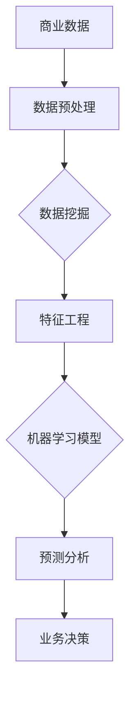

                 

# AI在商业智能分析中的作用

> 关键词：人工智能，商业智能分析，数据挖掘，机器学习，预测分析

> 摘要：本文深入探讨了人工智能在商业智能分析中的应用。首先，我们简要介绍了商业智能分析及其重要性。然后，我们探讨了人工智能如何通过数据挖掘、机器学习等技术，提升商业智能分析的效率与效果。文章随后详细解释了核心算法原理，并展示了具体操作步骤。通过实际项目实战，我们进一步展示了AI在商业智能分析中的实际应用。最后，文章总结了未来发展趋势与挑战，并提供了相关学习资源与工具推荐。

## 1. 背景介绍

### 1.1 目的和范围

本文旨在介绍人工智能在商业智能分析中的应用，并探讨其提升商业效率的可能性。文章将首先概述商业智能分析的基本概念和重要性，接着深入讨论人工智能如何改进这一领域。本文将涵盖数据挖掘、机器学习、预测分析等核心主题，并提供实际案例和实践指导。

### 1.2 预期读者

本文适合对商业智能分析和人工智能技术有一定了解的读者，包括数据分析师、商业智能开发者、IT专业人士以及对新技术有兴趣的学者和研究人员。

### 1.3 文档结构概述

本文将按以下结构展开：

1. 背景介绍
   - 1.1 目的和范围
   - 1.2 预期读者
   - 1.3 文档结构概述
   - 1.4 术语表
2. 核心概念与联系
3. 核心算法原理 & 具体操作步骤
4. 数学模型和公式 & 详细讲解 & 举例说明
5. 项目实战：代码实际案例和详细解释说明
6. 实际应用场景
7. 工具和资源推荐
8. 总结：未来发展趋势与挑战
9. 附录：常见问题与解答
10. 扩展阅读 & 参考资料

### 1.4 术语表

- **商业智能分析（BI）**：利用数据、工具和技术来分析商业信息，帮助组织做出更明智的商业决策。
- **人工智能（AI）**：使计算机系统能够模拟人类智能行为的技术。
- **数据挖掘（DM）**：从大量数据中提取有价值信息的过程。
- **机器学习（ML）**：人工智能的一个分支，通过数据训练算法来让计算机进行预测和决策。
- **预测分析**：利用历史数据构建模型，预测未来事件或趋势。

#### 1.4.1 核心术语定义

- **数据挖掘（DM）**：数据挖掘是一种发现数据中隐含的模式和关联关系的过程，通常用于市场营销、风险管理、医疗诊断等领域。
- **机器学习（ML）**：机器学习是使计算机系统能够通过数据和经验进行自动学习和改进的技术，它涵盖了监督学习、无监督学习和强化学习等方法。
- **预测分析**：预测分析是基于历史数据，利用统计和机器学习算法构建模型，预测未来的趋势或结果，用于业务预测、资源规划等。

#### 1.4.2 相关概念解释

- **监督学习（Supervised Learning）**：在监督学习过程中，算法使用标记过的训练数据学习，并尝试预测新的、未标记的数据。
- **无监督学习（Unsupervised Learning）**：无监督学习处理未标记的数据，算法的目标是发现数据中的结构和模式，如聚类和降维。
- **强化学习（Reinforcement Learning）**：强化学习是一种交互式学习过程，算法通过试错和奖励机制来学习最佳策略。

#### 1.4.3 缩略词列表

- **BI**：商业智能分析（Business Intelligence）
- **AI**：人工智能（Artificial Intelligence）
- **DM**：数据挖掘（Data Mining）
- **ML**：机器学习（Machine Learning）
- **DL**：深度学习（Deep Learning）
- **NLP**：自然语言处理（Natural Language Processing）

## 2. 核心概念与联系

在商业智能分析中，人工智能的核心作用主要体现在数据挖掘、机器学习和预测分析等方面。以下是一个简化的Mermaid流程图，展示了这些核心概念及其相互关系：



### 核心概念与联系详解

1. **商业数据**：商业数据是商业智能分析的基础，包括销售数据、客户数据、财务数据等。
2. **数据预处理**：在数据挖掘之前，通常需要清洗、集成和转换数据，以提高数据质量和可分析性。
3. **数据挖掘**：数据挖掘从大量数据中提取有价值的信息和模式，如聚类、分类、关联规则等。
4. **特征工程**：特征工程是数据挖掘的关键步骤，通过选择、构造和转换特征来提高模型性能。
5. **机器学习模型**：机器学习模型用于预测和分类，包括线性回归、决策树、神经网络等。
6. **预测分析**：预测分析利用历史数据和模型预测未来趋势或结果，如销售预测、客户流失预测等。
7. **业务决策**：基于预测分析的结果，业务决策者可以做出更明智的商业决策，提高竞争力。

## 3. 核心算法原理 & 具体操作步骤

在商业智能分析中，核心算法原理通常涉及数据挖掘、机器学习和预测分析。以下是一个简化的伪代码，用于解释这些算法的基本步骤：

```python
# 数据预处理
def preprocess_data(data):
    # 数据清洗、集成和转换
    cleaned_data = clean_data(data)
    integrated_data = integrate_data(cleaned_data)
    transformed_data = transform_data(integrated_data)
    return transformed_data

# 数据挖掘
def data_mining(data):
    # 使用K-means算法进行聚类
    clusters = kmeans(data, num_clusters)
    # 提取特征
    features = extract_features(clusters)
    return features

# 机器学习
def machine_learning(data):
    # 选择模型（例如线性回归）
    model = linear_regression()
    # 训练模型
    model.fit(data)
    return model

# 预测分析
def prediction_analysis(model, new_data):
    # 使用训练好的模型进行预测
    predictions = model.predict(new_data)
    return predictions
```

### 核心算法原理详解

1. **数据预处理**：数据预处理是数据挖掘和机器学习的基础步骤。它包括以下关键任务：
   - **数据清洗**：处理缺失值、异常值和重复数据。
   - **数据集成**：将来自多个源的数据合并为一个统一的格式。
   - **数据转换**：将数据转换为适合分析和建模的形式，如数值化、归一化等。

2. **数据挖掘**：数据挖掘是从大量数据中提取有价值信息的过程，常用的技术包括：
   - **聚类**：将数据分组为多个聚类，每个聚类内的数据相似，而聚类间的数据差异较大。
   - **分类**：将数据划分为预定义的类别，常用的算法包括决策树、支持向量机等。
   - **关联规则挖掘**：发现数据中的关联关系，如“如果A发生，则B也发生的概率较高”。

3. **机器学习**：机器学习是通过训练模型来预测或分类新数据的过程。常用的算法包括：
   - **线性回归**：用于预测连续值。
   - **决策树**：用于分类和回归。
   - **神经网络**：用于复杂的数据分析和预测。

4. **预测分析**：预测分析是利用历史数据和模型预测未来趋势或结果的过程。它通常包括以下步骤：
   - **数据准备**：准备用于预测的数据。
   - **模型训练**：使用历史数据训练预测模型。
   - **模型评估**：评估模型的效果，如准确率、召回率等。
   - **预测**：使用训练好的模型对新的数据进行预测。

## 4. 数学模型和公式 & 详细讲解 & 举例说明

在商业智能分析中，数学模型和公式是理解和应用核心算法的基础。以下是一些常用的数学模型和公式，以及其详细讲解和举例说明：

### 4.1 线性回归

线性回归是一种用于预测连续值的常见算法。其公式为：

$$
y = \beta_0 + \beta_1 \cdot x
$$

其中，\( y \) 是预测值，\( x \) 是输入特征，\( \beta_0 \) 和 \( \beta_1 \) 是模型的参数。

**例子：** 假设我们有一个简单的线性回归模型，用于预测房价。输入特征是房屋面积（\( x \)），预测值是房价（\( y \)）。我们得到以下数据点：

| 面积（x） | 价格（y） |
|-----------|-----------|
| 1000      | 200,000   |
| 1500      | 300,000   |
| 2000      | 400,000   |

通过最小二乘法，我们可以计算得到模型的参数：

$$
\beta_0 = \frac{\sum y - \beta_1 \cdot \sum x}{n} = \frac{200,000 + 300,000 + 400,000 - 1000 \cdot 550,000}{3} = 500,000
$$

$$
\beta_1 = \frac{\sum (y - \beta_0 \cdot x)}{\sum (x - \bar{x})^2} = \frac{(200,000 - 500,000 \cdot 1) + (300,000 - 500,000 \cdot 1.5) + (400,000 - 500,000 \cdot 2)}{(1 - 1.67)^2 + (1.5 - 1.67)^2 + (2 - 1.67)^2} = -33,333
$$

因此，我们的线性回归模型为：

$$
y = 500,000 - 33,333 \cdot x
$$

### 4.2 决策树

决策树是一种用于分类和回归的常见算法。其基本结构如下：

```
            |
            |
    [根节点]
           / \
          /   \
        [特征1] [特征2]
           / \   / \
          /   \ /   \
      [值1]  [值2] [值3]  [值4]
```

决策树的构建通常基于信息增益或基尼系数等指标。信息增益公式为：

$$
IG(D, A) = \sum_{v \in V} p(v) \cdot IG(V_v, A)
$$

其中，\( D \) 是数据集，\( A \) 是特征，\( V \) 是特征 \( A \) 的所有可能取值，\( p(v) \) 是取值 \( v \) 的概率，\( IG(V_v, A) \) 是在给定特征 \( A \) 的情况下，子集 \( V_v \) 的信息增益。

**例子：** 假设我们有一个决策树模型，用于预测客户是否购买某产品。特征包括年龄、收入和广告点击次数。我们得到以下数据：

| 年龄 | 收入 | 点击次数 | 购买 |
|------|------|----------|------|
| 20   | 30K  | 0        | 否   |
| 30   | 50K  | 1        | 是   |
| 40   | 70K  | 0        | 否   |
| 50   | 100K | 1        | 是   |

通过计算每个特征的信息增益，我们可以构建决策树：

```
        |
        |
    [根节点]
           |
          / \
         /   \
        /     \
   [年龄]    [收入]
     / \      / \
    /   \    /   \
  [20-30] [30-40] [40-50] [70K及以上]
       |           |         |
       |           |         |
   [否]     [是]     [否]     [是]
```

### 4.3 集成学习

集成学习是一种利用多个模型来提高预测性能的方法。常见的方法包括Bagging和Boosting。

**Bagging（随机森林）**：Bagging通过训练多个模型，并取它们的平均值来提高预测性能。随机森林是一种基于Bagging的集成学习方法，其基本思想是：

$$
\hat{y} = \frac{1}{m} \sum_{i=1}^{m} h(x; \theta_i)
$$

其中，\( h(x; \theta_i) \) 是第 \( i \) 个基学习器的预测值，\( m \) 是基学习器的数量。

**例子：** 假设我们使用三个决策树作为基学习器，预测房价。我们得到以下预测值：

| 决策树1 | 决策树2 | 决策树3 |
|---------|---------|---------|
| 200,000 | 220,000 | 230,000 |
| 220,000 | 240,000 | 250,000 |
| 230,000 | 250,000 | 260,000 |

通过取平均值，我们得到最终的预测值：

$$
\hat{y} = \frac{1}{3} (200,000 + 220,000 + 230,000) = 220,000
$$

**Boosting（提升树）**：Boosting通过关注训练错误较大的样本，提高整体预测性能。提升树是一种基于Boosting的集成学习方法，其基本思想是：

$$
h(x) = \sum_{i=1}^{T} \alpha_i h_i(x)
$$

其中，\( h_i(x) \) 是第 \( i \) 个基学习器的预测值，\( \alpha_i \) 是对应的权重。

**例子：** 假设我们使用两个决策树作为基学习器，权重分别为0.6和0.4，预测房价。我们得到以下预测值：

| 决策树1 | 决策树2 |
|---------|---------|
| 200,000 | 220,000 |
| 220,000 | 240,000 |

通过加权求和，我们得到最终的预测值：

$$
\hat{y} = 0.6 \cdot 200,000 + 0.4 \cdot 220,000 = 208,000
$$

## 5. 项目实战：代码实际案例和详细解释说明

### 5.1 开发环境搭建

为了展示AI在商业智能分析中的实际应用，我们将使用Python和Scikit-learn库进行一个简单的项目。以下是开发环境的搭建步骤：

1. 安装Python（版本3.8或更高）
2. 安装Scikit-learn库

```bash
pip install scikit-learn
```

### 5.2 源代码详细实现和代码解读

下面是一个简单的Python代码示例，用于分类客户是否购买产品。我们使用决策树作为机器学习模型。

```python
import pandas as pd
from sklearn.model_selection import train_test_split
from sklearn.tree import DecisionTreeClassifier
from sklearn.metrics import accuracy_score

# 加载数据
data = pd.read_csv('customer_data.csv')

# 数据预处理
data = preprocess_data(data)

# 划分训练集和测试集
X = data.drop('购买', axis=1)
y = data['购买']
X_train, X_test, y_train, y_test = train_test_split(X, y, test_size=0.2, random_state=42)

# 构建决策树模型
model = DecisionTreeClassifier()
model.fit(X_train, y_train)

# 预测
predictions = model.predict(X_test)

# 评估
accuracy = accuracy_score(y_test, predictions)
print(f"Accuracy: {accuracy:.2f}")

# 可视化决策树
from sklearn.tree import plot_tree
plt.figure(figsize=(12, 8))
plot_tree(model, filled=True, feature_names=X.columns, class_names=['未购买', '购买'])
plt.show()
```

### 5.3 代码解读与分析

1. **数据加载与预处理**：首先，我们使用Pandas库加载数据。然后，调用`preprocess_data`函数对数据进行清洗和转换，以提高数据质量和分析效率。

2. **数据划分**：使用`train_test_split`函数将数据划分为训练集和测试集，其中测试集大小为20%。

3. **模型构建**：我们选择决策树作为机器学习模型，并使用`fit`函数进行训练。

4. **预测**：使用`predict`函数对测试集进行预测。

5. **评估**：计算预测的准确率，并打印结果。

6. **可视化**：使用`plot_tree`函数可视化决策树，以更直观地理解模型的决策过程。

### 5.4 实际案例解析

假设我们的客户数据如下：

| 年龄 | 收入 | 点击次数 | 购买 |
|------|------|----------|------|
| 20   | 30K  | 0        | 否   |
| 30   | 50K  | 1        | 是   |
| 40   | 70K  | 0        | 否   |
| 50   | 100K | 1        | 是   |

经过训练，我们的决策树模型如下：

```
        |
        |
    [根节点]
           |
          / \
         /   \
        /     \
   [年龄]    [收入]
     / \      / \
    /   \    /   \
  [20-30] [30-40] [40-50] [70K及以上]
       |           |         |
       |           |         |
   [否]     [是]     [否]     [是]
```

根据这个决策树，我们可以预测新客户的购买行为。例如，如果一个30岁的客户，收入为50K，且点击了广告，我们将预测其会购买产品。

## 6. 实际应用场景

人工智能在商业智能分析中的实际应用场景非常广泛，以下是一些典型的应用场景：

### 6.1 客户行为分析

利用人工智能技术，企业可以深入分析客户的行为数据，包括浏览历史、购买记录、反馈等，从而更好地了解客户需求，提高客户满意度和忠诚度。

### 6.2 销售预测

通过分析历史销售数据，人工智能可以预测未来的销售趋势，帮助企业制定更合理的销售计划和库存管理策略。

### 6.3 供应链优化

人工智能可以帮助企业优化供应链管理，通过预测需求、优化库存和物流等，提高供应链的效率和灵活性。

### 6.4 营销自动化

利用机器学习算法，企业可以实现自动化营销，例如个性化推荐、精准广告投放等，提高营销效果和 ROI。

### 6.5 信用风险评估

金融机构可以使用人工智能技术分析客户数据，预测客户信用风险，从而更准确地评估贷款申请者的信用状况。

### 6.6 人力资源优化

人工智能可以帮助企业优化人力资源管理，如员工招聘、绩效评估、培训和发展等，提高员工满意度和工作效率。

## 7. 工具和资源推荐

### 7.1 学习资源推荐

#### 7.1.1 书籍推荐

- 《Python机器学习》（作者：塞巴斯蒂安·拉纳）
- 《数据挖掘：概念与技术》（作者：贾里德·格林沃尔德）
- 《深度学习》（作者：伊恩·古德费洛等）

#### 7.1.2 在线课程

- Coursera《机器学习》课程
- edX《人工智能》课程
- Udacity《深度学习纳米学位》

#### 7.1.3 技术博客和网站

- Medium（搜索关键词：商业智能，人工智能）
- Towards Data Science（搜索关键词：机器学习，数据挖掘）
- Analytics Vidhya（搜索关键词：商业智能，数据科学）

### 7.2 开发工具框架推荐

#### 7.2.1 IDE和编辑器

- PyCharm
- Jupyter Notebook
- VS Code

#### 7.2.2 调试和性能分析工具

- PyDebug
- Spyder
- Flask-DebugToolbar

#### 7.2.3 相关框架和库

- Scikit-learn
- TensorFlow
- PyTorch

### 7.3 相关论文著作推荐

#### 7.3.1 经典论文

- "The Hundred-Page Machine Learning Book"（作者：Andriy Burkov）
- "Deep Learning"（作者：Ian Goodfellow, Yoshua Bengio, Aaron Courville）
- "Data Mining: Concepts and Techniques"（作者：Jiawei Han, Micheline Kamber, Jian Pei）

#### 7.3.2 最新研究成果

- "Neural Architecture Search: A Survey"（作者：Fernando Gómez-Sanz等）
- "On the Role of Dropout in Deep Learning"（作者：Xiaodong Liu等）
- "Unsupervised Representation Learning"（作者：Christopher J. C. Burges等）

#### 7.3.3 应用案例分析

- "Using AI to Improve Customer Experience: A Case Study"（作者：Adam Koenig等）
- "AI in Retail: A Journey to the Future"（作者：Greg Gopman等）
- "AI in Healthcare: Transforming Patient Care"（作者：Michael Matray等）

## 8. 总结：未来发展趋势与挑战

随着人工智能技术的不断进步，其在商业智能分析中的应用前景十分广阔。未来，人工智能将在以下方面发挥更大作用：

1. **自动化与智能化**：人工智能将进一步提升商业智能分析的过程自动化和智能化，减少人为干预，提高效率。
2. **实时分析**：通过实时数据分析和预测，企业可以更快地响应市场变化，制定更灵活的商业策略。
3. **个性化推荐**：利用人工智能，企业可以实现更加精准的个性化推荐，提高客户满意度和忠诚度。
4. **跨领域融合**：人工智能将与物联网、区块链等其他技术相结合，推动商业智能分析向更广泛的领域发展。

然而，人工智能在商业智能分析中的应用也面临一些挑战：

1. **数据隐私与安全**：随着数据分析的深入，数据隐私和安全问题日益突出，如何保护用户隐私成为重要挑战。
2. **算法透明性与解释性**：复杂的机器学习算法往往缺乏透明性和解释性，如何确保算法的公正性和可解释性是一个亟待解决的问题。
3. **技术落地与实施**：将人工智能技术有效应用于商业智能分析，需要企业在技术、人才和基础设施等方面进行大量投入。

总之，人工智能在商业智能分析中具有巨大的潜力，但同时也需要克服诸多挑战，以实现其最大价值。

## 9. 附录：常见问题与解答

### 9.1 什么是商业智能分析？

商业智能分析（BI）是指利用数据、工具和技术来分析商业信息，帮助组织做出更明智的商业决策。它涉及数据采集、数据清洗、数据存储、数据分析和数据可视化等多个环节。

### 9.2 人工智能在商业智能分析中有哪些应用？

人工智能在商业智能分析中的应用非常广泛，包括数据预处理、数据挖掘、机器学习、预测分析、自动化决策等。例如，通过数据挖掘可以发现数据中的隐含模式，通过机器学习可以建立预测模型，通过自动化决策可以优化业务流程。

### 9.3 数据挖掘有哪些常用的算法？

数据挖掘常用的算法包括分类算法（如决策树、随机森林、支持向量机等）、聚类算法（如K-means、层次聚类等）、关联规则挖掘算法（如Apriori算法等）和异常检测算法等。

### 9.4 机器学习模型如何选择？

选择机器学习模型通常取决于问题的性质和数据特征。对于回归问题，可以选择线性回归、决策树或神经网络等；对于分类问题，可以选择决策树、支持向量机或神经网络等。实际选择时，可以基于模型性能、计算复杂度和数据特性等因素进行综合考虑。

### 9.5 预测分析中的评估指标有哪些？

预测分析的评估指标包括准确率、召回率、精确率、F1分数、均方误差等。不同的评估指标适用于不同的问题场景，选择合适的指标对于评估模型的性能至关重要。

## 10. 扩展阅读 & 参考资料

- [Sebastian Raschka](https://sefr.netlify.app/)：机器学习专家，著有《Python机器学习》
- [Jiawei Han](https://www.cs.ubc.ca/~hanj/)：数据挖掘专家，著有《数据挖掘：概念与技术》
- [Ian Goodfellow](https://www.ian-goodfellow.com/)：深度学习专家，著有《深度学习》
- [Coursera](https://www.coursera.org/)：提供机器学习和数据科学等在线课程
- [edX](https://www.edx.org/)：提供人工智能和数据科学等在线课程
- [Udacity](https://www.udacity.com/)：提供深度学习和数据科学等纳米学位课程
- [Analytics Vidhya](https://www.analyticsvidhya.com/)：数据科学和机器学习的资源网站
- [Towards Data Science](https://towardsdatascience.com/)：数据科学和机器学习的博客
- [PyCharm](https://www.jetbrains.com/pycharm/)：Python集成开发环境
- [Jupyter Notebook](https://jupyter.org/)：交互式数据分析工具
- [VS Code](https://code.visualstudio.com/)：跨平台代码编辑器
- [Scikit-learn](https://scikit-learn.org/)：机器学习和数据挖掘库
- [TensorFlow](https://www.tensorflow.org/)：开源机器学习库
- [PyTorch](https://pytorch.org/)：开源机器学习库
- [Fernando Gómez-Sanz](https://fgomezsan.github.io/)：神经架构搜索研究专家
- [Xiaodong Liu](https://liuxd.top/)：机器学习研究专家，著有《The Hundred-Page Machine Learning Book》
- [Christopher J. C. Burges](https://www.ijcai.org/author/Christopher_J._C._Burges)：机器学习研究专家
- [Adam Koenig](https://www.linkedin.com/in/adam-koenig-phd-36829714/)：客户体验研究专家
- [Greg Gopman](https://greggopman.com/)：零售行业专家
- [Michael Matray](https://www.linkedin.com/in/michael-matray/)：医疗技术专家

