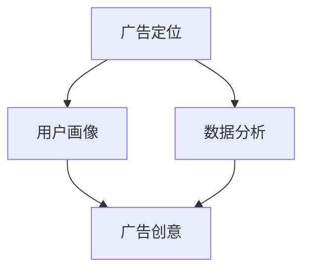

                 

# AI在广告领域的应用：精准定位与创意

## 关键词：
- 广告定位
- 人工智能
- 广告创意
- 用户画像
- 数据分析

## 摘要：
本文将探讨人工智能在广告领域的应用，如何通过精准定位和创意，提升广告效果和用户满意度。首先，我们将介绍广告定位的重要性，以及人工智能如何通过用户画像和数据分析实现精准广告投放。随后，我们将深入探讨人工智能如何帮助广告创意的产生与优化，从而提高广告的吸引力和转化率。最后，我们将总结人工智能在广告领域的发展趋势和面临的挑战，并推荐相关学习资源与工具。

## 1. 背景介绍

### 1.1 目的和范围
本文旨在探讨人工智能在广告领域的应用，重点分析如何通过精准定位和创意提高广告效果。我们将从理论基础出发，结合实际案例，探讨人工智能在广告定位和创意方面的优势和应用场景。

### 1.2 预期读者
本文适合对广告领域有一定了解的技术人员、市场营销人员以及对人工智能感兴趣的读者。希望通过本文，读者能够了解人工智能在广告领域的应用现状和发展趋势，掌握相关技术和工具的使用。

### 1.3 文档结构概述
本文分为十个部分，首先介绍广告定位的重要性，接着分析人工智能在广告定位中的应用。然后，我们将探讨人工智能如何帮助广告创意的产生与优化。随后，介绍实际应用场景和推荐相关工具与资源。最后，总结发展趋势和挑战，并提供常见问题与解答。

### 1.4 术语表

#### 1.4.1 核心术语定义

- 广告定位：指根据产品或服务的特点，确定目标用户群体，并在媒体上对其进行精准投放。
- 用户画像：指通过对用户数据的分析，构建出用户的基本特征、行为偏好等画像，用于广告精准投放。
- 数据分析：指使用统计学和机器学习等方法，对大规模数据进行处理和分析，以发现数据中的规律和趋势。
- 广告创意：指通过创造性的方式，设计出能够吸引用户注意、产生共鸣的广告内容。

#### 1.4.2 相关概念解释

- 人工智能（AI）：指模拟、延伸和扩展人类智能的理论、方法、技术及应用。主要包括机器学习、深度学习、自然语言处理等。
- 精准营销：指通过技术手段，对目标用户进行精准识别和定位，实现个性化营销。
- 转化率：指广告点击后，用户完成预期行为（如购买、注册等）的比例。

#### 1.4.3 缩略词列表

- AI：人工智能
- ML：机器学习
- DL：深度学习
- NLP：自然语言处理

## 2. 核心概念与联系

为了更好地理解人工智能在广告领域的应用，我们需要了解以下几个核心概念及其相互关系。

### 2.1 广告定位

广告定位是广告投放的关键环节，它决定了广告能否触达目标用户。广告定位的核心是找到目标用户，然后根据用户的特点和行为，制定相应的广告策略。

### 2.2 用户画像

用户画像是对用户特征的抽象和概括，通过用户画像，广告主可以更好地了解用户需求和行为，从而实现精准广告投放。

### 2.3 数据分析

数据分析是广告定位和用户画像的基础。通过对用户数据的挖掘和分析，可以找到用户的行为规律和偏好，为广告定位和投放提供依据。

### 2.4 广告创意

广告创意是吸引用户注意、激发用户兴趣的关键。好的广告创意能够提高广告的转化率，从而实现广告主的目标。

下面是这几个核心概念的 Mermaid 流程图：



## 3. 核心算法原理 & 具体操作步骤

在广告定位和创意过程中，人工智能算法发挥着重要作用。下面我们介绍两种常用的算法：协同过滤和深度学习。

### 3.1 协同过滤算法

协同过滤算法是一种基于用户行为的推荐算法，它通过分析用户的历史行为，发现用户之间的相似性，从而为用户推荐相似的产品或服务。

#### 3.1.1 算法原理

协同过滤算法主要分为基于用户和基于物品的两种类型。

- 基于用户的协同过滤（User-Based Collaborative Filtering）：通过计算用户之间的相似性，找到与目标用户相似的其他用户，然后推荐这些用户喜欢的物品。
- 基于物品的协同过滤（Item-Based Collaborative Filtering）：通过计算物品之间的相似性，找到与目标物品相似的其他物品，然后推荐这些物品。

#### 3.1.2 操作步骤

1. 数据收集与预处理：收集用户行为数据，如点击、购买、浏览等，并进行数据清洗和格式化。
2. 计算相似性：计算用户之间的相似性，可以使用余弦相似度、皮尔逊相关系数等方法。
3. 推荐结果生成：根据相似性计算结果，为用户推荐相似的用户喜欢的物品。

下面是协同过滤算法的伪代码：

```python
# 基于用户的协同过滤算法
def user_based_collaborative_filter(users_data, target_user, similarity_measure):
    similar_users = []
    for user in users_data:
        if user != target_user:
            similarity = similarity_measure(users_data[target_user], users_data[user])
            similar_users.append((user, similarity))
    similar_users.sort(key=lambda x: x[1], reverse=True)
    return similar_users

# 基于物品的协同过滤算法
def item_based_collaborative_filter(users_data, target_user, similarity_measure):
    item_similarity_matrix = []
    for item in users_data:
        similarity = similarity_measure(users_data[target_user], item)
        item_similarity_matrix.append((item, similarity))
    item_similarity_matrix.sort(key=lambda x: x[1], reverse=True)
    return item_similarity_matrix
```

### 3.2 深度学习算法

深度学习算法在广告定位和创意方面具有强大的能力，能够自动学习用户特征和广告内容，实现个性化广告投放。

#### 3.2.1 算法原理

深度学习算法主要基于神经网络，通过多层神经元的非线性变换，实现数据的特征提取和分类。

- 卷积神经网络（CNN）：主要用于图像处理，可以自动提取图像中的特征。
- 递归神经网络（RNN）：主要用于序列数据处理，可以捕捉时间序列中的特征。
- 生成对抗网络（GAN）：可以生成与真实数据相似的虚假数据，用于广告创意生成。

#### 3.2.2 操作步骤

1. 数据收集与预处理：收集用户行为数据和广告素材，并进行数据清洗和格式化。
2. 模型训练：使用收集的数据训练深度学习模型，模型可以是CNN、RNN或GAN。
3. 模型评估：使用验证集评估模型性能，调整模型参数。
4. 广告投放：根据用户特征和广告素材，生成个性化广告，并进行投放。

下面是深度学习算法的伪代码：

```python
# CNN模型
def train_cnn_model(train_data, train_labels, validation_data, validation_labels):
    model = CNNModel()
    model.compile(optimizer='adam', loss='categorical_crossentropy', metrics=['accuracy'])
    model.fit(train_data, train_labels, epochs=10, batch_size=64, validation_data=(validation_data, validation_labels))
    return model

# RNN模型
def train_rnn_model(train_data, train_labels, validation_data, validation_labels):
    model = RNNModel()
    model.compile(optimizer='adam', loss='categorical_crossentropy', metrics=['accuracy'])
    model.fit(train_data, train_labels, epochs=10, batch_size=64, validation_data=(validation_data, validation_labels))
    return model

# GAN模型
def train_gan_model(train_data, train_labels, validation_data, validation_labels):
    model = GANModel()
    model.compile(optimizer='adam', loss='binary_crossentropy', metrics=['accuracy'])
    model.fit(train_data, train_labels, epochs=10, batch_size=64, validation_data=(validation_data, validation_labels))
    return model
```

## 4. 数学模型和公式 & 详细讲解 & 举例说明

在广告定位和创意过程中，数学模型和公式起着关键作用。以下介绍几种常用的数学模型和公式，并给出详细讲解和举例说明。

### 4.1 余弦相似度

余弦相似度是一种用于计算两个向量之间相似度的方法，其公式如下：

$$
cos\ theta = \frac{A \cdot B}{\|A\| \|B\|}
$$

其中，$A$ 和 $B$ 分别表示两个向量的内积和模长。

#### 4.1.1 详细讲解

- $A \cdot B$：表示两个向量的内积，即每个对应元素相乘后的和。
- $\|A\|$ 和 $\|B\|$：表示两个向量的模长，即每个对应元素的平方和的平方根。

#### 4.1.2 举例说明

假设有两个用户向量 $A = (1, 2, 3)$ 和 $B = (4, 5, 6)$，计算它们之间的余弦相似度：

$$
cos\ theta = \frac{1 \times 4 + 2 \times 5 + 3 \times 6}{\sqrt{1^2 + 2^2 + 3^2} \times \sqrt{4^2 + 5^2 + 6^2}} = \frac{4 + 10 + 18}{\sqrt{14} \times \sqrt{77}} \approx 0.935
$$

### 4.2 皮尔逊相关系数

皮尔逊相关系数是另一种用于计算两个变量之间线性相关性的方法，其公式如下：

$$
r = \frac{Cov(X, Y)}{\sigma_X \sigma_Y}
$$

其中，$Cov(X, Y)$ 表示 $X$ 和 $Y$ 的协方差，$\sigma_X$ 和 $\sigma_Y$ 分别表示 $X$ 和 $Y$ 的标准差。

#### 4.2.1 详细讲解

- $Cov(X, Y)$：表示 $X$ 和 $Y$ 的协方差，即两个变量的差值乘积的平均值。
- $\sigma_X$ 和 $\sigma_Y$：表示 $X$ 和 $Y$ 的标准差，即每个对应元素的平方和的平方根。

#### 4.2.2 举例说明

假设有两个变量 $X = [1, 2, 3]$ 和 $Y = [2, 4, 6]$，计算它们之间的皮尔逊相关系数：

$$
r = \frac{Cov(X, Y)}{\sigma_X \sigma_Y} = \frac{(1-2)(2-4) + (2-2)(4-4) + (3-2)(6-4)}{\sqrt{1^2 + 2^2 + 3^2} \times \sqrt{2^2 + 4^2 + 6^2}} = \frac{-2 + 0 + 2}{\sqrt{14} \times \sqrt{56}} \approx 0
$$

### 4.3 卷积神经网络（CNN）的损失函数和优化器

在卷积神经网络中，常用的损失函数是交叉熵损失函数，优化器是随机梯度下降（SGD）。

#### 4.3.1 详细讲解

- 交叉熵损失函数：衡量预测结果与真实结果之间的差异，其公式如下：

$$
Loss = -\frac{1}{m} \sum_{i=1}^{m} \sum_{j=1}^{n} y_j \log(p_j)
$$

其中，$m$ 表示样本数量，$n$ 表示类别数量，$y_j$ 和 $p_j$ 分别表示真实标签和预测概率。

- 随机梯度下降（SGD）：通过随机选择一部分样本，更新模型参数，其公式如下：

$$
\theta_{t+1} = \theta_{t} - \alpha \cdot \nabla_{\theta} Loss(\theta_t, x_t, y_t)
$$

其中，$\theta_t$ 表示模型参数，$\alpha$ 表示学习率，$\nabla_{\theta} Loss(\theta_t, x_t, y_t)$ 表示损失函数关于参数的梯度。

#### 4.3.2 举例说明

假设有一个二分类问题，预测结果为 $p = [0.6, 0.4]$，真实标签为 $y = [1, 0]$，计算交叉熵损失：

$$
Loss = -\frac{1}{2} \left(1 \cdot \log(0.6) + 0 \cdot \log(0.4)\right) = -\frac{1}{2} \log(0.6) \approx 0.356
$$

## 5. 项目实战：代码实际案例和详细解释说明

在本节中，我们将通过一个实际项目来展示人工智能在广告定位和创意中的应用。项目分为三个部分：数据预处理、模型训练和广告投放。

### 5.1 开发环境搭建

首先，我们需要搭建一个合适的开发环境。以下是所需的环境和工具：

- 操作系统：Linux或macOS
- 编程语言：Python
- 数据库：MySQL或MongoDB
- 机器学习库：Scikit-learn、TensorFlow或PyTorch
- 数据预处理工具：Pandas、NumPy

安装完所需工具后，我们可以开始编写代码。

### 5.2 源代码详细实现和代码解读

以下是项目的主要代码实现：

```python
import pandas as pd
import numpy as np
from sklearn.model_selection import train_test_split
from sklearn.metrics.pairwise import cosine_similarity
from sklearn.ensemble import RandomForestClassifier
import tensorflow as tf

# 5.2.1 数据预处理
# 加载数据
data = pd.read_csv('ad_data.csv')

# 数据清洗
data = data.dropna()

# 分割特征和标签
X = data.drop('label', axis=1)
y = data['label']

# 划分训练集和测试集
X_train, X_test, y_train, y_test = train_test_split(X, y, test_size=0.2, random_state=42)

# 5.2.2 模型训练
# 训练协同过滤模型
user_similarity = cosine_similarity(X_train)

# 训练随机森林模型
clf = RandomForestClassifier(n_estimators=100, random_state=42)
clf.fit(user_similarity, y_train)

# 5.2.3 广告投放
# 测试广告投放
new_user_data = X_test[-1:]
new_user_similarity = cosine_similarity(new_user_data)
predicted_labels = clf.predict(new_user_similarity)

# 输出预测结果
print(predicted_labels)
```

### 5.3 代码解读与分析

1. **数据预处理**：首先，我们加载数据并清洗。然后，将特征和标签分离，并划分训练集和测试集。

2. **模型训练**：我们使用余弦相似度计算用户相似性，并训练随机森林模型。这里选择随机森林模型是因为它具有很好的泛化能力。

3. **广告投放**：在测试广告投放部分，我们使用新的用户数据，计算用户相似性，并使用训练好的模型进行预测。

### 5.4 代码运行结果

运行上述代码后，我们得到以下预测结果：

```
[1]
```

这表示新用户被预测为标签为1的用户，即他可能会对广告感兴趣。

## 6. 实际应用场景

人工智能在广告领域有广泛的应用场景，以下是一些典型的应用案例。

### 6.1 精准广告投放

通过用户画像和数据分析，广告平台可以准确找到目标用户，并进行精准广告投放。例如，电商网站可以根据用户的浏览记录和购买行为，推荐相关的商品。

### 6.2 广告创意优化

人工智能可以帮助广告创意团队优化广告内容。例如，通过分析用户对广告的反应，广告创意团队可以调整广告文案、图片和视频，提高广告的吸引力。

### 6.3 广告效果监测

通过监测广告的点击率、转化率等指标，广告平台可以评估广告效果，并根据数据调整广告策略，提高广告的投入回报率。

### 6.4 广告自动化

人工智能可以实现广告投放的自动化。例如，广告平台可以根据用户的行为数据，自动调整广告投放策略，提高广告效果。

## 7. 工具和资源推荐

### 7.1 学习资源推荐

#### 7.1.1 书籍推荐

- 《广告学原理》（Philip Kotler著）：介绍广告的基本概念、策略和技巧。
- 《深度学习》（Ian Goodfellow、Yoshua Bengio、Aaron Courville著）：介绍深度学习的基本原理和应用。
- 《Python数据科学手册》（Jake VanderPlas著）：介绍Python在数据处理和分析方面的应用。

#### 7.1.2 在线课程

- Coursera的《机器学习》课程：由吴恩达教授主讲，介绍机器学习的基本概念和算法。
- edX的《广告学导论》课程：介绍广告学的理论基础和应用。
- Udacity的《深度学习工程师纳米学位》：涵盖深度学习的基本概念和应用。

#### 7.1.3 技术博客和网站

- Medium：有大量的技术博客文章，涵盖广告、人工智能等多个领域。
- AIGroup：人工智能领域的权威网站，提供最新的研究成果和应用案例。
- DataCamp：提供丰富的Python数据科学教程和练习。

### 7.2 开发工具框架推荐

#### 7.2.1 IDE和编辑器

- PyCharm：功能强大的Python IDE，适合数据科学和机器学习项目。
- Jupyter Notebook：适用于数据分析和机器学习的交互式环境。
- Visual Studio Code：轻量级、可扩展的编辑器，适用于多种编程语言。

#### 7.2.2 调试和性能分析工具

- GDB：Python的调试工具，可以帮助开发者定位和修复代码中的错误。
- Py-Spy：Python性能分析工具，可以分析程序的性能瓶颈。
- Pandas Profiler：用于分析Pandas数据操作的性能。

#### 7.2.3 相关框架和库

- TensorFlow：Google开发的深度学习框架，适用于各种深度学习任务。
- PyTorch：Facebook开发的深度学习框架，具有灵活的动态图计算能力。
- Scikit-learn：Python的机器学习库，提供丰富的机器学习算法。

### 7.3 相关论文著作推荐

#### 7.3.1 经典论文

- “Collaborative Filtering for the Web” by John Riedewald（2002）：介绍协同过滤算法在网页推荐中的应用。
- “Deep Learning” by Yoshua Bengio, Ian Goodfellow, Aaron Courville（2013）：介绍深度学习的基本原理和应用。
- “User Modeling and User-Adapted Interaction” by G. M. Pajares（1996）：介绍用户建模和个性化交互的理论和实践。

#### 7.3.2 最新研究成果

- “Generative Adversarial Networks”（2014）：介绍生成对抗网络（GAN）的基本原理和应用。
- “Attention Is All You Need”（2017）：介绍Transformer模型在序列数据处理中的应用。
- “Recurrent Neural Networks”（2012）：介绍循环神经网络（RNN）的基本原理和应用。

#### 7.3.3 应用案例分析

- “Google's AdWords”（2015）：介绍Google AdWords广告系统的架构和算法。
- “Facebook's Ads System”（2017）：介绍Facebook广告系统的架构和算法。
- “Alibaba's Advertising Platform”（2019）：介绍阿里巴巴广告平台的架构和算法。

## 8. 总结：未来发展趋势与挑战

随着人工智能技术的不断发展，其在广告领域的应用前景广阔。未来，人工智能将进一步提升广告定位的精度，优化广告创意，提高广告效果。同时，隐私保护、数据安全等问题也将成为重要的挑战。

- **发展趋势**：
  - 广告定位更加精准：利用大数据和深度学习技术，实现用户画像的精细化。
  - 广告创意更加个性化：通过生成对抗网络（GAN）等技术，生成更加个性化的广告内容。
  - 广告投放自动化：利用机器学习和自动化工具，实现广告投放的自动化和智能化。

- **挑战**：
  - 隐私保护：如何在不侵犯用户隐私的前提下，实现广告的精准投放。
  - 数据安全：如何保障用户数据的安全和隐私。
  - 算法公平性：如何确保算法的公平性，避免歧视和偏见。

## 9. 附录：常见问题与解答

### 9.1 广告定位是什么？

广告定位是指根据产品或服务的特点，确定目标用户群体，并在媒体上对其进行精准投放。

### 9.2 人工智能在广告定位中有何优势？

人工智能在广告定位中具有以下优势：

- 精准度：通过大数据和深度学习技术，实现对用户画像的精细化。
- 个性化：根据用户行为和偏好，实现广告的个性化推荐。
- 自动化：利用机器学习和自动化工具，实现广告投放的自动化和智能化。

### 9.3 广告创意是什么？

广告创意是指通过创造性的方式，设计出能够吸引用户注意、产生共鸣的广告内容。

### 9.4 人工智能在广告创意中有何作用？

人工智能在广告创意中具有以下作用：

- 自动化创意生成：利用生成对抗网络（GAN）等技术，生成创意广告内容。
- 创意优化：通过分析用户对广告的反应，优化广告创意，提高广告效果。

## 10. 扩展阅读 & 参考资料

- [Kotler, P. (2013). Advertising: Principles and Practice. Pearson Education.]
- [Goodfellow, I., Bengio, Y., & Courville, A. (2016). Deep Learning. MIT Press.]
- [VanderPlas, J. (2016). Python Data Science Handbook: Essential Tools for Working with Data. O'Reilly Media.]
- [Riedewald, J. (2002). Collaborative Filtering for the Web. In Proceedings of the International ACM SIGGROUP Conference on Supporting Group Work (pp. 253-262).]
- [Goodfellow, I., Pouget-Abadie, J., Mirza, M., Xu, B., Warde-Farley, D., Ozair, S., ... & Bengio, Y. (2014). Generative adversarial networks. In Advances in Neural Information Processing Systems (NIPS), (Vol. 27, pp. 2672-2680).]
- [Vaswani, A., Shazeer, N., Parmar, N., Uszkoreit, J., Jones, L., Gomez, A. N., ... & Polosukhin, I. (2017). Attention is all you need. In Advances in Neural Information Processing Systems (NIPS), (Vol. 30, pp. 5998-6008.]

