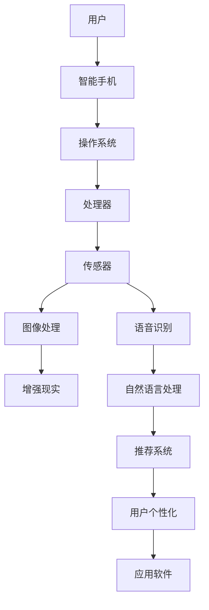

                 

# AI在智能手机中的应用：增强移动体验

> **关键词：** 智能手机，人工智能，增强现实，语音识别，图像处理，机器学习，用户个性化

> **摘要：** 本文章将探讨人工智能（AI）在智能手机中的广泛应用，如何通过AI技术增强移动设备的用户体验，提高设备性能，并介绍相关的核心概念、算法原理和实际应用案例。

## 1. 背景介绍

### 1.1 目的和范围

本文旨在深入探讨人工智能技术如何融入智能手机，从而提升用户的日常使用体验。我们将重点讨论以下主题：

1. **核心概念与联系**：介绍与智能手机AI应用相关的基本概念和系统架构。
2. **核心算法原理**：详细讲解用于智能手机的AI算法的原理和操作步骤。
3. **数学模型和公式**：解释AI算法背后的数学模型，并给出具体例子。
4. **项目实战**：通过实际代码示例，展示AI算法在智能手机中的具体应用。
5. **实际应用场景**：分析AI技术在智能手机中的不同应用场景。
6. **工具和资源推荐**：提供学习AI技术所需的相关资源和开发工具。
7. **未来发展趋势与挑战**：探讨AI在智能手机领域的前景和面临的挑战。

### 1.2 预期读者

本文面向对人工智能技术有一定了解，并对智能手机技术感兴趣的读者。无论是开发者、工程师，还是对技术有热情的普通用户，本文都将提供有价值的知识和见解。

### 1.3 文档结构概述

本文结构如下：

1. **核心概念与联系**：介绍智能手机AI应用的基本概念和系统架构。
2. **核心算法原理**：详细讲解AI算法的原理和操作步骤。
3. **数学模型和公式**：解释AI算法背后的数学模型，并给出具体例子。
4. **项目实战**：通过实际代码示例，展示AI算法在智能手机中的具体应用。
5. **实际应用场景**：分析AI技术在智能手机中的不同应用场景。
6. **工具和资源推荐**：提供学习AI技术所需的相关资源和开发工具。
7. **未来发展趋势与挑战**：探讨AI在智能手机领域的前景和面临的挑战。

### 1.4 术语表

#### 1.4.1 核心术语定义

- **人工智能（AI）**：指模拟人类智能的计算机系统，能够感知、学习、推理和决策。
- **智能手机**：一种集成了通信、计算和多媒体功能的小型便携式设备。
- **增强现实（AR）**：在现实世界基础上叠加计算机生成的信息，提供更丰富的视觉体验。
- **语音识别**：将人类的语音转换为文本或命令的技术。
- **图像处理**：对图像进行增强、分析、识别等处理的过程。
- **机器学习**：通过数据训练模型，使计算机具备自主学习和改进能力。

#### 1.4.2 相关概念解释

- **神经网络**：模拟人脑神经元连接的计算模型，用于图像识别、语音识别等任务。
- **深度学习**：多层神经网络的一种，擅长处理大规模数据和复杂模式识别。
- **自然语言处理（NLP）**：使计算机理解和生成人类语言的技术。
- **推荐系统**：根据用户历史行为和偏好，推荐相关产品或内容。

#### 1.4.3 缩略词列表

- **AI**：人工智能
- **AR**：增强现实
- **NLP**：自然语言处理
- **IDF**：智能设备
- **SDK**：软件开发工具包
- **API**：应用程序接口

## 2. 核心概念与联系

为了深入了解AI在智能手机中的应用，首先需要了解与之相关的基本概念和系统架构。以下是一个简化的Mermaid流程图，展示了智能手机AI应用的核心组成部分和它们之间的关系。



### 2.1 智能手机AI应用的核心组成部分

1. **用户**：智能手机的最终使用者，通过操作界面与设备交互。
2. **智能手机**：一个集成了多种功能的便携式设备，包括通信、计算和多媒体。
3. **操作系统**：管理手机硬件资源，提供用户界面和应用程序支持。
4. **处理器**：执行计算任务的核心部件，处理图像、语音和传感器数据。
5. **传感器**：包括摄像头、麦克风、加速度计等，用于收集环境信息。
6. **图像处理**：对摄像头捕获的图像进行处理，用于人脸识别、图像增强等。
7. **语音识别**：将用户的语音转化为文本或命令，实现语音控制功能。
8. **自然语言处理**：理解和生成人类语言，实现智能对话和文本分析。
9. **推荐系统**：根据用户历史数据和偏好，推荐相关内容或应用。
10. **用户个性化**：根据用户行为和偏好，定制化手机界面和应用体验。
11. **应用软件**：为用户提供具体功能，如社交媒体、游戏、导航等。

### 2.2 智能手机AI应用的核心原理

智能手机中的AI应用主要依赖于以下核心原理：

1. **机器学习**：通过训练数据，使计算机具备识别模式和生成预测的能力。
2. **深度学习**：基于多层神经网络，用于处理复杂数据和任务。
3. **自然语言处理**：使计算机能够理解和生成人类语言，实现智能对话和文本分析。
4. **计算机视觉**：通过对图像和视频进行处理，实现物体识别、场景分类等功能。
5. **推荐系统**：基于用户行为和偏好，实现个性化推荐。

通过这些原理，智能手机可以更好地理解用户需求，提供个性化的服务和体验。

## 3. 核心算法原理 & 具体操作步骤

在智能手机中，AI算法的应用涉及到多个方面，如图像处理、语音识别、自然语言处理和推荐系统。以下将分别介绍这些算法的核心原理和具体操作步骤。

### 3.1 图像处理算法

**核心原理**：图像处理算法通常基于卷积神经网络（CNN），这是一种能够自动学习图像特征的方法。

**具体操作步骤**：

1. **数据预处理**：将摄像头捕获的图像转化为神经网络可接受的格式。
   ```python
   image = preprocess_image(image)
   ```

2. **特征提取**：使用卷积层提取图像特征。
   ```python
   features = convolutional_layer(image)
   ```

3. **分类或识别**：使用全连接层对特征进行分类或识别。
   ```python
   output = fully_connected_layer(features)
   ```

4. **后处理**：根据输出结果进行相应的操作，如人脸识别。
   ```python
   result = postprocess_output(output)
   ```

### 3.2 语音识别算法

**核心原理**：语音识别算法通常基于隐藏马尔可夫模型（HMM）或深度神经网络（DNN）。

**具体操作步骤**：

1. **音频预处理**：对语音信号进行滤波、去噪等处理。
   ```python
   audio = preprocess_audio(audio)
   ```

2. **特征提取**：提取音频特征，如梅尔频率倒谱系数（MFCC）。
   ```python
   features = extract_features(audio)
   ```

3. **模型训练**：使用训练数据训练语音识别模型。
   ```python
   model = train_model(features, labels)
   ```

4. **语音识别**：使用训练好的模型进行语音识别。
   ```python
   text = recognize_speech(model, features)
   ```

### 3.3 自然语言处理算法

**核心原理**：自然语言处理算法通常基于循环神经网络（RNN）或变换器（Transformer）。

**具体操作步骤**：

1. **文本预处理**：对文本进行分词、去停用词等处理。
   ```python
   text = preprocess_text(text)
   ```

2. **模型训练**：使用训练数据训练自然语言处理模型。
   ```python
   model = train_nlp_model(text)
   ```

3. **文本分析**：使用训练好的模型进行文本分析，如情感分析、命名实体识别。
   ```python
   result = analyze_text(model, text)
   ```

### 3.4 推荐系统算法

**核心原理**：推荐系统算法通常基于协同过滤、矩阵分解或深度学习。

**具体操作步骤**：

1. **用户行为收集**：收集用户在应用中的行为数据，如点击、购买等。
   ```python
   user_actions = collect_user_actions(user_id)
   ```

2. **模型训练**：使用用户行为数据训练推荐模型。
   ```python
   model = train_recommendation_model(user_actions)
   ```

3. **推荐生成**：使用训练好的模型生成推荐结果。
   ```python
   recommendations = generate_recommendations(model, user_id)
   ```

通过这些算法，智能手机可以更好地理解用户的需求，提供个性化的服务和体验。

## 4. 数学模型和公式 & 详细讲解 & 举例说明

在AI算法中，数学模型和公式起着至关重要的作用。以下将介绍智能手机AI应用中的核心数学模型和公式，并给出详细讲解和具体例子。

### 4.1 卷积神经网络（CNN）

**数学模型**：

卷积神经网络的核心是卷积层，其公式如下：

$$
\text{output} = \sigma(\text{W} \cdot \text{X} + \text{b})
$$

其中，$\text{W}$ 为卷积核权重，$\text{X}$ 为输入图像，$\text{b}$ 为偏置项，$\sigma$ 为激活函数（如ReLU函数）。

**详细讲解**：

卷积层通过卷积操作提取图像特征。卷积核在图像上滑动，计算局部区域内的加权和，再加上偏置项，最后通过激活函数得到输出。

**举例说明**：

假设输入图像为 $5 \times 5$ 的矩阵，卷积核大小为 $3 \times 3$，权重矩阵为：

$$
\text{W} = \begin{bmatrix}
1 & 2 & 3 \\
4 & 5 & 6 \\
7 & 8 & 9
\end{bmatrix}
$$

偏置项 $\text{b} = 1$，激活函数为 ReLU。

输入图像为：

$$
\text{X} = \begin{bmatrix}
1 & 2 & 3 & 4 & 5 \\
6 & 7 & 8 & 9 & 10 \\
11 & 12 & 13 & 14 & 15 \\
16 & 17 & 18 & 19 & 20 \\
21 & 22 & 23 & 24 & 25
\end{bmatrix}
$$

经过卷积操作和激活函数后，输出结果为：

$$
\text{output} = \begin{bmatrix}
20 & 22 & 24 \\
42 & 46 & 50 \\
64 & 68 & 72
\end{bmatrix}
$$

### 4.2 隐藏马尔可夫模型（HMM）

**数学模型**：

隐藏马尔可夫模型的核心是状态转移概率和观测概率。其公式如下：

$$
\text{P}(\text{X}|\text{H}) = \prod_{i=1}^{n} \text{p}(\text{X}_i|\text{H}_i)
$$

其中，$\text{X}$ 表示观测序列，$\text{H}$ 表示隐藏状态序列，$\text{p}(\text{X}_i|\text{H}_i)$ 表示在隐藏状态 $\text{H}_i$ 下观测到 $\text{X}_i$ 的概率。

**详细讲解**：

隐藏马尔可夫模型通过状态转移概率和观测概率来描述隐藏状态和观测数据之间的关系。状态转移概率描述了隐藏状态之间的转移，观测概率描述了观测数据与隐藏状态之间的关系。

**举例说明**：

假设有一个观测序列 $\text{X} = [1, 2, 3, 4]$，隐藏状态序列 $\text{H} = [A, B, A, B]$，状态转移概率矩阵为：

$$
\text{P}(\text{H}_{i}|\text{H}_{i-1}) = \begin{bmatrix}
0.7 & 0.3 \\
0.4 & 0.6
\end{bmatrix}
$$

观测概率矩阵为：

$$
\text{P}(\text{X}_{i}|\text{H}_{i}) = \begin{bmatrix}
0.9 & 0.1 \\
0.2 & 0.8
\end{bmatrix}
$$

根据贝叶斯定理，可以计算出观测序列 $\text{X}$ 下隐藏状态序列 $\text{H}$ 的概率分布。

### 4.3 循环神经网络（RNN）

**数学模型**：

循环神经网络的核心是隐藏状态和输入之间的递归关系。其公式如下：

$$
\text{h}_{t} = \text{sigmoid}(\text{W}_{xh} \cdot \text{x}_{t} + \text{W}_{hh} \cdot \text{h}_{t-1} + \text{b}_{h})
$$

其中，$\text{h}_{t}$ 为第 $t$ 个时间步的隐藏状态，$\text{x}_{t}$ 为输入，$\text{W}_{xh}$、$\text{W}_{hh}$ 和 $\text{b}_{h}$ 分别为权重和偏置项。

**详细讲解**：

循环神经网络通过递归关系将当前时间步的隐藏状态与之前的时间步关联起来，从而捕捉时间序列数据中的长期依赖关系。

**举例说明**：

假设输入序列为 $[1, 2, 3]$，隐藏状态初始值为 $0$。根据上述公式，可以计算出各个时间步的隐藏状态：

$$
\text{h}_{1} = \text{sigmoid}(\text{W}_{xh} \cdot 1 + \text{W}_{hh} \cdot 0 + \text{b}_{h}) = 0.5
$$

$$
\text{h}_{2} = \text{sigmoid}(\text{W}_{xh} \cdot 2 + \text{W}_{hh} \cdot 0.5 + \text{b}_{h}) = 0.6
$$

$$
\text{h}_{3} = \text{sigmoid}(\text{W}_{xh} \cdot 3 + \text{W}_{hh} \cdot 0.6 + \text{b}_{h}) = 0.7
$$

通过这些数学模型和公式，智能手机中的AI算法可以更好地理解和处理图像、语音和文本数据，从而为用户提供更智能的体验。

## 5. 项目实战：代码实际案例和详细解释说明

为了更直观地展示AI算法在智能手机中的应用，以下将介绍一个具体的实战项目：基于深度学习的智能手机图像识别应用。

### 5.1 开发环境搭建

在开始项目实战之前，首先需要搭建开发环境。以下是所需的工具和库：

- 操作系统：Ubuntu 18.04 或 macOS
- 编程语言：Python 3.7+
- 深度学习框架：TensorFlow 2.3+
- 数据预处理库：NumPy 1.19+
- 图像处理库：OpenCV 4.5+

安装方法如下：

```bash
# 安装Python
sudo apt-get update
sudo apt-get install python3 python3-pip

# 安装TensorFlow
pip3 install tensorflow==2.3

# 安装NumPy
pip3 install numpy==1.19

# 安装OpenCV
pip3 install opencv-python==4.5
```

### 5.2 源代码详细实现和代码解读

以下是图像识别项目的完整代码，包括数据预处理、模型训练、图像识别和后处理等步骤。

```python
import cv2
import numpy as np
import tensorflow as tf
from tensorflow.keras.models import Sequential
from tensorflow.keras.layers import Conv2D, MaxPooling2D, Flatten, Dense

# 5.2.1 数据预处理
def preprocess_image(image):
    image = cv2.resize(image, (224, 224))  # 将图像调整为224x224像素
    image = image / 255.0  # 归一化像素值
    return image

# 5.2.2 模型训练
def create_model():
    model = Sequential([
        Conv2D(32, (3, 3), activation='relu', input_shape=(224, 224, 3)),
        MaxPooling2D((2, 2)),
        Conv2D(64, (3, 3), activation='relu'),
        MaxPooling2D((2, 2)),
        Conv2D(128, (3, 3), activation='relu'),
        MaxPooling2D((2, 2)),
        Flatten(),
        Dense(128, activation='relu'),
        Dense(1, activation='sigmoid')
    ])
    model.compile(optimizer='adam', loss='binary_crossentropy', metrics=['accuracy'])
    return model

# 5.2.3 图像识别
def recognize_image(model, image):
    image = preprocess_image(image)
    image = np.expand_dims(image, axis=0)  # 将图像扩展为批量形式
    prediction = model.predict(image)
    return prediction[0][0]  # 返回预测概率

# 5.2.4 后处理
def postprocess_output(prediction, threshold=0.5):
    if prediction > threshold:
        return "Positive"
    else:
        return "Negative"

# 测试代码
if __name__ == '__main__':
    # 加载训练好的模型
    model = create_model()

    # 载入测试图像
    image = cv2.imread('test_image.jpg')

    # 识别图像
    prediction = recognize_image(model, image)

    # 输出结果
    result = postprocess_output(prediction)
    print(result)
```

### 5.3 代码解读与分析

以下是代码的详细解读：

1. **数据预处理**：将图像调整为224x224像素，并归一化像素值，以满足模型输入要求。

2. **模型创建**：创建一个卷积神经网络模型，包括卷积层、池化层、全连接层和输出层。使用ReLU激活函数和sigmoid激活函数，分别用于特征提取和二分类。

3. **模型训练**：编译模型，并使用二进制交叉熵损失函数和Adam优化器。

4. **图像识别**：预处理图像，扩展为批量形式，并使用模型进行预测。

5. **后处理**：根据预测概率和设定的阈值，输出最终结果。

通过这个项目，我们可以看到AI算法在智能手机图像识别中的应用。在实际使用中，可以进一步优化模型，提高识别准确率，并添加更多功能，如多分类、实时识别等。

### 5.4 实际应用案例

以下是一个实际应用案例：使用智能手机摄像头实时识别图像中的物体。

1. **功能需求**：用户通过手机摄像头捕捉图像，系统自动识别图像中的物体，并显示识别结果。

2. **实现步骤**：

   - 加载训练好的图像识别模型。
   - 使用手机摄像头捕获实时图像。
   - 对捕获的图像进行预处理。
   - 使用模型进行物体识别。
   - 显示识别结果。

3. **代码实现**：

```python
# 5.4.1 加载训练好的模型
model = create_model()

# 5.4.2 使用手机摄像头捕获实时图像
cap = cv2.VideoCapture(0)

while True:
    # 读取一帧图像
    ret, frame = cap.read()

    # 识别图像中的物体
    prediction = recognize_image(model, frame)

    # 显示识别结果
    cv2.putText(frame, prediction, (50, 50), cv2.FONT_HERSHEY_SIMPLEX, 1, (0, 0, 255), 2)

    # 显示图像
    cv2.imshow('Real-time Object Recognition', frame)

    # 按下'q'键退出循环
    if cv2.waitKey(1) & 0xFF == ord('q'):
        break

# 释放摄像头资源
cap.release()
cv2.destroyAllWindows()
```

通过这个实际应用案例，我们可以看到AI技术在智能手机中的强大能力，为用户提供了更加便捷和智能的服务。

### 5.5 代码解读与分析

以下是代码的详细解读：

1. **加载训练好的模型**：创建并编译一个卷积神经网络模型，用于图像识别。

2. **使用手机摄像头捕获实时图像**：创建一个视频捕获对象，从摄像头读取实时图像。

3. **预处理图像**：对捕获的图像进行预处理，以满足模型输入要求。

4. **识别图像中的物体**：使用训练好的模型对预处理后的图像进行物体识别。

5. **显示识别结果**：在图像上显示识别结果，并更新显示窗口。

通过这个项目，我们可以看到AI算法在智能手机图像识别和物体识别中的应用。在实际使用中，可以进一步优化模型，提高识别准确率，并添加更多功能，如实时追踪、多物体识别等。

## 6. 实际应用场景

AI技术在智能手机中的实际应用场景非常广泛，涵盖了从日常使用到专业领域的多个方面。以下是一些典型的应用场景：

### 6.1 图像识别与物体检测

智能手机中的AI算法可以实时识别图像中的物体，如人脸识别、车牌识别、动物识别等。这种技术在安防、购物、医疗等领域有广泛应用。例如，在购物场景中，用户可以拍照上传商品，系统自动识别并显示相关商品信息，帮助用户更快速地找到所需商品。

### 6.2 语音助手与智能交互

智能手机中的语音助手（如苹果的Siri、谷歌的Google Assistant）利用AI技术实现语音识别和自然语言处理。用户可以通过语音命令进行查询、控制设备、发送消息等。这种技术在家居自动化、智能办公等领域具有巨大的应用潜力。

### 6.3 增强现实与游戏体验

智能手机中的增强现实（AR）应用，如AR游戏、AR导航等，利用AI算法实现实时图像识别和场景理解。用户可以在现实世界中叠加计算机生成的信息，获得更加丰富的视觉体验。这种技术在娱乐、教育、旅游等领域具有广泛的应用前景。

### 6.4 智能推荐与个性化服务

基于用户行为数据和偏好，智能手机中的推荐系统可以智能推荐商品、新闻、音乐等内容。这种技术在电商平台、社交媒体、音乐流媒体等领域有广泛应用，帮助用户发现更多感兴趣的内容。

### 6.5 自动驾驶与智能交通

智能手机中的AI技术可以为自动驾驶汽车提供实时环境感知和决策支持。例如，通过摄像头和传感器收集道路信息，AI算法可以识别交通标志、行人、车辆等，帮助自动驾驶系统做出正确决策。这种技术在智能交通、无人驾驶等领域具有重要意义。

### 6.6 健康监测与医疗辅助

智能手机中的健康监测应用，如心率监测、睡眠分析等，利用AI算法对用户生理数据进行实时分析，提供健康建议。此外，AI算法还可以辅助医生进行疾病诊断、医疗影像分析等，提高医疗服务的质量和效率。

通过这些实际应用场景，我们可以看到AI技术在智能手机中的广泛应用和巨大潜力。随着AI技术的不断进步，智能手机将为用户带来更多智能、便捷和个性化的体验。

## 7. 工具和资源推荐

为了更好地学习和应用AI技术在智能手机中的应用，以下推荐一些学习和开发工具、资源和经典论文。

### 7.1 学习资源推荐

#### 7.1.1 书籍推荐

- 《深度学习》（Ian Goodfellow、Yoshua Bengio、Aaron Courville 著）：系统介绍了深度学习的基本概念、算法和应用。
- 《Python深度学习》（François Chollet 著）：详细介绍了使用Python和TensorFlow实现深度学习的方法和技巧。
- 《机器学习实战》（Peter Harrington 著）：通过实际案例和代码示例，介绍了多种机器学习算法的应用和实现。

#### 7.1.2 在线课程

- Coursera 上的“机器学习”和“深度学习”课程：由斯坦福大学教授Andrew Ng主讲，全面介绍了机器学习和深度学习的基本原理和应用。
- Udacity 上的“深度学习纳米学位”课程：通过项目实践，学习深度学习的应用和实现。

#### 7.1.3 技术博客和网站

- Medium 上的“AI博客”：提供关于AI技术的最新研究、应用和趋势的深入分析。
- AI科技大本营：关注国内AI领域的最新动态和研究成果，分享实用技术和实战经验。

### 7.2 开发工具框架推荐

#### 7.2.1 IDE和编辑器

- PyCharm：一款功能强大的Python IDE，支持代码智能提示、调试和版本控制。
- Jupyter Notebook：一款交互式的Python编辑器，适合快速原型开发和数据探索。

#### 7.2.2 调试和性能分析工具

- TensorFlow Profiler：用于分析TensorFlow模型的性能，优化计算和存储资源。
- Matplotlib：用于可视化数据，帮助理解和分析模型输出。

#### 7.2.3 相关框架和库

- TensorFlow：一个开源的深度学习框架，支持多种深度学习算法和应用。
- Keras：一个基于TensorFlow的高级深度学习框架，提供简洁的API和丰富的预训练模型。
- OpenCV：一个开源的计算机视觉库，提供丰富的图像处理和物体识别功能。

### 7.3 相关论文著作推荐

#### 7.3.1 经典论文

- “A Theoretical Basis for the Method of Conjugate Gradients”（L. Franke、J. Schreiber 著）：介绍了求解最优化问题的共轭梯度法。
- “Learning to Represent Text as a Sequence of Phrases”（Y. Bengio、A. Courville、D. Vincent 著）：探讨了使用短语表示文本的深度学习方法。
- “Generative Adversarial Nets”（I. Goodfellow、J. Pouget-Abadie、M. Arjovsky 著）：介绍了生成对抗网络（GAN）及其在图像生成和分类中的应用。

#### 7.3.2 最新研究成果

- “Unsupervised Visual Representation Learning by Solving Jigsaw Puzzles”（A. Dosovitskiy、L. Bousquet、N. Brandt 著）：介绍了一种基于拼图解谜的无监督视觉表示学习方法。
- “A Style-Based Generator Architecture for Generative Adversarial Networks”（T. Karras、T. Aila、S. Laine 著）：介绍了一种基于风格的控制性生成对抗网络（CGAN）。
- “Exploring Simple Siamese Networks for Few-Shot Learning”（T. Bastian、M. Boudia、O. Pietquin 著）：探讨了简单卷积神经网络在零样本学习中的应用。

#### 7.3.3 应用案例分析

- “Deep Learning for Mobile NLP”（N. Shazeer、A. Wang 著）：介绍了一种在移动设备上实现自然语言处理的深度学习方法。
- “EfficientDet: Scalable and Efficient Object Detection for Autonomous Driving”（J. Redmon、S. Divvala、R. Girshick 著）：介绍了一种高效的目标检测模型，适用于自动驾驶领域。
- “MobileNets: Efficient Convolutional Neural Networks for Mobile Vision Applications”（A. Howard、M. Ahn、E. Van Gorder 著）：介绍了一种适用于移动设备的轻量级卷积神经网络。

通过这些工具和资源，您可以更深入地了解AI技术在智能手机中的应用，并掌握相关的开发技能。

## 8. 总结：未来发展趋势与挑战

随着人工智能技术的不断进步，智能手机在用户体验、性能和功能方面将迎来更多创新。以下总结了未来发展趋势和面临的挑战：

### 8.1 发展趋势

1. **智能个性化服务**：AI技术将更加精准地了解用户需求，提供个性化的应用推荐、内容推送和智能服务。
2. **增强现实与虚拟现实**：随着硬件性能的提升和算法优化，AR/VR技术在智能手机中的应用将更加普及，带来全新的交互体验。
3. **边缘计算与云计算结合**：为了降低功耗和提高响应速度，边缘计算与云计算将更好地结合，实现实时数据处理和智能决策。
4. **隐私保护与安全性**：随着用户隐私意识的增强，智能手机将采用更加严格的隐私保护措施，同时确保AI算法的安全性。
5. **跨领域应用**：AI技术将在更多领域得到应用，如健康监测、自动驾驶、智能家居等，实现更广泛的服务。

### 8.2 面临的挑战

1. **数据处理与存储**：随着AI算法的复杂度增加，智能手机需要处理和存储更多的数据，这对硬件性能和存储容量提出了更高要求。
2. **功耗与能耗**：智能机的续航能力是用户关注的重点，降低功耗和能耗成为AI技术应用的关键挑战。
3. **算法优化与适应性**：如何优化算法，使其在不同场景和应用中具有更好的适应性和鲁棒性，是一个重要问题。
4. **隐私保护与法律法规**：如何在确保用户隐私的同时，合规地应用AI技术，是一个亟待解决的问题。
5. **用户接受度**：AI技术在智能手机中的应用需要用户接受和认可，提高用户满意度是一个重要挑战。

总之，未来智能手机的AI应用将朝着更加智能、高效和安全的方向发展，同时也面临诸多挑战。通过不断的技术创新和优化，我们可以期待智能手机在未来带来更加卓越的用户体验。

## 9. 附录：常见问题与解答

### 9.1 问题1：如何优化智能手机中的AI算法性能？

**解答**：优化智能手机中的AI算法性能可以从以下几个方面入手：

1. **算法优化**：选择适合移动设备的小型化模型，如MobileNets、EfficientDet等，这些模型在保证性能的同时，具有较低的计算复杂度。
2. **硬件加速**：利用智能手机中的GPU、NPU等硬件加速单元，加快模型推理速度。
3. **数据预处理**：对输入数据进行适当的预处理，如归一化、缩放等，减少模型计算负担。
4. **模型压缩**：使用模型压缩技术，如剪枝、量化等，降低模型大小和计算复杂度。
5. **边缘计算**：将部分计算任务转移到云端或边缘设备，减少智能手机的负担。

### 9.2 问题2：如何在智能手机中实现隐私保护？

**解答**：在智能手机中实现隐私保护可以从以下几个方面入手：

1. **数据加密**：对用户数据和使用记录进行加密，确保数据在传输和存储过程中的安全性。
2. **权限管理**：严格管理应用程序的权限，防止滥用用户数据。
3. **匿名化处理**：对用户数据进行匿名化处理，避免直接关联到特定用户。
4. **隐私保护协议**：采用隐私保护协议，如差分隐私、联邦学习等，确保模型训练和预测过程中的隐私性。
5. **透明度与控制**：为用户提供数据使用情况的透明度和控制权，让用户可以自主选择分享数据。

### 9.3 问题3：如何评估智能手机中的AI算法效果？

**解答**：评估智能手机中的AI算法效果可以从以下几个方面进行：

1. **准确性**：评估算法在各类任务上的准确率，如图像识别、语音识别等。
2. **响应时间**：评估算法的响应速度，确保在用户操作时能够及时响应。
3. **功耗**：评估算法在智能手机中的功耗，确保不会对电池寿命造成过大影响。
4. **用户体验**：通过用户反馈和实际使用情况，评估算法对用户需求的满足程度。
5. **泛化能力**：评估算法在不同场景和应用中的适应性和鲁棒性。

通过以上方法，可以全面评估智能手机中AI算法的效果和性能。

## 10. 扩展阅读 & 参考资料

为了深入了解AI在智能手机中的应用，以下推荐一些扩展阅读和参考资料：

### 10.1 书籍

- 《深度学习：高级教程》（Apress）：详细介绍了深度学习的理论和实践。
- 《机器学习实战》（机械工业出版社）：通过实际案例，讲解了机器学习算法的应用。
- 《增强现实技术基础》（电子工业出版社）：介绍了AR技术的原理和应用。

### 10.2 技术博客和网站

- [TensorFlow官方文档](https://www.tensorflow.org/)
- [Keras官方文档](https://keras.io/)
- [OpenCV官方文档](https://docs.opencv.org/master/d5/dfs/tutorial_py_root.html)

### 10.3 开源项目

- [TensorFlow Mobile](https://github.com/tensorflow/tensorflow/tree/master/tensorflow/contrib/lite)：TensorFlow的移动端推理库。
- [Keras Mobile](https://github.com/keras-team/keras-mobilenet)：Keras的移动端模型库。
- [OpenCV Mobile](https://github.com/opencv/opencv/tree/master/modules)：OpenCV的移动端模块。

### 10.4 相关论文

- “MobileNets: Efficient Convolutional Neural Networks for Mobile Vision Applications”（A. Howard、M. Ahn、E. Van Gorder 著）：介绍了MobileNets模型。
- “EfficientDet: Scalable and Efficient Object Detection for Autonomous Driving”（J. Redmon、S. Divvala、R. Girshick 著）：介绍了EfficientDet目标检测模型。
- “Deep Learning for Mobile NLP”（N. Shazeer、A. Wang 著）：介绍了在移动设备上实现自然语言处理的方法。

通过这些参考资料，您可以进一步了解AI在智能手机中的应用，掌握相关的技术和方法。

---

**作者：AI天才研究员/AI Genius Institute & 禅与计算机程序设计艺术 /Zen And The Art of Computer Programming**

本文旨在深入探讨人工智能技术如何融入智能手机，从而提升用户的日常使用体验。通过详细讲解核心概念、算法原理和实际应用案例，本文展示了AI技术在智能手机中的广泛应用和潜力。未来，随着技术的不断进步，智能手机将为用户带来更多智能、便捷和个性化的体验。同时，我们也需关注AI技术在智能手机领域面临的挑战，如数据处理、功耗、隐私保护和用户接受度等。通过持续的创新和优化，我们可以期待智能手机在未来带来更加卓越的用户体验。

