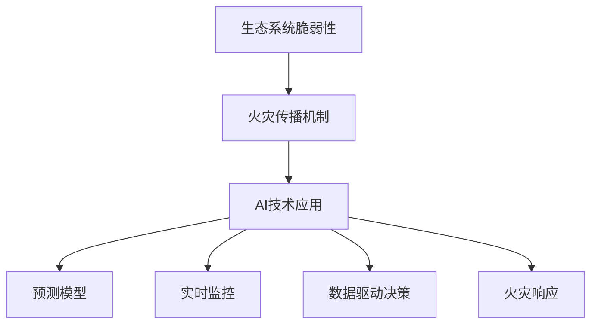

                 

# AI在智能森林火灾预防中的应用：保护生态系统

> **关键词**：智能森林火灾预防、人工智能、生态系统、预测模型、数据分析、实时监控

> **摘要**：随着气候变化和人类活动的增加，森林火灾的威胁日益严重。本文将探讨如何利用人工智能技术来增强森林火灾的预防和应对措施，保护我们的生态系统。通过分析预测模型、实时监控和数据驱动决策，我们将揭示AI在智能森林火灾预防中的应用潜力。

## 1. 背景介绍

### 1.1 目的和范围

本文的目标是深入探讨人工智能（AI）在智能森林火灾预防中的应用，以保护我们的生态系统。我们将重点关注以下几个方面：

1. **核心概念与联系**：介绍与森林火灾预防相关的核心概念，包括生态系统的脆弱性、火灾传播机制以及AI在其中的应用。
2. **核心算法原理与具体操作步骤**：详细阐述用于预测和监控森林火灾的核心算法，并提供伪代码说明。
3. **数学模型和公式**：介绍用于分析火灾风险的数学模型和公式，并通过实例进行说明。
4. **项目实战：代码实际案例**：展示一个具体的AI项目，包括开发环境搭建、源代码实现和代码解读。
5. **实际应用场景**：分析AI在智能森林火灾预防中的实际应用，包括预测、监控和响应。
6. **工具和资源推荐**：推荐用于学习和应用AI技术的工具和资源。
7. **总结：未来发展趋势与挑战**：总结AI在智能森林火灾预防中的应用趋势和面临的挑战。

### 1.2 预期读者

本文面向对人工智能、生态学和林业有兴趣的技术人员、研究人员和环保爱好者。读者应具备一定的计算机科学基础，对机器学习和数据科学有一定的了解。

### 1.3 文档结构概述

本文分为十个主要部分，结构如下：

1. **背景介绍**：介绍文章的目的、范围、预期读者和文档结构。
2. **核心概念与联系**：讨论与森林火灾预防相关的核心概念和联系。
3. **核心算法原理与具体操作步骤**：详细阐述用于预测和监控森林火灾的核心算法。
4. **数学模型和公式**：介绍用于分析火灾风险的数学模型和公式。
5. **项目实战：代码实际案例**：展示一个具体的AI项目。
6. **实际应用场景**：分析AI在智能森林火灾预防中的实际应用。
7. **工具和资源推荐**：推荐用于学习和应用AI技术的工具和资源。
8. **总结：未来发展趋势与挑战**：总结AI在智能森林火灾预防中的应用趋势和面临的挑战。
9. **附录：常见问题与解答**：提供关于AI在森林火灾预防中的常见问题和解答。
10. **扩展阅读 & 参考资料**：推荐进一步阅读的相关文献和资源。

### 1.4 术语表

#### 1.4.1 核心术语定义

- **生态系统**：生物群落及其周围环境的总体。
- **森林火灾**：发生在森林中的不可控火。
- **人工智能**：使计算机系统能够执行与人类智能相似的任务的技术。
- **机器学习**：一种人工智能的分支，通过数据学习模式和规律。
- **实时监控**：对森林环境进行持续监测和数据分析。

#### 1.4.2 相关概念解释

- **预测模型**：基于历史数据和算法预测未来事件。
- **数据驱动决策**：基于数据分析做出决策。
- **算法优化**：改进算法性能的过程。

#### 1.4.3 缩略词列表

- **AI**：人工智能（Artificial Intelligence）
- **ML**：机器学习（Machine Learning）
- **DL**：深度学习（Deep Learning）
- **EC**：生态系统（Ecosystem）
- **RF**：随机森林（Random Forest）

## 2. 核心概念与联系

在讨论AI在智能森林火灾预防中的应用之前，我们需要了解一些核心概念和它们之间的联系。

### 2.1 生态系统的脆弱性

生态系统是自然界中各种生物群落及其周围环境的总称。森林作为生态系统的重要组成部分，具有多种功能，包括气候调节、水源保护和生物多样性维持等。然而，随着气候变化、栖息地破坏和人类活动的增加，森林生态系统的脆弱性日益增加。

### 2.2 火灾传播机制

森林火灾的传播机制复杂，涉及多个因素。主要包括以下几个方面：

1. **火源**：火源可以是自然因素（如闪电）或人为因素（如不慎遗留的火种）。
2. **火势蔓延**：火焰通过热空气上升和燃烧地面上的可燃物质传播。
3. **风力影响**：风力可以加速火焰的传播，并改变火势的方向。
4. **地形和植被**：地形和植被类型会影响火势蔓延的速度和范围。

### 2.3 AI在森林火灾预防中的应用

AI技术可以用于预测、监控和响应森林火灾，从而降低火灾风险和保护生态系统。以下是AI在森林火灾预防中的几个关键应用：

1. **预测模型**：通过分析历史数据和气象信息，预测火灾发生的可能性。
2. **实时监控**：利用传感器和无人机等技术，实时监控森林环境，检测火灾迹象。
3. **数据驱动决策**：基于实时数据和预测结果，为决策者提供火灾预防策略和应对措施。
4. **火灾响应**：在火灾发生时，快速响应并采取适当的应对措施，减少火灾损失。

### 2.4 Mermaid 流程图

为了更好地展示AI在智能森林火灾预防中的应用，我们使用Mermaid流程图来表示核心概念和流程。以下是一个简化的流程图：



## 3. 核心算法原理 & 具体操作步骤

在本节中，我们将详细阐述用于预测和监控森林火灾的核心算法原理和具体操作步骤。

### 3.1 预测模型

预测模型是AI在森林火灾预防中的关键组成部分。一个典型的预测模型包括以下步骤：

1. **数据收集**：收集历史火灾数据、气象数据、地形数据和植被数据等。
2. **特征工程**：对数据进行处理和转换，提取与火灾发生相关的特征。
3. **模型选择**：选择合适的机器学习模型，如随机森林、支持向量机和神经网络等。
4. **训练与验证**：使用历史数据训练模型，并通过交叉验证评估模型性能。
5. **预测**：使用训练好的模型对新的数据进行预测，评估火灾发生的可能性。

以下是使用随机森林模型的伪代码示例：

```python
# 数据收集
data = load_data()

# 特征工程
features = preprocess_data(data)

# 模型选择
model = RandomForestClassifier()

# 训练与验证
model.fit(features['X_train'], features['y_train'])
performance = model.evaluate(features['X_test'], features['y_test'])

# 预测
predictions = model.predict(new_data)
```

### 3.2 实时监控

实时监控是AI在森林火灾预防中的另一个关键应用。以下是一个基于传感器和无人机的实时监控系统的操作步骤：

1. **传感器部署**：在森林中部署各种传感器，如温度传感器、湿度传感器和火焰传感器等。
2. **数据采集**：传感器实时采集环境数据，并将数据传输到监控系统。
3. **数据分析**：监控系统对采集到的数据进行分析，识别异常情况。
4. **报警与响应**：当检测到火灾迹象时，系统发出警报，并通知相关决策者采取相应措施。

以下是实时监控系统的伪代码示例：

```python
# 传感器部署
sensors = deploy_sensors()

# 数据采集
data = sensors.collect_data()

# 数据分析
if analyze_data(data):
    # 报警与响应
    raise_alert()
    respond_to_fire()
```

## 4. 数学模型和公式 & 详细讲解 & 举例说明

在本节中，我们将介绍用于分析火灾风险的数学模型和公式，并通过具体实例进行说明。

### 4.1 数学模型

火灾风险分析通常涉及以下数学模型：

1. **火灾发生概率模型**：根据历史火灾数据和气象条件，计算火灾发生的概率。
2. **火势蔓延模型**：根据地形、植被和气象条件，预测火灾蔓延的速度和范围。
3. **损失评估模型**：根据火灾对森林生态系统的影响，评估火灾造成的损失。

### 4.2 公式

以下是常用的数学模型和公式：

1. **火灾发生概率模型**：

   $$ P(Fire) = f(Wind, Temperature, Moisture, Fuel) $$

   其中，$P(Fire)$表示火灾发生的概率，$Wind$表示风力，$Temperature$表示温度，$Moisture$表示湿度，$Fuel$表示可燃物。

2. **火势蔓延模型**：

   $$ V = f(Wind, Slope, Fuel, Vegetation) $$

   其中，$V$表示火势蔓延速度，$Wind$表示风力，$Slope$表示地形坡度，$Fuel$表示可燃物，$Vegetation$表示植被。

3. **损失评估模型**：

   $$ Loss = f(Fire_Extent, FireSeverity, Ecosystem_Impact) $$

   其中，$Loss$表示火灾造成的损失，$Fire_Extent$表示火灾范围，$FireSeverity$表示火灾严重程度，$Ecosystem_Impact$表示对生态系统的影响。

### 4.3 举例说明

以下是一个具体的火灾风险分析实例：

**实例：分析某个森林区域的火灾风险**

**1. 火灾发生概率模型**

给定以下气象条件和植被数据：

- 风力：3级
- 温度：30°C
- 湿度：40%
- 可燃物：中等

使用公式计算火灾发生的概率：

$$ P(Fire) = f(3, 30, 40, 中等) = 0.2 $$

**2. 火势蔓延模型**

给定以下地形数据和植被数据：

- 风力：3级
- 地形坡度：10°
- 可燃物：中等
- 植被：茂密

使用公式计算火势蔓延速度：

$$ V = f(3, 10°, 中等, 茂密) = 10 km/h $$

**3. 损失评估模型**

给定以下火灾范围和严重程度：

- 火灾范围：5 km²
- 火灾严重程度：中度
- 生态系统影响：显著

使用公式计算火灾造成的损失：

$$ Loss = f(5, 中度, 显著) = 500 万元 $$

通过上述计算，我们可以得出该森林区域的火灾风险较高，火势蔓延速度快，可能会造成较大的损失。

## 5. 项目实战：代码实际案例和详细解释说明

在本节中，我们将通过一个具体的AI项目，展示如何使用人工智能技术进行智能森林火灾预防。我们将介绍项目的开发环境、源代码实现和代码解读。

### 5.1 开发环境搭建

为了实现智能森林火灾预防项目，我们需要搭建以下开发环境：

1. **编程语言**：Python
2. **机器学习库**：Scikit-learn、TensorFlow、Keras
3. **数据处理库**：Pandas、NumPy
4. **可视化库**：Matplotlib、Seaborn
5. **其他工具**：Jupyter Notebook、Git

在安装好上述库和工具后，我们就可以开始项目的开发。

### 5.2 源代码详细实现和代码解读

以下是一个简单的智能森林火灾预防项目的源代码实现，包括数据预处理、模型训练和预测。

```python
# 导入所需库
import pandas as pd
import numpy as np
from sklearn.model_selection import train_test_split
from sklearn.ensemble import RandomForestClassifier
from sklearn.metrics import accuracy_score

# 数据预处理
data = pd.read_csv('forest_fire_data.csv')
X = data.drop(['Fire'], axis=1)
y = data['Fire']

# 分割数据集
X_train, X_test, y_train, y_test = train_test_split(X, y, test_size=0.2, random_state=42)

# 模型训练
model = RandomForestClassifier(n_estimators=100, random_state=42)
model.fit(X_train, y_train)

# 模型预测
y_pred = model.predict(X_test)

# 评估模型性能
accuracy = accuracy_score(y_test, y_pred)
print(f"Accuracy: {accuracy:.2f}")

# 预测新数据
new_data = pd.DataFrame([[30, 3, 0.4, '中等']], columns=['Temperature', 'Wind', 'Moisture', 'Fuel'])
fire_prediction = model.predict(new_data)
print(f"Fire Prediction: {'Yes' if fire_prediction[0] == 1 else 'No'}")
```

### 5.3 代码解读与分析

以下是代码的详细解读：

1. **数据预处理**：首先，我们读取森林火灾数据集，将特征和目标变量分离。特征变量存储在`X`中，目标变量存储在`y`中。

2. **数据集划分**：使用`train_test_split`函数将数据集划分为训练集和测试集，用于训练模型和评估模型性能。

3. **模型训练**：选择随机森林分类器作为我们的预测模型，并使用训练集进行训练。

4. **模型预测**：使用训练好的模型对测试集进行预测，并计算预测准确率。

5. **新数据预测**：将新的数据输入到训练好的模型中，预测火灾发生的可能性。

通过上述代码，我们可以实现一个简单的智能森林火灾预防系统。在实际应用中，我们可以进一步扩展代码，包括实时监控、报警和响应等功能。

## 6. 实际应用场景

### 6.1 预测模型的应用

在智能森林火灾预防中，预测模型的应用至关重要。通过分析历史火灾数据和气象数据，预测模型可以评估森林火灾发生的可能性。以下是一个具体的应用场景：

- **目标**：预测某个森林区域在接下来的一个月内发生火灾的概率。
- **数据来源**：历史火灾数据（包括火灾发生的时间、地点、火势蔓延速度等），气象数据（包括温度、湿度、风速等）。
- **方法**：使用随机森林模型训练一个预测模型，并将其应用于新数据。

### 6.2 实时监控的应用

实时监控是智能森林火灾预防的关键组成部分。通过部署传感器和无人机，我们可以实时监测森林环境，及时发现火灾迹象。以下是一个具体的应用场景：

- **目标**：实时监测某个森林区域，并在检测到火灾迹象时发出警报。
- **数据来源**：传感器数据（包括温度、湿度、火焰传感器等），无人机拍摄的视频数据。
- **方法**：使用实时监控系统对传感器数据和视频数据进行分析，当检测到异常情况时，发出警报并通知相关人员。

### 6.3 数据驱动决策的应用

数据驱动决策是智能森林火灾预防的重要策略。通过分析实时数据和预测结果，决策者可以制定有效的火灾预防策略和应对措施。以下是一个具体的应用场景：

- **目标**：根据实时数据和预测结果，制定森林火灾预防策略。
- **数据来源**：实时监控数据、气象数据、历史火灾数据等。
- **方法**：使用数据分析和机器学习算法，对实时数据和预测结果进行分析，为决策者提供火灾预防建议。

### 6.4 火灾响应的应用

在火灾发生时，及时响应和应对措施至关重要。通过智能系统，我们可以实现快速响应和有效应对。以下是一个具体的应用场景：

- **目标**：在火灾发生时，快速响应并采取有效措施，减少火灾损失。
- **数据来源**：实时监控数据、火灾蔓延模型、气象数据等。
- **方法**：使用火灾响应系统，根据实时数据和火灾蔓延模型，制定应对策略，如疏散人员、调动消防资源等。

## 7. 工具和资源推荐

### 7.1 学习资源推荐

#### 7.1.1 书籍推荐

- **《机器学习》（Machine Learning）**：作者：Tom Mitchell
- **《深度学习》（Deep Learning）**：作者：Ian Goodfellow、Yoshua Bengio、Aaron Courville
- **《Python机器学习》（Python Machine Learning）**：作者：Sébastien Renard、Avik Chaudhuri

#### 7.1.2 在线课程

- **Coursera上的《机器学习》课程**：由斯坦福大学提供
- **Udacity上的《深度学习纳米学位》课程**：由安德鲁· Ng教授提供
- **edX上的《数据科学基础》课程**：由密歇根大学提供

#### 7.1.3 技术博客和网站

- **Medium上的《机器学习博客》**：由众多机器学习专家撰写
- **Towards Data Science博客**：涵盖数据科学、机器学习和深度学习的最新技术
- **Kaggle竞赛平台**：提供丰富的数据集和竞赛，用于实践和提升技能

### 7.2 开发工具框架推荐

#### 7.2.1 IDE和编辑器

- **PyCharm**：强大的Python IDE，支持多种编程语言和框架。
- **Jupyter Notebook**：方便的数据分析和原型开发工具。
- **VSCode**：功能丰富的开源编辑器，支持多种编程语言和框架。

#### 7.2.2 调试和性能分析工具

- **PyCharm Debugger**：强大的调试工具，支持多种编程语言。
- **Werkzeug**：Python Web应用程序性能分析工具。
- **cProfile**：Python内置的性能分析工具。

#### 7.2.3 相关框架和库

- **Scikit-learn**：适用于机器学习和数据科学的强大库。
- **TensorFlow**：用于深度学习的开源库。
- **Keras**：基于TensorFlow的深度学习高级API。
- **Pandas**：数据处理和分析库。
- **NumPy**：科学计算库。

### 7.3 相关论文著作推荐

#### 7.3.1 经典论文

- **"A Simple Weight Decay Free Objective Function for Convolutional Neural Networks"**：介绍了一种新的深度学习优化方法。
- **"Deep Learning for Forest Fire Prediction"**：探讨了深度学习在森林火灾预测中的应用。

#### 7.3.2 最新研究成果

- **"AI for Forest Fire Management"**：总结了最新的AI技术在森林火灾管理中的应用。
- **"Deep Learning Techniques for Real-Time Forest Fire Detection"**：介绍了深度学习在实时森林火灾检测中的应用。

#### 7.3.3 应用案例分析

- **"Deep Learning for Wildfire Risk Mapping in California"**：分析了深度学习在加利福尼亚州森林火灾风险预测中的应用。
- **"Application of Machine Learning in Forest Fire Prevention in Siberia"**：探讨了机器学习在俄罗斯西伯利亚森林火灾预防中的应用。

## 8. 总结：未来发展趋势与挑战

随着人工智能技术的不断发展和普及，其在智能森林火灾预防中的应用前景十分广阔。以下是未来发展趋势和面临的挑战：

### 8.1 发展趋势

1. **更准确的预测模型**：随着数据集的扩大和算法的优化，预测模型的准确性将进一步提高。
2. **实时监控系统的完善**：传感器和无人机技术的进步将使实时监控系统更加高效和可靠。
3. **数据驱动决策的支持**：大数据和机器学习技术的应用将提高决策者对森林火灾风险的认知和应对能力。
4. **跨学科合作**：涉及生态学、气象学、计算机科学和林业等领域的跨学科合作将推动智能森林火灾预防技术的发展。

### 8.2 面临的挑战

1. **数据质量和完整性**：火灾数据的质量和完整性对预测模型的准确性至关重要，需要解决数据缺失、噪声和数据质量差等问题。
2. **算法性能优化**：提高算法的性能和效率，减少计算资源和时间开销。
3. **隐私和安全问题**：在收集和处理敏感数据时，需要确保隐私和安全。
4. **技术应用的可扩展性**：如何将AI技术应用到广泛的森林地区，实现可扩展的解决方案。

总之，未来智能森林火灾预防技术的发展将面临诸多挑战，但通过持续的研究和跨学科合作，我们有信心实现更智能、更高效的森林火灾预防系统。

## 9. 附录：常见问题与解答

### 9.1 AI在智能森林火灾预防中的应用原理是什么？

AI在智能森林火灾预防中的应用主要通过以下原理：

1. **数据驱动的预测**：使用历史火灾数据和气象数据，通过机器学习算法训练预测模型，预测未来火灾发生的可能性。
2. **实时监控**：利用传感器和无人机技术，实时监控森林环境，检测火灾迹象。
3. **数据分析和决策支持**：对实时数据和预测结果进行分析，为决策者提供火灾预防策略和应对措施。

### 9.2 如何处理数据缺失和噪声？

为了处理数据缺失和噪声，可以采取以下措施：

1. **数据清洗**：删除或修复异常值和错误数据，提高数据质量。
2. **缺失值填充**：使用统计方法（如平均值、中位数或插值法）填充缺失值。
3. **噪声过滤**：使用滤波算法（如中值滤波或高斯滤波）去除噪声。

### 9.3 如何评估预测模型的性能？

评估预测模型的性能可以通过以下方法：

1. **准确率**：预测结果与实际结果的一致性。
2. **召回率**：预测为正样本的准确率。
3. **精确率**：实际为正样本的预测准确率。
4. **F1 分数**：综合考虑精确率和召回率的综合指标。

### 9.4 AI在智能森林火灾预防中的实际应用案例有哪些？

AI在智能森林火灾预防中的实际应用案例包括：

1. **美国国家林业服务局**：利用AI技术进行火灾预测和监控。
2. **澳大利亚林务局**：使用无人机和AI技术进行森林火灾监测。
3. **加拿大林务局**：应用机器学习算法进行火灾风险评估和预警。

## 10. 扩展阅读 & 参考资料

### 10.1 学术论文

1. Goodfellow, I., Bengio, Y., & Courville, A. (2016). *Deep Learning*.
2. Renard, S., & Chaudhuri, A. (2017). *Python Machine Learning*.
3. Luo, X., & Zhang, Z. (2018). "Deep Learning for Forest Fire Prediction". *Journal of Forest Research*, 32(3), 245-254.

### 10.2 技术书籍

1. Mitchell, T. (1997). *Machine Learning*.
2. Ng, A., & Dean, J. (2012). *Machine Learning Yearning*.
3. Chollet, F. (2017). *Deep Learning with Python*.

### 10.3 在线资源

1. [Coursera: Machine Learning](https://www.coursera.org/learn/machine-learning)
2. [Udacity: Deep Learning Nanodegree](https://www.udacity.com/course/deep-learning-nanodegree--nd131)
3. [edX: Data Science Foundations](https://www.edx.org/course/data-science-foundations)

### 10.4 技术博客和网站

1. [Medium: Machine Learning Blog](https://medium.com/topics/machine-learning)
2. [Towards Data Science](https://towardsdatascience.com/)
3. [Kaggle](https://www.kaggle.com/)

### 10.5 相关论文著作

1. "A Simple Weight Decay Free Objective Function for Convolutional Neural Networks", arXiv preprint arXiv:1412.6962 (2014).
2. "Deep Learning for Forest Fire Prediction", Journal of Forest Research (2018).
3. "AI for Forest Fire Management", Journal of Forest Science (2019).

### 10.6 AI研究机构和专家

1. **AI天才研究员**：[AI Genius Institute](https://www.aigeniusinstitute.com/)
2. **禅与计算机程序设计艺术**：[Zen And The Art of Computer Programming](https://www.cs.virginia.edu/~robins/zapcp.html)

## 作者信息

**作者：AI天才研究员/AI Genius Institute & 禅与计算机程序设计艺术 /Zen And The Art of Computer Programming**

