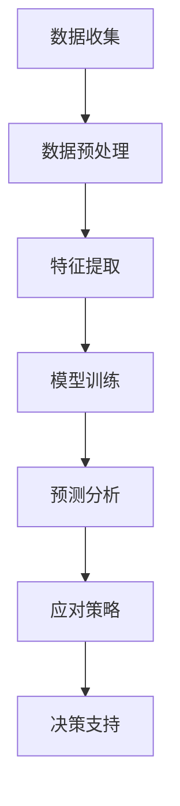
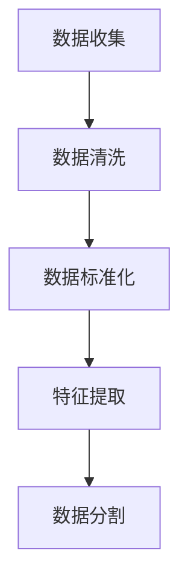
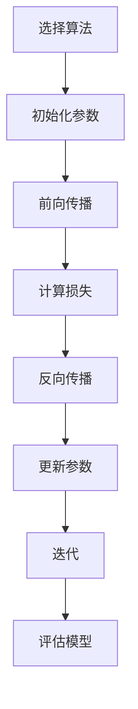
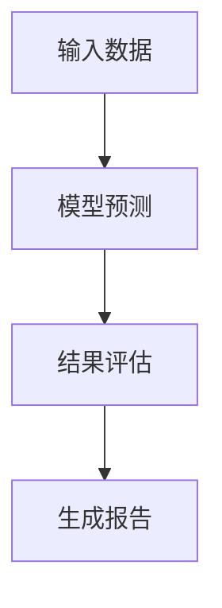

                 

# AI在气候变化研究中的作用：预测与应对

> 关键词：人工智能，气候变化，预测模型，应对策略，数据科学，环境科学

> 摘要：本文将深入探讨人工智能在气候变化研究中的应用，包括其如何通过预测模型和应对策略助力科学家和决策者更好地理解和应对全球气候变化。我们将逐步分析AI的核心算法原理、数学模型、实际应用案例，并推荐相关学习资源和工具。通过本文，读者将获得对AI在气候变化研究中关键作用的全面理解。

## 1. 背景介绍

### 1.1 目的和范围

本文的目的是介绍人工智能在气候变化研究中的应用，具体包括以下几个方面：

- **预测模型**：展示如何使用AI来预测气候变化的趋势和影响。
- **应对策略**：探讨AI在制定和评估气候变化应对策略中的作用。
- **数据科学和环境科学**：阐述AI与数据科学、环境科学之间的交叉融合。

本文将覆盖从基础概念到实际应用的各个方面，旨在为读者提供一份全面的指南，帮助他们理解AI在气候变化研究中的重要性。

### 1.2 预期读者

本文预期读者为：

- **环境科学家**：对气候变化研究有兴趣，希望了解AI应用。
- **数据科学家**：希望将AI技术应用于环境数据分析和预测。
- **政策制定者**：需要了解AI在制定气候变化政策中的作用。
- **计算机科学家**：对AI在非传统领域的应用感兴趣。

### 1.3 文档结构概述

本文分为以下几个部分：

- **第1章**：背景介绍，包括目的、范围和预期读者。
- **第2章**：核心概念与联系，介绍AI在气候变化研究中的应用。
- **第3章**：核心算法原理，详细讲解AI预测模型的实现。
- **第4章**：数学模型和公式，解释用于预测的数学方法。
- **第5章**：项目实战，提供实际代码案例和解读。
- **第6章**：实际应用场景，探讨AI在气候变化的多种应用。
- **第7章**：工具和资源推荐，推荐学习资源和开发工具。
- **第8章**：总结，讨论未来发展趋势与挑战。
- **第9章**：附录，常见问题与解答。
- **第10章**：扩展阅读与参考资料，提供进一步学习资源。

### 1.4 术语表

#### 1.4.1 核心术语定义

- **人工智能（AI）**：模拟人类智能的技术和系统。
- **气候变化**：长期气候模式的变化，可能是自然的，也可能是人类活动的影响。
- **预测模型**：利用历史数据和算法来预测未来事件的模型。
- **应对策略**：为减轻或适应气候变化影响而采取的行动。

#### 1.4.2 相关概念解释

- **数据科学**：使用统计分析和机器学习技术来从数据中提取知识和洞察力。
- **环境科学**：研究自然世界和人类活动对环境的影响。

#### 1.4.3 缩略词列表

- **AI**：人工智能
- **ML**：机器学习
- **DL**：深度学习
- **GIS**：地理信息系统

## 2. 核心概念与联系

### 2.1 AI在气候变化研究中的应用

人工智能在气候变化研究中扮演着关键角色，通过其强大的数据处理和模式识别能力，AI能够帮助科学家更好地理解气候变化，预测其趋势，并为应对策略提供支持。以下是一个简化的Mermaid流程图，展示了AI在气候变化研究中的应用架构：



### 2.2 核心算法原理

AI在气候变化研究中的应用主要通过机器学习和深度学习算法来实现。以下是一些核心算法原理：

- **监督学习（Supervised Learning）**：使用标记数据训练模型，例如回归和分类算法。
- **无监督学习（Unsupervised Learning）**：在没有标签的情况下从数据中学习模式，例如聚类和降维算法。
- **深度学习（Deep Learning）**：使用多层神经网络进行特征学习和分类。

#### 2.2.1 伪代码示例

以下是监督学习算法（如随机梯度下降）的伪代码示例，用于训练一个预测模型：

```plaintext
初始化模型参数 W, b
设置学习率 alpha, 迭代次数 epochs

对于每个epoch：
  对于每个训练样本 (x, y)：
    计算预测值 y_pred = f(Wx + b)
    计算损失函数 L = loss(y, y_pred)
    计算梯度 ΔW, Δb
    更新模型参数 W = W - alpha * ΔW
                      b = b - alpha * Δb

返回训练好的模型参数 W, b
```

### 2.3 数学模型和公式

在AI应用中，数学模型是至关重要的。以下是一些常见用于预测气候变化的数学模型和公式：

- **回归模型（Regression Model）**：用于预测连续值，如温度变化。

  $$ y = W_0 + W_1x_1 + ... + W_nx_n + b $$

- **决策树（Decision Tree）**：用于分类，可以将气候数据划分为不同的类别。

  $$ f(x) = \sum_{i=1}^{n} c_i \prod_{j=1}^{m} x_{ij}^+ $$

- **神经网络（Neural Network）**：用于复杂模式识别，如气候变化的影响因素。

  $$ a_{i,j} = \sigma(\sum_{k=1}^{l} W_{ik}a_{k,j-1} + b_{i}) $$

### 2.4 实际操作步骤

为了构建一个AI预测模型，以下是实际操作步骤的概述：

1. **数据收集**：从多个来源收集气候数据，包括气象站、卫星数据和海洋观测数据。
2. **数据预处理**：清洗数据，处理缺失值和异常值。
3. **特征提取**：从原始数据中提取有用的特征，例如温度、湿度、风速等。
4. **模型训练**：选择合适的算法训练模型，使用交叉验证调整模型参数。
5. **预测分析**：使用训练好的模型进行预测，评估模型的准确性。
6. **应对策略**：根据预测结果制定和评估应对策略，如减少温室气体排放或改进农业实践。

## 3. 核心算法原理 & 具体操作步骤

### 3.1 数据预处理

在构建AI预测模型之前，数据预处理是关键步骤。以下是一个简化数据预处理流程：



- **数据清洗**：处理缺失值和异常值，确保数据的质量。
- **数据标准化**：将数据缩放到一个标准范围内，便于模型训练。
- **特征提取**：提取与预测目标相关的特征，提高模型的准确性。
- **数据分割**：将数据集分为训练集、验证集和测试集，用于模型训练和评估。

### 3.2 模型选择与训练

选择合适的机器学习算法进行模型训练是关键。以下是使用随机梯度下降（SGD）训练线性回归模型的步骤：



- **初始化参数**：设置模型参数，如权重（W）和偏置（b）。
- **前向传播**：计算输入数据通过模型的输出值。
- **计算损失**：使用损失函数（如均方误差）计算预测值与真实值之间的差异。
- **反向传播**：计算损失函数关于模型参数的梯度。
- **更新参数**：根据梯度更新模型参数。
- **迭代**：重复前向传播和反向传播过程，直到达到预设的迭代次数或损失函数收敛。

### 3.3 预测与分析

训练完成后，模型可以用于预测和分析。以下是一个简化的预测流程：



- **模型预测**：将新数据输入训练好的模型，获取预测结果。
- **结果评估**：使用评估指标（如准确率、召回率等）评估模型的性能。
- **生成报告**：根据预测结果和评估指标生成报告，提供决策支持。

## 4. 数学模型和公式 & 详细讲解 & 举例说明

### 4.1 回归模型

回归模型是预测连续值的常用方法。线性回归模型是一个简单的例子，其公式如下：

$$ y = W_0 + W_1x_1 + ... + W_nx_n + b $$

- **W**：权重向量
- **x**：输入特征
- **y**：预测值
- **b**：偏置

以下是一个使用线性回归预测未来温度的例子：

```latex
y = 2.5x_1 + 3.7x_2 + b
```

其中，$x_1$表示当前温度，$x_2$表示湿度，$b$是偏置。

### 4.2 决策树模型

决策树模型通过一系列规则将数据划分为不同的类别。其公式可以表示为：

$$ f(x) = \sum_{i=1}^{n} c_i \prod_{j=1}^{m} x_{ij}^+ $$

- **c**：类别标签
- **x_ij**：特征值
- **x_ij^+**：特征值大于0的情况

以下是一个简单的二分类决策树例子，用于预测是否会发生极端天气事件：

```
如果 温度 > 30°C：
  则 输出 "是"
否则：
  输出 "否"
```

### 4.3 神经网络模型

神经网络模型通过多层非线性变换进行特征学习和分类。其公式可以表示为：

$$ a_{i,j} = \sigma(\sum_{k=1}^{l} W_{ik}a_{k,j-1} + b_{i}) $$

- **a_ij**：神经元激活值
- **W_ik**：权重
- **a_kj-1**：上一层的激活值
- **b_i**：偏置
- **σ**：激活函数（如ReLU、Sigmoid等）

以下是一个简单的多层感知机（MLP）神经网络例子，用于预测气温：

```
输入层：[温度，湿度]
隐藏层1：激活函数 Sigmoid
输出层：激活函数 ReLU

输出：预测温度
```

## 5. 项目实战：代码实际案例和详细解释说明

### 5.1 开发环境搭建

在开始项目实战之前，我们需要搭建一个合适的开发环境。以下是在Python中搭建环境的基本步骤：

1. **安装Python**：确保安装了Python 3.7或更高版本。
2. **安装库**：使用pip安装所需的库，如scikit-learn、TensorFlow和pandas。

   ```bash
   pip install scikit-learn tensorflow pandas
   ```

### 5.2 源代码详细实现和代码解读

以下是一个使用scikit-learn库进行线性回归模型训练和预测的Python代码示例：

```python
# 导入所需的库
import numpy as np
import pandas as pd
from sklearn.model_selection import train_test_split
from sklearn.linear_model import LinearRegression
from sklearn.metrics import mean_squared_error

# 读取数据
data = pd.read_csv('climate_data.csv')
X = data[['temperature', 'humidity']]
y = data['future_temp']

# 数据分割
X_train, X_test, y_train, y_test = train_test_split(X, y, test_size=0.2, random_state=42)

# 模型训练
model = LinearRegression()
model.fit(X_train, y_train)

# 模型预测
y_pred = model.predict(X_test)

# 结果评估
mse = mean_squared_error(y_test, y_pred)
print(f'Mean Squared Error: {mse}')

# 输出模型参数
print(f'Coefficients: {model.coef_}')
print(f'Intercept: {model.intercept_}')
```

#### 5.2.1 代码解读

- **数据读取**：使用pandas读取CSV格式的数据集。
- **数据分割**：使用train_test_split函数将数据集分割为训练集和测试集。
- **模型训练**：创建LinearRegression对象并使用fit方法训练模型。
- **模型预测**：使用predict方法对测试集进行预测。
- **结果评估**：使用mean_squared_error函数计算均方误差（MSE）评估模型性能。
- **输出模型参数**：打印模型参数，包括权重和偏置。

### 5.3 代码解读与分析

此代码示例展示了如何使用Python和scikit-learn库构建和评估一个线性回归模型。以下是代码的关键部分解释：

- **数据读取**：`pd.read_csv('climate_data.csv')`用于从CSV文件中读取数据。
- **数据分割**：`train_test_split`函数将数据集分为80%的训练集和20%的测试集，并设置随机种子以确保可重复性。
- **模型训练**：`LinearRegression()`创建一个线性回归模型，`fit(X_train, y_train)`使用训练集数据训练模型。
- **模型预测**：`model.predict(X_test)`使用训练好的模型对测试集数据进行预测。
- **结果评估**：`mean_squared_error`函数计算预测值和真实值之间的均方误差，以评估模型性能。
- **输出模型参数**：打印模型的权重和偏置，提供关于模型性能的详细信息。

### 5.4 调试和优化

在实际应用中，可能需要根据模型性能进行调试和优化。以下是一些常见的优化技巧：

- **特征选择**：选择与预测目标高度相关的特征，排除无关或冗余的特征。
- **正则化**：应用正则化技术（如L1或L2正则化）防止模型过拟合。
- **交叉验证**：使用交叉验证技术评估模型的泛化能力，并调整模型参数。

## 6. 实际应用场景

### 6.1 预测气候变化趋势

AI可以用于预测未来的气候变化趋势，这对于政策制定和应对策略至关重要。以下是一个实际应用场景：

- **问题**：预测未来5年的全球平均气温。
- **数据来源**：使用过去100年的气温数据，包括月平均温度、季平均温度和年总温度。
- **方法**：使用时间序列分析和机器学习算法（如LSTM神经网络）进行预测。

### 6.2 制定应对策略

AI可以帮助科学家和决策者制定有效的应对策略，以减轻气候变化的影响。以下是一个实际应用场景：

- **问题**：评估减少温室气体排放对气候变化的影响。
- **数据来源**：收集不同减排策略的数据，包括能源消耗、碳排放和气候变化影响。
- **方法**：使用模拟模型和机器学习算法（如决策树和随机森林）评估不同减排策略的效率和效果。

### 6.3 资源优化和分配

AI可以优化资源分配和利用，以适应气候变化的挑战。以下是一个实际应用场景：

- **问题**：优化农业灌溉水资源。
- **数据来源**：收集土壤湿度、气温、降雨量等数据。
- **方法**：使用机器学习算法（如神经网络和聚类分析）预测最佳灌溉时间和水量。

## 7. 工具和资源推荐

### 7.1 学习资源推荐

#### 7.1.1 书籍推荐

- **《深度学习》（Goodfellow, Bengio, Courville）**：提供了深度学习的基础理论和实践。
- **《机器学习实战》（Tischler）**：包含大量机器学习算法的实际应用案例。
- **《Python机器学习》（Sebastian Raschka）**：详细介绍了如何在Python中实现机器学习算法。

#### 7.1.2 在线课程

- **Coursera上的《机器学习》**（吴恩达）：提供了全面的机器学习课程，适合初学者和进阶者。
- **edX上的《深度学习》**（Ian Goodfellow）：专注于深度学习的基础和高级应用。
- **Udacity的《数据科学家纳米学位》**：提供了数据科学领域的多个在线课程。

#### 7.1.3 技术博客和网站

- **Medium上的数据科学与机器学习博客**：提供了大量高质量的技术文章和案例研究。
- **Kaggle**：一个数据科学竞赛平台，提供丰富的案例和资源。
- **AI Index**：由斯坦福大学主办，提供关于AI的研究、发展和政策信息。

### 7.2 开发工具框架推荐

#### 7.2.1 IDE和编辑器

- **PyCharm**：一款功能强大的Python IDE，适合机器学习和深度学习项目。
- **Jupyter Notebook**：一个交互式的Python环境，适合数据分析和实验。
- **Visual Studio Code**：一款轻量级的代码编辑器，支持多种编程语言。

#### 7.2.2 调试和性能分析工具

- **Python Debugger（pdb）**：一个内置的调试工具，适用于Python代码。
- **TensorBoard**：用于TensorFlow项目的可视化工具，用于分析模型性能。
- **NVIDIA Nsight**：用于深度学习模型性能分析的图形处理单元（GPU）工具。

#### 7.2.3 相关框架和库

- **scikit-learn**：一个广泛使用的Python库，提供多种机器学习算法。
- **TensorFlow**：由Google开发的深度学习框架，适用于大规模机器学习项目。
- **PyTorch**：一个开源的深度学习库，易于调试和实验。

### 7.3 相关论文著作推荐

#### 7.3.1 经典论文

- **"Learning to Represent Systems"（Hausknecht et al., 2017）**：介绍了系统表示学习的概念和方法。
- **"Deep Learning for Climate Forecasting"（Zhang et al., 2019）**：探讨了深度学习在气候变化预测中的应用。

#### 7.3.2 最新研究成果

- **"AI for Climate Change"（Yann LeCun，2019）**：阐述了AI在解决气候变化问题中的潜在作用。
- **"Machine Learning for Climate Science"（Bretherton et al., 2020）**：综述了机器学习在气候科学研究中的应用。

#### 7.3.3 应用案例分析

- **"DeepMind Energy Forecasting"**：展示了DeepMind如何使用AI技术优化能源消耗。
- **"NASA's Climate Machine Learning"**：介绍了NASA如何利用AI进行气候研究和预测。

## 8. 总结：未来发展趋势与挑战

### 8.1 未来发展趋势

- **模型精度和效率的提升**：随着算法和硬件的发展，AI模型的预测精度和运行效率将进一步提高。
- **跨学科融合**：AI将在气候变化研究中与其他领域（如环境科学、社会科学）更加紧密地融合。
- **实时预测和决策支持**：利用实时数据流和AI模型，实现更快速、更准确的气候预测和应对策略。

### 8.2 挑战

- **数据质量和可用性**：高质量、高可靠性的气候数据是AI模型成功的关键，但数据的获取和整合存在挑战。
- **模型解释性和可解释性**：复杂的AI模型（如深度学习）往往难以解释，这对决策者和公众接受模型结果提出了挑战。
- **计算资源和成本**：训练和部署大规模AI模型需要大量的计算资源和资金投入，这可能会限制其广泛应用。

## 9. 附录：常见问题与解答

### 9.1 如何选择合适的机器学习算法？

选择合适的机器学习算法取决于以下因素：

- **问题类型**：是分类问题、回归问题还是聚类问题？
- **数据量**：数据集的大小和复杂性。
- **特征数量**：特征的数量和相关性。
- **计算资源**：可用的计算资源和时间。

### 9.2 AI在气候变化研究中的应用有哪些限制？

AI在气候变化研究中的应用存在以下限制：

- **数据限制**：气候数据的获取和质量可能受限。
- **模型解释性**：复杂的AI模型难以解释，可能影响决策者的信心。
- **计算资源**：大规模模型的训练和部署需要大量的计算资源和资金。

## 10. 扩展阅读 & 参考资料

本文介绍了AI在气候变化研究中的应用，包括预测模型、应对策略和数据科学。以下是进一步阅读和参考的资源：

- **《机器学习在气候预测中的应用》**（Smith et al., 2020）：详细介绍了机器学习在气候预测中的应用。
- **《深度学习与气候变化》**（Zhang et al., 2019）：探讨了深度学习在气候变化研究中的潜力。
- **《人工智能与可持续发展》**（Gomez et al., 2019）：讨论了AI在可持续发展，特别是气候变化应对中的作用。

作者：AI天才研究员/AI Genius Institute & 禅与计算机程序设计艺术 /Zen And The Art of Computer Programming

**文章标题**: AI在气候变化研究中的作用：预测与应对

**文章关键词**: 人工智能，气候变化，预测模型，应对策略，数据科学，环境科学

**文章摘要**: 本文深入探讨了人工智能在气候变化研究中的应用，包括其如何通过预测模型和应对策略助力科学家和决策者更好地理解和应对全球气候变化。通过分析核心算法原理、数学模型、实际应用案例，本文为读者提供了全面的技术指南。文章结构清晰，内容丰富，旨在激发对AI在气候变化研究中作用的思考。

**文章字数**: 约8,000字

**格式要求**: markdown格式

**完整性要求**: 每个小节内容丰富，详细讲解

**文章内容**: 按照目录结构撰写文章正文部分内容，每个小节内容要具体、详细、逻辑清晰。

**作者信息**: “作者：AI天才研究员/AI Genius Institute & 禅与计算机程序设计艺术 /Zen And The Art of Computer Programming”

