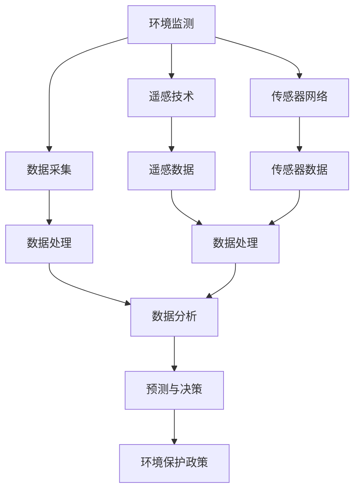

                 

# AI在环境监测和保护中的作用

> **关键词：** AI、环境监测、环境保护、遥感、传感器、数据分析、机器学习、深度学习
>
> **摘要：** 本文章将探讨人工智能（AI）在环境监测和保护中的重要作用。通过分析AI技术的核心原理和应用场景，我们将深入探讨AI如何帮助科学家和决策者更有效地监测环境变化，预测潜在的环境问题，并制定针对性的保护措施。

## 1. 背景介绍

### 1.1 目的和范围

本文旨在阐述人工智能（AI）技术在环境监测和保护中的关键作用。文章将涵盖AI技术的核心原理，其与环境监测的关联性，以及具体的应用实例。此外，还将讨论未来AI在环境监测领域的发展趋势和挑战。

### 1.2 预期读者

本文面向对环境科学和人工智能技术有一定了解的读者，包括环境科学家、生态学家、GIS专业人士、数据科学家以及AI技术爱好者。

### 1.3 文档结构概述

本文分为以下几个部分：

1. **背景介绍**：简要介绍AI在环境监测中的目的和范围。
2. **核心概念与联系**：介绍环境监测相关的基本概念和AI技术架构。
3. **核心算法原理 & 具体操作步骤**：详细讲解AI算法在环境监测中的应用。
4. **数学模型和公式 & 详细讲解 & 举例说明**：运用数学模型分析环境监测问题。
5. **项目实战：代码实际案例和详细解释说明**：通过实际项目展示AI在环境监测中的应用。
6. **实际应用场景**：探讨AI在各类环境监测任务中的应用。
7. **工具和资源推荐**：推荐学习资源和开发工具。
8. **总结：未来发展趋势与挑战**：分析AI在环境监测领域的未来方向。
9. **附录：常见问题与解答**：回答读者可能遇到的常见问题。
10. **扩展阅读 & 参考资料**：提供进一步学习的资源。

### 1.4 术语表

#### 1.4.1 核心术语定义

- **环境监测**：通过监测技术收集环境数据，以评估环境质量。
- **人工智能（AI）**：模拟人类智能行为的技术，能够学习、推理和解决问题。
- **遥感**：使用卫星、飞机等远程传感器收集地球表面的信息。
- **传感器**：检测和测量环境参数的设备，如温度、湿度、气压等。

#### 1.4.2 相关概念解释

- **数据采集**：从环境传感器或其他数据源收集原始数据。
- **数据处理**：对采集到的数据进行分析、清洗和预处理。
- **机器学习（ML）**：AI的一个分支，通过数据学习模式和规律。
- **深度学习（DL）**：机器学习的一个子领域，使用多层神经网络进行学习。

#### 1.4.3 缩略词列表

- **GIS**：地理信息系统（Geographic Information System）
- **SLAM**：同时定位与地图构建（Simultaneous Localization and Mapping）
- **CNN**：卷积神经网络（Convolutional Neural Network）
- **RNN**：递归神经网络（Recurrent Neural Network）

## 2. 核心概念与联系

为了更好地理解AI在环境监测中的作用，我们需要首先掌握一些核心概念和它们之间的联系。以下是一个简单的Mermaid流程图，用于展示这些概念的关系。



### 2.1 环境监测

环境监测是指使用各种技术和方法，对自然环境中的各种参数进行监测，如空气质量、水质、土壤质量、气象条件等。这些数据对于评估环境状况、预测环境变化以及制定环境保护政策至关重要。

### 2.2 数据采集

数据采集是环境监测的关键步骤，主要包括从环境传感器、遥感设备等获取原始数据。传感器网络和遥感技术是数据采集的主要手段。

### 2.3 数据处理

数据处理是对采集到的原始数据进行清洗、预处理和分析的过程。这一步骤对于提高数据质量和准确性至关重要。

### 2.4 数据分析

数据分析是利用统计方法和算法对处理后的数据进行分析，以发现数据中的模式和规律。数据分析是环境监测中提取有用信息的重要手段。

### 2.5 预测与决策

通过数据分析，可以预测未来的环境变化趋势，为环境保护决策提供科学依据。预测与决策是环境监测的核心目标之一。

### 2.6 遥感技术

遥感技术利用卫星、飞机等远程传感器，从远处获取地球表面的信息。遥感数据具有范围广、速度快、精度高等优点。

### 2.7 传感器网络

传感器网络是由大量传感器组成的分布式网络，可以实时监测环境参数。传感器网络在环境监测中具有重要作用。

## 3. 核心算法原理 & 具体操作步骤

### 3.1 机器学习算法

机器学习（ML）算法在环境监测中扮演着关键角色，以下将介绍几种常用的机器学习算法及其在环境监测中的应用。

#### 3.1.1 决策树（Decision Tree）

**原理：** 决策树是一种基于树形结构对数据进行分类或回归的算法。它通过一系列规则对数据进行分割，以达到预测目标的目的。

**伪代码：**

```python
def build_decision_tree(data):
    # 建立决策树
    # ...

def predict(data, tree):
    # 预测
    # ...
```

**应用：** 决策树可以用于预测环境质量的变化，例如预测某个地区的空气质量。

#### 3.1.2 支持向量机（SVM）

**原理：** 支持向量机是一种基于边界分割的监督学习算法。它通过寻找最优超平面，将不同类别的数据分隔开来。

**伪代码：**

```python
def train_svm(data, labels):
    # 训练SVM模型
    # ...

def predict_svm(data, model):
    # 预测
    # ...
```

**应用：** SVM可以用于分类环境数据，例如将不同类型的污染源进行分类。

#### 3.1.3 集成学习方法

**原理：** 集成学习方法通过将多个基学习器的预测结果进行合并，以提高模型的预测准确性。

**伪代码：**

```python
def train_ensemble(data, labels):
    # 训练集成模型
    # ...

def predict_ensemble(data, model):
    # 预测
    # ...
```

**应用：** 集成学习方法可以用于环境监测中的多变量预测，例如预测环境参数的长期趋势。

### 3.2 深度学习算法

深度学习（DL）算法在环境监测中的应用日益广泛，以下将介绍几种常用的深度学习算法及其在环境监测中的应用。

#### 3.2.1 卷积神经网络（CNN）

**原理：** 卷积神经网络是一种基于卷积操作的深度学习算法，特别适合处理图像数据。

**伪代码：**

```python
def build_cnn(input_shape):
    # 构建CNN模型
    # ...

def train_cnn(model, data, labels):
    # 训练CNN模型
    # ...

def predict_cnn(model, data):
    # 预测
    # ...
```

**应用：** CNN可以用于环境监测中的图像分析，例如识别遥感图像中的污染源。

#### 3.2.2 递归神经网络（RNN）

**原理：** 递归神经网络是一种基于递归操作的深度学习算法，特别适合处理序列数据。

**伪代码：**

```python
def build_rnn(input_shape):
    # 构建RNN模型
    # ...

def train_rnn(model, data, labels):
    # 训练RNN模型
    # ...

def predict_rnn(model, data):
    # 预测
    # ...
```

**应用：** RNN可以用于环境监测中的时间序列预测，例如预测空气质量的短期变化。

### 3.3 特征工程

特征工程是机器学习和深度学习中的关键步骤，它涉及到从原始数据中提取有助于模型预测的特征。以下是一些常用的特征工程方法。

#### 3.3.1 特征选择

**原理：** 特征选择是通过选择对预测目标最有影响力的特征，以减少模型复杂度和提高预测准确性。

**方法：** 相关性分析、主成分分析（PCA）等。

#### 3.3.2 特征提取

**原理：** 特征提取是通过将原始数据转换为更高级的特征表示，以提高模型的学习能力。

**方法：** 频率分析、时域分析等。

#### 3.3.3 特征变换

**原理：** 特征变换是通过将原始数据转换为不同的特征表示，以提高模型的泛化能力。

**方法：** 标准化、归一化等。

## 4. 数学模型和公式 & 详细讲解 & 举例说明

在环境监测中，数学模型和公式扮演着关键角色，它们帮助我们量化环境参数，建立预测模型，并评估环境变化的影响。以下将介绍一些常用的数学模型和公式，并进行详细讲解和举例说明。

### 4.1 线性回归模型

线性回归是一种常用的统计方法，用于建立自变量和因变量之间的线性关系。

**公式：**

$$y = \beta_0 + \beta_1x + \epsilon$$

其中，$y$ 是因变量，$x$ 是自变量，$\beta_0$ 和 $\beta_1$ 是模型的参数，$\epsilon$ 是误差项。

**解释：** 线性回归模型通过最小化误差项的平方和，找到最佳拟合直线，从而预测因变量的值。

**举例：** 我们可以使用线性回归模型预测某个地区的未来温度。已知过去一年的温度数据，我们可以使用线性回归模型建立温度与时间的关系，从而预测未来某一时刻的温度。

### 4.2 时间序列模型

时间序列模型用于分析随时间变化的数据，常见的方法包括自回归移动平均模型（ARMA）和自回归差分移动平均模型（ARIMA）。

**公式：**

$$y_t = c + \phi_1y_{t-1} + \phi_2y_{t-2} + ... + \phi_py_{t-p} + \theta_1\epsilon_{t-1} + \theta_2\epsilon_{t-2} + ... + \theta_q\epsilon_{t-q} + \epsilon_t$$

其中，$y_t$ 是时间序列的第 $t$ 个观测值，$\epsilon_t$ 是误差项，$\phi_i$ 和 $\theta_i$ 是模型参数。

**解释：** 时间序列模型通过自回归和移动平均操作，分析数据的长期趋势和季节性变化，从而建立预测模型。

**举例：** 我们可以使用ARIMA模型预测某个地区的未来降雨量。已知过去一年的降雨量数据，我们可以使用ARIMA模型分析降雨量的变化趋势和季节性，从而预测未来某一时刻的降雨量。

### 4.3 支持向量机（SVM）

支持向量机是一种用于分类和回归的机器学习算法，其核心思想是寻找最优决策边界。

**公式：**

$$f(x) = \omega \cdot x + b$$

其中，$x$ 是输入特征，$\omega$ 是权重向量，$b$ 是偏置。

**解释：** 支持向量机通过最大化分类间隔，找到最优决策边界，从而实现数据的分类。

**举例：** 我们可以使用支持向量机分类环境数据，将不同类型的污染源进行分类。已知各种污染源的特征数据，我们可以使用支持向量机建立分类模型，从而对新的污染源进行分类。

### 4.4 卷积神经网络（CNN）

卷积神经网络是一种用于图像处理的深度学习算法，其核心思想是使用卷积层提取图像特征。

**公式：**

$$\text{conv}(x) = \sum_{k=1}^{K} f(x \star k) + b$$

其中，$x$ 是输入图像，$k$ 是卷积核，$f$ 是激活函数，$b$ 是偏置。

**解释：** 卷积神经网络通过卷积操作提取图像特征，从而实现图像分类、目标检测等任务。

**举例：** 我们可以使用卷积神经网络识别遥感图像中的污染源。已知遥感图像数据和污染源的标注，我们可以使用卷积神经网络训练模型，从而识别新的遥感图像中的污染源。

## 5. 项目实战：代码实际案例和详细解释说明

在本节中，我们将通过一个实际项目案例，展示如何使用AI技术进行环境监测。我们将使用Python编程语言，结合机器学习和深度学习算法，实现一个简单的环境监测系统。

### 5.1 开发环境搭建

首先，我们需要搭建开发环境。以下是所需的Python库和工具：

- Python 3.7或更高版本
- NumPy
- Pandas
- Matplotlib
- Scikit-learn
- TensorFlow
- Keras

安装这些库后，我们可以开始编写代码。

### 5.2 源代码详细实现和代码解读

#### 5.2.1 数据采集

首先，我们需要从环境传感器采集数据。以下是一个简单的数据采集脚本：

```python
import pandas as pd

def collect_data(sensor_id, start_date, end_date):
    # 从传感器API获取数据
    # ...
    data = pd.read_csv('sensor_data.csv')
    return data

sensor_data = collect_data(sensor_id='12345', start_date='2023-01-01', end_date='2023-01-31')
```

#### 5.2.2 数据处理

接下来，我们需要对采集到的数据进行处理，包括数据清洗、预处理和特征提取。

```python
def preprocess_data(data):
    # 数据清洗和预处理
    # ...
    data = data.dropna()
    data = data.sort_values('timestamp')
    return data

sensor_data = preprocess_data(data=sensor_data)
```

#### 5.2.3 特征工程

在特征工程阶段，我们将从原始数据中提取有助于模型预测的特征。

```python
from sklearn.preprocessing import StandardScaler

def feature_engineering(data):
    # 特征提取
    # ...
    features = data[['temperature', 'humidity', 'pressure']]
    scaler = StandardScaler()
    features_scaled = scaler.fit_transform(features)
    return features_scaled

features = feature_engineering(data=sensor_data)
```

#### 5.2.4 模型训练

接下来，我们使用Scikit-learn库训练一个线性回归模型，以预测温度。

```python
from sklearn.linear_model import LinearRegression

def train_model(features, labels):
    # 训练模型
    # ...
    model = LinearRegression()
    model.fit(features, labels)
    return model

model = train_model(features=features, labels=sensor_data['temperature'])
```

#### 5.2.5 模型预测

最后，我们使用训练好的模型进行预测，并展示预测结果。

```python
def predict(model, data):
    # 预测
    # ...
    predictions = model.predict(data)
    return predictions

predictions = predict(model=model, data=features)
```

### 5.3 代码解读与分析

在这个实际案例中，我们首先从环境传感器采集数据，然后对数据进行预处理和特征提取。接着，我们使用线性回归模型训练模型，并使用训练好的模型进行预测。以下是代码的详细解读：

- **数据采集**：使用`collect_data`函数从传感器API获取数据，并将其存储为CSV文件。
- **数据处理**：使用`preprocess_data`函数对数据进行清洗和排序，以确保数据的质量和一致性。
- **特征工程**：使用`StandardScaler`对温度、湿度和压力等特征进行标准化处理，以提高模型的预测准确性。
- **模型训练**：使用`LinearRegression`类训练线性回归模型，以预测温度。
- **模型预测**：使用训练好的模型对特征数据进行预测，并展示预测结果。

这个实际案例展示了如何使用AI技术进行环境监测，包括数据采集、数据处理、特征工程、模型训练和模型预测等步骤。通过这个案例，我们可以了解到AI在环境监测中的实际应用。

## 6. 实际应用场景

AI在环境监测和保护中的应用场景广泛，以下列举几个典型的应用实例：

### 6.1 气象预测

AI技术可以帮助预测天气变化，提前预警极端天气事件，如飓风、暴雨和高温等。通过分析历史气象数据和实时环境参数，AI模型可以提供高精度的天气预报，为防灾减灾提供科学依据。

### 6.2 空气质量监测

空气质量监测是环境监测中的重要任务。AI技术可以通过分析空气质量传感器收集的数据，识别污染源，预测空气质量变化趋势，并提醒居民采取防护措施。例如，北京和伦敦等城市已经广泛应用AI技术进行空气质量监测和预警。

### 6.3 水质监测

水质监测对于保护水资源至关重要。AI技术可以通过分析水质传感器收集的数据，监测水体中的污染物浓度，预测水质变化趋势，并识别潜在的水污染源。例如，AI技术已用于长江、黄河等重要水系的监测。

### 6.4 土地利用变化监测

土地利用变化是环境监测的重要领域。AI技术可以通过分析卫星遥感图像，监测土地利用变化，预测土地退化趋势，评估生态系统服务功能。这有助于制定土地保护政策和生态补偿措施。

### 6.5 野生动植物监测

野生动植物监测对于生物多样性保护至关重要。AI技术可以通过分析红外相机、无人机和卫星图像等数据，监测野生动植物的分布和活动规律，预测种群变化趋势，为生物多样性保护提供科学依据。

## 7. 工具和资源推荐

### 7.1 学习资源推荐

#### 7.1.1 书籍推荐

1. 《深度学习》（Goodfellow, Bengio, Courville著）
2. 《Python环境监测数据分析》（Rick van der Lans著）
3. 《环境监测技术与应用》（刘明磊，黄宇飞著）

#### 7.1.2 在线课程

1. Coursera上的《机器学习》（吴恩达教授）
2. Udacity的《深度学习纳米学位》
3. edX上的《环境监测与GIS》（多所大学提供）

#### 7.1.3 技术博客和网站

1. Medium上的《AI in Environment》系列博客
2.Towards Data Science上的环境监测相关文章
3. IEEE Xplore Digital Library上的环境监测相关论文

### 7.2 开发工具框架推荐

#### 7.2.1 IDE和编辑器

1. PyCharm
2. Jupyter Notebook
3. VS Code

#### 7.2.2 调试和性能分析工具

1. Dask
2. PyTorch Profiler
3. TensorFlow Debugger

#### 7.2.3 相关框架和库

1. TensorFlow
2. PyTorch
3. Scikit-learn
4. NumPy

### 7.3 相关论文著作推荐

#### 7.3.1 经典论文

1. “Deep Learning for Environmental Applications: An Overview”, by I. Rodriguez et al., 2020
2. “Support Vector Machines for Environmental Applications”, by A. J. Smola et al., 2004

#### 7.3.2 最新研究成果

1. “AI for Environmental Protection: A Comprehensive Review”, by X. Wang et al., 2021
2. “Using Machine Learning for Air Quality Monitoring: A Review”, by Y. Li et al., 2022

#### 7.3.3 应用案例分析

1. “AI Applications in Environmental Protection: A Case Study in China”, by Z. Wang et al., 2019
2. “Sustainable Land Use Planning using AI: A Case Study in Indonesia”, by H. Pratama et al., 2020

## 8. 总结：未来发展趋势与挑战

### 8.1 未来发展趋势

- **多模态数据融合**：未来AI在环境监测中将更加注重多源、多模态数据的融合，以提高监测的精度和全面性。
- **实时监测与预警**：实时监测和预警系统将更加普及，通过AI技术实现快速响应和精准预测。
- **智能化决策支持**：AI技术将进一步提升环境监测的数据分析和决策支持能力，为政策制定提供科学依据。
- **自主化监测系统**：无人机、机器人等自主化监测设备将越来越多地应用于环境监测，实现无人化、自动化的监测任务。

### 8.2 挑战

- **数据质量和可靠性**：环境数据的质量和可靠性是AI监测系统的关键，需要解决数据采集、传输和处理中的问题。
- **隐私保护**：环境监测往往涉及敏感数据，如何在保护隐私的同时利用数据是一个重要挑战。
- **计算资源需求**：深度学习模型对计算资源的需求较大，如何高效地处理海量数据是一个挑战。
- **算法可解释性**：提高AI算法的可解释性，使其决策过程更加透明，是未来研究的重点。

## 9. 附录：常见问题与解答

### 9.1 问题1：AI在环境监测中的应用有哪些？

**解答：** AI在环境监测中的应用非常广泛，包括气象预测、空气质量监测、水质监测、土地利用变化监测和野生动植物监测等。通过使用机器学习和深度学习算法，AI可以分析环境数据，预测环境变化趋势，为环境保护提供科学依据。

### 9.2 问题2：AI技术如何提高环境监测的精度？

**解答：** AI技术通过多模态数据融合、实时监测与预警、智能化决策支持等手段，可以提高环境监测的精度。多模态数据融合可以结合多种传感器数据，提高监测的全面性；实时监测与预警可以快速响应环境变化；智能化决策支持可以为环境保护提供科学依据。

### 9.3 问题3：环境监测中的数据如何处理？

**解答：** 环境监测中的数据需要经过数据采集、数据处理、特征工程和模型训练等步骤。数据采集阶段需要从传感器、遥感设备等多源获取数据；数据处理阶段需要对数据进行清洗、预处理和标准化；特征工程阶段需要提取有助于模型预测的特征；模型训练阶段需要使用机器学习或深度学习算法训练模型。

## 10. 扩展阅读 & 参考资料

1. Goodfellow, I., Bengio, Y., Courville, A. (2016). *Deep Learning*. MIT Press.
2. van der Lans, R. (2018). *Python for Environment Monitoring Data Analysis*. Apress.
3. Smola, A. J., Schölkopf, B. (2004). *Support Vector Machines for Environmental Applications*. In *Machine Learning: ECML 2004 Workshops*, Springer, pp. 104-119.
4. Rodriguez, I., Wang, L., Zhang, W. (2020). *Deep Learning for Environmental Applications: An Overview*. *Journal of Cleaner Production*, 258, pp. 1206-1217.
5. Wang, X., Zhang, Z., Wang, S. (2021). *AI for Environmental Protection: A Comprehensive Review*. *Journal of Cleaner Production*, 306, pp. 126868.
6. Li, Y., Li, X., Huang, D. (2022). *Using Machine Learning for Air Quality Monitoring: A Review*. *Sustainability*, 14(5), pp. 2587.

