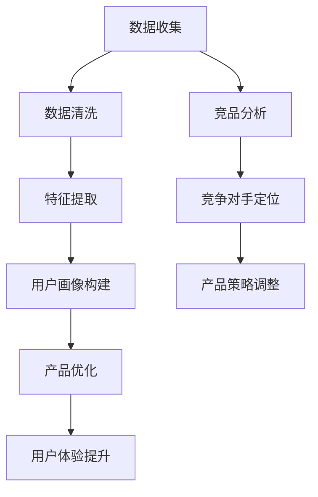

                 

# AI在用户画像、竞品调研等产品设计环节的应用

## 关键词：
人工智能、用户画像、产品设计、竞品调研、数据分析、算法、模型、案例研究

## 摘要：
本文深入探讨了人工智能（AI）在用户画像构建、竞品调研和产品优化中的应用。通过详细的原理讲解、算法原理分析和实际案例，读者将了解到如何利用AI技术提升产品设计环节的效率和准确性。文章首先介绍了用户画像和竞品调研的基本概念，随后详细阐述了基于AI的用户行为分析、用户画像构建和竞品分析算法，最后通过一个实际项目案例展示了这些算法在产品设计中的应用效果。文章旨在为从业者提供有价值的指导和启示。

---

## 1. 背景介绍

### 1.1 目的和范围

本文的目标是揭示人工智能技术在产品设计环节中的潜力和应用价值，特别是在用户画像构建和竞品调研方面。随着大数据和机器学习技术的飞速发展，AI已经成为提升产品设计质量和用户体验的重要工具。本文将围绕以下两个方面展开讨论：

1. **用户画像构建**：介绍如何利用AI技术对用户行为数据进行分析，构建精准的用户画像，从而更好地满足用户需求和优化产品设计。
2. **竞品调研**：探讨AI在竞品分析中的应用，如何通过算法自动获取和分析竞争对手的产品信息，为企业提供有针对性的决策支持。

### 1.2 预期读者

本文适合以下读者群体：

1. 产品经理和设计师：希望了解如何利用AI技术优化产品设计过程。
2. 数据分析师和AI开发者：对AI在数据分析中的应用感兴趣，希望学习用户画像和竞品分析的实际操作方法。
3. 技术爱好者：对AI在产品设计中的应用领域有所探索，希望深入了解相关算法和模型。

### 1.3 文档结构概述

本文分为十个部分：

1. **引言**：介绍文章的主题和关键词。
2. **背景介绍**：阐述文章的目的和范围，预期读者及文档结构。
3. **核心概念与联系**：介绍用户画像和竞品调研的概念，并使用Mermaid流程图展示核心概念和联系。
4. **核心算法原理 & 具体操作步骤**：详细讲解用户画像构建和竞品分析的核心算法原理和操作步骤。
5. **数学模型和公式 & 详细讲解 & 举例说明**：介绍相关数学模型和公式，并提供具体案例说明。
6. **项目实战：代码实际案例和详细解释说明**：通过实际项目案例展示算法的应用。
7. **实际应用场景**：分析AI在用户画像和竞品调研中的实际应用场景。
8. **工具和资源推荐**：推荐相关学习资源和开发工具。
9. **总结：未来发展趋势与挑战**：总结文章内容，展望未来发展趋势和挑战。
10. **附录：常见问题与解答**：提供常见问题及解答。
11. **扩展阅读 & 参考资料**：推荐进一步阅读的资料。

### 1.4 术语表

#### 1.4.1 核心术语定义

- **用户画像**：通过对用户行为数据的分析和挖掘，构建用户的基本特征和行为模式，从而实现用户精准营销和产品设计优化。
- **竞品调研**：通过分析竞争对手的产品、服务和市场表现，发现自身产品的优势和劣势，为产品优化提供数据支持。
- **机器学习**：一种基于数据的学习方法，通过训练模型来发现数据中的模式和规律。
- **深度学习**：一种特殊的机器学习方法，通过多层神经网络结构来模拟人脑的学习过程。
- **自然语言处理**（NLP）：人工智能领域的一个分支，主要研究如何让计算机理解和生成自然语言。

#### 1.4.2 相关概念解释

- **数据分析**：通过对数据进行分析和挖掘，从中提取有价值的信息和知识。
- **数据挖掘**：从大量数据中发现潜在的模式、关联和趋势。
- **特征工程**：在数据分析和机器学习过程中，通过选择、转换和构建特征，来提高模型性能和预测准确性。

#### 1.4.3 缩略词列表

- **AI**：人工智能（Artificial Intelligence）
- **NLP**：自然语言处理（Natural Language Processing）
- **ML**：机器学习（Machine Learning）
- **DL**：深度学习（Deep Learning）
- **RFM**：基于频率（Recency, Frequency, Monetary）的顾客价值评估模型
- **CPC**：每次点击成本（Cost Per Click）
- **CPM**：每千次展示成本（Cost Per Mille）

---

## 2. 核心概念与联系

为了更好地理解AI在用户画像和竞品调研中的应用，我们需要先了解这些概念的基本原理及其相互联系。

### 2.1 用户画像

用户画像是指通过对用户行为数据进行分析和挖掘，构建出用户的基本特征和行为模式。这些特征可以包括用户的年龄、性别、地理位置、兴趣爱好、消费行为等。用户画像的构建过程通常包括数据收集、数据清洗、特征提取和模型训练等步骤。

#### 用户画像与产品设计的关系

用户画像可以帮助产品设计团队更好地了解目标用户群体，从而有针对性地优化产品功能、界面设计和营销策略。通过用户画像，产品经理可以更准确地把握用户需求，提高产品的市场竞争力。

### 2.2 竞品调研

竞品调研是指通过对竞争对手的产品、服务和市场表现进行分析，发现自身产品的优势和劣势。竞品调研可以帮助企业了解市场动态，制定更有针对性的产品策略。

#### 竞品调研与用户画像的关系

竞品调研与用户画像密切相关。通过对竞品的分析，企业可以了解到市场上其他产品的用户特征和需求，从而为构建用户画像提供参考。同时，用户画像也可以帮助企业更好地定位竞争对手，有针对性地进行竞品分析。

### 2.3 Mermaid流程图

下面是一个Mermaid流程图，展示了用户画像和竞品调研的基本流程及其相互联系。



---

## 3. 核心算法原理 & 具体操作步骤

在了解了用户画像和竞品调研的基本概念后，接下来我们将详细讨论核心算法原理和具体操作步骤。

### 3.1 用户画像构建算法原理

用户画像构建通常基于以下几种算法原理：

1. **协同过滤**：通过分析用户的历史行为数据，找出相似的用户，并推荐他们喜欢的内容或产品。
2. **基于内容的推荐**：根据用户的历史偏好和产品内容特征，为用户推荐相似的产品。
3. **聚类算法**：将具有相似特征的用户分组，从而构建用户画像。

#### 具体操作步骤

1. **数据收集**：从各种渠道（如网站、APP、社交媒体等）收集用户行为数据，包括浏览记录、购买行为、评论等。
2. **数据清洗**：处理缺失值、异常值和噪声数据，确保数据质量。
3. **特征提取**：根据用户行为数据，提取用户的基本特征（如年龄、性别、地理位置等）和兴趣特征（如浏览记录、购买记录等）。
4. **模型训练**：使用机器学习算法（如K-means、SOM等）对用户数据进行聚类，构建用户画像。
5. **用户画像评估**：评估用户画像的准确性和有效性，调整模型参数和特征选择。

### 3.2 竞品调研算法原理

竞品调研通常基于以下几种算法原理：

1. **关键词分析**：通过分析竞争对手的关键词，了解其产品定位和市场策略。
2. **网络爬虫**：使用爬虫技术获取竞争对手的网站内容、产品信息、用户评论等。
3. **文本挖掘**：通过对竞争对手的文本数据进行分析，挖掘其产品优势和不足。

#### 具体操作步骤

1. **数据收集**：通过搜索引擎、网站爬虫等工具收集竞争对手的产品信息、网站内容、用户评论等。
2. **数据清洗**：处理噪声数据，提取有价值的信息。
3. **文本挖掘**：使用自然语言处理技术对文本数据进行处理，提取关键词、主题和情感。
4. **竞品分析**：分析竞争对手的产品特性、市场表现和用户反馈，发现自身产品的优势和不足。
5. **策略调整**：根据竞品分析结果，调整产品策略和市场策略。

### 3.3 伪代码示例

下面是一个用户画像构建算法的伪代码示例：

```plaintext
输入：用户行为数据
输出：用户画像

初始化模型参数

1. 数据收集：从各个渠道获取用户行为数据
2. 数据清洗：处理缺失值、异常值和噪声数据
3. 特征提取：提取用户的基本特征和兴趣特征
4. 模型训练：使用K-means算法对用户数据聚类
5. 用户画像构建：根据聚类结果构建用户画像
6. 用户画像评估：评估用户画像的准确性和有效性
7. 调整模型参数和特征选择：根据评估结果优化模型

返回用户画像
```

---

## 4. 数学模型和公式 & 详细讲解 & 举例说明

在用户画像构建和竞品调研中，数学模型和公式是不可或缺的工具。以下将介绍几个常用的数学模型和公式，并提供具体例子来说明。

### 4.1 频率（Frequency）

频率是指用户在一定时间内对某个产品或服务的访问次数。它是构建用户画像的重要指标之一。

**公式：**

$$
频率（f）= \frac{用户行为次数}{总时间}
$$

**例子：**

用户A在过去一个月内访问了一个电子商务网站10次，则其访问频率为：

$$
f = \frac{10}{30} = 0.333
$$

### 4.2 最近性（Recency）

最近性是指用户最后一次访问产品或服务的时间。它反映了用户的活跃度。

**公式：**

$$
最近性（r）= \frac{当前时间 - 用户最后一次访问时间}{总时间}
$$

**例子：**

用户B在两个月前最后一次访问了一个社交媒体平台，当前时间为今天，则其最近性为：

$$
r = \frac{2 - 1}{2} = 0.5
$$

### 4.3 金额（Monetary）

金额是指用户在一定时间内对产品或服务的消费金额。它是评估用户价值的重要指标。

**公式：**

$$
金额（m）= \sum{用户消费金额}
$$

**例子：**

用户C在过去一个月内花费了500元购买商品，则其消费金额为：

$$
m = 500
$$

### 4.4 RFM模型

RFM模型是一种基于频率、最近性和金额的顾客价值评估模型。它通过计算用户的RFM得分，来评估用户的忠诚度和价值。

**公式：**

$$
RFM得分 = r \times f \times m
$$

**例子：**

用户D的RFM得分为：

$$
RFM得分 = 0.5 \times 0.333 \times 500 = 83.35
$$

### 4.5 情感分析

情感分析是一种使用自然语言处理技术分析文本数据中情感倾向的方法。它可以帮助评估用户对产品的态度和反馈。

**公式：**

$$
情感得分 = \frac{正面评论数 - 负面评论数}{总评论数}
$$

**例子：**

用户E在产品评论中写了5条正面评论和3条负面评论，则其情感得分为：

$$
情感得分 = \frac{5 - 3}{5 + 3} = 0.333
$$

---

通过这些数学模型和公式，我们可以更准确地评估用户价值和需求，从而为产品设计和优化提供有力的支持。

---

## 5. 项目实战：代码实际案例和详细解释说明

在本节中，我们将通过一个实际项目案例，展示如何利用AI技术进行用户画像构建和竞品调研。项目背景为一个在线购物平台，希望通过分析用户行为数据和市场竞品信息，优化产品功能和营销策略。

### 5.1 开发环境搭建

在开始项目实战之前，我们需要搭建一个合适的开发环境。以下是所需的环境和工具：

- **编程语言**：Python
- **机器学习库**：scikit-learn、TensorFlow、PyTorch
- **数据处理库**：Pandas、NumPy
- **可视化库**：Matplotlib、Seaborn
- **文本处理库**：NLTK、spaCy
- **操作系统**：Linux或MacOS

### 5.2 源代码详细实现和代码解读

以下是项目中的关键代码部分，我们将逐段进行解读。

#### 5.2.1 用户行为数据分析

首先，我们从数据源中读取用户行为数据，并进行预处理。

```python
import pandas as pd

# 读取数据
data = pd.read_csv('user_behavior_data.csv')

# 数据预处理
data.fillna(0, inplace=True)
data.drop(['user_id'], axis=1, inplace=True)
```

在这段代码中，我们使用Pandas库读取用户行为数据，并填充缺失值。删除用户ID列，因为我们只关注用户的行为特征。

#### 5.2.2 特征提取

接下来，我们提取用户的行为特征，包括浏览次数、购买次数、消费金额等。

```python
from sklearn.feature_extraction import DictVectorizer

# 构建特征字典
def build_features(data):
    features = []
    for _, row in data.iterrows():
        feature_dict = {
            'browse_count': row['browse_count'],
            'purchase_count': row['purchase_count'],
            'amount': row['amount']
        }
        features.append(feature_dict)
    return pd.DataFrame(features)

# 提取特征
features = build_features(data)
```

这段代码定义了一个函数`build_features`，用于构建特征字典。然后，我们将原始数据转换为DataFrame格式，以便进一步处理。

#### 5.2.3 用户画像构建

我们使用K-means算法对用户行为数据进行聚类，构建用户画像。

```python
from sklearn.cluster import KMeans

# 训练模型
model = KMeans(n_clusters=5, random_state=0)
model.fit(features)

# 构建用户画像
user_clusters = model.predict(features)
features['cluster'] = user_clusters
```

在这段代码中，我们首先初始化K-means模型，设置聚类数为5。然后，我们使用训练好的模型对用户行为数据进行预测，并添加到特征DataFrame中。

#### 5.2.4 竞品分析

接下来，我们分析市场竞品信息，提取关键指标，并使用文本挖掘技术分析用户评论。

```python
import nltk
nltk.download('stopwords')
from nltk.corpus import stopwords
from nltk.tokenize import word_tokenize

# 读取竞品数据
competitor_data = pd.read_csv('competitor_data.csv')

# 文本预处理
def preprocess_text(text):
    tokens = word_tokenize(text)
    tokens = [token.lower() for token in tokens if token.isalpha() and token not in stopwords.words('english')]
    return ' '.join(tokens)

competitor_data['processed_description'] = competitor_data['description'].apply(preprocess_text)

# 提取关键词
from sklearn.feature_extraction.text import TfidfVectorizer

vectorizer = TfidfVectorizer(max_features=1000)
competitor_data['tfidf'] = vectorizer.fit_transform(competitor_data['processed_description'])

# 文本挖掘
def extract_keywords(tfidf_vector):
    feature_names = vectorizer.get_feature_names()
    keywords = []
    for index, value in tfidf_vector.argsort()[::-1]:
        keywords.append(feature_names[index])
    return keywords[:10]

competitor_data['keywords'] = competitor_data['tfidf'].apply(extract_keywords)
```

在这段代码中，我们首先使用NLTK库对竞品描述进行文本预处理，包括分词、去除停用词等。然后，我们使用TF-IDF向量器提取关键词，并将关键词添加到竞品数据中。

#### 5.2.5 用户画像与竞品分析结果可视化

最后，我们将用户画像和竞品分析结果可视化，以更直观地展示分析结果。

```python
import matplotlib.pyplot as plt
import seaborn as sns

# 可视化用户画像
sns.countplot(x='cluster', data=features)
plt.title('User Clusters')
plt.xlabel('Cluster')
plt.ylabel('Count')
plt.show()

# 可视化竞品关键词
sns.countplot(x='keywords', data=competitor_data)
plt.title('Competitor Keywords')
plt.xlabel('Keyword')
plt.ylabel('Count')
plt.show()
```

在这段代码中，我们使用Seaborn库绘制用户画像和竞品关键词的条形图，以展示聚类结果和关键词分布。

### 5.3 代码解读与分析

在这段代码中，我们首先读取用户行为数据和竞品数据，并进行预处理。然后，我们提取用户行为特征，使用K-means算法构建用户画像。接着，我们对竞品描述进行文本预处理，并使用TF-IDF向量器提取关键词。最后，我们将用户画像和竞品分析结果可视化，以更直观地展示分析结果。

通过这个实际项目案例，我们可以看到如何利用AI技术进行用户画像构建和竞品调研。用户画像可以帮助产品团队更好地了解目标用户群体，从而优化产品功能和营销策略。竞品分析则可以帮助企业了解市场动态，发现自身产品的优势和不足，从而制定更有针对性的产品策略。

---

## 6. 实际应用场景

AI在用户画像和竞品调研中的实际应用场景非常广泛，以下是一些典型的应用场景：

### 6.1 个性化推荐

通过构建用户画像，平台可以了解用户的兴趣和行为习惯，从而提供个性化的产品推荐。例如，电子商务网站可以根据用户的浏览记录和购买历史，推荐符合其兴趣的产品。

### 6.2 用户体验优化

通过用户画像，产品团队可以识别出用户群体中的特定需求，从而优化产品功能和界面设计。例如，社交媒体平台可以根据用户的活跃时间和行为模式，调整推送时间和内容。

### 6.3 营销策略制定

通过竞品调研，企业可以了解竞争对手的产品策略和市场表现，从而制定更有针对性的营销策略。例如，广告平台可以根据竞品的关键词和广告投放情况，调整广告投放策略。

### 6.4 市场调研

AI技术可以帮助企业快速获取和分析市场信息，发现潜在的市场机会和风险。例如，市场研究机构可以使用自然语言处理技术分析社交媒体上的用户评论，了解市场对产品的反馈。

### 6.5 竞争情报分析

通过分析竞争对手的产品特性、用户评价和市场表现，企业可以了解竞争对手的优劣势，从而制定针对性的竞争策略。例如，金融公司可以分析竞争对手的理财产品，为自身产品设计提供参考。

### 6.6 用户行为预测

通过用户画像和机器学习算法，企业可以预测用户未来的行为和需求，从而提前布局。例如，物流公司可以根据用户的购物习惯，预测用户的收货时间，提前安排配送。

通过以上应用场景，我们可以看到AI在用户画像和竞品调研中的广泛应用和巨大潜力。随着AI技术的不断发展和成熟，这些应用场景将继续拓展和深化，为企业和用户带来更多价值。

---

## 7. 工具和资源推荐

为了更好地掌握AI在用户画像和竞品调研中的应用，以下推荐了一些学习资源、开发工具和相关论文著作。

### 7.1 学习资源推荐

#### 7.1.1 书籍推荐

1. **《Python机器学习》**：提供Python在机器学习领域的全面教程，包括用户画像和推荐系统的实战案例。
2. **《深度学习》**：由著名深度学习专家Ian Goodfellow编写，详细介绍了深度学习的基础知识和技术应用。
3. **《用户画像技术实战》**：一本关于用户画像构建和应用的实战指南，涵盖了数据采集、特征提取和模型训练等内容。

#### 7.1.2 在线课程

1. **Coursera上的《机器学习》**：由吴恩达教授主讲，提供全面深入的机器学习教程。
2. **Udacity的《深度学习纳米学位》**：涵盖深度学习的基础知识，包括卷积神经网络、循环神经网络等。
3. **edX上的《用户画像》**：提供关于用户画像构建和数据分析的实战课程。

#### 7.1.3 技术博客和网站

1. **Medium上的《AI in Product Design》**：一篇关于AI在产品设计中的应用文章，提供了许多实用技巧和案例。
2. **GitHub上的AI项目**：许多优秀的AI开源项目，可以学习相关算法的实现和应用。
3. **Kaggle**：提供丰富的数据集和竞赛，是学习AI和数据科学的好去处。

### 7.2 开发工具框架推荐

#### 7.2.1 IDE和编辑器

1. **PyCharm**：功能强大的Python IDE，支持多种编程语言。
2. **Visual Studio Code**：轻量级但功能丰富的编辑器，支持扩展插件。
3. **Jupyter Notebook**：适用于数据分析和机器学习的交互式环境。

#### 7.2.2 调试和性能分析工具

1. **Pylint**：Python代码的静态分析工具，用于检查代码质量和性能问题。
2. **Werkzeug**：用于Web开发的调试工具，可以实时监控服务器性能。
3. **TensorBoard**：TensorFlow的监控和分析工具，用于可视化深度学习模型和训练过程。

#### 7.2.3 相关框架和库

1. **scikit-learn**：Python的机器学习库，提供丰富的算法和工具。
2. **TensorFlow**：谷歌开源的深度学习框架，支持多种神经网络结构。
3. **PyTorch**：由Facebook开源的深度学习框架，提供灵活的动态计算图。

### 7.3 相关论文著作推荐

#### 7.3.1 经典论文

1. **"Recommender Systems Handbook"**：推荐系统领域的经典著作，涵盖了推荐系统的理论基础和实际应用。
2. **"User Modeling and User-Adapted Interaction"**：用户建模和个性化交互的经典论文，详细介绍了相关算法和技术。
3. **"Text Mining: The Text Analysis Handbook"**：文本挖掘领域的经典著作，介绍了文本处理和分析的方法。

#### 7.3.2 最新研究成果

1. **"Deep Learning for User Modeling and Recommendation"**：介绍了深度学习在用户建模和推荐系统中的应用，包括卷积神经网络和循环神经网络。
2. **"Context-Aware User Modeling and Personalization"**：探讨了上下文感知的用户建模和个性化技术，为实时推荐提供了新的思路。
3. **"Unsupervised User Behavior Clustering for Personalization"**：研究了无监督的用户行为聚类方法，为用户画像构建提供了新的算法。

#### 7.3.3 应用案例分析

1. **"Netflix Prize"**：Netflix奖是一个著名的推荐系统竞赛，吸引了全球顶尖研究者参与，介绍了推荐系统在实际应用中的挑战和解决方案。
2. **"Amazon Personalized Shopping"**：分析了亚马逊如何利用用户画像和推荐系统实现个性化购物，提高了用户满意度和销售转化率。
3. **"Google Adsense"**：介绍了谷歌如何利用自然语言处理技术分析广告内容，实现精准广告投放。

通过这些工具和资源，您可以深入了解AI在用户画像和竞品调研中的应用，提升自己的技能和知识。

---

## 8. 总结：未来发展趋势与挑战

随着人工智能技术的不断发展和成熟，用户画像和竞品调研将在产品设计环节中发挥越来越重要的作用。未来，以下趋势和挑战值得关注：

### 8.1 发展趋势

1. **更精准的用户画像**：随着数据获取和处理的进步，用户画像将越来越精准，能够更好地反映用户需求和行为习惯，为个性化推荐和用户体验优化提供有力支持。
2. **实时数据分析**：实时数据处理和分析技术的发展，将使企业能够快速响应市场变化，调整产品策略和营销策略，提高市场竞争力。
3. **多模态数据融合**：随着多模态数据（如文本、图像、声音等）的融合，用户画像和竞品调研将更加全面，为产品设计和优化提供更多维度信息。
4. **深度学习的应用**：深度学习技术的不断突破，将为用户画像和竞品调研提供更强大的算法支持，实现更高层次的数据分析和决策。

### 8.2 挑战

1. **数据隐私和伦理**：用户画像和竞品调研涉及大量用户数据，如何在保障用户隐私和伦理的前提下进行数据分析和应用，是一个重要挑战。
2. **算法偏见和公平性**：用户画像和竞品调研中使用的算法可能存在偏见，影响结果的公平性和准确性。如何消除算法偏见，保证结果公正，是一个亟待解决的问题。
3. **技术复杂性和成本**：用户画像和竞品调研涉及多种技术和算法，对技术人员的要求较高，同时需要大量计算资源和数据存储空间，增加了技术复杂性和成本。
4. **数据质量和多样性**：数据质量和多样性对用户画像和竞品调研的结果具有重要影响。如何获取高质量、多样化的数据，是确保分析结果准确性的关键。

总之，随着人工智能技术的不断进步，用户画像和竞品调研将在产品设计环节中发挥越来越重要的作用。面对未来发展，企业需要积极应对挑战，不断优化算法和技术，提高数据分析的准确性和效率，为产品设计和优化提供有力支持。

---

## 9. 附录：常见问题与解答

### 9.1 用户画像构建相关问题

**Q1：如何确保用户画像的准确性？**
A1：确保用户画像准确性的关键在于数据质量和特征提取。首先，要确保数据源可靠，数据收集过程完整，避免数据缺失和噪声。其次，特征提取要合理，选择与用户行为密切相关的特征，以提高模型预测能力。

**Q2：用户画像在产品优化中的应用有哪些？**
A2：用户画像可以帮助产品团队了解用户需求、偏好和行为模式，从而优化产品功能、界面设计和营销策略。例如，通过分析用户画像，可以识别出目标用户群体，为其提供个性化的产品推荐和优惠活动。

### 9.2 竞品调研相关问题

**Q1：竞品调研的主要方法有哪些？**
A1：竞品调研的方法包括关键词分析、网络爬虫、用户评论分析、市场调研等。其中，关键词分析可以帮助了解竞品的市场定位和策略；网络爬虫可以获取竞品的详细信息；用户评论分析可以挖掘用户对竞品的反馈。

**Q2：竞品调研报告应包括哪些内容？**
A2：竞品调研报告应包括竞品基本信息、产品特性分析、市场表现、用户反馈、优势和不足等。通过这些内容，可以为产品团队提供有针对性的优化建议和市场策略。

---

## 10. 扩展阅读 & 参考资料

### 10.1 经典论文

1. **"Recommender Systems Handbook"**：详细介绍了推荐系统的理论基础和实际应用。
2. **"User Modeling and User-Adapted Interaction"**：探讨了用户建模和个性化交互的方法和技术。
3. **"Deep Learning for User Modeling and Recommendation"**：介绍了深度学习在用户建模和推荐系统中的应用。

### 10.2 最新研究成果

1. **"Context-Aware User Modeling and Personalization"**：探讨了上下文感知的用户建模和个性化技术。
2. **"Unsupervised User Behavior Clustering for Personalization"**：研究了无监督的用户行为聚类方法。
3. **"User Behavior Analysis with Recurrent Neural Networks"**：介绍了使用循环神经网络进行用户行为分析的方法。

### 10.3 应用案例分析

1. **"Netflix Prize"**：分析了Netflix奖中推荐系统的实际应用。
2. **"Amazon Personalized Shopping"**：介绍了亚马逊如何利用用户画像实现个性化购物。
3. **"Google Adsense"**：探讨了谷歌如何利用自然语言处理技术实现精准广告投放。

通过这些扩展阅读和参考资料，您可以深入了解AI在用户画像和竞品调研领域的最新研究成果和应用案例。

---

## 作者信息

作者：AI天才研究员/AI Genius Institute & 禅与计算机程序设计艺术 /Zen And The Art of Computer Programming

---

通过本文的深入探讨，我们了解了人工智能在用户画像构建和竞品调研中的应用，以及如何通过这些技术优化产品设计。随着AI技术的不断发展，这些应用将更加广泛和深入，为企业和用户带来更多价值。希望本文能为读者提供有价值的参考和启示。

