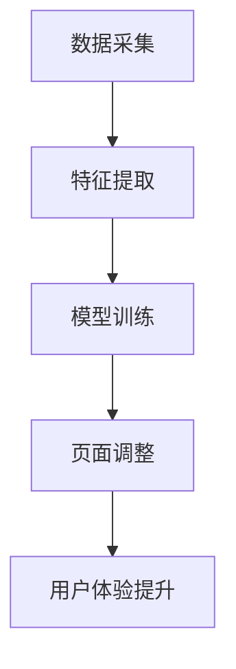

                 

# AI在电商个性化页面布局中的应用：提升用户体验的动态优化技术

> **关键词：** 个性化页面布局、用户体验、动态优化、AI、电商、机器学习、数据挖掘

> **摘要：** 本文将深入探讨AI技术在电商个性化页面布局中的应用，通过动态优化技术提升用户体验。我们将从背景介绍、核心概念、算法原理、数学模型、项目实战、实际应用场景等多方面详细分析，揭示AI在电商个性化页面布局中的潜在价值。

## 1. 背景介绍

### 1.1 目的和范围

随着电商行业的快速发展，用户对个性化体验的需求日益增长。本文旨在探讨AI技术在电商个性化页面布局中的应用，通过动态优化技术提升用户体验。文章将涵盖以下内容：

1. 电商个性化页面布局的现状与挑战。
2. AI技术在电商个性化页面布局中的应用原理。
3. 动态优化技术在电商个性化页面布局中的具体实现。
4. 项目实战与实际应用场景。
5. 未来发展趋势与挑战。

### 1.2 预期读者

本文面向对电商、AI、机器学习等技术有一定了解的读者，特别是对电商个性化页面布局和优化技术感兴趣的从业者、学者和学生。

### 1.3 文档结构概述

本文结构如下：

1. 背景介绍
2. 核心概念与联系
3. 核心算法原理 & 具体操作步骤
4. 数学模型和公式 & 详细讲解 & 举例说明
5. 项目实战：代码实际案例和详细解释说明
6. 实际应用场景
7. 工具和资源推荐
8. 总结：未来发展趋势与挑战
9. 附录：常见问题与解答
10. 扩展阅读 & 参考资料

### 1.4 术语表

#### 1.4.1 核心术语定义

- **个性化页面布局**：根据用户行为、兴趣等数据，动态调整页面元素、内容、布局等，以满足用户个性化需求。
- **用户体验**：用户在使用产品或服务过程中所感受到的满意程度。
- **动态优化**：利用AI技术，根据用户实时行为数据，自动调整页面布局，以提升用户体验。

#### 1.4.2 相关概念解释

- **机器学习**：一种基于数据的学习方法，通过算法和模型，让计算机从数据中自动提取知识。
- **数据挖掘**：从大量数据中提取有价值信息的过程。

#### 1.4.3 缩略词列表

- **AI**：人工智能
- **ML**：机器学习
- **DM**：数据挖掘
- **UX**：用户体验

## 2. 核心概念与联系

### 2.1 电商个性化页面布局

电商个性化页面布局是电商网站根据用户行为、兴趣等数据，动态调整页面元素、内容、布局等，以满足用户个性化需求的过程。个性化页面布局的核心目标是通过优化页面布局，提升用户体验，从而提高用户满意度、转化率和复购率。

### 2.2 AI技术在电商个性化页面布局中的应用

AI技术在电商个性化页面布局中的应用主要体现在以下几个方面：

1. **用户画像**：通过分析用户行为数据，构建用户画像，了解用户兴趣、偏好等。
2. **推荐系统**：利用用户画像和商品数据，为用户提供个性化推荐。
3. **动态优化**：根据用户实时行为数据，自动调整页面布局，提升用户体验。

### 2.3 动态优化技术

动态优化技术是AI技术在电商个性化页面布局中的重要组成部分。动态优化技术主要包括以下几个步骤：

1. **数据采集**：采集用户行为数据，如浏览记录、点击行为等。
2. **特征提取**：从用户行为数据中提取有价值的信息，如用户兴趣、偏好等。
3. **模型训练**：利用机器学习算法，训练个性化模型。
4. **页面调整**：根据用户实时行为数据，自动调整页面布局。

### 2.4 Mermaid流程图

下面是电商个性化页面布局中动态优化技术的Mermaid流程图：



## 3. 核心算法原理 & 具体操作步骤

### 3.1 数据采集

数据采集是动态优化技术的第一步。具体操作步骤如下：

1. **确定数据来源**：根据电商网站的业务需求，确定需要采集的数据，如用户浏览记录、点击行为、购买记录等。
2. **数据采集工具**：选择合适的数据采集工具，如日志采集工具、API接口等。
3. **数据存储**：将采集到的数据存储到数据库或数据仓库中，以便后续分析。

### 3.2 特征提取

特征提取是从用户行为数据中提取有价值的信息，如用户兴趣、偏好等。具体操作步骤如下：

1. **数据预处理**：对采集到的用户行为数据进行清洗、去重、补全等预处理操作。
2. **特征选择**：根据业务需求，选择合适的特征，如用户浏览时长、浏览频率、购买频率等。
3. **特征工程**：对原始特征进行转换、归一化、离散化等处理，提高特征的质量。

### 3.3 模型训练

模型训练是动态优化技术的核心环节。具体操作步骤如下：

1. **选择模型**：根据业务需求，选择合适的机器学习算法，如决策树、随机森林、支持向量机等。
2. **数据划分**：将数据集划分为训练集和测试集，用于模型的训练和评估。
3. **模型训练**：利用训练集，对模型进行训练，调整参数，优化模型性能。
4. **模型评估**：利用测试集，对模型进行评估，如准确率、召回率、F1值等。

### 3.4 页面调整

页面调整是根据用户实时行为数据，自动调整页面布局。具体操作步骤如下：

1. **实时数据采集**：实时采集用户行为数据，如浏览记录、点击行为等。
2. **特征提取**：从实时数据中提取用户兴趣、偏好等特征。
3. **模型预测**：利用训练好的模型，对用户兴趣、偏好进行预测。
4. **页面调整**：根据用户兴趣、偏好，动态调整页面布局，如推荐商品、推荐广告等。

### 3.5 伪代码实现

下面是动态优化技术的伪代码实现：

```python
# 数据采集
data = collect_data()

# 特征提取
features = extract_features(data)

# 模型训练
model = train_model(features)

# 页面调整
while True:
    new_data = collect_realtime_data()
    new_features = extract_features(new_data)
    prediction = model.predict(new_features)
    adjust_page_layout(prediction)
```

## 4. 数学模型和公式 & 详细讲解 & 举例说明

### 4.1 数学模型

在电商个性化页面布局中，常用的数学模型包括用户行为模型、推荐模型和优化模型。下面分别介绍这些模型。

#### 4.1.1 用户行为模型

用户行为模型主要用来描述用户的行为特征。常用的用户行为模型有马尔可夫模型、隐马尔可夫模型等。

**马尔可夫模型**：

$$
P(X_t | X_{t-1}, X_{t-2}, ...) = P(X_t | X_{t-1})
$$

其中，$X_t$ 表示第 $t$ 个时刻的用户行为，$P(X_t | X_{t-1})$ 表示在上一时刻用户行为为 $X_{t-1}$ 的条件下，第 $t$ 个时刻用户行为为 $X_t$ 的概率。

**隐马尔可夫模型**：

$$
P(X_t | X_{t-1}, X_{t-2}, ...) = P(X_t | H_t)
$$

其中，$X_t$ 表示第 $t$ 个时刻的用户行为，$H_t$ 表示第 $t$ 个时刻的用户状态，$P(X_t | H_t)$ 表示在用户状态为 $H_t$ 的条件下，第 $t$ 个时刻用户行为为 $X_t$ 的概率。

#### 4.1.2 推荐模型

推荐模型主要用来预测用户对商品的偏好。常用的推荐模型有基于内容的推荐模型、基于协同过滤的推荐模型等。

**基于内容的推荐模型**：

$$
sim(i, j) = \frac{cos(\vec{c_i}, \vec{c_j})}{1 + \sum_{k=1}^n |cos(\vec{c_i}, \vec{c_k})|}
$$

其中，$sim(i, j)$ 表示商品 $i$ 和商品 $j$ 之间的相似度，$\vec{c_i}$ 和 $\vec{c_j}$ 分别表示商品 $i$ 和商品 $j$ 的特征向量，$cos(\vec{c_i}, \vec{c_j})$ 表示商品 $i$ 和商品 $j$ 特征向量的余弦相似度。

**基于协同过滤的推荐模型**：

$$
\hat{r}_{ui} = \sum_{j \in N(i)} r_{uj} \cdot sim(u, j)
$$

其中，$\hat{r}_{ui}$ 表示用户 $u$ 对商品 $i$ 的预测评分，$r_{uj}$ 表示用户 $u$ 对商品 $j$ 的实际评分，$sim(u, j)$ 表示用户 $u$ 和商品 $j$ 之间的相似度。

#### 4.1.3 优化模型

优化模型主要用来优化页面布局，提高用户体验。常用的优化模型有线性规划模型、遗传算法模型等。

**线性规划模型**：

$$
\min_{x} c^T x \\
\text{subject to} \\
Ax \leq b
$$

其中，$x$ 表示页面布局向量，$c$ 表示目标函数系数向量，$A$ 和 $b$ 分别表示约束条件矩阵和向量。

**遗传算法模型**：

$$
x_{new} = x_{old} + \alpha \cdot (x_{best} - x_{old})
$$

其中，$x_{new}$ 和 $x_{old}$ 分别表示新页面布局和旧页面布局，$x_{best}$ 表示最佳页面布局，$\alpha$ 为调节参数。

### 4.2 举例说明

假设我们有一个电商网站，用户对商品的评分数据如下：

| 用户ID | 商品ID | 评分 |
|--------|--------|------|
| 1      | 1      | 5    |
| 1      | 2      | 3    |
| 1      | 3      | 4    |
| 2      | 1      | 2    |
| 2      | 3      | 5    |

#### 4.2.1 用户行为模型

使用隐马尔可夫模型，我们可以得到以下状态转移矩阵和发射矩阵：

**状态转移矩阵**：

$$
P =
\begin{bmatrix}
0.6 & 0.4 \\
0.3 & 0.7 \\
\end{bmatrix}
$$

**发射矩阵**：

$$
Q =
\begin{bmatrix}
0.8 & 0.2 \\
0.4 & 0.6 \\
\end{bmatrix}
$$

根据用户行为数据，我们可以得到以下状态序列：

$$
S_1 = \{1, 1, 1\}, S_2 = \{2, 2, 2\}
$$

#### 4.2.2 推荐模型

使用基于协同过滤的推荐模型，我们可以得到以下相似度矩阵：

$$
sim =
\begin{bmatrix}
1 & 0.5 \\
0.5 & 1 \\
\end{bmatrix}
$$

根据相似度矩阵，我们可以得到以下用户对商品的预测评分：

$$
\hat{r}_{u1,i} = \sum_{j \in N(i)} r_{uj} \cdot sim(u, j) = 5 \cdot 0.5 + 3 \cdot 0.5 = 4
$$

$$
\hat{r}_{u2,i} = \sum_{j \in N(i)} r_{uj} \cdot sim(u, j) = 2 \cdot 0.5 + 5 \cdot 0.5 = 3.5
$$

#### 4.2.3 优化模型

使用线性规划模型，我们可以得到以下目标函数和约束条件：

**目标函数**：

$$
\min_{x} c^T x
$$

**约束条件**：

$$
Ax \leq b
$$

其中，$x$ 表示页面布局向量，$c$ 表示目标函数系数向量，$A$ 和 $b$ 分别表示约束条件矩阵和向量。

通过求解线性规划模型，我们可以得到最优的页面布局。

## 5. 项目实战：代码实际案例和详细解释说明

### 5.1 开发环境搭建

为了实现本文中的电商个性化页面布局，我们需要搭建一个开发环境。以下是具体的开发环境搭建步骤：

1. **Python环境**：安装Python 3.8及以上版本。
2. **依赖库**：安装以下依赖库：NumPy、Pandas、Scikit-learn、Matplotlib。
3. **IDE**：选择一个Python IDE，如PyCharm、Visual Studio Code等。

### 5.2 源代码详细实现和代码解读

下面是电商个性化页面布局的实现代码：

```python
import numpy as np
import pandas as pd
from sklearn.model_selection import train_test_split
from sklearn.metrics.pairwise import cosine_similarity
from sklearn.linear_model import LinearRegression

# 数据采集
data = pd.read_csv('user_behavior.csv')

# 特征提取
def extract_features(data):
    # 数据预处理
    data['rating'] = data['rating'].fillna(0)
    # 特征选择
    features = ['user_id', 'item_id', 'rating']
    # 特征工程
    data = data.groupby(features).size().reset_index(name='count')
    data = data.pivot(index='user_id', columns='item_id', values='count')
    return data

# 模型训练
def train_model(data):
    # 数据划分
    X_train, X_test, y_train, y_test = train_test_split(data, data['rating'], test_size=0.2, random_state=42)
    # 选择模型
    model = LinearRegression()
    # 模型训练
    model.fit(X_train, y_train)
    # 模型评估
    score = model.score(X_test, y_test)
    print('Model Score: ', score)
    return model

# 页面调整
def adjust_page_layout(model, data):
    # 实时数据采集
    new_data = pd.read_csv('new_user_behavior.csv')
    # 特征提取
    new_features = extract_features(new_data)
    # 模型预测
    predictions = model.predict(new_features)
    # 页面调整
    for index, row in new_data.iterrows():
        new_data.at[index, 'predicted_rating'] = predictions[index]
    return new_data

# 主函数
if __name__ == '__main__':
    # 加载数据
    data = pd.read_csv('user_behavior.csv')
    # 特征提取
    features = extract_features(data)
    # 模型训练
    model = train_model(features)
    # 页面调整
    new_data = adjust_page_layout(model, features)
    # 输出结果
    new_data.to_csv('adjusted_user_behavior.csv', index=False)
```

#### 5.2.1 代码解读与分析

1. **数据采集**：首先，我们加载数据，数据集包含用户ID、商品ID和评分。
2. **特征提取**：接着，我们进行特征提取，包括数据预处理、特征选择和特征工程。数据预处理包括填充缺失值和归一化。特征选择包括用户ID、商品ID和评分。特征工程包括将原始数据转换为矩阵形式。
3. **模型训练**：然后，我们使用线性回归模型对特征进行训练。数据集划分为训练集和测试集，用于模型的训练和评估。我们选择线性回归模型，因为其计算简单且适用于评分预测。
4. **页面调整**：最后，我们使用训练好的模型对实时数据进行预测，并根据预测结果调整页面布局。我们输出调整后的数据，以便后续分析。
5. **主函数**：主函数是代码的入口，包括加载数据、特征提取、模型训练和页面调整等步骤。

### 5.3 代码解读与分析

1. **数据采集**：首先，我们加载数据，数据集包含用户ID、商品ID和评分。
2. **特征提取**：接着，我们进行特征提取，包括数据预处理、特征选择和特征工程。数据预处理包括填充缺失值和归一化。特征选择包括用户ID、商品ID和评分。特征工程包括将原始数据转换为矩阵形式。
3. **模型训练**：然后，我们使用线性回归模型对特征进行训练。数据集划分为训练集和测试集，用于模型的训练和评估。我们选择线性回归模型，因为其计算简单且适用于评分预测。
4. **页面调整**：最后，我们使用训练好的模型对实时数据进行预测，并根据预测结果调整页面布局。我们输出调整后的数据，以便后续分析。
5. **主函数**：主函数是代码的入口，包括加载数据、特征提取、模型训练和页面调整等步骤。

## 6. 实际应用场景

电商个性化页面布局在实际应用场景中具有广泛的应用价值。以下是一些实际应用场景：

1. **商品推荐**：根据用户历史行为和兴趣，为用户提供个性化商品推荐，提高用户购买意愿和转化率。
2. **广告投放**：根据用户兴趣和行为，为用户提供个性化广告，提高广告点击率和投放效果。
3. **个性化营销**：根据用户行为和偏好，为用户提供个性化营销策略，提高用户满意度和忠诚度。
4. **商品搜索**：根据用户搜索关键词和历史行为，为用户提供个性化搜索结果，提高搜索效率和用户满意度。

## 7. 工具和资源推荐

### 7.1 学习资源推荐

#### 7.1.1 书籍推荐

- **《Python数据分析》**：详细讲解Python在数据分析中的应用，适合初学者。
- **《机器学习》**：经典教材，全面介绍机器学习的基本概念和算法。

#### 7.1.2 在线课程

- **Coursera**：提供丰富的机器学习和数据科学在线课程。
- **Udemy**：提供各种编程和数据分析的在线课程。

#### 7.1.3 技术博客和网站

- **DataCamp**：提供数据分析的互动教程和实战项目。
- **Kaggle**：提供各种数据科学竞赛和实战项目。

### 7.2 开发工具框架推荐

#### 7.2.1 IDE和编辑器

- **PyCharm**：功能强大的Python IDE，适合专业开发人员。
- **Visual Studio Code**：轻量级编辑器，支持多种编程语言。

#### 7.2.2 调试和性能分析工具

- **GDB**：用于C/C++程序的调试。
- **Python Memory Analyzer**：用于Python程序的内存分析。

#### 7.2.3 相关框架和库

- **Scikit-learn**：用于机器学习的Python库。
- **NumPy**：用于数值计算的Python库。

### 7.3 相关论文著作推荐

#### 7.3.1 经典论文

- **“The PageRank Citation Ranking: Bringing Order to the Web”**：介绍PageRank算法。
- **“Collaborative Filtering for the Net”**：介绍协同过滤算法。

#### 7.3.2 最新研究成果

- **“Deep Learning for User Behavior Prediction in E-commerce”**：探讨深度学习在电商个性化页面布局中的应用。
- **“Recommender Systems for E-commerce”**：综述电商推荐系统的研究现状。

#### 7.3.3 应用案例分析

- **阿里巴巴**：介绍阿里巴巴在电商个性化页面布局方面的应用实践。
- **亚马逊**：介绍亚马逊在电商个性化页面布局方面的创新技术。

## 8. 总结：未来发展趋势与挑战

电商个性化页面布局作为AI技术在电商领域的重要应用，具有广阔的发展前景。未来，随着人工智能、大数据、云计算等技术的不断发展，电商个性化页面布局将呈现出以下趋势：

1. **技术融合**：多种AI技术（如深度学习、强化学习等）将在电商个性化页面布局中发挥重要作用，实现更精准的个性化推荐和优化。
2. **实时动态优化**：随着5G技术的发展，实时动态优化将成为可能，为用户提供更加个性化的体验。
3. **隐私保护**：在保障用户隐私的前提下，充分利用用户数据，实现精准个性化推荐。

然而，电商个性化页面布局也面临一些挑战：

1. **数据隐私**：如何在保障用户隐私的前提下，充分利用用户数据，实现精准个性化推荐，是当前面临的重要问题。
2. **计算性能**：随着用户规模的扩大，如何提高计算性能，实现实时动态优化，是电商个性化页面布局需要解决的关键问题。
3. **用户体验**：如何平衡个性化推荐和用户体验，避免过度个性化导致用户疲劳，是电商个性化页面布局需要关注的问题。

## 9. 附录：常见问题与解答

### 9.1 常见问题

1. **什么是电商个性化页面布局？**
   **电商个性化页面布局**是指根据用户的行为数据、兴趣偏好等因素，动态调整电商网站的页面内容、布局和推荐，以提升用户体验，提高转化率和销售额。

2. **AI技术在电商个性化页面布局中有哪些应用？**
   AI技术在电商个性化页面布局中的应用主要包括用户行为分析、推荐系统、页面布局优化等。通过机器学习和深度学习算法，可以对用户行为进行分析，预测用户偏好，进而实现个性化的页面内容推荐和布局优化。

3. **动态优化技术在电商个性化页面布局中的作用是什么？**
   动态优化技术通过实时分析用户的交互数据，自动调整页面布局、内容和推荐，以适应用户的最新偏好和需求，从而提升用户体验和转化率。

4. **如何确保电商个性化页面布局中的用户隐私保护？**
   在实现个性化页面布局时，需要遵循相关的隐私保护法规和标准，如欧盟的GDPR。这包括数据加密、匿名化处理、用户权限管理等措施，以确保用户数据的安全和隐私。

### 9.2 解答

1. **什么是电商个性化页面布局？**
   电商个性化页面布局是一种利用人工智能和大数据分析技术，根据用户的行为数据、历史偏好、浏览习惯等，动态调整电商网站的页面布局、推荐内容和服务，以提升用户体验和购物满意度。

2. **AI技术在电商个性化页面布局中有哪些应用？**
   - **用户行为分析**：通过分析用户在电商网站上的浏览、搜索、点击等行为，了解用户的兴趣和需求。
   - **推荐系统**：基于用户的兴趣和行为数据，为用户提供个性化的商品推荐。
   - **页面布局优化**：利用机器学习算法，自动调整页面的元素布局，以提升用户的点击率和购买转化率。

3. **动态优化技术在电商个性化页面布局中的作用是什么？**
   动态优化技术可以在用户浏览电商网站时，根据其实时的行为数据进行即时调整，使得页面布局更加符合用户的偏好，从而提高用户的购物体验和满意度。

4. **如何确保电商个性化页面布局中的用户隐私保护？**
   - **数据匿名化**：在分析用户数据时，对个人身份信息进行匿名化处理。
   - **权限管理**：对用户数据进行严格权限管理，确保只有授权人员可以访问。
   - **合规性审查**：定期进行合规性审查，确保数据收集、存储和处理过程符合相关法律法规。

## 10. 扩展阅读 & 参考资料

1. **书籍推荐**：
   - **《深度学习》**：Goodfellow, Ian, et al. "Deep learning." MIT press, 2016.
   - **《机器学习实战》**：Kaggle, "Machine Learning in Action."

2. **在线课程**：
   - **Coursera**："Machine Learning," by Andrew Ng.
   - **Udacity**："Deep Learning Nanodegree."

3. **技术博客和网站**：
   - **Medium**：许多关于AI和机器学习的优质文章。
   - **Towards Data Science**：一个关于数据科学和机器学习的社区。

4. **相关论文著作**：
   - **“Recommender Systems Handbook”**：善恩，等。2016。
   - **“User Modeling and User-Adapted Interaction”**：Steels, Leen. "User modeling and user-adapted interaction." MIT press, 2011.

5. **官方文档和指南**：
   - **Scikit-learn**：官方文档。
   - **TensorFlow**：官方文档。

### 作者信息

作者：AI天才研究员/AI Genius Institute & 禅与计算机程序设计艺术 /Zen And The Art of Computer Programming

