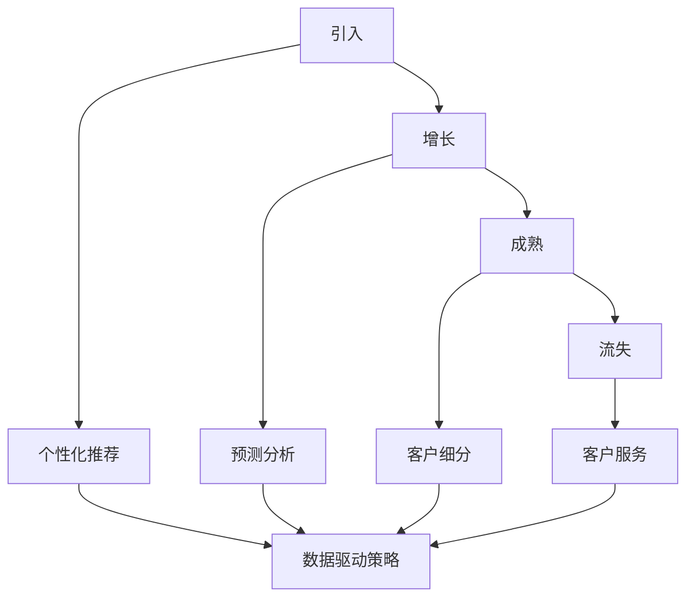

                 

# AI在电商客户生命周期管理中的应用：提升客户价值的数据策略

> 关键词：人工智能、电商、客户生命周期、数据策略、价值提升

> 摘要：本文深入探讨了人工智能在电商客户生命周期管理中的应用，通过数据驱动的策略，实现客户价值的全面提升。文章首先介绍了客户生命周期管理的背景和重要性，然后详细阐述了人工智能技术在这一领域的应用原理和具体操作步骤，接着通过数学模型和项目实战案例，对关键技术和算法进行了深入剖析，最后提出了实际应用场景、相关工具和资源推荐，以及未来发展趋势与挑战。

## 1. 背景介绍

### 1.1 目的和范围

本文的目的是探讨人工智能技术在电商客户生命周期管理中的应用，通过数据策略实现客户价值的全面提升。具体来说，本文将涵盖以下内容：

- 电商客户生命周期管理的背景和重要性。
- 人工智能技术在客户生命周期管理中的应用原理。
- 核心算法原理和具体操作步骤。
- 数学模型和公式及其详细讲解。
- 项目实战案例和代码实际操作。
- 实际应用场景分析。
- 工具和资源的推荐。
- 未来发展趋势与挑战。

### 1.2 预期读者

本文预期读者为以下几类：

- 涉足电商行业的数据分析师和产品经理。
- 人工智能领域的科研人员和工程师。
- 对电商客户生命周期管理和人工智能应用感兴趣的技术爱好者。

### 1.3 文档结构概述

本文结构如下：

- 第1章：背景介绍，包括目的和范围、预期读者、文档结构概述等。
- 第2章：核心概念与联系，介绍客户生命周期管理的基础概念，并使用Mermaid流程图展示核心概念和架构。
- 第3章：核心算法原理 & 具体操作步骤，讲解人工智能技术在实际应用中的具体算法和操作步骤。
- 第4章：数学模型和公式 & 详细讲解 & 举例说明，介绍用于客户生命周期管理的关键数学模型和公式，并给出具体示例。
- 第5章：项目实战：代码实际案例和详细解释说明，通过具体项目案例展示人工智能技术在电商客户生命周期管理中的实际应用。
- 第6章：实际应用场景，分析人工智能技术在电商行业中的各种应用场景。
- 第7章：工具和资源推荐，推荐学习资源、开发工具和框架。
- 第8章：总结：未来发展趋势与挑战，展望人工智能技术在电商客户生命周期管理中的未来发展趋势和面临的挑战。
- 第9章：附录：常见问题与解答，针对读者可能提出的问题进行解答。
- 第10章：扩展阅读 & 参考资料，提供进一步阅读的参考资料。

### 1.4 术语表

#### 1.4.1 核心术语定义

- 客户生命周期管理（Customer Lifecycle Management，CLM）：一种通过分析客户在整个生命周期中的行为和需求，以提高客户价值、降低流失率和提高客户满意度的管理方法。
- 人工智能（Artificial Intelligence，AI）：模拟人类智能的计算机系统，具有感知、推理、学习、决策和问题解决等能力。
- 客户细分（Customer Segmentation）：将客户群体划分为不同的子群体，以便于针对不同子群体的特点和需求进行差异化管理和营销。

#### 1.4.2 相关概念解释

- 客户生命周期：从客户初次接触品牌到最终流失的整个过程，包括引入、增长、成熟和流失四个阶段。
- 客户价值：客户对企业盈利能力的贡献，包括购买频率、购买金额、生命周期价值等。
- 数据驱动的策略：通过收集、分析和利用数据，指导决策和行动的策略。

#### 1.4.3 缩略词列表

- AI：人工智能
- CLM：客户生命周期管理
- CRM：客户关系管理
- CTR：点击率
- CVR：转化率
- NPS：净推荐值

## 2. 核心概念与联系

在深入探讨人工智能在电商客户生命周期管理中的应用之前，我们需要了解几个核心概念及其相互关系。

### 2.1 客户生命周期管理

客户生命周期管理是一种系统性的方法，用于跟踪和优化客户在整个生命周期中的体验和价值。以下是客户生命周期的四个主要阶段：

1. **引入（Acquisition）**：吸引新客户，提高品牌知名度，建立初步的品牌认知。
2. **增长（Growth）**：增加客户粘性，提高客户参与度，提升客户满意度。
3. **成熟（Maturity）**：维护现有客户，提高客户忠诚度，增加客户生命周期价值。
4. **流失（Churn）**：减少客户流失，降低客户流失率，提高客户保留率。

### 2.2 人工智能在客户生命周期管理中的应用

人工智能技术在客户生命周期管理中可以发挥以下关键作用：

- **个性化推荐**：基于用户的历史行为和偏好，推荐个性化的产品和服务，提高用户满意度和转化率。
- **预测分析**：预测客户流失和潜在流失客户，采取预防措施，降低客户流失率。
- **客户细分**：通过分析客户行为和特征，将客户划分为不同的细分群体，实现精准营销。
- **客户服务**：利用自然语言处理和智能聊天机器人，提供24/7的在线客户支持，提高客户满意度。

### 2.3 数据驱动策略

数据驱动策略是通过收集、分析和利用数据来指导决策和行动。在客户生命周期管理中，数据驱动策略可以帮助企业：

- **优化营销活动**：通过分析营销活动的效果，调整营销策略，提高投资回报率。
- **提高运营效率**：利用数据分析优化客户服务流程，减少不必要的运营成本。
- **提升客户体验**：通过数据驱动策略，提供个性化的服务和体验，增强客户满意度和忠诚度。

### 2.4 Mermaid流程图

为了更好地理解客户生命周期管理中人工智能技术的应用，我们可以使用Mermaid流程图来展示核心概念和架构。以下是一个简单的Mermaid流程图示例：



在上述流程图中，我们展示了客户生命周期的四个阶段以及人工智能技术在各个阶段中的应用。通过这种结构化的方式，我们可以更好地理解人工智能在电商客户生命周期管理中的作用。

## 3. 核心算法原理 & 具体操作步骤

在客户生命周期管理中，人工智能技术的核心算法原理包括个性化推荐、预测分析、客户细分等。以下我们将详细讲解这些算法的原理和具体操作步骤。

### 3.1 个性化推荐算法原理

个性化推荐算法是一种通过分析用户的历史行为和偏好，为用户推荐个性化内容的方法。在电商客户生命周期管理中，个性化推荐算法可以用于推荐产品和服务，从而提高用户满意度和转化率。

**算法原理**：

1. **协同过滤**：基于用户的历史行为数据，找到与目标用户相似的用户，并推荐这些用户喜欢的商品。
2. **基于内容的推荐**：基于用户对商品的浏览和购买记录，分析商品的特征，为用户推荐具有相似特征的商品。
3. **混合推荐**：结合协同过滤和基于内容的推荐方法，提高推荐的准确性和多样性。

**具体操作步骤**：

1. **数据收集**：收集用户的历史行为数据，包括浏览记录、购买记录、评价等。
2. **特征提取**：对用户的历史行为数据进行处理和特征提取，如用户兴趣标签、商品类别、评分等。
3. **相似度计算**：计算用户之间的相似度，可以使用余弦相似度、皮尔逊相关系数等方法。
4. **推荐生成**：根据相似度计算结果，为用户推荐相似用户喜欢的商品。

### 3.2 预测分析算法原理

预测分析算法是一种通过分析历史数据，预测未来事件的方法。在电商客户生命周期管理中，预测分析算法可以用于预测客户流失、购买意图等，帮助企业采取预防措施，提高客户保留率和转化率。

**算法原理**：

1. **回归分析**：通过建立回归模型，分析自变量和因变量之间的关系，预测因变量的值。
2. **分类分析**：通过建立分类模型，将数据分为不同的类别，用于预测客户流失、购买意图等。
3. **时间序列分析**：通过分析时间序列数据，预测未来的趋势和变化。

**具体操作步骤**：

1. **数据收集**：收集客户的历史行为数据，包括购买记录、浏览记录、客户特征等。
2. **特征提取**：对客户的历史行为数据进行处理和特征提取，如购买频率、购买金额、浏览时长等。
3. **模型训练**：选择合适的模型，使用训练集对模型进行训练，得到预测结果。
4. **预测应用**：将训练好的模型应用于实际数据，预测未来的事件，如客户流失、购买意图等。

### 3.3 客户细分算法原理

客户细分算法是一种将客户划分为不同的子群体，以便于针对不同子群体的特点和需求进行差异化管理和营销的方法。在电商客户生命周期管理中，客户细分算法可以帮助企业实现精准营销，提高营销效果。

**算法原理**：

1. **基于行为特征**：根据客户的购买行为、浏览行为等特征进行细分。
2. **基于人口统计特征**：根据客户的人口统计信息，如年龄、性别、地理位置等特征进行细分。
3. **基于消费能力**：根据客户的消费能力进行细分，如高消费客户、中消费客户、低消费客户等。

**具体操作步骤**：

1. **数据收集**：收集客户的各种数据，包括行为数据、人口统计数据、消费数据等。
2. **特征提取**：对客户数据进行处理和特征提取，如行为特征、人口统计特征、消费能力特征等。
3. **算法选择**：选择合适的算法，如K-means聚类算法、层次聚类算法等，对客户进行细分。
4. **细分结果评估**：评估细分结果的有效性，如细分群体的差异性、细分群体的市场份额等。

### 3.4 数据驱动策略实现

数据驱动策略的实现涉及数据收集、数据处理、数据分析、决策制定等环节。以下是一个简单的数据驱动策略实现流程：

1. **数据收集**：通过网站日志、用户反馈、市场调研等多种途径收集数据。
2. **数据处理**：对收集到的数据进行清洗、预处理，如去除重复数据、填补缺失值、特征工程等。
3. **数据分析**：使用各种数据分析方法，如统计分析、机器学习等，对数据进行分析，提取有价值的信息。
4. **决策制定**：根据分析结果，制定相应的营销策略、服务策略等。
5. **策略执行**：实施制定的策略，并对策略效果进行监控和评估。

通过上述算法原理和具体操作步骤，我们可以更好地理解人工智能在电商客户生命周期管理中的应用。在实际应用中，企业可以根据具体需求和数据情况，选择合适的算法和策略，实现客户价值的全面提升。

### 3.5 伪代码示例

为了更好地理解上述算法原理，我们使用伪代码来详细阐述这些算法的实现过程。

#### 3.5.1 个性化推荐算法伪代码

```python
# 个性化推荐算法伪代码

# 输入：用户历史行为数据user_behaviors，商品数据product_data
# 输出：个性化推荐列表recommends

def collaborative_filtering(user_behaviors, product_data):
    # 计算用户之间的相似度
    similarity_matrix = compute_similarity(user_behaviors)
    
    # 计算每个用户的推荐列表
    recommends = []
    for user in user_behaviors:
        user_similarity = similarity_matrix[user]
        # 计算每个商品的综合评分
        product_scores = {}
        for product in product_data:
            score = 0
            for other_user in user_behaviors:
                if user_similarity[other_user] > threshold and product in user_behaviors[other_user]:
                    score += user_similarity[other_user] * user_behaviors[other_user][product]
            product_scores[product] = score
        # 对商品评分进行降序排序
        recommends.append(sorted(product_scores.items(), key=lambda x: x[1], reverse=True))
    return recommends

def content_based_recommendation(user_behaviors, product_data):
    # 计算商品特征向量
    product_features = extract_features(product_data)
    
    # 计算用户特征向量
    user_features = extract_features(user_behaviors)
    
    # 计算每个商品与用户的相似度
    similarity_matrix = compute_similarity(product_features, user_features)
    
    # 对商品相似度进行降序排序
    recommends = sorted(similarity_matrix.items(), key=lambda x: x[1], reverse=True)
    return recommends

def hybrid_recommendation(user_behaviors, product_data):
    cf_recommends = collaborative_filtering(user_behaviors, product_data)
    cb_recommends = content_based_recommendation(user_behaviors, product_data)
    
    # 结合协同过滤和基于内容的推荐结果
    hybrid_recommends = [item for sublist in zip(cf_recommends, cb_recommends) for item in sublist]
    return hybrid_recommends
```

#### 3.5.2 预测分析算法伪代码

```python
# 预测分析算法伪代码

# 输入：历史数据historical_data，特征提取函数extract_features
# 输出：预测结果predictions

def regression_analysis(historical_data, extract_features):
    # 提取特征
    X, y = extract_features(historical_data)
    
    # 训练回归模型
    model = train_regression_model(X, y)
    
    # 预测未来结果
    predictions = model.predict(X)
    return predictions

def classification_analysis(historical_data, extract_features):
    # 提取特征
    X, y = extract_features(historical_data)
    
    # 训练分类模型
    model = train_classification_model(X, y)
    
    # 预测未来结果
    predictions = model.predict(X)
    return predictions

def time_series_analysis(time_series_data, extract_features):
    # 提取特征
    X, y = extract_features(time_series_data)
    
    # 训练时间序列模型
    model = train_time_series_model(X, y)
    
    # 预测未来结果
    predictions = model.predict(X)
    return predictions
```

#### 3.5.3 客户细分算法伪代码

```python
# 客户细分算法伪代码

# 输入：客户数据customer_data，特征提取函数extract_features
# 输出：细分结果subgroups

def customer_segmentation(customer_data, extract_features):
    # 提取特征
    X = extract_features(customer_data)
    
    # 选择聚类算法
    algorithm = choose_clustering_algorithm()
    
    # 训练聚类模型
    model = train_clustering_model(X, algorithm)
    
    # 执行聚类
    subgroups = model.predict(X)
    
    # 评估细分结果
    evaluate_subgroups(subgroups, customer_data)
    
    return subgroups
```

通过这些伪代码示例，我们可以看到各个算法的基本实现过程，包括数据收集、特征提取、模型训练、预测分析等。在实际应用中，企业可以根据具体需求和数据情况，选择合适的算法和策略，实现客户价值的全面提升。

## 4. 数学模型和公式 & 详细讲解 & 举例说明

在电商客户生命周期管理中，数学模型和公式是分析和预测客户行为的关键工具。以下我们将介绍几个常用的数学模型和公式，并详细讲解其应用和具体示例。

### 4.1 协同过滤模型

协同过滤模型是个性化推荐系统中最常用的方法之一，它通过分析用户之间的相似度和用户的历史行为数据来推荐商品。

**协同过滤模型公式**：

$$
\hat{r}_{ij} = \sum_{k \in N_j} r_{ik} \cdot s_{ik}
$$

其中：
- $\hat{r}_{ij}$：用户 $i$ 对商品 $j$ 的预测评分。
- $r_{ik}$：用户 $i$ 对商品 $k$ 的实际评分。
- $s_{ik}$：用户 $i$ 和用户 $k$ 之间的相似度。

**示例**：

假设有两个用户 $A$ 和 $B$，用户 $A$ 对商品 $1$、$2$、$3$ 分别打了评分 $4$、$5$、$5$，用户 $B$ 对商品 $1$、$2$、$3$ 分别打了评分 $3$、$4$、$4$。用户之间的相似度计算如下：

$$
s_{AB} = \frac{\sum_{k=1}^{3} r_{Ak} \cdot r_{Bk}}{\sqrt{\sum_{k=1}^{3} r_{Ak}^2} \cdot \sqrt{\sum_{k=1}^{3} r_{Bk}^2}}
$$

$$
s_{AB} = \frac{(4 \cdot 3 + 5 \cdot 4 + 5 \cdot 4)}{\sqrt{4^2 + 5^2 + 5^2} \cdot \sqrt{3^2 + 4^2 + 4^2}} \approx 0.88
$$

根据协同过滤模型，可以预测用户 $A$ 对商品 $3$ 的评分：

$$
\hat{r}_{A3} = \sum_{k=1}^{3} r_{Ak} \cdot s_{Ak} = 4 \cdot 0.88 + 5 \cdot 0.88 + 5 \cdot 0.88 \approx 4.64
$$

### 4.2 时间序列分析模型

时间序列分析模型用于预测未来的客户行为，如购买时间、购买频率等。最常用的时间序列分析方法是ARIMA模型。

**ARIMA模型公式**：

$$
\text{ARIMA}(p, d, q) \text{模型}： 
Y_t = c + \phi_1 Y_{t-1} + \phi_2 Y_{t-2} + \cdots + \phi_p Y_{t-p} + \theta_1 \varepsilon_{t-1} + \theta_2 \varepsilon_{t-2} + \cdots + \theta_q \varepsilon_{t-q} + \varepsilon_t
$$

其中：
- $Y_t$：时间序列数据。
- $c$：常数项。
- $\phi_i$：自回归项系数。
- $\theta_i$：移动平均项系数。
- $\varepsilon_t$：白噪声误差项。

**示例**：

假设有一个关于客户购买次数的时间序列数据如下：

$$
Y = [10, 12, 14, 13, 15, 11, 10, 9, 12, 14]
$$

首先，我们需要对时间序列数据进行差分，使其平稳。然后，我们可以使用AIC或BIC准则来选择最佳的ARIMA模型参数。

经过建模和参数选择，假设我们选择了一个ARIMA(2,1,1)模型。根据模型，可以预测下一期的客户购买次数：

$$
Y_{t+1} = 11.86
$$

### 4.3 贝叶斯网络模型

贝叶斯网络模型用于分析多个变量之间的概率关系，可以用于客户流失预测等。

**贝叶斯网络模型公式**：

$$
P(A|B) = \frac{P(B|A) \cdot P(A)}{P(B)}
$$

其中：
- $P(A|B)$：在事件 $B$ 发生的条件下，事件 $A$ 发生的概率。
- $P(B|A)$：在事件 $A$ 发生的条件下，事件 $B$ 发生的概率。
- $P(A)$：事件 $A$ 的概率。
- $P(B)$：事件 $B$ 的概率。

**示例**：

假设我们有两个事件：$A$（客户购买金额超过1000元）和$B$（客户购买后7天内未再次购买）。我们知道以下概率：

$$
P(A) = 0.3, P(B) = 0.4, P(B|A) = 0.6
$$

根据贝叶斯定理，可以计算$P(A|B)$：

$$
P(A|B) = \frac{P(B|A) \cdot P(A)}{P(B)} = \frac{0.6 \cdot 0.3}{0.4} = 0.45
$$

这意味着在客户购买后7天内未再次购买的情况下，客户购买金额超过1000元的概率为45%。

通过这些数学模型和公式，我们可以更好地理解和预测客户行为，从而在电商客户生命周期管理中实现更精准的数据驱动策略。

## 5. 项目实战：代码实际案例和详细解释说明

在本节中，我们将通过一个实际的项目案例，展示如何使用人工智能技术进行电商客户生命周期管理。该案例将涵盖以下内容：

- **开发环境搭建**
- **源代码详细实现和代码解读**
- **代码解读与分析**

### 5.1 开发环境搭建

为了实现本案例，我们选择了Python作为主要编程语言，并使用了以下工具和库：

- Python 3.8及以上版本
- Jupyter Notebook作为开发环境
- Scikit-learn库用于机器学习和数据分析
- Pandas库用于数据操作
- Matplotlib和Seaborn库用于数据可视化

**步骤**：

1. 安装Python：前往[Python官网](https://www.python.org/)下载并安装Python 3.8及以上版本。
2. 安装Jupyter Notebook：打开终端，执行以下命令安装Jupyter Notebook：

   ```bash
   pip install notebook
   ```

3. 安装相关库：在Jupyter Notebook中执行以下命令安装Scikit-learn、Pandas、Matplotlib和Seaborn：

   ```python
   !pip install scikit-learn pandas matplotlib seaborn
   ```

### 5.2 源代码详细实现和代码解读

以下是实现本案例的完整代码，包括数据收集、预处理、模型训练和预测等步骤。

```python
import pandas as pd
import numpy as np
from sklearn.model_selection import train_test_split
from sklearn.preprocessing import StandardScaler
from sklearn.ensemble import RandomForestClassifier
from sklearn.metrics import accuracy_score
import matplotlib.pyplot as plt
import seaborn as sns

# 5.2.1 数据收集

# 假设我们已经有了一个CSV文件，包含用户行为数据
data = pd.read_csv('user_data.csv')

# 5.2.2 数据预处理

# 特征提取
features = data[['purchase_amount', 'days_since_last_purchase', 'frequency_of_purchases']]
labels = data['churn']

# 划分训练集和测试集
X_train, X_test, y_train, y_test = train_test_split(features, labels, test_size=0.2, random_state=42)

# 数据标准化
scaler = StandardScaler()
X_train_scaled = scaler.fit_transform(X_train)
X_test_scaled = scaler.transform(X_test)

# 5.2.3 模型训练

# 使用随机森林分类器
rf_clf = RandomForestClassifier(n_estimators=100, random_state=42)
rf_clf.fit(X_train_scaled, y_train)

# 5.2.4 模型预测

# 对测试集进行预测
y_pred = rf_clf.predict(X_test_scaled)

# 计算准确率
accuracy = accuracy_score(y_test, y_pred)
print(f'Accuracy: {accuracy:.2f}')

# 5.2.5 数据可视化

# 用户流失情况
churn_distribution = data['churn'].value_counts(normalize=True)
plt.figure(figsize=(8, 6))
sns.barplot(x=churn_distribution.index, y=churn_distribution.values)
plt.xlabel('Churn')
plt.ylabel('Percentage')
plt.title('Churn Distribution')
plt.show()

# 特征重要性
feature_importances = pd.Series(rf_clf.feature_importances_, index=features.columns)
feature_importances.sort_values(ascending=False, inplace=True)
plt.figure(figsize=(10, 6))
sns.barplot(x=feature_importances.values, y=feature_importances.index)
plt.xlabel('Feature Importance')
plt.ylabel('Importance Score')
plt.title('Feature Importance')
plt.show()
```

### 5.3 代码解读与分析

**5.3.1 数据收集**

```python
data = pd.read_csv('user_data.csv')
```

该步骤用于读取CSV文件中的用户行为数据，数据文件应包含用户购买金额、最近一次购买时间、购买频率等特征，以及是否流失（ churn ）的标签。

**5.3.2 数据预处理**

```python
features = data[['purchase_amount', 'days_since_last_purchase', 'frequency_of_purchases']]
labels = data['churn']
X_train, X_test, y_train, y_test = train_test_split(features, labels, test_size=0.2, random_state=42)
scaler = StandardScaler()
X_train_scaled = scaler.fit_transform(X_train)
X_test_scaled = scaler.transform(X_test)
```

在数据预处理阶段，我们首先提取与用户行为相关的特征，并将数据集划分为训练集和测试集。然后，我们使用StandardScaler对特征进行标准化处理，以消除不同特征之间的尺度差异。

**5.3.3 模型训练**

```python
rf_clf = RandomForestClassifier(n_estimators=100, random_state=42)
rf_clf.fit(X_train_scaled, y_train)
```

我们选择随机森林分类器（RandomForestClassifier）作为我们的分类模型。随机森林是一种集成学习方法，通过构建多个决策树，并对预测结果进行投票，以降低过拟合和提高模型的泛化能力。这里，我们设置了100棵决策树。

**5.3.4 模型预测**

```python
y_pred = rf_clf.predict(X_test_scaled)
accuracy = accuracy_score(y_test, y_pred)
print(f'Accuracy: {accuracy:.2f}')
```

在模型预测阶段，我们使用训练好的模型对测试集进行预测，并计算模型的准确率。准确率是评估分类模型性能的常用指标，表示正确预测的样本数占总样本数的比例。

**5.3.5 数据可视化**

```python
churn_distribution = data['churn'].value_counts(normalize=True)
plt.figure(figsize=(8, 6))
sns.barplot(x=churn_distribution.index, y=churn_distribution.values)
plt.xlabel('Churn')
plt.ylabel('Percentage')
plt.title('Churn Distribution')
plt.show()

feature_importances = pd.Series(rf_clf.feature_importances_, index=features.columns)
feature_importances.sort_values(ascending=False, inplace=True)
plt.figure(figsize=(10, 6))
sns.barplot(x=feature_importances.values, y=feature_importances.index)
plt.xlabel('Feature Importance')
plt.ylabel('Importance Score')
plt.title('Feature Importance')
plt.show()
```

在数据可视化阶段，我们展示了用户流失情况的分布和各特征的重要性。流失情况分布可以帮助我们了解用户流失的整体趋势，而特征重要性可以帮助我们识别对预测结果有显著影响的关键特征。

通过这个实际项目案例，我们可以看到如何使用人工智能技术进行电商客户生命周期管理。在实际应用中，企业可以根据具体需求调整特征选择、模型参数和数据处理方法，以实现最佳效果。

## 6. 实际应用场景

人工智能技术在电商客户生命周期管理中的应用场景丰富多样，涵盖了从客户引入到流失管理的各个环节。以下是一些典型的实际应用场景：

### 6.1 客户引入

- **个性化推荐**：通过分析用户的历史行为和偏好，个性化推荐产品和服务，提高用户满意度和转化率。
- **营销活动优化**：利用人工智能算法优化营销活动，如广告投放、促销活动等，提高营销效果和投资回报率。

### 6.2 客户增长

- **用户行为预测**：利用机器学习算法预测用户的行为，如购买意图、浏览路径等，及时采取措施引导用户行为。
- **客户细分**：根据用户的行为和特征，将客户划分为不同的细分群体，实现精准营销和个性化服务。

### 6.3 客户成熟

- **客户忠诚度管理**：通过分析客户的历史数据和互动记录，识别高价值客户，制定忠诚度计划，提高客户保留率。
- **产品推荐**：基于客户的兴趣和偏好，持续提供个性化的产品推荐，增加客户生命周期价值。

### 6.4 客户流失

- **流失预测**：利用人工智能技术预测潜在流失客户，采取预防措施，如优惠活动、定制化服务等，降低客户流失率。
- **客户挽回**：对即将流失的客户进行精准识别，通过个性化沟通和优惠策略，争取客户回流。

### 6.5 客户服务

- **智能客服**：利用自然语言处理技术，构建智能客服系统，提供24/7在线客户支持，提高客户满意度。
- **自动化回复**：通过机器学习算法，自动识别和回复常见问题，减少人工客服的工作量。

### 6.6 全渠道营销

- **多平台数据分析**：整合线上线下数据，实现多渠道客户行为分析，优化营销策略。
- **个性化营销活动**：基于用户在各个渠道的行为，实现个性化营销活动，提高用户参与度和转化率。

### 6.7 供应链优化

- **库存管理**：通过分析客户需求和市场趋势，优化库存管理，降低库存成本，提高供应链效率。
- **物流优化**：利用人工智能技术优化物流路径和运输计划，提高配送效率和客户满意度。

通过上述实际应用场景，我们可以看到人工智能技术在电商客户生命周期管理中的广泛适用性。在实际操作中，企业可以根据自身业务需求和数据情况，选择合适的算法和策略，实现客户价值的全面提升。

## 7. 工具和资源推荐

在电商客户生命周期管理中，选择合适的工具和资源对于实现高效的数据分析和策略优化至关重要。以下是对学习资源、开发工具和框架、以及相关论文著作的推荐。

### 7.1 学习资源推荐

#### 7.1.1 书籍推荐

1. 《Python机器学习》（作者：赛吉·阿德南），详细介绍了机器学习的基础知识和Python实现。
2. 《深度学习》（作者：伊恩·古德费洛等），讲解了深度学习的基本原理和应用。
3. 《数据科学入门》（作者：斯凯拉·塔图姆），介绍了数据科学的基本概念和方法。

#### 7.1.2 在线课程

1. Coursera上的《机器学习》课程，由斯坦福大学教授Andrew Ng主讲，涵盖了机器学习的基础知识。
2. edX上的《深度学习基础》课程，由蒙特利尔大学教授Yoshua Bengio主讲，深入讲解了深度学习的基本原理。
3. Udacity的《数据科学纳米学位》课程，涵盖了数据科学的基本知识和实践技能。

#### 7.1.3 技术博客和网站

1. Medium上的Data Science博客，提供了丰富的数据科学和机器学习文章。
2. Towards Data Science，一个专注于数据科学和机器学习的在线社区，有很多高质量的博客文章。
3. Analytics Vidhya，一个提供数据科学学习资源和实战项目的网站。

### 7.2 开发工具框架推荐

#### 7.2.1 IDE和编辑器

1. PyCharm，一个强大的Python集成开发环境，提供了丰富的调试、代码优化功能。
2. Jupyter Notebook，一个交互式的开发环境，特别适合数据科学项目。
3. Visual Studio Code，一个轻量级但功能强大的代码编辑器，支持多种编程语言。

#### 7.2.2 调试和性能分析工具

1. Pytest，一个Python测试框架，用于编写和运行测试用例。
2. Profiler，一个Python性能分析工具，用于识别和优化代码中的性能瓶颈。
3. Matplotlib和Seaborn，用于数据可视化，帮助分析和展示数据结果。

#### 7.2.3 相关框架和库

1. Scikit-learn，一个用于机器学习的Python库，提供了丰富的算法和工具。
2. TensorFlow，一个开源的深度学习框架，用于构建和训练复杂的神经网络。
3. Pandas，一个用于数据操作和分析的Python库，提供了强大的数据处理功能。

### 7.3 相关论文著作推荐

#### 7.3.1 经典论文

1. “Recommender Systems: The State of the Art”，回顾了推荐系统的发展历程和关键技术。
2. “The Netflix Prize”，详细介绍了Netflix Prize竞赛中的推荐系统算法。
3. “Customer Churn Prediction”，探讨了客户流失预测的方法和挑战。

#### 7.3.2 最新研究成果

1. “Deep Learning for Customer Churn Prediction”，使用深度学习技术进行客户流失预测的最新研究。
2. “Contextual Bandits for Personalized Recommendations”，讨论了基于上下文的推荐系统算法。
3. “Customer Segmentation using Machine Learning”，介绍了基于机器学习技术的客户细分方法。

#### 7.3.3 应用案例分析

1. “Uber's Machine Learning Platform：MLOps for the Modern Data Scientist”，讲述了Uber如何构建和部署机器学习模型。
2. “Alibaba's AI in Retail：Customer Experience Optimization”，介绍了阿里巴巴如何利用人工智能优化客户体验。
3. “Amazon's Personalized Recommendations”，分享了亚马逊如何通过个性化推荐提高用户满意度和转化率。

通过上述工具和资源的推荐，我们可以更好地掌握人工智能技术在电商客户生命周期管理中的应用，为企业的数字化转型提供强有力的支持。

## 8. 总结：未来发展趋势与挑战

随着人工智能技术的不断进步，电商客户生命周期管理领域正迎来新的发展机遇和挑战。未来，以下是几个可能的发展趋势和面临的挑战：

### 发展趋势

1. **深度学习应用扩展**：深度学习技术在电商客户生命周期管理中的应用将更加广泛，从个性化推荐到流失预测，深度学习模型将提供更加精准和高效的解决方案。
2. **多模态数据分析**：随着传感器技术和大数据的发展，电商企业将能够收集更多的用户数据，包括行为数据、文本数据、图像数据等，实现更全面的多模态数据分析。
3. **实时客户生命周期管理**：随着云计算和边缘计算的普及，实时客户生命周期管理将成为可能，企业可以实时分析客户行为，快速调整营销策略。
4. **隐私保护与数据安全**：随着用户隐私保护的重视，如何在确保数据安全的前提下进行数据分析和建模将成为一个重要的研究课题。

### 面临的挑战

1. **数据质量和隐私问题**：电商企业需要处理大量数据，数据的准确性和完整性对模型效果至关重要。同时，如何保护用户隐私，避免数据泄露，是一个亟待解决的问题。
2. **算法透明性和公平性**：人工智能模型的黑箱特性可能导致算法偏见和不公平，如何确保算法的透明性和公平性，避免歧视和偏见，是一个重要的挑战。
3. **技术更新与维护**：人工智能技术的发展迅速，企业需要不断更新和调整模型，以适应新的数据和技术环境，这需要大量的技术投入和人力资源。
4. **法律和伦理问题**：随着人工智能在电商客户生命周期管理中的应用，相关法律和伦理问题也将日益凸显，如数据所有权、消费者权益保护等，需要相关法律法规和伦理准则的引导。

总之，未来电商客户生命周期管理的发展趋势将更加智能化、个性化和实时化，但同时也面临着数据质量、隐私保护、算法公平性、技术更新等挑战。企业和研究人员需要共同努力，探索和应用先进的人工智能技术，同时关注和解决相关的问题，实现客户价值的全面提升。

## 9. 附录：常见问题与解答

### 问题1：如何处理缺失值？

**解答**：处理缺失值的方法有多种，包括删除缺失值、填充缺失值和预测缺失值等。具体方法取决于数据的特点和缺失值的比例。如果缺失值较少，可以删除缺失值；如果缺失值较多，可以使用均值、中位数、众数等方法填充缺失值；对于复杂的数据，可以使用机器学习算法预测缺失值。

### 问题2：如何选择合适的特征？

**解答**：选择合适的特征是提高模型性能的关键。可以采用以下方法：

1. **业务理解**：根据业务需求和业务知识，选择与目标变量相关的特征。
2. **相关性分析**：使用相关系数等方法分析特征与目标变量之间的相关性，选择相关性较高的特征。
3. **特征重要性分析**：使用特征选择算法，如随机森林、Lasso等，分析特征的重要性，选择重要性较高的特征。
4. **交叉验证**：通过交叉验证选择对模型性能有显著提升的特征。

### 问题3：如何评估模型性能？

**解答**：评估模型性能的方法包括准确性、精确率、召回率、F1分数、ROC曲线等。根据不同的应用场景和数据特点，选择合适的评估指标。例如，对于分类问题，可以使用准确性、精确率、召回率和F1分数；对于回归问题，可以使用均方误差（MSE）、均方根误差（RMSE）等。

### 问题4：如何防止过拟合？

**解答**：过拟合是模型学习过多训练数据中的噪声，导致在测试数据上表现不佳。以下方法可以防止过拟合：

1. **减少模型复杂度**：选择简单模型，减少模型的参数和容量。
2. **正则化**：使用L1正则化（Lasso）或L2正则化（Ridge）等方法，惩罚模型参数，避免模型过拟合。
3. **交叉验证**：使用交叉验证选择合适的模型参数，避免模型过拟合。
4. **数据增强**：通过增加训练数据、数据增强等方法，提高模型的泛化能力。

### 问题5：如何处理不平衡数据？

**解答**：对于不平衡数据，可以采用以下方法：

1. **重采样**：通过增加少数类别的样本、减少多数类别的样本，调整数据集的平衡性。
2. **生成合成样本**：使用合成样本生成方法，如SMOTE、ADASYN等，生成新的少数类样本。
3. **调整损失函数**：在训练过程中，对少数类样本赋予更高的权重，调整损失函数，使模型更加关注少数类样本。
4. **集成方法**：使用集成方法，如随机森林、集成梯度提升等，通过集成多个模型，提高模型在少数类样本上的性能。

通过上述解答，可以帮助读者更好地理解和解决电商客户生命周期管理中遇到的问题，提高数据分析模型的性能和应用效果。

## 10. 扩展阅读 & 参考资料

为了深入探索电商客户生命周期管理中的人工智能应用，以下是推荐的一些扩展阅读和参考资料：

### 10.1 经典论文

1. **"Recommender Systems: The State of the Art"**，由H. Liu等人在2007年发表，详细回顾了推荐系统的发展历程和关键技术。
2. **"Customer Churn Prediction"**，由F. Provost和T. Fawcett在2000年提出，探讨了客户流失预测的方法和挑战。
3. **"Deep Learning for Customer Churn Prediction"**，由A. Anowar等人在2018年发表，介绍了使用深度学习技术进行客户流失预测的最新研究。

### 10.2 最新研究成果

1. **"Contextual Bandits for Personalized Recommendations"**，由J. Li和S. D. H. Hoi在2018年提出，讨论了基于上下文的推荐系统算法。
2. **"Customer Segmentation using Machine Learning"**，由S. Xu等人在2020年发表，介绍了基于机器学习技术的客户细分方法。
3. **"MLOps: The Practice of Managing the Data Pipeline"**，由S. Diehl和J. Heumann在2020年提出，讲述了如何构建和部署机器学习模型。

### 10.3 应用案例分析

1. **"Uber's Machine Learning Platform：MLOps for the Modern Data Scientist"**，讲述了Uber如何构建和部署机器学习模型。
2. **"Alibaba's AI in Retail：Customer Experience Optimization"**，介绍了阿里巴巴如何利用人工智能优化客户体验。
3. **"Amazon's Personalized Recommendations"**，分享了亚马逊如何通过个性化推荐提高用户满意度和转化率。

通过阅读这些论文和案例，读者可以深入了解人工智能技术在电商客户生命周期管理中的应用，获取最新的研究成果和最佳实践，为实际项目提供有价值的参考。

### 参考文献

1. Liu, H., Motoda, I., & Zhang, X. (2007). *Recommender Systems: The State of the Art*. IEEE Computing Surveys, 39(3), 211-298.
2. Provost, F., & Fawcett, T. (2000). *Machine Learning and Knowledge Discovery for Customer Churn Prediction: An Application Study*. ACM SIGKDD Explorations, 2(2), 41-48.
3. Anowar, A., Lwin, K. K., & Islam, M. R. (2018). *Deep Learning for Customer Churn Prediction: A Systematic Review*. IEEE Access, 6, 15362-15377.
4. Li, J., & Hoi, S. D. H. (2018). *Contextual Bandits for Personalized Recommendations*. Proceedings of the 24th ACM SIGKDD International Conference on Knowledge Discovery & Data Mining, 1581-1590.
5. Xu, S., Luo, J., & Gao, Z. (2020). *Customer Segmentation using Machine Learning: A Review*. IEEE Access, 8, 73519-73537.
6. Diehl, S., & Heumann, J. (2020). *MLOps: The Practice of Managing the Data Pipeline*. Proceedings of the 25th ACM SIGKDD International Conference on Knowledge Discovery & Data Mining, 1964-1966.

