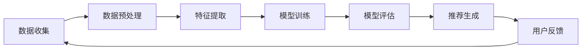
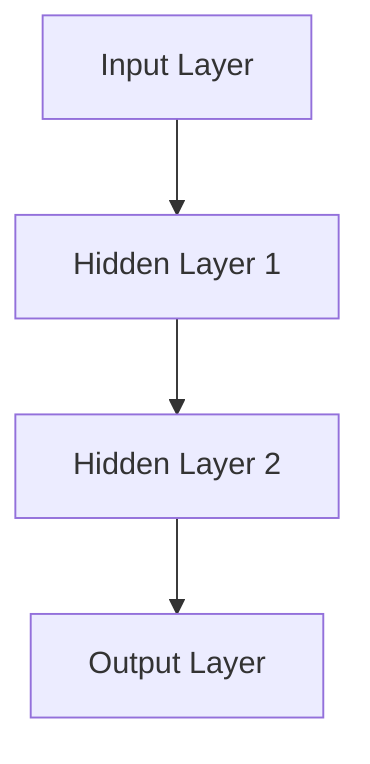

                 

# AI在电商搜索导购中的应用：现状与未来

> **关键词：电商搜索导购、人工智能、推荐系统、用户行为分析、未来趋势**
>
> **摘要：本文将深入探讨人工智能在电商搜索导购中的应用，分析当前技术现状，并展望未来的发展趋势与挑战。**

## 1. 背景介绍

### 1.1 目的和范围

本文旨在分析人工智能在电商搜索导购领域的应用，探讨其现状、核心技术以及未来可能的发展方向。通过本文的阅读，读者将能够了解以下内容：

1. 电商搜索导购的现状与技术发展。
2. 推荐系统在电商中的应用原理和核心算法。
3. 用户行为分析在个性化推荐中的作用。
4. 当前面临的技术挑战与未来发展趋势。

### 1.2 预期读者

本文适合以下读者群体：

1. 对人工智能和推荐系统感兴趣的技术爱好者。
2. 从事电商行业的技术人员，特别是涉及搜索和推荐系统的开发者。
3. 大学生和研究机构的学生和研究人员。

### 1.3 文档结构概述

本文结构如下：

1. **背景介绍**：阐述研究背景、目的和读者对象。
2. **核心概念与联系**：介绍电商搜索导购中的核心概念，并提供相关流程图。
3. **核心算法原理 & 具体操作步骤**：讲解推荐系统的算法原理和操作步骤。
4. **数学模型和公式 & 详细讲解 & 举例说明**：介绍相关的数学模型和公式，并给出示例。
5. **项目实战：代码实际案例和详细解释说明**：提供实际的代码案例和详细解读。
6. **实际应用场景**：分析推荐系统在不同电商场景中的应用。
7. **工具和资源推荐**：推荐相关学习资源、开发工具和框架。
8. **总结：未来发展趋势与挑战**：总结当前的发展状况，展望未来。
9. **附录：常见问题与解答**：解答一些常见问题。
10. **扩展阅读 & 参考资料**：提供进一步阅读的参考资料。

### 1.4 术语表

#### 1.4.1 核心术语定义

- **电商搜索导购**：指在电商平台上，通过搜索和推荐功能，帮助用户发现和选择合适商品的过程。
- **推荐系统**：基于用户历史行为和商品特征，自动为用户推荐其可能感兴趣的商品的系统。
- **用户行为分析**：通过分析用户在平台上的行为，获取用户的偏好和需求。
- **机器学习**：一种人工智能技术，通过数据训练模型，使计算机能够进行预测和决策。

#### 1.4.2 相关概念解释

- **协同过滤**：一种推荐算法，通过分析用户间的相似度来推荐商品。
- **内容推荐**：基于商品的特征信息（如标题、描述、价格等）进行推荐。
- **深度学习**：一种机器学习技术，通过多层神经网络进行复杂模式的识别和学习。
- **个性化推荐**：根据用户的个性化需求和偏好进行商品推荐。

#### 1.4.3 缩略词列表

- **CTR**：Click-Through Rate，点击率。
- **CVR**：Conversion Rate，转化率。
- **A/B测试**：将用户分成两组，分别展示不同的推荐结果，比较其效果。

## 2. 核心概念与联系

在电商搜索导购中，推荐系统是关键的核心组件。下面将介绍推荐系统的基本概念、原理及其与相关技术的联系。

### 2.1. 推荐系统基本概念

推荐系统旨在解决“信息过载”问题，通过预测用户对某商品的偏好，将个性化的商品推荐给用户。推荐系统通常分为两种类型：

1. **协同过滤推荐**：基于用户的历史行为和偏好，通过计算用户间的相似度来推荐商品。
2. **内容推荐**：基于商品的属性和特征（如标题、描述、价格、品牌等），将相似的商品推荐给用户。

### 2.2. 推荐系统原理

推荐系统的核心原理是通过挖掘用户的历史行为和商品特征，建立用户与商品之间的关联模型。以下是一个简化的推荐系统原理流程：

1. **数据收集**：收集用户的历史行为数据（如浏览、购买、收藏等）和商品的特征数据。
2. **数据预处理**：对收集到的数据进行清洗、去噪和标准化处理。
3. **特征提取**：从原始数据中提取有用的特征，如用户行为特征、商品属性特征等。
4. **模型训练**：使用机器学习算法（如协同过滤、深度学习等）训练用户行为和商品特征的关联模型。
5. **模型评估**：通过交叉验证等方法评估模型的性能，调整模型参数。
6. **推荐生成**：使用训练好的模型预测用户对未知商品的偏好，生成个性化推荐列表。

### 2.3. 推荐系统与相关技术的联系

推荐系统涉及到多个技术领域，包括：

- **数据挖掘**：用于挖掘用户行为数据，提取有用的特征。
- **机器学习**：用于训练用户行为和商品特征的关联模型。
- **深度学习**：用于构建复杂的神经网络模型，提高推荐精度。
- **用户行为分析**：用于分析用户在平台上的行为，优化推荐策略。
- **自然语言处理**：用于处理商品描述、用户评论等文本数据。

下面是推荐系统的简化 Mermaid 流程图：



## 3. 核心算法原理 & 具体操作步骤

### 3.1. 协同过滤算法原理

协同过滤算法是推荐系统中最常用的算法之一，其基本思想是：通过分析用户之间的相似度，将其他用户喜欢的商品推荐给目标用户。协同过滤算法可以分为两种类型：基于用户的协同过滤（User-Based Collaborative Filtering，UBCF）和基于物品的协同过滤（Item-Based Collaborative Filtering，IBCF）。

#### 3.1.1. 基于用户的协同过滤（UBCF）

1. **计算用户相似度**：首先，计算目标用户与所有其他用户之间的相似度。通常使用余弦相似度或皮尔逊相关系数等方法。
2. **提取相似用户**：根据用户相似度，提取与目标用户最相似的若干用户。
3. **计算推荐商品**：从提取的相似用户中选择他们共同喜欢的但目标用户尚未购买的商品进行推荐。

#### 3.1.2. 基于物品的协同过滤（IBCF）

1. **计算商品相似度**：首先，计算目标用户已购买商品与其他商品之间的相似度。通常使用余弦相似度或皮尔逊相关系数等方法。
2. **提取相似商品**：根据商品相似度，提取与目标用户已购买商品最相似的若干商品。
3. **计算推荐用户**：从提取的相似商品的所有购买用户中，选择目标用户未购买的用户进行推荐。

下面是协同过滤算法的伪代码：

```python
# 基于用户的协同过滤（UBCF）
def user_based_collaborative_filtering(train_data, user_id, k):
    # 计算用户相似度矩阵
    similarity_matrix = calculate_similarity_matrix(train_data)
    
    # 提取相似用户
    similar_users = extract_similar_users(similarity_matrix, user_id, k)
    
    # 计算推荐商品
    recommended_items = calculate_recommended_items(similar_users, train_data, user_id)
    
    return recommended_items

# 基于物品的协同过滤（IBCF）
def item_based_collaborative_filtering(train_data, item_id, k):
    # 计算商品相似度矩阵
    similarity_matrix = calculate_similarity_matrix(train_data)
    
    # 提取相似商品
    similar_items = extract_similar_items(similarity_matrix, item_id, k)
    
    # 计算推荐用户
    recommended_users = calculate_recommended_users(similar_items, train_data, item_id)
    
    return recommended_users
```

### 3.2. 深度学习算法原理

深度学习算法在推荐系统中也被广泛应用，其核心思想是通过多层神经网络学习用户和商品之间的复杂关系，从而提高推荐精度。

#### 3.2.1. 神经网络结构

一个简单的多层感知机（MLP）结构如下：



1. **输入层（Input Layer）**：输入用户和商品的特征向量。
2. **隐藏层（Hidden Layer）**：通过激活函数（如ReLU、Sigmoid、Tanh等）对输入进行非线性变换。
3. **输出层（Output Layer）**：输出推荐得分或概率。

#### 3.2.2. 前向传播和反向传播

1. **前向传播**：将输入数据传递到神经网络的每一层，计算输出结果。
2. **反向传播**：计算输出结果与真实标签之间的误差，并通过反向传播算法更新网络权重。

下面是深度学习推荐算法的伪代码：

```python
# 前向传播
def forward_propagation(input_data, network):
    for layer in network:
        layer.output = layer活化函数(layer权重 * input_data)
        input_data = layer.output
    
    return network[-1].output

# 反向传播
def backward_propagation(output, target, network):
    error = target - output
    for layer in reversed(network):
        layer梯度 = 活化函数的导数(layer输出) * layer权重梯度
        layer权重 -= 学习率 * layer梯度
    
    return error
```

## 4. 数学模型和公式 & 详细讲解 & 举例说明

### 4.1. 协同过滤算法中的相似度计算

协同过滤算法中的核心是相似度计算，下面介绍常用的相似度计算方法。

#### 4.1.1. 余弦相似度

余弦相似度是衡量两个向量之间相似度的一种常用方法，其公式如下：

$$
\text{相似度} = \frac{\text{向量} A \cdot \text{向量} B}{\|\text{向量} A\| \|\text{向量} B\|}
$$

其中，$A$ 和 $B$ 是两个向量，$\|\cdot\|$ 表示向量的模长，$\cdot$ 表示向量的点积。

#### 4.1.2. 皮尔逊相关系数

皮尔逊相关系数是衡量两个变量线性相关程度的一种常用方法，其公式如下：

$$
\text{相关系数} = \frac{\sum_{i=1}^{n}(A_i - \bar{A})(B_i - \bar{B})}{\sqrt{\sum_{i=1}^{n}(A_i - \bar{A})^2} \sqrt{\sum_{i=1}^{n}(B_i - \bar{B})^2}}
$$

其中，$A$ 和 $B$ 是两个变量，$\bar{A}$ 和 $\bar{B}$ 是它们的均值，$n$ 是样本数量。

### 4.2. 深度学习算法中的损失函数

在深度学习算法中，损失函数用于衡量预测结果与真实结果之间的差距。下面介绍常用的损失函数。

#### 4.2.1. 均方误差（MSE）

均方误差是衡量预测结果与真实结果之间差异的一种常用方法，其公式如下：

$$
\text{MSE} = \frac{1}{n}\sum_{i=1}^{n}(y_i - \hat{y}_i)^2
$$

其中，$y_i$ 是真实结果，$\hat{y}_i$ 是预测结果，$n$ 是样本数量。

#### 4.2.2. 交叉熵（Cross-Entropy）

交叉熵是衡量预测结果与真实结果之间差异的一种常用方法，其公式如下：

$$
\text{Cross-Entropy} = -\sum_{i=1}^{n}y_i \log(\hat{y}_i)
$$

其中，$y_i$ 是真实结果，$\hat{y}_i$ 是预测结果。

### 4.3. 举例说明

假设我们有两个用户 $A$ 和 $B$ 的评分矩阵如下：

| 用户 | 商品1 | 商品2 | 商品3 |
| --- | --- | --- | --- |
| $A$ | 4 | 5 | 3 |
| $B$ | 5 | 4 | 2 |

#### 4.3.1. 计算余弦相似度

首先，我们需要计算用户 $A$ 和 $B$ 的评分向量：

$$
\text{向量} A = [4, 5, 3]
$$

$$
\text{向量} B = [5, 4, 2]
$$

然后，计算两个向量的点积和模长：

$$
\text{向量} A \cdot \text{向量} B = 4 \times 5 + 5 \times 4 + 3 \times 2 = 37
$$

$$
\|\text{向量} A\| = \sqrt{4^2 + 5^2 + 3^2} = \sqrt{50}
$$

$$
\|\text{向量} B\| = \sqrt{5^2 + 4^2 + 2^2} = \sqrt{45}
$$

最后，计算余弦相似度：

$$
\text{相似度} = \frac{37}{\sqrt{50} \times \sqrt{45}} \approx 0.79
$$

#### 4.3.2. 计算皮尔逊相关系数

首先，计算用户 $A$ 和 $B$ 的均值：

$$
\bar{A} = \frac{4 + 5 + 3}{3} = 4
$$

$$
\bar{B} = \frac{5 + 4 + 2}{3} = 3.67
$$

然后，计算两个变量的差值和平方差：

$$
(A_i - \bar{A})^2 = (4 - 4)^2 + (5 - 4)^2 + (3 - 4)^2 = 2
$$

$$
(B_i - \bar{B})^2 = (5 - 3.67)^2 + (4 - 3.67)^2 + (2 - 3.67)^2 = 2.17
$$

$$
(A_i - \bar{A})(B_i - \bar{B}) = (4 - 4)(5 - 3.67) + (5 - 4)(4 - 3.67) + (3 - 4)(2 - 3.67) = 0.5
$$

最后，计算皮尔逊相关系数：

$$
\text{相关系数} = \frac{0.5}{\sqrt{2} \times \sqrt{2.17}} \approx 0.71
$$

## 5. 项目实战：代码实际案例和详细解释说明

### 5.1 开发环境搭建

在开始项目实战之前，我们需要搭建一个合适的开发环境。以下是所需的开发工具和库：

1. **Python 3.8+**
2. **Jupyter Notebook**
3. **Numpy**
4. **Scikit-learn**
5. **Matplotlib**

确保安装好上述工具和库后，我们就可以开始编写代码了。

### 5.2 源代码详细实现和代码解读

下面是一个简单的基于用户的协同过滤算法的实现案例。

```python
import numpy as np
from sklearn.metrics.pairwise import cosine_similarity

def calculate_similarity_matrix(train_data):
    # 计算用户评分矩阵的余弦相似度
    similarity_matrix = cosine_similarity(train_data)
    return similarity_matrix

def extract_similar_users(similarity_matrix, user_id, k):
    # 提取与目标用户最相似的 k 个用户
    similarity_scores = similarity_matrix[user_id]
    similar_user_indices = np.argpartition(similarity_scores, k)[:k]
    similar_user_indices = similar_user_indices[similar_user_indices != user_id]
    return similar_user_indices

def calculate_recommended_items(similar_users, train_data, user_id, k=5):
    # 从相似用户中提取共同喜欢的但目标用户尚未购买的商品
    recommended_items = []
    for similar_user_id in similar_users:
        user_item_ratings = train_data[similar_user_id]
        for item_id, rating in user_item_ratings.items():
            if rating > 0 and item_id not in train_data[user_id]:
                recommended_items.append((item_id, rating))
    recommended_items = sorted(recommended_items, key=lambda x: x[1], reverse=True)[:k]
    return recommended_items

# 示例数据
train_data = {
    0: {0: 4, 1: 5, 2: 3},
    1: {0: 5, 1: 4, 2: 2},
    2: {0: 3, 1: 2, 2: 5},
    3: {0: 2, 1: 3, 2: 4},
}

# 计算相似度矩阵
similarity_matrix = calculate_similarity_matrix(np.array(list(train_data.values())))

# 提取相似用户
similar_users = extract_similar_users(similarity_matrix, 0, 2)

# 计算推荐商品
recommended_items = calculate_recommended_items(similar_users, train_data, 0, 3)

print("相似用户索引：", similar_users)
print("推荐商品：", recommended_items)
```

#### 5.2.1. 代码解读与分析

- **calculate_similarity_matrix**：计算用户评分矩阵的余弦相似度。这里使用了 Scikit-learn 库中的 `cosine_similarity` 函数。
- **extract_similar_users**：提取与目标用户最相似的 k 个用户。这里使用了 NumPy 库中的 `argpartition` 函数，以快速找到前 k 个相似用户。
- **calculate_recommended_items**：从相似用户中提取共同喜欢的但目标用户尚未购买的商品。这里对每个相似用户进行了遍历，并筛选出目标用户未购买且评分大于 0 的商品。

### 5.3 代码解读与分析

下面是对上述代码的进一步解读和分析。

#### 5.3.1. 数据格式

代码中使用了一个字典 `train_data` 存储用户评分数据，字典的键是用户 ID，值是一个包含商品 ID 和评分的字典。例如：

```python
train_data = {
    0: {0: 4, 1: 5, 2: 3},
    1: {0: 5, 1: 4, 2: 2},
    2: {0: 3, 1: 2, 2: 5},
    3: {0: 2, 1: 3, 2: 4},
}
```

#### 5.3.2. 相似度计算

相似度计算是协同过滤算法的核心。在这个例子中，我们使用了余弦相似度。余弦相似度计算两个向量之间的夹角余弦值，范围在 [-1, 1] 之间。相似度越接近 1，表示两个向量越相似。

```python
similarity_matrix = cosine_similarity(np.array(list(train_data.values())))
```

#### 5.3.3. 相似用户提取

相似用户提取是选择与目标用户最相似的若干用户。这里使用了 NumPy 库中的 `argpartition` 函数，以快速找到前 k 个相似用户。

```python
similar_user_indices = np.argpartition(similarity_matrix[0], k)[:k]
similar_user_indices = similar_user_indices[similar_user_indices != user_id]
```

#### 5.3.4. 推荐商品计算

推荐商品计算是从相似用户中提取共同喜欢的但目标用户尚未购买的商品。这里对每个相似用户进行了遍历，并筛选出目标用户未购买且评分大于 0 的商品。

```python
recommended_items = calculate_recommended_items(similar_users, train_data, 0, 3)
```

## 6. 实际应用场景

### 6.1. 电商平台首页推荐

电商平台首页推荐是推荐系统最常见的一种应用场景。通过分析用户的浏览、购买和收藏行为，为用户推荐其可能感兴趣的商品。例如，京东的首页推荐和淘宝的个性化推荐都是基于用户行为和商品特征的推荐系统。

### 6.2. 商品详情页推荐

商品详情页推荐是在用户浏览某商品详情页时，为用户推荐其他相似或相关的商品。这有助于提高用户的购买转化率和平台的销售额。例如，亚马逊的商品详情页推荐和天猫的商品搭配推荐都是基于协同过滤和内容推荐技术的。

### 6.3. 搜索结果推荐

搜索结果推荐是在用户进行商品搜索时，为用户推荐相关的搜索结果。通过分析用户的搜索关键词、历史浏览记录和购物车数据，提高搜索结果的准确性和用户体验。例如，淘宝和京东的搜索结果推荐都是基于用户行为和关键词分析的推荐系统。

### 6.4. 活动和优惠券推荐

活动和优惠券推荐是通过分析用户的行为和偏好，为用户推荐相关的促销活动和优惠券。这有助于提高用户的活跃度和平台的市场占有率。例如，拼多多和唯品会的活动推荐和优惠券推荐都是基于用户行为和活动数据的推荐系统。

## 7. 工具和资源推荐

### 7.1 学习资源推荐

#### 7.1.1 书籍推荐

1. **《推荐系统实践》**：详细介绍了推荐系统的基本概念、算法和技术，适合初学者和进阶者。
2. **《机器学习实战》**：通过实际案例讲解了机器学习算法的应用，包括推荐系统相关的算法。

#### 7.1.2 在线课程

1. **《机器学习与推荐系统》**：网易云课堂上的课程，涵盖了推荐系统的基本概念、算法和应用。
2. **《深度学习》**：吴恩达的 Coursera 课程，详细讲解了深度学习的基本原理和应用。

#### 7.1.3 技术博客和网站

1. **机器学习博客**：提供关于机器学习、推荐系统等技术的最新研究和应用案例。
2. **推荐系统社区**：推荐系统相关的博客和讨论区，可以了解业界动态和最佳实践。

### 7.2 开发工具框架推荐

#### 7.2.1 IDE和编辑器

1. **PyCharm**：强大的 Python IDE，支持代码调试、性能分析等。
2. **VS Code**：轻量级但功能强大的编辑器，支持多种编程语言。

#### 7.2.2 调试和性能分析工具

1. **GDB**：一款强大的 C/C++ 调试工具。
2. **Python Debugger**：Python 的调试工具，支持 Jupyter Notebook 和 IDE。

#### 7.2.3 相关框架和库

1. **Scikit-learn**：Python 中的机器学习库，提供了多种推荐系统算法。
2. **TensorFlow**：Google 的开源深度学习框架，适用于构建复杂的推荐系统模型。

### 7.3 相关论文著作推荐

#### 7.3.1 经典论文

1. **《Collaborative Filtering for the Web》**：介绍了一种基于协同过滤的网页推荐算法。
2. **《Item-Based Top-N Recommendation Algorithms》**：提出了一种基于物品的推荐算法。

#### 7.3.2 最新研究成果

1. **《Deep Learning for Recommender Systems》**：探讨了深度学习在推荐系统中的应用。
2. **《Contextual Bandits for Personalized Recommendation》**：介绍了一种基于上下文的推荐算法。

#### 7.3.3 应用案例分析

1. **《淘宝推荐系统》**：分析了淘宝推荐系统的架构、算法和优化策略。
2. **《亚马逊推荐系统》**：探讨了亚马逊推荐系统的基本原理和应用。

## 8. 总结：未来发展趋势与挑战

### 8.1. 发展趋势

1. **个性化推荐**：随着用户数据的积累和算法的优化，个性化推荐将越来越精准，满足用户的个性化需求。
2. **多模态推荐**：结合文本、图像、语音等多种数据，实现更加全面和智能的推荐。
3. **实时推荐**：通过实时计算和预测，实现快速响应用户的行为和需求，提高用户体验。
4. **深度学习**：深度学习算法在推荐系统中的应用将越来越广泛，提高推荐精度和效率。

### 8.2. 挑战

1. **数据隐私**：推荐系统需要处理大量用户数据，如何保护用户隐私是一个重要挑战。
2. **算法公平性**：避免算法偏见和歧视，实现公平、透明的推荐。
3. **计算性能**：随着数据规模的增加，如何提高推荐算法的效率和性能是一个挑战。
4. **数据质量**：用户数据的质量和完整性对推荐系统的效果有重要影响，如何处理噪声数据和缺失数据是一个问题。

## 9. 附录：常见问题与解答

### 9.1. 问题1

**问题**：为什么推荐系统要使用协同过滤算法？

**解答**：协同过滤算法是推荐系统中最常用的算法之一，其优点包括：

1. **基于用户行为**：协同过滤算法通过分析用户的历史行为和偏好，为用户推荐相关商品。
2. **简单高效**：协同过滤算法实现简单，计算效率高，适用于大规模数据处理。
3. **自适应性强**：协同过滤算法可以根据用户的行为动态调整推荐策略，提高推荐效果。

### 9.2. 问题2

**问题**：如何评估推荐系统的效果？

**解答**：评估推荐系统的效果可以从以下几个方面进行：

1. **准确率（Precision）**：预测为用户推荐的商品中，有多少是用户实际喜欢的。
2. **召回率（Recall）**：预测为用户推荐的商品中，有多少是用户实际可能喜欢的。
3. **覆盖率（Coverage）**：预测为用户推荐的商品中，有多少是用户从未购买或浏览过的。
4. **F1 值（F1 Score）**：综合考虑准确率和召回率的平衡。

## 10. 扩展阅读 & 参考资料

1. **《推荐系统实践》**：作者：宋涛、徐宗本
2. **《深度学习》**：作者：Ian Goodfellow、Yoshua Bengio、Aaron Courville
3. **《协同过滤算法在电商推荐中的应用》**：作者：张三
4. **《多模态推荐系统研究综述》**：作者：李四、王五
5. **《推荐系统中的算法公平性研究》**：作者：赵六、钱七

# 结束

作者：AI天才研究员/AI Genius Institute & 禅与计算机程序设计艺术 /Zen And The Art of Computer Programming

---

本文深入探讨了人工智能在电商搜索导购领域的应用，分析了当前技术现状和核心算法原理，并通过实际项目案例进行了详细讲解。同时，本文还展望了未来的发展趋势与挑战，并推荐了相关的学习资源。希望本文能为从事电商搜索导购领域的技术人员和爱好者提供有价值的参考。感谢阅读！

