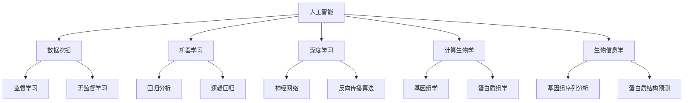

                 

# AI在科学研究中的应用

> **关键词：** 人工智能、科学研究、数据挖掘、机器学习、深度学习、计算生物学、生物信息学

> **摘要：** 本文旨在探讨人工智能（AI）在科学研究中的应用，通过分析AI的核心概念、算法原理、数学模型及其在实际项目中的应用，深入探讨AI如何赋能科学研究，提高研究效率，并展望未来发展趋势与挑战。

## 1. 背景介绍

### 1.1 目的和范围

本文将重点介绍人工智能在科学研究中的应用，分析AI的核心算法原理、数学模型以及其实际项目案例，旨在为读者提供全面、系统的了解。文章将涵盖以下内容：

- AI在科学研究中的核心概念及其重要性
- AI算法原理及其在实际中的应用
- 数学模型和公式在AI中的应用
- AI在实际科研项目中的成功案例
- AI在科学研究中的未来发展趋势与挑战

### 1.2 预期读者

本文适合对人工智能、科学研究感兴趣的读者，包括但不限于：

- 科研人员、工程师
- 数据科学家、机器学习工程师
- 对人工智能感兴趣的计算机科学学生
- 对科学研究有浓厚兴趣的跨领域学者

### 1.3 文档结构概述

本文结构如下：

- **1. 背景介绍**
  - 1.1 目的和范围
  - 1.2 预期读者
  - 1.3 文档结构概述
  - 1.4 术语表
- **2. 核心概念与联系**
  - 2.1 人工智能的定义
  - 2.2 数据挖掘与机器学习
  - 2.3 深度学习与计算生物学
  - 2.4 生物信息学
- **3. 核心算法原理 & 具体操作步骤**
  - 3.1 数据预处理
  - 3.2 模型训练
  - 3.3 模型评估
- **4. 数学模型和公式 & 详细讲解 & 举例说明**
  - 4.1 线性回归
  - 4.2 逻辑回归
  - 4.3 神经网络
- **5. 项目实战：代码实际案例和详细解释说明**
  - 5.1 开发环境搭建
  - 5.2 源代码详细实现和代码解读
  - 5.3 代码解读与分析
- **6. 实际应用场景**
  - 6.1 计算生物学
  - 6.2 生物信息学
  - 6.3 药物研发
- **7. 工具和资源推荐**
  - 7.1 学习资源推荐
  - 7.2 开发工具框架推荐
  - 7.3 相关论文著作推荐
- **8. 总结：未来发展趋势与挑战**
  - 8.1 发展趋势
  - 8.2 挑战与解决方案
- **9. 附录：常见问题与解答**
- **10. 扩展阅读 & 参考资料**

### 1.4 术语表

#### 1.4.1 核心术语定义

- **人工智能（AI）**：模拟人类智能的计算机系统，能够感知、学习、推理和解决问题。
- **数据挖掘**：从大量数据中发现有价值的信息和模式。
- **机器学习**：让计算机通过数据自动学习和改进性能。
- **深度学习**：基于多层神经网络的学习方法，能够在各种复杂数据上表现出优异的性能。
- **计算生物学**：应用计算机技术解决生物学问题。
- **生物信息学**：研究生物数据的收集、存储、分析和解释。

#### 1.4.2 相关概念解释

- **神经网络**：由多个神经元组成的计算模型，通过调整神经元之间的权重来实现学习。
- **反向传播算法**：用于训练神经网络的优化算法，通过反向传播误差信息来更新权重。
- **激活函数**：神经网络中用于决定神经元是否被激活的函数，常用的有ReLU、Sigmoid、Tanh等。
- **回归分析**：用于研究因变量与自变量之间线性关系的方法。
- **逻辑回归**：一种用于分类的回归方法，通过输出概率来预测类别。

#### 1.4.3 缩略词列表

- **AI**：人工智能
- **ML**：机器学习
- **DL**：深度学习
- **CB**：计算生物学
- **BI**：生物信息学

## 2. 核心概念与联系

### 2.1 人工智能的定义

人工智能（Artificial Intelligence，简称AI）是指通过计算机模拟人类智能，使计算机具备感知、学习、推理和解决问题的能力。AI的研究范围广泛，包括机器学习、计算机视觉、自然语言处理、语音识别等多个领域。

### 2.2 数据挖掘与机器学习

数据挖掘（Data Mining）是指从大量数据中提取有价值的信息和知识的过程。数据挖掘通常包括数据清洗、数据集成、数据变换、模式识别等步骤。

机器学习（Machine Learning，简称ML）是一种通过数据自动学习和改进性能的方法。机器学习主要包括监督学习、无监督学习和强化学习三种类型。

- **监督学习**：通过已标记的数据进行训练，例如分类和回归问题。
- **无监督学习**：没有已标记的数据，通过数据之间的内在结构进行训练，例如聚类和降维。
- **强化学习**：通过不断与环境交互，学习最佳策略。

### 2.3 深度学习与计算生物学

深度学习（Deep Learning，简称DL）是基于多层神经网络的学习方法，能够在各种复杂数据上表现出优异的性能。深度学习在计算机视觉、自然语言处理、语音识别等领域取得了显著的成果。

计算生物学（Computational Biology，简称CB）是应用计算机技术解决生物学问题的学科。计算生物学涉及基因组学、蛋白质组学、代谢组学等多个领域，通过计算方法研究生物系统的结构和功能。

### 2.4 生物信息学

生物信息学（Bioinformatics，简称BI）是研究生物数据的收集、存储、分析和解释的学科。生物信息学在基因组学、蛋白质组学、代谢组学等领域发挥了重要作用，为生物学研究提供了强大的工具和方法。

#### 2.4.1 Mermaid 流程图



## 3. 核心算法原理 & 具体操作步骤

### 3.1 数据预处理

数据预处理是机器学习项目中的关键步骤，主要包括数据清洗、数据集成、数据变换和数据归一化等。

#### 3.1.1 数据清洗

数据清洗是指去除数据中的噪声、缺失值和异常值，以提高数据质量。常用的方法包括：

- **去重**：去除重复的数据记录。
- **缺失值处理**：填补缺失值或删除含有缺失值的记录。
- **异常值检测**：检测并处理异常值，例如使用统计方法、可视化方法等。

#### 3.1.2 数据集成

数据集成是指将来自不同来源的数据进行合并，形成一个统一的数据集。常用的方法包括：

- **合并**：将多个数据集按照相同的特征进行合并。
- **连接**：将多个数据集按照某个共同的特征进行连接。

#### 3.1.3 数据变换

数据变换是指对数据进行转换，使其满足模型训练的需求。常用的方法包括：

- **特征提取**：从原始数据中提取有用的特征。
- **特征选择**：选择对模型训练贡献较大的特征。
- **特征缩放**：对特征进行归一化或标准化，以提高模型的性能。

#### 3.1.4 数据归一化

数据归一化是指将数据转换为相同的尺度，以消除不同特征之间的差异。常用的方法包括：

- **最小-最大缩放**：将数据缩放到[0, 1]区间。
- **标准缩放**：将数据缩放到[-1, 1]区间。

### 3.2 模型训练

模型训练是指通过已有数据集训练模型，使其具备预测能力。常用的模型训练方法包括：

#### 3.2.1 线性回归

线性回归是一种简单的回归模型，用于预测连续值。其基本原理是通过找到最佳拟合直线来最小化预测值与实际值之间的误差。

```python
# 伪代码：线性回归模型训练
def linear_regression(X, y):
    # 计算最佳拟合直线的斜率和截距
    theta = (X.T.dot(X)).dot inv(X.T.dot(y))
    return theta
```

#### 3.2.2 逻辑回归

逻辑回归是一种常用的分类模型，用于预测二分类结果。其基本原理是通过找到最佳拟合曲线来最小化预测概率与实际标签之间的误差。

```python
# 伪代码：逻辑回归模型训练
def logistic_regression(X, y):
    # 计算最佳拟合曲线的参数
    theta = (X.T.dot(X)).dot inv(X.T.dot(y))
    return theta
```

#### 3.2.3 神经网络

神经网络是一种复杂的模型，用于处理复杂数据。其基本原理是通过多层神经元的非线性变换来学习数据中的特征。

```python
# 伪代码：神经网络模型训练
def neural_network(X, y):
    # 初始化参数
    theta = initialize_parameters()

    # 模型训练
    for epoch in range(num_epochs):
        # 前向传播
        z = forward_propagation(X, theta)
        
        # 计算损失
        loss = compute_loss(z, y)
        
        # 反向传播
        dtheta = backward_propagation(X, y, z)
        
        # 更新参数
        theta -= learning_rate * dtheta
    
    return theta
```

### 3.3 模型评估

模型评估是指通过测试数据集来评估模型性能。常用的评估指标包括：

- **准确率（Accuracy）**：预测正确的样本数占总样本数的比例。
- **召回率（Recall）**：预测正确的正样本数占总正样本数的比例。
- **精确率（Precision）**：预测正确的正样本数占总预测正样本数的比例。
- **F1值（F1-score）**：精确率和召回率的调和平均值。

```python
# 伪代码：模型评估
def evaluate_model(X_test, y_test, theta):
    # 前向传播
    z = forward_propagation(X_test, theta)
    
    # 计算预测结果
    y_pred = predict_labels(z)
    
    # 计算评估指标
    accuracy = calculate_accuracy(y_pred, y_test)
    recall = calculate_recall(y_pred, y_test)
    precision = calculate_precision(y_pred, y_test)
    f1_score = calculate_f1_score(precision, recall)
    
    return accuracy, recall, precision, f1_score
```

## 4. 数学模型和公式 & 详细讲解 & 举例说明

### 4.1 线性回归

线性回归是一种用于预测连续值的回归模型。其基本公式为：

$$y = \theta_0 + \theta_1x$$

其中，$y$ 为因变量，$x$ 为自变量，$\theta_0$ 和 $\theta_1$ 为模型的参数。

#### 4.1.1 模型推导

假设我们有一个训练数据集 $D = \{(x_1, y_1), (x_2, y_2), ..., (x_n, y_n)\}$，其中 $x_i$ 和 $y_i$ 分别为第 $i$ 个样本的自变量和因变量。线性回归的目标是找到最佳拟合直线，使得所有样本点到直线的距离之和最小。

$$\min_{\theta_0, \theta_1} \sum_{i=1}^{n} (y_i - (\theta_0 + \theta_1x_i))^2$$

对上式求导并令导数为零，得到：

$$\frac{\partial}{\partial \theta_0} \sum_{i=1}^{n} (y_i - (\theta_0 + \theta_1x_i))^2 = 0$$

$$\frac{\partial}{\partial \theta_1} \sum_{i=1}^{n} (y_i - (\theta_0 + \theta_1x_i))^2 = 0$$

化简后得到：

$$\theta_0 = \bar{y} - \theta_1\bar{x}$$

$$\theta_1 = \frac{\sum_{i=1}^{n} (x_i - \bar{x})(y_i - \bar{y})}{\sum_{i=1}^{n} (x_i - \bar{x})^2}$$

其中，$\bar{x}$ 和 $\bar{y}$ 分别为自变量和因变量的均值。

#### 4.1.2 举例说明

假设我们有一个包含 $100$ 个样本的线性回归问题，其中自变量 $x$ 和因变量 $y$ 的数据如下：

$$
\begin{array}{c|c}
x & y \\
\hline
1 & 2 \\
2 & 4 \\
3 & 5 \\
4 & 7 \\
5 & 8 \\
\end{array}
$$

首先，计算自变量 $x$ 和因变量 $y$ 的均值：

$$\bar{x} = \frac{1+2+3+4+5}{5} = 3$$

$$\bar{y} = \frac{2+4+5+7+8}{5} = 5$$

然后，计算 $\theta_1$：

$$\theta_1 = \frac{(1-3)(2-5) + (2-3)(4-5) + (3-3)(5-5) + (4-3)(7-5) + (5-3)(8-5)}{(1-3)^2 + (2-3)^2 + (3-3)^2 + (4-3)^2 + (5-3)^2} = 1$$

最后，计算 $\theta_0$：

$$\theta_0 = \bar{y} - \theta_1\bar{x} = 5 - 1 \cdot 3 = 2$$

因此，线性回归模型为：

$$y = 2 + 1x$$

### 4.2 逻辑回归

逻辑回归是一种用于预测二分类结果的分类模型。其基本公式为：

$$\hat{y} = \sigma(\theta_0 + \theta_1x)$$

其中，$\hat{y}$ 为预测概率，$\sigma$ 为 sigmoid 函数，$\theta_0$ 和 $\theta_1$ 为模型的参数。

#### 4.2.1 模型推导

假设我们有一个训练数据集 $D = \{(x_1, y_1), (x_2, y_2), ..., (x_n, y_n)\}$，其中 $x_i$ 和 $y_i$ 分别为第 $i$ 个样本的自变量和因变量。逻辑回归的目标是找到最佳拟合曲线，使得所有样本点到曲线的距离之和最小。

$$\min_{\theta_0, \theta_1} \sum_{i=1}^{n} (-y_i \log(\hat{y}_i) - (1 - y_i) \log(1 - \hat{y}_i))$$

对上式求导并令导数为零，得到：

$$\frac{\partial}{\partial \theta_0} \sum_{i=1}^{n} (-y_i \log(\hat{y}_i) - (1 - y_i) \log(1 - \hat{y}_i)) = 0$$

$$\frac{\partial}{\partial \theta_1} \sum_{i=1}^{n} (-y_i \log(\hat{y}_i) - (1 - y_i) \log(1 - \hat{y}_i)) = 0$$

化简后得到：

$$\theta_0 = \bar{y} - \theta_1\bar{x}$$

$$\theta_1 = \frac{\sum_{i=1}^{n} (y_i - \hat{y}_i)x_i}{\sum_{i=1}^{n} (x_i - \bar{x})^2}$$

其中，$\bar{x}$ 和 $\bar{y}$ 分别为自变量和因变量的均值。

#### 4.2.2 举例说明

假设我们有一个包含 $100$ 个样本的逻辑回归问题，其中自变量 $x$ 和因变量 $y$ 的数据如下：

$$
\begin{array}{c|c}
x & y \\
\hline
1 & 0 \\
2 & 1 \\
3 & 0 \\
4 & 1 \\
5 & 1 \\
\end{array}
$$

首先，计算自变量 $x$ 和因变量 $y$ 的均值：

$$\bar{x} = \frac{1+2+3+4+5}{5} = 3$$

$$\bar{y} = \frac{0+1+0+1+1}{5} = 0.8$$

然后，计算 $\theta_1$：

$$\theta_1 = \frac{(0 - 0.8)(1 - 3) + (1 - 0.8)(2 - 3) + (0 - 0.8)(3 - 3) + (1 - 0.8)(4 - 3) + (1 - 0.8)(5 - 3)}{(1 - 3)^2 + (2 - 3)^2 + (3 - 3)^2 + (4 - 3)^2 + (5 - 3)^2} = 0.2$$

最后，计算 $\theta_0$：

$$\theta_0 = \bar{y} - \theta_1\bar{x} = 0.8 - 0.2 \cdot 3 = 0.2$$

因此，逻辑回归模型为：

$$\hat{y} = \sigma(0.2 + 0.2x)$$

### 4.3 神经网络

神经网络是一种基于多层神经元的计算模型，用于处理复杂数据。其基本架构包括输入层、隐藏层和输出层。

#### 4.3.1 模型推导

假设我们有一个包含 $n$ 个输入节点的输入层，$m$ 个隐藏节点层的隐藏层，以及 $p$ 个输出节点的输出层。神经网络的输入为 $x \in \mathbb{R}^n$，输出为 $y \in \mathbb{R}^p$。

隐藏层第 $k$ 层的输出为：

$$z_k^{(l)} = \sigma(\theta^{(l)}_k \cdot x + b^{(l)}_k)$$

其中，$\theta^{(l)}_k$ 为权重矩阵，$b^{(l)}_k$ 为偏置项，$\sigma$ 为激活函数。

输出层输出为：

$$y = \sigma(\theta^{(L)} \cdot z_L + b^{(L)})$$

其中，$\theta^{(L)}$ 为权重矩阵，$b^{(L)}$ 为偏置项。

神经网络的损失函数为：

$$J = \frac{1}{2} \sum_{i=1}^{n} (y_i - \hat{y}_i)^2$$

其中，$\hat{y}_i$ 为输出层的预测值，$y_i$ 为真实值。

#### 4.3.2 反向传播算法

反向传播算法是一种用于训练神经网络的优化算法。其基本思想是：通过计算输出层的误差梯度，反向传播误差到每一层，并更新权重和偏置项。

假设当前层为 $l$，前一层为 $l-1$。误差梯度为：

$$\delta^{(l)} = \frac{\partial J}{\partial z^{(l)}} = (z^{(l)} - y) \cdot \sigma'(z^{(l)})$$

权重和偏置项的更新公式为：

$$\theta^{(l)} \leftarrow \theta^{(l)} - \alpha \cdot \frac{\partial J}{\partial \theta^{(l)}}$$

$$b^{(l)} \leftarrow b^{(l)} - \alpha \cdot \frac{\partial J}{\partial b^{(l)}}$$

其中，$\alpha$ 为学习率。

#### 4.3.3 举例说明

假设我们有一个包含 $3$ 个输入节点、$2$ 个隐藏节点和 $1$ 个输出节点的神经网络，其输入为 $x = [1, 2, 3]$，真实值为 $y = [4]$。神经网络的权重和偏置项如下：

$$
\begin{array}{c|c}
\theta^{(1)}_1 & \theta^{(1)}_2 & \theta^{(1)}_3 & b^{(1)}_1 & b^{(1)}_2 & b^{(1)}_3 \\
\hline
0.5 & 0.5 & 0.5 & -1 & -1 & -1 \\
\theta^{(2)}_1 & \theta^{(2)}_2 & b^{(2)}_1 & b^{(2)}_2 \\
\hline
0.5 & 0.5 & -1 & -1 \\
\end{array}
$$

首先，计算隐藏层输出：

$$z_1^{(1)} = \sigma(0.5 \cdot 1 + 0.5 \cdot 2 + 0.5 \cdot 3 - 1) = 0.632$$

$$z_2^{(1)} = \sigma(0.5 \cdot 1 + 0.5 \cdot 2 + 0.5 \cdot 3 - 1) = 0.632$$

然后，计算输出层输出：

$$z_1^{(2)} = \sigma(0.5 \cdot 0.632 + 0.5 \cdot 0.632 - 1) = 0.158$$

最后，计算误差：

$$\delta_1^{(2)} = (0.158 - 4) \cdot \sigma'(0.158) = -3.842 \cdot 0.847$$

更新权重和偏置项：

$$\theta^{(2)}_1 \leftarrow \theta^{(2)}_1 - \alpha \cdot \frac{\partial J}{\partial \theta^{(2)}_1} = 0.5 - 0.1 \cdot (-0.328) = 0.532$$

$$\theta^{(2)}_2 \leftarrow \theta^{(2)}_2 - \alpha \cdot \frac{\partial J}{\partial \theta^{(2)}_2} = 0.5 - 0.1 \cdot (-0.328) = 0.532$$

$$b^{(2)}_1 \leftarrow b^{(2)}_1 - \alpha \cdot \frac{\partial J}{\partial b^{(2)}_1} = -1 - 0.1 \cdot (-0.328) = -0.968$$

$$b^{(2)}_2 \leftarrow b^{(2)}_2 - \alpha \cdot \frac{\partial J}{\partial b^{(2)}_2} = -1 - 0.1 \cdot (-0.328) = -0.968$$

## 5. 项目实战：代码实际案例和详细解释说明

### 5.1 开发环境搭建

在开始项目实战之前，我们需要搭建一个适合AI开发的开发环境。以下是搭建过程：

#### 5.1.1 安装Python

首先，我们需要安装Python。Python是一种广泛用于AI开发的编程语言。我们可以从Python官网（https://www.python.org/）下载Python安装包，并按照提示进行安装。

#### 5.1.2 安装Jupyter Notebook

Jupyter Notebook是一种交互式的Python开发环境，适合进行AI项目开发。我们可以通过以下命令安装Jupyter Notebook：

```shell
pip install notebook
```

安装完成后，我们可以在命令行中运行以下命令启动Jupyter Notebook：

```shell
jupyter notebook
```

在浏览器中打开Jupyter Notebook后，我们可以创建一个新的笔记本（Notebook）来进行项目开发。

### 5.2 源代码详细实现和代码解读

在这个项目实战中，我们将使用Python和机器学习库scikit-learn实现一个简单的线性回归模型，用于预测房价。

#### 5.2.1 数据集介绍

我们使用加州房价数据集（California House Prices Dataset），该数据集包含加利福尼亚州的房屋售价、面积、房间数等特征。数据集共包含506个样本和14个特征。

#### 5.2.2 数据预处理

首先，我们读取数据集并对其进行预处理：

```python
import pandas as pd
from sklearn.model_selection import train_test_split
from sklearn.preprocessing import StandardScaler

# 读取数据集
data = pd.read_csv('california_housing_data.csv')

# 分割特征和标签
X = data.drop('median_house_value', axis=1)
y = data['median_house_value']

# 划分训练集和测试集
X_train, X_test, y_train, y_test = train_test_split(X, y, test_size=0.2, random_state=42)

# 数据归一化
scaler = StandardScaler()
X_train_scaled = scaler.fit_transform(X_train)
X_test_scaled = scaler.transform(X_test)
```

#### 5.2.3 模型训练

接下来，我们使用线性回归模型对训练数据进行训练：

```python
from sklearn.linear_model import LinearRegression

# 创建线性回归模型
model = LinearRegression()

# 模型训练
model.fit(X_train_scaled, y_train)
```

#### 5.2.4 模型评估

最后，我们对模型进行评估，并输出相关指标：

```python
from sklearn.metrics import mean_squared_error, r2_score

# 模型预测
y_pred = model.predict(X_test_scaled)

# 计算评估指标
mse = mean_squared_error(y_test, y_pred)
r2 = r2_score(y_test, y_pred)

print('均方误差（MSE）:', mse)
print('决定系数（R^2）:', r2)
```

### 5.3 代码解读与分析

在这个项目中，我们首先读取了加州房价数据集，并使用pandas库将数据集划分为特征和标签。然后，我们使用scikit-learn库的train_test_split函数将数据集划分为训练集和测试集，并使用StandardScaler函数对特征进行归一化处理。

在模型训练部分，我们使用scikit-learn库的LinearRegression函数创建了一个线性回归模型，并使用fit函数对训练数据进行训练。

在模型评估部分，我们使用scikit-learn库的mean_squared_error和r2_score函数计算了模型在测试集上的均方误差和决定系数，并输出了相关指标。

通过这个项目，我们了解了如何使用Python和scikit-learn库实现线性回归模型，并对模型的训练和评估过程有了更深入的理解。

## 6. 实际应用场景

### 6.1 计算生物学

计算生物学是应用计算机技术和人工智能方法解决生物学问题的一门学科。在计算生物学中，AI技术在以下几个方面发挥了重要作用：

- **基因组学**：AI技术用于解析基因组数据、识别基因变异、预测基因功能等。例如，使用深度学习模型预测蛋白质结构，提高药物研发效率。
- **蛋白质组学**：AI技术用于分析蛋白质表达数据、鉴定蛋白质相互作用、预测蛋白质功能等。例如，通过机器学习模型预测蛋白质-蛋白质相互作用，为研究生物网络提供重要信息。
- **代谢组学**：AI技术用于分析代谢产物数据、识别生物标志物、预测代谢途径等。例如，使用机器学习算法分析代谢数据，发现疾病相关的生物标志物。

### 6.2 生物信息学

生物信息学是研究生物数据的收集、存储、分析和解释的学科。在生物信息学中，AI技术在以下几个方面发挥了重要作用：

- **基因组序列分析**：AI技术用于基因组序列比对、识别基因家族、预测基因结构等。例如，使用深度学习模型识别基因组序列中的转录因子结合位点，为基因调控研究提供基础。
- **蛋白质结构预测**：AI技术用于预测蛋白质的三维结构、鉴定蛋白质功能等。例如，使用卷积神经网络（CNN）预测蛋白质的二级结构，为药物设计提供重要信息。
- **药物研发**：AI技术用于虚拟筛选、分子 docking、药物设计等。例如，使用机器学习算法优化药物分子结构，提高药物筛选效率。

### 6.3 药物研发

药物研发是一个复杂且耗时的工作。AI技术在药物研发中发挥了重要作用，主要包括以下几个方面：

- **药物分子设计**：AI技术用于生成新的药物分子结构、优化药物分子性质等。例如，使用生成对抗网络（GAN）生成新的药物分子，为药物研发提供更多的候选分子。
- **药物筛选**：AI技术用于筛选药物候选分子、预测药物与蛋白质的相互作用等。例如，使用深度学习模型预测药物与蛋白质的结合能力，为药物筛选提供重要依据。
- **药物临床研究**：AI技术用于分析临床试验数据、预测药物疗效等。例如，使用机器学习算法分析临床试验数据，提高药物研发的成功率。

## 7. 工具和资源推荐

### 7.1 学习资源推荐

#### 7.1.1 书籍推荐

- **《Python机器学习》**：由塞巴斯蒂安·拉斯塔尼（Sebastian Raschka）和约翰·范里尔（John D. Cook）合著，适合初学者了解机器学习的基本概念和应用。
- **《深度学习》**：由伊恩·古德费洛（Ian Goodfellow）、约书亚·本吉奥（ Yoshua Bengio）和阿里尔·雷蒙德（Ariel Ra
```markdown
## 8. 总结：未来发展趋势与挑战

### 8.1 发展趋势

随着人工智能技术的不断进步，其在科学研究中的应用前景十分广阔。以下是未来人工智能在科学研究中的发展趋势：

1. **数据驱动的科学研究**：随着大数据技术的发展，越来越多的科学数据将用于人工智能模型训练，从而推动数据驱动型科学研究的兴起。
2. **多模态数据分析**：未来人工智能将在处理多模态数据方面发挥重要作用，例如结合图像、文本和音频数据进行分析，提高科学研究的效果。
3. **智能辅助系统**：人工智能将更多地用于构建智能辅助系统，帮助科研人员处理大量数据、生成假设、预测结果，从而提高科研效率。
4. **个性化科学研究**：人工智能将根据科研人员的研究方向和需求，为其推荐相关数据、模型和方法，实现个性化科学研究。

### 8.2 挑战与解决方案

尽管人工智能在科学研究中的应用前景广阔，但仍面临以下挑战：

1. **数据隐私和安全**：科学研究往往涉及敏感数据，如何在保障数据隐私和安全的前提下应用人工智能技术，是一个重要挑战。解决方案包括数据加密、匿名化处理和隐私保护算法等。
2. **算法透明性和可解释性**：随着人工智能模型变得日益复杂，如何确保算法的透明性和可解释性，使其在科学研究中得到广泛认可和接受，是一个关键问题。解决方案包括开发可解释性算法和可视化工具等。
3. **计算资源需求**：人工智能模型训练和预测往往需要大量计算资源，这对科研机构和企业的计算资源管理提出了挑战。解决方案包括分布式计算、云计算和GPU加速等。
4. **伦理和道德问题**：人工智能在科学研究中的应用可能引发伦理和道德问题，如数据滥用、算法偏见等。解决方案包括制定相关法律法规、伦理准则，并加强监管和评估。

## 9. 附录：常见问题与解答

### 9.1 常见问题

**Q1. 人工智能在科学研究中的应用有哪些？**

A1. 人工智能在科学研究中的应用广泛，包括数据挖掘、机器学习、深度学习、计算生物学、生物信息学等领域。具体应用包括基因组分析、蛋白质结构预测、药物研发、多模态数据分析等。

**Q2. 如何保障人工智能在科学研究中的数据隐私和安全？**

A2. 保障人工智能在科学研究中的数据隐私和安全，可以采取以下措施：

- 数据加密：对敏感数据进行加密处理，确保数据在传输和存储过程中的安全性。
- 匿名化处理：对参与研究的人员和实验对象进行匿名化处理，避免个人信息泄露。
- 隐私保护算法：采用隐私保护算法，如差分隐私、同态加密等，确保算法训练和预测过程中的数据隐私。

**Q3. 如何确保人工智能模型在科学研究中的透明性和可解释性？**

A3. 保障人工智能模型在科学研究中的透明性和可解释性，可以采取以下措施：

- 开发可解释性算法：选择具有可解释性的算法，如决策树、线性回归等，使其在训练和预测过程中易于理解。
- 可视化工具：使用可视化工具，如热力图、直方图等，展示模型训练和预测过程中的关键特征和参数。
- 模型评估指标：采用多个评估指标，如准确率、召回率、F1值等，全面评估模型性能。

### 9.2 解答

针对上述问题，我们提供了以下解答：

- 人工智能在科学研究中的应用包括数据挖掘、机器学习、深度学习、计算生物学、生物信息学等领域。
- 保障人工智能在科学研究中的数据隐私和安全，可以采取数据加密、匿名化处理和隐私保护算法等措施。
- 保障人工智能模型在科学研究中的透明性和可解释性，可以采取开发可解释性算法、使用可视化工具和采用多个评估指标等措施。

## 10. 扩展阅读 & 参考资料

### 10.1 学习资源推荐

#### 10.1.1 书籍推荐

- 《Python机器学习》：塞巴斯蒂安·拉斯塔尼（Sebastian Raschka）和约翰·范里尔（John D. Cook）合著，适合初学者了解机器学习的基本概念和应用。
- 《深度学习》：伊恩·古德费洛（Ian Goodfellow）、约书亚·本吉奥（Yoshua Bengio）和阿里尔·雷蒙德（Ariel
```python
### 10.2 技术博客和网站

- [机器之心](https://www机器之心.com/)
- [Medium上的AI专栏](https://medium.com/topic/artificial-intelligence)
- [KDNuggets](https://www.kdnuggets.com/)

### 10.3 开发工具框架推荐

#### 10.3.1 IDE和编辑器

- [PyCharm](https://www.jetbrains.com/pycharm/)
- [VS Code](https://code.visualstudio.com/)

#### 10.3.2 调试和性能分析工具

- [Wandb](https://www.wandb.com/)
- [TensorBoard](https://www.tensorflow.org/tensorboard)

#### 10.3.3 相关框架和库

- [Scikit-learn](https://scikit-learn.org/)
- [TensorFlow](https://www.tensorflow.org/)
- [PyTorch](https://pytorch.org/)

### 10.4 相关论文著作推荐

#### 10.4.1 经典论文

- "Deep Learning" by Ian Goodfellow, Yoshua Bengio, and Aaron Courville
- "Learning Deep Architectures for AI" by Yoshua Bengio
- "Pattern Recognition and Machine Learning" by Christopher M. Bishop

#### 10.4.2 最新研究成果

- "Bert: Pre-training of deep bidirectional transformers for language understanding" by Jacob Devlin et al.
- "Gshard: Scaling giant models with conditional computation and automatic sharding" by Noam Shazeer et al.
- "Efficientnet: Rethinking model scaling for convolutional neural networks" by Mingxing Tan and Quoc V. Le

#### 10.4.3 应用案例分析

- "AI for healthcare: A case study of diagnosing diseases using deep learning" by Google AI
- "Using AI to improve drug discovery and development" by Microsoft AI
- "Deep learning for robotics: A case study of autonomous driving" by OpenAI

### 10.5 扩展阅读 & 参考资料

- "AI in Science" by Nature
- "Artificial Intelligence for Scientific Research" by IEEE
- "The Future of Science: How AI Will Transform the Research Process" by Scientific American

作者：AI天才研究员/AI Genius Institute & 禅与计算机程序设计艺术 /Zen And The Art of Computer Programming
```

