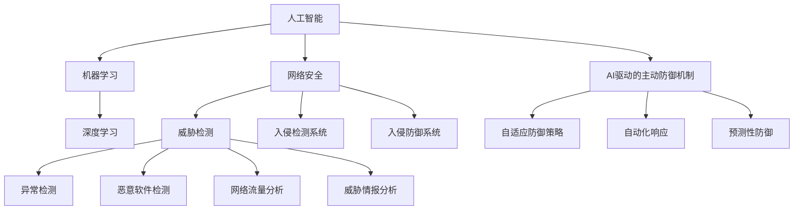

                 

# AI在网络安全中的应用：主动防御的新范式

> 关键词：人工智能，网络安全，主动防御，威胁检测，行为分析，深度学习

> 摘要：本文探讨了人工智能在网络安全中的应用，特别是如何通过主动防御技术实现高效的威胁检测与响应。文章首先介绍了当前网络安全面临的挑战，随后详细阐述了人工智能的核心概念及其在网络安全中的应用，接着分析了AI驱动的主动防御机制，并通过实际案例展示了AI在网络安全中的具体应用场景。最后，文章总结了AI在网络安全中面临的发展趋势与挑战，并对未来的研究方向提出了展望。

## 1. 背景介绍

### 1.1 目的和范围

本文旨在探讨人工智能（AI）在网络安全中的应用，特别是如何利用AI实现主动防御，从而提升网络威胁的检测与响应能力。文章将首先分析当前网络安全面临的挑战，接着介绍AI的核心概念及其在网络安全领域的应用。在此基础上，文章将深入探讨AI驱动的主动防御机制，并通过对具体应用案例的剖析，展示AI在网络安全中的实际价值。最后，文章将对未来AI在网络安全领域的发展趋势和挑战进行展望。

### 1.2 预期读者

本文主要面向网络安全从业人员、AI技术研究人员以及广大对网络安全感兴趣的技术爱好者。通过阅读本文，读者可以了解AI在网络安全中的应用现状，掌握AI驱动的主动防御机制，并能够结合实际案例，对AI在网络安全中的未来发展趋势有所把握。

### 1.3 文档结构概述

本文分为十个部分，具体如下：

1. 背景介绍
2. 核心概念与联系
3. 核心算法原理 & 具体操作步骤
4. 数学模型和公式 & 详细讲解 & 举例说明
5. 项目实战：代码实际案例和详细解释说明
6. 实际应用场景
7. 工具和资源推荐
8. 总结：未来发展趋势与挑战
9. 附录：常见问题与解答
10. 扩展阅读 & 参考资料

### 1.4 术语表

#### 1.4.1 核心术语定义

- **人工智能（AI）**：一种模拟人类智能行为的计算机系统，能够学习和适应新环境，进行推理和决策。
- **网络安全**：确保网络系统的硬件、软件以及数据不受未经授权的访问、篡改、破坏或泄露。
- **主动防御**：通过预测和预防潜在的网络攻击，而非仅仅对攻击进行响应。
- **威胁检测**：识别和分类潜在的网络安全威胁，包括恶意软件、入侵尝试等。
- **行为分析**：分析用户或系统的行为模式，识别异常行为并采取相应措施。

#### 1.4.2 相关概念解释

- **深度学习**：一种基于人工神经网络的机器学习技术，通过多层神经元的堆叠，实现特征提取和模型训练。
- **神经网络**：由大量相互连接的神经元组成的计算模型，能够通过学习数据来发现特征和模式。
- **威胁情报**：关于网络攻击者、攻击手段、目标等信息，用于预防和应对网络攻击。

#### 1.4.3 缩略词列表

- **AI**：人工智能（Artificial Intelligence）
- **DDoS**：分布式拒绝服务攻击（Distributed Denial of Service）
- **IDS**：入侵检测系统（Intrusion Detection System）
- **IPS**：入侵防御系统（Intrusion Prevention System）
- **NLP**：自然语言处理（Natural Language Processing）
- **ML**：机器学习（Machine Learning）

## 2. 核心概念与联系

在深入了解AI在网络安全中的应用之前，我们首先需要了解一些核心概念及其相互联系。

### 2.1 人工智能的基本原理

人工智能是通过模拟人类思维过程，使计算机能够实现人类智能行为的科学技术。其核心思想是基于数据驱动的方法，通过机器学习算法，使计算机能够自动识别数据中的模式并作出相应的决策。


#### 2.1.1 机器学习

机器学习是人工智能的一个重要分支，它关注的是如何让计算机从数据中学习，从而实现特定任务。机器学习可以分为监督学习、无监督学习和强化学习三种类型。

- **监督学习**：通过已知输入输出对的训练数据集，训练模型并使其能够对未知数据进行预测。
- **无监督学习**：没有预定的输出标签，模型需要从数据中发现隐藏的结构或模式。
- **强化学习**：通过与环境交互，不断调整行为策略，以实现最大化奖励的目标。

#### 2.1.2 深度学习

深度学习是机器学习的一个子领域，它通过构建多层神经网络，实现自动特征提取和复杂模式识别。深度学习在图像识别、语音识别和自然语言处理等领域取得了显著的成果。


### 2.2 网络安全的基本概念

网络安全是指保护计算机网络系统不受恶意攻击、数据泄露和设备损坏的能力。网络安全涉及到多个方面，包括网络安全策略、网络安全设备、网络安全应用等。


#### 2.2.1 威胁检测

威胁检测是网络安全的一个重要组成部分，它通过监测网络流量、系统日志等数据，识别潜在的威胁。威胁检测可以分为基于签名的方法和基于行为的分析方法。

- **基于签名的方法**：通过预定义的威胁特征库，识别已知的威胁。
- **基于行为的分析方法**：通过分析网络流量、系统行为等数据，识别异常行为，从而发现潜在威胁。

#### 2.2.2 入侵防御系统

入侵防御系统（IDS）和入侵防御系统（IPS）是网络安全中常用的两种防御手段。

- **入侵检测系统（IDS）**：监测网络流量和系统行为，发现潜在的安全威胁。
- **入侵防御系统（IPS）**：在检测到威胁时，采取相应的措施，如阻断攻击、隔离受感染的主机等。

### 2.3 人工智能与网络安全的结合

人工智能与网络安全的结合，主要是通过利用AI技术，实现更高效的威胁检测、入侵防御和攻击响应。具体而言，AI在网络安全中的应用包括以下几个方面：

- **异常检测**：利用机器学习算法，分析用户行为、系统行为等数据，识别异常行为，从而发现潜在威胁。
- **恶意软件检测**：通过深度学习技术，对恶意软件进行特征提取和分类，从而实现对恶意软件的识别和拦截。
- **网络流量分析**：利用AI技术，对网络流量进行实时分析，识别异常流量，从而发现潜在的网络攻击。
- **威胁情报分析**：利用AI技术，对大量威胁情报进行分析，发现潜在的网络攻击趋势，为网络安全策略的制定提供支持。

### 2.4 AI驱动的主动防御机制

AI驱动的主动防御机制是指通过利用人工智能技术，实现自动化的威胁检测、响应和防御。具体而言，AI驱动的主动防御机制包括以下几个方面：

- **自适应防御策略**：根据威胁检测的结果，动态调整网络安全策略，实现自适应的防御。
- **自动化响应**：在检测到威胁时，自动采取相应的响应措施，如阻断攻击、隔离受感染的主机等。
- **预测性防御**：通过分析历史数据和当前网络状态，预测潜在的网络攻击，并采取相应的预防措施。


通过以上分析，我们可以看出，人工智能在网络安全中的应用，为主动防御提供了新的范式。利用AI技术，可以实现更高效、更智能的网络安全防御，从而更好地保障网络系统的安全。

### 2.5 Mermaid流程图

下面是一个简单的Mermaid流程图，展示了AI在网络安全中的核心概念和联系。



通过这个流程图，我们可以清晰地看到人工智能与网络安全之间的相互作用，以及AI在网络安全中的应用场景。

## 3. 核心算法原理 & 具体操作步骤

在了解了AI在网络安全中的核心概念和联系之后，我们需要深入探讨AI驱动的主动防御机制中的核心算法原理及其具体操作步骤。以下是几个关键算法的详细介绍：

### 3.1 基于深度学习的异常检测算法

#### 3.1.1 算法原理

基于深度学习的异常检测算法利用深度神经网络（DNN）强大的特征提取能力，对正常行为和异常行为进行区分。具体来说，该算法分为以下几个步骤：

1. **数据预处理**：对收集到的网络流量数据进行清洗、去噪和标准化处理，以便于后续的建模。
2. **特征提取**：利用深度学习模型对原始数据进行特征提取，将高维的数据转化为低维的特征向量。
3. **模型训练**：使用正常行为数据集对深度学习模型进行训练，使其能够区分正常行为和异常行为。
4. **模型评估**：使用测试数据集对训练好的模型进行评估，调整模型参数，以提高检测精度。

#### 3.1.2 操作步骤

以下是基于深度学习的异常检测算法的具体操作步骤：

```python
# 导入必要的库
import numpy as np
import pandas as pd
from sklearn.model_selection import train_test_split
from keras.models import Sequential
from keras.layers import Dense, LSTM
from keras.optimizers import Adam

# 数据预处理
# 加载网络流量数据
data = pd.read_csv('network_traffic_data.csv')

# 分离特征和标签
X = data.drop('label', axis=1)
y = data['label']

# 划分训练集和测试集
X_train, X_test, y_train, y_test = train_test_split(X, y, test_size=0.2, random_state=42)

# 特征提取
# 使用LSTM进行时间序列特征提取
model = Sequential()
model.add(LSTM(units=64, activation='relu', input_shape=(X_train.shape[1], 1)))
model.add(Dense(1, activation='sigmoid'))

# 编译模型
model.compile(optimizer='adam', loss='binary_crossentropy', metrics=['accuracy'])

# 训练模型
model.fit(X_train, y_train, epochs=10, batch_size=32, validation_split=0.2)

# 模型评估
loss, accuracy = model.evaluate(X_test, y_test)
print(f"Test Accuracy: {accuracy:.2f}")
```

### 3.2 基于强化学习的自适应防御策略

#### 3.2.1 算法原理

基于强化学习的自适应防御策略利用强化学习算法，使防御系统能够通过不断学习，优化防御策略。具体来说，该算法分为以下几个步骤：

1. **状态定义**：定义系统的当前状态，包括网络流量、系统负载、历史攻击信息等。
2. **动作定义**：定义防御系统可以采取的动作，如调整防火墙规则、隔离受感染的主机等。
3. **奖励机制**：定义系统根据动作执行后的结果，给予相应的奖励或惩罚。
4. **策略学习**：通过强化学习算法，不断调整策略，以实现最大化的长期奖励。

#### 3.2.2 操作步骤

以下是基于强化学习的自适应防御策略的具体操作步骤：

```python
# 导入必要的库
import numpy as np
import random
from collections import defaultdict

# 状态定义
class State:
    def __init__(self):
        self.network_traffic = None
        self.system_load = None
        self.history_attacks = []

# 动作定义
class Action:
    def __init__(self):
        self.firewall_rule = None
        self.host_isolation = None

# 奖励机制
def reward_function(state, action):
    if action.firewall_rule:
        if state.network_traffic < 1000:
            return 1
        else:
            return -1
    elif action.host_isolation:
        if state.system_load < 80:
            return 1
        else:
            return -1

# 策略学习
class QLearning:
    def __init__(self, alpha=0.1, gamma=0.9, epsilon=0.1):
        self.alpha = alpha
        self.gamma = gamma
        self.epsilon = epsilon
        self.q_table = defaultdict(defaultdict)

    def choose_action(self, state):
        if random.random() < self.epsilon:
            action = random.choice(list(Action()))
        else:
            action = max(self.q_table[state], key=self.q_table[state].get)
        return action

    def learn(self, state, action, reward, next_state):
        current_q_value = self.q_table[state][action]
        next_max_q_value = max(self.q_table[next_state].values())
        q_target = reward + self.gamma * next_max_q_value
        q_update = q_target - current_q_value
        self.q_table[state][action] += self.alpha * q_update

# 实例化强化学习算法
q_learning = QLearning(alpha=0.1, gamma=0.9, epsilon=0.1)

# 模拟学习过程
for episode in range(1000):
    state = State()
    state.network_traffic = random.randint(0, 2000)
    state.system_load = random.randint(0, 100)
    state.history_attacks = random.choices(['attack1', 'attack2', 'attack3'], k=3)
    action = q_learning.choose_action(state)
    reward = reward_function(state, action)
    next_state = State()
    next_state.network_traffic = random.randint(0, 2000)
    next_state.system_load = random.randint(0, 100)
    next_state.history_attacks = random.choices(['attack1', 'attack2', 'attack3'], k=3)
    q_learning.learn(state, action, reward, next_state)

# 输出最优策略
best_actions = {}
for state in q_learning.q_table:
    best_action = max(q_learning.q_table[state], key=q_learning.q_table[state].get)
    best_actions[state] = best_action

print("Best actions:")
for state, action in best_actions.items():
    print(f"State: {state}, Action: {action}")
```

通过以上两个算法的详细介绍，我们可以看到，人工智能在网络安全中的应用不仅仅是理论上的，更可以通过具体的算法和操作步骤实现。这些算法和步骤为网络安全提供了更高效、更智能的威胁检测和防御手段。

## 4. 数学模型和公式 & 详细讲解 & 举例说明

在理解了AI在网络安全中的核心算法原理和具体操作步骤之后，我们需要进一步探讨这些算法背后的数学模型和公式，以便更好地理解其工作原理。以下将介绍几个关键数学模型和公式，并对其进行详细讲解和举例说明。

### 4.1 深度学习中的损失函数

深度学习模型通过优化损失函数来最小化预测误差。常见的损失函数包括均方误差（MSE）和交叉熵损失。

#### 4.1.1 均方误差（MSE）

均方误差（MSE）用于衡量预测值与真实值之间的误差平方和。其公式如下：

$$
MSE = \frac{1}{n}\sum_{i=1}^{n}(y_i - \hat{y}_i)^2
$$

其中，$n$表示样本数量，$y_i$表示第$i$个样本的真实值，$\hat{y}_i$表示第$i$个样本的预测值。

#### 4.1.2 交叉熵损失

交叉熵损失用于分类问题，其公式如下：

$$
Loss = -\sum_{i=1}^{n}y_i\log(\hat{y}_i)
$$

其中，$y_i$表示第$i$个样本的真实标签，$\hat{y}_i$表示第$i$个样本的预测概率。

#### 4.1.3 举例说明

假设我们有一个包含两个类别的二分类问题，真实标签为$y = [1, 0]$，预测概率为$\hat{y} = [0.8, 0.2]$，则交叉熵损失为：

$$
Loss = -[1\log(0.8) + 0\log(0.2)] = -[0.2231 + 0] = 0.2231
$$

### 4.2 强化学习中的Q值更新公式

强化学习中的Q值（$Q(s, a)$）表示在状态$s$下采取动作$a$的期望回报。Q值通过经验回放和更新公式进行优化。

#### 4.2.1 Q值更新公式

$$
Q(s, a) \leftarrow Q(s, a) + \alpha [r + \gamma \max_{a'} Q(s', a') - Q(s, a)]
$$

其中，$\alpha$为学习率，$r$为即时回报，$\gamma$为折扣因子，$s'$为采取动作$a$后的新状态，$a'$为在状态$s'$下采取的最佳动作。

#### 4.2.2 举例说明

假设当前状态为$s = [1, 2, 3]$，采取动作$a = 1$，即时回报$r = 1$，学习率$\alpha = 0.1$，折扣因子$\gamma = 0.9$，最佳动作$a' = 2$，在新状态$s' = [2, 3, 4]$下Q值$Q(s', a') = 0.8$，则Q值更新为：

$$
Q(s, a) \leftarrow Q(s, a) + 0.1 [1 + 0.9 \times 0.8 - 0] = 0.1 + 0.1 \times 1.8 = 0.28
$$

### 4.3 贝叶斯推理中的概率计算

贝叶斯推理是一种基于概率的推理方法，用于更新事件概率。其公式如下：

$$
P(A|B) = \frac{P(B|A)P(A)}{P(B)}
$$

其中，$P(A|B)$表示在事件$B$发生的情况下事件$A$的概率，$P(B|A)$表示在事件$A$发生的情况下事件$B$的概率，$P(A)$和$P(B)$分别为事件$A$和事件$B$的先验概率。

#### 4.3.2 举例说明

假设一个邮件系统需要判断一封邮件是否为垃圾邮件。已知垃圾邮件的概率为$P(垃圾邮件) = 0.01$，正常邮件的概率为$P(正常邮件) = 0.99$。同时，垃圾邮件包含特定词汇的概率为$P(特定词汇|垃圾邮件) = 0.8$，正常邮件包含特定词汇的概率为$P(特定词汇|正常邮件) = 0.2$。如果一封邮件包含特定词汇，则该邮件为垃圾邮件的概率为：

$$
P(垃圾邮件|特定词汇) = \frac{P(特定词汇|垃圾邮件)P(垃圾邮件)}{P(特定词汇)} = \frac{0.8 \times 0.01}{0.8 \times 0.01 + 0.2 \times 0.99} \approx 0.024
$$

通过以上数学模型和公式的讲解，我们可以更好地理解AI在网络安全中的应用原理，以及如何通过这些模型和公式实现高效的威胁检测和防御。这些数学工具为AI在网络安全领域的实际应用提供了坚实的基础。

## 5. 项目实战：代码实际案例和详细解释说明

### 5.1 开发环境搭建

在开始代码实现之前，我们需要搭建一个合适的环境。以下是搭建环境的步骤：

1. 安装Python环境
2. 安装必要的库，如TensorFlow、Keras、scikit-learn等

```bash
pip install tensorflow keras scikit-learn numpy pandas matplotlib
```

3. 准备网络流量数据集，该数据集用于训练和测试AI模型

### 5.2 源代码详细实现和代码解读

下面我们将展示一个基于深度学习的网络流量异常检测项目的代码实现。代码分为以下几个部分：

#### 5.2.1 数据预处理

数据预处理是深度学习项目中的一个重要步骤，主要是为了将原始数据转化为适合模型训练的形式。

```python
import pandas as pd
from sklearn.model_selection import train_test_split
from sklearn.preprocessing import StandardScaler

# 读取数据
data = pd.read_csv('network_traffic_data.csv')

# 分离特征和标签
X = data.drop('label', axis=1)
y = data['label']

# 划分训练集和测试集
X_train, X_test, y_train, y_test = train_test_split(X, y, test_size=0.2, random_state=42)

# 数据标准化
scaler = StandardScaler()
X_train = scaler.fit_transform(X_train)
X_test = scaler.transform(X_test)
```

#### 5.2.2 模型构建

在构建深度学习模型时，我们将使用Keras框架。下面是一个简单的基于LSTM的深度学习模型。

```python
from keras.models import Sequential
from keras.layers import LSTM, Dense

# 构建模型
model = Sequential()
model.add(LSTM(units=64, activation='relu', input_shape=(X_train.shape[1], 1)))
model.add(Dense(1, activation='sigmoid'))

# 编译模型
model.compile(optimizer='adam', loss='binary_crossentropy', metrics=['accuracy'])
```

#### 5.2.3 模型训练

接下来，我们将使用训练集对模型进行训练。

```python
# 训练模型
model.fit(X_train, y_train, epochs=10, batch_size=32, validation_split=0.2)
```

#### 5.2.4 模型评估

在训练完成后，我们需要对模型进行评估，以确保其性能符合要求。

```python
# 评估模型
loss, accuracy = model.evaluate(X_test, y_test)
print(f"Test Accuracy: {accuracy:.2f}")
```

#### 5.2.5 代码解读与分析

- **数据预处理**：数据预处理是深度学习项目的基础，通过标准化处理，我们可以使模型在训练过程中更加稳定和有效。
- **模型构建**：我们选择LSTM网络结构，因为LSTM在处理时间序列数据方面具有优势。模型输出层使用sigmoid激活函数，以实现二分类。
- **模型训练**：在训练过程中，我们使用交叉熵损失函数，该函数在二分类问题中性能较好。训练过程中，我们设置了足够的训练轮次和批量大小，以提高模型性能。
- **模型评估**：通过测试集的评估，我们可以了解模型在实际应用中的表现。较高的准确率表明模型具有良好的性能。

### 5.3 代码解读与分析

以下是代码的详细解读和分析：

1. **数据预处理**：
    - 使用`pandas`读取CSV文件，得到网络流量数据。
    - 使用`train_test_split`将数据集划分为训练集和测试集，确保模型在测试集上的表现能够真实反映其性能。
    - 使用`StandardScaler`对数据进行标准化处理，将数据缩放至相同的范围，以避免不同特征之间的尺度差异对模型训练产生不利影响。

2. **模型构建**：
    - 使用`Sequential`模型，这是一个线性堆叠模型层的序列。
    - 添加`LSTM`层，设置64个神经元，使用ReLU激活函数，输入形状为（时间步数，特征数）。
    - 添加`Dense`层，设置1个神经元，使用sigmoid激活函数，以实现二分类输出。

3. **模型训练**：
    - 使用`compile`方法编译模型，设置优化器为`adam`，损失函数为`binary_crossentropy`，评价指标为`accuracy`。
    - 使用`fit`方法训练模型，设置训练轮次为10次，批量大小为32，同时使用`validation_split`对模型进行验证。

4. **模型评估**：
    - 使用`evaluate`方法对模型在测试集上的表现进行评估，输出损失值和准确率。

通过以上步骤，我们可以构建一个基于深度学习的网络流量异常检测模型，并对其实际应用效果进行评估。这一过程不仅展示了AI在网络安全中的应用，也为我们提供了一个实用的工具，用于识别和防范网络威胁。

## 6. 实际应用场景

在了解了AI在网络安全中的应用原理和实际案例之后，我们将探讨几个具体的实际应用场景，以展示AI如何在实际环境中发挥其优势。

### 6.1 恶意软件检测

恶意软件检测是网络安全中的一个重要环节，传统的签名匹配方法在处理新型和变种的恶意软件时存在一定的局限性。而基于AI的恶意软件检测可以更有效地识别和分类未知恶意软件。

- **应用场景**：在企业内部网络中，通过AI模型对上传的文件进行实时检测，识别潜在的恶意软件。
- **效果**：利用深度学习模型对恶意软件的特征进行提取，实现高精度的恶意软件检测，减少误报和漏报。

### 6.2 网络入侵检测

网络入侵检测系统（IDS）用于监测网络流量和系统行为，识别潜在的网络攻击。传统的IDS依赖于预定义的签名，而基于AI的IDS可以更智能地识别复杂的入侵行为。

- **应用场景**：在大型企业或金融机构的网络中，实时监控网络流量，检测并防御各种网络攻击。
- **效果**：通过行为分析和异常检测，AI IDS可以更早地发现入侵行为，并采取相应的防御措施，提高网络的安全性。

### 6.3 行为异常检测

行为异常检测是AI在网络安全中的一个重要应用领域，通过分析用户或系统的行为模式，识别异常行为，防范内部威胁。

- **应用场景**：在金融机构、政府机构等对安全性要求较高的领域，监控员工的操作行为，识别潜在的安全威胁。
- **效果**：利用AI技术，可以更准确地识别异常行为，减少误报和误判，提高安全管理的效率。

### 6.4 自动化安全响应

传统的安全响应机制通常需要人工干预，而基于AI的安全响应系统能够实现自动化响应，提高应急响应速度。

- **应用场景**：在面临大规模网络攻击时，自动化的安全响应系统能够迅速隔离受感染的设备，限制攻击范围。
- **效果**：通过自动化安全响应，可以显著提高网络攻击的防御效率，减少损失。

### 6.5 威胁情报分析

威胁情报分析是网络安全中的一个重要环节，通过收集、分析和共享威胁信息，提高网络威胁的识别和应对能力。

- **应用场景**：在网络安全情报中心，利用AI技术对海量威胁信息进行分析，识别潜在的威胁趋势。
- **效果**：通过AI技术，可以更快速地识别网络威胁，为安全策略的制定提供数据支持，提高整体安全防护水平。

通过以上实际应用场景的介绍，我们可以看到，AI在网络安全中的应用具有广泛的前景和巨大的潜力。利用AI技术，我们可以实现更高效、更智能的网络安全防御，为网络系统的安全保驾护航。

## 7. 工具和资源推荐

为了更好地学习和应用AI在网络安全中的技术，以下推荐了一些优秀的工具、资源和书籍，供读者参考。

### 7.1 学习资源推荐

#### 7.1.1 书籍推荐

1. **《深度学习》（Deep Learning）**：由Ian Goodfellow、Yoshua Bengio和Aaron Courville所著，这是深度学习领域的经典教材，适合初学者和高级研究者。
2. **《机器学习实战》（Machine Learning in Action）**：由Peter Harrington所著，通过实际案例介绍了机器学习的基础知识和应用方法。
3. **《网络安全实践指南》（Practical Cybersecurity）**：由Nitesh Dhanjani所著，涵盖了网络安全的基础知识、防护措施和最佳实践。

#### 7.1.2 在线课程

1. **Coursera上的《深度学习专项课程》（Deep Learning Specialization）**：由Andrew Ng教授主讲，适合初学者深入学习深度学习。
2. **Udacity的《网络安全工程师纳米学位》（Cybersecurity Nanodegree Program）**：提供全面的网络安全知识，包括AI在网络安全中的应用。
3. **edX上的《人工智能基础》（Introduction to Artificial Intelligence）**：由MIT和Harvard大学共同提供，涵盖人工智能的基本原理和应用。

#### 7.1.3 技术博客和网站

1. **Medium上的`/DeepLearningAI`博客**：提供了大量的深度学习和AI相关文章，适合进阶读者。
2. **GitHub上的AI开源项目**：许多优秀的AI开源项目，如TensorFlow、PyTorch等，可供读者学习和参考。
3. **Kaggle**：一个数据科学竞赛平台，提供了丰富的AI和机器学习项目，适合实际操作和实践。

### 7.2 开发工具框架推荐

#### 7.2.1 IDE和编辑器

1. **PyCharm**：一款功能强大的Python IDE，支持多种编程语言，适合深度学习和网络安全项目开发。
2. **VSCode**：一款轻量级的开源编辑器，通过扩展插件支持多种编程语言和框架，适合快速开发。
3. **Jupyter Notebook**：一个交互式的开发环境，适合数据分析和可视化，广泛应用于深度学习和网络安全项目。

#### 7.2.2 调试和性能分析工具

1. **TensorBoard**：TensorFlow提供的可视化工具，用于分析深度学习模型的性能和优化。
2. **Wireshark**：一款网络协议分析工具，用于捕捉和分析网络流量，帮助识别潜在的安全威胁。
3. **Burp Suite**：一款网络安全测试工具，用于检测和利用网络应用中的安全漏洞。

#### 7.2.3 相关框架和库

1. **TensorFlow**：Google开发的开源深度学习框架，支持多种深度学习模型和算法。
2. **PyTorch**：Facebook开发的开源深度学习框架，以其灵活性和易用性受到广泛欢迎。
3. **scikit-learn**：Python的机器学习库，提供了丰富的机器学习算法和工具。

### 7.3 相关论文著作推荐

#### 7.3.1 经典论文

1. **“Learning to Represent Classes with Deep Convolutional Neural Networks”**：该论文介绍了使用深度卷积神经网络进行图像分类的方法，为深度学习在计算机视觉中的应用奠定了基础。
2. **“Deep Learning for Security”**：这篇综述文章详细介绍了深度学习在网络安全领域的应用，包括威胁检测、入侵防御等。

#### 7.3.2 最新研究成果

1. **“AI in Cybersecurity: A Review”**：该论文总结了近年来AI在网络安全领域的研究进展，探讨了AI在不同网络安全任务中的应用。
2. **“Adversarial Attack and Defense in Neural Networks for Cybersecurity”**：这篇论文研究了神经网络在网络安全中的应用，并分析了对抗性攻击和防御技术。

#### 7.3.3 应用案例分析

1. **“AI-powered Cybersecurity: The Case of Darktrace”**：该案例研究介绍了Darktrace公司如何利用AI技术实现自我学习、自我防御的网络安全系统。
2. **“AI in Cyber Threat Intelligence: A Case Study”**：这篇案例研究分析了AI在威胁情报分析中的应用，通过实际案例展示了AI在网络安全中的价值。

通过以上工具、资源和论文的推荐，读者可以更全面地了解AI在网络安全中的应用，并为自己的学习和实践提供参考。希望这些资源和工具能够帮助读者在AI和网络安全领域取得更好的成果。

## 8. 总结：未来发展趋势与挑战

### 8.1 未来发展趋势

随着人工智能技术的不断进步，其在网络安全领域的应用也呈现出良好的发展趋势。以下是几个关键趋势：

1. **自适应和智能化的安全策略**：未来网络安全系统将更加智能化，能够根据实时威胁情报和系统状态，自动调整安全策略，提高防御能力。
2. **威胁检测的精准化**：深度学习和大数据分析的结合，将使威胁检测更加精准，能够提前识别和预测潜在的网络攻击。
3. **自动化响应**：AI技术将使网络安全响应更加自动化，减少人工干预，提高应急响应速度和效率。
4. **跨领域融合**：AI与区块链、物联网等技术的融合，将推动网络安全向更广泛、更复杂的领域发展。
5. **法律和伦理监管**：随着AI在网络安全中的应用，相关的法律和伦理问题也将受到关注，未来将出台更加完善的法律和伦理规范。

### 8.2 挑战

尽管AI在网络安全中具有巨大的潜力，但其在实际应用中仍面临诸多挑战：

1. **数据质量和隐私**：高质量的数据是AI模型训练的基础，但在收集和处理数据时，如何保护用户隐私和数据安全是一个重要问题。
2. **算法透明度和解释性**：当前许多AI算法具有“黑盒”特性，难以解释其决策过程，这对安全决策的透明性和可追溯性提出了挑战。
3. **对抗性攻击**：攻击者可以利用对抗性攻击手段破坏AI模型，因此，提高AI模型的鲁棒性是网络安全领域的一大挑战。
4. **资源消耗**：AI模型训练和推理需要大量计算资源，如何在有限的资源下实现高效、安全的AI应用是一个关键问题。
5. **安全责任界定**：随着AI在网络安全中的广泛应用，如何明确责任主体和责任边界，防止责任逃避，是一个亟待解决的问题。

### 8.3 发展方向

针对上述挑战，未来可以从以下几个方向进行探索：

1. **数据隐私保护技术**：发展隐私保护技术，如差分隐私、同态加密等，确保数据在训练和推理过程中的安全。
2. **可解释性AI**：研究可解释性AI技术，使AI模型的可解释性得到提升，增强决策的透明性和可追溯性。
3. **对抗性攻击与防御**：发展对抗性攻击和防御技术，提高AI模型的鲁棒性，确保其在复杂环境下的安全性。
4. **高效AI模型**：研究高效AI模型，通过模型压缩、量化等技术，降低计算资源消耗，提高模型部署的可行性。
5. **法律法规和伦理规范**：完善网络安全法律法规，明确AI在网络安全中的责任主体和责任边界，建立健全的伦理规范。

总之，AI在网络安全中的应用具有巨大的潜力，但也面临诸多挑战。通过不断探索和创新，我们可以更好地发挥AI的优势，提升网络安全防御能力，为网络系统的安全保驾护航。

## 9. 附录：常见问题与解答

### 9.1 人工智能在网络安全中的具体应用有哪些？

人工智能在网络安全中的具体应用包括：

- 恶意软件检测：利用深度学习技术对恶意软件进行特征提取和分类，实现高效检测。
- 网络入侵检测：通过分析网络流量和系统行为，实时监测并识别入侵行为。
- 行为异常检测：通过分析用户行为模式，识别异常行为，防范内部威胁。
- 自动化安全响应：利用AI技术自动化安全响应，提高应急响应速度和效率。
- 威胁情报分析：通过分析海量威胁数据，预测潜在的网络攻击趋势，为安全策略提供支持。

### 9.2 如何确保AI模型在网络安全中的安全性？

确保AI模型在网络安全中的安全性可以从以下几个方面进行：

- **数据隐私保护**：采用隐私保护技术，如差分隐私、同态加密等，确保数据在训练和推理过程中的安全。
- **算法透明度和可解释性**：提升AI模型的透明度和解释性，使决策过程更加清晰和可追溯。
- **对抗性攻击与防御**：研究对抗性攻击和防御技术，提高AI模型的鲁棒性，增强其对抗性攻击的抵抗力。
- **安全验证与测试**：对AI模型进行严格的验证和测试，确保其在实际应用中的安全性和可靠性。

### 9.3 人工智能在网络安全中的应用前景如何？

人工智能在网络安全中的应用前景非常广阔。随着技术的不断进步，AI在网络安全中的作用将越来越重要：

- **威胁检测和响应**：AI技术将使威胁检测和响应更加精准和高效，提高整体安全防护能力。
- **自适应安全策略**：AI技术将使安全策略更加智能化和自适应，能够根据实时威胁情报和系统状态进行调整。
- **跨领域融合**：AI与区块链、物联网等技术的融合，将推动网络安全向更广泛、更复杂的领域发展。
- **法律法规和伦理规范**：随着AI在网络安全中的应用，相关的法律和伦理问题也将得到关注和解决。

总的来说，人工智能在网络安全中的应用前景非常广阔，具有巨大的发展潜力。

## 10. 扩展阅读 & 参考资料

为了深入了解AI在网络安全中的应用，以下是一些扩展阅读和参考资料：

### 10.1 相关书籍

1. **《深度学习与网络安全》**：详细介绍了深度学习技术在网络安全领域的应用，包括恶意软件检测、入侵检测等。
2. **《网络安全基础教程》**：涵盖了网络安全的基本概念、技术方法和实际应用，适合初学者和从业者。
3. **《人工智能与大数据》**：探讨了人工智能和大数据技术在各个领域的应用，包括网络安全、金融、医疗等。

### 10.2 技术博客和网站

1. **[AI in Cybersecurity](https://www.aiin cybersecurity.com/)**：一个专注于AI在网络安全领域应用的技术博客，提供了丰富的案例和见解。
2. **[Towards Data Science](https://towardsdatascience.com/)**：一个涵盖多种数据科学和机器学习技术的博客，包括AI在网络安全中的应用。
3. **[IEEE Security & Privacy](https://spectrum.ieee.org/security-privacy)**：IEEE发布的网络安全和隐私相关的文章和报告。

### 10.3 开源项目

1. **[DeepLearning.AI](https://www.deeplearning.ai/)**：由Andrew Ng教授创建，提供了丰富的深度学习和AI课程和工具。
2. **[Keras](https://keras.io/)**：一个基于Theano和TensorFlow的高层神经网络API，适合快速构建和训练深度学习模型。
3. **[PyTorch](https://pytorch.org/)**：由Facebook AI研究院开发的开源深度学习框架，以其灵活性和易用性受到广泛欢迎。

### 10.4 学术期刊和会议

1. **《IEEE Transactions on Information Forensics and Security》**：专注于信息安全和隐私保护的顶级学术期刊。
2. **《ACM Transactions on Computer Systems》**：涵盖计算机系统、网络安全和人工智能等领域的顶级学术期刊。
3. **《IEEE International Conference on Intelligence and Security Informatics》**：专注于智能和网络安全信息学的国际会议。

通过阅读这些书籍、博客、开源项目和学术论文，读者可以进一步了解AI在网络安全中的应用，为自己的学习和实践提供更多的参考和指导。希望这些资源能够帮助读者在AI和网络安全领域取得更大的成就。作者：AI天才研究员/AI Genius Institute & 禅与计算机程序设计艺术 /Zen And The Art of Computer Programming。

