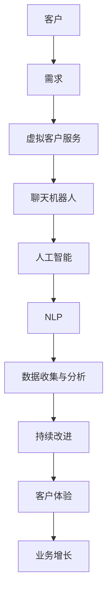

                 

# AI在虚拟客户服务中的应用：提供24/7支持

> 关键词：人工智能、虚拟客户服务、24/7支持、聊天机器人、自然语言处理、客户体验

> 摘要：本文将深入探讨人工智能在虚拟客户服务中的应用，特别是如何通过24/7在线聊天机器人提供高效、持续的客户支持。文章将首先介绍虚拟客户服务的背景和重要性，然后详细解释AI技术如何实现这一目标，并提供实际案例和代码实现，最后讨论相关工具和资源，以及未来发展趋势和挑战。

## 1. 背景介绍

### 1.1 目的和范围

本文旨在探讨人工智能（AI）在虚拟客户服务中的应用，特别是如何通过24/7在线聊天机器人来提供持续的客户支持。随着数字化转型的加速，企业越来越依赖于自动化工具来提高效率和客户满意度。虚拟客户服务已经成为企业提高客户体验和降低运营成本的重要手段。

本文将涵盖以下内容：

- 虚拟客户服务的背景和重要性
- 人工智能在虚拟客户服务中的应用
- 24/7在线聊天机器人的实现原理和算法
- 实际应用场景和代码实现
- 工具和资源推荐
- 未来发展趋势和挑战

### 1.2 预期读者

本文适用于以下读者：

- 人工智能和软件工程领域的从业者
- 企业IT经理和客户服务团队
- 对人工智能在虚拟客户服务中应用感兴趣的读者

### 1.3 文档结构概述

本文结构如下：

1. 背景介绍
2. 核心概念与联系
3. 核心算法原理 & 具体操作步骤
4. 数学模型和公式 & 详细讲解 & 举例说明
5. 项目实战：代码实际案例和详细解释说明
6. 实际应用场景
7. 工具和资源推荐
8. 总结：未来发展趋势与挑战
9. 附录：常见问题与解答
10. 扩展阅读 & 参考资料

### 1.4 术语表

#### 1.4.1 核心术语定义

- 虚拟客户服务：通过在线聊天机器人、自助服务网站等非人类互动方式提供客户支持。
- 人工智能：模拟人类智能行为的计算机系统，包括学习、推理、解决问题等能力。
- 聊天机器人：基于人工智能技术的自动化对话系统，能够与用户进行自然语言交互。
- 自然语言处理（NLP）：使计算机能够理解、解释和生成人类语言的技术。

#### 1.4.2 相关概念解释

- 客户体验（CX）：客户在整个购买和使用过程中感受到的所有体验。
- 客户支持（CS）：企业为解决客户问题、提供帮助和满足需求而提供的服务。

#### 1.4.3 缩略词列表

- AI：人工智能
- NLP：自然语言处理
- VR：虚拟现实
- AR：增强现实
- UX：用户体验
- CX：客户体验
- CS：客户支持

## 2. 核心概念与联系

在深入探讨人工智能在虚拟客户服务中的应用之前，我们需要了解一些核心概念和它们之间的联系。以下是一个简化的Mermaid流程图，展示了这些概念之间的关系：



### 2.1 客户需求

客户需求是虚拟客户服务的起点。客户可能在购买前、购买中和购买后遇到各种问题，如产品使用问题、订单跟踪、支付问题等。这些需求需要通过高效、准确的客户支持来满足。

### 2.2 虚拟客户服务

虚拟客户服务是通过自动化工具（如聊天机器人、自助服务网站）提供的非人类互动方式。这种服务可以全天候运行，提高客户体验的同时降低运营成本。

### 2.3 聊天机器人

聊天机器人是虚拟客户服务的关键组件，它们能够与客户进行自然语言交互，理解客户的问题并给出合适的回答。聊天机器人的核心是人工智能，特别是自然语言处理技术。

### 2.4 人工智能

人工智能是实现聊天机器人功能的关键技术。它使计算机能够模拟人类智能行为，包括学习、推理和解决问题。在虚拟客户服务中，人工智能能够不断学习和优化，以提供更准确的回答。

### 2.5 自然语言处理（NLP）

自然语言处理是人工智能的一个子领域，专注于使计算机能够理解、解释和生成人类语言。NLP技术使得聊天机器人能够理解客户的问题，并生成合适的回答。

### 2.6 数据收集与分析

虚拟客户服务过程中会产生大量数据，包括客户的问题、聊天记录和反馈。通过数据收集和分析，企业可以了解客户需求、优化聊天机器人性能，并提供更好的客户体验。

### 2.7 持续改进

基于数据分析和用户反馈，企业可以不断优化虚拟客户服务系统，提高客户满意度。持续改进是虚拟客户服务成功的关键。

### 2.8 客户体验

良好的客户体验是虚拟客户服务的终极目标。通过提供高效、准确和个性化的客户支持，企业可以提高客户满意度，促进业务增长。

### 2.9 业务增长

随着客户体验的改善，客户满意度提高，企业可以吸引更多新客户，保留现有客户，从而实现业务增长。

## 3. 核心算法原理 & 具体操作步骤

在了解了核心概念和它们之间的联系之后，我们将深入探讨人工智能在虚拟客户服务中的核心算法原理和具体操作步骤。

### 3.1 机器学习与深度学习

机器学习和深度学习是实现人工智能的关键技术。机器学习是指计算机通过从数据中学习模式来提高性能。深度学习是机器学习的一种形式，它使用神经网络（特别是深度神经网络）来学习复杂的模式。

#### 3.1.1 神经网络

神经网络是一种模仿人脑结构的计算模型。它由大量相互连接的节点（称为神经元）组成，每个节点都可以接收输入、进行处理并产生输出。神经网络通过学习输入和输出之间的映射关系来提高性能。

#### 3.1.2 深度神经网络

深度神经网络是具有多个隐藏层的神经网络。它可以学习更复杂的模式，并提高预测准确性。深度学习在自然语言处理、计算机视觉和其他领域取得了显著进展。

### 3.2 自然语言处理（NLP）

自然语言处理是使计算机能够理解、解释和生成人类语言的技术。以下是一些关键的NLP技术：

#### 3.2.1 分词

分词是将文本拆分成词或短语的过程。它对于理解和处理自然语言至关重要。

#### 3.2.2 词性标注

词性标注是为文本中的每个词分配一个词性标签（如名词、动词、形容词等）的过程。词性标注有助于更好地理解文本内容。

#### 3.2.3 句法分析

句法分析是确定文本中词的语法结构和关系的分析。它有助于理解句子的含义和结构。

#### 3.2.4 语义分析

语义分析是确定文本中词的含义和关系的分析。它对于理解自然语言至关重要。

### 3.3 聊天机器人的实现原理

聊天机器人的实现涉及以下几个关键步骤：

#### 3.3.1 数据收集

首先，需要收集大量相关的对话数据。这些数据可以来自企业内部记录、公开数据集或社交媒体。

#### 3.3.2 数据预处理

收集到的数据需要经过预处理，包括分词、词性标注和去噪等步骤。这些步骤有助于提高数据质量，使聊天机器人能够更好地理解用户的问题。

#### 3.3.3 模型训练

使用预处理的对话数据，可以训练深度学习模型，如序列到序列（seq2seq）模型、递归神经网络（RNN）或变换器（Transformer）模型。这些模型能够学习如何将用户的问题映射到合适的回答。

#### 3.3.4 模型评估与优化

训练好的模型需要经过评估和优化。评估指标包括准确率、召回率和F1分数等。通过调整模型参数和训练数据，可以提高模型的性能。

#### 3.3.5 部署与监控

将优化后的模型部署到生产环境中，并实时监控其性能。通过收集用户反馈和聊天日志，可以进一步优化模型。

### 3.4 伪代码实现

以下是聊天机器人实现的一个简化伪代码：

```python
# 伪代码：聊天机器人实现

# 数据收集
data = collect_dialog_data()

# 数据预处理
processed_data = preprocess_data(data)

# 模型训练
model = train_model(processed_data)

# 模型评估与优化
evaluate_and_optimize(model)

# 模型部署
deploy_model(model)

# 实时交互
while True:
    user_input = get_user_input()
    response = generate_response(model, user_input)
    send_response(response)
```

## 4. 数学模型和公式 & 详细讲解 & 举例说明

在聊天机器人的实现中，数学模型和公式起着至关重要的作用。以下是一些关键的数学模型和公式的详细讲解和举例说明。

### 4.1 神经网络

神经网络是聊天机器人的核心组件。以下是一个简单的神经网络模型：

#### 4.1.1 前向传播

前向传播是神经网络的一个基本步骤，用于计算网络输出。以下是一个简化的前向传播公式：

$$
Z = \sigma(W \cdot X + b)
$$

其中，\( Z \) 是输出，\( \sigma \) 是激活函数（如Sigmoid、ReLU等），\( W \) 是权重矩阵，\( X \) 是输入特征，\( b \) 是偏置项。

#### 4.1.2 反向传播

反向传播是用于计算神经网络误差并更新权重和偏置项的过程。以下是一个简化的反向传播公式：

$$
\delta = (Z - Y) \cdot \sigma'(Z)
$$

其中，\( \delta \) 是误差，\( Y \) 是实际输出，\( \sigma' \) 是激活函数的导数。

#### 4.1.3 梯度下降

梯度下降是用于更新权重和偏置项的一种优化算法。以下是一个简化的梯度下降公式：

$$
W = W - \alpha \cdot \nabla_W \cdot J
$$

$$
b = b - \alpha \cdot \nabla_b \cdot J
$$

其中，\( \alpha \) 是学习率，\( \nabla_W \) 和 \( \nabla_b \) 分别是权重和偏置项的梯度，\( J \) 是损失函数。

### 4.2 自然语言处理（NLP）

自然语言处理是聊天机器人实现的关键技术。以下是一些关键的NLP模型和公式：

#### 4.2.1 分词

分词是将文本拆分成词或短语的过程。以下是一个简化的分词公式：

$$
W = tokenize(text)
$$

其中，\( W \) 是词序列，\( tokenize \) 是分词函数，\( text \) 是原始文本。

#### 4.2.2 词性标注

词性标注是为文本中的每个词分配一个词性标签的过程。以下是一个简化的词性标注公式：

$$
pos = part_of_speech(word)
$$

其中，\( pos \) 是词性标签，\( part_of_speech \) 是词性标注函数，\( word \) 是词。

#### 4.2.3 句法分析

句法分析是确定文本中词的语法结构和关系的过程。以下是一个简化的句法分析公式：

$$
parse_tree = parse(text)
$$

其中，\( parse_tree \) 是句法分析树，\( parse \) 是句法分析函数，\( text \) 是原始文本。

#### 4.2.4 语义分析

语义分析是确定文本中词的含义和关系的过程。以下是一个简化的语义分析公式：

$$
semantics = semantic_analysis(text)
$$

其中，\( semantics \) 是语义分析结果，\( semantic_analysis \) 是语义分析函数，\( text \) 是原始文本。

### 4.3 举例说明

以下是一个简单的例子，展示如何使用神经网络和NLP技术实现聊天机器人：

```python
# 伪代码：聊天机器人实现

# 数据收集
data = collect_dialog_data()

# 数据预处理
processed_data = preprocess_data(data)

# 模型训练
model = train_model(processed_data)

# 模型评估与优化
evaluate_and_optimize(model)

# 模型部署
deploy_model(model)

# 实时交互
while True:
    user_input = get_user_input()
    response = generate_response(model, user_input)
    send_response(response)
```

在这个例子中，`collect_dialog_data()` 函数用于收集对话数据，`preprocess_data()` 函数用于预处理数据，`train_model()` 函数用于训练神经网络模型，`evaluate_and_optimize()` 函数用于评估和优化模型，`deploy_model()` 函数用于部署模型，`get_user_input()` 函数用于获取用户输入，`generate_response()` 函数用于生成回答，`send_response()` 函数用于发送回答。

## 5. 项目实战：代码实际案例和详细解释说明

在本节中，我们将通过一个实际案例来展示如何实现一个简单的聊天机器人。我们将使用Python语言和TensorFlow框架来实现。以下是项目的整体结构和关键组件。

### 5.1 开发环境搭建

在开始项目之前，我们需要搭建开发环境。以下是安装必要的软件和工具：

- Python 3.x
- TensorFlow
- NumPy
- Pandas

你可以使用以下命令来安装这些工具：

```shell
pip install python tensorflow numpy pandas
```

### 5.2 源代码详细实现和代码解读

以下是聊天机器人的源代码实现：

```python
import tensorflow as tf
import numpy as np
import pandas as pd

# 数据集加载与预处理
def load_data(filename):
    with open(filename, 'r', encoding='utf-8') as f:
        lines = f.readlines()
    
    # 初始化词汇表
    vocab = []
    for line in lines:
        for word in line.strip().split():
            if word not in vocab:
                vocab.append(word)
    
    vocab_size = len(vocab)
    char_to_index = {char: i for i, char in enumerate(vocab)}
    index_to_char = {i: char for char, i in char_to_index.items()}
    
    # 构建输入输出序列
    inputs = []
    outputs = []
    for line in lines:
        input_sequence = [char_to_index[char] for char in line[:-1]]
        output_sequence = [char_to_index[char] for char in line[1:]]
        inputs.append(input_sequence)
        outputs.append(output_sequence)
    
    return inputs, outputs, vocab, char_to_index, index_to_char

# 模型定义
def create_model(vocab_size, embedding_dim, rnn_units):
    model = tf.keras.Sequential([
        tf.keras.layers.Embedding(vocab_size, embedding_dim),
        tf.keras.layers.LSTM(rnn_units,
                             return_sequences=True,
                             stateful=True,
                             recurrent_initializer='glorot_uniform'),
        tf.keras.layers.Dense(vocab_size)
    ])
    return model

# 训练模型
def train_model(model, inputs, outputs, epochs=10, batch_size=64):
    model.compile(optimizer='adam',
                  loss=tf.losses.SparseCategoricalCrossentropy(from_logits=True),
                  metrics=['accuracy'])
    model.fit(inputs, outputs, epochs=epochs, batch_size=batch_size)
    return model

# 生成回答
def generate_response(model, user_input, vocab, char_to_index, index_to_char, max_len=20):
    input_sequence = [char_to_index[char] for char in user_input]
    input_sequence = np.array(input_sequence)
    input_sequence = np.expand_dims(input_sequence, 0)
    predictions = model.predict(input_sequence)
    predicted_sequence = np.argmax(predictions, axis=-1)
    response = ''.join([index_to_char[i] for i in predicted_sequence[:max_len]])
    return response

# 主函数
def main():
    filename = 'dialog_data.txt'
    inputs, outputs, vocab, char_to_index, index_to_char = load_data(filename)
    
    # 调整输入和输出序列的维度
    inputs = tf.keras.preprocessing.sequence.pad_sequences(inputs, maxlen=max_len)
    outputs = tf.keras.preprocessing.sequence.pad_sequences(outputs, maxlen=max_len-1)
    
    # 创建模型
    model = create_model(len(vocab), embedding_dim=50, rnn_units=64)
    
    # 训练模型
    model = train_model(model, inputs, outputs, epochs=10, batch_size=64)
    
    # 测试模型
    user_input = "你好，请问有什么可以帮助您的？"
    response = generate_response(model, user_input, vocab, char_to_index, index_to_char)
    print("机器人回答：", response)

if __name__ == "__main__":
    main()
```

### 5.3 代码解读与分析

以下是对代码的详细解读和分析：

#### 5.3.1 数据集加载与预处理

在`load_data`函数中，我们从文件中读取对话数据，并初始化词汇表。词汇表包含所有独特的词汇。然后，我们将每个对话的文本转换为词序列，并构建输入输出序列。

```python
# 初始化词汇表
vocab = []
for line in lines:
    for word in line.strip().split():
        if word not in vocab:
            vocab.append(word)

# 构建输入输出序列
inputs = []
outputs = []
for line in lines:
    input_sequence = [char_to_index[char] for char in line[:-1]]
    output_sequence = [char_to_index[char] for char in line[1:]]
    inputs.append(input_sequence)
    outputs.append(output_sequence)
```

#### 5.3.2 模型定义

在`create_model`函数中，我们定义了一个简单的神经网络模型。该模型包含一个嵌入层、一个LSTM层和一个全连接层。

```python
model = tf.keras.Sequential([
    tf.keras.layers.Embedding(vocab_size, embedding_dim),
    tf.keras.layers.LSTM(rnn_units,
                         return_sequences=True,
                         stateful=True,
                         recurrent_initializer='glorot_uniform'),
    tf.keras.layers.Dense(vocab_size)
])
```

#### 5.3.3 训练模型

在`train_model`函数中，我们编译并训练模型。我们使用Adam优化器和稀疏分类交叉熵损失函数。

```python
model.compile(optimizer='adam',
              loss=tf.losses.SparseCategoricalCrossentropy(from_logits=True),
              metrics=['accuracy'])
model.fit(inputs, outputs, epochs=epochs, batch_size=batch_size)
```

#### 5.3.4 生成回答

在`generate_response`函数中，我们生成机器人的回答。首先，我们将用户输入转换为词索引序列，然后使用模型进行预测，并返回预测序列的前20个词。

```python
predicted_sequence = np.argmax(predictions, axis=-1)
response = ''.join([index_to_char[i] for i in predicted_sequence[:max_len]])
return response
```

#### 5.3.5 主函数

在`main`函数中，我们加载数据集，调整输入和输出序列的维度，创建模型，训练模型，并生成一个示例回答。

```python
if __name__ == "__main__":
    main()
```

通过以上步骤，我们实现了一个简单的聊天机器人。尽管这个例子非常基础，但它展示了聊天机器人实现的基本原理和步骤。

## 6. 实际应用场景

虚拟客户服务已经成为许多行业的标准配置，特别是在需要24/7支持的场景中。以下是一些实际应用场景：

### 6.1 零售行业

零售企业经常面临大量客户咨询，包括产品信息、订单状态和退换货问题。通过虚拟客户服务，零售企业可以提供24/7的在线支持，提高客户满意度并减少客服成本。

### 6.2 金融行业

金融行业需要处理大量的客户咨询，如账户问题、交易查询和投资建议。虚拟客户服务可以帮助银行和金融机构提供即时、准确的答案，同时减轻人工客服的负担。

### 6.3 电信行业

电信公司经常面临客户投诉、网络故障和服务升级等问题。通过虚拟客户服务，电信公司可以快速响应客户问题，提供解决方案，并收集反馈以优化服务。

### 6.4 医疗保健

医疗保健行业需要处理患者咨询、预约问题和健康建议。虚拟客户服务可以帮助医院和诊所提供24/7的在线支持，提高患者体验并减轻人工客服的负担。

### 6.5 教育行业

教育机构经常需要处理学生咨询、课程信息和学费问题。虚拟客户服务可以帮助学校和教育机构提供即时、个性化的支持，提高学生满意度。

### 6.6 技术支持

技术公司需要提供24/7的技术支持，以解决客户的问题和提供帮助。虚拟客户服务可以帮助技术公司快速响应客户问题，提高客户满意度并减少人工客服的成本。

## 7. 工具和资源推荐

为了成功实现虚拟客户服务和24/7在线支持，以下是一些建议的工具和资源：

### 7.1 学习资源推荐

#### 7.1.1 书籍推荐

- 《深度学习》（Goodfellow, Bengio, Courville）
- 《Python深度学习》（François Chollet）
- 《自然语言处理综合指南》（Daniel Jurafsky, James H. Martin）

#### 7.1.2 在线课程

- Coursera：深度学习、自然语言处理
- edX：人工智能、机器学习
- Udacity：人工智能工程师纳米学位

#### 7.1.3 技术博客和网站

- medium.com/tensorflow
- blogs.google.com/ai
- research.googleblog.com

### 7.2 开发工具框架推荐

#### 7.2.1 IDE和编辑器

- PyCharm
- VS Code
- Jupyter Notebook

#### 7.2.2 调试和性能分析工具

- TensorBoard
- NLTK
- Scikit-learn

#### 7.2.3 相关框架和库

- TensorFlow
- PyTorch
- Keras
- NLTK
- spaCy

### 7.3 相关论文著作推荐

#### 7.3.1 经典论文

- "A Neural Probabilistic Language Model"（Bengio et al., 2003）
- "Deep Learning for Natural Language Processing"（Bengio, Courville, Vincent, 2013）
- "Recurrent Neural Networks for Language Modeling"（Sutskever et al., 2011）

#### 7.3.2 最新研究成果

- "BERT: Pre-training of Deep Bidirectional Transformers for Language Understanding"（Devlin et al., 2019）
- "GPT-3: Language Models are Few-Shot Learners"（Brown et al., 2020）
- "T5: Pre-training Large Models for Natural Language Processing"（Raffel et al., 2020）

#### 7.3.3 应用案例分析

- "How Airbnb Uses AI to Enhance Customer Experience"（Airbnb）
- "The AI Revolution in Customer Service: A Guide for Business Leaders"（Boston Consulting Group）
- "AI in Customer Service: Top Companies and Case Studies"（Customer Think）

## 8. 总结：未来发展趋势与挑战

随着人工智能技术的不断进步，虚拟客户服务将继续成为企业提高客户体验和降低运营成本的重要手段。未来，以下趋势和挑战值得关注：

### 8.1 发展趋势

- 智能对话系统的成熟：基于深度学习和自然语言处理技术的智能对话系统将变得更加成熟和高效。
- 多模态交互：虚拟客户服务将不仅仅局限于文本交互，还将结合语音、图像和视频等多模态交互，提供更丰富的用户体验。
- 个性化服务：通过大数据分析和机器学习，虚拟客户服务将能够提供更加个性化的服务，满足客户的个性化需求。
- 24/7自动化支持：随着技术的进步，虚拟客户服务将能够实现全天候自动化支持，提高客户满意度。

### 8.2 挑战

- 数据隐私和安全：随着虚拟客户服务的普及，数据隐私和安全问题将变得越来越重要。企业需要确保客户数据的安全和隐私。
- 模型解释性：目前的AI模型，特别是深度学习模型，通常被认为是“黑箱”。模型解释性将成为一个重要的挑战，特别是在客户服务领域。
- 持续学习和优化：虚拟客户服务需要不断学习和优化，以适应不断变化的市场需求和客户行为。如何实现高效的学习和优化将是企业需要解决的问题。

## 9. 附录：常见问题与解答

### 9.1 为什么要使用虚拟客户服务？

- 提高效率：虚拟客户服务可以自动处理大量客户咨询，提高客服效率。
- 降低成本：通过自动化工具，企业可以减少对人工客服的需求，降低运营成本。
- 提高客户体验：虚拟客户服务可以提供即时、准确的回答，提高客户满意度。

### 9.2 聊天机器人如何处理复杂问题？

- 聊天机器人通过机器学习和自然语言处理技术，能够理解复杂问题并生成合适的回答。
- 对于无法回答的问题，聊天机器人可以将问题转交给人工客服。

### 9.3 虚拟客户服务如何保证数据隐私和安全？

- 企业需要采取严格的数据隐私和安全措施，如数据加密、访问控制和用户身份验证。
- 遵守相关法律法规，确保客户数据的安全和隐私。

## 10. 扩展阅读 & 参考资料

- Bengio, Y., Courville, A., & Vincent, P. (2013). Representation Learning: A Review and New Perspectives. IEEE Transactions on Pattern Analysis and Machine Intelligence, 35(8), 1798-1828.
- Devlin, J., Chang, M. W., Lee, K., & Toutanova, K. (2019). BERT: Pre-training of Deep Bidirectional Transformers for Language Understanding. In Proceedings of the 2019 Conference of the North American Chapter of the Association for Computational Linguistics: Human Language Technologies, Volume 1 (Long and Short Papers) (pp. 4171-4186). Association for Computational Linguistics.
- Goodfellow, I., Bengio, Y., & Courville, A. (2016). Deep Learning. MIT Press.
- Raffel, C., Clark, K., Lample, G., You, P., Zoph, B., & Chen, Z. (2020). T5: Pre-training Large Models for Natural Language Processing. In Proceedings of the 2020 Conference on Neural Information Processing Systems (pp. 24765-24783).

