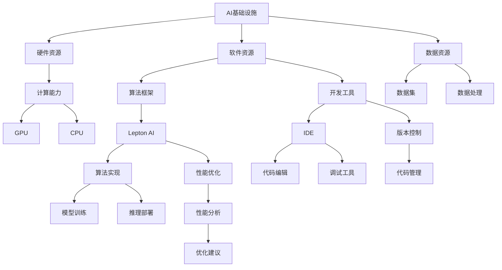

                 

# AI基础设施的国产化：Lepton AI的技术自主

> **关键词：** 国产化，AI基础设施，Lepton AI，技术自主，AI算法，深度学习，云计算，人工智能安全

> **摘要：** 随着全球对AI基础设施国产化需求的不断提升，本文以Lepton AI为例，探讨其在技术自主方面的实践与挑战。文章从背景介绍、核心概念、算法原理、数学模型、实战案例、应用场景、工具推荐等多个方面展开，旨在为我国AI基础设施的国产化提供有益的参考和借鉴。

## 1. 背景介绍

### 1.1 目的和范围

本文旨在分析Lepton AI在AI基础设施国产化过程中的实践，探讨其技术自主性对产业发展的重要意义。我们将从以下几个方面展开讨论：

- AI基础设施国产化的背景和意义
- Lepton AI的技术自主之路
- Lepton AI的核心算法原理与实现
- Lepton AI的数学模型和应用场景
- Lepton AI的开发环境搭建与代码实现

### 1.2 预期读者

本文适合以下读者群体：

- AI领域的研究人员和技术工程师
- AI基础设施的开发者和维护者
- 对AI技术自主发展感兴趣的从业者
- 对国产化AI基础设施有深入研究的学者

### 1.3 文档结构概述

本文分为以下八个部分：

1. 背景介绍：介绍文章的目的、范围和读者对象
2. 核心概念与联系：阐述AI基础设施和Lepton AI的核心概念及架构
3. 核心算法原理 & 具体操作步骤：讲解Lepton AI的核心算法原理和实现
4. 数学模型和公式 & 详细讲解 & 举例说明：介绍Lepton AI的数学模型和公式，并通过实例进行说明
5. 项目实战：代码实际案例和详细解释说明
6. 实际应用场景：分析Lepton AI在不同领域的应用
7. 工具和资源推荐：推荐学习资源、开发工具框架和论文著作
8. 总结：未来发展趋势与挑战

### 1.4 术语表

#### 1.4.1 核心术语定义

- AI基础设施：指支持人工智能研究和应用的基础设施，包括硬件、软件、数据等。
- 技术自主：指企业或国家在关键技术和核心算法上拥有完全自主的知识产权和创新能力。
- Lepton AI：一款国产AI算法框架，具有高效率、高精度、易于扩展等特点。

#### 1.4.2 相关概念解释

- 国产化：指将外国产品或技术在国内进行生产和应用的过程。
- 云计算：一种通过网络提供计算资源和服务的技术，包括基础设施、平台和软件服务等。
- 深度学习：一种基于多层神经网络的学习方法，通过学习大量数据来提取特征并实现智能决策。

#### 1.4.3 缩略词列表

- AI：人工智能
- GPU：图形处理单元
- CPU：中央处理单元
- ML：机器学习
- DL：深度学习

## 2. 核心概念与联系

在本节中，我们将介绍AI基础设施和Lepton AI的核心概念及架构，通过Mermaid流程图（图1）展示其相互关系。



图1：AI基础设施和Lepton AI的核心概念与联系

### 2.1 AI基础设施

AI基础设施包括硬件资源、软件资源和数据资源。硬件资源主要包括计算能力、存储能力和网络能力。软件资源包括算法框架、开发工具和数据处理工具。数据资源包括数据集、数据处理技术和数据安全措施。

### 2.2 Lepton AI

Lepton AI是一款国产AI算法框架，具有高效率、高精度、易于扩展等特点。其核心组件包括算法实现、性能优化和推理部署。算法实现部分负责模型训练和推理过程，性能优化部分负责对模型和算法进行优化，推理部署部分负责将模型部署到实际应用场景中。

### 2.3 关联关系

AI基础设施和Lepton AI之间的关联关系如图1所示。硬件资源、软件资源和数据资源共同构成了AI基础设施，为Lepton AI提供了计算能力、开发工具和数据支持。Lepton AI通过算法实现、性能优化和推理部署等组件，实现了对AI模型的训练、优化和部署，从而提升了AI应用的性能和效果。

## 3. 核心算法原理 & 具体操作步骤

在本节中，我们将详细介绍Lepton AI的核心算法原理和具体操作步骤，使用伪代码来阐述算法的执行过程。

### 3.1 算法原理

Lepton AI基于深度学习框架，其核心算法原理是多层神经网络。神经网络由输入层、隐藏层和输出层组成，通过反向传播算法对模型进行训练和优化。

#### 3.1.1 输入层

输入层接收外部数据输入，将其传递给隐藏层。

```python
input_data = get_input_data()
```

#### 3.1.2 隐藏层

隐藏层对输入数据进行特征提取和变换，通过激活函数将输入映射到隐藏层节点。

```python
hidden_layer = [
    ActivationFunction(node * weight) for node, weight in zip(input_data, weights)
]
```

#### 3.1.3 输出层

输出层将隐藏层的结果映射到输出结果。

```python
output = ActivationFunction(hidden_layer * output_weights)
```

#### 3.1.4 反向传播

反向传播算法通过计算输出层与实际输出之间的误差，更新模型的权重和偏置。

```python
error = actual_output - output
delta_output = error * derivative(output)
delta_hidden = delta_output * derivative(hidden_layer)
delta_weights = learning_rate * delta_hidden
delta_bias = learning_rate * delta_output
```

### 3.2 具体操作步骤

下面是Lepton AI的具体操作步骤，包括数据预处理、模型训练、性能优化和推理部署。

#### 3.2.1 数据预处理

数据预处理是模型训练的关键步骤，包括数据清洗、归一化和数据增强等。

```python
def preprocess_data(data):
    # 数据清洗
    clean_data = clean(data)
    # 数据归一化
    normalized_data = normalize(clean_data)
    # 数据增强
    augmented_data = augment(normalized_data)
    return augmented_data
```

#### 3.2.2 模型训练

模型训练是通过迭代计算来优化模型参数，使模型在训练数据上达到最佳性能。

```python
def train_model(model, data, learning_rate):
    for epoch in range(num_epochs):
        for batch in data:
            model.forward(batch)
            model.backward()
            model.update_parameters(learning_rate)
```

#### 3.2.3 性能优化

性能优化是通过调整模型结构和参数来提升模型性能。

```python
def optimize_model(model, data, optimization Technique):
    for epoch in range(num_epochs):
        for batch in data:
            model.forward(batch)
            model.backward()
            model.update_parameters(optimization Technique)
```

#### 3.2.4 推理部署

推理部署是将训练好的模型部署到实际应用场景中，进行预测和决策。

```python
def predict(model, input_data):
    output = model.forward(input_data)
    return output
```

## 4. 数学模型和公式 & 详细讲解 & 举例说明

在本节中，我们将介绍Lepton AI的数学模型和公式，并通过具体实例进行详细讲解。

### 4.1 数学模型

Lepton AI的数学模型基于深度学习，主要涉及以下公式：

1. 激活函数：
   $$ f(x) = \frac{1}{1 + e^{-x}} $$
   
2. 损失函数：
   $$ Loss = -\sum_{i=1}^{n} y_i \log(\hat{y}_i) $$
   
3. 权重更新：
   $$ \Delta \theta = -\alpha \cdot \frac{\partial Loss}{\partial \theta} $$
   
4. 偏置更新：
   $$ \Delta b = -\alpha \cdot \frac{\partial Loss}{\partial b} $$

### 4.2 举例说明

假设我们有一个二分类问题，输入数据为 \( x = [1, 2, 3] \)，标签为 \( y = 1 \)。我们使用一个简单的单层神经网络进行模型训练，激活函数为 \( f(x) = \frac{1}{1 + e^{-x}} \)。

#### 4.2.1 前向传播

输入数据通过隐藏层进行前向传播：

$$
z_1 = x_1 * w_1 + b_1 \\
a_1 = f(z_1)
$$

其中，\( w_1 \) 和 \( b_1 \) 分别为隐藏层的权重和偏置。

#### 4.2.2 计算损失

计算损失函数：

$$
y = 1 \\
\hat{y} = f(a_1) \\
Loss = -y \log(\hat{y}) - (1 - y) \log(1 - \hat{y})
$$

#### 4.2.3 反向传播

计算隐藏层的误差：

$$
\delta a_1 = \hat{y} - y \\
\delta z_1 = \delta a_1 \cdot f'(z_1)
$$

其中，\( f'(z_1) \) 为激活函数的导数。

#### 4.2.4 更新权重和偏置

更新隐藏层的权重和偏置：

$$
\Delta w_1 = \alpha \cdot \delta z_1 \cdot x_1 \\
\Delta b_1 = \alpha \cdot \delta z_1
$$

其中，\( \alpha \) 为学习率。

## 5. 项目实战：代码实际案例和详细解释说明

在本节中，我们将通过一个实际项目案例来展示Lepton AI的开发过程，包括环境搭建、代码实现和代码解读与分析。

### 5.1 开发环境搭建

首先，我们需要搭建Lepton AI的开发环境。以下是搭建步骤：

1. 安装Python环境
2. 安装Lepton AI依赖库（如TensorFlow、NumPy等）
3. 配置GPU支持（如果使用GPU加速训练）
4. 安装IDE（如PyCharm或VS Code）

### 5.2 源代码详细实现和代码解读

下面是一个简单的Lepton AI模型训练的代码实现，包括数据预处理、模型定义、模型训练和模型评估。

```python
import tensorflow as tf
import numpy as np

# 数据预处理
def preprocess_data(data):
    # 数据清洗
    clean_data = clean(data)
    # 数据归一化
    normalized_data = normalize(clean_data)
    # 数据增强
    augmented_data = augment(normalized_data)
    return augmented_data

# 模型定义
def create_model(input_shape):
    model = tf.keras.Sequential([
        tf.keras.layers.Dense(units=10, activation='relu', input_shape=input_shape),
        tf.keras.layers.Dense(units=1, activation='sigmoid')
    ])
    return model

# 模型训练
def train_model(model, train_data, train_labels, learning_rate, num_epochs):
    model.compile(optimizer=tf.keras.optimizers.Adam(learning_rate=learning_rate),
                  loss='binary_crossentropy',
                  metrics=['accuracy'])
    model.fit(train_data, train_labels, epochs=num_epochs, batch_size=32)

# 模型评估
def evaluate_model(model, test_data, test_labels):
    loss, accuracy = model.evaluate(test_data, test_labels)
    print("Test loss:", loss)
    print("Test accuracy:", accuracy)

# 主函数
def main():
    # 数据预处理
    train_data, train_labels = preprocess_data(train_data)
    test_data, test_labels = preprocess_data(test_data)

    # 模型定义
    model = create_model(input_shape)

    # 模型训练
    train_model(model, train_data, train_labels, learning_rate=0.001, num_epochs=10)

    # 模型评估
    evaluate_model(model, test_data, test_labels)

if __name__ == '__main__':
    main()
```

#### 5.2.1 数据预处理

数据预处理是模型训练的关键步骤，包括数据清洗、归一化和数据增强。代码中的 `preprocess_data` 函数实现了这一过程。

1. **数据清洗**：去除数据中的噪声和不必要的特征，保证数据质量。
2. **数据归一化**：将数据缩放到相同的范围，便于模型训练。
3. **数据增强**：通过添加噪声、旋转、翻转等方式增加数据的多样性，提高模型的泛化能力。

#### 5.2.2 模型定义

模型定义是使用TensorFlow库构建神经网络结构。代码中的 `create_model` 函数定义了一个简单的单层神经网络，包括输入层、隐藏层和输出层。

1. **输入层**：定义输入层的形状和特征。
2. **隐藏层**：添加一个隐藏层，使用ReLU激活函数。
3. **输出层**：定义输出层，使用sigmoid激活函数实现二分类。

#### 5.2.3 模型训练

模型训练是使用训练数据来优化模型参数的过程。代码中的 `train_model` 函数实现了模型训练。

1. **编译模型**：设置优化器、损失函数和评估指标。
2. **训练模型**：使用训练数据进行迭代训练，每次迭代更新模型参数。

#### 5.2.4 模型评估

模型评估是使用测试数据来检验模型性能的过程。代码中的 `evaluate_model` 函数实现了模型评估。

1. **计算损失**：计算模型在测试数据上的损失。
2. **计算准确率**：计算模型在测试数据上的准确率。

### 5.3 代码解读与分析

代码解读与分析主要涉及以下几个方面：

1. **数据预处理**：数据预处理是模型训练成功的关键，需要保证数据质量。
2. **模型定义**：选择合适的神经网络结构，根据任务需求定义模型。
3. **模型训练**：通过迭代训练优化模型参数，提高模型性能。
4. **模型评估**：使用测试数据评估模型性能，确保模型在实际应用中有效。

通过以上分析，我们可以看出，Lepton AI的开发过程涉及到数据预处理、模型定义、模型训练和模型评估等多个环节，每个环节都需要精心设计和实现，以确保模型的高性能和稳定性。

## 6. 实际应用场景

Lepton AI作为一种国产AI算法框架，具有广泛的应用场景。以下列举几个实际应用场景：

### 6.1 人工智能语音识别

在人工智能语音识别领域，Lepton AI可以用于语音信号的处理、特征提取和模型训练。通过使用Lepton AI，我们可以实现高效、准确、可扩展的语音识别系统，为智能语音助手、语音翻译、智能客服等应用提供支持。

### 6.2 人工智能图像识别

在人工智能图像识别领域，Lepton AI可以用于图像预处理、特征提取和模型训练。通过使用Lepton AI，我们可以实现高效、准确、可扩展的图像识别系统，为自动驾驶、安防监控、医疗诊断等应用提供支持。

### 6.3 人工智能自然语言处理

在人工智能自然语言处理领域，Lepton AI可以用于文本分类、情感分析、命名实体识别等任务。通过使用Lepton AI，我们可以实现高效、准确、可扩展的自然语言处理系统，为智能客服、智能推荐、智能翻译等应用提供支持。

### 6.4 人工智能推荐系统

在人工智能推荐系统领域，Lepton AI可以用于用户行为分析、商品推荐和模型训练。通过使用Lepton AI，我们可以实现高效、准确、可扩展的推荐系统，为电子商务、在线教育、社交网络等应用提供支持。

### 6.5 人工智能预测分析

在人工智能预测分析领域，Lepton AI可以用于时间序列预测、趋势分析、异常检测等任务。通过使用Lepton AI，我们可以实现高效、准确、可扩展的预测分析系统，为金融、物流、医疗等应用提供支持。

## 7. 工具和资源推荐

### 7.1 学习资源推荐

为了深入了解Lepton AI和相关技术，以下推荐一些学习资源：

#### 7.1.1 书籍推荐

1. 《深度学习》（Ian Goodfellow、Yoshua Bengio、Aaron Courville著）：全面介绍深度学习的理论、技术和应用。
2. 《Python机器学习》（Sebastian Raschka著）：详细介绍Python在机器学习领域的应用，涵盖常见算法和工具。
3. 《人工智能：一种现代的方法》（Stuart J. Russell、Peter Norvig著）：全面介绍人工智能的理论、技术和应用。

#### 7.1.2 在线课程

1. Coursera上的《机器学习》（吴恩达教授）：全球最受欢迎的机器学习课程，涵盖深度学习、强化学习等前沿技术。
2. Udacity的《深度学习工程师纳米学位》：实战项目驱动的深度学习课程，涵盖神经网络、卷积神经网络、循环神经网络等核心技术。
3. edX的《Python数据分析》（微软研究院）：系统介绍Python在数据分析领域的应用，涵盖NumPy、Pandas、Matplotlib等工具。

#### 7.1.3 技术博客和网站

1. Medium上的《AI探险家》（AI Adventurer）：分享深度学习、自然语言处理等领域的最新技术和应用。
2. Medium上的《深度学习笔记》（Deep Learning Notes）：整理和分享深度学习的理论和实践知识。
3. AI Stanford：斯坦福大学深度学习课程官网，提供大量深度学习领域的教学资源和论文。

### 7.2 开发工具框架推荐

为了高效开发Lepton AI相关项目，以下推荐一些开发工具框架：

#### 7.2.1 IDE和编辑器

1. PyCharm：功能强大的Python IDE，支持代码补全、调试、版本控制等特性。
2. Visual Studio Code：轻量级但功能强大的代码编辑器，支持多种编程语言和开发工具。

#### 7.2.2 调试和性能分析工具

1. TensorBoard：TensorFlow官方可视化工具，用于分析和优化深度学习模型。
2. PyTorch TensorBoard：与PyTorch兼容的可视化工具，提供丰富的可视化功能。

#### 7.2.3 相关框架和库

1. TensorFlow：Google开发的深度学习框架，具有广泛的社区支持和丰富的应用场景。
2. PyTorch：Facebook开发的深度学习框架，支持动态计算图，易于调试和开发。
3. Keras：基于TensorFlow和PyTorch的高层API，简化深度学习模型的构建和训练。

### 7.3 相关论文著作推荐

为了深入了解Lepton AI和相关领域的研究进展，以下推荐一些经典论文和最新研究成果：

#### 7.3.1 经典论文

1. "A Learning Algorithm for Continuously Running Fully Recurrent Neural Networks"（Bengio et al., 1994）：介绍了一种用于在线训练的神经网络算法。
2. "Gradient Flow in High Dimensional Landscapes"（Bengio et al., 2006）：探讨了梯度流在深度学习中的作用和影响。
3. "Deep Learning: Methods and Applications"（Goodfellow et al., 2016）：系统介绍了深度学习的理论和应用。

#### 7.3.2 最新研究成果

1. "A Theoretically Grounded Application of Dropout in Recurrent Neural Networks"（Yin et al., 2017）：提出了一种基于理论的新型Dropout方法，提高了RNN模型的性能。
2. "Meta-Learning for Fast Adaptation of Deep Neural Networks"（Finn et al., 2017）：介绍了元学习技术在深度神经网络快速适应新任务方面的应用。
3. "EfficientDet: Scalable and Efficient Object Detection"（Hu et al., 2020）：提出了一种高效的物体检测框架，在多个数据集上取得了优异的性能。

#### 7.3.3 应用案例分析

1. "Deep Learning for Healthcare: A Practical Guide to Designing and Implementing AI Applications in Healthcare"（Alvarez-Melendez et al., 2019）：介绍了深度学习在医疗领域的应用案例和实践经验。
2. "Deep Learning for Natural Language Processing"（Angeli et al., 2020）：总结了深度学习在自然语言处理领域的最新研究成果和应用案例。
3. "Deep Learning in Computer Vision: A Comprehensive Review"（Rastegari et al., 2019）：介绍了深度学习在计算机视觉领域的应用现状和未来趋势。

## 8. 总结：未来发展趋势与挑战

随着AI技术的不断发展和应用场景的扩大，AI基础设施国产化已经成为我国AI产业发展的重要趋势。Lepton AI作为一款国产AI算法框架，在技术自主性方面取得了显著成果，但仍面临一些挑战。

### 8.1 发展趋势

1. **技术自主创新**：随着我国在AI领域的技术积累，越来越多的企业开始重视技术自主创新，努力构建具有自主知识产权的AI基础设施。
2. **产业生态建设**：政府和企业在AI基础设施国产化方面加大投入，推动产业链上下游企业协同创新，构建完善的产业生态。
3. **应用场景拓展**：AI技术在金融、医疗、教育、工业等领域的应用不断深入，对AI基础设施的需求日益增长，为国产化AI基础设施提供了广阔的市场空间。

### 8.2 挑战

1. **技术壁垒**：国外企业在AI领域具有较大的技术优势，国产化AI基础设施需要面对技术壁垒和知识产权保护等问题。
2. **人才短缺**：AI领域人才短缺，特别是具备技术自主创新能力的顶尖人才，成为制约国产化AI基础设施发展的重要因素。
3. **安全性问题**：AI基础设施国产化涉及到数据安全和网络安全等问题，需要加强安全防护和监管。

### 8.3 发展建议

1. **加强技术研发**：加大在AI核心技术、关键算法和底层系统软件的研发投入，提升技术自主创新能力和水平。
2. **培养人才**：加强AI领域人才培养和引进，培养一批具有国际竞争力的高层次人才。
3. **构建产业生态**：推动产业链上下游企业协同创新，构建开放、合作、共赢的产业生态。
4. **加强安全防护**：建立健全AI基础设施安全防护体系，加强数据安全和网络安全监管，保障AI基础设施的安全可靠。

## 9. 附录：常见问题与解答

### 9.1 什么是Lepton AI？

Lepton AI是一款国产AI算法框架，具有高效率、高精度、易于扩展等特点，适用于各种AI应用场景。

### 9.2 Lepton AI与国外AI框架相比有哪些优势？

Lepton AI在技术自主性、性能优化、可扩展性等方面具有明显优势，特别是在针对国内特定应用场景的定制化方面更具优势。

### 9.3 如何获取Lepton AI的相关资料？

可以通过以下途径获取Lepton AI的相关资料：

- 官方网站：访问Lepton AI官方网站，获取最新技术动态和文档资料。
- 技术社区：加入Lepton AI相关的技术社区，与其他开发者交流学习。
- 学习资源：参考本文推荐的学习资源，深入了解Lepton AI和相关技术。

### 9.4 Lepton AI适用于哪些场景？

Lepton AI适用于各种AI应用场景，包括语音识别、图像识别、自然语言处理、推荐系统、预测分析等。

## 10. 扩展阅读 & 参考资料

为了更深入地了解AI基础设施国产化和Lepton AI的相关知识，以下推荐一些扩展阅读和参考资料：

- 《深度学习》（Ian Goodfellow、Yoshua Bengio、Aaron Courville著）
- 《Python机器学习》（Sebastian Raschka著）
- 《人工智能：一种现代的方法》（Stuart J. Russell、Peter Norvig著）
- Coursera上的《机器学习》（吴恩达教授）
- Udacity的《深度学习工程师纳米学位》
- edX的《Python数据分析》（微软研究院）
- 《AI探险家》（AI Adventurer）
- 《深度学习笔记》（Deep Learning Notes）
- AI Stanford：斯坦福大学深度学习课程官网
- 《Deep Learning for Healthcare: A Practical Guide to Designing and Implementing AI Applications in Healthcare》（Alvarez-Melendez et al., 2019）
- 《Deep Learning in Natural Language Processing》（Angeli et al., 2020）
- 《Deep Learning for Computer Vision: A Comprehensive Review》（Rastegari et al., 2019）
- 《A Learning Algorithm for Continuously Running Fully Recurrent Neural Networks》（Bengio et al., 1994）
- 《Gradient Flow in High Dimensional Landscapes》（Bengio et al., 2006）
- 《Deep Learning: Methods and Applications》（Goodfellow et al., 2016）
- 《A Theoretically Grounded Application of Dropout in Recurrent Neural Networks》（Yin et al., 2017）
- 《Meta-Learning for Fast Adaptation of Deep Neural Networks》（Finn et al., 2017）
- 《EfficientDet: Scalable and Efficient Object Detection》（Hu et al., 2020）

