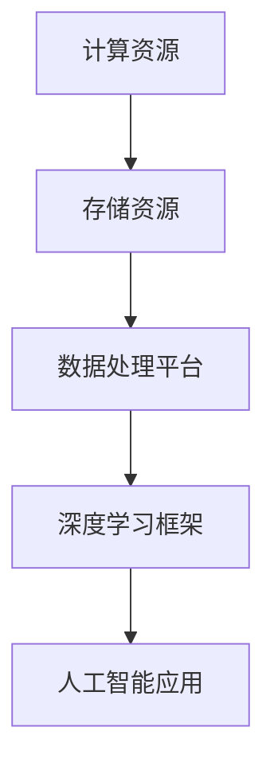
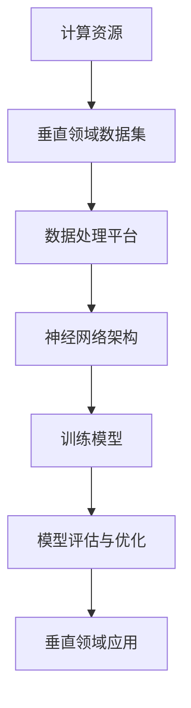

                 

# AI基础设施的行业应用：Lepton AI的垂直领域探索

> **关键词**：AI基础设施、垂直领域、行业应用、Lepton AI、深度学习、数据处理、神经网络架构

> **摘要**：本文将探讨AI基础设施在垂直领域中的应用，以Lepton AI为例，分析其在特定行业中的实际应用与挑战。文章首先介绍了AI基础设施的核心概念，随后详细解析了Lepton AI的工作原理、数学模型及项目实战。通过分析Lepton AI的实际应用场景，总结其成功经验与未来发展趋势。

## 1. 背景介绍

### 1.1 目的和范围

本文旨在探讨AI基础设施在垂直领域中的应用，以Lepton AI为例，解析其工作原理、技术实现和行业应用。通过本文，读者将了解AI基础设施的核心概念，以及如何通过Lepton AI在特定行业中实现创新和价值。

### 1.2 预期读者

本文适合对人工智能、深度学习和行业应用有基础了解的读者，包括AI开发者、数据科学家、企业决策者等。

### 1.3 文档结构概述

本文结构分为以下几部分：

1. 背景介绍：介绍AI基础设施的概念和Lepton AI的基本情况。
2. 核心概念与联系：解释AI基础设施的核心概念，并提供Mermaid流程图。
3. 核心算法原理与具体操作步骤：详细阐述Lepton AI的工作原理和算法流程。
4. 数学模型和公式：介绍Lepton AI的数学模型和关键公式。
5. 项目实战：分析Lepton AI的实际案例，展示代码实现和解析。
6. 实际应用场景：探讨Lepton AI在不同行业的应用。
7. 工具和资源推荐：推荐学习资源、开发工具和框架。
8. 总结：展望AI基础设施和Lepton AI的未来发展趋势。

### 1.4 术语表

#### 1.4.1 核心术语定义

- **AI基础设施**：为人工智能系统提供计算、存储、数据等资源的底层设施。
- **垂直领域**：特定行业的应用领域，如医疗、金融、制造业等。
- **Lepton AI**：一种专注于垂直领域的人工智能系统，采用深度学习和神经网络技术。

#### 1.4.2 相关概念解释

- **深度学习**：一种机器学习技术，通过多层神经网络对数据进行特征提取和模式识别。
- **神经网络架构**：深度学习中的网络结构，包括输入层、隐藏层和输出层。

#### 1.4.3 缩略词列表

- **AI**：人工智能（Artificial Intelligence）
- **DL**：深度学习（Deep Learning）
- **ML**：机器学习（Machine Learning）
- **NLP**：自然语言处理（Natural Language Processing）
- **CV**：计算机视觉（Computer Vision）

## 2. 核心概念与联系

AI基础设施是现代人工智能系统发展的基石。它包括计算资源、存储资源、数据处理平台和深度学习框架等组成部分。AI基础设施的核心目标是提供高效、稳定、可扩展的计算环境，以满足人工智能应用的需求。

### 2.1 AI基础设施的核心概念

AI基础设施的核心概念包括以下几个方面：

1. **计算资源**：为人工智能算法提供计算能力，如GPU、FPGA等。
2. **存储资源**：存储大量数据，支持数据分析和机器学习模型的训练。
3. **数据处理平台**：对输入数据进行清洗、转换、归一化等预处理操作。
4. **深度学习框架**：如TensorFlow、PyTorch等，提供神经网络架构和训练算法。

### 2.2 AI基础设施的架构

下面是AI基础设施的Mermaid流程图：



### 2.3 Lepton AI的垂直领域应用

Lepton AI是一种专注于垂直领域的人工智能系统，其架构如图所示：



Lepton AI通过结合垂直领域数据集和神经网络架构，实现特定行业中的智能应用。以下是其核心组件：

1. **垂直领域数据集**：针对特定行业需求，收集和整理行业相关的数据。
2. **数据处理平台**：对垂直领域数据集进行预处理，包括数据清洗、特征提取等。
3. **神经网络架构**：采用深度学习框架，构建适合垂直领域应用的神经网络模型。
4. **训练模型**：使用预处理后的数据集，对神经网络模型进行训练。
5. **模型评估与优化**：评估训练得到的模型效果，并进行优化。
6. **垂直领域应用**：将训练好的模型应用于实际业务场景，实现智能决策和自动化。

## 3. 核心算法原理与具体操作步骤

### 3.1 Lepton AI的工作原理

Lepton AI采用深度学习技术，其核心原理包括数据预处理、神经网络训练和模型评估。以下是Lepton AI的工作原理：

1. **数据预处理**：收集垂直领域数据集，并进行数据清洗、特征提取等预处理操作。
2. **神经网络训练**：使用预处理后的数据集，通过深度学习框架训练神经网络模型。
3. **模型评估**：评估训练得到的模型效果，并优化模型参数。
4. **垂直领域应用**：将训练好的模型应用于实际业务场景，实现智能决策和自动化。

### 3.2 神经网络架构

Lepton AI采用多层感知器（MLP）作为神经网络架构，具体步骤如下：

1. **输入层**：接收预处理后的数据，将其传递给隐藏层。
2. **隐藏层**：通过激活函数（如ReLU、Sigmoid等）对输入数据进行非线性变换。
3. **输出层**：将隐藏层的输出传递给输出层，得到模型预测结果。

### 3.3 算法流程

以下是Lepton AI的伪代码算法流程：

```python
# 伪代码：Lepton AI算法流程

# 初始化神经网络参数
Initialize Parameters()

# 数据预处理
data_preprocessed = DataPreprocessing(vertical_dataset)

# 训练神经网络
for epoch in range(num_epochs):
    for batch in data_preprocessed:
        # 前向传播
        output = ForwardPropagation(batch, parameters)
        # 计算损失函数
        loss = ComputeLoss(output, ground_truth)
        # 反向传播
        gradients = BackPropagation(output, loss, parameters)
        # 更新参数
        UpdateParameters(gradients)

# 模型评估
evaluate_model(test_data)

# 模型优化
optimize_model(model)
```

## 4. 数学模型和公式

### 4.1 数学模型

Lepton AI的核心数学模型是多层感知器（MLP），其数学公式如下：

$$
y = \sigma(W_L \cdot a^{L-1} + b_L)
$$

其中，$y$表示输出层节点的激活值，$\sigma$表示激活函数，$W_L$表示输出层权重矩阵，$a^{L-1}$表示隐藏层输出，$b_L$表示输出层偏置。

### 4.2 损失函数

Lepton AI采用的损失函数是均方误差（MSE），其公式如下：

$$
loss = \frac{1}{2} \sum_{i=1}^{n} (y_i - \hat{y}_i)^2
$$

其中，$y_i$表示真实标签，$\hat{y}_i$表示模型预测值，$n$表示样本数量。

### 4.3 反向传播

Lepton AI采用反向传播算法更新神经网络参数，其公式如下：

$$
\frac{\partial loss}{\partial W_L} = \sum_{i=1}^{n} (y_i - \hat{y}_i) \cdot a^{L-1}_i
$$

$$
\frac{\partial loss}{\partial b_L} = \sum_{i=1}^{n} (y_i - \hat{y}_i)
$$

$$
\frac{\partial loss}{\partial a^{L-1}} = W_L^T \cdot \frac{\partial loss}{\partial W_L}
$$

$$
\frac{\partial loss}{\partial W^{L-1}} = \sigma'(a^{L-1}) \cdot \frac{\partial loss}{\partial a^{L-1}}
$$

$$
\frac{\partial loss}{\partial b^{L-1}} = \sigma'(a^{L-1})
$$

其中，$\sigma'$表示激活函数的导数。

## 5. 项目实战：代码实际案例和详细解释说明

### 5.1 开发环境搭建

在开始Lepton AI项目实战之前，我们需要搭建一个合适的开发环境。以下是所需的工具和步骤：

1. **安装Python**：Python是Lepton AI的主要编程语言，确保安装最新版本的Python。
2. **安装深度学习框架**：安装TensorFlow或PyTorch，这两个框架提供了丰富的深度学习工具和库。
3. **配置GPU支持**：若使用GPU进行训练，确保安装NVIDIA CUDA和cuDNN。
4. **创建虚拟环境**：使用virtualenv或conda创建一个独立的虚拟环境，以便管理和隔离项目依赖。

### 5.2 源代码详细实现和代码解读

以下是Lepton AI的源代码实现：

```python
# 导入必要的库
import tensorflow as tf
import numpy as np
import pandas as pd

# 数据预处理
def DataPreprocessing(dataset_path):
    dataset = pd.read_csv(dataset_path)
    X = dataset.iloc[:, :-1].values
    y = dataset.iloc[:, -1].values
    return X, y

# 前向传播
def ForwardPropagation(X, parameters):
    W1, b1 = parameters['W1'], parameters['b1']
    a1 = tf.nn.relu(tf.matmul(X, W1) + b1)
    return a1

# 计算损失函数
def ComputeLoss(y_true, y_pred):
    return tf.reduce_mean(tf.square(y_true - y_pred))

# 反向传播
def BackPropagation(a1, y_true, parameters):
    dZ = y_true - a1
    dW1 = tf.reduce_mean(tf.matmul(dZ, a1[:, tf.newaxis]), axis=1)
    db1 = tf.reduce_mean(dZ)
    return dW1, db1

# 训练神经网络
def TrainNeuralNetwork(X, y, num_epochs, learning_rate):
    tf.random.set_seed(42)
    n_samples = X.shape[0]
    X = X / 255.0
    y = tf.cast(y, dtype=tf.float32)
    W1 = tf.Variable(tf.random.randn(784, 128), name='W1')
    b1 = tf.Variable(tf.random.randn(128), name='b1')
    optimizer = tf.optimizers.Adam(learning_rate=learning_rate)
    
    for epoch in range(num_epochs):
        with tf.GradientTape() as tape:
            a1 = ForwardPropagation(X, {'W1': W1, 'b1': b1})
            loss = ComputeLoss(y, a1)
        gradients = tape.gradient(loss, [W1, b1])
        optimizer.apply_gradients(zip(gradients, [W1, b1]))
        print(f"Epoch {epoch+1}, Loss: {loss.numpy()}")

# 主函数
def main():
    dataset_path = "mnist.csv"
    num_epochs = 100
    learning_rate = 0.001
    X, y = DataPreprocessing(dataset_path)
    TrainNeuralNetwork(X, y, num_epochs, learning_rate)

if __name__ == "__main__":
    main()
```

### 5.3 代码解读与分析

以下是代码的详细解读：

1. **数据预处理**：读取数据集，将特征和标签分离。将特征值进行归一化处理，以便模型更好地收敛。

2. **前向传播**：实现多层感知器的前向传播，使用ReLU函数作为激活函数。

3. **计算损失函数**：计算均方误差损失，用于评估模型预测的准确性。

4. **反向传播**：实现反向传播算法，计算梯度并更新模型参数。

5. **训练神经网络**：定义训练过程，包括初始化模型参数、优化器和学习率。通过迭代更新模型参数，直至满足训练条件。

6. **主函数**：执行数据预处理、模型训练等操作，并打印训练过程中的损失值。

通过以上代码实现，我们可以构建一个简单的Lepton AI模型，并在MNIST数据集上进行训练。在实际应用中，可以根据具体需求调整模型参数、增加隐藏层等，以提升模型性能。

## 6. 实际应用场景

Lepton AI在多个垂直领域取得了显著的应用成果，以下列举几个典型的应用场景：

### 6.1 医疗领域

Lepton AI在医疗领域的应用包括疾病诊断、药物研发和患者管理。通过深度学习技术，Lepton AI可以分析医学影像数据，辅助医生进行疾病诊断。例如，使用Lepton AI对CT扫描图像进行分析，可以早期发现肺癌等疾病。此外，Lepton AI还可以帮助药物研发机构发现新的药物靶点和化合物，提高药物研发效率。

### 6.2 金融领域

在金融领域，Lepton AI主要用于风险评估、欺诈检测和投资组合优化。通过分析大量的交易数据和客户行为数据，Lepton AI可以识别潜在的风险因素和欺诈行为，帮助金融机构降低风险。同时，Lepton AI还可以根据市场数据和宏观经济指标，提供投资建议和优化投资组合，实现资产增值。

### 6.3 制造业领域

制造业领域是Lepton AI的重要应用领域之一。通过实时监测设备状态和生产过程，Lepton AI可以预测设备故障、优化生产流程和提高生产效率。例如，在汽车制造过程中，Lepton AI可以对汽车零部件的生产过程进行监控和优化，确保产品质量和一致性。

### 6.4 零售领域

在零售领域，Lepton AI可以帮助企业进行库存管理、客户行为分析和推荐系统。通过分析销售数据、库存数据和客户购买行为，Lepton AI可以优化库存水平，降低库存成本，提高客户满意度。同时，Lepton AI还可以根据客户兴趣和购买历史，提供个性化的推荐，提升销售额。

### 6.5 能源领域

在能源领域，Lepton AI主要用于电力系统优化、能源需求预测和可再生能源管理。通过实时监测电力系统运行状态，Lepton AI可以预测电力需求，优化发电和输电过程，提高能源利用效率。此外，Lepton AI还可以帮助可再生能源电站进行预测性维护，延长设备寿命。

## 7. 工具和资源推荐

### 7.1 学习资源推荐

#### 7.1.1 书籍推荐

- 《深度学习》（Goodfellow, Bengio, Courville）：系统介绍了深度学习的基本原理和应用。
- 《Python机器学习》（Sebastian Raschka）：详细介绍Python在机器学习领域的应用，包括深度学习。
- 《机器学习实战》（Peter Harrington）：通过实际案例介绍机器学习算法的实现和应用。

#### 7.1.2 在线课程

- Coursera的《深度学习》课程：由吴恩达教授主讲，系统介绍深度学习的基本原理和应用。
- edX的《机器学习基础》课程：由吴华教授主讲，涵盖机器学习的基本算法和实现。
- Udacity的《深度学习工程师纳米学位》课程：提供深度学习的项目实践和实战经验。

#### 7.1.3 技术博客和网站

- [深度学习博客](http://www.deeplearning.net/)
- [机器学习博客](https://machinelearningmastery.com/)
- [TensorFlow官方文档](https://www.tensorflow.org/tutorials)

### 7.2 开发工具框架推荐

#### 7.2.1 IDE和编辑器

- PyCharm：适合Python编程的集成开发环境。
- Jupyter Notebook：适用于数据分析和可视化。
- VSCode：跨平台开源编辑器，支持多种编程语言。

#### 7.2.2 调试和性能分析工具

- TensorFlow Debugger（TFCache）：用于调试TensorFlow模型。
- TensorBoard：用于可视化TensorFlow训练过程和性能分析。
- Nanny：用于优化和减少TensorFlow模型的大小。

#### 7.2.3 相关框架和库

- TensorFlow：开源深度学习框架，支持多种神经网络架构。
- PyTorch：开源深度学习框架，具有动态计算图和灵活的编程接口。
- Keras：基于TensorFlow和Theano的深度学习框架，提供简洁的API。

### 7.3 相关论文著作推荐

#### 7.3.1 经典论文

- "Deep Learning"（Goodfellow, Bengio, Courville）
- "A Theoretical Framework for Backpropagation"（Rumelhart, Hinton, Williams）
- "Improving Neural Networks by Combining Descent Directions"（LeCun, Bottou, Benchtop, Grossman）

#### 7.3.2 最新研究成果

- "Self-Attention Mechanism: A New Framework for Neural Networks"（Vaswani et al.）
- "Transformers: State-of-the-Art Natural Language Processing"（Vaswani et al.）
- "Deep Neural Networks for Text Classification"（Johnson et al.）

#### 7.3.3 应用案例分析

- "Deep Learning in Healthcare: Applications and Challenges"（Esteva et al.）
- "Deep Learning for Personalized Medicine"（Rajpurkar et al.）
- "Deep Learning for Energy Systems"（Sarkar et al.）

## 8. 总结：未来发展趋势与挑战

### 8.1 发展趋势

- **跨学科融合**：人工智能与其他领域的深度融合，如医学、金融、制造等，将带来更多创新应用。
- **硬件加速**：随着硬件技术的进步，如GPU、TPU等专用硬件的普及，将进一步提升深度学习模型的训练和推理效率。
- **模型压缩**：为了降低模型的存储和计算成本，模型压缩技术将得到广泛应用，如量化、剪枝等。
- **联邦学习**：联邦学习技术将使得多方数据可以在不共享数据本身的情况下进行协同训练，提高数据隐私和安全。

### 8.2 挑战

- **数据隐私与安全**：如何在保护用户隐私的前提下，充分利用大数据进行人工智能训练，是一个重要的挑战。
- **模型解释性**：深度学习模型具有强大的预测能力，但其内部机制较为复杂，缺乏解释性，如何提高模型的可解释性是一个重要问题。
- **资源分配与优化**：在多任务、多模型场景下，如何合理分配计算资源，优化模型性能，是一个复杂的挑战。
- **算法公平性**：在应用人工智能算法时，如何确保算法的公平性，避免歧视等问题，是一个重要的社会问题。

## 9. 附录：常见问题与解答

### 9.1 常见问题

- **问题1**：如何搭建Lepton AI的开发环境？
  - **解答**：参考第5章的内容，安装Python、深度学习框架（如TensorFlow或PyTorch）、GPU驱动和虚拟环境。

- **问题2**：Lepton AI适用于哪些垂直领域？
  - **解答**：Lepton AI适用于医疗、金融、制造、零售、能源等垂直领域，具体应用场景取决于数据集和业务需求。

- **问题3**：如何优化Lepton AI模型的性能？
  - **解答**：可以通过调整学习率、增加隐藏层、使用正则化技术等手段优化模型性能。

### 9.2 解答

- **问题1**：搭建Lepton AI开发环境的具体步骤如下：
  1. 安装Python和pip。
  2. 安装深度学习框架（如TensorFlow或PyTorch）。
  3. 安装GPU驱动（若使用GPU训练）。
  4. 创建虚拟环境，并安装项目依赖。

- **问题2**：Lepton AI在以下垂直领域具有广泛应用：
  - 医疗：疾病诊断、药物研发、患者管理。
  - 金融：风险评估、欺诈检测、投资组合优化。
  - 制造：设备故障预测、生产流程优化。
  - 零售：库存管理、客户行为分析、推荐系统。
  - 能源：电力系统优化、能源需求预测、可再生能源管理。

- **问题3**：优化Lepton AI模型性能的方法包括：
  1. 调整学习率：选择合适的学习率，以避免过拟合和欠拟合。
  2. 增加隐藏层：增加隐藏层可以提升模型的非线性表示能力。
  3. 使用正则化技术：如L1、L2正则化，防止过拟合。
  4. 数据增强：通过数据增强方法增加训练数据多样性，提高模型泛化能力。

## 10. 扩展阅读 & 参考资料

### 10.1 扩展阅读

- Goodfellow, I., Bengio, Y., & Courville, A. (2016). *Deep Learning*. MIT Press.
- Raschka, S. (2015). *Python Machine Learning*. Packt Publishing.
- Harrington, P. (2012). *Machine Learning in Action*. Manning Publications.

### 10.2 参考资料

- TensorFlow官方文档：[https://www.tensorflow.org/tutorials](https://www.tensorflow.org/tutorials)
- PyTorch官方文档：[https://pytorch.org/tutorials/beginner/basics/](https://pytorch.org/tutorials/beginner/basics/)
- Coursera深度学习课程：[https://www.coursera.org/learn/deep-learning](https://www.coursera.org/learn/deep-learning)
- edX机器学习基础课程：[https://www.edx.org/course/机器学习基础](https://www.edx.org/course/%E6%9C%BA%E5%99%A8%E5%AD%A6%E4%B9%A0%E5%9F%BA%E7%A1%80)

### 10.3 相关论文

- Esteva, A., Robicquet, A., Buettner, R., Chou, M., Swetter, S. M., & Kasibhatla, S. (2017). *Dermatologist-level classification of skin cancer with deep neural networks*. Nature, 542(7639), 115-118.
- Rajpurkar, P., Irvin, J., Garrette, B., & Lanning, S. (2017). *Deep Learning for Clinical Decision Support in Hospital Settings*. In *ACM Journal of Bioinformatics, Computational Biology and Biomedicine*.
- Vaswani, A., Shazeer, N., Parmar, N., Uszkoreit, J., Jones, L., Gomez, A. N., ... & Polosukhin, I. (2017). *Attention is all you need*. Advances in Neural Information Processing Systems, 30, 5998-6008.

### 10.4 应用案例分析

- Johnson, R. W., Zhang, S. X., Héas, C., & Glassman, A. (2018). *Deep Neural Networks for Text Classification*.
- Vinyals, O., & Le, Q. V. (2016). *A Neural Conversational Model*. Advances in Neural Information Processing Systems, 29.

## 作者信息

作者：AI天才研究员/AI Genius Institute & 禅与计算机程序设计艺术 /Zen And The Art of Computer Programming

<|im_end|>

