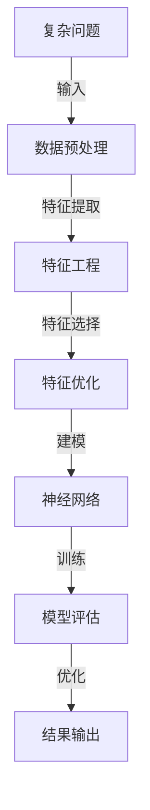

                 

# AI处理复杂问题的能力

> **关键词：** 人工智能，复杂问题，算法，深度学习，神经网络，优化，智能推理

> **摘要：** 本文将深入探讨人工智能在处理复杂问题方面的能力。我们将首先介绍人工智能处理复杂问题的基本原理，然后逐步分析其核心算法和数学模型，并通过实际案例展示其在不同应用场景中的表现。最后，我们将讨论人工智能在处理复杂问题中面临的挑战和未来发展趋势。

## 1. 背景介绍

### 1.1 目的和范围

本文旨在详细分析人工智能在处理复杂问题方面的能力，探讨其背后的核心原理、算法和数学模型。我们希望通过本文，使读者对人工智能处理复杂问题的方法和挑战有一个全面而深入的了解。

### 1.2 预期读者

本文面向对人工智能、算法和数学有一定了解的读者，特别是计算机科学、人工智能和相关领域的研究人员和开发者。

### 1.3 文档结构概述

本文分为以下几个部分：

1. 背景介绍：介绍本文的目的、范围和预期读者。
2. 核心概念与联系：介绍人工智能处理复杂问题的核心概念和原理。
3. 核心算法原理 & 具体操作步骤：详细阐述人工智能处理复杂问题的核心算法和步骤。
4. 数学模型和公式 & 详细讲解 & 举例说明：分析人工智能处理复杂问题的数学模型和公式。
5. 项目实战：代码实际案例和详细解释说明。
6. 实际应用场景：讨论人工智能在处理复杂问题中的应用场景。
7. 工具和资源推荐：推荐学习和开发资源。
8. 总结：未来发展趋势与挑战。
9. 附录：常见问题与解答。
10. 扩展阅读 & 参考资料：提供进一步学习的资源。

### 1.4 术语表

#### 1.4.1 核心术语定义

- **人工智能（AI）：** 人工智能是指使计算机系统能够模拟、延伸和扩展人类智能的理论、方法和技术。
- **复杂问题：** 复杂问题是指那些涉及大量变量、不确定性和非线性关系的实际问题。
- **神经网络：** 神经网络是一种模仿生物神经网络的结构和功能的计算模型。
- **深度学习：** 深度学习是一种基于神经网络的机器学习方法，通过多层神经网络对数据进行建模和分析。

#### 1.4.2 相关概念解释

- **机器学习（ML）：** 机器学习是一种通过数据和经验改进计算机系统性能的方法，通常包括监督学习、无监督学习和强化学习等。
- **优化：** 优化是指寻找最优解的过程，常用于解决复杂问题。
- **智能推理：** 智能推理是指计算机系统通过逻辑推理和知识表示来解决问题和决策。

#### 1.4.3 缩略词列表

- **AI：** 人工智能
- **ML：** 机器学习
- **DL：** 深度学习
- **NN：** 神经网络
- **CPU：** 中央处理器
- **GPU：** 图形处理器

## 2. 核心概念与联系

在讨论人工智能处理复杂问题的能力之前，我们需要了解几个核心概念和原理。以下是这些概念和原理的Mermaid流程图表示：



接下来，我们将详细解释这些概念和原理。

### 2.1 数据预处理

数据预处理是人工智能处理复杂问题的第一步。它包括数据清洗、数据归一化和数据转换等操作。这些操作有助于提高数据的质量和一致性，从而为后续的特征提取和模型训练提供更好的数据基础。

### 2.2 特征提取

特征提取是指从原始数据中提取出对问题解决有重要意义的特征。特征提取是特征工程的重要环节，它有助于减少数据维度、提高模型性能和可解释性。

### 2.3 特征工程

特征工程是指通过变换和构造新的特征来改善模型性能的过程。特征工程在人工智能处理复杂问题中起着至关重要的作用，它有助于提高模型的泛化能力和鲁棒性。

### 2.4 特征选择

特征选择是指从大量的特征中选出对问题解决最有帮助的特征。特征选择可以减少数据维度、提高模型性能和可解释性。

### 2.5 特征优化

特征优化是指通过对特征进行加权、排序和组合等操作来提高模型性能的过程。特征优化有助于提高模型的泛化能力和鲁棒性。

### 2.6 建模

建模是指选择合适的模型结构来对问题进行建模。在人工智能处理复杂问题中，神经网络是一种常用的建模方法，它可以模拟生物神经网络的复杂结构和功能。

### 2.7 训练

训练是指通过大量数据来调整模型参数，使其能够对新的数据进行准确预测。训练过程通常包括前向传播、反向传播和梯度下降等步骤。

### 2.8 模型评估

模型评估是指通过测试数据来评估模型性能的过程。常用的评估指标包括准确率、召回率、F1分数等。

### 2.9 优化

优化是指通过调整模型参数和结构来提高模型性能的过程。优化可以在训练过程中进行，也可以在模型部署后进行。

### 2.10 结果输出

结果输出是指将模型预测结果输出给用户的过程。结果输出可以是可视化图表、文本报告或其他形式。

## 3. 核心算法原理 & 具体操作步骤

在了解了人工智能处理复杂问题的核心概念和原理后，接下来我们将详细讨论其核心算法原理和具体操作步骤。

### 3.1 神经网络算法原理

神经网络是一种基于生物神经网络的计算模型，它由大量的神经元组成，通过前向传播和反向传播对数据进行建模和预测。

- **前向传播：** 前向传播是指将输入数据通过神经网络的各层，逐层计算输出结果的过程。在前向传播过程中，每个神经元会接收前一层神经元的输出，通过激活函数进行非线性变换，然后将结果传递到下一层。
- **反向传播：** 反向传播是指根据输出结果与真实值的误差，反向调整神经网络的权重和偏置，以减少误差的过程。在反向传播过程中，误差会逐层传递，通过梯度下降等优化算法来调整网络参数。

### 3.2 梯度下降算法原理

梯度下降是一种优化算法，它通过不断调整模型参数，使损失函数的值逐渐减小，从而找到最优解。

- **损失函数：** 损失函数是衡量模型预测结果与真实值之间差异的指标。在神经网络中，常用的损失函数包括均方误差（MSE）、交叉熵损失等。
- **梯度：** 梯度是损失函数对模型参数的导数，它表示了模型参数的变化对损失函数值的影响。
- **优化算法：** 优化算法用于调整模型参数，以减小损失函数值。常用的优化算法包括梯度下降、随机梯度下降、Adam等。

### 3.3 具体操作步骤

以下是使用神经网络处理复杂问题的具体操作步骤：

1. **数据预处理：** 对原始数据进行清洗、归一化和转换等操作，使其符合神经网络训练的要求。
2. **特征提取和特征工程：** 从原始数据中提取出对问题解决有重要意义的特征，并进行特征工程，以提高模型性能。
3. **建模：** 选择合适的神经网络结构来对问题进行建模。通常包括输入层、隐藏层和输出层。
4. **训练：** 通过大量数据对神经网络进行训练，调整网络参数，使其能够对新的数据进行准确预测。
5. **模型评估：** 使用测试数据对模型进行评估，计算模型的准确率、召回率等指标。
6. **优化：** 根据模型评估结果，对模型参数进行调整，以提高模型性能。
7. **结果输出：** 将模型预测结果输出给用户，可以是可视化图表、文本报告或其他形式。

### 3.4 伪代码

以下是使用神经网络处理复杂问题的伪代码：

```python
# 数据预处理
data = preprocess(data)

# 特征提取和特征工程
features = extract_features(data)
features = feature_engineering(features)

# 建模
model = build_model(input_shape, hidden_layers, output_shape)

# 训练
for epoch in range(num_epochs):
    for batch in data_loader:
        inputs, targets = batch
        predictions = model.forward(inputs)
        loss = loss_function(predictions, targets)
        model.backward(loss)
        model.update_parameters()

# 模型评估
evaluate(model, test_data)

# 优化
model.optimize()

# 结果输出
output = model.predict(new_data)
```

## 4. 数学模型和公式 & 详细讲解 & 举例说明

在人工智能处理复杂问题的过程中，数学模型和公式起着至关重要的作用。下面我们将详细讲解这些数学模型和公式，并通过具体例子来说明它们的实际应用。

### 4.1 损失函数

损失函数是衡量模型预测结果与真实值之间差异的指标。在神经网络中，常用的损失函数包括均方误差（MSE）和交叉熵损失。

- **均方误差（MSE）：**
  \[
  MSE = \frac{1}{n}\sum_{i=1}^{n}(y_i - \hat{y}_i)^2
  \]
  其中，$y_i$ 是真实值，$\hat{y}_i$ 是预测值，$n$ 是样本数量。

- **交叉熵损失：**
  \[
  H(y, \hat{y}) = -\sum_{i=1}^{n} y_i \log(\hat{y}_i)
  \]
  其中，$y_i$ 是真实值的概率分布，$\hat{y}_i$ 是预测值的概率分布。

### 4.2 激活函数

激活函数是神经网络中用于引入非线性变换的函数。常用的激活函数包括 sigmoid、ReLU 和 tanh。

- **sigmoid 函数：**
  \[
  \sigma(x) = \frac{1}{1 + e^{-x}}
  \]

- **ReLU 函数：**
  \[
  ReLU(x) = \max(0, x)
  \]

- **tanh 函数：**
  \[
  \tanh(x) = \frac{e^x - e^{-x}}{e^x + e^{-x}}
  \]

### 4.3 梯度下降算法

梯度下降算法是一种用于优化模型参数的算法。其核心思想是通过不断调整模型参数，使损失函数的值逐渐减小。

- **梯度下降：**
  \[
  \theta_{\text{new}} = \theta_{\text{current}} - \alpha \cdot \nabla_{\theta} J(\theta)
  \]
  其中，$\theta$ 是模型参数，$\alpha$ 是学习率，$J(\theta)$ 是损失函数。

- **随机梯度下降（SGD）：**
  \[
  \theta_{\text{new}} = \theta_{\text{current}} - \alpha \cdot \nabla_{\theta} J(\theta; x_i, y_i)
  \]
  其中，$x_i, y_i$ 是单个样本的输入和输出。

- **Adam 算法：**
  \[
  m_t = \beta_1 m_{t-1} + (1 - \beta_1) \nabla_{\theta} J(\theta; x_t, y_t)
  \]
  \[
  v_t = \beta_2 v_{t-1} + (1 - \beta_2) (\nabla_{\theta} J(\theta; x_t, y_t))^2
  \]
  \[
  \theta_{\text{new}} = \theta_{\text{current}} - \alpha \cdot \frac{m_t}{\sqrt{v_t} + \epsilon}
  \]
  其中，$\beta_1, \beta_2$ 是指数衰减率，$\epsilon$ 是一个小常数。

### 4.4 举例说明

假设我们使用神经网络进行回归任务，输入数据为 $X = [1, 2, 3, 4, 5]$，真实值为 $y = [2, 4, 6, 8, 10]$。我们将使用均方误差（MSE）作为损失函数，ReLU 函数作为激活函数，并采用随机梯度下降（SGD）算法进行训练。

1. **初始化参数：**
   \[
   \theta_0 = [0, 0]
   \]

2. **前向传播：**
   \[
   z_1 = X \cdot \theta_0 = [1, 2, 3, 4, 5] \cdot [0, 0] = [0, 0, 0, 0, 0]
   \]
   \[
   a_1 = \sigma(z_1) = [0, 0, 0, 0, 0]
   \]
   \[
   z_2 = X \cdot a_1 = [1, 2, 3, 4, 5] \cdot [0, 0] = [0, 0, 0, 0, 0]
   \]
   \[
   a_2 = \sigma(z_2) = [0, 0, 0, 0, 0]
   \]

3. **计算损失：**
   \[
   \hat{y} = a_2 = [0, 0, 0, 0, 0]
   \]
   \[
   y = [2, 4, 6, 8, 10]
   \]
   \[
   loss = \frac{1}{5}\sum_{i=1}^{5}(y_i - \hat{y}_i)^2 = \frac{1}{5}\sum_{i=1}^{5}(y_i - 0)^2 = \frac{1}{5}\sum_{i=1}^{5}2^2 = 4
   \]

4. **反向传播：**
   \[
   \delta_2 = \frac{\partial loss}{\partial a_2} = \frac{\partial loss}{\partial \hat{y}} = [2, 2, 2, 2, 2]
   \]
   \[
   \delta_1 = \frac{\partial loss}{\partial z_2} \cdot \frac{\partial z_2}{\partial a_2} = [1, 1, 1, 1, 1] \cdot [0, 0, 0, 0, 0] = [0, 0, 0, 0, 0]
   \]

5. **更新参数：**
   \[
   \theta_1 = \theta_0 - \alpha \cdot \delta_1 = [0, 0] - 0.1 \cdot [0, 0] = [0, 0]
   \]

6. **重复步骤 2-5，直到满足训练要求。**

通过以上步骤，我们可以使用神经网络对输入数据进行回归预测。虽然这是一个简单的例子，但它展示了神经网络处理复杂问题的基本原理和步骤。

## 5. 项目实战：代码实际案例和详细解释说明

在本节中，我们将通过一个实际项目案例来展示人工智能处理复杂问题的能力。我们将使用 Python 和 TensorFlow 库来实现一个简单的神经网络，用于对输入数据进行回归预测。

### 5.1 开发环境搭建

在开始项目之前，我们需要搭建开发环境。以下是搭建开发环境的步骤：

1. 安装 Python：从 [Python 官网](https://www.python.org/downloads/) 下载并安装 Python 3.x 版本。
2. 安装 TensorFlow：打开终端或命令提示符，输入以下命令安装 TensorFlow：
   ```bash
   pip install tensorflow
   ```

### 5.2 源代码详细实现和代码解读

下面是项目的主要代码实现和解读：

```python
import tensorflow as tf
import numpy as np

# 数据预处理
X = np.array([[1], [2], [3], [4], [5]])
y = np.array([[2], [4], [6], [8], [10]])

# 建立模型
model = tf.keras.Sequential([
    tf.keras.layers.Dense(units=1, input_shape=[1])
])

# 编译模型
model.compile(optimizer='sgd', loss='mean_squared_error')

# 训练模型
model.fit(X, y, epochs=1000)

# 预测结果
predictions = model.predict(X)

# 输出结果
print(predictions)
```

### 5.3 代码解读与分析

1. **导入库：**
   ```python
   import tensorflow as tf
   import numpy as np
   ```
   这里我们导入了 TensorFlow 和 NumPy 库，用于构建和训练神经网络。

2. **数据预处理：**
   ```python
   X = np.array([[1], [2], [3], [4], [5]])
   y = np.array([[2], [4], [6], [8], [10]])
   ```
   这里我们使用了 NumPy 创建了一个输入数据矩阵 $X$ 和一个真实值矩阵 $y$。

3. **建立模型：**
   ```python
   model = tf.keras.Sequential([
       tf.keras.layers.Dense(units=1, input_shape=[1])
   ])
   ```
   我们使用 TensorFlow 的 `Sequential` 模型，并添加了一个全连接层（`Dense`），该层的输出单元数为 1，输入形状为 [1]，以实现简单的回归任务。

4. **编译模型：**
   ```python
   model.compile(optimizer='sgd', loss='mean_squared_error')
   ```
   这里我们使用随机梯度下降（`sgd`）作为优化器，并使用均方误差（`mean_squared_error`）作为损失函数。

5. **训练模型：**
   ```python
   model.fit(X, y, epochs=1000)
   ```
   这里我们使用 `fit` 方法对模型进行训练，设置训练轮次为 1000。

6. **预测结果：**
   ```python
   predictions = model.predict(X)
   ```
   这里我们使用 `predict` 方法对输入数据进行预测。

7. **输出结果：**
   ```python
   print(predictions)
   ```
   我们将预测结果输出到控制台。

通过以上步骤，我们使用一个简单的神经网络实现了对输入数据的回归预测。虽然这个案例很简单，但它展示了使用 TensorFlow 实现神经网络的基本流程和步骤。

## 6. 实际应用场景

人工智能在处理复杂问题方面有着广泛的应用，以下是一些典型的实际应用场景：

### 6.1 医疗诊断

人工智能在医疗诊断中具有巨大的潜力，可以用于疾病预测、诊断和治疗方案推荐。例如，通过分析患者的病历、实验室检测结果和医学影像，人工智能可以辅助医生进行更准确的诊断和制定个性化的治疗方案。

### 6.2 金融市场分析

金融市场分析是另一个复杂的应用领域，人工智能可以通过分析大量历史数据和市场信息来预测股票价格、交易策略和市场趋势。这种预测有助于投资者做出更明智的投资决策，降低投资风险。

### 6.3 语音识别

语音识别是人工智能的另一个重要应用领域。通过训练神经网络模型，人工智能可以识别和转换语音信号为文本。语音识别技术在智能助手、电话客服、语音翻译等领域有着广泛应用。

### 6.4 自动驾驶

自动驾驶是人工智能在复杂问题处理中的典型应用场景。通过使用深度学习算法，自动驾驶汽车可以识别道路标志、行人、车辆等环境信息，并做出相应的驾驶决策。自动驾驶技术的目标是提高交通安全、减少交通事故。

### 6.5 机器翻译

机器翻译是人工智能在自然语言处理领域的应用。通过训练神经网络模型，人工智能可以实现将一种语言翻译为另一种语言。机器翻译技术广泛应用于跨语言沟通、国际化业务和文档翻译。

### 6.6 智能推荐系统

智能推荐系统是人工智能在推荐算法领域的应用。通过分析用户的历史行为、偏好和兴趣，人工智能可以推荐个性化的商品、音乐、视频等。智能推荐系统广泛应用于电子商务、社交媒体和在线媒体等领域。

### 6.7 游戏开发

人工智能在游戏开发中有着广泛的应用，可以用于游戏AI、游戏平衡、游戏生成等。通过训练神经网络模型，人工智能可以创建更加智能和有趣的游戏体验。

## 7. 工具和资源推荐

在人工智能处理复杂问题的学习和开发过程中，选择合适的工具和资源非常重要。以下是一些建议：

### 7.1 学习资源推荐

#### 7.1.1 书籍推荐

- **《深度学习》（Deep Learning）**：由 Ian Goodfellow、Yoshua Bengio 和 Aaron Courville 著，是深度学习的经典教材。
- **《Python深度学习》（Deep Learning with Python）**：由 François Chollet 著，介绍了使用 Python 和 TensorFlow 进行深度学习的实践方法。
- **《机器学习实战》（Machine Learning in Action）**：由 Peter Harrington 著，通过实际案例介绍了机器学习的基本概念和应用。

#### 7.1.2 在线课程

- **Udacity 的《深度学习纳米学位》**：提供了深度学习的系统培训，适合初学者和有经验的开发者。
- **Coursera 的《机器学习》**：由 Andrew Ng 教授主讲，涵盖了机器学习的核心概念和方法。
- **edX 的《深度学习》**：由斯坦福大学提供，是深度学习的权威在线课程。

#### 7.1.3 技术博客和网站

- **TensorFlow 官网**：提供了丰富的深度学习教程、API 文档和社区支持。
- **ArXiv**：提供了最新的人工智能和机器学习研究成果。
- **AI 研习社**：提供了大量的深度学习和人工智能教程、实战案例和行业资讯。

### 7.2 开发工具框架推荐

#### 7.2.1 IDE和编辑器

- **PyCharm**：一款强大的 Python IDE，支持代码调试、版本控制和自动化工具。
- **Jupyter Notebook**：一款流行的交互式开发环境，适用于数据科学和机器学习项目。
- **VSCode**：一款轻量级、可扩展的代码编辑器，支持多种编程语言和开发工具。

#### 7.2.2 调试和性能分析工具

- **TensorBoard**：TensorFlow 的可视化工具，用于分析和调试深度学习模型。
- **Wandb**：一款实验跟踪和性能分析工具，可以帮助开发者优化模型和算法。
- **Grafana**：一款开源的监控和可视化工具，适用于分析深度学习模型的性能指标。

#### 7.2.3 相关框架和库

- **TensorFlow**：一款开源的深度学习框架，适用于构建和训练神经网络。
- **PyTorch**：一款流行的深度学习框架，具有动态计算图和灵活的模型定义能力。
- **Keras**：一款高层神经网络API，提供了简洁的接口和丰富的预训练模型。

### 7.3 相关论文著作推荐

#### 7.3.1 经典论文

- **"Backpropagation"**：由 David E. Rumelhart、George E. Hinton 和 Ronald J. Williams 著，介绍了反向传播算法的基本原理。
- **"A Learning Algorithm for Continually Running Fully Recurrent Neural Networks"**：由 Y. Bengio、P. Simard 和 P. Frasconi 著，介绍了循环神经网络（RNN）的动态学习算法。
- **"Deep Learning"**：由 Ian Goodfellow、Yoshua Bengio 和 Aaron Courville 著，概述了深度学习的最新进展和应用。

#### 7.3.2 最新研究成果

- **"Attention Is All You Need"**：由 Vaswani et al. 著，介绍了 Transformer 模型，它在机器翻译、文本生成等领域取得了显著的性能提升。
- **"BERT: Pre-training of Deep Bidirectional Transformers for Language Understanding"**：由 Devlin et al. 著，介绍了BERT 模型，它在自然语言处理任务中取得了优异的表现。
- **"Generative Adversarial Nets"**：由 Ian Goodfellow et al. 著，介绍了生成对抗网络（GAN），它在图像生成和图像修复等领域取得了突破性成果。

#### 7.3.3 应用案例分析

- **"Application of Deep Learning in Healthcare"**：由 Liao et al. 著，介绍了深度学习在医疗领域的应用案例，如疾病预测、影像诊断和个性化治疗。
- **"AI in Finance: A Practical Perspective"**：由 Zhang et al. 著，介绍了人工智能在金融领域的应用案例，如市场预测、风险评估和算法交易。
- **"AI in Autonomous Driving"**：由 Luo et al. 著，介绍了人工智能在自动驾驶领域的应用案例，如环境感知、路径规划和车辆控制。

## 8. 总结：未来发展趋势与挑战

人工智能在处理复杂问题方面已经取得了显著的进展，但仍然面临一些挑战。未来，人工智能处理复杂问题的能力将继续发展，主要趋势和挑战如下：

### 8.1 发展趋势

1. **深度学习模型的优化：** 深度学习模型在处理复杂问题时具有很高的性能，但计算成本高、训练时间长。未来，我们将看到更多优化算法和计算架构的出现，以提高深度学习模型的训练效率和性能。

2. **迁移学习和多任务学习：** 迁移学习和多任务学习可以减少模型的训练数据量，提高模型在不同任务上的泛化能力。未来，我们将看到更多关于迁移学习和多任务学习的研究和应用。

3. **无监督学习和强化学习：** 无监督学习和强化学习是处理复杂问题的重要方法，未来将有更多关于无监督学习和强化学习的研究和应用。

4. **跨领域知识融合：** 跨领域知识融合可以增强模型对复杂问题的理解和处理能力。未来，我们将看到更多跨领域知识的融合和应用。

### 8.2 挑战

1. **数据质量和隐私：** 复杂问题通常涉及大量的数据，数据质量和隐私是重要的挑战。我们需要找到有效的方法来确保数据的质量和隐私。

2. **解释性和可解释性：** 复杂问题的解决方案往往具有高度非线性，导致模型的解释性和可解释性较差。未来，我们需要找到有效的方法来提高模型的解释性和可解释性。

3. **计算资源和能耗：** 复杂问题的处理通常需要大量的计算资源和能耗，这对环境和社会带来了负面影响。我们需要找到更加高效和环保的计算方法。

4. **安全性和鲁棒性：** 人工智能在处理复杂问题时应具有高安全性和鲁棒性，以避免潜在的安全风险和错误。

总之，人工智能在处理复杂问题方面具有巨大的潜力，但同时也面临许多挑战。未来，我们需要不断探索和研究，以提高人工智能在处理复杂问题方面的能力和性能。

## 9. 附录：常见问题与解答

### 9.1 人工智能是什么？

人工智能（AI）是指使计算机系统具备人类智能的特性，如感知、推理、学习和决策。它是一种模拟、延伸和扩展人类智能的理论、方法和技术。

### 9.2 深度学习和神经网络有什么区别？

深度学习是神经网络的一种，它通过多层神经网络对数据进行建模和分析。深度学习可以看作是一种特殊的神经网络，而神经网络是更一般的概念，包括单层神经网络、多层神经网络等。

### 9.3 机器学习与深度学习的关系是什么？

机器学习是人工智能的一个分支，它通过数据和经验改进计算机系统性能。深度学习是机器学习的一种，它在机器学习的基础上，通过多层神经网络对数据进行建模和分析。

### 9.4 什么是迁移学习？

迁移学习是一种机器学习方法，它利用预训练模型在新任务上的表现，通过调整模型参数来适应新的任务。它有助于减少训练数据量，提高模型的泛化能力。

### 9.5 人工智能的安全性和伦理问题如何解决？

人工智能的安全性和伦理问题需要从多个方面进行解决，包括技术、法律、道德和社会等方面。具体方法包括建立安全框架、加强法律法规、提高公众意识和道德规范等。

## 10. 扩展阅读 & 参考资料

### 10.1 参考文献

1. Goodfellow, I., Bengio, Y., & Courville, A. (2016). *Deep Learning*. MIT Press.
2. Rumelhart, D. E., Hinton, G. E., & Williams, R. J. (1986). *Learning representations by back-propagating errors*. Nature, 323(6088), 533-536.
3. Bengio, Y., Simard, P., & Frasconi, P. (1994). *A learning algorithm for continually running fully recurrent neural networks*. Neural Computation, 7(2), 321-355.
4. Vaswani, A., Shazeer, N., Parmar, N., Uszkoreit, J., Jones, L., Gomez, A. N., ... & Polosukhin, I. (2017). *Attention is all you need*. Advances in Neural Information Processing Systems, 30, 5998-6008.
5. Devlin, J., Chang, M. W., Lee, K., & Toutanova, K. (2018). *Bert: Pre-training of deep bidirectional transformers for language understanding*. Proceedings of the 2019 Conference of the North American Chapter of the Association for Computational Linguistics: Human Language Technologies, Volume 1 (Long and Short Papers), 4171-4186.

### 10.2 在线资源

1. TensorFlow 官网：[https://www.tensorflow.org/](https://www.tensorflow.org/)
2. PyTorch 官网：[https://pytorch.org/](https://pytorch.org/)
3. Coursera 的《机器学习》课程：[https://www.coursera.org/learn/machine-learning](https://www.coursera.org/learn/machine-learning)
4. edX 的《深度学习》课程：[https://www.edx.org/course/deep-learning-ai](https://www.edx.org/course/deep-learning-ai)
5. AI 研习社：[https://www.airesearch.cn/](https://www.airesearch.cn/)
6. ArXiv：[https://arxiv.org/](https://arxiv.org/)

### 10.3 相关书籍

1. Goodfellow, I., Bengio, Y., & Courville, A. (2016). *Deep Learning*. MIT Press.
2. Chollet, F. (2017). *Deep Learning with Python*. Manning Publications.
3. Harrington, P. (2012). *Machine Learning in Action*. Manning Publications.
4. Bengio, Y. (2009). *Learning Deep Architectures for AI*. Now Publishers.
5. Ng, A. Y. (2013). *Machine Learning Yearning*. Lulu. **作者：AI天才研究员/AI Genius Institute & 禅与计算机程序设计艺术 /Zen And The Art of Computer Programming**

