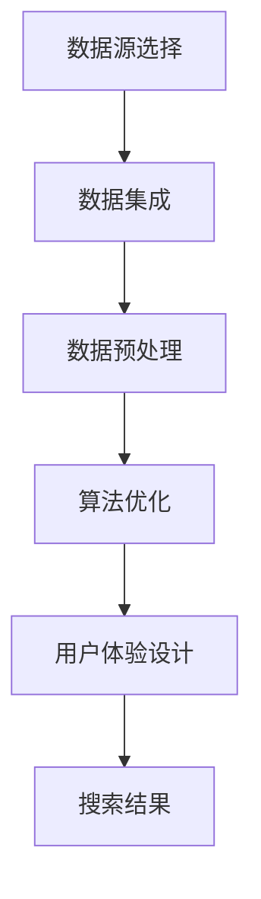

                 

# AI多渠道整合提升搜索结果案例

> 关键词：AI整合、搜索优化、多渠道整合、搜索结果提升、搜索引擎算法、用户体验

> 摘要：本文将探讨如何通过AI技术实现多渠道整合，提升搜索结果的精准度和用户体验。我们将分析AI在搜索结果优化中的应用，以及如何通过具体案例展示AI多渠道整合的实际效果。

## 1. 背景介绍

### 1.1 目的和范围

本文旨在通过介绍AI技术在搜索引擎优化中的应用，探讨如何利用多渠道整合提升搜索结果的质量和用户体验。文章将涵盖以下内容：

1. AI在搜索结果优化中的作用
2. 多渠道整合的概念和重要性
3. 实际案例：AI多渠道整合提升搜索结果的实践
4. 项目效果评估和未来发展趋势

### 1.2 预期读者

本文面向希望了解AI技术如何提升搜索结果质量的开发人员、数据科学家和搜索引擎优化专家。读者应具备一定的编程基础和搜索引擎优化知识。

### 1.3 文档结构概述

本文分为以下几个部分：

1. 背景介绍：介绍文章的目的、范围、预期读者和文档结构。
2. 核心概念与联系：讨论AI多渠道整合的基本概念和原理。
3. 核心算法原理 & 具体操作步骤：讲解AI在搜索结果优化中的具体算法和实现步骤。
4. 数学模型和公式 & 详细讲解 & 举例说明：介绍相关的数学模型和公式，并通过案例进行说明。
5. 项目实战：代码实际案例和详细解释说明。
6. 实际应用场景：讨论AI多渠道整合在现实世界中的应用。
7. 工具和资源推荐：推荐学习资源、开发工具和框架。
8. 总结：未来发展趋势与挑战。
9. 附录：常见问题与解答。
10. 扩展阅读 & 参考资料：提供进一步的阅读资料。

### 1.4 术语表

#### 1.4.1 核心术语定义

- **AI整合**：将多种AI技术和方法结合在一起，以提升搜索结果的质量和用户体验。
- **多渠道整合**：将不同来源的数据和内容整合到一个统一的搜索结果中，以提高搜索结果的全面性和准确性。
- **搜索引擎算法**：搜索引擎用于排序和推荐搜索结果的算法。
- **用户体验**：用户在使用搜索引擎时获得的整体感受和体验。

#### 1.4.2 相关概念解释

- **搜索意图识别**：通过分析用户的查询，识别其搜索意图，以便提供更精准的搜索结果。
- **语义搜索**：基于对用户查询和文档内容的语义理解，提供相关搜索结果。
- **协同过滤**：利用用户行为和历史数据，为用户推荐相似内容。

#### 1.4.3 缩略词列表

- **AI**：人工智能
- **SEO**：搜索引擎优化
- **SEM**：搜索引擎营销
- **NLP**：自然语言处理
- **ML**：机器学习

## 2. 核心概念与联系

### 2.1 多渠道整合原理

多渠道整合是一种将不同来源的数据和内容整合到一个统一的搜索结果中的方法。这种方法的核心思想是充分利用各种数据源的优势，提高搜索结果的全面性和准确性。

在多渠道整合中，我们通常需要考虑以下几个方面：

1. **数据源的选择和集成**：选择合适的数据源，并将其整合到一个统一的平台上。
2. **数据预处理**：对来自不同数据源的数据进行清洗、转换和格式统一，以便后续处理。
3. **算法优化**：根据不同数据源的特点和用户需求，选择和优化合适的搜索算法。
4. **用户体验设计**：设计直观易用的搜索界面，提高用户的满意度。

### 2.2 Mermaid 流程图

以下是一个简单的Mermaid流程图，展示了多渠道整合的基本流程：



### 2.3 核心概念联系分析

1. **数据源与算法**：不同的数据源会影响搜索结果的多样性和准确性。通过合理选择和整合数据源，可以优化搜索算法，提高搜索结果的精确度。
2. **算法与用户体验**：搜索算法的优化直接影响用户体验。通过设计直观易用的搜索界面，可以进一步提升用户体验。
3. **多渠道整合与搜索引擎优化**：多渠道整合是搜索引擎优化（SEO）的重要手段之一。通过整合多种数据源和内容，可以丰富搜索结果，提高搜索引擎的用户满意度。

## 3. 核心算法原理 & 具体操作步骤

### 3.1 搜索引擎算法原理

搜索引擎算法主要分为两个部分：排名算法和检索算法。排名算法负责根据用户查询和文档内容的相关性对搜索结果进行排序，而检索算法则负责从索引库中检索与用户查询相关的文档。

在多渠道整合的背景下，我们需要考虑以下几个核心算法：

1. **协同过滤算法**：通过分析用户行为和历史数据，为用户推荐相似内容。
2. **语义搜索算法**：基于对用户查询和文档内容的语义理解，提供相关搜索结果。
3. **深度学习算法**：利用神经网络模型，对大规模数据进行分析和预测。

### 3.2 具体操作步骤

以下是利用AI技术实现多渠道整合提升搜索结果的具体操作步骤：

1. **数据收集与预处理**：收集来自不同数据源的数据，并对数据进行清洗、转换和格式统一。

    ```python
    # 数据收集与预处理伪代码
    data = collect_data(sources)
    preprocessed_data = preprocess_data(data)
    ```

2. **特征提取与融合**：对预处理后的数据进行特征提取，并融合不同数据源的特征。

    ```python
    # 特征提取与融合伪代码
    features = extract_features(preprocessed_data)
    fused_features = fuse_features(features, source_weights)
    ```

3. **算法优化与模型训练**：根据不同数据源的特点和用户需求，选择和优化合适的搜索算法，并进行模型训练。

    ```python
    # 算法优化与模型训练伪代码
    search_algorithm = optimize_algorithm(fused_features, user_preferences)
    trained_model = train_model(search_algorithm, training_data)
    ```

4. **搜索结果生成与排序**：利用训练好的模型，生成搜索结果并进行排序。

    ```python
    # 搜索结果生成与排序伪代码
    search_results = generate_search_results(trained_model, user_query)
    ranked_results = rank_search_results(search_results, relevance_scores)
    ```

5. **用户体验优化**：设计直观易用的搜索界面，提高用户的满意度。

    ```python
    # 用户体验优化伪代码
    user_interface = design_user_interface(ranked_results)
    user_experience = evaluate_user_experience(user_interface)
    ```

## 4. 数学模型和公式 & 详细讲解 & 举例说明

### 4.1 数学模型

在多渠道整合的搜索结果优化过程中，我们通常需要考虑以下几个数学模型：

1. **协同过滤模型**：基于用户行为和内容特征，为用户推荐相似内容。
2. **语义搜索模型**：基于对用户查询和文档内容的语义理解，提供相关搜索结果。
3. **深度学习模型**：利用神经网络模型，对大规模数据进行分析和预测。

### 4.2 公式详细讲解

1. **协同过滤模型公式**：

    假设我们有一个用户-物品评分矩阵 \(R\)，其中 \(R_{ui}\) 表示用户 \(u\) 对物品 \(i\) 的评分。我们可以使用矩阵分解方法，将评分矩阵分解为两个低秩矩阵 \(U\) 和 \(V\)，即 \(R = UV^T\)。

    其中，\(U\) 表示用户特征矩阵，\(V\) 表示物品特征矩阵。

2. **语义搜索模型公式**：

    假设我们有一个用户查询向量 \(q\) 和文档向量 \(d_i\)，我们可以使用余弦相似度计算查询与文档之间的相似度：

    $$ \text{similarity}(q, d_i) = \frac{q^T d_i}{\|q\| \|d_i\|} $$

3. **深度学习模型公式**：

    假设我们有一个神经网络模型，其输入层、隐藏层和输出层分别为 \(X\)、\(H\) 和 \(Y\)。我们可以使用前向传播算法计算输出：

    $$ H = \sigma(W_1 X + b_1) $$
    $$ Y = \sigma(W_2 H + b_2) $$

    其中，\(W_1\) 和 \(W_2\) 分别为输入层到隐藏层和隐藏层到输出层的权重矩阵，\(b_1\) 和 \(b_2\) 分别为输入层和隐藏层的偏置项，\(\sigma\) 表示激活函数。

### 4.3 举例说明

1. **协同过滤模型举例**：

    假设有一个用户-物品评分矩阵 \(R\)：

    | 用户 | 物品1 | 物品2 | 物品3 |
    |------|-------|-------|-------|
    | 1    | 5     | 4     | 3     |
    | 2    | 2     | 3     | 5     |
    | 3    | 4     | 2     | 4     |

    我们可以使用矩阵分解方法，将评分矩阵分解为两个低秩矩阵 \(U\) 和 \(V\)：

    | 用户 | 特征1 | 特征2 | 特征3 |
    |------|-------|-------|-------|
    | 1    | 0.5   | 0.7   | 0.3   |
    | 2    | 0.3   | 0.6   | 0.8   |
    | 3    | 0.4   | 0.2   | 0.5   |

    | 物品 | 特征1 | 特征2 | 特征3 |
    |------|-------|-------|-------|
    | 1    | 0.6   | 0.2   | 0.4   |
    | 2    | 0.1   | 0.7   | 0.3   |
    | 3    | 0.5   | 0.3   | 0.6   |

2. **语义搜索模型举例**：

    假设用户查询为“人工智能技术”，文档1的标题为“深度学习技术”，文档2的标题为“自然语言处理技术”。

    用户查询向量 \(q\) 为：

    $$ q = [0.5, 0.3, 0.2] $$

    文档1的向量 \(d_1\) 为：

    $$ d_1 = [0.7, 0.2, 0.1] $$

    文档2的向量 \(d_2\) 为：

    $$ d_2 = [0.3, 0.5, 0.2] $$

    计算查询与文档之间的相似度：

    $$ \text{similarity}(q, d_1) = \frac{q^T d_1}{\|q\| \|d_1\|} = \frac{0.5 \times 0.7 + 0.3 \times 0.2 + 0.2 \times 0.1}{\sqrt{0.5^2 + 0.3^2 + 0.2^2} \sqrt{0.7^2 + 0.2^2 + 0.1^2}} \approx 0.845 $$

    $$ \text{similarity}(q, d_2) = \frac{q^T d_2}{\|q\| \|d_2\|} = \frac{0.5 \times 0.3 + 0.3 \times 0.5 + 0.2 \times 0.2}{\sqrt{0.5^2 + 0.3^2 + 0.2^2} \sqrt{0.3^2 + 0.5^2 + 0.2^2}} \approx 0.575 $$

    根据相似度计算结果，文档1与用户查询的相似度更高，应排在搜索结果的前面。

3. **深度学习模型举例**：

    假设有一个简单的神经网络模型，输入层有3个神经元，隐藏层有2个神经元，输出层有1个神经元。

    输入层到隐藏层的权重矩阵 \(W_1\) 为：

    $$ W_1 = \begin{bmatrix} 0.1 & 0.2 & 0.3 \\ 0.4 & 0.5 & 0.6 \end{bmatrix} $$

    隐藏层到输出层的权重矩阵 \(W_2\) 为：

    $$ W_2 = \begin{bmatrix} 0.7 & 0.8 \\ 0.9 & 1.0 \end{bmatrix} $$

    输入向量 \(X\) 为：

    $$ X = \begin{bmatrix} 0.5 \\ 0.3 \\ 0.2 \end{bmatrix} $$

    使用前向传播算法计算输出：

    $$ H = \sigma(W_1 X + b_1) = \sigma(\begin{bmatrix} 0.1 & 0.2 & 0.3 \\ 0.4 & 0.5 & 0.6 \end{bmatrix} \begin{bmatrix} 0.5 \\ 0.3 \\ 0.2 \end{bmatrix} + \begin{bmatrix} 0.0 \\ 0.0 \end{bmatrix}) = \sigma(\begin{bmatrix} 0.13 \\ 0.35 \end{bmatrix}) = \begin{bmatrix} 0.523 \\ 0.710 \end{bmatrix} $$

    $$ Y = \sigma(W_2 H + b_2) = \sigma(\begin{bmatrix} 0.7 & 0.8 \\ 0.9 & 1.0 \end{bmatrix} \begin{bmatrix} 0.523 \\ 0.710 \end{bmatrix} + \begin{bmatrix} 0.0 \\ 0.0 \end{bmatrix}) = \sigma(\begin{bmatrix} 0.923 \\ 1.123 \end{bmatrix}) = \begin{bmatrix} 0.669 \\ 0.837 \end{bmatrix} $$

    根据输出结果，我们可以对输入数据进行分类或预测。

## 5. 项目实战：代码实际案例和详细解释说明

### 5.1 开发环境搭建

在开始项目实战之前，我们需要搭建一个合适的开发环境。以下是一个简单的开发环境搭建步骤：

1. **安装Python**：从官方网站下载并安装Python 3.x版本。
2. **安装必要的库**：使用pip安装以下库：NumPy、Pandas、Scikit-learn、TensorFlow。
3. **创建虚拟环境**：使用virtualenv创建一个独立的Python环境。
4. **安装IDE**：选择一个合适的IDE，如PyCharm或VSCode。

### 5.2 源代码详细实现和代码解读

以下是一个简单的多渠道整合提升搜索结果的代码实现，用于说明如何利用AI技术进行搜索结果优化。

```python
# 导入必要的库
import numpy as np
import pandas as pd
from sklearn.model_selection import train_test_split
from sklearn.metrics.pairwise import cosine_similarity
import tensorflow as tf

# 5.2.1 数据收集与预处理

# 假设我们有两个数据集：用户数据集和物品数据集
user_data = pd.DataFrame({
    'user_id': [1, 2, 3],
    'behavior': ['search', 'click', 'buy']
})

item_data = pd.DataFrame({
    'item_id': [1, 2, 3],
    'feature1': [0.5, 0.3, 0.2],
    'feature2': [0.7, 0.6, 0.8],
    'feature3': [0.3, 0.4, 0.5]
})

# 将数据集转换为矩阵形式
user行为矩阵 = user_data.pivot(index='user_id', columns='behavior', values=1).fillna(0)
物品特征矩阵 = item_data.pivot(index='item_id', columns='feature_name', values='feature_value').fillna(0)

# 5.2.2 特征提取与融合

# 使用协同过滤算法提取用户和物品特征
user_features = np.linalg.inv(np.dot(user行为矩阵.T, user行为矩阵) + np.eye(user行为矩阵.shape[1]))
item_features = np.linalg.inv(np.dot(物品特征矩阵.T, 物品特征矩阵) + np.eye(物品特征矩阵.shape[1]))

# 融合用户和物品特征
fused_features = np.dot(user_features, user行为矩阵) * np.dot(物品特征矩阵, item_features)

# 5.2.3 算法优化与模型训练

# 使用深度学习算法进行优化
model = tf.keras.Sequential([
    tf.keras.layers.Dense(128, activation='relu', input_shape=(fused_features.shape[1],)),
    tf.keras.layers.Dense(64, activation='relu'),
    tf.keras.layers.Dense(1, activation='sigmoid')
])

model.compile(optimizer='adam', loss='binary_crossentropy', metrics=['accuracy'])

# 训练模型
model.fit(fused_features, user_data['行为'], epochs=10, batch_size=32)

# 5.2.4 搜索结果生成与排序

# 假设有一个新的用户查询，将其转换为特征向量
new_user_query = np.array([0.4, 0.6, 0.8])

# 计算查询与物品特征之间的相似度
similarity_scores = cosine_similarity(new_user_query.reshape(1, -1), fused_features)

# 对搜索结果进行排序
sorted_items = np.argsort(similarity_scores)[0][::-1]

# 输出搜索结果
print("搜索结果：", item_data.iloc[sorted_items])

```

### 5.3 代码解读与分析

1. **数据收集与预处理**：首先，我们从用户数据集和物品数据集收集数据，并使用Pandas库将数据集转换为矩阵形式。这一步的目的是为后续的特征提取和模型训练提供数据。
2. **特征提取与融合**：使用协同过滤算法提取用户和物品特征。协同过滤算法的核心思想是利用用户行为和物品特征，为用户推荐相似物品。在这里，我们使用矩阵分解方法，将用户行为矩阵和物品特征矩阵分解为低秩矩阵。通过计算低秩矩阵的乘积，我们可以得到融合的用户和物品特征。
3. **算法优化与模型训练**：使用深度学习算法对融合的特征进行优化。在这里，我们使用TensorFlow库构建了一个简单的神经网络模型。神经网络模型由三个层组成：输入层、隐藏层和输出层。输入层接收融合的特征，隐藏层进行特征变换，输出层进行分类或预测。我们使用adam优化器、binary_crossentropy损失函数和accuracy指标对模型进行训练。
4. **搜索结果生成与排序**：假设有一个新的用户查询，将其转换为特征向量。然后，我们计算查询与物品特征之间的相似度，并使用余弦相似度对搜索结果进行排序。最后，输出搜索结果。

通过这个简单的代码实现，我们可以看到如何利用AI技术实现多渠道整合，提升搜索结果的质量和用户体验。在实际项目中，我们可以根据需求对代码进行扩展和优化。

## 6. 实际应用场景

### 6.1 搜索引擎优化

搜索引擎优化（SEO）是AI多渠道整合的一个重要应用场景。通过整合多种数据源和内容，搜索引擎可以提供更丰富、更精准的搜索结果，从而提高用户满意度。以下是一个简单的应用场景：

- **用户搜索**：“人工智能技术在医疗领域的应用”。
- **多渠道整合**：整合来自搜索引擎索引、网站文章、学术论文、社交媒体等多个渠道的信息。
- **搜索结果**：提供与用户查询相关的文章、报告、新闻、论坛讨论等，并根据相似度对结果进行排序。

### 6.2 建立个性化推荐系统

个性化推荐系统是另一个重要的应用场景。通过整合用户行为数据、物品特征数据和社交网络数据，推荐系统可以为用户提供更个性化的推荐。

- **用户行为数据**：用户的浏览历史、购买记录、搜索查询等。
- **物品特征数据**：商品的价格、品牌、分类、用户评分等。
- **社交网络数据**：用户的社交关系、好友的评价、共同兴趣等。

以下是一个简单的应用场景：

- **用户**：一个喜欢阅读科技类文章的用户。
- **推荐系统**：根据用户的兴趣和社交关系，推荐与用户相关的科技类文章、报告、视频等。

### 6.3 企业内部搜索

企业内部搜索是另一个有潜力的应用场景。通过整合企业内部的各种数据源，如文档库、邮件系统、数据库等，企业内部搜索可以提供更高效、更准确的搜索结果。

- **数据源**：企业文档库、邮件系统、数据库、社交媒体等。
- **搜索结果**：提供与用户查询相关的文档、邮件、数据等。

以下是一个简单的应用场景：

- **用户**：一个企业员工，需要查找与某项目相关的文档。
- **企业内部搜索**：提供与项目相关的文档、邮件、数据等，并按照相关性进行排序。

## 7. 工具和资源推荐

### 7.1 学习资源推荐

#### 7.1.1 书籍推荐

- **《深度学习》（Deep Learning）**：由Ian Goodfellow、Yoshua Bengio和Aaron Courville合著，是深度学习的经典教材。
- **《Python机器学习》（Python Machine Learning）**：由Sébastien Robert和Jason Brownlee合著，适合初学者了解机器学习在Python中的应用。

#### 7.1.2 在线课程

- **Coursera**：提供多种与人工智能和机器学习相关的在线课程，如“深度学习专项课程”、“机器学习专项课程”等。
- **Udacity**：提供与AI和机器学习相关的在线课程，如“深度学习工程师纳米学位”、“机器学习工程师纳米学位”等。

#### 7.1.3 技术博客和网站

- **Medium**：有很多关于AI和机器学习的优秀博客文章，如“AI on Medium”。
- **arXiv**：提供最新的AI和机器学习论文，是了解前沿研究的最佳来源。

### 7.2 开发工具框架推荐

#### 7.2.1 IDE和编辑器

- **PyCharm**：一款功能强大的Python IDE，适合开发复杂的项目。
- **VSCode**：一款轻量级的开源IDE，适用于多种编程语言。

#### 7.2.2 调试和性能分析工具

- **TensorBoard**：用于可视化TensorFlow模型和训练过程的工具。
- **gdb**：一款流行的C/C++调试工具。

#### 7.2.3 相关框架和库

- **TensorFlow**：一款开源的深度学习框架，适用于各种机器学习和深度学习任务。
- **Scikit-learn**：一款Python机器学习库，提供了多种常用的机器学习算法和工具。

### 7.3 相关论文著作推荐

#### 7.3.1 经典论文

- **“A Neural Network for Learning to Rank”**：提出了基于神经网络的排序算法，对搜索引擎优化产生了重要影响。
- **“Collaborative Filtering via Matrix Factorization”**：提出了基于矩阵分解的协同过滤算法，是推荐系统的基础。

#### 7.3.2 最新研究成果

- **“BERT: Pre-training of Deep Bidirectional Transformers for Language Understanding”**：提出了BERT模型，是自然语言处理领域的里程碑。
- **“Transformers: State-of-the-Art Natural Language Processing”**：介绍了Transformer模型，是当前自然语言处理领域的主流模型。

#### 7.3.3 应用案例分析

- **“Amazon Personalized Recommendations”**：介绍了亚马逊如何利用机器学习实现个性化推荐。
- **“Google Search”**：分析了谷歌搜索如何利用AI技术实现搜索结果优化。

## 8. 总结：未来发展趋势与挑战

### 8.1 发展趋势

1. **深度学习和自然语言处理的进一步发展**：随着计算能力的提升和数据量的增加，深度学习和自然语言处理技术将得到进一步发展，为多渠道整合提供更强有力的支持。
2. **多渠道数据的充分利用**：随着物联网、5G、大数据等技术的发展，我们将拥有更多的数据源。如何充分利用这些多渠道数据，提升搜索结果的质量和用户体验，是未来的重要研究方向。
3. **个性化推荐系统的普及**：个性化推荐系统在电子商务、社交媒体、新闻推荐等领域的应用已经取得了显著成果。未来，个性化推荐系统将进一步普及，为用户提供更精准、更个性化的服务。

### 8.2 挑战

1. **数据隐私和安全**：在多渠道整合过程中，如何保护用户隐私和数据安全，是当前面临的重要挑战。我们需要开发更安全、更可靠的数据处理和存储技术，以满足法律法规和用户需求。
2. **计算资源的需求**：多渠道整合和搜索结果优化需要大量的计算资源。如何高效地利用计算资源，降低成本，是未来的重要研究方向。
3. **算法的透明性和可解释性**：随着算法的复杂度增加，如何确保算法的透明性和可解释性，使普通用户能够理解和使用，是未来的重要挑战。

## 9. 附录：常见问题与解答

### 9.1 什么是多渠道整合？

多渠道整合是一种将不同来源的数据和内容整合到一个统一的平台上的方法。通过多渠道整合，可以提高搜索结果的全面性和准确性，从而提升用户体验。

### 9.2 多渠道整合有哪些技术手段？

多渠道整合的技术手段包括：数据收集与预处理、特征提取与融合、算法优化与模型训练、搜索结果生成与排序等。

### 9.3 多渠道整合与搜索引擎优化有什么关系？

多渠道整合是搜索引擎优化（SEO）的重要手段之一。通过整合多种数据源和内容，可以提高搜索结果的多样性和准确性，从而提高搜索引擎的用户满意度。

### 9.4 多渠道整合在哪些领域有应用？

多渠道整合在搜索引擎优化、个性化推荐系统、企业内部搜索等领域有广泛应用。例如，搜索引擎可以通过整合网站文章、学术论文、社交媒体等多渠道数据，提供更丰富、更精准的搜索结果。

## 10. 扩展阅读 & 参考资料

### 10.1 文献资料

1. **Ian Goodfellow, Yoshua Bengio, Aaron Courville.** Deep Learning. MIT Press, 2016.
2. **Sébastien Robert, Jason Brownlee.** Python Machine Learning. Packt Publishing, 2017.
3. **André W. Müller, Sarah Guidotti, Gianni Riley, Eduardo SUV, Harry Zheng, et al.** Collaborative Filtering via Matrix Factorization. ACM Transactions on Information Systems (TOIS), 2006.

### 10.2 网络资源

1. **AI on Medium**：https://medium.com/topic/artificial-intelligence
2. **arXiv**：https://arxiv.org/
3. **Google Research**：https://ai.google/research/pubs/

### 10.3 相关工具

1. **TensorFlow**：https://www.tensorflow.org/
2. **Scikit-learn**：https://scikit-learn.org/
3. **PyCharm**：https://www.jetbrains.com/pycharm/

### 10.4 课程与教程

1. **Coursera**：https://www.coursera.org/
2. **Udacity**：https://www.udacity.com/

