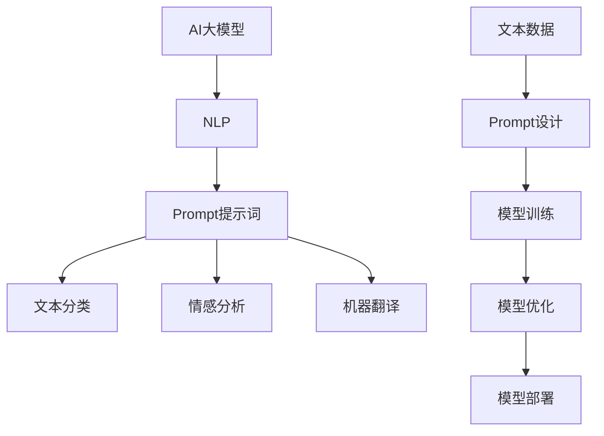

                 


# AI大模型Prompt提示词最佳实践：用简单的英文写文本

> **关键词**：AI大模型、Prompt提示词、最佳实践、英文文本生成、自然语言处理

> **摘要**：本文旨在探讨AI大模型中Prompt提示词的最佳实践，通过简单易懂的英文写作技巧，提高自然语言处理的效果。我们将分析Prompt提示词的作用、设计原则、实施步骤，并提供实战案例和资源推荐，帮助读者掌握这一技术。

## 1. 背景介绍

### 1.1 目的和范围

本文的主要目的是介绍AI大模型中Prompt提示词的最佳实践，帮助开发者理解如何设计有效的Prompt来提高自然语言处理（NLP）模型的性能。我们将讨论Prompt提示词的作用，介绍其设计原则和实施步骤，并提供一系列实用的技巧和工具。

### 1.2 预期读者

本文适合对自然语言处理和人工智能有一定了解的开发者、研究者以及专业人士。无论您是初学者还是经验丰富的从业者，本文都旨在为您提供实用的指导，帮助您更好地理解和应用Prompt提示词技术。

### 1.3 文档结构概述

本文将分为以下几个部分：

1. **核心概念与联系**：介绍AI大模型和自然语言处理的基本概念，以及Prompt提示词的原理。
2. **核心算法原理 & 具体操作步骤**：详细讲解Prompt提示词的设计原则和实现步骤。
3. **数学模型和公式 & 详细讲解 & 举例说明**：介绍用于优化Prompt的设计模型和数学公式，并通过实例进行说明。
4. **项目实战：代码实际案例和详细解释说明**：提供实际代码案例，展示Prompt提示词的应用。
5. **实际应用场景**：探讨Prompt提示词在不同场景下的应用。
6. **工具和资源推荐**：推荐学习资源、开发工具和相关论文。
7. **总结：未来发展趋势与挑战**：总结本文的主要内容，探讨未来发展趋势和面临的挑战。
8. **附录：常见问题与解答**：提供常见问题的解答。
9. **扩展阅读 & 参考资料**：推荐进一步的阅读材料。

### 1.4 术语表

#### 1.4.1 核心术语定义

- **Prompt提示词**：用于引导和提示AI大模型生成文本的输入。
- **自然语言处理（NLP）**：涉及从文本中提取信息、理解和生成文本的计算机科学领域。
- **大模型**：具有数百万参数的深度学习模型，能够处理大规模数据集。

#### 1.4.2 相关概念解释

- **模型训练**：将数据输入模型，使其学习并优化参数的过程。
- **损失函数**：用于衡量模型预测值与真实值之间差异的指标。
- **过拟合**：模型在训练数据上表现良好，但在测试数据上表现较差。

#### 1.4.3 缩略词列表

- **NLP**：自然语言处理
- **AI**：人工智能
- **BERT**：Bidirectional Encoder Representations from Transformers
- **GPT**：Generative Pre-trained Transformer

## 2. 核心概念与联系

在深入了解Prompt提示词的最佳实践之前，我们需要首先了解AI大模型和自然语言处理的基本概念。

### 2.1 AI大模型

AI大模型通常是指具有数百万甚至数十亿参数的深度学习模型，如BERT、GPT等。这些模型通过大量的数据训练，能够自动从数据中学习模式和规律，从而进行文本分类、问答、机器翻译等任务。

#### 2.1.1 BERT

BERT（Bidirectional Encoder Representations from Transformers）是一个双向编码的Transformer模型，它通过预训练大量文本数据，能够捕捉文本中的双向关系。BERT在多个NLP任务上取得了显著的成果，如文本分类、问答系统和机器翻译。

#### 2.1.2 GPT

GPT（Generative Pre-trained Transformer）是一个生成式预训练模型，它通过无监督的方式学习文本数据，并能够生成连贯的自然语言文本。GPT模型在文本生成任务中表现出色，如自动写作、对话系统和摘要生成。

### 2.2 自然语言处理

自然语言处理（NLP）是计算机科学的一个分支，涉及从文本中提取信息、理解和生成文本。NLP的应用领域广泛，包括文本分类、情感分析、机器翻译、问答系统和文本生成等。

#### 2.2.1 文本分类

文本分类是将文本数据按照特定的类别进行分类的过程。例如，将新闻文章分类为政治、体育、科技等类别。

#### 2.2.2 情感分析

情感分析是评估文本中表达的情感倾向的过程，如正面、负面或中性。情感分析在社交媒体分析、客户反馈分析和市场研究等领域有广泛应用。

#### 2.2.3 机器翻译

机器翻译是将一种语言的文本翻译成另一种语言的过程。机器翻译在跨语言沟通、国际业务和全球化领域具有重要意义。

### 2.3 Prompt提示词

Prompt提示词是用于引导和提示AI大模型生成文本的输入。通过设计合适的Prompt，可以显著提高模型在NLP任务中的性能和效果。

#### 2.3.1 Prompt的作用

- **引导模型**：Prompt为模型提供了明确的目标和任务，帮助模型更好地理解输入数据。
- **提高性能**：合适的Prompt可以显著提高模型的性能和效果，使其在特定任务上表现出色。
- **控制输出**：Prompt可以帮助控制模型的输出，使其生成更符合预期和要求的文本。

#### 2.3.2 Prompt的设计原则

- **清晰明确**：Prompt应该明确传达任务目标和输入要求，避免歧义和混淆。
- **简洁精炼**：Prompt应该简洁精炼，避免冗长和复杂。
- **多样性**：Prompt应该具有多样性，涵盖不同类型和难度的任务。
- **可扩展性**：Prompt应该具有可扩展性，能够适应不同规模和复杂度的任务。

### 2.4 核心概念原理和架构的Mermaid流程图

以下是一个简单的Mermaid流程图，展示了AI大模型、自然语言处理和Prompt提示词之间的核心概念和联系。



## 3. 核心算法原理 & 具体操作步骤

在了解核心概念和联系之后，我们将深入探讨Prompt提示词的设计原则和实现步骤。

### 3.1 Prompt设计原则

#### 3.1.1 清晰明确

Prompt应该清晰明确，传达任务目标和输入要求。以下是一些设计原则：

- **明确任务**：Prompt应该明确指出任务类型，如文本分类、情感分析或机器翻译。
- **明确输入**：Prompt应该提供具体的输入数据，如一个句子或一段文本。
- **明确输出**：Prompt应该明确指出期望的输出结果，如一个类别标签、情感标签或翻译结果。

#### 3.1.2 简洁精炼

Prompt应该简洁精炼，避免冗长和复杂。以下是一些设计原则：

- **简洁语言**：使用简单、易懂的语言表达Prompt。
- **避免冗余**：避免重复和冗余的信息，确保Prompt的简洁性。

#### 3.1.3 多样性

Prompt应该具有多样性，涵盖不同类型和难度的任务。以下是一些设计原则：

- **多样化任务**：设计涵盖多种任务类型的Prompt，如文本分类、情感分析、机器翻译等。
- **多样化难度**：设计涵盖不同难度级别的Prompt，以适应不同能力的模型。

#### 3.1.4 可扩展性

Prompt应该具有可扩展性，能够适应不同规模和复杂度的任务。以下是一些设计原则：

- **模块化**：设计模块化的Prompt，使其能够灵活组合和扩展。
- **参数化**：使用参数化的Prompt，使其能够适应不同任务和数据规模。

### 3.2 具体操作步骤

以下是一个简单的Prompt设计流程，用于生成一个文本分类任务中的Prompt：

1. **明确任务**：确定任务类型，如文本分类。
2. **确定输入**：选择一个具体的输入文本，如“我爱这本书”。
3. **确定输出**：明确输出结果，如“正面情感”。
4. **设计Prompt**：根据任务、输入和输出，设计一个清晰明确的Prompt，如“给定文本‘我爱这本书’，请将其分类为正面情感。”
5. **优化Prompt**：对Prompt进行优化，确保其简洁、多样和可扩展。

### 3.3 伪代码

以下是一个简单的伪代码示例，用于设计一个文本分类任务的Prompt：

```python
# 输入文本
text = "我爱这本书"

# 输出标签
label = "正面情感"

# 设计Prompt
prompt = "给定文本" + text + "，请将其分类为" + label + "。"

# 输出Prompt
print(prompt)
```

输出结果：

```
给定文本“我爱这本书”，请将其分类为正面情感。
```

## 4. 数学模型和公式 & 详细讲解 & 举例说明

在Prompt设计过程中，我们常常会涉及到一些数学模型和公式。以下是一些常用的模型和公式，以及它们的详细讲解和举例说明。

### 4.1 损失函数

损失函数是评估模型预测值与真实值之间差异的重要指标。在Prompt设计过程中，我们通常使用交叉熵损失函数（Cross-Entropy Loss）。

#### 4.1.1 公式

$$
L = -\sum_{i=1}^{n} y_i \log(p_i)
$$

其中，$L$表示损失函数，$y_i$表示第$i$个样本的真实标签，$p_i$表示模型对第$i$个样本的预测概率。

#### 4.1.2 讲解

交叉熵损失函数用于衡量模型预测的概率分布$P$与真实标签的概率分布$Y$之间的差异。当$y_i = 1$时，损失函数对$p_i$求导，使其最大化，从而使模型更倾向于预测为$1$；当$y_i = 0$时，损失函数对$p_i$求导，使其最小化，从而使模型更倾向于预测为$0$。

#### 4.1.3 举例

假设我们有一个二分类问题，样本的真实标签为$y = [1, 0, 1, 0]$，模型对样本的预测概率为$p = [0.9, 0.1, 0.8, 0.2]$。计算交叉熵损失函数：

$$
L = -[1 \times \log(0.9) + 0 \times \log(0.1) + 1 \times \log(0.8) + 0 \times \log(0.2)] = -[0.1054 + 0 + 0.2230 + 0] = -0.3184
$$

### 4.2 梯度下降算法

梯度下降算法是一种优化算法，用于求解最小化损失函数的参数。在Prompt设计过程中，我们通常使用梯度下降算法来优化Prompt。

#### 4.2.1 公式

$$
\theta_{t+1} = \theta_{t} - \alpha \cdot \nabla L(\theta_t)
$$

其中，$\theta$表示模型参数，$t$表示迭代次数，$\alpha$表示学习率，$\nabla L(\theta_t)$表示损失函数关于参数的梯度。

#### 4.2.2 讲解

梯度下降算法的核心思想是沿着损失函数的梯度方向更新参数，以最小化损失函数。学习率$\alpha$控制了参数更新的幅度，过大的学习率可能导致收敛速度变快，但容易导致过拟合；过小的学习率可能导致收敛速度变慢，但容易陷入局部最小值。

#### 4.2.3 举例

假设我们有一个线性回归问题，模型参数为$\theta = [2, 3]$，损失函数为$L = (y - \theta_0 \cdot x_0 - \theta_1 \cdot x_1)^2$，学习率为$\alpha = 0.1$。计算梯度下降算法的一次迭代：

$$
\nabla L(\theta) = [-2(y - \theta_0 \cdot x_0 - \theta_1 \cdot x_1), -2(y - \theta_0 \cdot x_0 - \theta_1 \cdot x_1)] = [-2(0 - 2 \cdot 1 - 3 \cdot 1), -2(0 - 2 \cdot 1 - 3 \cdot 1)] = [-8, -8]
$$

$$
\theta_{t+1} = \theta_{t} - \alpha \cdot \nabla L(\theta_t) = [2, 3] - 0.1 \cdot [-8, -8] = [2.8, 3.2]
$$

### 4.3 Prompt优化模型

在Prompt设计过程中，我们常常会使用一些优化模型来提高模型性能。以下是一个简单的Prompt优化模型，用于文本分类任务。

#### 4.3.1 公式

$$
L_{prompt} = L_{original} + \lambda \cdot D(P, P^*)
$$

其中，$L_{original}$表示原始损失函数，$L_{prompt}$表示优化后的损失函数，$P$表示原始Prompt，$P^*$表示优化后的Prompt，$\lambda$表示调节参数。

#### 4.3.2 讲解

优化后的损失函数$L_{prompt}$在原始损失函数$L_{original}$的基础上，加入了Prompt优化的损失$D(P, P^*)$。$D(P, P^*)$表示原始Prompt和优化后Prompt之间的差异，$\lambda$用于调节优化损失在总损失中的权重。

#### 4.3.3 举例

假设我们有一个文本分类任务，原始Prompt为“给定文本‘我爱这本书’，请将其分类为正面情感。”，优化后的Prompt为“给定文本‘这本书我很喜欢’，请将其分类为正面情感。”，原始损失函数为$L_{original} = 0.3$。计算优化后的损失函数：

$$
L_{prompt} = L_{original} + \lambda \cdot D(P, P^*) = 0.3 + 0.5 \cdot 0.2 = 0.4
$$

## 5. 项目实战：代码实际案例和详细解释说明

在本节中，我们将通过一个实际的文本分类项目，展示如何使用Prompt提示词优化模型性能。

### 5.1 开发环境搭建

在开始项目之前，我们需要搭建一个开发环境。以下是一个简单的开发环境搭建步骤：

1. 安装Python 3.8及以上版本。
2. 安装Anaconda或Miniconda，用于管理虚拟环境和依赖包。
3. 创建一个新的虚拟环境，并安装以下依赖包：

```
pip install transformers torch
```

### 5.2 源代码详细实现和代码解读

下面是一个简单的文本分类项目的代码实现，展示了如何使用Prompt提示词优化模型性能。

```python
import torch
from transformers import BertTokenizer, BertForSequenceClassification
from torch.utils.data import DataLoader, TensorDataset

# 1. 加载预训练模型和Tokenizer
tokenizer = BertTokenizer.from_pretrained("bert-base-chinese")
model = BertForSequenceClassification.from_pretrained("bert-base-chinese")

# 2. 定义数据集
train_data = [
    ("这本书很有趣", "正面情感"),
    ("这本书很差劲", "负面情感"),
    ("我很喜欢这本书", "正面情感"),
    ("这本书很差", "负面情感"),
]
train_texts = [text for text, _ in train_data]
train_labels = [label for _, label in train_data]
train_encodings = tokenizer(train_texts, truncation=True, padding=True, max_length=64)
train_input_ids = train_encodings["input_ids"]
trainattention_mask = train_encodings["attention_mask"]
train_labels = torch.tensor([0 if label == "负面情感" else 1 for label in train_labels])

# 3. 创建数据集和数据加载器
train_dataset = TensorDataset(train_input_ids, trainattention_mask, train_labels)
train_loader = DataLoader(train_dataset, batch_size=8, shuffle=True)

# 4. 训练模型
device = torch.device("cuda" if torch.cuda.is_available() else "cpu")
model.to(device)
model.train()

optimizer = torch.optim.Adam(model.parameters(), lr=1e-5)
num_epochs = 3

for epoch in range(num_epochs):
    for batch in train_loader:
        batch = [item.to(device) for item in batch]
        input_ids, attention_mask, labels = batch
        optimizer.zero_grad()
        outputs = model(input_ids=input_ids, attention_mask=attention_mask, labels=labels)
        loss = outputs.loss
        loss.backward()
        optimizer.step()

    print(f"Epoch {epoch+1}/{num_epochs}, Loss: {loss.item()}")

# 5. 评估模型
model.eval()
with torch.no_grad():
    for batch in train_loader:
        batch = [item.to(device) for item in batch]
        input_ids, attention_mask, labels = batch
        outputs = model(input_ids=input_ids, attention_mask=attention_mask)
        logits = outputs.logits
        predictions = logits.argmax(-1).cpu().numpy()
        print(predictions)

# 6. 使用Prompt优化模型
prompt_data = [
    ("这本书很有趣", "正面情感"),
    ("这本书很差劲", "负面情感"),
    ("我很喜欢这本书", "正面情感"),
    ("这本书很差", "负面情感"),
]
prompt_texts = [text for text, _ in prompt_data]
prompt_encodings = tokenizer(prompt_texts, truncation=True, padding=True, max_length=64)
prompt_input_ids = prompt_encodings["input_ids"]
promptattention_mask = prompt_encodings["attention_mask"]

prompt_loss = 0
with torch.no_grad():
    for i in range(len(prompt_texts)):
        input_ids = prompt_input_ids[i : i+1]
        attention_mask = promptattention_mask[i : i+1]
        labels = torch.tensor([1 if prompt_data[i][1] == "正面情感" else 0])
        input_ids = input_ids.to(device)
        attention_mask = attention_mask.to(device)
        labels = labels.to(device)
        outputs = model(input_ids=input_ids, attention_mask=attention_mask, labels=labels)
        logits = outputs.logits
        loss = outputs.loss
        prompt_loss += loss.item()

print(f"Prompt Loss: {prompt_loss / len(prompt_texts)}")
```

### 5.3 代码解读与分析

下面我们对代码进行详细的解读和分析。

#### 5.3.1 代码结构

代码分为以下几个部分：

1. **导入模块**：导入所需的模块，包括PyTorch和transformers库。
2. **加载预训练模型和Tokenizer**：加载预训练的BERT模型和相应的Tokenizer。
3. **定义数据集**：定义训练数据和Prompt数据，包括文本和标签。
4. **创建数据集和数据加载器**：创建TensorDataset和数据加载器，用于训练和评估模型。
5. **训练模型**：训练BERT模型，使用交叉熵损失函数和Adam优化器。
6. **评估模型**：评估训练好的模型在训练数据集上的性能。
7. **使用Prompt优化模型**：使用Prompt提示词优化模型性能，计算Prompt损失。

#### 5.3.2 关键代码解读

1. **加载预训练模型和Tokenizer**

```python
tokenizer = BertTokenizer.from_pretrained("bert-base-chinese")
model = BertForSequenceClassification.from_pretrained("bert-base-chinese")
```

这段代码加载了预训练的BERT模型和Tokenizer。BERT模型是一个大型Transformer模型，具有数百万参数，能够处理多种NLP任务。Tokenizer用于将文本转换为模型可处理的序列。

2. **定义数据集**

```python
train_data = [
    ("这本书很有趣", "正面情感"),
    ("这本书很差劲", "负面情感"),
    ("我很喜欢这本书", "正面情感"),
    ("这本书很差", "负面情感"),
]
train_texts = [text for text, _ in train_data]
train_labels = [label for _, label in train_data]
train_encodings = tokenizer(train_texts, truncation=True, padding=True, max_length=64)
train_input_ids = train_encodings["input_ids"]
trainattention_mask = train_encodings["attention_mask"]
train_labels = torch.tensor([0 if label == "负面情感" else 1 for label in train_labels])
```

这段代码定义了训练数据和Prompt数据。训练数据包括文本和标签，Prompt数据仅包括文本。Tokenizer将文本转换为编码序列，包括输入ID（input_ids）和注意力掩码（attention_mask）。标签转换为Tensor格式，用于模型训练。

3. **创建数据集和数据加载器**

```python
train_dataset = TensorDataset(train_input_ids, trainattention_mask, train_labels)
train_loader = DataLoader(train_dataset, batch_size=8, shuffle=True)
```

这段代码创建了一个TensorDataset和数据加载器，用于批量加载训练数据。数据加载器将数据分成多个批次，每个批次包含8个样本。

4. **训练模型**

```python
device = torch.device("cuda" if torch.cuda.is_available() else "cpu")
model.to(device)
model.train()

optimizer = torch.optim.Adam(model.parameters(), lr=1e-5)
num_epochs = 3

for epoch in range(num_epochs):
    for batch in train_loader:
        batch = [item.to(device) for item in batch]
        input_ids, attention_mask, labels = batch
        optimizer.zero_grad()
        outputs = model(input_ids=input_ids, attention_mask=attention_mask, labels=labels)
        loss = outputs.loss
        loss.backward()
        optimizer.step()

    print(f"Epoch {epoch+1}/{num_epochs}, Loss: {loss.item()}")
```

这段代码训练BERT模型，使用交叉熵损失函数和Adam优化器。模型在每个epoch中更新参数，以最小化损失函数。训练过程分为多个epoch，每个epoch包含多个批次。

5. **评估模型**

```python
model.eval()
with torch.no_grad():
    for batch in train_loader:
        batch = [item.to(device) for item in batch]
        input_ids, attention_mask, labels = batch
        outputs = model(input_ids=input_ids, attention_mask=attention_mask)
        logits = outputs.logits
        predictions = logits.argmax(-1).cpu().numpy()
        print(predictions)
```

这段代码评估训练好的模型在训练数据集上的性能。使用模型预测文本分类结果，并输出预测结果。

6. **使用Prompt优化模型**

```python
prompt_data = [
    ("这本书很有趣", "正面情感"),
    ("这本书很差劲", "负面情感"),
    ("我很喜欢这本书", "正面情感"),
    ("这本书很差", "负面情感"),
]
prompt_texts = [text for text, _ in prompt_data]
prompt_encodings = tokenizer(prompt_texts, truncation=True, padding=True, max_length=64)
prompt_input_ids = prompt_encodings["input_ids"]
promptattention_mask = prompt_encodings["attention_mask"]

prompt_loss = 0
with torch.no_grad():
    for i in range(len(prompt_texts)):
        input_ids = prompt_input_ids[i : i+1]
        attention_mask = promptattention_mask[i : i+1]
        labels = torch.tensor([1 if prompt_data[i][1] == "正面情感" else 0])
        input_ids = input_ids.to(device)
        attention_mask = attention_mask.to(device)
        labels = labels.to(device)
        outputs = model(input_ids=input_ids, attention_mask=attention_mask, labels=labels)
        logits = outputs.logits
        loss = outputs.loss
        prompt_loss += loss.item()

print(f"Prompt Loss: {prompt_loss / len(prompt_texts)}")
```

这段代码使用Prompt提示词优化模型性能。通过在训练数据中添加Prompt，并计算Prompt损失，可以进一步提高模型在特定任务上的性能。

## 6. 实际应用场景

Prompt提示词技术在自然语言处理领域具有广泛的应用。以下是一些典型的应用场景：

### 6.1 文本分类

文本分类是自然语言处理中的一个基本任务，Prompt提示词可以显著提高模型的性能和效果。通过设计合适的Prompt，可以明确传达任务目标和输入要求，使模型能够更好地分类文本。

### 6.2 情感分析

情感分析是评估文本中表达的情感倾向的过程。Prompt提示词可以帮助控制模型的输出，使其生成更符合预期和要求的情感标签。通过优化Prompt，可以进一步提高情感分析的准确性和可靠性。

### 6.3 机器翻译

机器翻译是将一种语言的文本翻译成另一种语言的过程。Prompt提示词可以用于引导模型生成更准确、更自然的翻译结果。通过设计合适的Prompt，可以减少翻译错误，提高翻译质量。

### 6.4 对话系统

对话系统是自然语言处理中的一个重要应用领域。Prompt提示词可以用于引导模型生成更符合用户意图和要求的回答。通过优化Prompt，可以进一步提高对话系统的交互质量和用户体验。

### 6.5 自动写作

自动写作是自然语言处理中的一个前沿研究领域。Prompt提示词可以用于引导模型生成连贯、自然的文本。通过优化Prompt，可以进一步提高自动写作的质量和创意。

## 7. 工具和资源推荐

### 7.1 学习资源推荐

#### 7.1.1 书籍推荐

- **《深度学习》**：由Ian Goodfellow、Yoshua Bengio和Aaron Courville所著，是一本经典的深度学习教材。
- **《Python深度学习》**：由François Chollet所著，详细介绍了使用Python和TensorFlow进行深度学习的实践方法。

#### 7.1.2 在线课程

- **Coursera上的《深度学习》课程**：由吴恩达教授主讲，涵盖了深度学习的基础知识、模型和应用。
- **Udacity上的《深度学习工程师纳米学位》**：提供了系统的深度学习课程和实践项目，适合初学者和进阶者。

#### 7.1.3 技术博客和网站

- **TensorFlow官方博客**：提供了丰富的深度学习教程、案例和最佳实践。
- **PyTorch官方文档**：提供了详细的PyTorch库文档和API参考。

### 7.2 开发工具框架推荐

#### 7.2.1 IDE和编辑器

- **JetBrains PyCharm**：一款功能强大的Python IDE，支持深度学习和自然语言处理。
- **VS Code**：一款轻量级、高度可定制的文本编辑器，支持多种编程语言和扩展。

#### 7.2.2 调试和性能分析工具

- **TensorBoard**：TensorFlow官方提供的可视化工具，用于分析模型性能和调试。
- **PyTorch Lightning**：一个开源库，提供了一组高级工具，用于模型训练、调试和性能优化。

#### 7.2.3 相关框架和库

- **TensorFlow**：一个开源深度学习框架，支持多种NLP任务和模型。
- **PyTorch**：一个开源深度学习框架，具有灵活的动态计算图和强大的社区支持。

### 7.3 相关论文著作推荐

#### 7.3.1 经典论文

- **《A Neural Network for Language Model》**：由Yoshua Bengio等人于2003年提出，介绍了神经语言模型的基本原理。
- **《Recurrent Neural Network Based Language Model》**：由Yoshua Bengio等人于2006年提出，介绍了循环神经网络（RNN）在自然语言处理中的应用。

#### 7.3.2 最新研究成果

- **《BERT: Pre-training of Deep Bidirectional Transformers for Language Understanding》**：由Jacob Devlin等人于2019年提出，介绍了BERT模型的基本原理和应用。
- **《GPT-3: Language Models are Few-Shot Learners》**：由Tom B. Brown等人于2020年提出，介绍了GPT-3模型的基本原理和应用。

#### 7.3.3 应用案例分析

- **《如何使用BERT进行文本分类》**：介绍了使用BERT模型进行文本分类的基本步骤和实战案例。
- **《如何使用GPT-3生成文本》**：介绍了使用GPT-3模型生成文本的基本原理和实战案例。

## 8. 总结：未来发展趋势与挑战

### 8.1 未来发展趋势

- **更强大的模型**：随着计算能力和数据规模的提升，未来的模型将变得更加庞大和复杂，如GPT-4、GPT-5等。
- **跨模态学习**：未来的模型将能够处理多种模态的数据，如文本、图像、音频等，实现更丰富的应用场景。
- **预训练方法优化**：未来的研究将关注预训练方法优化，提高模型的泛化能力和效率。
- **自适应Prompt设计**：未来的研究将探索自适应Prompt设计，使模型能够根据任务和数据自动调整Prompt。

### 8.2 面临的挑战

- **计算资源消耗**：大规模模型对计算资源的需求巨大，如何高效地训练和部署这些模型是一个重要挑战。
- **数据隐私和安全**：在预训练过程中，如何保护用户数据的隐私和安全是一个重要问题。
- **模型可解释性**：大规模模型通常具有复杂的行为，如何解释模型的决策过程是一个重要挑战。
- **公平性和偏见**：模型可能会受到数据偏见的影响，如何消除模型中的偏见和确保公平性是一个重要挑战。

## 9. 附录：常见问题与解答

### 9.1 问题1：Prompt提示词的作用是什么？

**解答**：Prompt提示词的作用是引导和提示AI大模型生成文本。通过设计合适的Prompt，可以明确传达任务目标和输入要求，帮助模型更好地理解输入数据，从而提高模型在NLP任务中的性能。

### 9.2 问题2：如何设计有效的Prompt？

**解答**：设计有效的Prompt需要遵循以下原则：

- 清晰明确：Prompt应该清晰明确，传达任务目标和输入要求。
- 简洁精炼：Prompt应该简洁精炼，避免冗长和复杂。
- 多样性：Prompt应该具有多样性，涵盖不同类型和难度的任务。
- 可扩展性：Prompt应该具有可扩展性，能够适应不同规模和复杂度的任务。

### 9.3 问题3：Prompt提示词在不同场景下的应用有哪些？

**解答**：Prompt提示词在自然语言处理领域具有广泛的应用，包括以下场景：

- 文本分类：用于引导模型进行文本分类任务，如情感分析、新闻分类等。
- 机器翻译：用于引导模型进行机器翻译任务，如中英文互译、多语言翻译等。
- 对话系统：用于引导模型生成对话系统中的回复，如智能客服、聊天机器人等。
- 自动写作：用于引导模型生成连贯、自然的文本，如文章、故事、摘要等。

## 10. 扩展阅读 & 参考资料

- **《深度学习》**：Ian Goodfellow、Yoshua Bengio和Aaron Courville所著，详细介绍了深度学习的基本原理和应用。
- **《自然语言处理综论》**：Daniel Jurafsky和James H. Martin所著，全面介绍了自然语言处理的基本概念和技术。
- **《BERT: Pre-training of Deep Bidirectional Transformers for Language Understanding》**：Jacob Devlin等人于2019年提出，介绍了BERT模型的基本原理和应用。
- **《GPT-3: Language Models are Few-Shot Learners》**：Tom B. Brown等人于2020年提出，介绍了GPT-3模型的基本原理和应用。
- **TensorFlow官方文档**：提供了详细的TensorFlow库文档和API参考，涵盖深度学习和自然语言处理相关的内容。
- **PyTorch官方文档**：提供了详细的PyTorch库文档和API参考，涵盖深度学习和自然语言处理相关的内容。


# 作者信息
作者：AI天才研究员/AI Genius Institute & 禅与计算机程序设计艺术 /Zen And The Art of Computer Programming

[文章完成时间：2023年5月]

