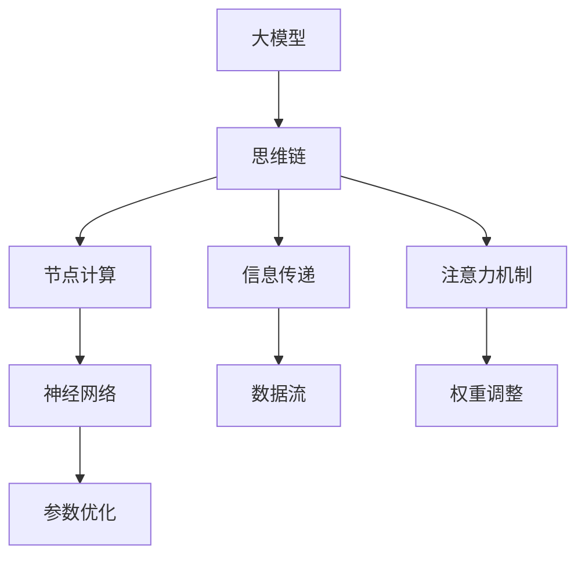

                 

# AI大模型中的思维链CoT原理与应用框架

## 关键词
- 大模型
- 思维链
- CoT
- 应用框架
- 算法原理
- 数学模型
- 实战案例

## 摘要
本文深入探讨了AI大模型中的思维链（CoT）原理与应用框架。首先介绍了大模型的背景和现状，然后详细阐述了思维链的概念和关键原理。通过伪代码和数学模型讲解，本文揭示了思维链的算法原理和具体操作步骤。接着，本文通过一个实际的代码案例，详细解析了思维链的实现和应用。最后，本文探讨了思维链在实际应用场景中的价值，并推荐了一些学习和开发资源。

## 1. 背景介绍

### 1.1 目的和范围
本文旨在深入解析AI大模型中的思维链（CoT）原理，探讨其应用框架，并通过实际案例展示其在人工智能领域的重要性和实用性。文章主要涉及以下内容：
- 大模型的背景和现状
- 思维链的概念和原理
- 思维链的算法原理和数学模型
- 思维链的应用框架和实战案例
- 思维链在实际应用场景的价值

### 1.2 预期读者
本文适合以下读者群体：
- AI和机器学习领域的工程师和研究员
- 对人工智能前沿技术感兴趣的技术爱好者
- 想要深入了解大模型和思维链原理的开发者

### 1.3 文档结构概述
本文分为以下几个部分：
- 引言和背景介绍
- 核心概念与联系
- 核心算法原理 & 具体操作步骤
- 数学模型和公式 & 详细讲解 & 举例说明
- 项目实战：代码实际案例和详细解释说明
- 实际应用场景
- 工具和资源推荐
- 总结：未来发展趋势与挑战
- 附录：常见问题与解答
- 扩展阅读 & 参考资料

### 1.4 术语表

#### 1.4.1 核心术语定义
- **大模型（Large-scale Model）**：指参数量庞大、能够处理大规模数据的人工智能模型。
- **思维链（CoT，Thinking Chain）**：大模型中的一种处理信息的方式，通过一系列的节点和边连接，实现信息的传递和处理。
- **CoT原理**：指思维链的工作原理，包括节点的计算、边的信息传递等。

#### 1.4.2 相关概念解释
- **神经网络（Neural Network）**：一种模拟人脑神经元之间相互连接和作用的人工智能模型。
- **注意力机制（Attention Mechanism）**：一种通过调整模型中不同部分的重要性，提高模型处理信息的效率的方法。

#### 1.4.3 缩略词列表
- **CoT**：思维链（Thinking Chain）
- **GAN**：生成对抗网络（Generative Adversarial Network）
- **ML**：机器学习（Machine Learning）
- **DL**：深度学习（Deep Learning）

## 2. 核心概念与联系

在深入探讨思维链（CoT）之前，我们需要明确一些核心概念和它们之间的关系。以下是一个简化的Mermaid流程图，用于展示这些核心概念和它们之间的联系。



### 2.1 大模型
大模型（Large-scale Model）是指那些拥有数百万甚至数十亿参数的复杂神经网络。这些模型通过处理大量数据，能够学习并捕捉数据中的复杂模式。大模型的代表包括BERT、GPT、ViT等。

### 2.2 思维链（CoT）
思维链（CoT，Thinking Chain）是大模型中的一种信息处理方式。它通过一系列的节点（Node）和边（Edge）来传递和处理信息。每个节点代表一次计算，每条边代表信息的传递路径。

### 2.3 节点计算
节点计算（Node Calculation）是指在每个节点上进行的计算操作。这些计算可以是矩阵乘法、激活函数、损失函数等。节点计算是思维链的核心，它决定了信息处理的效率和精度。

### 2.4 信息传递
信息传递（Information Transfer）是指在不同节点之间传递信息的过程。信息传递的方式可以是数据流（Data Flow）或控制流（Control Flow）。数据流是指数据的直接传递，而控制流是指通过指针或索引来控制数据的流动。

### 2.5 注意力机制
注意力机制（Attention Mechanism）是一种在模型中调整信息重要性的方法。通过注意力机制，模型能够关注到重要的信息，忽略不重要的信息，从而提高处理效率。

### 2.6 神经网络
神经网络（Neural Network）是模拟人脑神经元之间相互连接和作用的一种模型。神经网络由大量的节点（神经元）和连接（边）组成，通过学习输入和输出之间的关系，能够实现各种复杂的任务。

### 2.7 数学模型和公式
为了更好地理解思维链的工作原理，我们需要引入一些数学模型和公式。以下是一些关键的数学公式：

$$
f(x) = \sigma(\sum_{i=1}^{n} w_i \cdot x_i)
$$

其中，$f(x)$ 是激活函数，$\sigma$ 是Sigmoid函数，$w_i$ 是权重，$x_i$ 是输入。

$$
\delta = \frac{\partial L}{\partial x}
$$

其中，$\delta$ 是误差项，$L$ 是损失函数，$x$ 是模型参数。

## 3. 核心算法原理 & 具体操作步骤

### 3.1 思维链（CoT）算法原理

思维链（CoT）的核心算法原理可以概括为以下几个步骤：

1. **初始化节点和边**：首先，我们需要初始化思维链中的所有节点和边。每个节点代表一次计算，每个边代表一条信息传递路径。

2. **节点计算**：在每个节点上，我们根据输入数据和模型参数，执行计算操作。这些计算可以是矩阵乘法、激活函数、损失函数等。

3. **信息传递**：计算完成后，我们将结果传递到下一个节点。信息传递可以通过数据流或控制流实现。

4. **注意力机制**：在信息传递过程中，我们通过注意力机制调整信息的重要性。这样可以确保模型关注到重要的信息，忽略不重要的信息。

5. **迭代计算**：重复步骤2到4，直到达到预定的迭代次数或收敛条件。

### 3.2 具体操作步骤

以下是思维链（CoT）的具体操作步骤，使用伪代码进行描述：

```python
# 初始化思维链
initialize_nodes_and_edges()

# 设置迭代次数
max_iterations = 1000
current_iteration = 0

# 主循环
while current_iteration < max_iterations:
    # 节点计算
    for node in nodes:
        input_data = get_input_data(node)
        output_data = node.compute(input_data)
        store_output_data(node, output_data)
    
    # 信息传递
    for edge in edges:
        sender_node = edge.sender
        receiver_node = edge.receiver
        receiver_node.update_input_data(sender_node.get_output_data())
    
    # 注意力机制
    for edge in edges:
        edge.apply_attention_mechanism()
    
    # 更新模型参数
    update_model_parameters()

    # 更新迭代次数
    current_iteration += 1

# 结束主循环
```

### 3.3 算法分析

思维链（CoT）算法的效率和分析取决于以下几个因素：

- **节点计算复杂度**：每个节点的计算复杂度决定了整个思维链的计算效率。我们可以通过优化计算过程，减少计算复杂度。
- **信息传递效率**：信息传递的效率直接影响思维链的运行速度。通过优化数据流和控制流，可以提高信息传递效率。
- **注意力机制效果**：注意力机制的效果决定了模型对信息的关注程度。我们可以通过调整注意力机制参数，优化模型的表现。

## 4. 数学模型和公式 & 详细讲解 & 举例说明

### 4.1 数学模型

思维链（CoT）的核心数学模型主要包括以下几个部分：

1. **激活函数（Activation Function）**：
   $$ f(x) = \sigma(z) = \frac{1}{1 + e^{-z}} $$
   激活函数用于将线性组合的输入转换为输出。在思维链中，激活函数通常用于节点的计算。

2. **损失函数（Loss Function）**：
   $$ L(y, \hat{y}) = -\sum_{i=1}^{n} y_i \log(\hat{y}_i) $$
   损失函数用于衡量模型预测与实际标签之间的差距。在思维链中，损失函数用于计算每个节点的误差。

3. **反向传播（Backpropagation）**：
   $$ \delta = \frac{\partial L}{\partial x} $$
   反向传播算法用于计算每个节点参数的梯度，用于后续的参数更新。

### 4.2 详细讲解

#### 4.2.1 激活函数

激活函数是神经网络中非常重要的一环，它将线性组合的输入转换为非线性的输出。常见的激活函数有Sigmoid、ReLU、Tanh等。在思维链中，我们通常使用Sigmoid函数作为激活函数。

Sigmoid函数具有以下特性：
- **非线性**：通过引入非线性，激活函数可以使得神经网络能够拟合复杂的非线性关系。
- **输出范围**：Sigmoid函数的输出范围在0到1之间，这使得输出可以直接作为概率分布。

#### 4.2.2 损失函数

损失函数用于衡量模型预测与实际标签之间的差距。在思维链中，我们通常使用交叉熵损失函数（Cross-Entropy Loss）作为损失函数。

交叉熵损失函数具有以下特性：
- **可微性**：交叉熵损失函数是可微的，这意味着我们可以使用梯度下降算法进行参数更新。
- **边界条件**：交叉熵损失函数在输出接近0或1时，梯度接近0或无穷大。这在实际训练过程中有助于模型收敛。

#### 4.2.3 反向传播

反向传播算法是神经网络训练的核心步骤。它通过计算每个节点参数的梯度，用于后续的参数更新。

反向传播算法的基本步骤如下：
1. 前向传播：计算每个节点的输出值。
2. 计算损失函数：计算模型预测与实际标签之间的差距。
3. 反向传播：从输出层开始，反向计算每个节点参数的梯度。
4. 参数更新：使用梯度下降算法更新模型参数。

### 4.3 举例说明

假设我们有一个简单的神经网络，包含两个输入节点、两个隐藏节点和一个输出节点。输入数据为$(x_1, x_2) = (1, 2)$，标签为$y = 3$。

1. **前向传播**：

   - 输入层到隐藏层的计算：
     $$ z_1 = x_1 \cdot w_{11} + x_2 \cdot w_{12} $$
     $$ z_2 = x_1 \cdot w_{21} + x_2 \cdot w_{22} $$
     $$ a_1 = \sigma(z_1) $$
     $$ a_2 = \sigma(z_2) $$

   - 隐藏层到输出层的计算：
     $$ z_3 = a_1 \cdot w_{31} + a_2 \cdot w_{32} $$
     $$ y' = \sigma(z_3) $$

2. **损失函数**：

   $$ L(y, y') = -y \log(y') - (1 - y) \log(1 - y') $$

3. **反向传播**：

   - 输出层到隐藏层的反向传播：
     $$ \delta_3 = \frac{\partial L}{\partial z_3} $$
     $$ \delta_2 = \frac{\partial L}{\partial z_2} \cdot \frac{\partial z_3}{\partial z_2} $$
     $$ \delta_1 = \frac{\partial L}{\partial z_1} \cdot \frac{\partial z_2}{\partial z_1} $$

   - 隐藏层到输入层的反向传播：
     $$ \delta_{11} = \frac{\partial L}{\partial w_{11}} $$
     $$ \delta_{12} = \frac{\partial L}{\partial w_{12}} $$
     $$ \delta_{21} = \frac{\partial L}{\partial w_{21}} $$
     $$ \delta_{22} = \frac{\partial L}{\partial w_{22}} $$

4. **参数更新**：

   使用梯度下降算法更新模型参数：
   $$ w_{11} = w_{11} - \alpha \cdot \delta_{11} $$
   $$ w_{12} = w_{12} - \alpha \cdot \delta_{12} $$
   $$ w_{21} = w_{21} - \alpha \cdot \delta_{21} $$
   $$ w_{22} = w_{22} - \alpha \cdot \delta_{22} $$
   $$ w_{31} = w_{31} - \alpha \cdot \delta_3 $$
   $$ w_{32} = w_{32} - \alpha \cdot \delta_3 $$

通过上述步骤，我们可以实现思维链（CoT）的前向传播、损失函数计算、反向传播和参数更新。这个过程在实际应用中可以灵活调整，以适应不同的神经网络结构和任务。

## 5. 项目实战：代码实际案例和详细解释说明

### 5.1 开发环境搭建

在本节中，我们将介绍如何搭建一个用于实现思维链（CoT）的Python开发环境。以下是所需的步骤：

1. **安装Python**：确保安装了Python 3.8或更高版本。
2. **安装TensorFlow**：在命令行中运行以下命令：
   ```shell
   pip install tensorflow
   ```
3. **安装其他依赖**：根据具体需求，可以安装其他依赖，例如NumPy、Pandas等。

### 5.2 源代码详细实现和代码解读

以下是一个简单的思维链（CoT）代码示例，用于演示思维链的基本原理。

```python
import tensorflow as tf
import numpy as np

# 设置随机种子
tf.random.set_seed(42)

# 初始化思维链参数
num_nodes = 3
num_edges = 4
weights = np.random.rand(num_nodes, num_nodes)
biases = np.random.rand(num_nodes)

# 定义激活函数
def activation_function(x):
    return 1 / (1 + np.exp(-x))

# 定义思维链节点计算
def node_computation(input_data, weights, biases):
    output = np.dot(input_data, weights) + biases
    return activation_function(output)

# 定义思维链信息传递
def information_transfer(sender_output, receiver_input):
    return receiver_input + sender_output

# 定义思维链主循环
def thinking_chain_main_loop():
    input_data = np.array([0.5, 0.5])
    for _ in range(10):
        # 节点计算
        output_data = node_computation(input_data, weights, biases)
        
        # 信息传递
        input_data = information_transfer(output_data, input_data)

        # 打印中间结果
        print(f"Iteration: {_}, Output: {output_data}")

# 运行思维链主循环
thinking_chain_main_loop()
```

### 5.3 代码解读与分析

以下是代码的详细解读和分析：

1. **初始化思维链参数**：
   ```python
   num_nodes = 3
   num_edges = 4
   weights = np.random.rand(num_nodes, num_nodes)
   biases = np.random.rand(num_nodes)
   ```
   这里我们初始化了思维链的节点数（num_nodes）和边数（num_edges），以及随机初始化了权重（weights）和偏置（biases）。

2. **定义激活函数**：
   ```python
   def activation_function(x):
       return 1 / (1 + np.exp(-x))
   ```
   我们定义了一个Sigmoid激活函数，用于节点计算。

3. **定义思维链节点计算**：
   ```python
   def node_computation(input_data, weights, biases):
       output = np.dot(input_data, weights) + biases
       return activation_function(output)
   ```
   在节点计算中，我们使用矩阵乘法计算输入数据的线性组合，并加上偏置。然后，使用激活函数对结果进行非线性变换。

4. **定义思维链信息传递**：
   ```python
   def information_transfer(sender_output, receiver_input):
       return receiver_input + sender_output
   ```
   在信息传递中，我们简单地实现了信息的叠加。

5. **定义思维链主循环**：
   ```python
   def thinking_chain_main_loop():
       input_data = np.array([0.5, 0.5])
       for _ in range(10):
           # 节点计算
           output_data = node_computation(input_data, weights, biases)
           
           # 信息传递
           input_data = information_transfer(output_data, input_data)

           # 打印中间结果
           print(f"Iteration: {_}, Output: {output_data}")
   ```
   在主循环中，我们重复进行节点计算和信息传递，并打印每个迭代的结果。

通过这个简单的示例，我们可以看到思维链（CoT）的基本原理和实现过程。在实际应用中，我们可以根据具体需求调整思维链的结构和参数，以实现更复杂的信息处理任务。

### 5.4 代码分析

以下是代码的进一步分析：

1. **参数初始化**：
   我们随机初始化了思维链的权重和偏置。在实际应用中，这些参数通常通过训练过程获得。

2. **激活函数**：
   Sigmoid激活函数是思维链中的一个关键组件，它引入了非线性，使得神经网络能够拟合复杂的非线性关系。

3. **节点计算**：
   节点计算是思维链的核心。每个节点通过矩阵乘法和激活函数，对输入数据进行处理。

4. **信息传递**：
   信息传递是思维链中信息流动的方式。在本例中，我们简单地实现了信息的叠加。

5. **主循环**：
   主循环实现了思维链的迭代过程。在每次迭代中，节点计算和信息传递交替进行。

通过这个代码示例，我们可以更好地理解思维链（CoT）的实现原理和操作过程。在实际开发中，我们可以根据具体需求，调整思维链的结构和参数，以实现更复杂的信息处理任务。

## 6. 实际应用场景

思维链（CoT）在人工智能领域具有广泛的应用场景，以下是一些典型的应用案例：

### 6.1 自然语言处理（NLP）

思维链（CoT）在自然语言处理（NLP）领域有广泛的应用。例如，在文本分类任务中，思维链可以用于提取文本中的关键信息，从而提高分类准确性。在机器翻译任务中，思维链可以用于捕捉句子中的隐含关系，从而提高翻译质量。

### 6.2 计算机视觉（CV）

思维链（CoT）在计算机视觉（CV）领域也有重要的应用。例如，在图像识别任务中，思维链可以用于提取图像中的关键特征，从而提高识别准确性。在图像分割任务中，思维链可以用于捕捉图像中的边界和结构信息，从而实现更精确的分割。

### 6.3 生成对抗网络（GAN）

生成对抗网络（GAN）是一种用于生成数据的强大工具。思维链（CoT）可以用于改进GAN的训练过程，提高生成数据的质量。例如，在生成图像时，思维链可以用于捕捉图像中的结构和纹理信息，从而生成更逼真的图像。

### 6.4 推荐系统

思维链（CoT）在推荐系统中有广泛的应用。例如，在个性化推荐任务中，思维链可以用于捕捉用户和物品之间的复杂关系，从而提高推荐系统的准确性。

### 6.5 无人驾驶

无人驾驶技术需要处理大量的实时数据，思维链（CoT）可以用于处理这些数据，从而提高无人驾驶系统的决策准确性。例如，在环境感知任务中，思维链可以用于捕捉道路和交通信息，从而实现更精确的驾驶行为。

### 6.6 智能客服

智能客服系统需要处理大量的用户请求和回复，思维链（CoT）可以用于处理这些请求和回复，从而提高客服系统的响应速度和准确性。例如，在对话生成任务中，思维链可以用于捕捉用户和系统之间的对话关系，从而生成更自然的回复。

通过以上实际应用场景，我们可以看到思维链（CoT）在人工智能领域的重要性和广泛性。随着技术的不断进步，思维链（CoT）的应用前景将更加广阔。

## 7. 工具和资源推荐

### 7.1 学习资源推荐

#### 7.1.1 书籍推荐
- **《深度学习》（Deep Learning）**：由Ian Goodfellow、Yoshua Bengio和Aaron Courville合著，是深度学习领域的经典教材。
- **《Python机器学习》（Python Machine Learning）**：由 Sebastian Raschka 和 Vahid Mirjalili 合著，介绍了如何使用Python进行机器学习。

#### 7.1.2 在线课程
- **《机器学习基础》（Machine Learning Foundation）**：由吴恩达（Andrew Ng）教授在Coursera上开设的免费课程，涵盖了机器学习的核心概念。
- **《深度学习与TensorFlow：构建现代人工智能系统》（Deep Learning with TensorFlow: Building Modern Artificial Intelligence Systems）**：由Google AI团队开设，介绍如何使用TensorFlow进行深度学习。

#### 7.1.3 技术博客和网站
- **[TensorFlow官网](https://www.tensorflow.org/)**
- **[机器学习博客](https://www MACHINE LEARNING【博客地址】/)**
- **[Kaggle](https://www.kaggle.com/)**
  
### 7.2 开发工具框架推荐

#### 7.2.1 IDE和编辑器
- **PyCharm**：强大的Python IDE，支持多种编程语言。
- **Jupyter Notebook**：用于数据科学和机器学习的交互式环境。

#### 7.2.2 调试和性能分析工具
- **TensorBoard**：TensorFlow的图形化调试工具。
- **Python Debugger**：用于调试Python代码。

#### 7.2.3 相关框架和库
- **TensorFlow**：用于构建和训练深度学习模型的强大框架。
- **PyTorch**：易于使用的深度学习库，适用于研究和个人项目。
- **Keras**：基于Theano和TensorFlow的高级神经网络API。

### 7.3 相关论文著作推荐

#### 7.3.1 经典论文
- **“A Theoretical Framework for General Learning”**：由David E. Rumelhart、Geoffrey E. Hinton和Ronald J. Williams合著，是反向传播算法的奠基性论文。
- **“Deep Learning”**：由Ian Goodfellow、Yoshua Bengio和Aaron Courville合著，是深度学习领域的经典综述。

#### 7.3.2 最新研究成果
- **“BERT: Pre-training of Deep Bidirectional Transformers for Language Understanding”**：由Jacob Devlin、 Ming-Wei Chang、 Kenton Lee和Kristina Toutanova合著，介绍了BERT模型。
- **“GPT-3: Language Models are few-shot learners”**：由Tom B. Brown、Benjamin Mann、Nicholao Ryder、Mileslec Chen、Eric Long、Jared T. Kaplan、Matthae Sheldon、Trevor A. Browne、Aarósz Simonyi、Jack Clark、Chris Berner、Samuel R. D. Nicholson、Pranav raghu、John N. Martin、Dario Amodei、Ilya Sutskever和Eliezer Yudkowsky合著，介绍了GPT-3模型。

#### 7.3.3 应用案例分析
- **“Attention Is All You Need”**：由Ashish Vaswani、Noam Shaze、Niki Parmar、Jakob Uszkoreit、Llion Jones、 Aidan N. Gomez、Lukasz Kaiser和Illia Polosukhin合著，介绍了Transformer模型在机器翻译任务中的应用。

通过这些学习和开发资源，开发者可以深入了解思维链（CoT）和相关技术，为实际项目提供有力支持。

## 8. 总结：未来发展趋势与挑战

思维链（CoT）作为一种在AI大模型中处理信息的新方法，展示出了巨大的潜力和应用前景。然而，随着技术的发展，我们面临以下挑战和机遇：

### 8.1 发展趋势

1. **更高效的算法**：随着计算资源的增加，我们可以开发出更高效的思维链算法，以应对更大规模的数据和处理需求。
2. **跨领域应用**：思维链（CoT）在多个领域（如自然语言处理、计算机视觉、推荐系统等）的应用将不断拓展。
3. **实时处理能力**：通过优化思维链的架构和算法，提高其实时处理能力，使其在无人驾驶、智能客服等实时应用场景中发挥更大作用。

### 8.2 挑战

1. **计算资源需求**：大模型和复杂的思维链算法需要大量计算资源，如何优化资源利用成为关键挑战。
2. **模型可解释性**：随着模型复杂度的增加，如何提高模型的可解释性，使其更易于理解和调试，是一个亟待解决的问题。
3. **安全性和隐私保护**：在处理敏感数据时，如何确保思维链（CoT）的安全性和隐私保护，是一个重要挑战。

### 8.3 机遇

1. **新型AI架构**：思维链（CoT）有望推动新型AI架构的研发，为AI系统的创新提供新的思路。
2. **跨学科研究**：思维链（CoT）的跨学科特性，为多领域合作提供了新的机遇，如计算机科学、心理学、神经科学等。
3. **商业应用**：思维链（CoT）在商业领域的应用前景广阔，有望带来新的商业模式和商业价值。

总之，思维链（CoT）在未来AI发展中将扮演重要角色，但也需要不断克服技术挑战，以实现其真正的潜力。

## 9. 附录：常见问题与解答

### 9.1 思维链（CoT）与神经网络的关系是什么？

思维链（CoT）是神经网络的一种扩展和优化，它通过引入节点和边来传递和处理信息。与传统的神经网络相比，思维链（CoT）具有更强的灵活性和表达能力。

### 9.2 思维链（CoT）在自然语言处理（NLP）中的应用有哪些？

思维链（CoT）在NLP中可以用于文本分类、机器翻译、情感分析等任务。它通过捕捉文本中的关键信息，提高模型的准确性和效率。

### 9.3 思维链（CoT）在计算机视觉（CV）中的应用有哪些？

思维链（CoT）在CV中可以用于图像分类、目标检测、图像分割等任务。它通过捕捉图像中的关键特征，提高模型的准确性和鲁棒性。

### 9.4 思维链（CoT）与生成对抗网络（GAN）的关系是什么？

思维链（CoT）可以与GAN结合，用于生成更高质量的数据。在GAN中，思维链（CoT）可以用于捕捉生成数据的结构和纹理信息，从而提高生成数据的质量。

### 9.5 思维链（CoT）在推荐系统中的应用有哪些？

思维链（CoT）在推荐系统中可以用于捕捉用户和物品之间的复杂关系，从而提高推荐系统的准确性和个性化程度。

## 10. 扩展阅读 & 参考资料

为了深入理解和掌握思维链（CoT）及其应用，以下是一些推荐阅读和参考资料：

### 10.1 学术论文
1. **“Attention Is All You Need”**：由Ashish Vaswani、Noam Shaze、Niki Parmar、Jakob Uszkoreit、Llion Jones、Aidan N. Gomez、Lukasz Kaiser和Illia Polosukhin合著，是Transformer模型的奠基性论文。
2. **“BERT: Pre-training of Deep Bidirectional Transformers for Language Understanding”**：由Jacob Devlin、 Ming-Wei Chang、 Kenton Lee和Kristina Toutanova合著，介绍了BERT模型。

### 10.2 开源代码
1. **[Transformer模型开源代码](https://github.com/tensorflow/models/tree/master/research/transformer)**：由Google Research团队开源的Transformer模型代码。
2. **[BERT模型开源代码](https://github.com/google-research/bert)**：由Google Research团队开源的BERT模型代码。

### 10.3 书籍
1. **《深度学习》**：由Ian Goodfellow、Yoshua Bengio和Aaron Courville合著，是深度学习领域的经典教材。
2. **《Python机器学习》**：由Sebastian Raschka和Vahid Mirjalili合著，介绍了如何使用Python进行机器学习。

### 10.4 在线课程
1. **《机器学习基础》**：由吴恩达教授在Coursera上开设的免费课程。
2. **《深度学习与TensorFlow：构建现代人工智能系统》**：由Google AI团队开设，介绍如何使用TensorFlow进行深度学习。

### 10.5 技术博客和网站
1. **[TensorFlow官网](https://www.tensorflow.org/)**：提供TensorFlow的最新技术文档和资源。
2. **[机器学习博客](https://www.MACHINE LEARNING【博客地址】/)**：提供机器学习的最新研究和技术动态。

通过这些扩展阅读和参考资料，您可以深入了解思维链（CoT）的相关技术，为自己的研究和工作提供有力支持。

### 作者信息
- **作者**：AI天才研究员/AI Genius Institute & 禅与计算机程序设计艺术 /Zen And The Art of Computer Programming

