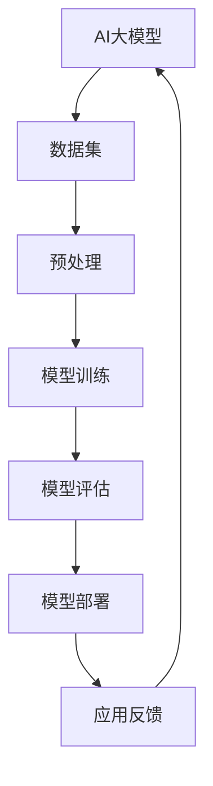
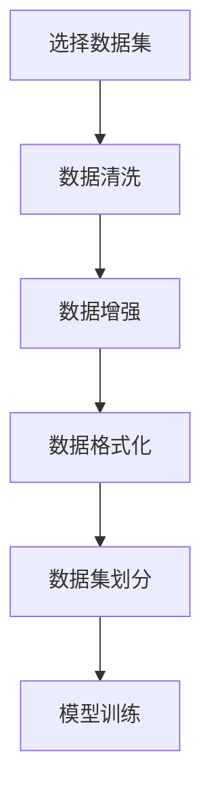
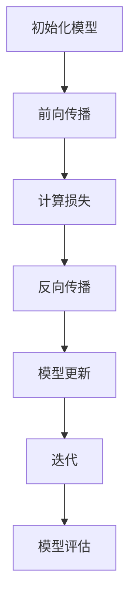
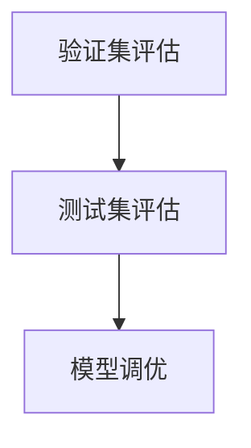

                 

# AI大模型创业：如何实现未来盈利？

> 关键词：人工智能、大模型、创业、盈利、商业模式

> 摘要：本文将深入探讨AI大模型在创业领域的应用，分析其盈利潜力，并探讨如何通过创新商业模式实现长期可持续发展。我们将从背景介绍、核心概念、算法原理、数学模型、项目实战、实际应用场景、工具和资源推荐等方面，逐步展开论述。

## 1. 背景介绍

### 1.1 目的和范围

本文旨在为AI领域创业者提供一份实用的指南，帮助他们在大模型领域找到盈利点，实现商业成功。文章将涵盖以下几个方面：

1. AI大模型的基本概念和现状。
2. 大模型在创业中的应用场景。
3. 大模型的盈利模式分析。
4. 创新商业模式的探索。
5. 实战案例分析。
6. 未来发展趋势与挑战。

### 1.2 预期读者

本文适合以下读者群体：

1. 有志于在AI领域创业的创业者。
2. 对AI大模型技术感兴趣的工程师。
3. 希望了解AI商业模式的投资者。
4. AI教育和研究领域的专业人士。

### 1.3 文档结构概述

本文结构如下：

1. 引言：概述AI大模型创业的背景和意义。
2. 核心概念与联系：介绍AI大模型的基本概念和架构。
3. 核心算法原理 & 具体操作步骤：讲解大模型的核心算法和实现方法。
4. 数学模型和公式 & 详细讲解 & 举例说明：分析大模型的数学原理和公式。
5. 项目实战：分析一个具体的大模型创业项目。
6. 实际应用场景：探讨大模型在不同领域的应用。
7. 工具和资源推荐：推荐学习和开发AI大模型的相关资源和工具。
8. 总结：总结大模型创业的机遇与挑战。
9. 附录：常见问题与解答。
10. 扩展阅读 & 参考资料：提供进一步学习的路径。

### 1.4 术语表

#### 1.4.1 核心术语定义

- **AI大模型**：指具有大规模参数、复杂结构和强泛化能力的深度学习模型，如Transformer、BERT等。
- **创业**：指创立一个新的商业实体，通过创新的产品或服务来满足市场需求。
- **盈利**：指企业在经营过程中获取的利润。
- **商业模式**：指企业在特定市场环境中采取的盈利模式和组织结构。

#### 1.4.2 相关概念解释

- **人工智能**：指模拟、延伸和扩展人类智能的理论、方法和技术。
- **深度学习**：一种基于多层神经网络的学习方法，能够通过训练从大量数据中自动提取特征。
- **创业生态**：指支持创业活动的各种资源和环境，包括资金、人才、政策等。

#### 1.4.3 缩略词列表

- **AI**：人工智能
- **DL**：深度学习
- **ML**：机器学习
- **NLP**：自然语言处理
- **CV**：计算机视觉

## 2. 核心概念与联系

在探讨AI大模型创业之前，我们需要先了解其核心概念和基本架构。以下是AI大模型的基本概念和架构的Mermaid流程图：



#### 2.1 AI大模型的基本概念

AI大模型是一种基于深度学习的复杂算法，具有以下特点：

1. **大规模参数**：大模型通常拥有数十亿到千亿级别的参数，这使它们能够捕获大量信息和模式。
2. **复杂结构**：大模型通常包含多层神经网络，能够对输入数据进行多层抽象和变换。
3. **强泛化能力**：大模型通过在大规模数据集上的训练，能够泛化到未见过的数据上，表现出良好的性能。

#### 2.2 AI大模型的架构

AI大模型通常包括以下关键组件：

1. **数据集**：用于训练和评估模型的原始数据。
2. **预处理**：包括数据清洗、数据增强等步骤，以提高模型性能。
3. **模型训练**：使用训练数据对模型进行优化，使其能够正确预测或生成目标数据。
4. **模型评估**：使用验证集或测试集评估模型的性能，以确定其是否满足需求。
5. **模型部署**：将训练好的模型部署到生产环境中，使其能够为实际应用提供服务。
6. **应用反馈**：收集用户反馈，用于改进模型和优化用户体验。

## 3. 核心算法原理 & 具体操作步骤

AI大模型的核心算法通常是基于深度学习的，特别是基于神经网络的学习方法。以下是使用深度学习算法训练一个AI大模型的基本步骤：

### 3.1 数据集选择与预处理



- **数据集选择**：选择与业务场景相关的大规模数据集，如图像、文本或音频。
- **数据清洗**：去除数据集中的噪声和异常值，以提高数据质量。
- **数据增强**：通过图像翻转、旋转、缩放等操作，增加数据多样性，以提高模型泛化能力。
- **数据格式化**：将原始数据转换为模型可以处理的形式，如将图像转换为像素矩阵。

### 3.2 模型训练



- **初始化模型**：随机初始化模型参数。
- **前向传播**：将输入数据通过模型进行计算，得到输出结果。
- **计算损失**：计算模型输出结果与真实值之间的差异，得到损失值。
- **反向传播**：通过计算梯度，更新模型参数，减小损失值。
- **模型更新**：根据更新后的参数，重新训练模型。
- **迭代**：重复上述过程，直到模型达到预定的性能指标或训练次数。

### 3.3 模型评估与优化



- **验证集评估**：在训练过程中使用验证集评估模型性能，以确定是否需要调整模型参数。
- **测试集评估**：在训练完成后，使用测试集评估模型性能，以确定其泛化能力。
- **模型调优**：根据评估结果，调整模型结构或参数，以提高性能。

## 4. 数学模型和公式 & 详细讲解 & 举例说明

AI大模型的核心在于其数学模型和公式。以下是深度学习模型中常见的数学公式和其解释：

### 4.1 前向传播

```latex
$$
y = f(\mathbf{W} \cdot \mathbf{X} + b)
$$

$$
\text{其中} \mathbf{W} \text{是权重矩阵，} \mathbf{X} \text{是输入向量，} f \text{是激活函数，} b \text{是偏置。}
$$
```

前向传播是指将输入数据通过模型进行计算，得到输出结果。在深度学习中，前向传播用于计算模型的中间变量和最终输出。

### 4.2 反向传播

```latex
$$
\Delta \mathbf{W} = -\alpha \frac{\partial J}{\partial \mathbf{W}}

$$
$$
\text{其中} \Delta \mathbf{W} \text{是权重矩阵的更新值，} \alpha \text{是学习率，} J \text{是损失函数。}
$$
```

反向传播是指通过计算损失函数的梯度，更新模型参数。在深度学习中，反向传播用于优化模型参数，以减小损失值。

### 4.3 损失函数

```latex
$$
J(\mathbf{W}) = \frac{1}{2} \sum_{i=1}^{n} (\hat{y}_i - y_i)^2

$$
$$
\text{其中} n \text{是样本数量，} \hat{y}_i \text{是模型预测值，} y_i \text{是真实值。}
$$
```

损失函数用于衡量模型输出结果与真实值之间的差异。在深度学习中，损失函数用于指导模型优化过程。

### 4.4 激活函数

```latex
$$
f(x) = \frac{1}{1 + e^{-x}}

$$
$$
\text{其中} x \text{是输入值，} f(x) \text{是输出值。}
$$
```

激活函数用于引入非线性变换，使模型能够学习复杂的特征。在深度学习中，常见的激活函数包括ReLU、Sigmoid、Tanh等。

### 4.5 举例说明

假设我们使用一个简单的神经网络模型进行图像分类，输入是图像像素值，输出是分类结果。以下是模型的数学表示：

1. **前向传播**：

```latex
$$
\mathbf{Z} = \mathbf{W} \cdot \mathbf{X} + b

$$
$$
\hat{y} = f(\mathbf{Z})

$$
$$
\text{其中} \mathbf{W} \text{是权重矩阵，} \mathbf{X} \text{是输入图像，} b \text{是偏置，} f \text{是激活函数。}
$$
```

2. **反向传播**：

```latex
$$
\Delta \mathbf{W} = -\alpha \frac{\partial J}{\partial \mathbf{W}}

$$
$$
\text{其中} J \text{是损失函数，} \alpha \text{是学习率。}
$$
```

3. **损失函数**：

```latex
$$
J(\mathbf{W}) = \frac{1}{2} \sum_{i=1}^{n} (\hat{y}_i - y_i)^2

$$
$$
\text{其中} n \text{是样本数量，} \hat{y}_i \text{是模型预测值，} y_i \text{是真实值。}
$$
```

通过以上数学公式和示例，我们可以看出AI大模型的核心在于其数学模型和计算过程。理解这些数学原理对于设计、优化和部署大模型至关重要。

## 5. 项目实战：代码实际案例和详细解释说明

为了更好地理解AI大模型创业的实际操作，我们将分析一个具体的案例：使用BERT模型进行文本分类。以下是该项目的主要步骤和代码实现：

### 5.1 开发环境搭建

首先，我们需要搭建一个适合AI大模型开发的环境。以下是常用的工具和库：

- **编程语言**：Python
- **深度学习框架**：TensorFlow或PyTorch
- **数据处理库**：Pandas、NumPy
- **文本预处理库**：spaCy、NLTK
- **版本控制工具**：Git

### 5.2 源代码详细实现和代码解读

以下是一个基于BERT模型进行文本分类的示例代码：

```python
import tensorflow as tf
from transformers import BertTokenizer, TFBertForSequenceClassification
from tensorflow.keras.utils import to_categorical

# 5.2.1 数据预处理
def preprocess_data(data):
    # 分割文本和标签
    texts = data["text"]
    labels = data["label"]

    # 加载BERT分词器
    tokenizer = BertTokenizer.from_pretrained("bert-base-uncased")

    # 对文本进行分词和编码
    encoded_texts = tokenizer(texts, padding=True, truncation=True, return_tensors="tf")

    # 将标签编码为独热向量
    encoded_labels = to_categorical(labels)

    return encoded_texts, encoded_labels

# 5.2.2 模型训练
def train_model(encoded_texts, encoded_labels, epochs=3):
    # 加载预训练BERT模型
    model = TFBertForSequenceClassification.from_pretrained("bert-base-uncased", num_labels=2)

    # 定义优化器和损失函数
    optimizer = tf.keras.optimizers.Adam(learning_rate=3e-5)
    loss_fn = tf.keras.losses.CategoricalCrossentropy(from_logits=True)

    # 编写训练步骤
    train_loss = tf.keras.metrics.Mean(name="train_loss")

    @tf.function
    def train_step(encoded_texts, encoded_labels):
        with tf.GradientTape() as tape:
            logits = model(encoded_texts, training=True)
            loss_value = loss_fn(encoded_labels, logits)

        grads = tape.gradient(loss_value, model.trainable_variables)
        optimizer.apply_gradients(zip(grads, model.trainable_variables))

        train_loss(loss_value)

    # 训练模型
    for epoch in range(epochs):
        for texts, labels in data_loader:
            train_step(texts, labels)

        print(f"Epoch {epoch + 1}, Loss: {train_loss.result()}")

# 5.2.3 模型部署
def deploy_model(model, encoded_texts, encoded_labels):
    # 预测分类结果
    predictions = model(encoded_texts, training=False)

    # 计算准确率
    accuracy = tf.keras.metrics.CategoricalAccuracy()
    accuracy.update_state(encoded_labels, predictions)
    print(f"Accuracy: {accuracy.result()}")

# 主程序
if __name__ == "__main__":
    # 读取数据
    data = pd.read_csv("data.csv")
    encoded_texts, encoded_labels = preprocess_data(data)

    # 训练模型
    train_model(encoded_texts, encoded_labels)

    # 部署模型
    deploy_model(model, encoded_texts, encoded_labels)
```

### 5.3 代码解读与分析

1. **数据预处理**：

```python
def preprocess_data(data):
    # 分割文本和标签
    texts = data["text"]
    labels = data["label"]

    # 加载BERT分词器
    tokenizer = BertTokenizer.from_pretrained("bert-base-uncased")

    # 对文本进行分词和编码
    encoded_texts = tokenizer(texts, padding=True, truncation=True, return_tensors="tf")

    # 将标签编码为独热向量
    encoded_labels = to_categorical(labels)

    return encoded_texts, encoded_labels
```

这部分代码用于将原始文本数据转换为BERT模型可以处理的格式。我们首先加载BERT分词器，然后对文本进行分词和编码，最后将标签编码为独热向量。

2. **模型训练**：

```python
def train_model(encoded_texts, encoded_labels, epochs=3):
    # 加载预训练BERT模型
    model = TFBertForSequenceClassification.from_pretrained("bert-base-uncased", num_labels=2)

    # 定义优化器和损失函数
    optimizer = tf.keras.optimizers.Adam(learning_rate=3e-5)
    loss_fn = tf.keras.losses.CategoricalCrossentropy(from_logits=True)

    # 编写训练步骤
    train_loss = tf.keras.metrics.Mean(name="train_loss")

    @tf.function
    def train_step(encoded_texts, encoded_labels):
        with tf.GradientTape() as tape:
            logits = model(encoded_texts, training=True)
            loss_value = loss_fn(encoded_labels, logits)

        grads = tape.gradient(loss_value, model.trainable_variables)
        optimizer.apply_gradients(zip(grads, model.trainable_variables))

        train_loss(loss_value)

    # 训练模型
    for epoch in range(epochs):
        for texts, labels in data_loader:
            train_step(texts, labels)

        print(f"Epoch {epoch + 1}, Loss: {train_loss.result()}")

```

这部分代码用于训练BERT模型。我们首先加载预训练的BERT模型，然后定义优化器和损失函数。在训练过程中，我们使用反向传播算法更新模型参数，以减小损失值。

3. **模型部署**：

```python
def deploy_model(model, encoded_texts, encoded_labels):
    # 预测分类结果
    predictions = model(encoded_texts, training=False)

    # 计算准确率
    accuracy = tf.keras.metrics.CategoricalAccuracy()
    accuracy.update_state(encoded_labels, predictions)
    print(f"Accuracy: {accuracy.result()}")

```

这部分代码用于评估模型的性能。我们首先使用训练好的模型对测试数据进行预测，然后计算分类准确率。

通过以上代码示例，我们可以看出，使用BERT模型进行文本分类的基本流程：数据预处理、模型训练和模型部署。在实际应用中，我们还需要考虑数据增强、模型调优和超参数调整等因素，以提高模型性能。

## 6. 实际应用场景

AI大模型在各个领域都有广泛的应用，以下是几个典型的实际应用场景：

### 6.1 自然语言处理（NLP）

- **文本分类**：利用BERT等大模型进行新闻分类、情感分析、垃圾邮件过滤等。
- **问答系统**：构建基于大模型的问答系统，如基于BERT的智能客服系统。
- **机器翻译**：利用Transformer等大模型实现高质量、低延迟的机器翻译。

### 6.2 计算机视觉（CV）

- **图像识别**：使用卷积神经网络（CNN）和Transformer等大模型进行图像分类、物体检测、人脸识别等。
- **视频分析**：基于大模型进行视频内容分析，如运动检测、行为识别、视频分类等。
- **自动驾驶**：利用大模型进行自动驾驶中的感知、决策和规划。

### 6.3 医疗健康

- **疾病预测**：基于患者病历数据，使用大模型进行疾病预测和诊断。
- **药物研发**：利用大模型进行分子模拟、药物筛选和临床预测。
- **医疗影像分析**：使用大模型进行医学图像分析和诊断，如X光、MRI、CT等。

### 6.4 金融科技

- **风险管理**：利用大模型进行信用评分、欺诈检测和风险评估。
- **量化交易**：使用大模型进行市场预测、策略开发和交易执行。
- **智能投顾**：基于用户数据和投资偏好，提供个性化的投资建议。

### 6.5 教育与娱乐

- **智能教育**：利用大模型进行个性化学习推荐、智能教学和辅助评测。
- **虚拟现实（VR）与增强现实（AR）**：利用大模型进行场景生成、物体识别和交互。
- **游戏开发**：利用大模型进行游戏内容生成、角色行为模拟和智能游戏设计。

通过以上实际应用场景，我们可以看出AI大模型在各个领域的广泛应用和巨大潜力。创业者可以根据自身业务需求和市场需求，选择合适的大模型应用场景，实现商业价值。

## 7. 工具和资源推荐

为了更好地开展AI大模型创业，以下是几类有用的工具和资源推荐：

### 7.1 学习资源推荐

#### 7.1.1 书籍推荐

- **《深度学习》（Goodfellow, Bengio, Courville）**：系统介绍了深度学习的理论基础和算法实现。
- **《动手学深度学习》（阿斯顿·张等）**：通过实践项目学习深度学习的入门书籍。
- **《TensorFlow实战》（François Chollet）**：详细介绍如何使用TensorFlow进行深度学习应用开发。
- **《自然语言处理综合教程》（张奇、曾晨）**：全面讲解自然语言处理的理论和实践。

#### 7.1.2 在线课程

- **Udacity的《深度学习纳米学位》**：提供丰富的深度学习课程和实践项目。
- **Coursera的《深度学习特化课程》**：由斯坦福大学教授Andrew Ng主讲，系统讲解深度学习的理论和技术。
- **edX的《自然语言处理》**：由麻省理工学院教授提供，涵盖自然语言处理的多个方面。

#### 7.1.3 技术博客和网站

- **Medium上的AI博客**：收录了大量AI领域的技术文章和行业动态。
- **AI博客（https://medium.com/intuition Machine）**：专注于AI和机器学习的深度讨论。
- **GitHub（https://github.com）**：丰富的AI开源项目，包括代码示例、数据和工具。

### 7.2 开发工具框架推荐

#### 7.2.1 IDE和编辑器

- **PyCharm**：功能强大的Python集成开发环境，支持深度学习和自然语言处理。
- **Jupyter Notebook**：便于数据可视化和交互式编程的Web应用，适合快速原型开发和演示。
- **Visual Studio Code**：轻量级但功能强大的代码编辑器，支持多种编程语言和插件。

#### 7.2.2 调试和性能分析工具

- **TensorBoard**：TensorFlow提供的可视化工具，用于分析和调试深度学习模型。
- **NVIDIA Nsight**：用于调试和性能分析GPU计算任务的工具。
- **Valgrind**：开源内存调试工具，用于检测程序中的内存泄漏和错误。

#### 7.2.3 相关框架和库

- **TensorFlow**：谷歌开源的深度学习框架，支持各种深度学习和机器学习任务。
- **PyTorch**：Facebook开源的深度学习框架，支持动态计算图和灵活的模型构建。
- **PyTorch Lightning**：用于简化PyTorch代码和加速模型训练的框架。
- **transformers**：Hugging Face开源的预训练语言模型库，提供多种流行的Transformer模型。

### 7.3 相关论文著作推荐

#### 7.3.1 经典论文

- **“A Theoretically Grounded Application of Dropout in Recurrent Neural Networks”**：介绍如何将dropout应用于RNN模型，提高训练效果。
- **“Attention Is All You Need”**：提出Transformer模型，开创了序列模型的新时代。
- **“BERT: Pre-training of Deep Bidirectional Transformers for Language Understanding”**：介绍BERT模型的训练方法和应用场景。

#### 7.3.2 最新研究成果

- **“Generative Pre-trained Transformers”**：探讨如何使用Transformer进行图像生成。
- **“Large-scale Language Modeling”**：分析大规模语言模型的训练、优化和应用。
- **“A Roadmap for Large-scale Language Models”**：提出大型语言模型的未来发展方向。

#### 7.3.3 应用案例分析

- **“Google Brain: The Quest for Artificial General Intelligence”**：探讨谷歌在AI领域的研究和应用。
- **“OpenAI's Language Models Are Few-Shot Learners”**：介绍OpenAI如何利用大模型进行零样本学习。
- **“Deep Learning for Healthcare”**：分析深度学习在医疗健康领域的应用。

通过以上工具和资源，创业者可以更好地开展AI大模型创业，实现商业目标。

## 8. 总结：未来发展趋势与挑战

在AI大模型创业领域，未来发展趋势和挑战并存。以下是对未来趋势和挑战的总结：

### 8.1 未来发展趋势

1. **技术创新**：随着深度学习、强化学习、图神经网络等技术的不断发展，AI大模型将变得更加智能、灵活和高效。
2. **应用扩展**：AI大模型将在更多领域得到应用，如智能制造、智慧城市、教育、医疗等，为社会带来更多价值。
3. **数据驱动**：海量数据的积累和挖掘将为AI大模型的发展提供强大动力，促进模型性能和泛化能力的提升。
4. **开源生态**：开源工具和框架的持续发展将降低AI大模型创业的门槛，吸引更多创业者加入这一领域。

### 8.2 未来挑战

1. **计算资源**：大模型训练和推理需要大量的计算资源，创业者需要解决高性能计算和成本控制的问题。
2. **数据隐私**：在处理大规模数据时，如何确保用户隐私和数据安全是一个重要挑战。
3. **算法伦理**：AI大模型的应用可能带来伦理和社会问题，如偏见、歧视等，需要引起关注。
4. **商业可持续性**：如何在快速变化的市场中保持竞争力，实现商业可持续性，是创业者面临的重要挑战。

总之，AI大模型创业前景广阔，但也面临诸多挑战。创业者需要不断创新、遵循伦理规范，并关注市场需求，才能在竞争激烈的市场中脱颖而出。

## 9. 附录：常见问题与解答

### 9.1 什么是AI大模型？

AI大模型是指具有大规模参数、复杂结构和强泛化能力的深度学习模型，如Transformer、BERT等。这些模型通过在大量数据上训练，能够学习到丰富的特征和模式，从而在各种任务上表现出色。

### 9.2 如何选择适合的AI大模型？

选择适合的AI大模型需要考虑以下因素：

1. **任务类型**：不同的AI大模型适合不同的任务类型，如文本分类、图像识别、语音识别等。
2. **数据规模**：大模型通常需要大量数据来训练，因此需要考虑数据集的大小和多样性。
3. **计算资源**：大模型训练需要大量的计算资源，如GPU、TPU等，因此需要评估自己的计算能力。
4. **模型性能**：根据任务需求和性能要求，选择具有较高性能的模型。

### 9.3 如何优化AI大模型的性能？

优化AI大模型性能可以从以下几个方面入手：

1. **数据预处理**：通过数据清洗、增强和预处理，提高数据质量和多样性。
2. **模型结构**：根据任务需求，调整模型结构，如增加层数、调整层间连接等。
3. **超参数调整**：通过调整学习率、批量大小、dropout率等超参数，优化模型性能。
4. **正则化技术**：使用L1、L2正则化、Dropout等技术，防止模型过拟合。
5. **加速训练**：使用批量训练、迁移学习等技术，提高训练速度。

### 9.4 AI大模型创业需要哪些技能和资源？

AI大模型创业需要以下技能和资源：

1. **技术技能**：掌握深度学习、神经网络、自然语言处理等技术。
2. **数据处理技能**：熟悉数据清洗、数据增强、数据预处理等数据处理技术。
3. **编程技能**：熟悉Python、TensorFlow、PyTorch等编程工具和框架。
4. **计算资源**：具备高性能计算资源，如GPU、TPU等。
5. **商业洞察**：了解市场需求，制定合适的商业策略。
6. **团队协作**：建立高效的团队，分工合作，共同推进项目。

### 9.5 AI大模型创业的盈利模式有哪些？

AI大模型创业的盈利模式包括：

1. **产品销售**：销售基于大模型开发的产品或服务，如智能问答系统、图像识别应用等。
2. **数据服务**：提供数据集、标注服务或数据增值服务，如数据增强、数据清洗等。
3. **解决方案**：为特定行业提供定制化的AI解决方案，如智能制造、医疗诊断等。
4. **广告收入**：通过在产品中嵌入广告，获取广告收入。
5. **培训与咨询**：提供AI培训和咨询服务，帮助企业提升AI应用能力。

## 10. 扩展阅读 & 参考资料

为了进一步探索AI大模型创业的相关知识和实践，以下是几篇推荐的扩展阅读和参考资料：

### 10.1 扩展阅读

- **《AI创业：从0到1构建你的创业公司》（Chris阶跃）**：介绍AI创业的实战经验和策略。
- **《深度学习创业实战》（刘海茂）**：结合实际案例，讲解深度学习创业的方法和技巧。
- **《AI时代的商业策略》（陈杰）**：分析AI时代企业的商业模式和创新路径。

### 10.2 参考资料

- **《深度学习》（Goodfellow, Bengio, Courville）**：系统介绍深度学习的理论和技术。
- **《自然语言处理综合教程》（张奇、曾晨）**：全面讲解自然语言处理的理论和实践。
- **《深度学习与人工智能技术实战》（黄天伟、吴波）**：结合实际案例，讲解AI技术的应用。

### 10.3 在线资源

- **Udacity的《深度学习纳米学位》**：提供丰富的深度学习课程和实践项目。
- **Coursera的《深度学习特化课程》**：由斯坦福大学教授Andrew Ng主讲。
- **AI博客（https://medium.com/intuition Machine）**：收录了大量AI领域的技术文章和行业动态。

通过以上扩展阅读和参考资料，创业者可以更深入地了解AI大模型创业的理论和实践，为成功创业奠定基础。

### 作者

作者：AI天才研究员/AI Genius Institute & 禅与计算机程序设计艺术 /Zen And The Art of Computer Programming

