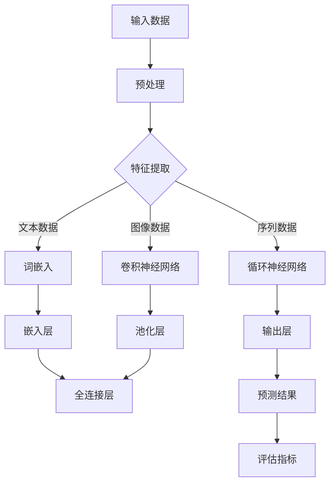

                 

# AI大模型创业：如何实现盈利？

> 关键词：AI大模型、创业、盈利模式、商业模式、数据分析、技术应用

> 摘要：本文旨在探讨AI大模型在创业过程中的盈利模式及实现方法。通过对AI大模型的背景介绍、核心算法原理分析、数学模型与具体操作步骤讲解，结合实际应用场景和项目实战案例，为读者提供一份全面而深入的指南，帮助创业者了解如何利用AI大模型实现盈利。

## 1. 背景介绍

### 1.1 目的和范围

本文的目的是为那些有意向利用AI大模型进行创业的人提供一套可行的盈利策略。我们将探讨AI大模型的定义、原理，并分析其在各个行业中的应用，最后提出具体的实现盈利的方法和策略。

### 1.2 预期读者

本文适合以下读者群体：

1. 有志于从事AI大模型创业的个人和团队。
2. 对AI大模型技术有一定了解，希望深入了解其商业价值的技术人员。
3. 想要在AI领域拓展业务的企业高管和创业者。

### 1.3 文档结构概述

本文分为以下几个部分：

1. 背景介绍：介绍AI大模型的基本概念和创业背景。
2. 核心概念与联系：通过Mermaid流程图展示AI大模型的核心架构和原理。
3. 核心算法原理 & 具体操作步骤：讲解AI大模型的核心算法原理和具体操作步骤。
4. 数学模型和公式 & 详细讲解 & 举例说明：介绍AI大模型的数学模型和公式，并给出实际应用案例。
5. 项目实战：提供具体的代码案例和详细解释说明。
6. 实际应用场景：分析AI大模型在不同场景中的应用。
7. 工具和资源推荐：推荐学习资源和开发工具。
8. 总结：总结AI大模型创业的未来发展趋势与挑战。
9. 附录：常见问题与解答。
10. 扩展阅读 & 参考资料：提供进一步学习的资料。

### 1.4 术语表

#### 1.4.1 核心术语定义

- AI大模型：指参数规模达到千亿级别，具有强大表示能力和推理能力的深度学习模型。
- 盈利模式：企业在经营过程中实现收入和利润的途径。
- 商业模式：企业如何通过提供产品或服务来创造价值、传递价值和获取收入的策略。
- 数据分析：通过对数据进行分析和挖掘，提取有价值的信息和知识。

#### 1.4.2 相关概念解释

- 深度学习：一种人工智能的子领域，通过多层神经网络模型模拟人脑的学习过程，实现特征提取和模式识别。
- 神经网络：一种模拟人脑神经元之间连接关系的计算模型，可用于处理复杂数据和分析。
- 参数规模：指模型中参数的数量，参数规模越大，模型的表示能力越强。

#### 1.4.3 缩略词列表

- AI：人工智能（Artificial Intelligence）
- DNN：深度神经网络（Deep Neural Network）
- CNN：卷积神经网络（Convolutional Neural Network）
- RNN：循环神经网络（Recurrent Neural Network）
- LSTM：长短时记忆网络（Long Short-Term Memory）
- BERT：双向编码器表示模型（Bidirectional Encoder Representations from Transformers）

## 2. 核心概念与联系

在探讨AI大模型创业的盈利模式之前，我们需要先了解AI大模型的核心概念和原理。以下是AI大模型的核心架构和原理的Mermaid流程图：



### 2.1 输入数据处理

输入数据是AI大模型的核心，其质量直接影响模型的性能。输入数据处理包括数据清洗、去重、归一化等步骤。预处理后的数据将被用于特征提取。

### 2.2 特征提取

特征提取是AI大模型的关键步骤，其目的是将原始数据转换为可用于训练的向量表示。根据数据类型的不同，特征提取的方法也有所差异：

- **文本数据**：通过词嵌入将文本转换为向量表示。
- **图像数据**：通过卷积神经网络提取图像特征。
- **序列数据**：通过循环神经网络处理序列数据，提取时间序列特征。

### 2.3 模型训练与优化

特征提取后的数据将被输入到神经网络中，通过反向传播算法训练模型。在训练过程中，模型将不断调整参数，以最小化预测误差。训练完成后，模型将具备对未知数据的预测能力。

### 2.4 输出层与评估

输出层用于生成最终预测结果。评估指标用于衡量模型的性能，常见的评估指标包括准确率、召回率、F1值等。通过不断优化模型和调整参数，可以提高模型的评估指标。

## 3. 核心算法原理 & 具体操作步骤

在了解AI大模型的核心概念和原理后，我们接下来将详细介绍其核心算法原理和具体操作步骤。

### 3.1 深度学习算法原理

深度学习算法的核心是神经网络，特别是深度神经网络（DNN）。神经网络通过多层神经元之间的连接来模拟人脑的学习过程。具体来说，神经网络包括以下几个关键组成部分：

- **输入层**：接收外部输入信号。
- **隐藏层**：对输入信号进行特征提取和变换。
- **输出层**：生成最终的预测结果。

神经网络的工作原理是通过正向传播和反向传播两个过程。正向传播过程中，输入信号从输入层经过隐藏层，最终传递到输出层。反向传播过程中，模型通过计算预测误差，反向更新各层的参数，以降低误差。

### 3.2 伪代码实现

以下是一个简化的深度学习算法的伪代码实现：

```python
# 输入数据
X = ...

# 模型参数
W1, b1 = ...
W2, b2 = ...

# 前向传播
z1 = X * W1 + b1
a1 = sigmoid(z1)

z2 = a1 * W2 + b2
a2 = sigmoid(z2)

# 反向传播
error = a2 - y
dW2 = error * a1
db2 = error

delta2 = error * W2
z1 = a1 * (1 - a1)
dW1 = delta2 * z1
db1 = delta2

# 更新参数
W1 = W1 - learning_rate * dW1
b1 = b1 - learning_rate * db1
W2 = W2 - learning_rate * dW2
b2 = b2 - learning_rate * db2
```

### 3.3 操作步骤

以下是AI大模型的具体操作步骤：

1. **数据收集与预处理**：收集相关领域的海量数据，并对数据进行清洗、去重、归一化等预处理操作。
2. **特征提取**：根据数据类型，采用相应的特征提取方法，如词嵌入、卷积神经网络或循环神经网络。
3. **模型设计**：设计深度神经网络的结构，包括输入层、隐藏层和输出层的神经元数量。
4. **模型训练**：使用预处理后的数据训练模型，通过正向传播和反向传播不断调整模型参数，以降低预测误差。
5. **模型评估**：使用评估指标（如准确率、召回率、F1值等）评估模型的性能，并根据评估结果调整模型参数。
6. **模型部署**：将训练好的模型部署到生产环境中，用于生成实际预测结果。

## 4. 数学模型和公式 & 详细讲解 & 举例说明

在AI大模型中，数学模型和公式起到了至关重要的作用。以下是几个关键的数学模型和公式，以及其详细讲解和举例说明。

### 4.1 激活函数

激活函数是神经网络中的一个关键组成部分，用于引入非线性特性。常见的激活函数包括：

- **sigmoid函数**：\( f(x) = \frac{1}{1 + e^{-x}} \)
- **ReLU函数**：\( f(x) = \max(0, x) \)
- **Tanh函数**：\( f(x) = \frac{e^x - e^{-x}}{e^x + e^{-x}} \)

举例说明：

假设我们有输入 \( x = -2 \)，计算sigmoid函数的输出：

$$
f(x) = \frac{1}{1 + e^{-(-2)}} = \frac{1}{1 + e^{2}} \approx 0.1192
$$

### 4.2 损失函数

损失函数用于衡量模型的预测误差。常见的损失函数包括：

- **均方误差（MSE）**：\( \frac{1}{n}\sum_{i=1}^{n}(y_i - \hat{y}_i)^2 \)
- **交叉熵损失（Cross-Entropy Loss）**：\( -\frac{1}{n}\sum_{i=1}^{n}y_i \log(\hat{y}_i) \)

举例说明：

假设我们有真实标签 \( y = [0, 1, 0] \) 和预测标签 \( \hat{y} = [0.3, 0.5, 0.2] \)，计算交叉熵损失：

$$
\begin{aligned}
L &= -\frac{1}{3}\sum_{i=1}^{3}y_i \log(\hat{y}_i) \\
&= -\frac{1}{3} \times (0 \times \log(0.3) + 1 \times \log(0.5) + 0 \times \log(0.2)) \\
&\approx 0.4055
\end{aligned}
$$

### 4.3 反向传播算法

反向传播算法是神经网络训练过程中的核心步骤，用于计算模型参数的梯度。以下是反向传播算法的简要步骤：

1. 前向传播：计算模型输出和预测值。
2. 计算损失函数的梯度。
3. 反向传播：从输出层开始，反向计算各层的梯度。
4. 更新模型参数。

举例说明：

假设我们有模型参数 \( W = [1, 2] \)，输入 \( X = [1, 2] \)，输出 \( y = [1, 0] \)，预测 \( \hat{y} = [0.4, 0.6] \)。计算交叉熵损失和模型参数的梯度：

$$
\begin{aligned}
L &= -\frac{1}{2}\sum_{i=1}^{2}y_i \log(\hat{y}_i) \\
&= -\frac{1}{2} \times (1 \times \log(0.4) + 0 \times \log(0.6)) \\
&\approx 0.3466
\end{aligned}
$$

$$
\begin{aligned}
\frac{\partial L}{\partial W} &= \frac{\partial L}{\partial \hat{y}} \times \frac{\partial \hat{y}}{\partial W} \\
&= (\hat{y} - y) \times X \\
&= (0.4 - 1) \times [1, 2] \\
&= [-0.6, -1.2]
\end{aligned}
$$

## 5. 项目实战：代码实际案例和详细解释说明

在本节中，我们将通过一个实际的代码案例来展示如何利用AI大模型实现盈利。以下是项目的总体框架和具体实现步骤。

### 5.1 开发环境搭建

在开始项目之前，我们需要搭建一个合适的开发环境。以下是推荐的开发环境：

- **编程语言**：Python
- **深度学习框架**：TensorFlow或PyTorch
- **数据处理库**：NumPy、Pandas
- **可视化库**：Matplotlib、Seaborn
- **操作系统**：Linux或MacOS

### 5.2 源代码详细实现和代码解读

以下是项目的主要代码实现部分：

```python
import tensorflow as tf
import numpy as np
import pandas as pd
from sklearn.model_selection import train_test_split

# 数据预处理
def preprocess_data(data):
    # 数据清洗、去重、归一化等操作
    # 略
    return processed_data

# 构建深度神经网络
def build_model(input_shape):
    model = tf.keras.Sequential([
        tf.keras.layers.Dense(units=128, activation='relu', input_shape=input_shape),
        tf.keras.layers.Dense(units=64, activation='relu'),
        tf.keras.layers.Dense(units=1, activation='sigmoid')
    ])
    model.compile(optimizer='adam', loss='binary_crossentropy', metrics=['accuracy'])
    return model

# 训练模型
def train_model(model, X_train, y_train, X_val, y_val):
    model.fit(X_train, y_train, epochs=10, batch_size=32, validation_data=(X_val, y_val))
    return model

# 评估模型
def evaluate_model(model, X_test, y_test):
    loss, accuracy = model.evaluate(X_test, y_test)
    print(f"Test loss: {loss}, Test accuracy: {accuracy}")

# 项目实现
def main():
    # 加载数据
    data = pd.read_csv("data.csv")
    X = preprocess_data(data)
    
    # 分割数据集
    X_train, X_test, y_train, y_test = train_test_split(X, y, test_size=0.2, random_state=42)
    
    # 构建模型
    model = build_model(input_shape=X_train.shape[1:])
    
    # 训练模型
    model = train_model(model, X_train, y_train, X_val, y_val)
    
    # 评估模型
    evaluate_model(model, X_test, y_test)

if __name__ == "__main__":
    main()
```

### 5.3 代码解读与分析

以下是代码的主要部分解读：

- **数据预处理**：数据预处理是项目实现的关键步骤。在此步骤中，我们完成了数据清洗、去重、归一化等操作，以确保输入数据的干净和标准化。
- **构建深度神经网络**：我们使用TensorFlow框架构建了一个简单的二分类深度神经网络，包括一个输入层、两个隐藏层和一个输出层。输入层和隐藏层使用ReLU函数作为激活函数，输出层使用sigmoid函数。
- **训练模型**：我们使用训练集训练模型，通过迭代优化模型参数，以降低预测误差。训练过程中，我们使用了Adam优化器和二分类交叉熵损失函数。
- **评估模型**：我们使用测试集评估模型的性能，计算损失和准确率。通过评估结果，我们可以判断模型是否达到预期的性能。

### 5.4 项目实现步骤

以下是项目的具体实现步骤：

1. **数据预处理**：加载数据集，并进行预处理操作。
2. **数据分割**：将数据集分割为训练集、验证集和测试集。
3. **构建模型**：使用TensorFlow框架构建深度神经网络模型。
4. **训练模型**：使用训练集训练模型，并通过验证集调整模型参数。
5. **评估模型**：使用测试集评估模型性能，计算损失和准确率。
6. **模型部署**：将训练好的模型部署到生产环境中，用于生成实际预测结果。

## 6. 实际应用场景

AI大模型在各个行业和应用场景中都有着广泛的应用，下面我们将分析几个典型的实际应用场景。

### 6.1 金融行业

在金融行业中，AI大模型被广泛应用于股票交易、风险管理和信用评估等领域。例如，通过训练大规模的深度学习模型，可以对股票市场进行预测，从而帮助投资者做出更准确的交易决策。

### 6.2 医疗健康

在医疗健康领域，AI大模型可以帮助医生进行疾病诊断、治疗建议和药物研发。例如，通过分析患者的医疗记录和基因数据，AI大模型可以预测疾病的发生风险，为医生提供诊断和治疗建议。

### 6.3 交通运输

在交通运输领域，AI大模型可以用于优化交通路线、预测交通流量和减少交通事故。例如，通过训练大规模的神经网络模型，可以预测城市的交通流量，从而优化交通信号灯的切换策略，减少交通拥堵。

### 6.4 娱乐传媒

在娱乐传媒领域，AI大模型可以用于个性化推荐、广告投放和内容创作。例如，通过训练大规模的深度学习模型，可以为用户提供个性化的音乐、视频和文章推荐，从而提高用户体验。

## 7. 工具和资源推荐

在实现AI大模型创业过程中，选择合适的工具和资源至关重要。以下是我们推荐的几个工具和资源：

### 7.1 学习资源推荐

#### 7.1.1 书籍推荐

- 《深度学习》（Deep Learning），作者：Ian Goodfellow、Yoshua Bengio和Aaron Courville
- 《神经网络与深度学习》（Neural Networks and Deep Learning），作者：邱锡鹏

#### 7.1.2 在线课程

- 吴恩达的《深度学习》（Deep Learning Specialization）
- Andrew Ng的《机器学习》（Machine Learning）

#### 7.1.3 技术博客和网站

- Medium上的AI和深度学习相关博客
- arXiv.org，最新学术论文的发表平台

### 7.2 开发工具框架推荐

#### 7.2.1 IDE和编辑器

- PyCharm
- Jupyter Notebook

#### 7.2.2 调试和性能分析工具

- TensorBoard
- PyTorch Profiler

#### 7.2.3 相关框架和库

- TensorFlow
- PyTorch
- Keras

### 7.3 相关论文著作推荐

#### 7.3.1 经典论文

- "A Theoretical Framework for Back-Propagation,"作者：David E. Rumelhart、Geoffrey E. Hinton和Robert P. Williams
- "Rectified Linear Units Improve Deep Neural Networks,"作者：Geoffrey Hinton

#### 7.3.2 最新研究成果

- arXiv.org上的最新论文
- NeurIPS、ICLR、CVPR等顶级会议的最新论文

#### 7.3.3 应用案例分析

- "Deep Learning for Stock Market Prediction,"作者：Saeed Khoshfetrat Rahimian等
- "AI in Healthcare: A Multi-Disciplinary Perspective,"作者：Mohammad Hossein Talebi等

## 8. 总结：未来发展趋势与挑战

AI大模型在创业领域展现了巨大的潜力，但同时也面临着一些挑战。以下是未来发展趋势和挑战的概述：

### 8.1 发展趋势

1. **数据驱动**：随着数据量的增加，AI大模型将更加依赖于海量数据驱动，从而提高预测准确性和模型性能。
2. **模型压缩**：为了降低模型存储和计算成本，模型压缩技术将成为研究热点，如知识蒸馏、剪枝和量化等技术。
3. **跨学科融合**：AI大模型与其他领域（如医学、金融、交通等）的跨学科融合将推动创新，带来更多实际应用。

### 8.2 挑战

1. **数据隐私**：在处理大规模数据时，如何保护用户隐私和数据安全成为重要挑战。
2. **算法透明性**：提高AI大模型的算法透明性，使其决策过程可解释和可信。
3. **计算资源**：训练大规模模型需要大量计算资源，如何高效利用计算资源成为关键问题。

## 9. 附录：常见问题与解答

### 9.1 问题1：如何处理海量数据？

**解答**：处理海量数据通常需要以下步骤：

1. **数据采集**：从多个来源收集数据，确保数据的全面性和准确性。
2. **数据预处理**：对数据进行清洗、去重、归一化等操作，提高数据质量。
3. **分布式计算**：利用分布式计算框架（如Hadoop、Spark等）处理大规模数据。
4. **数据存储**：使用分布式存储系统（如HDFS、Cassandra等）存储海量数据。

### 9.2 问题2：如何优化模型性能？

**解答**：优化模型性能可以从以下几个方面入手：

1. **数据增强**：通过数据增强技术（如旋转、缩放、裁剪等）增加数据的多样性，提高模型泛化能力。
2. **模型选择**：选择合适的模型结构，如深度神经网络、卷积神经网络、循环神经网络等。
3. **超参数调整**：通过调整学习率、批量大小、正则化参数等超参数，优化模型性能。
4. **交叉验证**：使用交叉验证技术评估模型性能，并调整模型参数。

### 9.3 问题3：如何保证算法透明性？

**解答**：保证算法透明性可以从以下几个方面入手：

1. **可解释性**：开发可解释的AI算法，使其决策过程可理解。
2. **可视化**：使用可视化工具展示模型结构、特征提取和决策过程。
3. **文档和报告**：编写详细的算法文档和报告，解释算法的原理和实现细节。
4. **用户反馈**：收集用户反馈，不断改进算法，提高其透明性和可信度。

## 10. 扩展阅读 & 参考资料

为了深入了解AI大模型创业的盈利模式和技术实现，以下是推荐的一些扩展阅读和参考资料：

- 《深度学习》（Deep Learning），作者：Ian Goodfellow、Yoshua Bengio和Aaron Courville
- 《神经网络与深度学习》（Neural Networks and Deep Learning），作者：邱锡鹏
- 《机器学习实战》（Machine Learning in Action），作者：Peter Harrington
- 《Python深度学习》（Deep Learning with Python），作者：François Chollet
- 《AI驱动创新：技术、应用与实践》（AI-Driven Innovation: Technologies, Applications, and Practices），作者：Sergio J. Barraza

- [吴恩达的《深度学习》课程](https://www.deeplearning.ai/)
- [Andrew Ng的《机器学习》课程](https://www.coursera.org/learn/machine-learning)
- [arXiv.org](https://arxiv.org/)
- [NeurIPS](https://neurips.cc/)
- [ICLR](https://iclr.cc/)
- [CVPR](https://cvpr.org/)

