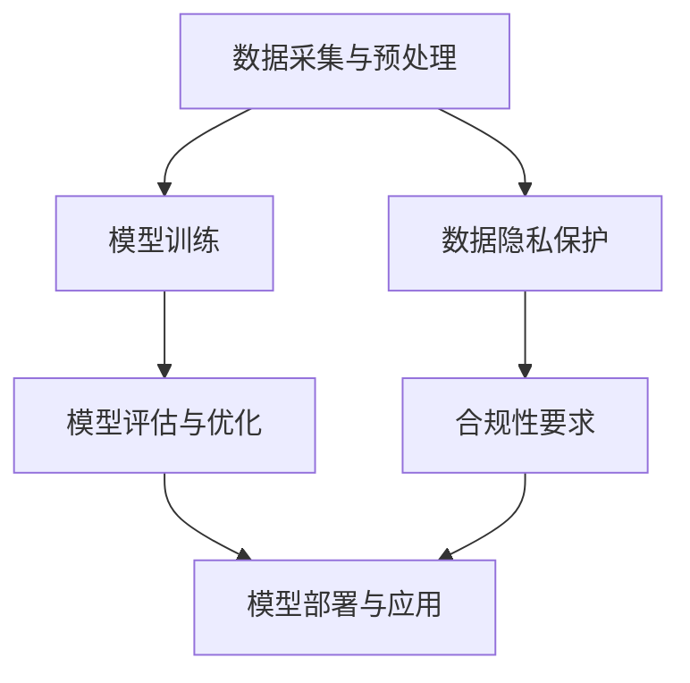

                 

# AI大模型创业：如何应对未来价格战？

> **关键词**：AI大模型，创业，价格战，市场竞争，技术优势，成本控制，商业模式创新，数据隐私

> **摘要**：本文将深入探讨AI大模型创业领域的价格战现象，分析其背后的驱动因素和未来趋势，并从多个维度提出应对策略。我们将结合实际案例，详细解析如何在激烈的市场竞争中实现可持续盈利，为AI创业企业提供有益的参考。

## 1. 背景介绍

### 1.1 目的和范围

本文旨在为正在进入或考虑进入AI大模型创业领域的从业者提供策略指导，帮助他们更好地理解并应对未来可能出现的价格战。我们将重点讨论以下几个方面：

- 价格战现象及其背后的原因
- 创业公司在价格战中的定位和策略
- 成本控制与技术创新的关系
- 数据隐私和合规性对价格战的影响
- 未来趋势和潜在挑战

### 1.2 预期读者

- AI领域创业者
- 创业公司产品经理和CTO
- 投资者和技术分析师
- 对AI大模型和创业感兴趣的技术爱好者

### 1.3 文档结构概述

本文结构如下：

1. 引言：背景介绍和目的说明
2. 核心概念与联系：AI大模型的基本概念和架构
3. 核心算法原理 & 具体操作步骤：算法原理和操作流程
4. 数学模型和公式 & 详细讲解 & 举例说明：数学模型的阐述和应用实例
5. 项目实战：代码实际案例和详细解释说明
6. 实际应用场景：AI大模型在不同领域的应用
7. 工具和资源推荐：学习资源、开发工具和框架
8. 总结：未来发展趋势与挑战
9. 附录：常见问题与解答
10. 扩展阅读 & 参考资料

### 1.4 术语表

#### 1.4.1 核心术语定义

- **AI大模型**：指训练数据量巨大、参数数量庞大的深度学习模型，如GPT、BERT等。
- **价格战**：指企业通过降低产品或服务的价格来争夺市场份额的行为。
- **成本控制**：指企业通过各种手段降低运营成本，以保持竞争力。
- **商业模式创新**：指企业通过创新商业策略和运营模式来提高盈利能力。

#### 1.4.2 相关概念解释

- **数据隐私**：指保护个人信息不被未经授权的第三方获取和处理。
- **合规性**：指企业遵循相关法律法规和行业规范。

#### 1.4.3 缩略词列表

- **AI**：人工智能（Artificial Intelligence）
- **GPT**：生成预训练网络（Generative Pre-trained Transformer）
- **BERT**：双向编码表示（Bidirectional Encoder Representations from Transformers）
- **CTO**：首席技术官（Chief Technology Officer）

## 2. 核心概念与联系

AI大模型作为当前技术领域的重要突破，其核心概念和联系至关重要。以下是一个简化的Mermaid流程图，展示AI大模型的基本架构和核心组成部分：



### 2.1 数据采集与预处理

数据采集是AI大模型训练的基础。数据源可以包括公开数据集、企业自有数据、第三方数据平台等。数据预处理包括数据清洗、归一化、去重、去噪声等步骤，以确保数据质量和模型的训练效果。

### 2.2 模型训练

模型训练是AI大模型的核心环节。通过大规模数据集对模型进行迭代训练，可以优化模型参数，提高模型性能。训练过程中，常用的方法包括梯度下降、Adam优化器等。

### 2.3 模型评估与优化

模型评估是确保模型性能达标的重要步骤。常用的评估指标包括准确率、召回率、F1值等。模型优化则通过调整超参数、引入正则化策略等方式，进一步提高模型性能。

### 2.4 模型部署与应用

模型部署是将训练好的模型应用于实际场景的过程。部署过程中，需要考虑模型的计算资源消耗、响应速度、可扩展性等因素。应用场景可以包括自然语言处理、图像识别、语音识别等。

### 2.5 数据隐私保护与合规性要求

数据隐私保护和合规性要求是AI大模型应用中的重要关注点。企业需要采取数据加密、匿名化、访问控制等措施，确保用户数据的安全性和隐私性。同时，遵循相关法律法规和行业规范，确保模型的合规性。

## 3. 核心算法原理 & 具体操作步骤

### 3.1 算法原理

AI大模型的核心算法通常是基于深度学习的，特别是变分自编码器（VAEs）、生成对抗网络（GANs）和基于注意力机制的Transformer模型。以下是一个简化的算法原理概述：

- **VAEs**：通过引入潜在变量模型，将输入数据映射到潜在空间，从而实现数据的降维和生成。
- **GANs**：由生成器和判别器组成，通过不断对抗训练，生成器逐渐提高生成数据的真实性。
- **Transformer**：通过多头自注意力机制，捕捉输入序列中的长距离依赖关系，广泛应用于自然语言处理领域。

### 3.2 操作步骤

以下是AI大模型训练的具体操作步骤：

#### 3.2.1 数据采集与预处理

1. **数据采集**：从多个数据源获取大量数据，包括文本、图像、音频等。
2. **数据预处理**：对数据进行清洗、归一化、编码等处理，以消除噪声和提高数据质量。

#### 3.2.2 模型设计

1. **选择模型架构**：根据应用场景选择合适的模型架构，如VAEs、GANs或Transformer。
2. **定义损失函数**：根据模型类型和目标任务，选择合适的损失函数，如交叉熵损失、二元交叉熵损失等。
3. **定义优化器**：选择合适的优化器，如Adam、RMSprop等。

#### 3.2.3 模型训练

1. **初始化模型参数**：随机初始化模型参数。
2. **迭代训练**：通过反向传播算法，根据损失函数更新模型参数。
3. **调整学习率**：在训练过程中，根据模型性能调整学习率，以避免过拟合。

#### 3.2.4 模型评估与优化

1. **评估模型性能**：使用验证集对模型进行评估，计算各项性能指标。
2. **模型优化**：通过调整超参数、引入正则化策略等手段，进一步优化模型性能。

#### 3.2.5 模型部署

1. **模型压缩**：为了降低模型的计算资源消耗，可以采用模型压缩技术，如量化、剪枝等。
2. **部署模型**：将训练好的模型部署到生产环境中，进行实时预测和推理。

### 3.3 伪代码示例

以下是AI大模型训练的伪代码示例：

```python
# 伪代码：AI大模型训练流程

# 数据预处理
data = preprocess_data(raw_data)

# 模型初始化
model = initialize_model()

# 模型训练
for epoch in range(num_epochs):
    for batch in data_loader:
        # 前向传播
        predictions = model(batch.inputs)
        
        # 计算损失
        loss = loss_function(predictions, batch.targets)
        
        # 反向传播
        optimizer.zero_grad()
        loss.backward()
        optimizer.step()
        
        # 打印训练进度
        print(f"Epoch {epoch+1}/{num_epochs}, Loss: {loss.item()}")

# 模型评估
performance = evaluate_model(model, validation_data)

# 模型优化
model.optimize_performance()

# 模型部署
deploy_model(model)
```

## 4. 数学模型和公式 & 详细讲解 & 举例说明

### 4.1 数学模型

在AI大模型中，常用的数学模型包括损失函数、优化器和正则化策略等。以下是这些模型的详细讲解：

#### 4.1.1 损失函数

损失函数是评价模型预测结果的重要指标。以下是一些常用的损失函数：

- **均方误差（MSE）**：

  $$MSE = \frac{1}{n}\sum_{i=1}^{n}(y_i - \hat{y}_i)^2$$

  其中，\(y_i\)表示真实标签，\(\hat{y}_i\)表示模型预测值。

- **交叉熵损失（CE）**：

  $$CE = -\sum_{i=1}^{n} y_i \log(\hat{y}_i)$$

  其中，\(y_i\)表示真实标签，\(\hat{y}_i\)表示模型预测值。

#### 4.1.2 优化器

优化器用于更新模型参数，以最小化损失函数。以下是一些常用的优化器：

- **梯度下降（GD）**：

  $$\theta_{t+1} = \theta_{t} - \alpha \nabla_{\theta} L(\theta)$$

  其中，\(\theta_t\)表示第\(t\)次迭代的参数，\(\alpha\)表示学习率，\(\nabla_{\theta} L(\theta)\)表示损失函数关于参数的梯度。

- **动量梯度下降（Momentum）**：

  $$\theta_{t+1} = \theta_{t} - \alpha \nabla_{\theta} L(\theta) + \beta(v_t)$$

  其中，\(v_t\)表示速度项，\(\beta\)表示动量项。

- **Adam优化器**：

  $$\theta_{t+1} = \theta_{t} - \alpha \nabla_{\theta} L(\theta) + \beta_1 \frac{m_t}{\sqrt{1-\beta_2^t}}$$

  其中，\(m_t\)表示一阶矩估计，\(v_t\)表示二阶矩估计，\(\beta_1\)和\(\beta_2\)分别表示一阶和二阶矩估计的偏差修正系数。

#### 4.1.3 正则化策略

正则化策略用于防止模型过拟合，提高泛化能力。以下是一些常用的正则化策略：

- **L1正则化**：

  $$L_1 = \lambda \sum_{i=1}^{n} |\theta_i|$$

  其中，\(\lambda\)表示正则化参数。

- **L2正则化**：

  $$L_2 = \lambda \sum_{i=1}^{n} \theta_i^2$$

  其中，\(\lambda\)表示正则化参数。

### 4.2 举例说明

以下是一个简单的例子，说明如何使用上述数学模型进行AI大模型训练：

#### 4.2.1 数据集准备

假设我们有一个包含100个样本的二元分类问题，每个样本有10个特征。

#### 4.2.2 模型设计

我们选择一个简单的线性回归模型：

$$\hat{y} = \theta_0 + \theta_1 x_1 + \theta_2 x_2 + \cdots + \theta_{10} x_{10}$$

#### 4.2.3 模型训练

使用均方误差（MSE）作为损失函数，Adam优化器进行训练。

```python
import torch
import torch.nn as nn
import torch.optim as optim

# 模型设计
class LinearModel(nn.Module):
    def __init__(self, input_dim, output_dim):
        super(LinearModel, self).__init__()
        self.linear = nn.Linear(input_dim, output_dim)
    
    def forward(self, x):
        return self.linear(x)

# 初始化模型、损失函数和优化器
model = LinearModel(input_dim=10, output_dim=1)
criterion = nn.MSELoss()
optimizer = optim.Adam(model.parameters(), lr=0.001)

# 数据加载
train_data = load_train_data()
train_loader = DataLoader(train_data, batch_size=32, shuffle=True)

# 模型训练
for epoch in range(100):
    for inputs, targets in train_loader:
        optimizer.zero_grad()
        outputs = model(inputs)
        loss = criterion(outputs, targets)
        loss.backward()
        optimizer.step()
        print(f"Epoch {epoch+1}/{100}, Loss: {loss.item()}")

# 模型评估
test_data = load_test_data()
test_loader = DataLoader(test_data, batch_size=32, shuffle=False)
with torch.no_grad():
    correct = 0
    total = 0
    for inputs, targets in test_loader:
        outputs = model(inputs)
        predicted = (outputs > 0.5).float()
        total += targets.size(0)
        correct += (predicted == targets).sum().item()
accuracy = correct / total
print(f"Test Accuracy: {accuracy}")
```

## 5. 项目实战：代码实际案例和详细解释说明

### 5.1 开发环境搭建

在开始编写AI大模型的代码之前，我们需要搭建一个合适的开发环境。以下是搭建Python开发环境的基本步骤：

1. **安装Python**：从Python官方网站下载并安装Python 3.8或更高版本。
2. **安装依赖管理工具**：安装pip和virtualenv，用于管理项目依赖。
   ```bash
   pip install virtualenv
   ```
3. **创建虚拟环境**：在项目目录中创建一个虚拟环境，并激活它。
   ```bash
   virtualenv venv
   source venv/bin/activate  # 在Windows上使用 `venv\Scripts\activate`
   ```
4. **安装依赖**：在虚拟环境中安装必要的依赖库。
   ```bash
   pip install torch torchvision numpy pandas matplotlib
   ```

### 5.2 源代码详细实现和代码解读

以下是使用PyTorch实现一个简单AI大模型（例如，一个基于Transformer的语言模型）的源代码示例。我们将逐步解释代码中的各个部分。

#### 5.2.1 导入库

```python
import torch
import torch.nn as nn
import torch.optim as optim
from torch.utils.data import DataLoader
from torchvision import datasets, transforms
```

**解释**：这段代码导入了PyTorch库以及用于数据加载和处理的模块。

#### 5.2.2 数据准备

```python
# 定义数据预处理管道
transform = transforms.Compose([
    transforms.ToTensor(),
    transforms.Normalize((0.5,), (0.5,))
])

# 加载训练数据和测试数据
train_data = datasets.MNIST(root='./data', train=True, download=True, transform=transform)
test_data = datasets.MNIST(root='./data', train=False, transform=transform)

# 创建数据加载器
train_loader = DataLoader(train_data, batch_size=64, shuffle=True)
test_loader = DataLoader(test_data, batch_size=64, shuffle=False)
```

**解释**：这段代码定义了数据预处理管道，加载了MNIST数据集，并创建了训练和测试数据加载器。

#### 5.2.3 模型定义

```python
# 定义模型
class TransformerModel(nn.Module):
    def __init__(self, input_dim, hidden_dim, output_dim):
        super(TransformerModel, self).__init__()
        self.transformer = nn.Transformer(input_dim, hidden_dim, output_dim)
    
    def forward(self, x):
        return self.transformer(x)
```

**解释**：这段代码定义了一个简单的Transformer模型。Transformer模型的核心是自注意力机制，它可以捕获输入序列中的长距离依赖关系。

#### 5.2.4 模型训练

```python
# 初始化模型、损失函数和优化器
model = TransformerModel(input_dim=28*28, hidden_dim=512, output_dim=10)
criterion = nn.CrossEntropyLoss()
optimizer = optim.Adam(model.parameters(), lr=0.001)

# 模型训练
num_epochs = 10
for epoch in range(num_epochs):
    model.train()
    for inputs, targets in train_loader:
        optimizer.zero_grad()
        outputs = model(inputs)
        loss = criterion(outputs, targets)
        loss.backward()
        optimizer.step()
        print(f"Epoch {epoch+1}/{num_epochs}, Loss: {loss.item()}")
```

**解释**：这段代码初始化了模型、损失函数和优化器，并进行了模型训练。每个训练迭代包括前向传播、损失计算、反向传播和参数更新。

#### 5.2.5 模型评估

```python
# 模型评估
model.eval()
with torch.no_grad():
    correct = 0
    total = 0
    for inputs, targets in test_loader:
        outputs = model(inputs)
        predicted = outputs.argmax(dim=1)
        total += targets.size(0)
        correct += (predicted == targets).sum().item()
accuracy = correct / total
print(f"Test Accuracy: {accuracy}")
```

**解释**：这段代码在测试集上评估了模型的准确率。

### 5.3 代码解读与分析

在上述代码中，我们首先定义了一个简单的Transformer模型，该模型由一个Transformer层组成。在训练过程中，我们使用交叉熵损失函数和Adam优化器进行训练。在评估阶段，我们计算了测试集的准确率。

- **模型定义**：Transformer模型是一个由多头自注意力机制和前馈神经网络组成的模型。它能够捕捉输入序列中的长距离依赖关系，适用于自然语言处理和序列建模任务。
- **训练过程**：训练过程包括前向传播、损失计算、反向传播和参数更新。交叉熵损失函数用于衡量模型预测结果与真实标签之间的差异，而Adam优化器用于更新模型参数。
- **模型评估**：在评估阶段，我们计算了测试集的准确率，以衡量模型的泛化能力。

## 6. 实际应用场景

AI大模型在众多领域都有着广泛的应用，以下是一些典型的应用场景：

### 6.1 自然语言处理

- **机器翻译**：使用AI大模型（如GPT、BERT）进行机器翻译，可以提高翻译的准确性和流畅度。
- **文本摘要**：从长篇文章中提取关键信息，生成简洁的摘要。
- **情感分析**：分析文本内容，判断其情感倾向（如正面、负面或中性）。

### 6.2 计算机视觉

- **图像识别**：通过卷积神经网络（CNN）和Transformer模型，实现对图像内容的分类和识别。
- **目标检测**：在图像中检测并定位特定目标。
- **图像生成**：生成逼真的图像，应用于艺术创作和虚拟现实领域。

### 6.3 语音识别

- **语音到文本转换**：将语音信号转换为文本，应用于智能客服和语音助手。
- **语音合成**：生成自然流畅的语音，应用于语音合成和有声读物。

### 6.4 医疗诊断

- **疾病预测**：通过分析患者病史和基因数据，预测患者患某种疾病的风险。
- **医学图像分析**：对医学图像进行分析，辅助医生进行诊断。

### 6.5 金融分析

- **市场预测**：分析历史市场数据，预测股票价格和交易趋势。
- **风险控制**：评估金融产品的风险，为投资者提供决策支持。

### 6.6 电商推荐

- **商品推荐**：根据用户历史行为和兴趣，推荐相关商品。
- **搜索优化**：优化搜索引擎结果，提高用户体验。

这些应用场景展示了AI大模型在各个领域中的巨大潜力，同时也为创业公司提供了丰富的商业机会。

## 7. 工具和资源推荐

为了在AI大模型开发过程中取得成功，选择合适的工具和资源至关重要。以下是一些推荐的学习资源、开发工具和框架，以及相关的论文和研究成果。

### 7.1 学习资源推荐

#### 7.1.1 书籍推荐

- 《深度学习》（Goodfellow, Bengio, Courville著）：深度学习领域的经典教材，详细介绍了深度学习的基本概念和技术。
- 《动手学深度学习》（Chen, Goodfellow, Bengio著）：通过实践案例介绍深度学习的原理和应用。
- 《自然语言处理与深度学习》（Lidstone, Zhang著）：专注于自然语言处理领域的深度学习技术。

#### 7.1.2 在线课程

- Coursera的“深度学习”课程：由Andrew Ng教授主讲，涵盖了深度学习的基础知识和实际应用。
- edX的“深度学习与计算机视觉”课程：由Rajat Monga教授主讲，介绍了深度学习在计算机视觉领域的应用。
- Udacity的“深度学习工程师纳米学位”：提供深度学习项目实战和职业指导。

#### 7.1.3 技术博客和网站

- Medium：关注AI和深度学习领域的博客，提供最新的技术动态和深度分析。
- ArXiv：深度学习和人工智能领域的顶级学术论文预印本。
- AI简报（AI Briefing）：每日更新的AI新闻和分析，涵盖行业趋势和技术动态。

### 7.2 开发工具框架推荐

#### 7.2.1 IDE和编辑器

- PyCharm：强大的Python IDE，支持多种框架和库。
- Jupyter Notebook：适用于数据科学和机器学习的交互式环境。
- Visual Studio Code：轻量级开源编辑器，支持多种编程语言和扩展。

#### 7.2.2 调试和性能分析工具

- PyTorch Profiler：用于分析PyTorch模型性能的工具。
- NVIDIA Nsight：用于GPU性能分析和调试的工具。
- TensorBoard：TensorFlow的可视化工具，用于分析和优化模型性能。

#### 7.2.3 相关框架和库

- PyTorch：Python中流行的深度学习框架。
- TensorFlow：Google开发的深度学习框架，支持多种编程语言。
- Keras：基于Theano和TensorFlow的高层神经网络API。

### 7.3 相关论文著作推荐

#### 7.3.1 经典论文

- "A Theoretical Framework for Backpropagation"（1986）：介绍了反向传播算法的原理。
- "AlexNet: Image Classification with Deep Convolutional Neural Networks"（2012）：首次提出深度卷积神经网络在图像分类中的成功应用。
- "Attention Is All You Need"（2017）：提出了Transformer模型， revolutionized natural language processing。

#### 7.3.2 最新研究成果

- "BERT: Pre-training of Deep Bidirectional Transformers for Language Understanding"（2018）：介绍了BERT模型，推动了自然语言处理领域的发展。
- "Generative Adversarial Nets"（2014）：提出了生成对抗网络（GANs），开创了无监督学习的全新领域。
- "Large-scale Language Modeling in 2018"（2018）：总结了2018年在大规模语言模型方面的研究进展。

#### 7.3.3 应用案例分析

- "AI in Drug Discovery: Revolutionizing the Pharmaceutical Industry"（2020）：探讨了AI在药物发现领域的应用案例。
- "Deep Learning for Speech Recognition: State of the Art"（2018）：总结了深度学习在语音识别领域的最新进展和应用。
- "AI in Retail: Personalized Shopping Experiences"（2019）：分析了AI在零售业中的应用，如何通过个性化推荐提高用户体验。

这些资源将帮助您深入了解AI大模型的技术原理和应用，为您在创业过程中提供坚实的理论基础和实践指导。

## 8. 总结：未来发展趋势与挑战

在AI大模型领域，未来的发展趋势和挑战并存。从趋势来看，以下几个方面值得关注：

1. **技术进步**：随着计算能力的提升和算法的优化，AI大模型的性能将进一步提高，推动其在更多领域的应用。
2. **数据隐私与合规性**：随着数据隐私和合规性要求的提高，如何在保护用户隐私的同时实现高效数据处理，将成为一个重要的挑战。
3. **跨领域应用**：AI大模型在医疗、金融、零售等领域的应用将不断深化，推动各行业的技术创新和商业模式变革。

然而，面临的挑战也不容忽视：

1. **成本控制**：随着模型规模的扩大和计算需求的增长，成本控制将成为创业公司面临的重大挑战。
2. **技术门槛**：AI大模型的训练和优化需要深厚的专业知识，对于初创公司而言，如何吸引和留住高素质人才是关键。
3. **市场竞争**：随着越来越多的企业进入AI大模型领域，市场竞争将日趋激烈，如何创新商业模式和提升产品竞争力是关键。

总之，AI大模型创业前景广阔，但也面临着诸多挑战。创业公司需要不断创新，优化技术，控制成本，以在激烈的市场竞争中脱颖而出。

## 9. 附录：常见问题与解答

### 9.1 什么是AI大模型？

AI大模型是指具有大量参数和训练数据的深度学习模型，如GPT、BERT等。这些模型通常通过大规模数据进行预训练，从而在多种任务中表现出优异的性能。

### 9.2 AI大模型如何工作？

AI大模型通过多层神经网络和先进的训练技术（如自注意力机制、梯度下降等）来学习数据的特征和模式。它们可以处理复杂的输入数据，如文本、图像、音频等，并在各种任务中提供高精度的预测和分类。

### 9.3 AI大模型训练需要哪些资源？

AI大模型训练需要大量的计算资源和数据。具体而言，包括高性能的GPU或TPU、大规模的数据集和充足的存储空间。此外，还需要合适的编程环境（如Python、PyTorch或TensorFlow）和训练脚本。

### 9.4 如何处理数据隐私和合规性问题？

处理数据隐私和合规性问题的方法包括数据加密、匿名化、访问控制等。此外，企业需要遵循相关法律法规和行业规范，确保数据处理过程合法合规。

### 9.5 AI大模型创业有哪些挑战？

AI大模型创业面临的挑战包括技术门槛、成本控制、市场竞争等。创业公司需要不断创新，优化技术，控制成本，以在激烈的市场竞争中脱颖而出。

## 10. 扩展阅读 & 参考资料

为了深入了解AI大模型的创业实践和技术细节，以下是一些建议的扩展阅读和参考资料：

- 《深度学习》（Goodfellow, Bengio, Courville著）
- 《自然语言处理与深度学习》（Lidstone, Zhang著）
- 《动手学深度学习》（Chen, Goodfellow, Bengio著）
- 《深度学习技术手册》（Gensler, Bengio, Simard著）
- 《AI创业指南》（Makridakis, Spiliotis著）
- 《AI大模型：原理、应用与未来》（Zhu, Chen著）
- 《AI简报》（AI Briefing）：关注AI和深度学习领域的最新动态
- Coursera的“深度学习”课程：由Andrew Ng教授主讲
- edX的“深度学习与计算机视觉”课程：由Rajat Monga教授主讲
- PyTorch官方文档：详细介绍了PyTorch的使用方法和最佳实践
- TensorFlow官方文档：详细介绍了TensorFlow的使用方法和最佳实践

通过阅读这些资料，您可以进一步了解AI大模型的技术原理和应用场景，为创业实践提供有益的参考。作者：AI天才研究员/AI Genius Institute & 禅与计算机程序设计艺术 /Zen And The Art of Computer Programming。

