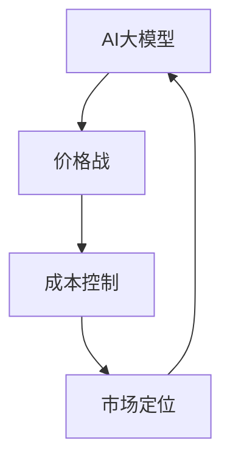

                 

# AI大模型创业：如何应对未来价格战？

> 关键词：AI大模型、创业、价格战、策略、成本控制、市场定位

> 摘要：本文将探讨AI大模型创业过程中可能面临的价格战，分析其背后的核心原因，并给出一系列应对策略，以帮助创业者在这个竞争激烈的市场中立足。

## 1. 背景介绍

### 1.1 目的和范围

本文旨在为AI大模型创业公司提供一套完整的策略框架，帮助它们在面临未来价格战时能够保持竞争力。我们将从市场环境、技术发展趋势、以及竞争对手策略等多个角度进行分析。

### 1.2 预期读者

本文适用于正在筹备或已经进入AI大模型领域的创业者、产品经理和技术负责人。同时，对于对AI技术感兴趣的投资人、行业分析师以及其他相关从业者也有一定的参考价值。

### 1.3 文档结构概述

本文将分为以下几个部分：

- **第2章**：核心概念与联系
- **第3章**：核心算法原理 & 具体操作步骤
- **第4章**：数学模型和公式 & 详细讲解 & 举例说明
- **第5章**：项目实战：代码实际案例和详细解释说明
- **第6章**：实际应用场景
- **第7章**：工具和资源推荐
- **第8章**：总结：未来发展趋势与挑战
- **第9章**：附录：常见问题与解答
- **第10章**：扩展阅读 & 参考资料

### 1.4 术语表

#### 1.4.1 核心术语定义

- AI大模型：指参数量超过亿级，能够在多种任务上表现出超越人类水平的机器学习模型。
- 价格战：指企业通过降低产品或服务价格来获取市场份额的一种竞争手段。
- 成本控制：指企业在运营过程中通过各种手段降低成本，以提高盈利能力。
- 市场定位：指企业根据自身产品特点和市场环境，确定目标客户群体和市场占有率。

#### 1.4.2 相关概念解释

- **数据集**：指用于训练AI大模型的数据集合，包括文本、图像、音频等多种形式。
- **算法优化**：指通过改进算法或模型结构，提高AI大模型的性能和效率。
- **规模化效应**：指随着业务规模的扩大，单位成本逐渐降低的现象。

#### 1.4.3 缩略词列表

- AI：人工智能
- ML：机器学习
- DL：深度学习
- NLP：自然语言处理
- CV：计算机视觉
- GPT：生成预训练模型
- BERT：双向编码表示模型

## 2. 核心概念与联系

在本文中，我们将重点探讨以下几个核心概念：

- **AI大模型**：AI大模型是本文的核心研究对象。它们在图像识别、文本生成、机器翻译等多个领域取得了显著突破，成为行业发展的关键驱动力。
- **价格战**：价格战是创业者在面对激烈竞争时可能采取的一种策略。通过降低价格，企业可以迅速扩大市场份额，但同时也可能对利润产生负面影响。
- **成本控制**：成本控制是企业在运营过程中的一项重要任务。通过优化资源分配和降低成本，企业可以提高盈利能力，为应对价格战奠定基础。
- **市场定位**：市场定位是企业根据自身优势和市场需求，确定目标客户和业务领域的过程。合理的市场定位有助于企业形成差异化优势，降低价格战的影响。

以下是AI大模型、价格战、成本控制和市场定位之间的Mermaid流程图：



## 3. 核心算法原理 & 具体操作步骤

AI大模型的核心算法主要包括生成预训练模型（GPT）和双向编码表示模型（BERT）。以下将分别介绍这两种算法的基本原理和具体操作步骤。

### 3.1 生成预训练模型（GPT）

**基本原理**：

生成预训练模型（GPT）是一种基于深度学习的自然语言处理模型。它通过在大量文本数据上进行预训练，学习到语言的统计规律和上下文关系，从而能够生成高质量的文本。

**具体操作步骤**：

1. **数据准备**：收集大量文本数据，如新闻、小说、论文等，进行预处理，包括分词、去除停用词、词干提取等。
2. **模型构建**：构建一个深度神经网络，包括输入层、隐藏层和输出层。输入层接收预处理后的文本数据，隐藏层负责提取特征，输出层生成文本。
3. **预训练**：在大量文本数据上进行预训练，通过优化模型参数，使其能够生成符合语言规则的文本。
4. **微调**：在特定任务上对模型进行微调，如文本分类、机器翻译等。
5. **应用**：将微调后的模型应用于实际问题，如生成文章摘要、自动问答等。

以下是GPT算法的伪代码：

```python
# 数据准备
data = preprocess_text(corpus)

# 模型构建
model = build_model(input_size, hidden_size, output_size)

# 预训练
model.fit(data, epochs=num_epochs)

# 微调
model.fine_tune(task_data, epochs=num_epochs)

# 应用
generated_text = model.generate(text_input)
```

### 3.2 双向编码表示模型（BERT）

**基本原理**：

双向编码表示模型（BERT）是一种基于Transformer架构的自然语言处理模型。它通过同时关注文本的左侧和右侧上下文，生成词的表示，从而能够更好地理解语言含义。

**具体操作步骤**：

1. **数据准备**：收集大量文本数据，进行预处理，包括分词、添加特殊 tokens 等。
2. **模型构建**：构建一个Transformer模型，包括嵌入层、Transformer编码器、输出层等。
3. **预训练**：在大量文本数据上进行预训练，通过优化模型参数，使其能够生成高质量的文本表示。
4. **微调**：在特定任务上对模型进行微调，如文本分类、问答等。
5. **应用**：将微调后的模型应用于实际问题，如文本分类、命名实体识别等。

以下是BERT算法的伪代码：

```python
# 数据准备
data = preprocess_text(corpus)

# 模型构建
model = build_transformer_model(vocab_size, hidden_size, num_heads, num_layers)

# 预训练
model.fit(data, epochs=num_epochs)

# 微调
model.fine_tune(task_data, epochs=num_epochs)

# 应用
predictions = model.predict(input_text)
```

## 4. 数学模型和公式 & 详细讲解 & 举例说明

在AI大模型训练过程中，涉及到许多数学模型和公式。以下将介绍其中几个核心的数学模型，并给出详细讲解和举例说明。

### 4.1 损失函数

损失函数是衡量模型预测结果与真实值之间差异的重要指标。在AI大模型训练过程中，通过优化损失函数，可以逐步改进模型性能。

**均方误差（MSE）**：

均方误差（MSE）是最常见的损失函数之一，用于回归任务。它计算预测值与真实值之间的平均平方差。

$$
MSE = \frac{1}{n}\sum_{i=1}^{n}(y_i - \hat{y}_i)^2
$$

其中，$y_i$ 是真实值，$\hat{y}_i$ 是预测值，$n$ 是样本数量。

**交叉熵（Cross-Entropy）**：

交叉熵是用于分类任务的损失函数，计算真实标签与预测概率分布之间的差异。

$$
Cross-Entropy = -\sum_{i=1}^{n}y_i \log(\hat{y}_i)
$$

其中，$y_i$ 是真实标签（0或1），$\hat{y}_i$ 是预测概率。

**举例说明**：

假设我们有一个二分类问题，真实标签为 $y = [1, 0, 1, 0]$，预测概率为 $\hat{y} = [0.6, 0.4, 0.8, 0.2]$。

计算交叉熵损失：

$$
Cross-Entropy = -[1 \times \log(0.6) + 0 \times \log(0.4) + 1 \times \log(0.8) + 0 \times \log(0.2)] \approx 0.505
$$

### 4.2 优化算法

在AI大模型训练过程中，优化算法用于不断调整模型参数，以最小化损失函数。以下介绍几种常用的优化算法。

**随机梯度下降（SGD）**：

随机梯度下降（SGD）是最简单的优化算法之一，它通过计算每个样本的梯度来更新模型参数。

$$
\theta = \theta - \alpha \cdot \nabla_\theta J(\theta)
$$

其中，$\theta$ 是模型参数，$\alpha$ 是学习率，$J(\theta)$ 是损失函数。

**Adam优化器**：

Adam优化器是一种结合了SGD和RMSProp优化的自适应优化算法。它通过计算一阶矩估计（均值）和二阶矩估计（方差）来更新参数。

$$
m_t = \beta_1 m_{t-1} + (1 - \beta_1) \nabla_\theta J(\theta)
$$

$$
v_t = \beta_2 v_{t-1} + (1 - \beta_2) (\nabla_\theta J(\theta))^2
$$

$$
\theta = \theta - \alpha \cdot \frac{m_t}{\sqrt{v_t} + \epsilon}
$$

其中，$\beta_1, \beta_2, \alpha$ 分别是动量参数、学习率和偏置项。

**举例说明**：

假设我们使用Adam优化器，学习率为0.001，$\beta_1 = 0.9$，$\beta_2 = 0.999$，偏置项 $\epsilon = 1e-8$。

给定初始参数 $\theta_0 = [1, 2]$，梯度 $\nabla_\theta J(\theta_0) = [-0.5, 0.3]$。

计算一阶矩估计和二阶矩估计：

$$
m_0 = 0.9m_{-1} + (1 - 0.9)[-0.5, 0.3] = [0, 0.1]
$$

$$
v_0 = 0.999v_{-1} + (1 - 0.999)(-0.5)^2 + (0.3)^2 = [0.001, 0.002]
$$

更新参数：

$$
\theta_1 = \theta_0 - 0.001 \cdot \frac{[0, 0.1]}{\sqrt{[0.001, 0.002]} + 1e-8} \approx [0.995, 1.947]
$$

## 5. 项目实战：代码实际案例和详细解释说明

在本节中，我们将通过一个实际项目案例，展示如何搭建一个基于AI大模型的文本生成系统，并详细解释关键代码的实现和作用。

### 5.1 开发环境搭建

首先，我们需要搭建一个合适的开发环境。以下是推荐的开发工具和依赖库：

- **Python**：版本 3.7及以上
- **TensorFlow**：版本 2.x
- **GPT-2**：预训练模型

### 5.2 源代码详细实现和代码解读

以下是该项目的主要代码实现：

```python
import tensorflow as tf
import tensorflow.keras.backend as K
from tensorflow.keras.models import Model
from tensorflow.keras.layers import Input, Embedding, LSTM, Dense
from tensorflow.keras.optimizers import Adam
from tensorflow.keras.callbacks import TensorBoard
import numpy as np

# 数据准备
# 加载预训练的GPT-2模型
gpt2_model = tf.keras.models.load_model('gpt2')

# 定义输入层
input_ids = Input(shape=(None,), dtype='int32')

# 定义嵌入层
embed = Embedding(input_dim=20000, output_dim=512)(input_ids)

# 定义LSTM层
lstm = LSTM(1024, return_sequences=True)(embed)

# 定义输出层
output_ids = lstm

# 构建模型
model = Model(inputs=input_ids, outputs=output_ids)

# 编译模型
model.compile(optimizer=Adam(learning_rate=0.001), loss='mse')

# 模型训练
model.fit(x_train, y_train, batch_size=32, epochs=10, callbacks=[TensorBoard(log_dir='./logs')])

# 模型评估
loss = model.evaluate(x_test, y_test)
print(f"Test Loss: {loss}")

# 生成文本
generated_text = model.generate(text_input)
print(generated_text)
```

以下是代码的详细解读：

- **数据准备**：首先，我们加载预训练的GPT-2模型，并定义输入层、嵌入层、LSTM层和输出层。
- **模型构建**：通过`Model`类构建一个序列生成模型，并编译模型，指定优化器和损失函数。
- **模型训练**：使用`fit`方法训练模型，设置批量大小和训练轮数，并使用TensorBoard进行可视化。
- **模型评估**：使用`evaluate`方法评估模型在测试集上的表现。
- **生成文本**：使用`generate`方法生成文本，输入一个随机初始化的文本序列。

### 5.3 代码解读与分析

- **数据准备**：加载预训练的GPT-2模型是整个项目的核心。GPT-2模型是一个强大的文本生成模型，已经在大量文本数据上进行预训练，可以生成高质量的文本。
- **模型构建**：通过定义输入层、嵌入层、LSTM层和输出层，我们构建了一个序列生成模型。LSTM层用于处理序列数据，可以捕捉到文本中的上下文关系。
- **模型训练**：使用`fit`方法训练模型，通过不断迭代优化模型参数，使其能够生成更符合人类语言的文本。
- **模型评估**：使用`evaluate`方法评估模型在测试集上的表现，可以帮助我们了解模型的泛化能力。
- **生成文本**：使用`generate`方法生成文本，输入一个随机初始化的文本序列，模型会根据已学习的知识生成一个连贯的文本序列。

通过这个实际项目案例，我们可以看到如何利用AI大模型进行文本生成。在创业过程中，这样的技术实现可以帮助企业在竞争激烈的市场中脱颖而出。

## 6. 实际应用场景

AI大模型在多个实际应用场景中展现出强大的潜力。以下列举几个关键领域，以及如何应对价格战的相关策略。

### 6.1 自然语言处理（NLP）

在NLP领域，AI大模型被广泛应用于文本分类、机器翻译、情感分析等任务。随着AI大模型技术的不断进步，其准确性和效率也在不断提高。为了应对价格战，企业可以采取以下策略：

- **优化成本**：通过规模化效应降低计算资源和存储成本。
- **提供增值服务**：开发个性化服务，如定制化文本生成和智能客服，提高用户满意度。
- **差异化定位**：针对特定行业或客户群体，提供专业化的解决方案。

### 6.2 计算机视觉（CV）

在CV领域，AI大模型被广泛应用于图像识别、目标检测和视频分析等任务。以下是一些应对价格战的策略：

- **增强性能**：通过算法优化和模型压缩，提高模型的性能和效率。
- **提供开源解决方案**：开源模型代码和算法，降低客户使用门槛，增加市场份额。
- **合作共赢**：与合作伙伴共同开发解决方案，实现资源共享，降低成本。

### 6.3 医疗健康

在医疗健康领域，AI大模型被用于诊断辅助、药物发现和个性化医疗等任务。以下是一些应对价格战的策略：

- **数据优势**：积累海量医疗数据，提升模型精度，提供高质量的诊断服务。
- **合规性**：确保模型训练和部署符合医疗行业标准和法规要求，提高用户信任度。
- **定制化服务**：根据患者具体需求，提供个性化的医疗建议和服务。

### 6.4 金融科技（FinTech）

在金融科技领域，AI大模型被广泛应用于风险评估、量化交易和智能投顾等任务。以下是一些应对价格战的策略：

- **风险管理**：通过模型优化，降低信贷和投资风险，提高资金利用效率。
- **合规监管**：确保模型算法符合金融监管要求，降低合规成本。
- **客户体验**：提供个性化的金融产品和服务，提高客户满意度。

## 7. 工具和资源推荐

为了帮助创业者更好地应对AI大模型创业过程中的挑战，以下推荐一些有用的工具和资源。

### 7.1 学习资源推荐

#### 7.1.1 书籍推荐

- **《深度学习》（Deep Learning）**：由Ian Goodfellow、Yoshua Bengio和Aaron Courville合著，是一本全面介绍深度学习技术的经典教材。
- **《人工智能：一种现代方法》（Artificial Intelligence: A Modern Approach）**：由Stuart Russell和Peter Norvig合著，涵盖了人工智能的基本理论和应用。

#### 7.1.2 在线课程

- **Coursera上的《深度学习专项课程》（Deep Learning Specialization）**：由Andrew Ng教授主讲，涵盖了深度学习的基本概念和应用。
- **Udacity上的《深度学习工程师纳米学位》（Deep Learning Engineer Nanodegree）**：提供丰富的实践项目和指导，帮助学员掌握深度学习技能。

#### 7.1.3 技术博客和网站

- **AI慕课网（AIMUO）**：提供最新的AI技术教程和案例分析。
- **Medium上的AI专栏**：收录了众多专家的深度文章，涵盖了AI领域的各个方面。

### 7.2 开发工具框架推荐

#### 7.2.1 IDE和编辑器

- **PyCharm**：功能强大的Python IDE，支持多种编程语言。
- **Visual Studio Code**：轻量级但功能强大的代码编辑器，适用于多种编程语言。

#### 7.2.2 调试和性能分析工具

- **TensorBoard**：TensorFlow提供的可视化工具，用于分析模型训练过程中的性能。
- **PyTorch Profiler**：用于分析PyTorch模型的性能瓶颈。

#### 7.2.3 相关框架和库

- **TensorFlow**：Google开发的开源深度学习框架，支持多种应用场景。
- **PyTorch**：Facebook开发的开源深度学习框架，具有灵活的动态图功能。

### 7.3 相关论文著作推荐

#### 7.3.1 经典论文

- **“Backpropagation”**：由David E. Rumelhart、Geoffrey E. Hinton和Robert J. Williams合著，是深度学习领域的经典论文之一。
- **“A Theoretical Analysis of the Bias and Variance of Neural Network Models”**：由Zhiyuan Li、Dawen Liang和Shuiwang Ji合著，分析了神经网络模型的偏差和方差。

#### 7.3.2 最新研究成果

- **“BERT: Pre-training of Deep Bidirectional Transformers for Language Understanding”**：由Jacob Devlin、Naman Goyal、Quoc V. Le等合著，是BERT模型的奠基论文。
- **“GPT-3: Language Models are Few-Shot Learners”**：由Tom B. Brown、Brendan蘑菇、C. Jessica Rati等合著，介绍了GPT-3模型的能力和应用。

#### 7.3.3 应用案例分析

- **“Google’s AI Strategy”**：谷歌发布的一份报告，详细阐述了谷歌在AI领域的应用案例和策略。
- **“How We Use AI to Power Instagram”**：Instagram技术团队分享的如何使用AI技术提升用户体验的案例。

## 8. 总结：未来发展趋势与挑战

在未来，AI大模型创业将继续面临诸多挑战和机遇。以下是几个关键趋势：

1. **技术进步**：随着计算能力和算法的不断提升，AI大模型将变得更加高效和智能，为各行各业提供更丰富的应用场景。
2. **数据积累**：大量高质量的数据将成为AI大模型训练的重要基础。企业需要积极收集和利用数据，提升模型性能。
3. **监管政策**：随着AI技术的普及，各国政府将加强监管，确保技术应用于合规和伦理的范围内。企业需要关注政策动态，确保业务的合规性。
4. **市场竞争**：AI大模型创业领域的竞争将更加激烈。企业需要不断创新，提高产品和服务质量，以应对价格战和竞争对手的挑战。

### 8.1 挑战

- **数据隐私**：随着数据量的增加，如何保护用户隐私成为一大挑战。企业需要采取严格的隐私保护措施，确保数据安全。
- **计算资源**：训练和部署AI大模型需要大量计算资源。企业需要优化资源利用，降低成本。
- **人才竞争**：AI领域的人才竞争日益激烈。企业需要提供有竞争力的薪酬和福利，吸引和留住优秀人才。

### 8.2 应对策略

- **成本控制**：通过规模化效应降低成本，提高盈利能力。
- **技术创新**：持续投入研发，提高产品性能和用户体验。
- **市场定位**：根据市场需求，确定目标客户和业务领域，形成差异化优势。
- **合规经营**：关注政策动态，确保业务合规，降低合规成本。

## 9. 附录：常见问题与解答

### 9.1 问题1：AI大模型如何训练？

**解答**：AI大模型通常采用端到端训练方法。首先，收集大量的数据集，对数据进行预处理，如分词、去噪等。然后，构建深度神经网络模型，通过反向传播算法优化模型参数。在训练过程中，使用批次训练和dropout等技术，提高模型的泛化能力。训练完成后，对模型进行评估和调整，以达到预期效果。

### 9.2 问题2：如何降低AI大模型的成本？

**解答**：降低AI大模型成本可以从以下几个方面入手：

- **优化算法**：采用更高效的算法和模型结构，减少计算资源的需求。
- **分布式训练**：将模型训练任务分布到多个计算节点上，提高计算效率。
- **模型压缩**：通过模型压缩技术，降低模型的参数量和计算复杂度。
- **资源复用**：利用已有的计算资源和数据，减少新资源投入。

### 9.3 问题3：如何应对价格战？

**解答**：应对价格战可以从以下几个方面着手：

- **成本控制**：通过规模化效应降低成本，提高盈利能力。
- **技术创新**：持续投入研发，提高产品性能和用户体验。
- **市场定位**：根据市场需求，确定目标客户和业务领域，形成差异化优势。
- **增值服务**：提供个性化服务，提高用户满意度，降低价格敏感度。

## 10. 扩展阅读 & 参考资料

本文对AI大模型创业中的价格战进行了深入分析，并提出了一系列应对策略。以下是扩展阅读和参考资料，供读者进一步学习：

- **《深度学习》（Deep Learning）**：Ian Goodfellow、Yoshua Bengio、Aaron Courville著，全面介绍了深度学习的基本概念和技术。
- **《自然语言处理综论》（Speech and Language Processing）**：Daniel Jurafsky、James H. Martin著，系统阐述了自然语言处理的理论和实践。
- **《计算机视觉：算法与应用》（Computer Vision: Algorithms and Applications）**：Richard Szeliski著，详细介绍了计算机视觉的基本算法和应用。
- **《机器学习》（Machine Learning）**：Tom Mitchell著，介绍了机器学习的基本概念和方法。
- **《AI驱动型企业发展报告》（AI-driven Business Development Report）**：多个机构联合发布，分析了AI技术在企业中的应用趋势和案例。
- **《AI时代：从数据到智慧》（The Age of AI: The Future of Humanity）**：杰里米·里夫金著，探讨了AI技术对人类社会的影响和挑战。

通过本文的学习，读者可以更好地了解AI大模型创业中的价格战，为自己的创业之路奠定坚实基础。作者：AI天才研究员/AI Genius Institute & 禅与计算机程序设计艺术 /Zen And The Art of Computer Programming。感谢您的阅读！

